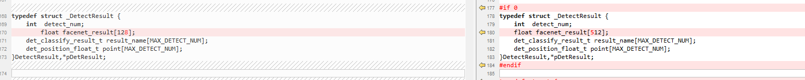

--

有一块AB311_B1-T962E2的板子。打算在这个板子上熟悉一下NPU的使用。

NPU是VeriSilicon的。

驱动代码是在外面的。

hardware/aml-4.9/npu/nanoq目录下。

有个npu_app的仓库，

platform/hardware/verisilicon/npu_app

比较大，有5.8G。里面大部分都是模型文件。

编译都是build_vx.sh脚本来做。

AB311的编译不过。

换了一块AF400-C305X的板子。

这个板子的基本情况：

```
Flash 8G
DDR 2G
带SD卡
博通wifi
千兆以太网
```

芯片本身的参数：

Amlogic C305X是一款专为人工智能机器视觉应用打造的通用型SoC，

采用11nm制程工艺，

集成两个ARM A35架构核心，

内置独立的NPU，可提供2 TOPS算力支持。

从配置来看，C305X算是C308X的低配版，

更加适合单一场景的算法模型，避免算力浪费，降低部署成本。


默认是索尼IMX335的sensor。

视频编码支持4K的H264和H265 。

NPU DDK支持到6.4.2.1版本。

TensorFlow支持2.0.0版本，Keras2.2.5版本，PyTorch1.2.0版本。


Amlogic NN SDK V1.5

板子的串口波特率是921600。

CPU信息

```
# lscpu
Architecture:                    aarch64
CPU op-mode(s):                  32-bit, 64-bit
Byte Order:                      Little Endian
CPU(s):                          2
On-line CPU(s) list:             0,1
Thread(s) per core:              1
Core(s) per socket:              2
Socket(s):                       1
Vendor ID:                       ARM
Model:                           0
Model name:                      Cortex-A35
Stepping:                        r1p0
CPU max MHz:                     2016.0000
CPU min MHz:                     100.0000
BogoMIPS:                        48.00
Vulnerability L1tf:              Not affected
Vulnerability Mds:               Not affected
Vulnerability Meltdown:          Not affected
Vulnerability Spec store bypass: Not affected
Vulnerability Spectre v1:        Mitigation; __user pointer sanitization
Vulnerability Spectre v2:        Not affected
Flags:                           fp asimd evtstrm aes pmull sha1 sha2 crc32 cpui
                                 d
```

分析一下demo板的开机脚本

```
S45ipc-property     
	启动这个进程ipc-property-service
	配置文件/etc/ipc/config.json
S45ipc-system-service
	ipc-system-service
S49ipc_webui         
S81ipc-refapp
S89usbgadget
S91onvif_srvd
S91onvif_wsdd
```

现在就要分析默认有没有使用NPU？如果有，是怎么用的？

如果没有，怎么用起来？

先分析一下默认的buildroot配置。看看选配了哪些组件。

配置文件是c2_af400_uvc.config。

看一下开机打印。

没有什么特别的。就内核默认把npu的配置打开了。

```
[    2.281656@0] npu_version: 4
[    2.282686@0] Galcore version 6.4.3.279124CB
```


**模型运行过程中出错，如何确认问题点？**

解答：

- 确认板子上是否有NPU环境
  确认NN模型加载：lsmod 结果中有galcore

确认有NN设备节点：ls  -l  /dev/galcore 权限为664

- 确认当前转的nbg代码是否与板子一致

  参照3.1.4问题

- 查看具体错误点

设置环境变量，然后再次执行程序。

export VSI_NN_LOG_LEVEL=4

export VIV_VX_DEBUG_LEVEL=1

- 问题分析

1.如果第一步、第三步出错，直接反馈给Amlogic工程师

2.如果第二步出错，重新转换nbg文件再次运行。


配置npu的clock

```
nn 在最近release的driver 6.4.2.1 上支持设置clk，方法如下（假如改为500M）：

1. echo 500000000 >/sys/module/galcore/parameters/nanoqFreq   
2.  设置nna_axi:
    echo nna_axi_gate > /sys/kernel/debug/clk_debug/clk
    echo 500000000 > /sys/kernel/debug/clk_debug/rate
    echo 1 > /sys/kernel/debug/clk_debug/enable
3. 设置nna_core:
    echo nna_core_gate > /sys/kernel/debug/clk_debug/clk
    echo 500000000 > /sys/kernel/debug/clk_debug/rate
    echo 1 > /sys/kernel/debug/clk_debug/enable
```


当前内核用的是4.19的。

在buildroot里打开npu配置的方法：

```
Config: Open NN function 

1.buildroot/configs: BR2_PACKAGE_NPU=y

2.buildroot/package/amlogic/npu

3.buildroot/package/amlogic/aml_nn_detect_library

实际上是这个文件。
#include "npu_driver_k4.19.config"
包含下面这些配置项。
BR2_PACKAGE_NPU=y
BR2_PACKAGE_NPU_VERSION=""
BR2_PACKAGE_NPU_GIT_URL=""
BR2_PACKAGE_NPU_CUSTOM_TARBALL_LOCATION=""
BR2_PACKAGE_NPU_LOCAL=y
BR2_PACKAGE_NPU_LOCAL_PATH="$(TOPDIR)/../hardware/aml-4.19/npu/nanoq"

BR2_PACKAGE_SLT=y
BR2_PACKAGE_AML_NN_DNCNN=y

```

BR2_PACKAGE_NPU_GIT_URL 看看这个怎么用了？

对应的package是在packages/amlogic/npu里。


dts里的npu配置。

```

```

当前AF400的编译不过。

./tools.config:21:BR2_PACKAGE_STRACE=y

是strace编译出错。我不需要这个。关闭这个。

然后就编译正常了。

这个板端是uboot里用adnl进行到升级模式。


现在编译出来的镜像，wifi启动失败。不管。

```
[sdio_wifi_load_driver:829]module_arg(firmware_path=/vendor/etc/wifi/AP6398/fw_bcm4359c0_ag.bin nvram_path=/vendor/etc/wifi/AP6398/nvram.txt)
[insmod:582]filename(/vendor/lib/modules/dhd.ko) options(firmware_path=/vendor/etc/wifi/AP6398/fw_bcm4359c0_ag.bin nvram_path=/vendor/etc/wifi/AP6398/nvram.txt)
insmod: open(/vendor/lib/modules/dhd.ko) failed
```

这3行配置，说明：

1、npu的ko文件安装到/lib/modules/4.19.81-01273-g6a022a5b259f2-dirty/kernel/amlogic/npu，就一个galcore.ko文件。

```
ARM_NPU_MODULE_DIR = kernel/amlogic/npu
NPU_KO_INSTALL_DIR=$(TARGET_DIR)/lib/modules/$(LINUX_VERSION_PROBED)/kernel/amlogic/npu
NPU_SO_INSTALL_DIR=$(TARGET_DIR)/usr/lib
```

看看galcore.ko文件怎么编译出来的。

sharelib/lib64这个下面有这些so文件。从这个目录./hardware/aml-4.9/npu/nanoq/sharelib/lib64拷贝过去的。

```
libArchModelSw.so  libGAL.so          libNNArchPerf.so   libOpenCL.so       libOpenVX.so       libOpenVXU.so      libovxlib.so       libVSC_Lite.so
```


nnsdk/lib/lib64在/hardware/aml-4.9/npu/nanoq/nnsdk/lib目录下，提供的就是二进制。没有代码。

```
libnndemo.so  libnnsdk.so  
```

但是有点不对吧。

为什么是4.9的目录呢？不应该是4.19的目录下吗？

在4.19的目录下，也有这些文件，但是find命令没有找出来。有点奇怪。

是因为4.19下面的nanoq目录，就是一个软链接而已。4.9和4.19的是同一套文件。

```
nanoq -> ../../aml-4.9/npu/nanoq
```

目录下，除了so，就是头文件。当成一套不开源的sdk来看待就好了。


BR2_PACKAGE_NPU_NBG_IMAGE="c2_c305x_model.img"

这个img文件是做什么的？

来自于这个目录：./hardware/aml-4.9/npu/nanoq/NBG/c2_c305x_model.img

npu.mk里的编译命令是：

```
define NPU_BUILD_CMDS
	cd $(@D);./aml_buildroot.sh $(KERNEL_ARCH) $(LINUX_DIR) $(TARGET_KERNEL_CROSS)
endef
```

./hardware/aml-4.9/npu/nanoq/aml_buildroot.sh

脚本分析

```
带了3个参数：
1、arm64
2、空的？为什么空的也可以？
3、工具链目录。
--arm64-- -- /mnt/nfsroot/hanliang.xiong/work/npu-test/buildroot/../toolchain/gcc/linux-x86/aarch64/gcc-linaro-7.3.1-2018.05-x86_64_aarch64-linux-gnu/bin/aarch64-linux-gnu---
```

是走这个分支的。

```
arm-fsl)
    ARCH=arm64
    export ARCH_TYPE=arm64
    export CPU_TYPE=cortex-a53
    export CPU_ARCH=armv8-a
    export FIXED_ARCH_TYPE=$1

	export KERNEL_DIR=$2 还是空的。
    export CROSS_COMPILE=$CROSS
	export TOOLCHAIN=$fstr/bin
	export LIB_DIR=$fstr/libc/lib
	export PATH=$TOOLCHAIN:$PATH
```

看看linux_build.log 这个日志文件。

可以看到hal/os/linux/kernel/gc_hal_kernel_device.o 这些编译，所以npu的sdk里，还有linux的适配层的是以源代码的方式提供的，需要进行编译。

就是这些编译得到了galcore.ko驱动。

```
  LD [M]  /mnt/nfsroot/hanliang.xiong/work/npu-test/output/c2_af400_uvc_a64_release/build/npu-1.0/galcore.ko
```

把npu的目录分析一下。

暂时还分析不了。

先看看怎么使用吧。

内核里打印的那个galcore版本是这里的。

./hal/os/linux/kernel/gc_hal_kernel_driver.c

从confluence文档里，看到提到这个github的地址：

https://github.com/Amlogic-NN/AML_NN_SDK

这个在内部地址在哪里？

https://confluence.amlogic.com/display/SW/Code+Release

这个文档里提到的，npu和npu_app分别又是做什么用途？

hardware/aml-4.19/npu/nanoq 这个对应的就是

```
git://git.myamlogic.com/platform/hardware/verisilicon/npu
```

看看当前这个对应的版本分支是哪个。

amlogic/buildroot-ddk-6.4-release

那npu_app有没有默认下载下来呢？

dts文件是这个

BR2_LINUX_KERNEL_INTREE_DTS_NAME="meson-c2-c305x-af400"

galcore的默认配置是在：meson-c2.dtsi里。

```
	galcore {
		compatible = "amlogic, galcore";
		dev_name = "galcore";
		status = "okay";
		clocks = <&clkc CLKID_NNA_AXI_GATE>,
			<&clkc CLKID_NNA_CORE_GATE>;
		clock-names = "cts_vipnanoq_axi_clk_composite",
			"cts_vipnanoq_core_clk_composite";
		interrupts = <0 60 4>;
		interrupt-names = "galcore";
		power-domains = <&pwrdm PDID_NNA>;
		reg = <0x0 0xff040000 0x0 0x20000
			0x0 0xfffc0000 0x0 0x3e000
			0x0 0xfe01303c 0x0 0x4
			0x0 0xfe013040 0x0 0x4
			0x0 0xfe013084 0x0 0x4
			0X0 0xfe000914 0X0 0x4
			>;
		reg-names = "NN_REG","NN_SRAM","NN_MEM0",
			"NN_MEM1","NN_RESET","NN_CLK";
		nn_power_version = <4>;
	};
```

对应的中断是：

```
 23:          0          0     GICv2  92 Level     galcore:0
```

要看npu_app默认是否有下载。就要看default.xml里是否有对应的配置。

还真有：

```
<project path="vendor/amlogic/slt/npu_app" name="platform/hardware/verisilicon/npu_app" revision="master" />
```

这个很大，占用空间11G。

下面有这些目录：

```
DDK_6.3.2
DDK_6.3.2.3
DDK_6.3.2.5
DDK_6.3.3.4
DDK_6.4
DDK_6.4.0.10
DDK_6.4.0.3
DDK_6.4.2.1
DDK_6.4.3
DDK_6.4.4.3
DDK_6.4.6.2
detect_library
DNCNN
```

DNCNN下面是这样的：

```
└── DnCnn-test
    ├── Android.mk
    ├── build_vx.sh
    ├── DnCNN.export.data
    ├── inp_2.tensor
    ├── input.bin
    ├── main.c
    ├── Makefile
    ├── makefile.linux
    ├── output.bin
    ├── README.txt
    ├── run.sh
    ├── vnn_dncnn.c
    ├── vnn_dncnn.h
    ├── vnn_global.h
    ├── vnn_post_process.c
    ├── vnn_post_process.h
    ├── vnn_pre_process.c
    └── vnn_pre_process.h
```

detect_library下面是demo。

其中的软链接指向了6.4.6.2的。

```
nn_data -> ../DDK_6.4.6.2/detect_library/nn_data/
```

DDK目录下面都是模型文件。后缀是nb的。

看看默认有没有编译npu_app到板端。

在target目录下搜索

```
./etc/nn_data/aml_face_recognition_be.nb
./etc/nn_data/aml_face_detection_be.nb
./etc/nn_data/aml_person_detection_be.nb
./etc/nn_data/facenet_be.nb
./etc/nn_data/yolo_face_be.nb
```

搜索yolo_face_be.nb

可以看到build/aml-nn-detect-model-1.0/detect_yoloface 这个目录下有。

aml-nn-detect-model 这个对应的package是aml-nn-detect-library下面。

下面有2个目录：

```
aml-nn-detect
	这个对应：vendor/amlogic/slt/npu_app/detect_library/source_code
aml-nn-detect-model
	这个对应：vendor/amlogic/slt/npu_app/detect_library/nn_data
```

对应source_code的编译是：

```
直接make
```

所以还是要看source_code下面的Makefile。

```
CROSS_COMPILE=aarch64-linux-gnu-
这里直接写死64位的，那么npu的就只能应用和内核都用64位的。
OPENCV_LIB=../../build/opencv3-3.4.9
要依赖opencv
INCLUDE += -I./include -I$(SDK_LIB)/nnsdk/include -I$(OPENCV_LIB)/modules/video/include -I$(OPENCV_LIB)/include  -I$(OPENCV_LIB)/modules/imgproc/include -I$(OPENCV_LIB)/modules/core/include  -I$(OPENCV_LIB)/modules/core/include  -I$(OPENCV_LIB)/modules/highgui/include -I$(OPENCV_LIB)/modules/imgcodecs/include  -I$(OPENCV_LIB)/modules/videoio/include
需要这些头文件。
依赖这些库
-lopencv_imgproc -lopencv_core  -lopencv_video -l opencv_highgui -lopencv_imgcodecs -lopencv_videoio
OFILE=libnn_detect.so
输出是这个动态库。
```

下面的源文件，主要就是detect.cpp文件。

对外提供的接口有：

```
一些结构体定义，
都是det_xx这种命名风格。在include/nn_detect_common.h里
函数，在nn_detect.h里
提供了这些接口：
det_set_model
det_get_model_size
det_set_param
det_get_param
det_set_input
det_get_result
det_release_model
det_set_log_config
```

sample_demo目录下，就是一些图片和处理后的结果图片。

再看aml-nn-detect-model。

```
就是拷贝这些模型到板端。
define AML_NN_DETECT_MODEL_INSTALL_TARGET_CMDS
	mkdir -p $(TARGET_DIR)/etc/nn_data
	$(AML_NN_DETECT_YOLOFACE)
	$(AML_NN_FACE_DETECTION)
	$(AML_NN_FACE_RECOGNITION)
	$(AML_NN_FACENET)
	$(AML_NN_PERSON_DETECTION)
endef
对于C2，都是xx_be.nb这种名字的。
aml_face_detection_be.nb 
be表示什么含义？不明确。反正不是big endian。是2位十六进制数。
反正是跟芯片相关的。后面看了一下，是表示芯片ID的意思。
```

现在还差一点，就是demo的可执行程序在哪里编译的？

在sample_demo里，readme写了这些信息：

```
demo程序支持四个模型(yoloface/yolov2/yolov3/facenet)的基本流程演示。简单demo程序

yoloface/yolov2/yolov3：
分别对应如下命令：
./detect_demo 0 1080p.bmp
./detect_demo 1 1080p.bmp
./detect_demo 2 1080p.bmp 
结果会保存成：output.bmp
```

detect_demo 默认没有编译出来。

应该是用build_vx.sh来编译。

但是这个文件里，有些路径写死了。

所以我得改一下。

```
AQROOT就是output下的npu的目录。
AQROOT=/home/hanliang.xiong/work/npu-test/output/c2_af400_uvc_a64_release/build/npu-1.0
```

头文件的错误都解决了。

但是源代码里还有问题。

```
main.cpp:53:51: error: could not convert ‘cv::Scalar_<double>(2.5e+2, 1.0e+1, 1.0e+1, 0.0)’ from ‘cv::Scalar’ to ‘CvScalar’
```

那就先简单看一下opencv的接口。看文档就好了。

我当前用的版本是：opencv3-3.4.9

看看opencv的编译。

```
BR2_PACKAGE_OPENCV3=y
```

上面的类型问题，我这样简单处理一下。

```
#ifdef CV_RGB
#undef CV_RGB
#define CV_RGB(r,g,b) cvScalar((b),(g),(r),0)
#endif
```

继续编译，还是报错。

```
/home/hanliang.xiong/work/npu-test/output/c2_af400_uvc_a64_release/target/usr/lib/libovxlib.so: undefined reference to `vxAddParameterToKernel'
```

这个是因为前面的warning提示了库没有找到。

是因为没有把这些库-l链接进去，加进去就可以正常链接通过了。

现在发现adb不行。因为当前编译的是uvc版本。所以要重新选一个版本来编译。

现在编译一次要比较长时间

我先看看代码。

nn_sdk.h

```
typedef enum {
    AML_IN_PICTURE      = 0,
    AML_IN_VIDEO        = 1,
    AML_IN_CAMERA       = 2
} amlnn_input_mode_t;
```

这个对于音频应该怎么改造呢？

应该把./hardware/aml-4.9/npu/nanoq/nnsdk/include这个目录下的文件看看。

这个应该对音频也出一个sdk。

nnsdk的接口是这样的：

```
aml_module_input_set
```

而detect_library里，就对这个接口进行封装。

接口就这些：基本就是一个只有输入输出的黑盒。

```
void* aml_module_create(aml_config* config); 
int aml_module_input_set(void* context,nn_input *pInput);    
void* aml_module_output_get(void* context,aml_output_config_t outconfig); 
void* aml_module_output_get_simple(void* context);
int aml_module_destroy(void* context);     
```

而sdk目录下，有CL和VX的目录。

这些头文件都非常复杂。内容很多。

openvx是一套开源框架，它只定义头文件。具体实现它不管。

而且对应的实现，一般是由硬件来实现的。

opencv则是软件方式实现功能。

现在要编译c2_af400_a64_release。

编译onvif-wsdd 的时候，下载这个失败。

gsoap_2.8.94.zip

看看mk文件里怎么写的。

./buildroot/package/amlogic/ipc/onvif-wsdd

```
ONVIF_WSDD_SDK_VERSION = 2.8.94
ONVIF_WSDD_EXTRA_DOWNLOADS = https://sourceforge.net/projects/gsoap2/files/gsoap-2.8/gsoap_$(ONVIF_WSDD_SDK_VERSION).zip
```

我直接把版本改成sourceforge上面有的。

还是不行，感觉是gsoap已经不对外公开了吧。

我在confluence上搜索gsoap，找到一个patch，就是解决这个问题的，只是这个patch被抛弃了。

是把压缩包直接上传的。

我把patch cherrypick下来。可以编译了。

这里说了不少的buildroot里的编译问题的解决方法。为什么不直接上传呢？

https://confluence.amlogic.com/pages/viewpage.action?pageId=13926763

现在编译出镜像。运行就挂了。

```
# ./detect_demo 0 ./1080p.bmp 
W Detect_api:[det_set_log_level:19]Set log level=1
W Detect_api:[det_set_log_level:21]output_format not support Imperfect, default to DET_LOG_TERMINAL
W Detect_api:[det_set_log_level:26]Not exist VSI_NN_LOG_LEVEL, Setenv set_vsi_log_error_level
det_set_log_config Debug
det_set_model success!!

model.width:416
model.height:416
model.channel:3

Det_set_input START
Det_set_input END
Det_get_result START
[  119.156884@1] detect_demo[2510]: unhandled exception: DABT (lower EL), ESR 0x92000046, level 2 translation fault in libnn_detect.so[7fbd4f0000+6000]
[  119.157935@1] CPU: 1 PID: 2510 Comm: detect_demo Tainted: G           O      4.19.81-01273-g6a022a5b259f2-dirty #1
[  119.159194@1] Hardware name: Amlogic Meson C2-C305X-AF400 (DT)
[  119.160380@1] pstate: 80001000 (Nzcv daif -PAN -UAO)
[  119.160530@1] pc : 0000007fbd4f2d2c
[  119.160960@1] lr : 0000007fbd4f2a4c
```

把日志级别改成debug。运行看详细打印。

libnnsdk.so 这个是直接提供的二进制。

从这个二进制里获取这些函数。

```
net->handle_id_user =  dlopen("libnnsdk.so", RTLD_NOW);
net->process.module_create = (aml_module_create)dlsym(net->handle_id_user, "aml_module_create");
```

出问题是因为demo代码写得有问题。

仔细看了一下，感觉有点乱。

头文件有点乱。

DetectResult 在哪里定义的？

当前ddk用的是哪个版本？

在.config里，当前是没有ddk相关的配置。

从detect_library里的这个软链接推断是用的最新的6.4.6.2

```
nn_data -> ../DDK_6.4.6.2/detect_library/nn_data/
```

这个里面只有nb模型，没有一个so文件。

要把direct_library下面的source_code和sample_demo这2个目录看懂。

source_code的，就依赖了opencv的。

得到的是libnn_detect.so这一个动态库文件。

还依赖了libnn_sdk.so和libnn_demo.so。

detect.cpp的1000行代码看了，没有什么特别的。

看看package npu的编译。这个是编译得到galcore.ko文件。另外还有一堆的so文件。反正都是不开源。可以理解为openvx的实现。


nn_detect_common.h 这个头文件有多种。

```
./vendor/amlogic/slt/npu_app/DDK_6.3.3.4/detect_library/model_code/detect_yoloface/include/nn_detect_common.h
./vendor/amlogic/slt/npu_app/DDK_6.3.3.4/detect_library/model_code/detect_yolo_v2/include/nn_detect_common.h
./vendor/amlogic/slt/npu_app/DDK_6.3.3.4/detect_library/model_code/detect_yolo_v3/include/nn_detect_common.h
./vendor/amlogic/slt/npu_app/DDK_6.3.3.4/detect_library/model_code/facenet/include/nn_detect_common.h
./vendor/amlogic/slt/npu_app/detect_library/source_code/include/nn_detect_common.h
./vendor/amlogic/slt/npu_app/detect_library/sample_demo/nn_detect_common.h
./vendor/amlogic/slt/npu_app/DDK_6.3.2.5/detect_library/source_code/include/nn_detect_common.h
./vendor/amlogic/slt/npu_app/DDK_6.3.2.5/detect_library/model_code/detect_yoloface/include/nn_detect_common.h
./vendor/amlogic/slt/npu_app/DDK_6.3.2.5/detect_library/model_code/detect_yolo_v2/include/nn_detect_common.h
./vendor/amlogic/slt/npu_app/DDK_6.3.2.5/detect_library/model_code/detect_yolo_v3/include/nn_detect_common.h
./vendor/amlogic/slt/npu_app/DDK_6.3.2.5/detect_library/model_code/facenet/include/nn_detect_common.h
./output/c2_af400_a64_release/build/aml-nn-detect-1.0/include/nn_detect_common.h
./output/c2_af400_a64_release/host/aarch64-linux-gnu/sysroot/usr/include/nn_detect_common.h
```

ddk目录下的不管。

至少有这2个的不同：

```
./vendor/amlogic/slt/npu_app/detect_library/source_code/include/nn_detect_common.h
./vendor/amlogic/slt/npu_app/detect_library/sample_demo/nn_detect_common.h
```

刚好就是这个结构体的定义修改的。



所以就是这里导致了问题。

以source_code的为准。

直接把sample_demo下面的3个头文件都删掉，直接引用source_code下面的。

把代码进行修改。

现在sample_demo里的main.cpp就需要重写了。

我只管yoloface的情况。

现在检查出来的rect范围完全不对。

```
(0,-2017751760)->(-2013255936,-2013257984) draw rect
```

不是，是浮点类型。改一下打印类型。

```
(0.512388,0.166214)->(0.636657,0.465584) draw rect
```

这个范围看起来是对的。

但是为什么矩形没有画出来呢？

用这个代码来画矩形，可以。

```
void draw_rect()
{
	Mat src = imread("/data/1080p.bmp");
	Rect rect(0,0,100,100);
	cv::rectangle(src, rect, Scalar(255,0,0),1, LINE_8, 0);
	imwrite("draw-rect.bmp", src);

}
```

imread的数据，和IplImage是有什么不同？

imread，得到的是cv::Mat类型数据。

这样来转换就可以了。

```
Mat img = cv::cvarrToMat(iplimg); 
```

还是要把当前的流程看懂。

```
1、获取模型的宽高和channel。是416*416*3的。
2、cvLoadImage 得到IplImage数据。
3、cv::Mat testImage(nn_height, nn_width, CV_8UC1);
	构造这个是做什么用的？
4、cv::Mat sourceFrame = cvarrToMat(frame2process);
	把IplImage转成Mat数据。
5、cv::resize(sourceFrame, testImage, testImage.size());
	缩放得到一张416*416*3的testImage。
7、把testImage数据给image。
	input_image_t image;
	然后把image提交检测
	det_set_input(image, type);
8、拿到检测的结果。
	det_get_result(&resultData, type);
9、进行结果图片的绘制。
	就是对原始的IplImage的内容里加上矩形框。
10、最后把结果写入到output.bmp文件里。
```

所以，我可以进行改造。

改造好了。可以正常把人脸圈出来了。

现在说明芯片的npu和驱动都是工作正常的。

接下来把source_code的编译看一下。

build_vx.sh脚本

不是，source_code的编译，是通过外层调用进来的。

就是Makefile做的。

看一下dncnn的代码。

这个也是一个简单的demo。

```
./dncnn DnCNN.export.data inp_2.tensor 
  dncnn：代表可执行程序
  DnCNN.export.data：程序的第一个参数，表示网络的参数
  input.tensor：程序的第二个参数，是网络的输入
```


尝试了一下把tengine的放到板端运行。

运行有错误。也没有很好的支持。所以只能放弃。

在tim-vx的github上，可以看到支持TensorFlow-lite框架的。

那么就可以看怎么在板端运行TensorFlow-lite的。

https://github.com/VeriSilicon/tflite-vx-delegate#readme

这里给了使用说明。


操作一遍。

```
mkdir timvx-tflite-test && cd timvx-tflite-test
# tim-vx is optional, it will be downloaded by CMake automatically for none-cross build
# if you want to do cross build with cmake, you have to build tim-vx firstly
git clone https://github.com/VeriSilicon/TIM-VX.git tim-vx
git clone https://github.com/VeriSilicon/tflite-vx-delegate.git
# tensorflow is optional, it will be downloaded automatically if not present
git clone https://github.com/tensorflow/tensorflow.git
```

上面命令的注释里写的是：

1、tim-vx是可选的。如果没有指定交叉编译，那么会在cmake阶段被自动下载。

2、如果你要进行交叉编译，那么首先应该编译tim-vx。

3、TensorFlow是可选的

我操作的时候，之前没有注意上面的信息。

所以我首先编译tflite-vx-delegate。cmake的时候，打印了这个：

```
Processing X86_64.cmake ...
found lib CLC at /mnt/nfsroot/hanliang.xiong/work/test/timvx-tflite-test/tflite-vx-delegate/build/_deps/tim-vx-src/prebuilt-sdk/x86_64_linux/lib/libCLC.so
```

cmake的时候自动下载了timvx和TensorFlow的代码。

TensorFlow下载的2.6.0版本，然后自动打上了补丁。

如果你要使用自己下载的TensorFlow代码，那么需要给tflite-vx-delegate cmake的时候加上：

```
cmake -DFETCHCONTENT_SOURCE_DIR_TENSORFLOW=/my/copy/of/tensorflow
```

所以，我先把当前的tflite-vx-delegate的build清空。

先编译tim-vx 。

我手动写一个toolchain.cmake文件。

```
# this is required
SET(CMAKE_SYSTEM_NAME Linux)

# specify the cross compiler
SET(CMAKE_C_COMPILER   /mnt/nfsroot/hanliang.xiong/work/npu-test/output/c2_af400_a64_release/host/bin/aarch64-linux-gnu-gcc)
SET(CMAKE_CXX_COMPILER /mnt/nfsroot/hanliang.xiong/work/npu-test/output/c2_af400_a64_release/host/bin/aarch64-linux-gnu-g++)

# where is the target environment
SET(CMAKE_FIND_ROOT_PATH  /home/hanliang.xiong/work/npu-test/output/c2_af400_a64_release/host/aarch64-linux-gnu/sysroot /home/hanliang.xiong/work/npu-test/output/c2_af400_a64_release/staging)

# search for programs in the build host directories (not necessary)
SET(CMAKE_FIND_ROOT_PATH_MODE_PROGRAM NEVER)
# for libraries and headers in the target directories
SET(CMAKE_FIND_ROOT_PATH_MODE_LIBRARY ONLY)
```

然后编译

```
cd tim-vx
mkdir build && cd build
cmake .. -DCMAKE_TOOLCHAIN_FILE=/mnt/nfsroot/hanliang.xiong/work/test/timvx-tflite-test/toolchain.cmake -DEXTERNAL_VIV_SDK=/mnt/nfsroot/hanliang.xiong/work/npu-test/hardware/aml-4.9/npu/nanoq
```

当前还是只在服务器上编译测试吧。

针对板端编译问题太多了。

针对服务器编译

```

```

```
cd tflite-vx-delegate
mkdir build && cd build
cmake -DFETCHCONTENT_SOURCE_DIR_TENSORFLOW=/mnt/nfsroot/hanliang.xiong/work/test/timvx-tflite-test/tensorflow ..
make vx_delegate -j12 # 这个有报错。需要使用c++14标准来编译。
make benchmark_model -j12 
```

运行：

```
hanliang.xiong@walle01-sz:~/work/test/timvx-tflite-test/tflite-vx-delegate/build$ ./_deps/tensorflow-build/tools/benchmark/benchmark_model --external_delegate_path=./libvx_delegate.so
STARTING!
Please specify the name of your TF Lite input file with --graph
Benchmarking failed.
```

至少是可以运行了。

没有这个模型文件。

从这里下载一个model。运行看看。

https://www.tensorflow.org/lite/guide/hosted_models

还是报错。

```
Creating Pool2d(3) op
Creating Conv2d op
Creating Reshape op
Creating softmax op
Verifying graph
W [HandleLayoutInfer:257]Op 18: default layout inference pass.
(134:0) : error : Error(0,134) : Cannot find the header file cl_viv_vx_ext.h.
(140:0) : error : syntax error at 'VXC_512Bits'
```

这个问题需要指定一个环境变量，类似这样：

```
export VIVANTE_SDK_DIR=/mnt/nfsroot/hanliang.xiong/work/test/timvx-tflite-test/tflite-vx-delegate/build/_deps/tim-vx-src/prebuilt-sdk/x86_64_linux
```

然后运行就正常了。

```
You have bazel 4.2.1 installed.
Please downgrade your bazel installation to version 3.99.0 
```


# 参考资料

1、Amlogic C305X人工智能机器视觉芯片简介

http://www.scensmart.com/general-description-of-soc/amlogic-c305x-for-ai-version/

2、

https://confluence.amlogic.com/display/SW/BuildRoot+Release?preview=%2F3967389%2F52466792%2FAML_OpenLinux_Buildroot_ReleaseNotes_C2_V202007.pdf

3、芯片基本信息

https://doc.amlogic.com/file/search-detail?uid=12011&aid=3991&from=es