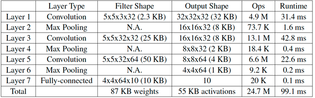

--

CMSIS-NN库包含两个部分： NNFunction和NNSupportFunctions。 

NNFunction包含实现通常神经网络层类型的函数，

比如卷积（convolution），深度可分离卷积（depthwise separable convolution），全连接（即内积inner-product）, 池化（pooling）和激活（activation）

这些函数被应用程序代码用来实现神经网络推理应用。

 内核API也保持简单，因此可以轻松地重定向到任何机器学习框架。


NNSupport函数包括不同的实用函数，如NNFunctions中使用的数据转换和激活功能表。

 这些实用函数也可以被应用代码用来构造更复杂的NN模块，例如， 长期短时记忆（LSTM）或门控循环单元（GRU）。


对于某些内核（例如全连接和卷积），会使用到不同版本的内核函数。 

我们提供了一个基本的版本，可以为任何图层参数“按原样”通用。 

我们还部署了其他版本，包括进一步的优化技术，但会对输入进行转换或对层参数有一些限制。

 理想情况下，可以使用简单的脚本来分析网络拓扑，并自动确定要使用的相应函数。


我们在卷积神经网络（CNN）上测试了CMSIS-NN内核，

在CIFAR-10数据集上进行训练，包括60,000个32x32彩色图像，分为10个输出类。

 网络拓扑结构基于Caffe中提供的内置示例，具有三个卷积层和一个完全连接层。 

下表显示了使用CMSIS-NN内核的层参数和详细运行时结果。 

测试在运行频率为216 MHz的ARM Cortex-M7内核STMichelectronics NUCLEO-F746ZG mbed开发板上进行。



整个图像分类每张图像大约需要99.1毫秒（相当于每秒10.1张图像）。 运行此网络的CPU的计算吞吐量约为每秒249 MOps。 预量化的网络在CIFAR-10测试集上达到了80.3％的精度。 在ARM Cortex-M7内核上运行的8位量化网络达到了79.9％的精度。

 使用CMSIS-NN内核的最大内存占用空间为〜133 KB，其中使用局部im2col来实现卷积以节省内存，然后进行矩阵乘法。

 没有使用局部im2col的内存占用将是〜332 KB，这样的话神经网络将无法在板上运行。


设计图像预处理函数。

在本例程中，模型的输入为灰度图，为完成摄像头获取的 RGB 图像到灰度图转换，需要解析出 RGB565 像素格式中 R、G、B 通道的数据，再根据公式计算出单个像素点的灰度，具体代码如下 ：


应用程序主体若在 10 帧中检测到超过半数的人像，就判定为异常并上报云端。根据实际的测试结果，执行一帧图像推理耗时约 633ms。

- 开发板 ：NUCLEO-L496ZG，MCU 为 STM32L496ZG
- Camera ：获取 RGB 图像，本例程使用 OV2640 摄像头
- 通信模组 ：负责 MCU 与云端之间的通信，本例程选用的乐鑫 ESP8266

实时检查的数据，传递给这个函数进行判断。

```
person_detect(model_buffer);
```

图形类的比较好处理。因为帧的概念非常清晰。

而音频的，是需要时间的。

录制多长时间的进行一次判断处理？


**ARM Cortex-M55**处理器是第一个采用ARMv8.1-M架构的处理器，该架构包括ARM Helium技术(也称为M-profile矢量扩展(MVE))的实现。Helium技术可在下一代嵌入式设备上实现更高水平的机器学习和信号处理。


参考资料

1、

https://community.arm.com/cn/b/blog/posts/cn-new-neural-network-kernels-boost-efficiency-in-microcontrollers-by-5x

2、

https://aijishu.com/t/cmsis-nn

3、移植TFLite-micro应用程序到Arm Cortex-M55处理器

https://zhuanlan.zhihu.com/p/268162039

4、愚蠢项目|在嵌入式MCU上玩机器学习（一）

https://zhuanlan.zhihu.com/p/77444499