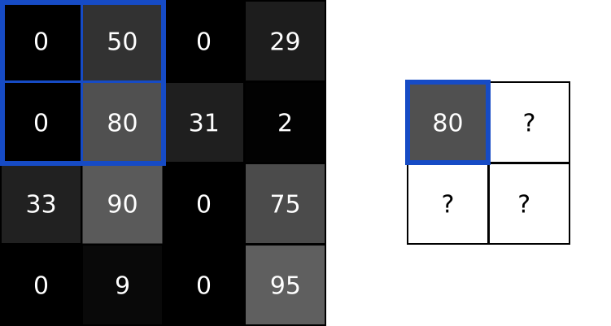

--

卷积是大自然中最常见的运算，

一切信号观测、采集、传输、处理都可以用卷积过程实现。

例如，你拍照时手抖了一下，导致照片模糊，

实际上等价于手没抖拍摄的正常照片与一个表示手抖的卷积核进行卷积运算得到的结果。

用公式表达如下：

# 卷积的理解

先对g函数进行翻转，相当于在数轴上把g函数从右边褶到左边去，也就是卷积的“卷”的由来。

然后再把g函数平移到n，在这个位置对两个函数的对应点**相乘，然后相加**，这个过程是卷积的“积”的过程。

这个只是从计算的方式上对公式进行了解释，

从数学上讲无可挑剔，

但进一步追问，**为什么要先翻转再平移，**

这么设计有何用意？还是有点费解。

为了更好地理解这些问题，我们先给出两个典型的应用场景：

**1. 信号分析**

一个输入信号*f(t)*，经过一个线性系统（其特征可以用单位冲击响应函数*g(t)*描述）以后，输出信号应该是什么？实际上通过卷积运算就可以得到输出信号。

**2. 图像处理**

输入一幅图像*f(x,y)*，经过特定设计的卷积核*g(x,y)*进行卷积处理以后，输出图像将会得到模糊，边缘强化等各种效果。

# 概述

因为图像的维度普遍比较高，例如 MNIST 数据集，每一个图片是 28 * 28 的图片。

如果直接用神经网络，假设采用2个 1000个神经元的隐藏层加 1 个10个神经元的隐藏层，最后使用 softmax 分类层，输出 10 个数字对应的概率。

参数的数量有：

786 * 1000 * 1000 * 10

如果是更大一点的图片，网络的规模还会进一步快速的增长。

为了应对这种问题， Yann LeCun 在贝尔实验室做研究员的时候提出了卷积网络技术，

并展示如何使用它来大幅度提高手写识别能力。

接下来将介绍卷积和池化以及卷积神经网络。

使用CNN的整体优势在于，

它可以使用其内核从数据中提取空间特征，

而其他网络则无法做到。

例如，CNN可以检测图像中的边缘，颜色分布等，

这使得这些网络在图像分类和包含空间属性的其他类似数据中非常强大。

## 参考资料

https://tensornews.cn/intro_cnn/

https://blog.csdn.net/orDream/article/details/106342711

# 卷积神经网络的应用

## 影像辨识

卷积神经网络通常在图像分析（image analysis）和图像处理（image processing）领域中使用。

关系密切，两者有一定程度的交叉，但是又有所不同。

图像处理侧重于信号处理方面的研究，

比如图像对比度的调节、图像编码、去噪以及各种滤波的研究。

但是图像分析更侧重点在于研究图像的内容，

包括但不局限于使用图像处理的各种技术，

它更倾向于对图像内容的分析、解释、和识别。

因而，图像分析和计算机科学领域中的模式识别、计算机视觉关系更密切一些。

图像分析研究的领域一般包括：

基于内容的图像检索（CBIR-Content Based Image Retrieval）
人脸识别（face recognition）
表情识别（emotion recognition）
光学字符识别（OCR-Optical Character Recognition）
手写体识别（handwriting recognition）
医学图像分析（biomedical image analysis）

## 自然语言处理

卷积神经网络也常被用于自然语言处理。 

CNN的模型被证明可以有效的处理各种自然语言处理的问题，

如语义分析、搜索结果提取、句子建模、分类、预测、和其他传统的NLP任务等。

自然语言处理（英语：natural language processing，缩写作NLP）

是人工智能和语言学领域的分支学科。

此领域探讨如何处理及运用自然语言；

自然语言认知则是指让电脑“懂”人类的语言。

自然语言生成系统把计算机数据转化为自然语言。

自然语言理解系统把自然语言转化为计算机程序更易于处理的形式。

自然语言处理研究的领域一般包括：

文本朗读（Text to speech）/语音合成（Speech synthesis）
语音识别（Speech recognition）
中文自动分词（Chinese word segmentation）
词性标注（Part-of-speech tagging）
句法分析（Parsing）
自然语言生成（Natural language generation）
文本分类（Text categorization）
信息检索（Information retrieval）
信息抽取（Information extraction）
文字校对（Text-proofing）
问答系统（Question answering）

给一句人类语言的问句，决定其答案。 典型问题有特定答案 (像是加拿大的首都叫什么?)，但也考虑些开放式问句(像是人生的意义是是什么?)

机器翻译（Machine translation）
将某种人类语言自动翻译至另一种语言

自动摘要（Automatic summarization）
产生一段文字的大意，通常用于提供已知领域的文章摘要，例如产生报纸上某篇文章之摘要

文字蕴涵（Textual entailment）

首先，介绍一下什么是卷积神经网络。

它是使用卷积层（Convolutional layers）的神经网络，基于卷积的数学运算。

卷积层由一组滤波器组成，滤波器可以视为二维数字矩阵。这是一个示例3x3滤波器：

我们可以将滤波器与输入图像进行卷积来产生输出图像，那么什么是卷积操作呢？具体的步骤如下：

1. 在图像的某个位置上覆盖滤波器；
2. 将滤波器中的值与图像中的对应像素的值相乘；
3. 把上面的乘积加起来，得到的和是输出图像中目标像素的值；
4. 对图像的所有位置重复此操作。

下面动图就是一个卷积的过程。移动的那个小方块就是过滤器。

卷积的作用主要是：

通过卷积运算，可以使原**信号特征增强，并且降低噪音**。

在图像上卷积之后主要是减少图像噪声，提取图像的特征。

例如sobel算子就是一种卷积运算，主要是提取图像的边缘特征。

卷积网络能很好地**适应图像的平移不变性**：

例如稍稍移动一幅猫的图像，它仍然是一幅猫的图像。

卷积操作保留了图像块之间的空间信息，进行卷积操作的图像块之间的相对位置关系没有改变。

下面图片演示了不同的卷积核产生的效果。

看出来了吗？其实，**索伯滤波器是是边缘检测器**。

现在可以解释卷积操作的用处了：

用输出图像中更亮的像素表示原始图像中存在的边缘。

你能看出为什么边缘检测图像可能比原始图像更有用吗？

回想一下MNIST手写数字分类问题。

在MNIST上训练的CNN可以找到某个特定的数字。

**比如发现数字1，可以通过使用边缘检测发现图像上两个突出的垂直边缘。**

通常，卷积有助于我们找到特定的局部图像特征（如边缘），用在后面的网络中。

在上面的处理过程中，我们用3x3滤波器对4x4输入图像执行卷积，输出了一个2x2图像。

# 池化

Pooling有多种，这里主要介绍两种，

max-pooling和average-pooling。

max-pooling即为从四个元素中选取一个最大的来表示这四个元素，

average-pooling则用四个元素的平均值来表示这四个元素。

图像中的相邻像素倾向于具有相似的值，

因此通常卷积层相邻的输出像素也具有相似的值。

这意味着，卷积层输出中包含的大部分信息都是冗余的。

如果我们使用边缘检测滤波器并在某个位置找到强边缘，那么我们也可能会在距离这个像素1个偏移的位置找到相对较强的边缘。

但是它们都一样是边缘，我们并没有找到任何新东西。

池化层解决了这个问题。

这个网络层所做的就是通过减小输入的大小**降低输出值的数量**。

**池化一般通过简单的最大值、最小值或平均值操作完成。**

以下是池大小为2的最大池层的示例:

卷积本身就是黑箱，试图解释本来就是拟合这个过程，并不能解释完美。

**卷积如同管中窥豹，缩小了范围，不同的镜片和镜头大小如同不同的卷积核。**

一维卷积如同管中听声音，

二维卷积如同管中看平面世界，

三维卷积如同管中看立体世界，

四维卷积如同管中看有颜色的立体世界，

五维卷积如同管中看有颜色的立体世界+声音。。。

**卷积只见到事物的一小部分，看不到全部，**

**这时需要池化来加强统计，**

**神经网络来建立联系，**

主要目的是减少计算量，

计算量可以并行化处理，

计算机的并行运算单元可以拿好多个管同时来看豹，

这样并行化程序就高了，

再用神经网络训练把这些小范围的数据联系起来，

从更高层面上运算。

像小波变换中的小波基函数也是类似这种，SVM支持向量机中的核函数也是类似这种，最早来原于滤波器函数、傅立叶变换函数。

有类似液晶显示器的栅格化算法，

化复杂为简单，

无论多复杂的东西都可以实现在一个有限的张量表示上，

只要密度上去了可以无限逼近原始解，

有限元分析也类似，

用有限数量的已知量去逼近无限未知量，

数学中有类似的勒贝格积分，像信号处理中的希尔伯特黄变换也有类似思想。

## 参考资料

卷积层

https://baike.baidu.com/item/%E5%8D%B7%E7%A7%AF%E5%B1%82/22701737?fr=aladdin

如何理解卷积神经网络（CNN）中的卷积和池化？

https://www.zhihu.com/question/49376084

# CNN架构演进

CNN从90年代的LeNet开始，

21世纪初沉寂了10年，

直到12年AlexNet开始又再焕发第二春，

从ZF Net到VGG，GoogLeNet再到ResNet和最近的DenseNet，

网络越来越深，架构越来越复杂，

解决反向传播时梯度消失的方法也越来越巧妙。

新年有假期，就好好总结一波CNN的各种经典架构吧，

领略一下CNN的发展历程中各路大神之间的智慧碰撞之美。

本文将会谈到以下经典的卷积神经网络：

1. LeNet
2. AlexNet
3. ZF
4. VGG
5. GoogLeNet
6. ResNet
7. DenseNet

## 开山之作：LeNet

闪光点：定义了CNN的基本组件，是CNN的鼻祖。

LeNet是卷积神经网络的祖师爷LeCun在1998年提出，

用于解决手写数字识别的视觉任务。

自那时起，CNN的最基本的架构就定下来了：

卷积层、池化层、全连接层。

如今各大深度学习框架中所使用的LeNet都是**简化改进过的LeNet-5**（-5表示具有5个层），

和原始的LeNet有些许不同，

比如把激活函数改为了现在很常用的ReLu。

LeNet-5跟现有的conv->pool->ReLU的套路不同，

它使用的方式是conv1->pool->conv2->pool2再接全连接层，

但是不变的是，卷积层后紧接池化层的模式依旧不变。

## 参考资料

CNN网络架构演进：从LeNet到DenseNet

https://www.cnblogs.com/skyfsm/p/8451834.html

# ARM-NN

物联网已经深入到我们生活的方方面面，

例如穿戴式医疗设备、智能家居。

大部分的物联网设备会将采集到的数据上传至云端，由后台进行数据处理和分析，再将结果返回给微处理器。

然而这种云端处理数据的方式不适用于一些对实时性要求高的物联网边缘设备，

通过ARM Cortex-M系列处理器内核进行Machine Learning成为了技术发展的需要，

CMSIS-NN就是解决方法之一。

机器学习运用到嵌入式系统中有以下的优点：

实时性决策
增加数据的安全性和可靠性
无需依赖互联网
减少带宽

CMSIS-NN库分为了两个部分，NNFuctions和NNSupportFunctions，图片摘自CMSIS-NN Block Diagram。

NNFuctions运用了卷积神经网络Convolutional Neural Network(CNN)，包括了：

Convolution Function 卷积函数
Activations Function 激活函数
Pooling Function 池化函数
Fully-connected Function 全连接函数

要掌握CMSIS-NN，首先得理解CNN，所以先说一说卷积神经网络。

Convolutional Neural Network

卷积是怎么卷的？

**卷积的核心在于降维。**

当我们遍历这条直线，也就是做积分或者是求和，像是把二维平面从45°斜线卷起来，就形成了一个一维的直线函数，每个点的函数值等于卷起来后重合的点的函数值之和。这样就从一个二维函数降到了一维函数。

常用的激活函数有Sigmoid、tanh以及ReLu。

Sigmoid和tanh函数常用于全连接层，

ReLu函数常用于卷积层。

池化函数的主要作用是通过特征降维对图像进行压缩，降低feature maps的分辨率，以此减少计算量，同时提高容错率。

池化一般选取2x2的滑动窗口作为池化区域，通过相应的池化函数将4个像素转换为1个像素。

常用的池化函数有MaxPooling和AveragePooling。

CNN算法可以分为两个部分：

- 特征提取：Convolution、Activation、Pooling
- 分类识别：Fully-connected

CMSIS-NN采用的是框架如下图。

使用了以下函数：

arm_convolve_HWC_q7_RGB()
arm_convolve_HWC_q7_fast()
arm_relu_q7()
arm_maxpool_q7_HWC()
arm_avepool_q7_HWC()
arm_fully_connected_q7_opt()
arm_fully_connected_q7()

# 卷积神经网络初学者指南笔记

大量公司开始将深度学习用作服务的核心。

Facebook 将神经网络用于自动标注算法、

谷歌将它用于图片搜索、

亚马逊将它用于商品推荐、

Pinterest 将它用于个性化主页推送、

Instagram 将它用于搜索架构。

然而，应用这些网络最经典最流行的案例是进行图像处理。

在图像处理任务中，让我们看一下如何使用卷积神经网络进行图像分类。

图像分类是对输入图像的操作，

最终输出一组最好地描述了图像内容的分类（如猫、狗等）或分类的概率。

对人类来说，识别是打出生便开始学习的技能之一，

对成人来说更是信手拈来，毫不费力。

我们只需一眼便能快速识别我们所处的环境以及环绕在我们身边的物体。

当我们看到一张图片或是环看四周的时候，

无需刻意观察，多数时候也能立即描述出场景特征并标记出每一个对象。

快速识别不同模式、根据早前知识进行归纳、以及适应不同的图像环境一直都是人类的专属技能，

机器尚未享有。

当计算机看到一张图像（输入一张图像）时，

它看的是一大堆像素值。

根据图片的分辨率和尺寸，它将看到一个 32 x 32 x 3 的数组（3 指代的是 RGB 值）。

为了讲清楚这一点，

假设我们有一张 JPG 格式的 480 x 480 大小的彩色图片，

那么它对应的数组就有 480 x 480 x 3 个元素。

其中每个数字的值从 0 到 255 不等，其描述了对应那一点的像素灰度。

**当我们人类对图像进行分类时，这些数字毫无用处，**

**可它们却是计算机可获得的唯一输入。**

其中的思想是：

当你提供给计算机这一数组后，它将输出描述该图像属于某一特定分类的概率的数字（比如：80% 是猫、15% 是狗、5% 是鸟）。

现在我们知道了问题所在以及输入与输出，

就该考虑如何处理了。

我们想要计算机能够区分开所有提供给它的图片，

以及搞清楚猫猫狗狗各自的特有特征。

**这也是我们人类的大脑中不自觉进行着的过程。**

当我们看到一幅狗的图片时，

如果有诸如爪子或四条腿之类的明显特征，

我们便能将它归类为狗。

同样地，计算机也可以通过**寻找诸如边缘和曲线之类的低级特点**来分类图片，

**继而通过一系列卷积层级建构出更为抽象的概念。**

这是 CNN（卷积神经网络）工作方式的大体概述，下面是具体细节。

首先介绍些背景。

当你第一次听到卷积神经网络这一术语，可能会联想到神经科学或生物学，那就对了。

可以这样说。

CNN 的确是从**视觉皮层的生物学**上获得启发的。

视觉皮层有小部分细胞对特定部分的视觉区域敏感。

Hubel 和 Wiesel 于 1962 年进行的一项有趣的试验详细说明了这一观点，

他们验证出大脑中的一些个体神经细胞只有在特定方向的边缘存在时才能做出反应（即放电）。

例如，**一些神经元只对垂直边缘兴奋，另一些对水平或对角边缘兴奋**。

Hubel 和 Wisesl 发现所有这些神经元都以**柱状结构的形式进行排列**，

而且一起工作才能产生视觉感知。

这种一个系统中的**特定组件有特定任务的观点**（视觉皮层的神经元细胞寻找特定特征）在机器中同样适用，这就是 CNN 的基础。

回到细节上来。更为详细的 CNN 工作概述指的是你挑一张图像，让它历经一系列卷积层、非线性层、池化（下采样（downsampling））层和完全连接层，最终得到输出。

正如之前所说，输出可以是最好地描述了图像内容的一个单独分类或一组分类的概率。

如今，难点在于理解其中每一层的工作方法。我们先来看最重要的部分。

CNN 的第一层通常是卷积层（Convolutional Layer）。

首先需要了解卷积层的输入内容是什么。

如上所述，输入内容为一个 32 x 32 x 3 的像素值数组。

现在，解释卷积层的最佳方法是想象有一束手电筒光正从图像的左上角照过。

假设手电筒光可以覆盖 5 x 5 的区域，

想象一下手电筒光照过输入图像的所有区域。

在机器学习术语中，**这束手电筒被叫做过滤器（filter，有时候也被称为神经元（neuron）或核（kernel）），**

**被照过的区域被称为感受野（receptive field）。**

过滤器同样也是一个数组（其中的数字被称作权重或参数）。

重点在于过滤器的深度必须与输入内容的深度相同（这样才能确保可以进行数学运算），因此过滤器大小为 5 x 5 x 3。

现在，以过滤器所处在的第一个位置为例，即图像的左上角。

当筛选值在图像上滑动（卷积运算）时，过滤器中的值会与图像中的原始像素值相乘（又称为计算点积）。

这些乘积被加在一起（从数学上来说，一共会有 75 个乘积）。

现在你得到了一个数字。切记，该数字只是表示过滤器位于图片左上角的情况。我们在输入内容上的每一位置重复该过程。（下一步将是将过滤器右移 1 单元，接着再右移 1 单元，以此类推。）输入内容上的每一特定位置都会产生一个数字。

过滤器滑过所有位置后将得到一个 28 x 28 x 1 的数组，

我们称之为激活映射（activation map）或特征映射（feature map）。

之所以得到一个 28 x 28 的数组的原因在于，在一张 32 x 32 的输入图像上，5 x 5 的过滤器能够覆盖到 784 个不同的位置。这 784 个位置可映射为一个 28 x 28 的数组。

当我们使用两个而不是一个 5 x 5 x 3 的过滤器时，

输出总量将会变成  28 x 28 x 2。

采用的过滤器越多，空间维度（ spatial dimensions）保留得也就越好。

数学上而言，这就是卷积层上发生的事情。

不过，从高层次角度而言卷积是如何工作的？

**每个过滤器可以被看成是特征标识符（ feature identifiers）。**

这里的特征指的是例如直边缘、原色、曲线之类的东西。

想一想所有图像都共有的一些最简单的特征。

假设第一组过滤器是 7 x 7 x 3 的曲线检测器。（在这一节，为了易于分析，暂且忽略该过滤器的深度为 3 个单元，只考虑过滤器和图像的顶层层面。）

作为曲线过滤器，它将有一个像素结构，在曲线形状旁时会产生更高的数值（切记，我们所讨论的过滤器不过是一组数值！）

这个值小了很多！

这是因为图像的这一部分和曲线检测器过滤器不存在对应。

记住，这个卷积层的输出是一个激活映射（activation map）。

因此，在这个带有一个过滤器卷积的例子里（当筛选值为曲线检测器），激活映射将会显示出图像里最像曲线的区域。

在该例子中，28 x 28 x 1 的激活映射的左上角的值为 6600。

高数值意味着很有可能是输入内容中的曲线激活了过滤器。

激活地图右上角的值将会是 0，因为输入内容中没有任何东西能激活过滤器（更简单地说，原始图片中的这一区域没有任何曲线）。

这仅仅是一组检测右弯曲线的过滤器。还有其它检测左弯曲线或直线边缘的过滤器。过滤器越多，激活映射的深度越大，我们对输入内容的了解也就越多。

我在本小节中描绘的过滤器（filter）只是为了描述卷积中的数学过程。

在下图中你可以看到训练后的网络中第一个卷积层的过滤器的实际可视化。

尽管如此，主要观点仍旧不变。

当在输入内容中寻找特定特征时，第一层上的过滤器在输入图像上进行卷积运算和「激活」（即计算高数值）。

在传统卷积神经网络架构中，卷积层之间还有其它类型的层。

我强烈建议有兴趣的人阅读和它们有关的材料，并理解相应的功能和作用；

但总的来说，它们提供的非线性和维度保留有助于**提高网络的稳健性（robustness）并控制过拟合**。

一个典型的 CNN 结构看起来是这样的：

*输入→卷积→ReLU→卷积→ReLU→池化→ReLU→卷积→ReLU→池化→全连接*

我们稍后再来讨论关键的最后一层，先回顾一下学到了哪些。

我们讨论了过滤器是如何在第一个卷积层检测特征的。

它们检测边缘和曲线一类的低级特征。

正如想象的那样，为了预测出图片内容的分类，网络需要识别更高级的特征，

例如手、爪子与耳朵的区别。

第一个卷积层的输出将会是一个 28 x 28 x 3 的数组（假设我们采用三个 5 x 5 x 3 的过滤器）。

当我们进入另一卷积层时，第一个卷积层的输出便是第二个卷积层的输入。

解释这一点有些困难。

第一层的输入是原始图像，

而第二卷积层的输入正是第一层输出的激活映射。

也就是说，这一层的输入大体描绘了低级特征在原始图片中的位置。

在此基础上再采用一组过滤器（让它通过第 2 个卷积层），

输出将是表示了更高级的特征的激活映射。

这类特征可以是半圆（曲线和直线的组合）或四边形（几条直线的组合）。

随着进入网络越深和经过更多卷积层后，你将得到更为复杂特征的激活映射。

在网络的最后，可能会有一些过滤器会在看到手写笔迹或粉红物体等时激活。

如果你想知道更多关于可视化卷积网络中过滤器的内容，

可以查看 Matt Zeiler 和 Rob Fergus 的一篇讨论该问题的颇为杰出的研究论文。

在 YouTube 上，Jason Yosinski 有一段视频十分视觉化地呈现了这一过程（如下）。

有趣的是，越深入网络，过滤器的感受野越大，

意味着它们能够处理更大范围的原始输入内容（或者说它们可以对更大区域的像素空间产生反应）。

检测高级特征之后，网络最后的完全连接层就更是锦上添花了。

简单地说，这一层处理输入内容（该输入可能是卷积层、ReLU 层或是池化层的输出）后会输出一个 N 维向量，

N 是该程序必须选择的分类数量。

例如，如果你想得到一个数字分类程序，如果有 10  个数字，N 就等于 10。

这个 N 维向量中的每一数字都代表某一特定类别的概率。

例如，如果某一数字分类程序的结果矢量是 [0 .1 .1 .75 0 0 0 0 0 .05]，

则代表该图片有 10% 的概率是 1、10% 的概率是 2、75% 的概率是 3、还有 5% 的概率是 9

（注：还有其他表现输出的方式，这里只展示了 softmax 的方法）。

完全连接层观察上一层的输出（其表示了更高级特征的激活映射）并确定这些特征与哪一分类最为吻合。

例如，如果该程序预测某一图像的内容为狗，

那么激活映射中的高数值便会代表一些爪子或四条腿之类的高级特征。

同样地，如果程序测定某一图片的内容为鸟，激活映射中的高数值便会代表诸如翅膀或鸟喙之类的高级特征。

大体上来说，完全连接层观察高级特征和哪一分类最为吻合和拥有怎样的特定权重，

因此当计算出权重与先前层之间的点积后，你将得到不同分类的正确概率。

下面是神经网络中的一个我尚未提及但却最为重要的部分。

阅读过程中你可能会提出许多问题。

第一卷积层中的滤波器是如何知道寻找边缘与曲线的？

完全连接层怎么知道观察哪些激活图？

每一层级的滤波器如何知道需要哪些值？

**计算机通过一个名为反向传播的训练过程来调整过滤器值（或权重）。**

在探讨反向传播之前，我们首先必须回顾一下神经网络工作起来需要什么。

在我们刚出生的时候，大脑一无所知。

我们不晓得猫啊狗啊鸟啊都是些什么东西。

**与之类似的是 CNN 刚开始的时候，权重或过滤器值都是随机的。**

滤波器不知道要去寻找边缘和曲线。

更高层的过滤器值也不知道要去寻找爪子和鸟喙。

**不过随着年岁的增长，父母和老师向我们介绍各式各样的图片并且一一作出标记。**

**CNN 经历的便是一个介绍图片与分类标记的训练过程。**

在深入探讨之前，先设定一个训练集，在这里有上千张狗、猫、鸟的图片，

每一张都依照内容被标记。下面回到反向传播的问题上来。

假设变量 L 等同该数值。

正如所料，前两张训练图片的损失将会极高。

现在，我们直观地想一下。

我们想要预测标记（卷积网络的输出）与训练标记相同（意味着网络预测正确）。

为了做到这一点，我们想要将损失数量最小化。

将其视为微积分优化问题的话，也就是说我们想要找出是哪部分输入（例子中的权重）直接导致了网络的损失（或错误）。

这是一个 dL/dW 的数学等式，W 是特定层级的权重。

我们接下来要做的是在网络中进行后向传导，

**测定出是哪部分权重导致了最大的损失**，寻找调整方法并减少损失。

**一旦计算出该导数，将进行最后一步也就是权重更新。**

所有的过滤器的权重将会更新，以便它们顺着梯度方向改变。

学习速率是一个由程序员决定的参数。

高学习速率意味着权重更新的动作更大，因此可能该模式将花费更少的时间收敛到最优权重。

然而，学习速率过高会导致跳动过大，不够准确以致于达不到最优点。

总的来说，前向传导、损失函数、后向传导、以及参数更新被称为一个学习周期。

对每一训练图片，程序将重复固定数目的周期过程。

一旦完成了最后训练样本上的参数更新，网络有望得到足够好的训练，以便层级中的权重得到正确调整。

最后，为了检验 CNN 能否工作，我们准备不同的另一组图片与标记集（不能在训练和测试中使用相同的！）并让它们通过这个 CNN。

我们将输出与实际情况（ground truth ）相比较，看看网络是否有效！

好了，现在来看一下我们的卷积神经网络。

还记得过滤器、感受野和卷积吗？

很好。现在，**要改变每一层的行为，有两个主要参数是我们可以调整的**。

选择了过滤器的尺寸以后，**我们还需要选择步幅（stride）和填充（padding）。**

现在让我们看一下填充（padding）。

在此之前，想象一个场景：

当你把 5 x 5 x 3 的过滤器用在 32 x 32 x 3 的输入上时，会发生什么？

输出的大小会是 28 x 28 x 3。

注意，这里空间维度减小了。

**如果我们继续用卷积层，尺寸减小的速度就会超过我们的期望。**

在网络的早期层中，我们想要尽可能多地保留原始输入内容的信息，

**这样我们就能提取出那些低层的特征。**

比如说我们想要应用同样的卷积层，但又想让输出量维持为 32 x 32 x 3 。

为做到这点，我们可以对这个层应用大小为 2 的零填充（zero padding）。

零填充在输入内容的边界周围补充零。

如果我们用两个零填充，就会得到一个 36 x 36 x 3 的输入卷。

我们怎么知道要用

多少层、

多少卷积层、

过滤器尺寸是多少、

以及步幅和填充值多大呢？

这些问题很重要，

**但又没有一个所有研究人员都在使用的固定标准。**

这是因为神经网络很大程度上取决于你的数据类型。

图像的大小、复杂度、图像处理任务的类型以及其他更多特征的不同都会造成数据的不同。

对于你的数据集，想出如何选择超参数的一个方法是找到能创造出图像在合适尺度上抽象的正确组合。

**在每个卷积层之后，通常会立即应用一个非线性层（或激活层）。**

其目的是给一个在卷积层中刚经过线性计算操作（只是数组元素依次（element wise）相乘与求和）的系统引入非线性特征。

过去，人们用的是像双曲正切和 S 型函数这样的非线性方程，但研究者发现 ReLU 层效果好得多，

因为神经网络能够在准确度不发生明显改变的情况下把训练速度提高很多（由于计算效率增加）。

它同样能帮助减轻梯度消失的问题——由于梯度以指数方式在层中消失，

导致网络较底层的训练速度非常慢。

ReLU 层对输入内容的所有值都应用了函数 f(x) = max(0, x)。

**用基本术语来说，这一层把所有的负激活（negative activation）都变为零。**

这一层会增加模型乃至整个神经网络的非线性特征，而且不会影响卷积层的感受野。

池化层还有其他选择，比如平均池化（average pooling）和 L2-norm 池化 。

这一层背后的直观推理是：

**一旦我们知道了原始输入（这里会有一个高激活值）中一个特定的特征，它与其它特征的相对位置就比它的绝对位置更重要。**

可想而知，这一层大幅减小了输入卷的空间维度（长度和宽度改变了，但深度没变）。

这到达了两个主要目的。

第一个是权重参数的数目减少到了75%，因此降低了计算成本。

第二是它可以控制过拟合（overfitting）。

这个术语是指一个模型与训练样本太过匹配了，以至于用于验证和检测组时无法产生出好的结果。

出现过拟合的表现是一个模型在训练集能达到 100% 或 99% 的准确度，而在测试数据上却只有50%。

**Dropout 层**

如今，Dropout 层在神经网络有了非常明确的功能。

上一节，我们讨论了经过训练后的过拟合问题：

训练之后，神经网络的权重与训练样本太过匹配以至于在处理新样本的时候表现平平。

Dropout 的概念在本质上非常简单。

Dropout 层将「丢弃（drop out）」该层中一个随机的激活参数集，

即在前向通过（forward pass）中将这些激活参数集设置为 0。

简单如斯。

既然如此，这些简单而且似乎不必要且有些反常的过程的好处是什么？

在某种程度上，这种机制强制网络变得更加冗余。

这里的意思是：

该网络将能够为特定的样本提供合适的分类或输出，即使一些激活参数被丢弃。此机制将保证神经网络不会对训练样本「过于匹配」，这将帮助缓解过拟合问题。

**另外，Dropout 层只能在训练中使用，而不能用于测试过程，这是很重要的一点。**

**网络层中的网络**

网络层中的网络指的是一个使用了 1 x 1 尺寸的过滤器的卷积层。

现在，匆匆一瞥，你或许会好奇为何这种感受野大于它们所映射空间的网络层竟然会有帮助。

然而，我们必须谨记 1x1 的卷积层跨越了特定深度，

所以我们可以设想一个1 x 1 x N 的卷积层，

此处 N 代表该层应用的过滤器数量。

该层有效地使用 N 维数组元素依次相乘的乘法，此时 N 代表的是该层的输入的深度。

**分类、定位、检测、分割**

本系列第一部分使用的案例中，我们观察了图像分类任务。

这个过程是：

获取输入图片，

输出一套分类的类数（class number)。

然而当我们执行类似目标定位的任务时，

我们要做的不只是生成一个类标签,

而是生成一个描述图片中物体所在位置的边界框。

**迁移学习**

如今，深度学习领域一个常见的误解在于没有谷歌那样的巨量数据，

你将没有希望创建一个有效的深度学习模型。

尽管数据是创建网络中至关重要的部分，迁移学习的思路将帮助我们降低数据需求。

迁移学习指的是利用预训练模型（神经网络的权重和参数都已经被其他人利用更大规模的数据集训练好了）并用自己的数据集将模型「微调」的过程。

这种思路中预训练模型扮演着特征提取器的角色。

你将移除网络的最后一层并用你自有的分类器置换（取决于你的问题空间）。

然后冻结其他所有层的权重并正常训练该网络（冻结这些层意味着在梯度下降/最优化过程中保持权值不变）。

让我们探讨一下为什么做这项工作。

比如说我们正在讨论的这个预训练模型是在 ImageNet （一个包含一千多个分类，一千四百万张图像的数据集）上训练的 。

当我们思考神经网络的较低层时，我们知道它们将检测类似曲线和边缘这样的特征。

现在，除非你有一个极为独特的问题空间和数据集，你的神经网络也会检测曲线和边缘这些特征。

相比通过随机初始化权重训练整个网络，我们可以利用预训练模型的权重（并冻结）聚焦于更重要的层（更高层）进行训练。

如果你的数据集不同于 ImageNet 这样的数据集，你必须训练更多的层级而只冻结一些低层的网络。

# 参考资料

1、CMSIS_NN：卷积神经网络

https://blog.csdn.net/weixin_42150654/article/details/113741171

2、【CNN】很详细的讲解什么以及为什么是卷积（Convolution）！

https://blog.csdn.net/zandaoguang/article/details/103640599

3、深度 | 从入门到精通：卷积神经网络初学者指南（附论文）

https://mp.weixin.qq.com/s?__biz=MzA3MzI4MjgzMw==&mid=2650717691&idx=2&sn=3f0b66aa9706aae1a30b01309aa0214c&scene=0#wechat_redirect%20%E6%B7%B1%E5%BA%A6%20%7C%20%E4%BB%8E%E5%85%A5%E9%97%A8%E5%88%B0%E7%B2%BE%E9%80%9A%EF%BC%9A%E5%8D%B7%E7%A7%AF%E7%A5%9E%E7%BB%8F%E7%BD%91%E7%BB%9C%E5%88%9D%E5%AD%A6%E8%80%85%E6%8C%87%E5%8D%97%EF%BC%88%E9%99%84%E8%AE%BA%E6%96%87%EF%BC%89