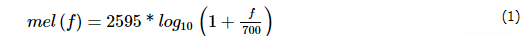
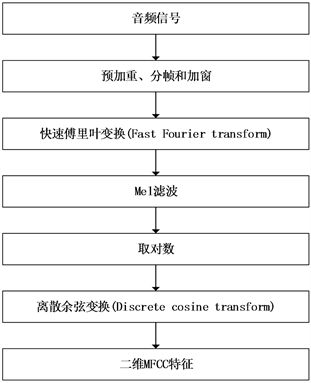
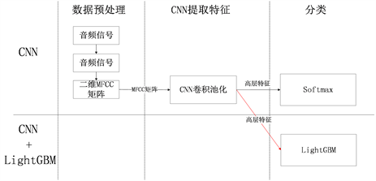
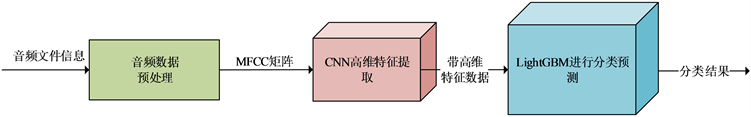
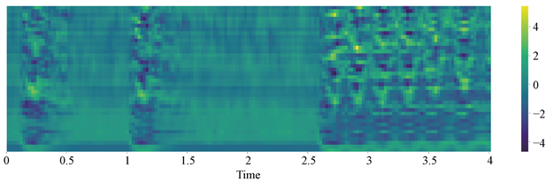

--

音频识别是**模式识别领域**一个前沿研究课题。

作为音频识别的一个重要分支，环境声音分类(Environmental Sound Classification, ESC)受到了业界许多专家学者的关注，成为了热门研究话题。

ESC是用机器进行声学环境分析最重要的技术之一，广泛应用于监听 [[1](https://www.hanspub.org/journal/PaperInformation.aspx?paperID=32564#ref1)]、智能家居 [[2](https://www.hanspub.org/journal/PaperInformation.aspx?paperID=32564#ref2)]、场景分析 [[3](https://www.hanspub.org/journal/PaperInformation.aspx?paperID=32564#ref3)] 和机器视听 [[4](https://www.hanspub.org/journal/PaperInformation.aspx?paperID=32564#ref4)] 等领域，

如监管系统通过检测监管区域异常声音自动报告紧急情况并启动应急方案 [[5](https://www.hanspub.org/journal/PaperInformation.aspx?paperID=32564#ref5)]、机器人通过对环境声音的分类识别确定下一步行动计划 [[6](https://www.hanspub.org/journal/PaperInformation.aspx?paperID=32564#ref6)] 等。

与语音和音乐不同，环境声音的音频具有多样性特点，拥有更广泛的频率范围。

近年来，随着医疗保健、安全监控、生态环境变化预测等应用需求的涌现，环境声音分类识别研究已越来越受到学术界的重视。

**环境声音的准确分类识别已成为相关应用成功与否的关键。**

环境声音分类识别属于音频识别范围。

传统的音频识别方法分为信号处理方法和机器学习方法。

传统的信号处理方法直接使用音频数据 [[7](https://www.hanspub.org/journal/PaperInformation.aspx?paperID=32564#ref7)] [[8](https://www.hanspub.org/journal/PaperInformation.aspx?paperID=32564#ref8)] [[9](https://www.hanspub.org/journal/PaperInformation.aspx?paperID=32564#ref9)]，

如Mel滤波器组属性 [[10](https://www.hanspub.org/journal/PaperInformation.aspx?paperID=32564#ref10)]、Gammatone属性 [[11](https://www.hanspub.org/journal/PaperInformation.aspx?paperID=32564#ref11)]、基于小波的属性 [[12](https://www.hanspub.org/journal/PaperInformation.aspx?paperID=32564#ref12)] 和多频带谱减法 [[13](https://www.hanspub.org/journal/PaperInformation.aspx?paperID=32564#ref13)] 等；

传统的机器学习方法如SVM [[14](https://www.hanspub.org/journal/PaperInformation.aspx?paperID=32564#ref14)] [[15](https://www.hanspub.org/journal/PaperInformation.aspx?paperID=32564#ref15)]、GMM [[16](https://www.hanspub.org/journal/PaperInformation.aspx?paperID=32564#ref16)] 和KNN [[17](https://www.hanspub.org/journal/PaperInformation.aspx?paperID=32564#ref17)] 等。

近年来，随着深度学习技术的发展，

将深度神经网络(Deep Neural Network, DNN)应用于自动语音识别(Automatic Speech Recognition, ASR)和音乐信息检索(Music Information Retrieval, MIR) [[18](https://www.hanspub.org/journal/PaperInformation.aspx?paperID=32564#ref18)] [[19](https://www.hanspub.org/journal/PaperInformation.aspx?paperID=32564#ref19)] 取得了巨大的成功。

对于音频信号，DNN能够从原始数据中提取特征，

一些基于DNN的模型被提出并且表现得比传统的机器学习模型效果更好 [[20](https://www.hanspub.org/journal/PaperInformation.aspx?paperID=32564#ref20)]，

如：Picza K.J.将简单的卷积神经网络层结构应用于log梅尔频谱图，对环境声音进行分类处理 [[21](https://www.hanspub.org/journal/PaperInformation.aspx?paperID=32564#ref21)] ；

Medhat F.等人通过嵌入类滤波器组的稀疏性来引导网络在频谱中的学习 [[22](https://www.hanspub.org/journal/PaperInformation.aspx?paperID=32564#ref22)] ；

Takahashi等人通过使用log梅尔频谱图和增量及增量的增量信息作为类似于图像RGB输入的三通道输入 [[23](https://www.hanspub.org/journal/PaperInformation.aspx?paperID=32564#ref23)]。

**然而，DNN的深度全连接架构对于转换特征并不具备强鲁棒性。**

一些新的研究发现卷积神经网络具有强大的通过大量训练数据探索潜在的关联信息能力，

通过从环境声音中学习类似频谱图的特征 [[24](https://www.hanspub.org/journal/PaperInformation.aspx?paperID=32564#ref24)]，

将CNN应用于ESC的几次尝试已经获得了性能提升，

如Zhang等人通过调整网络中各层的激活函数提高了模型的性能 [[25](https://www.hanspub.org/journal/PaperInformation.aspx?paperID=32564#ref25)] ；

Zhang等人通过调整卷积网络层结构并且融合混合样本生成新样本训练网络，提升了模型效果 [[26](https://www.hanspub.org/journal/PaperInformation.aspx?paperID=32564#ref26)]。

但是网络结构的设计依然有待改进，模型的特征获取与分类预测功能没有很好地进行分离，

这为进一步改进模型提供了新的思路。

为了更好地利用音频数据信息，设计更好的网络结构模型，

本文在此基础上调整网络层结构，

同时由于卷积神经网络结构模型具有提取音频特征功能作用，

本文将使用卷积神经网络模型对音频数据特征进行提取，

而使用LightGBM模型对提取特征后的音频数据进行分类预测以加强模型效果，

将模型提取特征功能和分类预测功能分离，以改善模型效果。

本文将卷积神经网络模型和LightGBM模型融合，

融合了卷积神经网络提取特征的功能和LightGBM分类预测的能力，

各分模型对应不同的功能，使模型结构具有更好的分类预测效果。

音频数据存储着音频的信号，

这种信号是一种一维的时域信号，

由多段频谱信号按时间排列表示每个时间段的帧信息。

通过直观上观察频谱的分布信息很难得出频率变化的规律，

并且难以通过其它模型对该数据进行处理以进行分类预测，

同时需要将每个音频数据进行规整化处理使其统一标准，

因此需要将音频的频谱信息转换成其它易于理解的形式进行进一步处理。

人的听觉系统是一个特殊的非线性感知系统，

它对不同频率的信号有不同的听觉敏感度，

通常使用梅尔频率表示人耳对于频率的感受度。

梅尔频率是一种基于人耳对等距的音高变化的感官判断而定的非线性频率刻度，它与频率的关系如公式(1)所示。

在音频特征的提取上，人类听觉系统能够做得非常好，

它不仅能提取出语义信息，而且能提取出声源特征。

如果在音频识别系统中能**模拟人类听觉感知处理特点**，就有可能提高音频的识别率。

梅尔频率倒谱系数(Mel Frequency Cepstrum Coefficient, MFCC)

是通过梅尔频率和频率之间的关系计算得到的频率频谱特征，

是一种在自动语音识别和声纹识别等音频识别中广泛使用的特征。

梅尔频率倒谱系数考虑到了人类的听觉特征，

通过对spectrogram声谱图进行描述的音频数据进行处理，

对分帧后的音频频谱信息通过坐标表示出来，

得到一个随时间变化的短时频谱图，

即描述单帧信号中能量分布的情况。

其峰值表示语音的主要频率成分，称为共振峰(formants)，携带声音的辨识属性，

**利用共振峰可以识别不同的声音。**

通过提取频谱的包络(Spectral Evnelope)和频谱细节，得到每帧频谱的相关信息。

对于每帧频谱信息提取的一维频域特征，将每帧的结果沿另一个维度堆叠起来，得到类似于一幅图的二维信号形式，

**这样就可以像处理图像一样处理音频数据了。**

其具体特征提取过程如[图1](https://www.hanspub.org/journal/PaperInformation.aspx?paperID=32564#f1)所示，

先将语音预加重，使信号的频谱变得平坦，保持在低频到高频的整个频带中；

再分为多个帧，每个帧对应于一个频谱；

然后加窗，将每帧乘以汉明窗，以增加帧左段和右段的连续性；

通过短时快速傅里叶变换(Fast Fourier Transformation, FFT)，

计算频率与振幅的关系，使时域信号转换为频域上的能量分布来观察；

**因为频域信号有很多冗余信息**，需要滤波器组对频域的能量幅值进行精简，每一个频段用一个值来表示。

通过公式(1)将能量幅值转化为人耳对声音感知的梅尔频率，即Mel滤波操作，如[图2](https://www.hanspub.org/journal/PaperInformation.aspx?paperID=32564#f2)的映射操作，

并通过离散余弦变换将能量信号集种到低频部分。

其输出结果值，即是能够描述音频数据的**低阶特征MFCC值。**

梅尔频率倒谱系数将线性频谱映射到基于听觉感知的Mel非线性数据，即可进行倒谱分析。

通过提取音频文件的MFCC物理特征，**将音频文件信息转换为矩阵信息**，为后续模型训练测试做准备。

通过对频谱分析，得到音频声谱图对应的特征数据，且格式符合使用卷积神经网络(Convolution Natural Network, CNN)进行模型拟合过程，**可以用CNN进行进一步的高层次特征提取。**

卷积神经网络是一种前馈神经网络，由多层卷积层及池化层以及有限数量的全连接层以及softmax输出层构成的神经网络结构。

卷积层是通过一系列卷积核表征像素点之间的空间分布，将一个范围内的所有像素点进行加权求平均；

卷积核用矩阵表示特征值，代表高层语义信息。

卷积层的作用是过滤输入数据的特征，以提取输入所具有的特性空间，通过多个卷积核捕获不同视觉模式。

池化层是通过对图像进行下采样将样本大小进行缩放或重构，为下一步更精细的特征做准备。

常用的池化方法有最大池化和平均池化。

全连接层对层间所有神经元节点进行权值连接，softmax输出层对应模型的分类结果。

卷积神经网络由在深层架构中堆叠在一起的许多不同层组成，

包括一个输入层、一系列卷积层和池化层(可以任意方式组合)，

防止过拟合的Dropout层，有限数量的完全连接的隐藏层，以及输出层。

不同堆叠方式的网络结构，对模型有着不同的效果。

随着网络层数的增加，层数过深的网络会导致精度下降，模型效果甚至会变差，

这与梯度在传播过程中梯度逐渐消失导致无法对网络权重进行迭代变换有关。

因此，为了避免网络结构过深导致模型效果变差，适当地调整网络结构堆叠能够让模型充分发挥效果。

本文的CNN网络结构是在Piczak [[21](https://www.hanspub.org/journal/PaperInformation.aspx?paperID=32564#ref21)] 和Zhang [[26](https://www.hanspub.org/journal/PaperInformation.aspx?paperID=32564#ref26)] 提出的网络结构的基础上调整提取特征的网络结构，调整它们的堆叠方式，改变卷积层和池化层的数量，以更好的对音频数据进行高层次特征提取。

模型结构构造为如[图3](https://www.hanspub.org/journal/PaperInformation.aspx?paperID=32564#f3)所示，包括：

一层输入层，堆叠五层卷积层和池化层，两层全连接层以及一个softmax分类层。

此处的softmax分类层是用于训练网络时传递误差，当网络训练完成后，去掉该层而提取前一层的输出数据以进行下一步的训练。

由于本文CNN网络只改变网络层数量，而不改变相关参数，

因此参数设置与Piczak和Zhang所提出的网络参数设置一致，

卷积核使用3 × 3矩阵，池化层步长使用2 × 2的最大池化方法，

激活函数使用relu函数，通过该模型训练音频数据，提取音频文件的高层次特征数据。

模型的主要流程如下：

算法：CNN提取高层次特征

输入：音频文件经过预处理的MFCC矩阵

输出：音频文件高层次特征数据

1) 构建卷积神经网络模型并且初始化权值；

2) 输入数据经过卷积层、池化层、全连接层的前向传播得到输出值；

3) 计算网络的输出值与目标值之间的误差；

4) 当误差大于期望值时，将误差传回网络中，依次求得网络全连接层、池化层、卷积层的误差，当误差小于等于给定期望值时，结束训练，进入第6步；

5) 根据求得误差调整网络各层权值，再次进入到第2步；

6) 训练结束，输出高层次特征数据。

卷积神经网络的softmax层虽然也能进行分类预测，

但是让模型既进行提取特征也进行分类会让模型泛化能力不强，

因此考虑让CNN模型进行单独提取特征功能，而使用另一个分类器模型进行分类预测。

轻量级梯度提升器(Light Gradient Boosting Machine, Light GBM) [[27](https://www.hanspub.org/journal/PaperInformation.aspx?paperID=32564#ref27)] 是集成学习中的一种Boosting框架，使用决策树作为学习算法的基分类器。

Boosting方法训练基分类器时采用串行训练的方式，

各分类器之间有依赖。

它的基本思想是将各个基分类器层层叠加，

将弱分类器提升为强分类器，

每一次训练时，对前面训练错误的样本赋予更高的权重，

逐渐堆叠分类器为一个复杂强大的集成分类器。

预测时，根据各层分类器结果加权取得最终预测结果。

基于Boosting思想而出现的一系列算法模型，

从早期的简单弱分类器组合成强分类器的自适应提升器(Adaptive Boosting, AdaBoost)

到依据模型损失函数的梯度信息来迭代训练的梯度提升决策树(Gradient Boosting Decent Tree, GBDT)，

再到在各大算法竞技平台普遍使用的XgBoost (eXtreme Gradient Boosting)，

以及在XgBoost基础上改进的Light GBM算法，

这些算法模型在处理常见的分类预测问题上均能表现出不错的效果。

算法的主要流程如下：

算法：Light GBM分类预测

输入：经过CNN提取的高层次音频特征数据

输出：音频类别概率矩阵

1) 初始化m棵基分类决策树，训练样例的权重为 1/m；

2) 训练弱分类器 f(x) ；

3) 根据训练误差确定当前弱分类器 f(x)的权重；

4) 当未达到最大迭代次数，返回第2步继续训练，当达到最大迭代次数，进入第5步；

5) 得到最终分类器如公式(2)：

(2)

6) 合并基分类器为强分类器对结果进行预测。

其中，m为算法迭代次数，i为第i代迭代，且，为第i代训练出的分类器。

针对单一的卷积神经网络模型在环境声音分类预测应用中功能单一导致的准确率不足问题，

本文提出了融合两种模型的综合算法模型，

具体改进内容如[图4](https://www.hanspub.org/journal/PaperInformation.aspx?paperID=32564#f4)所示，

在调整CNN网络结构的基础上，将原模型中的softmax方法改进为使用Light GBM方法进行分类。

模型总共由三部分组成，

分别为数据预处理模块、CNN提取特征模块以及Light GBM分类预测模块。

模型总体结构图如[图5](https://www.hanspub.org/journal/PaperInformation.aspx?paperID=32564#f5)所示，

先将原始音频数据通过数据预处理模块获取音频的物理特征MFCC矩阵

然后通过CNN模块提取音频高层次特征数据，

最后通过Light GBM模块训练进行分类预测得出预测结果。

以监督学习方式训练深度神经网络结构主要问题之一

是**有效学习所需**的计算量和含标签数据量。

虽然前者在某方面通过硬件改进和GPU计算在通用基础上得到解决，

但后者非常依赖于相关领域知识，往往很难获得有效的源数据。

然而，无论是在数量上还是记录大小上，公开可用的环境声音记录数据集都十分有限。

考虑到手动注释的高成本，

虽然随着新的录制设备的引入逐渐改善了这种情况，但它仍然是该领域新数据密集型方法发展的主要障碍之一。

因为监督的深度学习模型的性能受可用于学习的数据集大小的影响强烈，所以选择一个合适的数据集对模型训练的性能影响很大。

本实验数据集使用公开数据集UrbanSound8K [[28](https://www.hanspub.org/journal/PaperInformation.aspx?paperID=32564#ref28)]，

这个数据集包含了8732个短音频样本，

每个音频文件不超过4秒(有少量文件略大于4秒)，

这些音频样本被预编为10类声音(空调发动机(Air conditioner, AI)、汽车鸣笛声(Car horn, CA)、小孩子玩闹声(Children playing, CH)、狗叫声(Dog barking, DO)、钻孔声(Drilling, DR)、发动机空转声(Engine idling, EN)、枪声(Gun shot, GU)、手提钻(Jackhammer, JA)、警报器声(Siren, SI)和街边音乐(Street music, ST))。

我们对这些音频文件使用相同的处理方式将数据统一基准

并消除数据分割对实验精度的影响。

所使用数据集的所有音频文件采样率均为22050 Hz和16位字深wav格式的单声道信道，

使用1024的FFT窗口和50%的重叠以及它们的增量(沿时间维度谱图的一阶导数)将文件转换为频谱图。

对所有的数据文件将其提取为4 s长度的频谱，

超过4 s的文件截取为4 s，不足4 s的文件通过填充0补足为4 s。

在时频变换后提取分段，以提取音频文件的梅尔频率倒谱系数，

为了更好地利用数据以及优化模型训练，

使用z-score标准化对所有训练文件进行标准化特征，

并且同时作用于验证集和测试集上，

以达到将音频文件转化为矩阵信息的操作，进而将矩阵输入模型进行训练。

[图6](https://www.hanspub.org/journal/PaperInformation.aspx?paperID=32564#f6)为某个音频文件经过分帧、加窗、FFT变换得到的频谱图，

将该频谱图转换为灰度图，

以提取该音频文件MFCC特征的输出，

输出结果为40 × 173的二维MFCC矩阵，

样本数据集D(8732, 40, 173)，

将总数据集划分为训练集和测试集，

其中70%作为训练集，30%作为测试集，

最终得到训练集T(6112, 40, 173)，测试集V(2620, 40, 173)。

为了提取频谱图的高层次特征，

本文调整卷积神经网络层结构并利用数据集D(8732, 40, 173)训练网络模型参数。

由于频谱图为单通道数据，因此网络输入层大小设置为(40, 173, 1)，

卷积层使用3 × 3的卷积核，

初始使用32个过滤器，

激活函数使用relu函数，卷积处理后填充边界，池化层使用2 × 2的核大小，步长设置为2 × 2，

堆叠5层卷积层和池化层后映射到全连接层再到softmax层，

对应分类预测的结果，由于本实验数据共有10类，在softmax设置为10类。

本实验所设置的卷积网络层结构具体见[表1](https://www.hanspub.org/journal/PaperInformation.aspx?paperID=32564#t1)，将该结构卷积神经网络模型命名为ProposedCNN。

当卷积神经网络训练完成后，提取最后softmax层前一层的输出结果作为LightGBM模块的输入。

LightGBM模块中，输入训练数据由原来的T(6112, 40, 173)重构为T’(6112, 2560)，

测试数据由原来的V(2620, 40, 173)重构为V’(2620, 2560)，

并在训练过程中使用GBDT的提升类型，

为了防止模型训练过程过拟合，

设置较小的叶子节点数num_leaves = 15、较小的学习率learning_rate = 0.01及较小的树深度max_depth = 10。

实验将通过对比本文提出的CNN模型结构ProposedCNN和Piczak提出的卷积网络层结构框架PiczakCNN、Zhang提出的卷积网络层结构框架ZhangCNN训练过程的模型效果，

其相关网络设置如[表2](https://www.hanspub.org/journal/PaperInformation.aspx?paperID=32564#t2)和[表3](https://www.hanspub.org/journal/PaperInformation.aspx?paperID=32564#t3)所示，同时比较本文提出CNN模型结构下融合不同分类学习方法的综合模型效果。

参考资料

1、

https://www.hanspub.org/journal/PaperInformation.aspx?paperID=32564