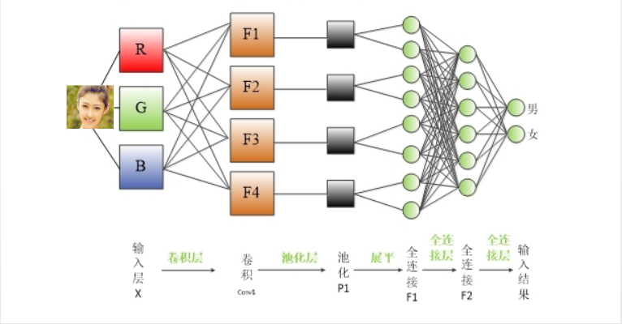
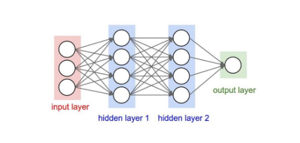
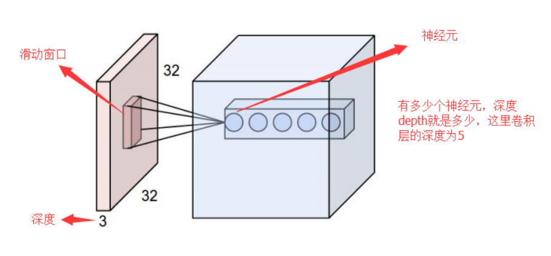
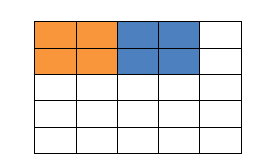
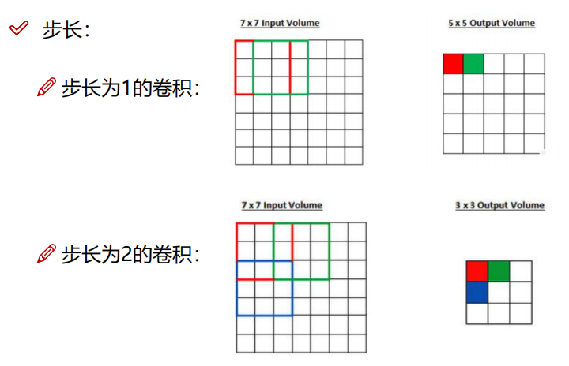
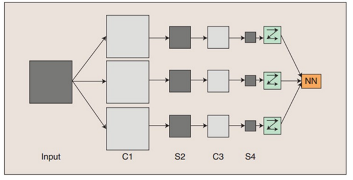

--

什么是卷积层？

为什么要使用卷积层？

在传统的神经网络中，比如多层感知机（MLP），

其输入通常是一个特征向量，

**需要人工设计特征，**

然后将这些特征计算的值组成特征向量，

在过去几十年的经验来看，**人工找到的特征并不是怎么好用，**

有时多了，有时少了，

有时选择的特征根本就不起作用（真正起作用的特征在浩瀚的未知里面）。

**这就是为什么在过去卷积神经网络一直被SVM等完虐的原因。**

如果有人说，任何特征都是从图像中提取的，

那如果把整副图像作为特征来训练神经网络不就行了，那肯定不会有任何信息丢失！

那先不说一幅图像有多少冗余信息，单说着信息量就超级多。。。

假如有一幅1000*1000的图像，如果把整幅图像作为向量，则向量的长度为1000000（10^6）。

再假如隐含层神经元的个数和输入一样，也是1000000；

那么，输入层到隐含层的参数数据量有10^12，

妈呀，什么样的机器能训练这样的网络呢。

所以，我们还得降低维数，同时得以整幅图像为输入（人类实在找不到好的特征了）。

于是，牛逼的卷积来了。接下来看看卷积都干了些啥。

CNN网络一共有5个层级结构：

- - **输入层**
  - **卷积层**
  - **激活层**
  - **池化层**
  - 全连接FC层

### 1 输入层

与传统神经网络/机器学习一样，模型需要输入的进行预处理操作，常见的输入层中对图像预处理方式有：

- 去均值
- 归一化
- PCA/SVD降维等

　　其中均值化：把输入数据各个维度都中心化到0，所有样本求和求平均，然后用所有的样本减去这个均值样本就是去均值。

　　归一化：**数据幅度归一化到同样的范围，对于每个特征而言，范围最好是 [-1, 1]**

　　PCA/白化：用PCA降维，让每个维度的相关度取消，特征和特征之间是相互独立的。白化是对数据每个特征轴上的幅度归一化

### 2 卷积层

​    **局部感知**：人的大脑识别图片的过程中，并不是一下子整张图同时识别，

而是对于图片中的每一个特征首先局部感知，

然后更高层次对局部进行综合操作，从而得到全局信息。 （后面详解）

### 3 激励层

　　所谓**激励**，实际上是**对卷积层的输出结果做一次非线性映射。** 
　　如果不用激励函数（其实就相当于激励函数是f(x)=x），这种情况下，每一层的输出都是上一层输入的线性函数。容易得出，无论有多少神经网络层，输出都是输入的线性组合，与没有隐层的效果是一样的，这就是最原始的**感知机**了。 
常用的激励函数有：

- - **Sigmoid函数**
  - Tanh函数
  - ReLU
  - Leaky ReLU
  - ELU
  - Maxout

　　激励层建议：首先ReLU，因为迭代速度快，但是有可能效果不加。**如果ReLU失效的情况下，考虑使用Leaky ReLU或者Maxout，此时一般情况都可以解决。Tanh函数在文本和音频处理有比较好的效果。**

### 4 池化层

　　**池化**（Pooling）：也称为**欠采样**或**下采样**。主要用于特征降维，压缩数据和参数的数量，减小过拟合，同时提高模型的容错性。主要有：

- - Max Pooling：最大池化
  - Average Pooling：平均池化 

　　Max Pooling：选取最大的，我们定义一个空间邻域（比如，2*2的窗口），并从窗口内的修正特征图中取出最大的元素，最大池化被证明效果更好一些。

　　Average Pooling：平均的，我们定义一个空间邻域（比如，2*2的窗口），并从窗口内的修正特征图中算出平均值。

虽然人不太容易分辨出池化后的特征图，但是没关系，机器还是可以识别的。

### 5 输出层（全连接层）

　　经过前面若干次卷积+激励+池化后，终于来到了输出层，模型会将学到的一个高质量的特征图片全连接层。其实在全连接层之前，如果神经元数目过大，学习能力强，有可能出现过拟合。因此，可以引入dropout操作，来随机删除神经网络中的部分神经元，来解决此问题。还可以进行**局部归一化**（LRN）、数据增强等操作，来增加鲁棒性。 
　　当来到了全连接层之后，可以理解为一个简单的多分类神经网络（如：BP神经网络），通过softmax函数得到最终的输出。整个模型训练完毕。 

　　两层之间所有神经元都有权重连接，

通常**全连接层在卷积神经网络尾部。**

也就是跟传统的神经网络神经元的连接方式是一样的： 

**先介绍卷积层遇到的几个名词：**

​    **• 深度/depth（解释见下图）
　　• 步长/stride （窗口一次滑动的长度）
　　• 填充值/zero-padding**

填充值是什么呢？以下图为例子，比如有这么一个`5*5`的图片（一个格子一个像素），我们滑动窗口取`2*2`，步长取2，那么我们发现还剩下1个像素没法滑完，那怎么办呢？

那我们在原先的矩阵加了一层填充值，使得变成6*6的矩阵，那么窗口就可以刚好把所有像素遍历完。这就是填充值的作用。

上面提到了步长的问题，我们看看在输入尺寸为7*7的图像中步长为1和步长为2的区别：

输入图像通过和三个可训练的滤波器和可加偏置进行卷积，

滤波过程如图一，

卷积后在C1层产生三个特征映射图，

然后特征映射图中每组的四个像素再进行求和，加权值，加偏置。

通过一个Sigmoid函数得到三个S2层的特征映射图。

这些映射图再进过滤波得到C3层。

这个层级结构再和S2一样产生S4。

最终，**这些像素值被光栅化**，并连接成一个向量输入到传统的神经网络，得到输出。

​    一般地，**C层为特征提取层，**

每个神经元的输入与前一层的局部感受野相连，并提取该局部的特征，

一旦该局部特征被提取后，它与其他特征间的位置关系也随之确定下来；

**S层是特征映射层，**

网络的每个计算层由多个特征映射组成，每个特征映射为一个平面，平面上所有神经元的权值相等。特征映射结构采用影响函数核小的sigmoid函数作为卷积网络的激活函数，使得特征映射具有位移不变性。

​    此外，由于一个映射面上的神经元共享权值，因而减少了网络自由参数的个数，降低了网络参数选择的复杂度。卷积神经网络中的每一个特征提取层（C-层）都紧跟着一个用来求局部平均与二次提取的计算层（S-层），这种特有的两次特征提取结构使网络在识别时对输入样本有较高的畸变容忍能力。

上面聊到，好像CNN一个厉害的地方就在于**通过感受野和权值共享减少了神经网络需要训练的参数的个数**。那究竟是啥的呢？

　　卷积神经网络有两种神器可以降低参数数目，

第一种神器叫做局部感知野。

一般认为人对外界的认知是从局部到全局的，

而图像的空间联系也是局部的像素联系较为紧密，

而距离较远的像素相关性则较弱。

因而，每个神经元其实没有必要对全局图像进行感知，

只需要对局部进行感知，

然后在更高层将局部的信息综合起来就得到了全局的信息。

网络部分连通的思想，也是受启发于生物学里面的视觉系统结构。

视觉皮层的神经元就是局部接受信息的（即这些神经元只响应某些特定区域的刺激）

 C1层是一个卷积层

（为什么是卷积？卷积运算一个重要的特点就是，通过卷积运算，可**以使原信号特征增强，并且降低噪音）**，

由6个特征图Feature Map构成。

特征图中每个神经元与输入中`5*5`的邻域相连。特征图的大小为`28*28`，这样能防止输入的连接掉到边界之外（是为了BP反馈时的计算，不致梯度损失，个人见解）。C1有156个可训练参数（每个滤波器`5*5=25`个unit参数和一个bias参数，一共6个滤波器，共`(5*5+1)*6=156`个参数），共`156*(28*28)=122,304`个连接。

### 如何选择卷积核的大小？越大越好还是越小越好？

答案是**小而深**，单独较小的卷积核也是不好的，只有堆叠很多小的卷积核，模型的性能才会提升。

参考资料

1、

https://www.cnblogs.com/wj-1314/p/9593364.html