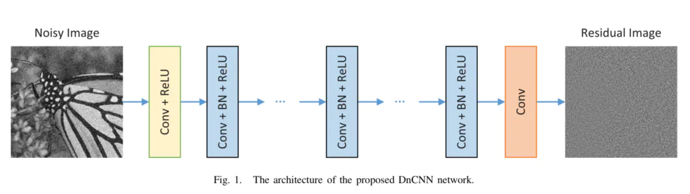

--

DnCNN，在高斯去噪问题下，用单模型应对不同程度的高斯噪音；

甚至可以用单模型应对高斯去噪、超分辨率、JPEG去锁三个领域的问题。

DnCNN已经发表很多年了，DnCNN模型结构简明，数据集构建也不麻烦，

模型训练需要的计算资源（显卡内存开销和训练时间）也不算长，24小时内基本可以完成训练，

**作为深度学习的入门或者较低要求的图像去噪任务是比较合适的。**

参考资料

1、

https://www.jianshu.com/p/3687ffed4aa8