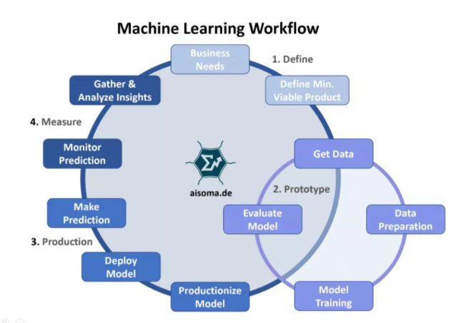
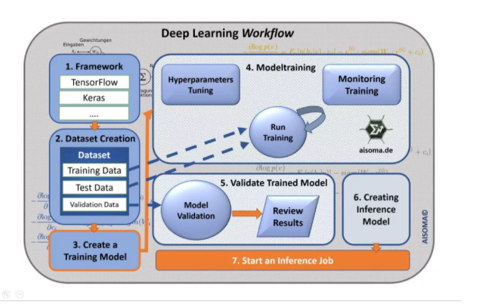
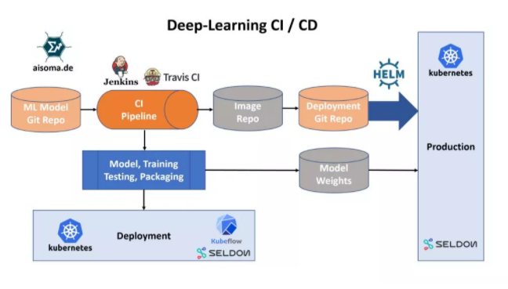
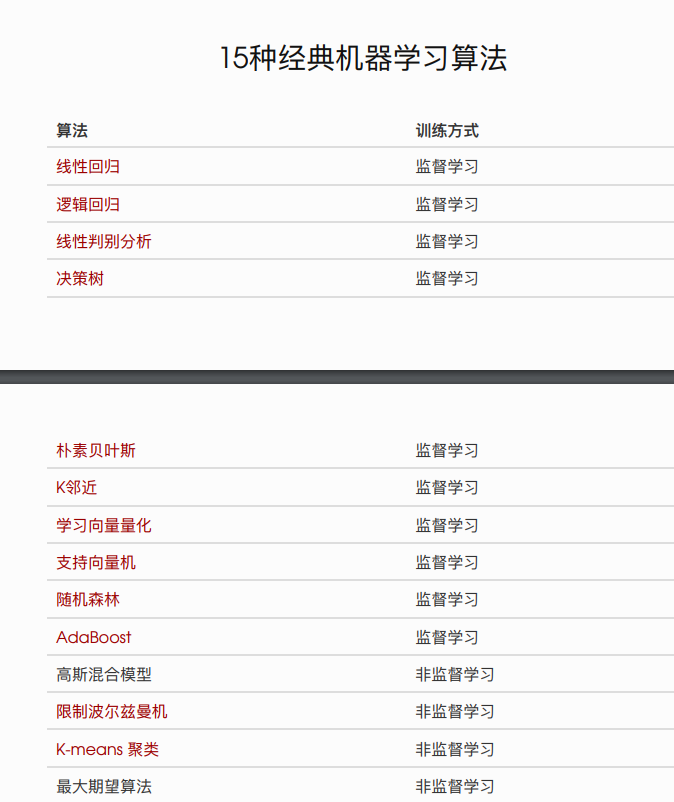
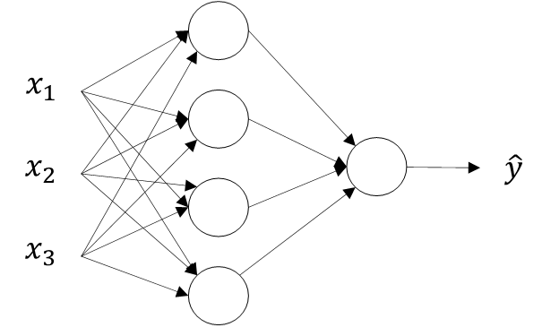
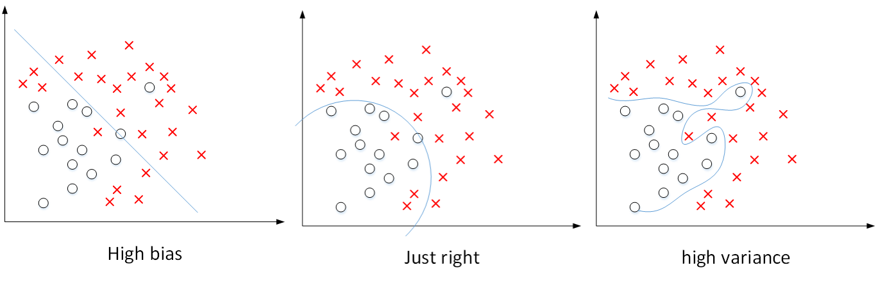

--

https://easyai.tech

这个网站收集了不少的关于AI的入门文章，有不少内容很有启发性，但是又难以归类。

所以都记录到这里吧。

内容不一定都是这个网站的，因为里面有不少的引用文章是外链。

机器学习的工作流程

深度学习的工作流程

深度学习的持续集成和交付。

狮⼦对⻝物也是⽐较挑剔的，不是给他吃啥都⾏的，⽽深度学习更是如此！

 数据是否有标注、数据是否“⼲净”、数据是否有多样性……都对深度学习的学习结果影响 巨⼤！ 

总结⼀下的话： 

1、深度学习时代的 AI 对数据量级要求极⾼ 

2、深度学习时代的 AI 对数据规范要求极⾼ 像 Google 这种拥有海量数据的公司最容易在 AI 领域有较⼤的突破和优势，⽽⼀般的⼩ 公司很难跨越数据的⻔槛。

如果在深⼊⼀点，从理论层⾯来解释 AI 的局限性，就要把图灵⼤师搬出来了。图灵在上 世纪30年代中期，就在思考3个问题：

1、世界上是否所有数学问题都有明确的答案？

2、如果有明确的答案，是否可以通过有限的步骤计算出答案？ ‘

3、 对于那些有可能在有限步骤计算出来的数学问题，能否有⼀种假象的机械，让他不 断运动，最后当机器停下来的时候，那个数学问题就解决了？

目前为止，由神经网络模型创造的价值基本上都是基于监督式学习（Supervised Learning）的。

监督式学习与非监督式学习本质区别就是是否已知训练样本的输出y

CNN一般处理图像问题，RNN一般处理语音信号。

他们的结构是什么意思？如何实现CNN和RNN的结构？

这些问题我们将在以后的课程中来深入分析并解决。

简单地说，Structured Data通常指的是有实际意义的数据。

例如房价预测中的size，#bedrooms，price等；

例如在线广告中的User Age，Ad ID等。

这些数据都具有实际的物理意义，比较容易理解。

而Unstructured Data通常指的是比较抽象的数据，

例如Audio，Image或者Text。

以前，计算机对于Unstructured Data比较难以处理，

而人类对Unstructured Data却能够处理的比较好，

例如我们第一眼很容易就识别出一张图片里是否有猫，

但对于计算机来说并不那么简单。

现在，值得庆幸的是，由于深度学习和神经网络的发展，

计算机在处理Unstructured Data方面效果越来越好，甚至在某些方面优于人类。

总的来说，神经网络与深度学习无论对Structured Data还是Unstructured Data都能处理得越来越好，并逐渐创造出巨大的实用价值。

我们在之后的学习和实际应用中也将会碰到许多Structured Data和Unstructured Data。

所以说，现在深度学习如此强大的原因归结为三个因素：

- **Data**
- **Computation**
- **Algorithms**

其中，数据量的几何级数增加，

加上GPU出现、计算机运算能力的大大提升，

使得深度学习能够应用得更加广泛。

另外，算法上的创新和改进让深度学习的性能和速度也大大提升。

举个算法改进的例子，

之前神经网络神经元的激活函数是Sigmoid函数，后来改成了ReLU函数。

之所以这样更改的原因是对于Sigmoid函数，

在远离零点的位置，函数曲线非常平缓，其梯度趋于0，

所以造成神经网络模型学习速度变得很慢。

然而，ReLU函数在x大于零的区域，其梯度始终为1，尽管在x小于零的区域梯度为0，

但是在实际应用中采用ReLU函数确实要比Sigmoid函数快很多。

构建一个深度学习的流程是首先产生Idea，

然后将Idea转化为Code，最后进行Experiment。

接着根据结果修改Idea，继续这种Idea->Code->Experiment的循环，

直到最终训练得到表现不错的深度学习网络模型。

如果计算速度越快，每一步骤耗时越少，那么上述循环越能高效进行。

神经网络的基础——逻辑回归。

首先，我们介绍了二分类问题，以图片为例，将多维输入x转化为feature vector，输出y只有{0,1}两个离散值。

接着，我们介绍了逻辑回归及其对应的Cost function形式。

然后，我们介绍了梯度下降算法，并使用计算图的方式来讲述神经网络的正向传播和反向传播两个过程。

最后，我们在逻辑回归中使用梯度下降算法，总结出最优化参数w和b的算法流程。

深度学习算法中，数据量很大，在程序中应该尽量减少使用loop循环语句，

而可以使用向量运算来提高程序运行速度。

向量化（Vectorization）就是利用矩阵运算的思想，大大提高运算速度。

例如下面所示在Python中使用向量化要比使用循环计算速度快得多。

使用for循环运行时间是使用向量运算运行时间的约300倍。

因此，深度学习算法中，使用向量化矩阵运算的效率要高得多。

前面的课程中，我们已经使用计算图的方式介绍了逻辑回归梯度下降算法的正向传播和反向传播两个过程。

神经网络的结构与逻辑回归类似，

只是神经网络的层数比逻辑回归多一层，

多出来的中间那层称为隐藏层或中间层。

这样从计算上来说，神经网络的正向传播和反向传播过程只是比逻辑回归多了一次重复的计算。

正向传播过程分成两层，第一层是输入层到隐藏层，

下面我们以图示的方式来介绍单隐藏层的神经网络结构。如下图所示，单隐藏层神经网络就是典型的浅层（shallow）神经网络。

这种单隐藏层神经网络也被称为两层神经网络（2 layer NN）。

之所以叫两层神经网络是因为，

通常我们只会计算隐藏层输出和输出层的输出，

输入层是不用计算的。

这也是我们把输入层层数上标记为0的原因

最后总结一下，

如果是分类问题，输出层的激活函数一般会选择sigmoid函数。

但是隐藏层的激活函数通常不会选择sigmoid函数，tanh函数的表现会比sigmoid函数好一些。

实际应用中，通常会会选择使用ReLU或者Leaky ReLU函数，保证梯度下降速度不会太小。

其实，具体选择哪个函数作为激活函数没有一个固定的准确的答案，

应该要根据具体实际问题进行验证（validation）。

我们都知道神经网络能处理很多问题，而且效果显著。

其强大能力主要源自神经网络足够“深”，

也就是说网络层数越多，神经网络就更加复杂和深入，学习也更加准确。

接下来，我们从几个例子入手，看一下为什么深度网络能够如此强大。

先来看人脸识别的例子，如下图所示。

经过训练，神经网络第一层所做的事就是从原始图片中提取出人脸的轮廓与边缘，即边缘检测。

这样每个神经元得到的是一些边缘信息。

神经网络第二层所做的事情就是将前一层的边缘进行组合，

组合成人脸一些局部特征，

比如眼睛、鼻子、嘴巴等。

再往后面，就将这些局部特征组合起来，融合成人脸的模样。

可以看出，随着层数由浅到深，神经网络提取的特征也是从边缘到局部特征到整体，由简单到复杂。

**可见，如果隐藏层足够多，那么能够提取的特征就越丰富、越复杂，模型的准确率就会越高。**

语音识别模型也是这个道理。

浅层的神经元能够检测一些简单的音调，

然后较深的神经元能够检测出基本的音素，

更深的神经元就能够检测出单词信息。

如果网络够深，还能对短语、句子进行检测。

记住一点，神经网络从左到右，神经元提取的特征从简单到复杂。

特征复杂度与神经网络层数成正相关。

特征越来越复杂，功能也越来越强大。

尽管深度学习有着非常显著的优势，Andrew还是建议对实际问题进行建模时，尽量先选择层数少的神经网络模型，这也符合奥卡姆剃刀定律（Occam’s Razor）。对于比较复杂的问题，再使用较深的神经网络模型。

那么，神经网络跟人脑机制到底有什么联系呢？

究竟有多少的相似程度？

神经网络实际上可以分成两个部分：正向传播过程和反向传播过程。

神经网络的每个神经元采用激活函数的方式，类似于感知机模型。

这种模型与人脑神经元是类似的，

可以说是一种非常简化的人脑神经元模型。

如下图所示，人脑神经元可分为树突、细胞体、轴突三部分。

树突接收外界电刺激信号（类比神经网络中神经元输入），传递给细胞体进行处理（类比神经网络中神经元激活函数运算），最后由轴突传递给下一个神经元（类比神经网络中神经元输出）。

值得一提的是，人脑神经元的结构和处理方式要复杂的多，

神经网络模型只是非常简化的模型。

人脑如何进行学习？

是否也是通过反向传播和梯度下降算法现在还不清楚，可能会更加复杂。

这是值得生物学家探索的事情。

也许发现重要的新的人脑学习机制后，让我们的神经网络模型抛弃反向传播和梯度下降算法，能够实现更加准确和强大的神经网络模型！

选择最佳的训练集（Training sets）、验证集（Development sets）、测试集（Test sets）对神经网络的性能影响非常重要。

除此之外，在构建一个神经网络的时候，我们需要设置许多参数，

例如神经网络的层数、每个隐藏层包含的神经元个数、学习因子（学习速率）、激活函数的选择等等。

实际上很难在第一次设置的时候就选择到这些最佳的参数，

而是需要通过不断地迭代更新来获得。

这个循环迭代的过程是这样的：

我们先有个想法Idea，

先选择初始的参数值，构建神经网络模型结构；

然后通过代码Code的形式，实现这个神经网络；

最后，通过实验Experiment验证这些参数对应的神经网络的表现性能。

根据验证结果，我们对参数进行适当的调整优化，再进行下一次的Idea->Code->Experiment循环。

通过很多次的循环，不断调整参数，选定最佳的参数值，从而让神经网络性能最优化。

一般地，我们将所有的样本数据分成三个部分：Train/Dev/Test sets。

Train sets用来训练你的算法模型；

Dev sets用来验证不同算法的表现情况，从中选择最好的算法模型；

Test sets用来测试最好算法的实际表现，作为该算法的无偏估计。

之前人们通常设置Train sets和Test sets的数量比例为70%和30%。

如果有Dev sets，则设置比例为60%、20%、20%，分别对应Train/Dev/Test sets。

这种比例分配在样本数量不是很大的情况下，例如100,1000,10000，是比较科学的。

但是如果数据量很大的时候，例如100万，这种比例分配就不太合适了。

科学的做法是要将Dev sets和Test sets的比例设置得很低。

因为Dev sets的目标是用来比较验证不同算法的优劣，从而选择更好的算法模型就行了。

因此，通常不需要所有样本的20%这么多的数据来进行验证。

对于100万的样本，往往只需要10000个样本来做验证就够了。

Test sets也是一样，目标是测试已选算法的实际表现，无偏估计。

对于100万的样本，往往也只需要10000个样本就够了。

因此，对于大数据样本，

Train/Dev/Test sets的比例通常可以设置为98%/1%/1%，或者99%/0.5%/0.5%。

样本数据量越大，相应的Dev/Test sets的比例可以设置的越低一些。

现代深度学习还有个重要的问题就是训练样本和测试样本分布上不匹配，

意思是训练样本和测试样本来自于不同的分布。

举个例子，假设你开发一个手机app，可以让用户上传图片，然后app识别出猫的图片。

在app识别算法中，你的训练样本可能来自网络下载，而你的验证和测试样本可能来自不同用户的上传。

从网络下载的图片一般像素较高而且比较正规，

而用户上传的图片往往像素不稳定，且图片质量不一。

因此，训练样本和验证/测试样本可能来自不同的分布。

解决这一问题的比较科学的办法是尽量保证Dev sets和Test sets来自于同一分布。

值得一提的是，训练样本非常重要，通常我们可以将现有的训练样本做一些处理，

例如图片的翻转、假如随机噪声等，来扩大训练样本的数量，从而让该模型更加强大。

即使Train sets和Dev/Test sets不来自同一分布，使用这些技巧也能提高模型性能。

偏差（Bias）和方差（Variance）是机器学习领域非常重要的两个概念和需要解决的问题。

在传统的机器学习算法中，

Bias和Variance是对立的，分别对应着欠拟合和过拟合，

我们常常需要在Bias和Variance之间进行权衡。

而在深度学习中，我们可以同时减小Bias和Variance，构建最佳神经网络模型。

深度神经网络需要调试的超参数（Hyperparameters）较多，包括：

αα：学习因子

ββ：动量梯度下降因子

β1,β2,ε：Adam算法参数

#layers：神经网络层数

#hidden units：各隐藏层神经元个数

learning rate decay：学习因子下降参数

mini-batch size：批量训练样本包含的样本个数

在训练深度神经网络时，

一种情况是受计算能力所限，我们只能对一个模型进行训练，调试不同的超参数，使得这个模型有最佳的表现。

我们称之为Babysitting one model。

另外一种情况是可以对多个模型同时进行训练，每个模型上调试不同的超参数，根据表现情况，选择最佳的模型。

我们称之为Training many models in parallel。

对已经建立的机器学习模型进行错误分析（error analysis）十分必要，而且有针对性地、正确地进行error analysis更加重要。

举个例子，猫类识别问题，已经建立的模型的错误率为10%。

为了提高正确率，我们发现该模型会将一些狗类图片错误分类成猫。

一种常规解决办法是扩大狗类样本，增强模型对狗类（负样本）的训练。

但是，**这一过程可能会花费几个月的时间**，耗费这么大的时间成本到底是否值得呢？

也就是说扩大狗类样本，重新训练模型，对提高模型准确率到底有多大作用？

**这时候我们就需要进行error analysis，帮助我们做出判断。**

方法很简单，我们可以从分类错误的样本中统计出狗类的样本数量。

根据狗类样本所占的比重，判断这一问题的重要性。假如狗类样本所占比重仅为5%，即时我们花费几个月的时间扩大狗类样本，提升模型对其识别率，改进后的模型错误率最多只会降低到9.5%。相比之前的10%，并没有显著改善。我们把这种性能限制称为ceiling on performance。相反，假如错误样本中狗类所占比重为50%，那么改进后的模型错误率有望降低到5%，性能改善很大。因此，值得去花费更多的时间扩大狗类样本。

对于如何构建一个机器学习应用模型，Andrew给出的建议是先快速构建第一个简单模型，然后再反复迭代优化。

深度学习非常强大的一个功能之一

就是有时候你可以将已经训练好的模型的一部分知识（网络结构）直接应用到另一个类似模型中去。

比如我们已经训练好一个猫类识别的神经网络模型，

那么我们可以直接把**该模型中的一部分网络结构**应用到使用X光片预测疾病的模型中去。

这种学习方法被称为迁移学习（Transfer Learning）。

使用传统神经网络处理机器视觉的一个主要问题是输入层维度很大。

例如一张64x64x3的图片，

神经网络输入层的维度为12288。

如果图片尺寸较大，例如一张1000x1000x3的图片，神经网络输入层的维度将达到3百万，

使得网络权重W非常庞大。

这样会造成两个后果，

一是神经网络结构复杂，数据量相对不够，容易出现过拟合；

二是所需内存、计算量较大。

解决这一问题的方法就是使用卷积神经网络（CNN）。

对于CV问题，我们在之前的笔记中介绍过，神经网络由浅层到深层，分别可以检测出图片的边缘特征 、局部特征（例如眼睛、鼻子等）、整体面部轮廓。

这一小节我们将介绍如何检测图片的边缘。

最常检测的图片边缘有两类：一是垂直边缘（vertical edges），二是水平边缘（horizontal edges）。

除了这些性能良好的CNN模型之外，我们还会介绍Residual Network（ResNet）。

其特点是可以构建很深很深的神经网络（目前最深的好像有152层）。

这样，看似很深的神经网络，

其实由于许多Residual blocks的存在，弱化削减了某些神经层之间的联系，实现隔层线性传递，

而不是一味追求非线性关系，

模型本身也就能“容忍”更深层的神经网络了。

而且从性能上来说，这两层额外的Residual blocks也不会降低Big NN的性能。

参考资料

1、

https://blog.csdn.net/red_stone1/article/details/77799014