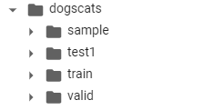

--

官网：https://www.fast.ai/

fast.ai是让新手快速实施深度学习的工具包，

而且是当前最佳实践的强大而便捷的源。

每当fast.ai团队（以及他们的AI研究人员和合作者网络）发现一篇特别有趣的论文时，

他们就会在各种数据集上进行测试，并找出如何调整它的方法。

如果它们成功，它将在库中实现，并且用户可以快速访问该技术。

fastai底层用的是pytorch。

https://github.com/fastai/fastai

官方教程

https://github.com/fastai/fastbook/blob/master/README_zh.md


Fast.ai，最受人们欢迎的MOOC课程和深度学习框架之一。

重代码而非数学，这让不少使用Fast.ai的**初学者称霸各种Kaggle比赛**。


新版本完全对Fast.ai V1进行了重置，构建了全新的深度学习框架。更轻快、更灵活、更容易使用。

而且，对中国用户最友好的是，全部课程视频都有**简体中文字幕**。


Fast.ai除了提供免费的课程，更主要的是作为一个高度简化集成的深度学习框架，为初学者提供了简单易上手的深度学习任务工具，比如CV分割工具。


核心功能是3个库：**fastcore**，**fastscript**和**fastgpu**。


简单来说，fastai只要**一个API**，就包含了所有常见的深度学习应用。堪称实用版的“要你命3000”。而且许多性能指标，已经超越了Keras。

比如，**5行**代码完成Keras用**31行**才能解决的事情。同时，误差表现也更好。难怪在Hacker News上，fastai的关注度比PyTorch 1.0还高……


而大多数架构，如Resnet、VGG、inception等都是在ImageNet上经过预训练的，如果要使用它们，我们必须考量手头数据集和ImageNet图像的相似程度，并以此对权重做或多或少的调整。在修改权重时，模型的最后几层调整幅度更大，而用于检测基础特征的层（比如边缘和轮廓）则只需极少调整。


一开始， Jeremy 是打算基于 Tensorflow 来做的。在准备迭代第二次课程的时候，PyTorch 的出现让他眼前一亮。PyTorch 的 API 更加简洁，一致性更强，用户友好程度比起 Tensorflow 1.x 要好很多。于是 Jeremy 修改了方案，基于 PyTorch 开发前端 API ，名字就叫做 fast.ai 。


神经网络的泡沫越吹越大，现在，从小学生到高中老师现在都是神经网络库的目标市场。哪里有需求哪里就有轮子。

Tensorflow 已经有了 Keras，

PyTorch 当然也得出一个对标的高阶封装库，于是 Fastai 应运而生。

由于目标市场比较低端，Fastai 在某种程度上舍弃了定制化，更追求开箱即用。个人感觉会成为神经网络界的 sklearn 吧。这里写个 MNIST 给同学们感受一下，风格很『命令式』：


就在colab上进行使用。

```
!pip install fastai
```

查看版本

```
import fastai
fastai.__version__
# 1.0.61
```

现在不是到2.x版本了么？更新一下。

指定版本：

```
!pip install fastai==2.5.0
```

然后下载猫狗测试数据：

```
! wget https://files.fast.ai/data/examples/dogscats.tgz
!tar -xf dogscats.zip
```

数据有800M，不过在colab上下载速度非常快。

解压后的目录是这样：




```
from fastai import *
from fastai.vision import *
from fastai.vision.data import ImageDataLoaders
path = './dogscats'
data = ImageDataLoaders.from_folder(path,valid_pct=0.2)
```

```
data.show_batch()
```


报了这个错误。

```
RuntimeError: stack expects each tensor to be equal size, but got [3, 384, 287] at entry 0 and [3, 399, 242] at entry 1
```

这个先不继续了。

看看这篇文章。

https://github.com/PacktPublishing/Deep-Learning-with-fastai-Cookbook/blob/main/ch2/fastai_dataset_walkthrough.ipynb


然后看fastai代码下的dev_nbs里的例子。

12 cat breeds and 25 dogs breeds

根据论文，最好的准确率是59%（在2012年）

使用untar_data这个函数，作用是下载并解压。参数是一个url。


# 代码分析

这个有点奇特，python代码都是先写的jupyter notebook，然后转成python文件的。

所以看代码就直接看jupyter。

python代码的可读性则没有那么好。

```
SRC = $(wildcard nbs/*.ipynb)
fastai: $(SRC)
	nbdev_clean_nbs
	nbdev_build_lib
```

# nbdev分析

nbdev已经加入 PyPI，使用下面的命令安装：

```javascript
pip install nbdev
```

不过，这个的好处是什么？

写代码其实还是要尽量紧凑可读。

这种混杂，程序员其实是不喜欢的。

先自己写要给HelloWorld看看。

## HelloWorld


## 参考资料

https://bbs.huaweicloud.com/blogs/145337


作者信息

Jeremy Howard 在业界可谓大名鼎鼎。

他是大数据竞赛平台 Kaggle 的前主席和首席科学家。

他本人还是 Kaggle 的冠军选手。

他是美国奇点大学（Singularity University）最年轻的教职工。

曾于 2014 年，作为全球青年领袖，在达沃斯论坛上发表主题演讲。

他在 TED 上的演讲 The wonderful and terrifying implications of computers that can learn 收获高达 200 万的点击。

同时，他还创立了 Enlitic, FastMail，以及 Optimal Decisions Group 三家科技公司，并担任 CEO。

2017 年Jeremy Howard 又创立了 [Fast AI](http://course.fast.ai/) 技术分享平台，

免费提供关于深度学习技术的系列视频教程，以帮助从业者迅速开发人工智能相关产品。


https://www.cnblogs.com/ipaomi/p/7873529.html


参考资料

1、fastai教程

https://www.jianshu.com/p/59cdbf7439df

2、

https://zhuanlan.zhihu.com/p/196368414

3、

https://zhuanlan.zhihu.com/p/41192499

4、如何评价Fastai？

https://www.zhihu.com/question/297031440

5、初探fast ai(在colab上)

https://zhuanlan.zhihu.com/p/73634937

https://stackoverflow.com/questions/63581422/imagedatabunch-function-is-not-defined-fastai-windows