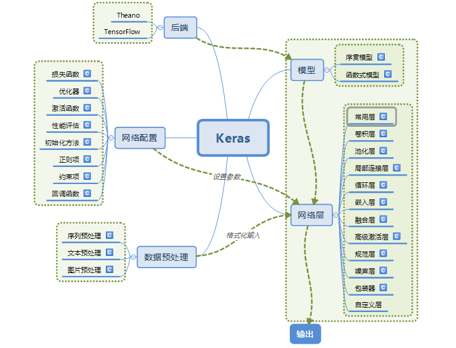
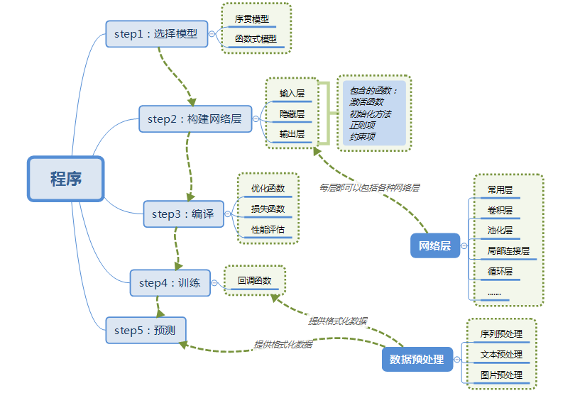
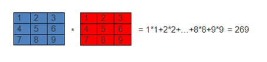
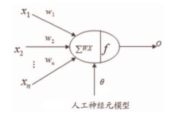
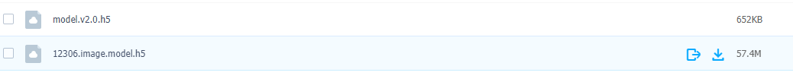

--

看tensorflow文档，看到Keras这个东西，先了解一下。

Keras 是一个用 Python 编写的高级神经网络 API，

它能够以 [TensorFlow](https://github.com/tensorflow/tensorflow), [CNTK](https://github.com/Microsoft/cntk), 或者 [Theano](https://github.com/Theano/Theano) 作为后端运行。

Keras 的开发重点是支持快速的实验。

能够以最小的时延把你的想法转换为实验结果，是做好研究的关键。

如果你在以下情况下需要深度学习库，请使用 Keras：

- 允许简单而快速的原型设计（由于用户友好，高度模块化，可扩展性）。
- 同时支持卷积神经网络和循环神经网络，以及两者的组合。
- 在 CPU 和 GPU 上无缝运行。

Keras 的核心数据结构是 **model**，一种组织网络层的方式。

最简单的模型是 [Sequential 顺序模型](https://keras.io/getting-started/sequential-model-guide)，它由多个网络层线性堆叠。对于更复杂的结构，你应该使用 [Keras 函数式 API](https://keras.io/getting-started/functional-api-guide)，它允许构建任意的神经网络图。


设计原则

a）用户友好：Keras是为人类而不是天顶星人设计的API。

用户的使用体验始终是我们考虑的首要和中心内容。

Keras遵循减少认知困难的最佳实践：

Keras提供一致而简洁的API， 能够极大减少一般应用下用户的工作量，

同时，Keras提供清晰和具有实践意义的bug反馈。

b）模块性：模型可理解为一个层的序列或数据的运算图，完全可配置的模块可以用最少的代价自由组合在一起。

具体而言，网络层、损失函数、优化器、初始化策略、激活函数、正则化方法都是独立的模块，你可以使用它们来构建自己的模型。

c）易扩展性：添加新模块超级容易，只需要仿照现有的模块编写新的类或函数即可。

创建新模块的便利性使得Keras更适合于先进的研究工作。

d）与Python协作：Keras没有单独的模型配置文件类型（作为对比，caffe有），

**模型由python代码描述，使其更紧凑和更易debug，并提供了扩展的便利性。**

keras的模块结构




用keras搭建一个神经网络的步骤




张量(tensor)，可以看作是向量、矩阵的自然推广，用来表示广泛的数据类型。张量的阶数也叫维度。

0阶张量,即标量,是一个数。

1阶张量,即向量,一组有序排列的数

2阶张量,即矩阵,一组向量有序的排列起来

3阶张量，即立方体，一组矩阵上下排列起来

4阶张量......

重点：关于维度的理解

假如有一个10长度的列表，那么我们横向看有10个数字，也可以叫做10维度，纵向看只能看到1个数字，那么就叫1维度。注意这个区别有助于理解Keras或者神经网络中计算时出现的维度问题。


数据格式(data_format)

目前主要有两种方式来表示张量：

a) th模式或channels_first模式，Theano和caffe使用此模式。

b）tf模式或channels_last模式，TensorFlow使用此模式。


下面举例说明两种模式的区别：

对于100张RGB3通道的16×32（高为16宽为32）彩色图，

th表示方式：（100,3,16,32）

tf表示方式：（100,16,32,3）


Keras有两种类型的模型，序贯模型（Sequential）和函数式模型（Model），

**函数式模型应用更为广泛，序贯模型是函数式模型的一种特殊情况。**

a）序贯模型（Sequential):**单输入单输出**，一条路通到底，层与层之间只有相邻关系，没有跨层连接。这种模型编译速度快，操作也比较简单

b）函数式模型（Model）：**多输入多输出**，层与层之间任意连接。这种模型编译速度慢。

# 概念

## 符号计算

Keras的底层库使用Theano或TensorFlow，这两个库也称为Keras的后端。

无论是Theano还是TensorFlow，都是一个“符号式”的库。

因此，这也使得Keras的编程与传统的Python代码有所差别。

笼统的说，

符号主义的计算

首先定义各种变量，

然后建立一个“计算图”，

计算图规定了各个变量之间的计算关系。

建立好的计算图需要编译以确定其内部细节，

然而，此时的计算图还是一个“空壳子”，

里面没有任何实际的数据，

只有当你把需要运算的输入放进去后，

才能在整个模型中形成数据流，从而形成输出值。


就像用管道搭建供水系统，

当你在拼水管的时候，里面是没有水的。

只有所有的管子都接完了，才能送水。


Keras的模型搭建形式就是这种方法，

在你搭建Keras模型完毕后，

你的模型就是一个空壳子，

只有实际生成可调用的函数后（K.function），输入数据，才会形成真正的数据流。

使用计算图的语言，如Theano，以难以调试而闻名，

当Keras的Debug进入Theano这个层次时，往往也令人头痛。

没有经验的开发者很难直观的感受到计算图到底在干些什么。

尽管很让人头痛，但大多数的深度学习框架使用的都是符号计算这一套方法，

**因为符号计算能够提供关键的计算优化、自动求导等功能。**

## 函数式模型

函数式模型算是本文档比较原创的词汇了，所以这里要说一下

在Keras 0.x中，模型其实有两种，

一种叫Sequential，

称为序贯模型，也就是单输入单输出，一条路通到底，

层与层之间只有相邻关系，跨层连接统统没有。

这种模型编译速度快，操作上也比较简单。

第二种模型称为Graph，即图模型，

这个模型支持多输入多输出，

层与层之间想怎么连怎么连，但是编译速度慢。

**可以看到，Sequential其实是Graph的一个特殊情况。**


在Keras1和Keras2中，图模型被移除，

而增加了了“functional model API”，

这个东西，更加强调了Sequential是特殊情况这一点。

一般的模型就称为Model，然后如果你要用简单的Sequential，OK，那还有一个快捷方式Sequential。

由于functional model API在使用时利用的是“函数式编程”的风格，

我们这里将其译为函数式模型。

总而言之，只要这个东西

接收一个或一些张量作为输入，

然后输出的也是一个或一些张量，

那不管它是什么鬼，统统都称作“模型”。


## batch

这个概念与Keras无关，老实讲不应该出现在这里的，

但是因为它频繁出现，而且不了解这个技术的话看函数说明会很头痛，

这里还是简单说一下。

**深度学习的优化算法，说白了就是梯度下降。**

每次的参数更新有两种方式。

第一种，

遍历全部数据集算一次损失函数，

然后算函数对各个参数的梯度，更新梯度。

这种方法每更新一次参数都要把数据集里的所有样本都看一遍，

计算量开销大，计算速度慢，不支持在线学习，

这称为Batch gradient descent，批梯度下降。


另一种，

每看一个数据就算一下损失函数，然后求梯度更新参数，这个称为随机梯度下降，

stochastic gradient descent。

这个方法速度比较快，但是收敛性能不太好，可能在最优点附近晃来晃去，hit不到最优点。

两次参数的更新也有可能互相抵消掉，造成目标函数震荡的比较剧烈。


为了克服两种方法的缺点，

现在一般采用的是一种折中手段，

mini-batch gradient decent，

小批的梯度下降，

这种方法把数据分为若干个批，按批来更新参数，

这样，一个批中的一组数据共同决定了本次梯度的方向，下降起来就不容易跑偏，减少了随机性。

另一方面因为批的样本数与整个数据集相比小了很多，计算量也不是很大。


基本上现在的梯度下降都是基于mini-batch的，

所以Keras的模块中经常会出现batch_size，就是指这个。

顺便说一句，Keras中用的优化器SGD是stochastic gradient descent的缩写，

但不代表是一个样本就更新一回，还是基于mini-batch的。


https://keras-cn.readthedocs.io/en/latest/for_beginners/concepts/

# api


# 极简入门

当我们使用Theano作为后端时，

需要显式的声明输入图片的深度。

例如，一幅拥有3个RGB通道的全彩图像的深度为3.

 我们使用的MNIST图片的深度只有1，但还是需要显式的声明。

 换句话说，

我们需要把数据集的维度从(样本个数，宽度，高度)

转换为(样本个数，深度，宽度，高度)。


参考资料

https://www.jianshu.com/p/132746857e3a

# 最简单的keras例子

代码我放在这里了。

https://github.com/teddyxiong53/tensorflow_test/blob/main/basic_keras.ipynb

就是预测一个简单的y=wx+b的例子。

一个神经元。


# 示例

**这里也采用介绍神经网络时常用的一个例子：手写数字的识别。**

在写代码之前，基于这个例子介绍一些概念，方便大家理解。

PS：可能是版本差异的问题，官网中的参数和示例中的参数是不一样的，官网中给出的参数少，并且有些参数支持，有些不支持。所以此例子去掉了不支持的参数，并且只介绍本例中用到的参数。

1）Dense(500,input_shape=(784,))

a）Dense层属于网络层-->常用层中的一个层

b） 500表示输出的维度，完整的输出表示：(*,500)：即输出任意个500维的数据流。但是在参数中只写维度就可以了，比较具体输出多少个是有输入确定的。换个说法，Dense的输出其实是个N×500的矩阵。

c）input_shape(784,) 表示输入维度是784(28×28，后面具体介绍为什么)，完整的输入表示：(*,784)：即输入N个784维度的数据

2）Activation('tanh')

a）Activation：激活层

b）'tanh' ：激活函数

3）Dropout(0.5)

在训练过程中每次更新参数时随机断开一定百分比（rate）的输入神经元，防止过拟合。

```python
from keras.models import Sequential
from keras.layers.core import Dense, Dropout, Activation
from keras.optimizers import SGD
from keras.datasets import mnist
import numpy
'''
第一步：选择模型
'''
model = Sequential()
'''
第二步：构建网络层
'''
model.add(Dense(500,input_shape=(784,))) # 输入层，28*28=784
model.add(Activation('tanh')) # 激活函数是tanh
model.add(Dropout(0.5)) # 采用50%的dropout

model.add(Dense(500)) # 隐藏层节点500个
model.add(Activation('tanh'))
model.add(Dropout(0.5))

model.add(Dense(10)) # 输出结果是10个类别，所以维度是10
model.add(Activation('softmax')) # 最后一层用softmax作为激活函数

'''
第三步：编译
'''
sgd = SGD(lr=0.01, decay=1e-6, momentum=0.9, nesterov=True) # 优化函数，设定学习率（lr）等参数
model.compile(loss='categorical_crossentropy', optimizer=sgd, class_mode='categorical') # 使用交叉熵作为loss函数

'''
第四步：训练
.fit的一些参数
batch_size：对总的样本数进行分组，每组包含的样本数量
epochs ：训练次数
shuffle：是否把数据随机打乱之后再进行训练
validation_split：拿出百分之多少用来做交叉验证
verbose：屏显模式 0：不输出 1：输出进度 2：输出每次的训练结果
'''
(X_train, y_train), (X_test, y_test) = mnist.load_data() # 使用Keras自带的mnist工具读取数据（第一次需要联网）
# 由于mist的输入数据维度是(num, 28, 28)，这里需要把后面的维度直接拼起来变成784维
X_train = X_train.reshape(X_train.shape[0], X_train.shape[1] * X_train.shape[2])
X_test = X_test.reshape(X_test.shape[0], X_test.shape[1] * X_test.shape[2])
Y_train = (numpy.arange(10) == y_train[:, None]).astype(int)
Y_test = (numpy.arange(10) == y_test[:, None]).astype(int)

model.fit(X_train,Y_train, batch_size=200, epochs=50, shuffle=True, verbose=0, validation_split=0.3)
model.evaluate(X_test, Y_test, batch_size=200, verbose=0)

'''
第五步：输出
'''
print("test set")
scores = model.evaluate(X_test,Y_test,batch_size=200,verbose=0)
print("")
print("The test loss is %f" % scores)
result = model.predict(X_test,batch_size=200,verbose=0)

result_max = numpy.argmax(result, axis = 1)
test_max = numpy.argmax(Y_test, axis = 1)

result_bool = numpy.equal(result_max, test_max)
true_num = numpy.sum(result_bool)
print("")
print("The accuracy of the model is %f" % (true_num/len(result_bool)))
```


什么是卷积？

简单来说，卷积(或内积)就是一种先把对应位置相乘然后再把结果相加的运算。(具体含义或者数学公式可以查阅相关资料)

如下图就表示卷积的运算过程：



卷积运算一个重要的特点就是，通过卷积运算，可以使原信号特征增强，并且降低噪音.

如图是一个人工神经元的模型：




对于每一个神经元，都包含以下几部分：

x:表示输入

w:表示权重

θ:表示偏置

∑wx:表示卷积(内积)

f :表示激活函数

o:表示输出

# 12306验证码怎么使用keras

模型文件放在这里。

```
https://pan.baidu.com/s/1rS155VjweWVWIJogakechA  密码:bmlm
```

有这2个模型文件，都是H5模型。



模型来自于这个项目。

https://github.com/zhaipro/easy12306

两个必要的数据集：

1. 文字识别，model.h5
2. 图片识别，12306.image.model.h5

因为12306的验证码是这样的逻辑：

1、给出文件提示。文字也是图片方式提供的，是验证码的一部分。

2、给出图片。根据文字提示找图片。

https://github.com/zhaipro/easy12306/blob/master/mlearn.py


这个链接是生成验证码的，是base64编码的。现在还可以用。

https://kyfw.12306.cn/passport/captcha/captcha-image64


这个是从图片识别出文字。

```
python3 mlearn_for_image.py 8.jpg
```

# 损失函数loss

损失函数（或称目标函数、优化评分函数）是编译模型时所需的两个参数之一：

```
model.compile(loss='mean_squared_error', optimizer='sgd')
from keras import losses

model.compile(loss=losses.mean_squared_error, optimizer='sgd')
```

你可以传递一个现有的损失函数名，

或者一个 TensorFlow/Theano 符号函数。

# 评价函数metrics

评价函数用于评估当前训练模型的性能。当模型编译后（compile），评价函数应该作为 `metrics` 的参数来输入。

```
model.compile(loss='mean_squared_error',
              optimizer='sgd',
              metrics=['mae', 'acc'])
from keras import metrics

model.compile(loss='mean_squared_error',
              optimizer='sgd',
              metrics=[metrics.mae, metrics.categorical_accuracy])
```

评价函数和 [损失函数](https://keras.io/losses) 相似，只不过评价函数的结果不会用于训练过程中。

# 优化器optimizer

你可以先实例化一个优化器对象，然后将它传入 `model.compile()`，

像上述示例中一样， 或者你可以通过名称来调用优化器。

在后一种情况下，将使用优化器的默认参数。

```
# 传入优化器名称: 默认参数将被采用
model.compile(loss='mean_squared_error', optimizer='sgd')
```

# 激活函数

激活函数可以通过设置单独的激活层实现，也可以在构造层对象时通过传递 `activation` 参数实现：

```
from keras.layers import Activation, Dense

model.add(Dense(64))
model.add(Activation('tanh'))
```

等价于：

```
model.add(Dense(64, activation='tanh'))
```


# Dense参数

完整参数是这样：

```
keras.layers.Dense(units,  有几个神经元
				  activation=None,  这一层使用的激活函数。
				  use_bias=True,  是否添加偏置项
				  kernel_initializer='glorot_uniform',  权重初始化方法。
				  bias_initializer='zeros', 偏置初始化方法。
				  kernel_regularizer=None, 权重规范函数
				  bias_regularizer=None, 偏置规范函数
			      activity_regularizer=None, 输出的规范函数
				  kernel_constraint=None, 权重变化的限制函数
				  bias_constraint=None) 偏置的限制函数。
```


在keras中，数据是以张量的形式表示的，

不考虑动态特性，仅考虑shape的时候，可以把张量用类似矩阵的方式来理解。

例如
        [[1],[2],[3]] 这个张量的shape为（3,1）
        [[[1,2],[3,4]],[[5,6],[7,8]],[[9,10],[11,12]]]这个张量的shape为（3,2,2）,
        [1,2,3,4]这个张量的shape为（4，）

shape的值，就是从外往里数的。

 [[1],[2],[3]] 这个，从外往里， 首先一次，是剥离出3个元素，继续往里，是剥离出一个元素。

所以shape就记作（3,1）

 [1,2,3,4] 记作(4,)因为是一个tuple，所以最后的这个逗号不能省。


**input_shape：**即张量的shape。**从前往后对应由外向内的维度。**

**input_length：**代表序列长度，可以理解成有多少个样本

**input_dim：**代表张量的维度，（很好理解，之前3个例子的input_dim分别为2,3,1）


通过input_length和input_dim这两个参数，可以直接确定张量的shape。

**常见的一种用法：**只提供了input_dim=32，说明输入是一个32维的向量，相当于一个一阶、拥有32个元素的张量，它的shape就是（32，）。因此，input_shape=(32, )


Dense layer 就是常提到和用到的全连接层 。

Dense 实现的操作为：

output = activation(dot(input, kernel) + bias) 

其中 activation 是按逐个元素计算的激活函数，

kernel 是由网络层创建的权值矩阵，

以及 bias 是其创建的偏置向量 (只在 use_bias=True 时才有用)。


只有第一层需要指定输入的维度。后面的层都不需要了。

输入尺寸
nD 张量，尺寸: (batch_size, …, input_dim)。 最常见的情况是一个尺寸为 (batch_size, input_dim) 的 2D 输入。


输出尺寸
nD 张量，尺寸: (batch_size, …, units)。 例如，对于尺寸为 (batch_size, input_dim) 的 2D 输入， 输出的尺寸为 (batch_size, units)。

## 参考资料


https://blog.csdn.net/pmj110119/article/details/94739765


https://blog.csdn.net/orDream/article/details/106355491


# keras 四步法

add

compile

fit

evaluate


https://blog.csdn.net/weixin_38262664/article/details/88776000

# 各种layers怎么确定的？


参考资料

https://blog.csdn.net/qq_41007606/article/details/83822053


# 用keras实现各种Net

开始总会纠结哪个优化方法好用，

但是最好的办法就是试，

无数次尝试后不难发现，

**Sgd的这种学习率非自适应的优化方法，**

调整学习率和初始化的方法会使它的结果有很大不同，

但是由于收敛确实不快，总感觉不是很方便，

我觉得之前一直使用Sgd的原因一方面是因为优化方法不多，

其次是用Sgd都能有这么好的结果，说明你网络该有多好啊。

其他的Adam，Adade，RMSprop结果都差不多，

Nadam因为是adam的动量添加的版本，在收敛效果上会更出色。

所以如果对结果不满意的话，就把这些方法换着来一遍吧。


**关于过拟合问题的讨论：**

我现在所知道的解决方法大致只有两种，

第一种就是添加dropout层，dropout的原理我就不多说了，

主要说一些它的用法，

dropout可以放在很多类层的后面，

用来抑制过拟合现象，

常见的可以直接放在Dense层后面，

对于在Convolutional和Maxpooling层中

dropout应该放置在Convolutional和Maxpooling之间，

还是Maxpooling后面的说法，

我的建议是试！

这两种放置方法我都见过，但是孰优孰劣我也不好说，

但是大部分见到的都是放在Convolutional和Maxpooling之间。

**关于Dropout参数的选择，这也是只能不断去试，**

但是我发现一个问题，在Dropout设置0.5以上时，

会有验证集精度普遍高于训练集精度的现象发生，

但是对验证集精度并没有太大影响，相反结果却不错，

我的解释是Dropout相当于Ensemble，dropout过大相当于多个模型的结合，一些差模型会拉低训练集的精度。

当然，这也只是我的猜测，大家有好的解释，不妨留言讨论一下。


超参数优化是深度学习中的重要组成部分。

其原因在于，神经网络是公认的难以配置，

而又有很多参数需要设置。

最重要的是，个别模型的训练非常缓慢。

在这篇文章中，你会了解到如何使用scikit-learn python机器学习库中的网格搜索功能调整Keras深度学习模型中的超参数。


什么是超参数优化？

常见的超参数有：

- 网络结构，包括神经元之间的连接关系、层数、每层的神经元数量、激活函数的类型。
- 优化参数，包括优化方法、学习率、小批量的样本数量。
- 正则化系数

超参数优化(Hyperparameter Optimization)主要存在两方面的困难。

1. 超参数优化是一个组合优化问题，无法像**一般参数**那样通过梯度下降法来优化。
2. 评估一组超参数配置的时间代价非常高，从而导致一些优化方法(如演化算法等)在超参数优化中难以应用。(每调整一次超参数必须重新训练才能评估效果，这在模型很大的时候效率会非常低。)

对于超参数设置，比较简单的方法有人工搜索、网格搜索和随机搜索。


参考资料


https://blog.csdn.net/qq_25491201/article/details/78367696/

Keras/Python深度学习中的网格搜索超参数调优（上）

https://cloud.tencent.com/developer/article/1143888

# 常用模型


这篇很好，总结很全面。其实就是keras application里的讲解。

https://blog.csdn.net/wangli0519/article/details/72910303


https://github.com/fchollet/deep-learning-models

# 验证码破解

这个是对应的notebook。

https://github.com/ypwhs/captcha_break


https://blog.csdn.net/chyang1999/article/details/78615236

https://zhuanlan.zhihu.com/p/26078299

如何使用深度学习破解验证码 keras 连续验证码

https://www.cnblogs.com/liinux/p/6267412.html


大多数神经网络中都包含四类函数：

组合函数（Combination Function）、

激活函数（Activation Function）、

误差函数（ErrorFunction）

目标函数（Object Function）。


想象在一个山上，从上顶走到山谷。

梯度递减法是一种短视的方法，

好比游客在下山的时候遇到非常浓的大雾，

只能看见脚下一小块地方，

游客就把一个倾角计放在地上，

看哪个方向最陡，然后朝着最陡的方向往下滑一段距离，

下滑的距离通常根据游客对当前地形的审时度势来决定，

停下来，再审视周边哪个方向现在是最陡的，

继续重复上面的倾角计算并往下滑的动作。

这跟优化中常用的**最陡下降法**很类似，可以看作最陡下降法的一个特例。


基于二阶偏微分的算法通常统称为牛顿法，

因为使用了比一阶偏微分更多的信息，

可以看作游客在下山的过程中雾小了点，能直接看到周边的地势。

假定整座山是一个平滑的凸形状，游客就可以一路下滑到谷底，不用中途停下来。

当然，这个谷底也不能保证是最低的，

有可能也是某个半山腰的洼地，

因为还是有雾，游客无法彻底看清整个地势。


通用模型可以用来设计非常复杂、任意拓扑结构的神经网络，

例如有向无环网络、共享层网络等。

类似于序列模型，通用模型通过函数化的应用接口来定义模型。

使用函数化的应用接口有多个好处，比如：

决定函数执行结果的唯一要素是其返回值，

而决定返回值的唯一要素则是其参数，

这大大减轻了代码测试的工作量；

因为函数式语言是一个形式系统，

只要能用数学运算表达的就能用这种语言来表述，

因此，只要在数学上是等价的，那么机器就可以使用等价的但是效率更高的代码来代替效率低的代码而不影响结果。

这一方面方便了分析师写程序；

另一方面又从数学上保证了代码效率，实现了人工时间和机器时间的双重高效。


# applications

th和tf的大部分功能都被backend统一包装起来了，

但二者还是存在不小的冲突，

有时候你需要特别注意Keras是运行在哪种后端之上，它们的主要冲突有：

dim_ordering，也就是维度顺序。

比方说一张224*224的彩色图片，theano的维度顺序是(3，224，224)，即通道维在前。

而tf的维度顺序是(224，224，3)，即通道维在后。

卷积层权重的shape：

从无到有训练一个网络，不会有任何问题。

但是如果你想把一个th训练出来的卷积层权重载入风格为tf的卷积层……说多了都是泪。

我一直觉得这个是个bug，数据的dim_ordering有问题就罢了，

为啥卷积层权重的shape还需要变换咧？

我迟早要提个PR把这个bug修掉！

# 官网文档

引入

```
import numpy as np
import tensorflow as tf
from tensorflow import keras
```

在开始训练之前准备数据，转成一个numpy array或者tf.data.Dataset对象。

进行数据的预处理，例如进行特征规范化。

build一个模型。

使用fit方法来训练模型。

评估模型。

定制fit的行为，例如build一个GAN。

多个GPU加速train的速度。

超参数的调整。


# 参考资料

1、官方文档

https://keras.io/zh/

2、10行命令感受机器学习的神奇（0基础小白适用）

https://zhuanlan.zhihu.com/p/27303650

3、深度学习：Keras入门(一)之基础篇

这篇文章很好，图画的好。

http://www.uml.org.cn/ai/202011042.asp

http://www.uml.org.cn/ai/202011052.asp?artid=23336

4、

https://blog.csdn.net/weixin_42305378/article/details/108699096

