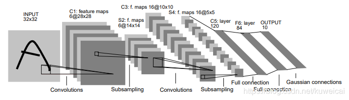
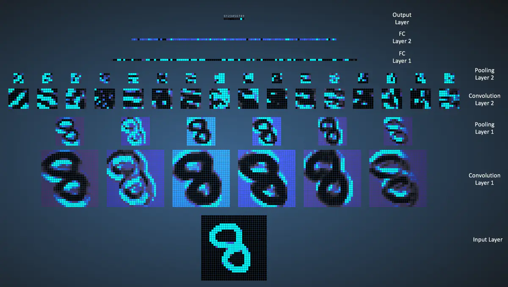
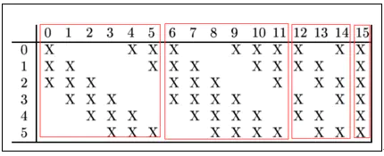
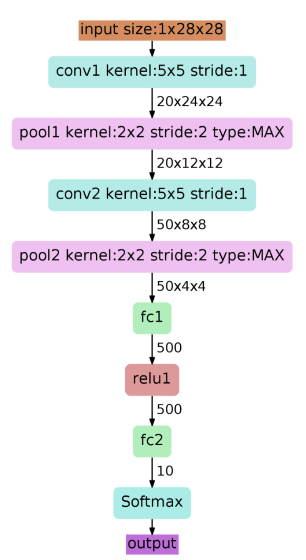

--

LeNet神经网络由深度学习三巨头之一的Yan LeCun提出，

他同时也是卷积神经网络 (CNN，Convolutional Neural Networks)之父。

LeNet主要用来进行手写字符的识别与分类，并在美国的银行中投入了使用。

**LeNet的实现确立了CNN的结构，**

现在神经网络中的许多内容在LeNet的网络结构中都能看到，

例如卷积层，Pooling层，ReLU层。

虽然LeNet早在20世纪90年代就已经提出了，

但由于当时缺乏大规模的训练数据，计算机硬件的性能也较低，

因此LeNet神经网络在处理复杂问题时效果并不理想。

**虽然LeNet网络结构比较简单，但是刚好适合神经网络的入门学习。**

Yann LeCun，自称中文名“杨立昆”，计算机科学家，被誉为“卷积网络之父”


LeNet网络除去输入输出层总共有六层网络。






# 第一层卷积

第一层是卷积层（C1层），

卷积核的大小为`5*5`，

卷积核数量为`6`个，

输入图像的大小为`32*32`，

因此输入数据在进行第一层卷积之后，

输出结果为大小为`28*28`，数量为`6`个的feature map。

# 第二层池化

图像在LeNet网络上进行第一层卷积之后，

结果为大小为`28*28`，数量为`6`个的feature map。

LeNet网络的第二层为pooling层（S2层），也称为下采样。

# 第三层卷积

LeNet第三层（C3层）也是卷积层，卷积核大小仍为`5*5`，

不过卷积核的数量变为`16`个。

第三层的输入为`14*14`的`6`个feature map，卷积核大小为`5*5`，

因此卷积之后输出的feature map大小为`10*10`，

由于卷积核有`16`个，因此希望输出的feature map也为`16`个，

但由于输入有`6`个feature map，因此需要进行额外的处理。

输入的`6`个feature map与输出的`16`个feature map的关系图如下：



# 第四层池化

# 第五层卷积

# 第六层全连接

# LeNet各层的参数变化

- C1
   输入大小：32*32
   核大小：5*5
   核数目：6
   输出大小：28*28*6
   训练参数数目：(5*5+1)*6=156
   连接数：(5*5+1)*6*(32-2-2)*(32-2-2)=122304
- S2
   输入大小：28*28*6
   核大小：2*2
   核数目：1
   输出大小：14*14*6
   训练参数数目：2*6=12，2=(w,b)
   连接数：(2*2+1)*1*14*14*6 = 5880
- C3
   输入大小：14*14*6
   核大小：5*5
   核数目：16
   输出大小：10*10*16
   训练参数数目：6*(3*5*5+1) + 6*(4*5*5+1) + 3*(4*5*5+1) + 1*(6*5*5+1)=1516
   连接数：(6*(3*5*5+1) + 6*(4*5*5+1) + 3*(4*5*5+1) + 1*(6*5*5+1))*10*10=151600
- S4
   输入大小：10*10*16
   核大小：2*2
   核数目：1
   输出大小：5*5*16
   训练参数数目：2*16=32
   连接数：(2*2+1)*1*5*5*16=2000
- C5
   输入大小：5*5*16
   核大小：5*5
   核数目：120
   输出大小：120*1*1
   训练参数数目：(5*5*16+1)*120*1*1=48120（因为是全连接）
   连接数：(5*5*16+1)*120*1*1=48120
- F6
   输入大小：120
   输出大小：84
   训练参数数目：(120+1)*84=10164
   连接数：(120+1)*84=10164





以上图为例，对经典的LeNet-5做深入分析：

1. 首先输入图像是单通道的28*28大小的图像，用矩阵表示就是[1,28,28]
2. 第一个卷积层conv1所用的卷积核尺寸为5*5，滑动步长为1，卷积核数目为20，那么经过该层后图像尺寸变为24，28-5+1=24，输出矩阵为[20,24,24]。
3. 第一个池化层pool核尺寸为2*2，步长2，这是没有重叠的max pooling，池化操作后，图像尺寸减半，变为12×12，输出矩阵为[20,12,12]。
4. 第二个卷积层conv2的卷积核尺寸为5*5，步长1，卷积核数目为50，卷积后图像尺寸变为8,这是因为12-5+1=8，输出矩阵为[50,8,8].
5. 第二个池化层pool2核尺寸为2*2，步长2，这是没有重叠的max pooling，池化操作后，图像尺寸减半，变为4×4，输出矩阵为[50,4,4]。
6. pool2后面接全连接层fc1，神经元数目为500，再接relu激活函数。
7. 再接fc2，神经元个数为10，得到10维的特征向量，用于10个数字的分类训练，送入softmaxt分类，得到分类结果的概率output。

用keras来实现LeNet，是这样来写

```
def LeNet():
	model = Sequential()
	model.add(Conv2D(32,(5,5), strides=(1,1), input_shape=(28,28,1), 
		padding='valid', activation='relu', 
		kernel_initializer='uniform'))
	model.add(MaxPooling2D(pool_size=(2,2)))
	model.add(Conv2D(64,(5,5), strides=(1,1), 
		padding='valid', activation='relu', 
		kernel_initializer='uniform'))
	model.add(MaxPooling2D(pool_size=(2,2)))
	model.add(Flatten())
	model.add(Dense(100, activation='relu'))
	model.add(Dense(10, activation='softmax'))
	return model
```


# keras实现LeNet并测试

https://github.com/TaavishThaman/LeNet-5-with-Keras


参考资料

1、LeNet神经网络

https://www.jianshu.com/p/cd73bc979ba9

2、深度学习三巨头之Yann LeCun（杨立昆）简介

https://blog.csdn.net/ctrigger/article/details/99179472

3、

https://blog.csdn.net/kuweicai/article/details/93359992

4、LeNet的详细网络结构

https://blog.csdn.net/sinat_39372048/article/details/80734243

5、

https://www.cnblogs.com/skyfsm/p/8451834.html