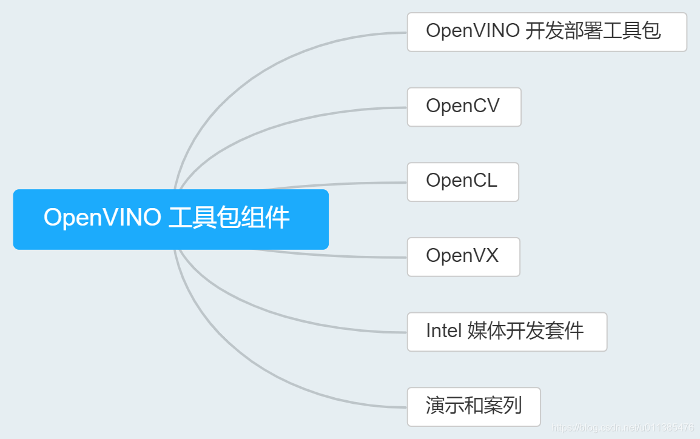
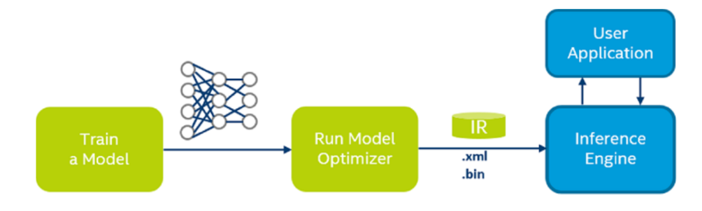

--

**OpenVINO 是**英特尔基于自身现有的硬件平台开发的

一种可以加快高性能计算机视觉和深度学习视觉应用开发速度**工具套件**，

支持各种英特尔平台的硬件加速器上进行深度学习，并且允许直接异构执行。

OpenVINO 工具包的主要组件是 DLDT(Deep Learning Deployment Toolkit，深度学习部署工具包)。DLDT主要包括模型优化器(Model Optimizer)和推理引擎（Inference engine，IE）两部分。

参考资料

1、OpenVINO 学习笔记（1）：OpenVINO 介绍

https://blog.csdn.net/u011385476/article/details/104754095

2、

https://blog.csdn.net/moxibingdao/article/details/106977501