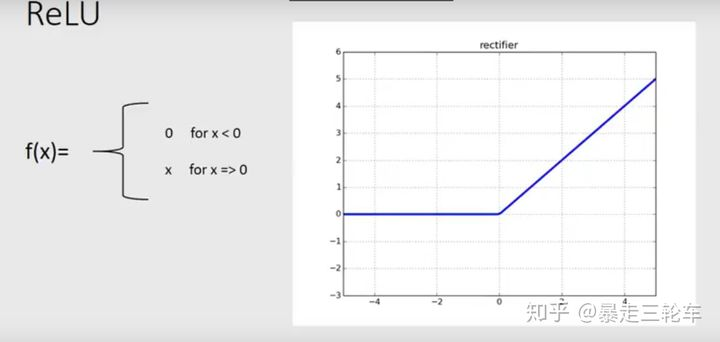
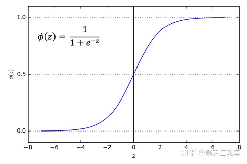

--

看tflite-micro的代码，看到relu这个词，了解一下。

**为什么要使用sigmoid，tanh，ReLU等非线性函数？**

这个原因大家都知道，为了增加非线性呗！

深度学习的目的是用一堆神经元堆出一个函数大致的样子，

然后通过大量的数据去反向拟合出这个函数的各个参数，最终勾勒出函数的完整形状。

那如果激活函数只是线性函数，那一层层的线性函数堆起来还是线性的，这年头线性函数能干啥呀？

肯定不行，这样整个网络表现能力有限，所以要引入非线性的激活函数进来。

**那为什么用ReLU呢？**

我们先看ReLU和他的老对手sigmoid长什么样：

ReLU函数：

Sigmoid函数：

对比这俩函数能看出来，sigmoid有一个“梯度消失”的问题。

梯度消失什么意思呢？就是我们希望对每个神经元，激励函数都能尽量区分出z值变化，这样每个神经元的表达能力更强，但sigmoid明显在|z|>4的区间的梯度就不够看了，即它的梯度消失了。

相比之下，ReLU输出就很稳定，因为他z>0区间就是一个线性函数！不存在sigmoid的梯度消失的问题。

另一个ReLU很给力的地方就是稀疏度问题。就是我们希望每个神经元都能最大化的发挥它筛选的作用，符合某一个特征的中间值，使劲儿放大；不符合的，一刀切掉。

参考资料

1、为什么用ReLU？

https://zhuanlan.zhihu.com/p/46255482