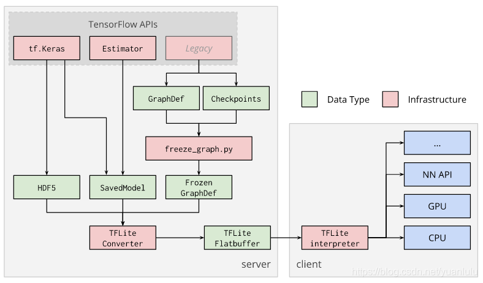
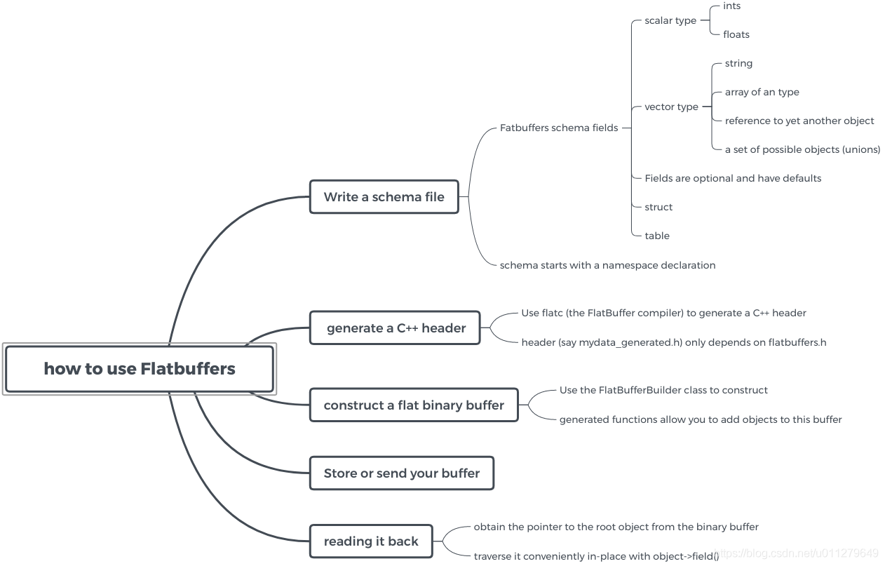
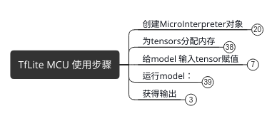
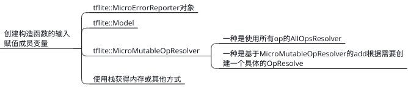
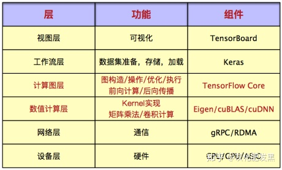

--

# 概述

MCU在现在的产品中随出可见，功能也越发于强大，价格也越趋于便宜。

一提到人工智能，彷佛只有强大的硬件才能实现，需要什么神经网络加速器之类的硬件支撑。

其实NPU、KPU等只是加快相关的计算能力，以达到较好的实时性，

对于简单的、功能不复杂的神经网络结构，一般稍强的MCU完全跑得动。

Tensorflow在深度学习平台中比较有名，目前已经适配了嵌入式平台，

**tflite_micro就比较适用于一般的MCU平台。**

完全由c++语言实现，可以说凡是带有c++编译器的MCU平台都可以移植使用。

**其中已经实现许多的神经网络算子，比如:卷积、池化等等。**

对于熟悉c++的可以使用c++开发，对于只会c语言的就可以直接使用c语言调用c++了。


Tiny ML 的理念是在设备上用较少的资源（更小巧的外形、更少的能耗和更低成本的芯片）完成更多的工作。

若与传感器在同一块开发板上运行推理，

无论是对隐私还是电池续航时间都大有裨益，且意味着无需连网即可完成推理。

我们在电路板上安装了近接感应器，

这意味着我们可以即时读取开发板前方对象的深度，而无需使用摄像头，

也无需通过机器视觉来确定某个对象是否为目标对象。

在本教程中，当对象足够近时，我们可以对颜色进行采样，

此时的板载 RGB 传感器可以看作是一个 1 像素的彩色摄像头。

虽然此方法存在一定限制，但却让我们只需使用少量资源便可快速分类对象。

请注意，实际上您可以在设备端运行完整的[基于 CNN 的视觉模型](https://link.zhihu.com/?target=http%3A//cs231n.github.io/convolutional-networks/)。

这块特殊的 Arduino 开发板配有一个板载色度计，因此我们认为以此方式开始演示不仅有趣，还极具指导意义。

我们将展示一个简单但完整的端到端 TinyML 应用，无需深厚的 ML 或嵌入式背景就可以快速实现。此处所涉内容包括数据采集、训练和分类器部署。

我们介绍的是一个演示应用，您可连接一个外部摄像头，在此基础上进行改进和完善。

我们希望您能了解我们提供的工具能够实现什么，这里只是为您提供了一个起点。


我们所使用的 Arduino BLE 33 Nano Sense 开发板配备 Arm Cortex-M4 微控制器，

该控制器运行着 mbedOS，并具备多个板载传感器，

包括数字麦克风、加速度计、陀螺仪，以及温度、湿度、压力、光线、颜色和近接感应器。


虽然该微控制器按照云或移动标准来看非常微小，但其功能非常强大，

足以运行 TensorFlow Lite Micro 模型并对来自板载传感器的传感器数据进行分类。


现在，我们将采集用于在 TensorFlow 中训练模型所需的数据。

首先，选择几种颜色不同的对象。

在这里，我们将使用水果，但您可以使用任何您喜欢的其他对象。


操作步骤是：

1、运行程序，然后把一个苹果靠近传感器，串口会打印颜色数据。手动赋值数据，保存成一个csv文件。

2、一样的操作，把香蕉和橘子的数据也保存起来。

3、然后是打开教程提供的colab的链接，按照说明把cvs文件上传到google drive。

4、然后用keras用数据训练模型。把得到的模型下载下来。是转成了头文件数组的方式。

5、运行另外一个arduino程序，来使用模型进行判断。


先首先要把代码都梳理出来，自己编译一遍。


概述
学术界对精度、自由度的要求和工业界对速度、精简度的要求形成了反差，

**这就使得越来越多的框架开始把training和inference分开，**

各公司都开始针对移动设备纷纷推出高性能inference库。


tflite

tflite其实就是谷歌自己的一个轻量级推理库。

主要用于移动端。

之前的tensorflow mobile那一套到2019年就不再维护了。

**tflite使用的思路主要是从预训练的模型转换为tflite模型文件，拿到移动端部署。**

tflite的源模型可以来自tensorflow的saved model或者frozen model,也可以来自keras。




## tflite做了哪些优化

### 用Flatbuffer序列化模型文件

这种格式磁盘占用少，加载快

### 量化。

这个特性是可以开关的，

可以把float参数量化为uint8类型，模型文件更小、计算更快。

### 剪枝、结构合并和蒸馏。

我也不是很确定，敢写在这里主要来自两个官方文件，

具体链接在本文最下方参考资料里。

一个是《Model optimization》，这里提到了优化模型用到了模型优化方法，

另一个是《Converter command-line examples》，里面一张对比优化前后的计算图显示tflite在转换时确实进行了结构调整。

但是这个特性没有很多人讲，有可能这方面tflite做的不是很多，只是浅尝辄止。

### 对NNAPI的支持。

上三个特性都是转换模型文件的特性，这个是运行时的特性。

也就是调用安卓底层的接口，把异构的计算能力利用起来。

虽然 TFLite 基于 NNAPI，

理论上是可以利用上各种运算芯片的，但目前还没有很多运算芯片支持 NNAPI。


对量化的理解主要来自《用 TensorFlow 压缩神经网络》。

tflite的量化并不是全程使用uint8计算。

而是存储每层的最大和最小值，

然后把这个区间线性分成 256 个离散值，

于是此范围内的每个浮点数可以用八位 (二进制) 整数来表示，

近似为离得最近的那个离散值。

比如，最小值是 -3 而最大值是 6 的情形，0 字节表示 -3，255 表示 6，而 128 是 1.5。


tfite的缺陷

TFLite 目前仅提供有限的算子，

主要以 CNN 中使用到的算子为主，如卷积、池化等。

有可能遇到的情况就是，模型的某些算子tflite不支持（比如反卷积），

你可以自定义一个 TFLite 算子，将其注册在 TFLite 的 kernels 列表中，

这样编译得到的 TFLite 库就可以处理该算子了。

同时，在模型转换时，还需要加上 --allow_custom_ops 选项，

将 TFLite 默认不支持的算子也保留在模型中。

(本段来自《有道云笔记是如何使用 TensorFlow Lite 的》)

tflite支持的算子列表在《TensorFlow Lite & TensorFlow Compatibility Guide》这个页面上。


参考资料

1、

https://blog.csdn.net/yuanlulu/article/details/84063503

# tflite-micro在ubuntu编译运行

```
make -f tensorflow/lite/Makefile TARGET=rpi TARGET_ARCH=armv7l
```


```
make -f tensorflow/lite/micro/tools/make/Makefile test_hello_world_test
```

这个命令的解析过程是怎样的？

生成的文件在这个目录下tensorflow\lite\micro\tools\make\gen\linux_x86_64_default\

test_hello_world_test对应的是

tensorflow\lite\micro\examples\hello_world\hello_world_test.cc。

主要的代码在micro/kernels目录下。

interpreter->Invoke 这个下面怎么调用的？

TfLiteRegistration

这个注册的各个算子。

```
TfLiteRegistration Register_CONV_2D() {
  return {/*init=*/Init,
          /*free=*/nullptr,
          /*prepare=*/ConvPrepare,
          /*invoke=*/Eval,
          /*profiling_string=*/nullptr,
          /*builtin_code=*/0,
          /*custom_name=*/nullptr,
          /*version=*/0};
}
```


## 分析一下Makefile

可以这样来简化用法。这样就可以直接用make，不用每次都带上-f了。

ln -s ./tensorflow/lite/micro/tools/make/Makefile ./Makefile


test_hello_world_test 这个target名字，是怎么被解析使用的呢？

是这里。make test_hello_world_test

还可以make test_output_handler_test

```
# Tests loading and running the sine model.
$(eval $(call microlite_test,$(EXAMPLE_NAME)_test,\
$(HELLO_WORLD_TEST_SRCS),,$(HELLO_WORLD_GENERATOR_INPUTS)))

# Tests producing an output.
$(eval $(call microlite_test,output_handler_test,\
$(OUTPUT_HANDLER_TEST_SRCS),$(OUTPUT_HANDLER_TEST_HDRS)))
```

```
test_$(1): $$($(1)_BINARY)
	$$(TEST_SCRIPT) $$($(1)_BINARY) $$(TEST_PASS_STRING) $$(TARGET)

else
run_$(1): $$($(1)_BINARY)
	$$(TEST_SCRIPT) $$($(1)_BINARY) non_test_binary $$(TARGET)
endif
```


下面这个，是生成的linux_x86_64_default目录。

PRJDIR是对于keil这样的，会生成对应的工程。

```
GENDIR := $(MAKEFILE_DIR)/gen/$(TARGET)_$(TARGET_ARCH)_$(BUILD_TYPE)/
CORE_OBJDIR := $(GENDIR)obj/core/
KERNEL_OBJDIR := $(GENDIR)obj/kernels/
THIRD_PARTY_OBJDIR := $(GENDIR)obj/third_party/
GENERATED_SRCS_DIR := $(GENDIR)genfiles/
BINDIR := $(GENDIR)bin/
LIBDIR := $(GENDIR)lib/
PRJDIR := $(GENDIR)prj/
```

tools/make/helper_functions.inc 这个里面定义了一些重要的Makefile工具函数。这个文件有600行左右。

包括：

```
generate_$(3)_$(1)_project
generate_arduino_project
```

## 编译stm32版本看看

```
make -f tensorflow/lite/micro/tools/make/Makefile TARGET=stm32f4 microlite
```

会下载gcc-arm-none-eabi工具链。

解压到make/downloads/gcc_embedded目录。

下载renode-1.11.0.linux-portable.tar.gz

这个是一个开源模拟器。

下载stm32_bare_lib

然后用tensorflow/lite/micro/tools/make/downloads/gcc_embedded/bin/arm-none-eabi-g++

这个工具链来编译。

运行：

```
make -f tensorflow/lite/micro/tools/make/Makefile TARGET=stm32f4 test_hello_world_test
```

最后的打印

```
Preparing suites
Started Renode instance on port 9999; pid 3856
Starting suites
Running /tmp/renode_stm32f4_logs/stm32f4.robot
+++++ Starting test 'stm32f4.Should Create Platform'
+++++ Finished test 'stm32f4.Should Create Platform' in 4.05 seconds with status OK
+++++ Starting test 'stm32f4.Should Run hello_world_test'
+++++ Finished test 'stm32f4.Should Run hello_world_test' in 1.53 seconds with status OK
Cleaning up suites
Closing Renode pid 3856
Aggregating all robot results
Output:  /tmp/renode_stm32f4_logs/robot_output.xml
Log:     /tmp/renode_stm32f4_logs/log.html
Report:  /tmp/renode_stm32f4_logs/report.html
Tests finished successfully :)
```

## 编译其他的

通过tab补全，可以看到有1000多个目标，大部分的目标是通过规则生成的。

### benchmark

编译

```
make -f tensorflow/lite/micro/tools/make/Makefile keyword_benchmark
```

运行

```
./tensorflow/lite/micro/tools/make/gen/linux_x86_64_default/bin/keyword_benchmark

InitializeKeywordRunner took 405 ticks (0 ms).

KeywordRunNIerations(1) took 283 ticks (0 ms)
QUANTIZE took 18 ticks (0 ms).
SVDF took 56 ticks (0 ms).
FULLY_CONNECTED took 12 ticks (0 ms).
SVDF took 23 ticks (0 ms).
FULLY_CONNECTED took 11 ticks (0 ms).
SVDF took 22 ticks (0 ms).
FULLY_CONNECTED took 10 ticks (0 ms).
SVDF took 23 ticks (0 ms).
FULLY_CONNECTED took 10 ticks (0 ms).
SVDF took 25 ticks (0 ms).
SVDF took 27 ticks (0 ms).
SVDF took 27 ticks (0 ms).
FULLY_CONNECTED took 5 ticks (0 ms).
SOFTMAX took 9 ticks (0 ms).
QUANTIZE took 5 ticks (0 ms).

KeywordRunNIerations(10) took 2612 ticks (2 ms)

[RecordingMicroAllocator] Arena allocation total 14736 bytes
[RecordingMicroAllocator] Arena allocation head 672 bytes
[RecordingMicroAllocator] Arena allocation tail 14064 bytes
[RecordingMicroAllocator] 'TfLiteEvalTensor data' used 1296 bytes with alignment overhead (requested 1296 bytes for 54 allocations)
[RecordingMicroAllocator] 'Persistent TfLiteTensor data' used 128 bytes with alignment overhead (requested 128 bytes for 2 tensors)
[RecordingMicroAllocator] 'Persistent TfLiteTensor quantization data' used 64 bytes with alignment overhead (requested 64 bytes for 4 allocations)
[RecordingMicroAllocator] 'Persistent buffer data' used 684 bytes with alignment overhead (requested 572 bytes for 17 allocations)
[RecordingMicroAllocator] 'TfLiteTensor variable buffer data' used 10240 bytes with alignment overhead (requested 10240 bytes for 7 allocations)
[RecordingMicroAllocator] 'NodeAndRegistration struct' used 960 bytes with alignment overhead (requested 960 bytes for 15 NodeAndRegistration structs)
```

这个就涉及到一个类：MicroProfiler。看看是怎么实现的。

RecordingMicroInterpreter是用来做benchmark的。

```
class RecordingMicroInterpreter : public MicroInterpreter
```

### micro_speech

make run_micro_speech实际是这样调用的：

```
micro_speech non_test_binary linux
```

但是这样在linux上运行是没有效果的，因为默认的audio_provider.cc里的提供的dummy数据。

看看能不能自己用portaudio来实现一下。

只有这样跑起来，我才方便自己来训练替换模型。

暂时不弄。

找个


# tflite在PC上运行

先根据这个，看看python版本在PC上的使用。

https://www.tensorflow.org/lite/guide/python

要使用 Python 快速运行 TensorFlow Lite 模型，

您只需安装 TensorFlow Lite 解释器，

而不需要安装所有 TensorFlow 软件包。

只包含解释器的软件包是完整 TensorFlow 软件包的一小部分，

其中只包含使用 TensorFlow Lite 运行推断所需要的最少代码——仅包含 tf.lite.Interpreter Python 类。

如果您只想执行 .tflite 模型，而不希望庞大的 TensorFlow 库占用磁盘空间，

那么这个小软件包是最理想的选择。

```
pip3 install https://dl.google.com/coral/python/tflite_runtime-2.1.0.post1-cp38-cp38-linux_x86_64.whl
```

为了将只包含解释器的软件包与完整 TensorFlow 软件包区分开（如果您愿意，可以同时安装两者）, Python 模块在上述 wheel 中提供了命名的 tflite_runtime。

因此，不要从 tensorflow 模块导入 Interpreter 模块，您需要从 tflite_runtime 导入。

这里给的例子是给图片加标签。

https://github.com/tensorflow/tensorflow/tree/master/tensorflow/lite/examples

先下载素材并放到指定目录下。

```
# Get photo
curl https://raw.githubusercontent.com/tensorflow/tensorflow/master/tensorflow/lite/examples/label_image/testdata/grace_hopper.bmp > /tmp/grace_hopper.bmp
# Get model
curl https://storage.googleapis.com/download.tensorflow.org/models/mobilenet_v1_2018_02_22/mobilenet_v1_1.0_224.tgz | tar xzv -C /tmp
# Get labels
curl https://storage.googleapis.com/download.tensorflow.org/models/mobilenet_v1_1.0_224_frozen.tgz  | tar xzv -C /tmp  mobilenet_v1_1.0_224/labels.txt

mv /tmp/mobilenet_v1_1.0_224/labels.txt /tmp/

```

grace_hopper.bmp是一张cobol语言发明者的照片。

mobilenet_v1_1.0_224.tgz解压出来是这些东西。

```
-rw-r----- 1 teddy teddy  65M 2月  23  2018 mobilenet_v1_1.0_224.ckpt.data-00000-of-00001
-rw-r----- 1 teddy teddy  20K 2月  23  2018 mobilenet_v1_1.0_224.ckpt.index
-rw-r----- 1 teddy teddy 3.3M 2月  23  2018 mobilenet_v1_1.0_224.ckpt.meta
-rw-r----- 1 teddy teddy 520K 2月  23  2018 mobilenet_v1_1.0_224_eval.pbtxt
-rw-r----- 1 teddy teddy  17M 2月  23  2018 mobilenet_v1_1.0_224_frozen.pb
-rw-r----- 1 teddy teddy   83 2月  23  2018 mobilenet_v1_1.0_224_info.txt
-rw-r----- 1 teddy teddy  17M 2月  23  2018 mobilenet_v1_1.0_224.tflite
```

然后运行label_image.py

```
from __future__ import absolute_import
from __future__ import division
from __future__ import print_function

import argparse
import time

import numpy as np
from PIL import Image
#import tensorflow as tf
import tflite_runtime.interpreter as tflite

def load_labels(filename):
  with open(filename, 'r') as f:
    return [line.strip() for line in f.readlines()]


if __name__ == '__main__':
  parser = argparse.ArgumentParser()
  parser.add_argument(
      '-i',
      '--image',
      default='/tmp/grace_hopper.bmp',
      help='image to be classified')
  parser.add_argument(
      '-m',
      '--model_file',
      default='/tmp/mobilenet_v1_1.0_224_quant.tflite',
      help='.tflite model to be executed')
  parser.add_argument(
      '-l',
      '--label_file',
      default='/tmp/labels.txt',
      help='name of file containing labels')
  parser.add_argument(
      '--input_mean',
      default=127.5, type=float,
      help='input_mean')
  parser.add_argument(
      '--input_std',
      default=127.5, type=float,
      help='input standard deviation')
  parser.add_argument(
      '--num_threads', default=None, type=int, help='number of threads')
  args = parser.parse_args()

  #interpreter = tf.lite.Interpreter(
      model_path=args.model_file, num_threads=args.num_threads)
  interpreter = tflite.Interpreter(model_path=args.model_file, num_threads=args.num_threads)
  interpreter.allocate_tensors()

  input_details = interpreter.get_input_details()
  output_details = interpreter.get_output_details()

  # check the type of the input tensor
  floating_model = input_details[0]['dtype'] == np.float32

  # NxHxWxC, H:1, W:2
  height = input_details[0]['shape'][1]
  width = input_details[0]['shape'][2]
  img = Image.open(args.image).resize((width, height))

  # add N dim
  input_data = np.expand_dims(img, axis=0)

  if floating_model:
    input_data = (np.float32(input_data) - args.input_mean) / args.input_std

  interpreter.set_tensor(input_details[0]['index'], input_data)

  start_time = time.time()
  interpreter.invoke()
  stop_time = time.time()

  output_data = interpreter.get_tensor(output_details[0]['index'])
  results = np.squeeze(output_data)

  top_k = results.argsort()[-5:][::-1]
  labels = load_labels(args.label_file)
  for i in top_k:
    if floating_model:
      print('{:08.6f}: {}'.format(float(results[i]), labels[i]))
    else:
      print('{:08.6f}: {}'.format(float(results[i] / 255.0), labels[i]))

  print('time: {:.3f}ms'.format((stop_time - start_time) * 1000))
```

运行不起来。


# 代码分析对象

以rt-thread集成的package的作为分析对象。

这个看起来经过整理和简化。

https://github.com/QingChuanWS/TensorflowLiteMicro

# 代码流程分析

这篇文件详细的描述了hello_world的流程。

https://www.tensorflow.org/lite/microcontrollers/get_started_low_level


# 核心概念

## Tensor(张量)

Tensor是tf对数据的抽象，具有一定的维度、数据类型和数据内容。

Tensor的纬度、数据类型、数据内容都有对应的成员表示。

数据内容存放在TensorBuffer中，这个类支持引用计数，在引用数为0的时候则自动释放内存。

## Op(运算）

TensorFlow中Op代表一个基本运算，比如矩阵或标量的四则运算。

| 运算类型     | 运算名称                                       |
| ------------ | ---------------------------------------------- |
| 标量运算     | Add,Sub,Mul,Div,Exp,Log,Greater,Less,Equal     |
| 向量运算     | Concat,Slice,Split,Constant,Rank,Shape,Shuffle |
| 矩阵运算     | MatMul,MatrixInverse,MatrixDeterminant         |
| 带状态的运算 | Variable,Assign,AssignAdd                      |
| 神经网络组件 | SoftMax,Sigmoid,ReLU,Convolution2D,MaxPooling  |
| 存储、恢复   | Save,Restore                                   |
| 队列和同步   | Enqueue,Dequeue,MutexAcquire,MutexRelease      |
| 控制流       | Merge,Switch,Enter,Leave,NextIteration         |

答案是，在tf的设计中，运算和运算实现是两个分开的概念，

通过引入的运算核(OpKernel)的概念来表示运算的具体实现。

这么设计的原因是，运算的语义是平台不相关的，是不变的，

而运算的实现运算核是跟具体的平台（CPU、GPU、TPU）相关的。

这样，就可以很方便的对语义不变的运算提供不同平台的实现了。

tf中的运算核也有注册机制，为一个运算提供多平台的实现:


add.cc这个文件分析。

所在namespace。

```
namespace tflite {
namespace ops {
namespace micro {
namespace add {
```


## Node（节点）

**Node是计算图的基本单位，**

可以为它绑定特定的运算，

指定特定的设备（不指定的话，则服从默认的设备分配策略），指定输入节点等等：


MicroInterpreter


参考资料

https://blog.csdn.net/gaofeipaopaotang/article/details/80598840

# flatbuffers

FlatBuffers 是一个序列化开源库，

实现了与 Protocol Buffers，Thrift，Apache Avro，SBE 和 Cap'n Proto 类似的序列化格式

Oortmerssen 最初为 Android 游戏和注重性能的应用而开发了FlatBuffers。现在它具有C ++，C＃，C，Go，Java，PHP，Python 和 JavaScript 的端口。

FlatBuffer 是一个二进制 buffer，

它使用 offset 组织嵌套对象（struct，table，vectors，等），

可以使数据像任何基于指针的数据结构一样，就地访问数据。

然而 FlatBuffer 与大多数内存中的数据结构不同，

**它使用严格的对齐规则和字节顺序来确保 buffer 是跨平台的。**

此外，对于 table 对象，FlatBuffers 提供前向/后向兼容性和 optional 字段，以支持大多数格式的演变。

**FlatBuffers 的主要目标是避免反序列化。**

这是通过定义二进制数据协议来实现的，

一种将定义好的将数据转换为二进制数据的方法。

由该协议创建的二进制结构可以 wire 发送，并且无需进一步处理即可读取。

相比较而言，在传输 JSON 时，我们需要将数据转换为字符串，通过 wire 发送，解析字符串，并将其转换为本地对象。

Flatbuffers 不需要这些操作。

你用二进制装入数据，发送相同的二进制文件，并直接从二进制文件读取。




lite/schema/schema_generated.h，这个文件就是基于flatbuffer生成的。

有一万多行。

那么基于的原始文件是什么？

flatbuffers中的数据结构是schema文件

通过flabuffers协议生成的包含在xxx.h文件中的数据结构，

用于访问flatbuffers文件中数据。

TfLite数据结构如TfLiteTensor, TfLiteNode, TfLiteRegistration等

用于 TfLIte interpreter, 

把flatbuffer中的数据进行处理使相关数据在一个数据结构里。


参考资料

https://blog.csdn.net/u011279649/article/details/89485715

TfLite: flatbuffer中数据结构到TfLite数据结构的转换

https://blog.csdn.net/u011279649/article/details/98078262

# rt-thread集成tflite-micro

ST Cube AI对TFLite Micro做了一层自己的封装，好用到爆。

你生成的模型无论是keras还是saved_model都支持，直接导入。

rt-thread里集成了这些AI框架。可以都看一下。

```
 [ ] libann: a light-weight ANN library, capable of training, saving and loading models.  ----   这个已经不再维护了。                             
 [ ] NNoM: A higher-level Neural Network framework on Microcontroller  ----                                                   
 [ ] onnx-backend: Open Neural Network Exchange backend on RT-Thread  ----                                                    
 [ ] onnx-parser: Open Neural Network Exchange model parser on RT-Thread  ----                                                
 [*] Tensorflow Lite Micro: a lightweight deep learning end-test inference framework for RT-Thread operating system.  --->    
 [ ] elapack: linear algebra library for embedded devices, compatible with matlab.  ----                                      
 [ ] ulapack: linear algebra library for embedded devices.  ----                                                              
 [ ] quest: A simulator of quantum computers on MCU. (RTC required) (NEW)  ----                                               
 [ ] A C++ Constraint Programming Library (NEW)  ----                                                                         
```

暂时先把tflite-micro的编译运行看看效果。

对应的仓库的代码是这里。

https://github.com/QingChuanWS/TensorflowLiteMicro

对饮的音频测试代码是这样

```
#include <rtthread.h>
#include <rtdevice.h>
#include <board.h>
#include "tflite/micro/examples/micro_speech/main_functions.h"

// This is the default main used on systems that have the standard C entry
// point. Other devices (for example FreeRTOS or ESP32) that have different
// requirements for entry code (like an app_main function) should specialize
// this main.cc file in a target-specific subfolder.
int main(int argc, char* argv[]) {
  setup();
  rt_kprintf("model load successfully!!\n");
   while (true) {
     loop();
   }

  return 0;
}
```

而在lite/micro/examples/helloworld/main_function.cc里，有setup和loop函数的实现。

这个实际是arduino的标准入口和循环函数。

就以arduino的为主来分析函数的调用流程。

所有的函数都在tflite这个namespace下面。

# HelloWorld

看下面的readme，这个例子用来演示怎么使用tflite-micro的。

包括了完整的端到端的流程，包括训练模型，转换到tflite-micro可用的模型，

# lite目录代码

```
c
	builtin_op_data.h  定义了一堆的结构体，复杂性不高的，但是概念很密集。
	c_api_types.h 状态枚举，数据类型枚举，就3个结构体。
	common.h 定义了一下重要的结构体。
	common.c
core
	下面就一个api目录。里面文件也不多。总共4对8个文件。
	error_reporter.h/cc
	flatbuffer_conversion.h/cc
	op_resolver.h/cc
	tensor_utils.h/cc
experimental
kernels
micro
schema
```

TF_LITE_STATIC_MEMORY 这个宏来控制是否使用动态malloc。

# tflite api

https://tensorflow.google.cn/lite/api_docs

c++的api就5个class。

| Classes                                                      |                                                              |
| :----------------------------------------------------------- | ------------------------------------------------------------ |
| [tflite::ErrorReporter](https://tensorflow.google.cn/lite/api_docs/cc/class/tflite/error-reporter) | A functor that reports error to supporting system.           |
| [tflite::FlatBufferModel](https://tensorflow.google.cn/lite/api_docs/cc/class/tflite/flat-buffer-model) | An RAII object that represents a read-only tflite model, copied from disk, or mmapped. |
| [tflite::Interpreter](https://tensorflow.google.cn/lite/api_docs/cc/class/tflite/interpreter) | An interpreter for a graph of nodes that input and output from tensors. |
| [tflite::InterpreterBuilder](https://tensorflow.google.cn/lite/api_docs/cc/class/tflite/interpreter-builder) | Build an interpreter capable of interpreting `model `.       |
| [tflite::OpResolver](https://tensorflow.google.cn/lite/api_docs/cc/class/tflite/op-resolver) | Abstract interface that returns TfLiteRegistrations given op codes or custom op names. |

# person detection例子

总体从流程上使用上还是比较简单的。

都是公式化的调用。

但是涉及的概念值得了解一下。


## 参考资料

tensorflow之神经网络层：AveragePooling2D、average_pooling2d、Conv2D和conv2d

https://blog.csdn.net/u013230189/article/details/82771622

# c++ in tflite-micro


## 参考资料

https://blog.csdn.net/u011279649/article/details/102630934

# 代码架构分析

tflite仍使用c++作为主要编程语言，但主要是使用c with class。
我的体会是因为内存的限制导致tflite for mcu只能用c++的部分功能或者说库，

导致tflite for mcu从tflite 中分离出来。

tflite for  mcu的目标是没有库支持、没有操作系统，完全裸的情况，

实际中还是会用一些库，看内存的大小而定。

tflite 和tflite for mcu的关系

两者都是用tflite格式的模型文件，

但是否通用要看算子是否都实现了

**两者使用相同的核心数据结构 TfLitexxx(TfLiteContext, TfLiteTensor, TfLiteNode等等)**

**两者使用相同的接口(C++虚类), tflite和tflite for mcu给出具体的实现**

使用tflite for mcu进行推断的流程：



error_report(打印log的实现), 

op_resolve(算子的实现)和 内存(初始地址和大小), 

还有最重要的 tflite格式的模型文件




因为内存等限制MCU平台可能没有实现文件系统，tflite for mcu直接使用全局变量数组保存模型文件; 内存的分配也直接使用从栈里分配的unsinged char数组。 


## 参考资料

https://blog.csdn.net/u011279649/article/details/102624556

# demo使用

## hello world

这个是推断出正弦波的波形。

不依赖具体硬件。

https://colab.research.google.com/github/tensorflow/tflite-micro/blob/main/tensorflow/lite/micro/examples/hello_world/train/train_hello_world_model.ipynb

使用了2个layer。

第一个layer使用了一个single input。也就是x值，使用了8个神经元。

基于这个input，每个神经元会被激活，根据它的内部状态（权重和bias值）

第二个layer只有一个神经元。

这个行为用代码写出来，就是这样：

```
# We'll use Keras to create a simple model architecture
model_1 = tf.keras.Sequential()

# First layer takes a scalar input and feeds it through 8 "neurons". The
# neurons decide whether to activate based on the 'relu' activation function.
model_1.add(keras.layers.Dense(8, activation='relu', input_shape=(1,)))

# Final layer is a single neuron, since we want to output a single value
model_1.add(keras.layers.Dense(1))

# Compile the model using the standard 'adam' optimizer and the mean squared error or 'mse' loss function for regression.
model_1.compile(optimizer='adam', loss='mse', metrics=['mae'])
```

使用上面的代码，我们已经定义了model。

接下来，就是训练这个model。


## 参考资料

https://www.tensorflow.org/lite/microcontrollers/get_started

# 支持的所有算子OP

在tensorflow/lite/micro/all_ops_resolver.cc里。

```
AllOpsResolver::AllOpsResolver() {
  // Please keep this list of Builtin Operators in alphabetical order.
  AddAbs();
  AddAdd();
  AddAddN();
  AddArgMax();
  AddArgMin();
  AddAveragePool2D();
  AddBatchToSpaceNd();
  AddCeil();
  AddConcatenation();
  AddConv2D();
  AddCos();
  AddCumSum();
  AddDepthToSpace();
  AddDepthwiseConv2D();
  AddDequantize();
  AddDetectionPostprocess();
  AddElu();
  AddEqual();
  AddEthosU();
  AddExpandDims();
  AddFloor();
  AddFloorDiv();
  AddFloorMod();
  AddFullyConnected();
  AddGreater();
  AddGreaterEqual();
  AddHardSwish();
  AddL2Normalization();
  AddL2Pool2D();
  AddLeakyRelu();
  AddLess();
  AddLessEqual();
  AddLog();
  AddLogicalAnd();
  AddLogicalNot();
  AddLogicalOr();
  AddLogistic();
  AddMaxPool2D();
  AddMaximum();
  AddMean();
  AddMinimum();
  AddMul();
  AddNeg();
  AddNotEqual();
  AddPack();
  AddPad();
  AddPadV2();
  AddPrelu();
  AddQuantize();
  AddReduceMax();
  AddRelu();
  AddRelu6();
  AddReshape();
  AddResizeBilinear();
  AddResizeNearestNeighbor();
  AddRound();
  AddRsqrt();
  AddShape();
  AddSin();
  AddSoftmax();
  AddSpaceToBatchNd();
  AddSpaceToDepth();
  AddSplit();
  AddSplitV();
  AddSqrt();
  AddSquare();
  AddSqueeze();
  AddStridedSlice();
  AddSub();
  AddSvdf();
  AddTanh();
  AddTransposeConv();
  AddTranspose();
  AddUnpack();
}
```

实际使用中不会用上所有的，也没有必要，会浪费。

从其中选用几个就可以了。


TensorFlow Lite 支持许多在常见推理模型中使用的 TensorFlow 运算。

当使用 TensorFlow Lite Optimizing Converter 处理运算时，

**这些运算可能会被消除或融合，**

然后受支持的运算会被映射到它们对应的 TensorFlow Lite 运算。


由于 TensorFlow Lite 内置算子库仅支持有限数量的 TensorFlow 算子，

所以并非所有模型都可以转换。

即使对于支持的运算，出于性能原因，

有时也需要非常特定的使用模式。

我们希望在未来的 TensorFlow Lite 版本中扩展支持的运算。


要理解如何构建可以和 TensorFlow Lite 一起使用的 TensorFlow 模型，

最好的方法是仔细考虑运算的转换和优化方式，以及此过程带来的限制。

大多数 TensorFlow Lite 运算都针对的是浮点（float32）和量化（uint8、int8）推断，

但许多算子尚不适用于其他类型（如 tf.float16 和字符串）。


tensorflow框架的核心是将各式各样的神经网络抽象为一个有向无环图，

图是由tensor以及tensor变换构成；

虽然现在有很多高阶API可以让开发者忽略这层抽象，

**但对于灵活度要求比较高的算法仍然需要开发者自定义网络图**，

所以建议开发者尽量先学习tf1.x中的基础概念，这样才能在深度学习道路上走得更远；


张量的数学运算

张量数学运算主要有：标量运算，向量运算，矩阵运算，张量运算采用的广播机制。

张量的数学运算符可以分为标量运算符、向量运算符、以及矩阵运算符。

加减乘除乘方，以及三角函数，指数，对数等常见函数，逻辑比较运算符等都是标量运算符。

标量运算符的特点是对张量实施逐元素运算。

有些标量运算符对常用的数学运算符进行了重载。并且支持类似numpy的广播特性。

许多标量运算符都在 tf.math模块下。


无论是机器学习也好，还是深度学习也好，

都是围绕着数学建模以及数学运算进行的，

在这样的背景之下，诞生了许多的计算框架，

我们所熟知的TensorFlow和Pytorch就是其中的主流，

**这些计算框架以计算服务为根本**，

自然需要一个计算模型。

如果接触过开发的小伙伴就能体会到，这些计算框架的编程方式有着很大的差异。

无论是编译类型的语言还是脚本语言，都是一步一步的计算变量， 从而得到结果，


通过链式法则，我们逐节点的计算偏导数，

在网络backward时候，

需要用链式求导法则求出网络最后输出的梯度，然后再对网络进行优化。

类似上图的表达形式就是TensorFlow以及Pytorch的基本计算模型。

**总结而言，计算图模型由节点(nodes)和线(edges)组成，节点表示操作符Operator，或者称之为算子，线表示计算间的依赖，实线表示有数据传递依赖，传递的数据即张量，虚线通常可以表示控制依赖，即执行先后顺序。**

计算图从本质上来说，是TensorFlow在内存中构建的程序逻辑图，

计算图可以被分割成多个块，

并且可以并行地运行在多个不同的cpu或gpu上，

这被称为并行计算。

因此，计算图可以支持大规模的神经网络，如下：


TensorFlow中的计算图有三种，

分别是静态计算图，动态计算图，以及Autograph，

目前TensorFlow2默认采用的是动态计算图，

即每使用一个算子后，

该算子会被动态加入到隐含的默认计算图中立即执行得到结果

（在TensorFlow1中，采用的是静态计算图，需要先使用TensorFlow的各种算子创建计算图，然后再开启一个会话Session，显式执行计算图）。

对于动态图的好处显而易见，

它方便调试程序，

让TensorFlow代码的表现和Python原生代码的表现一样，

写起来就像写numpy一样，

各种日志打印，控制流全部都是可以使用的，

当然，这相对于静态图来讲牺牲了些效率，

因为使用动态图会有许多次Python进程和TensorFlow的C++进程之间的通信，

而静态计算图构建完成之后几乎全部在TensorFlow内核上使用C++代码执行，效率更高。

此外静态图会对计算步骤进行一定的优化，剪去和结果无关的计算步骤。


TensorFlow的一大特点是，图的构造和执行相分离。

用户添加完算子，构建好整图后，才开始进行训练和执行，也就是图的执行。

大体流程如下

1. 图构建：用户在client中基于TensorFlow的多语言编程接口，添加算子，完成计算图的构造。
2. 图传递：client开启session，通过它建立和master之间的连接。执行session.run()时，将构造好的graph序列化为graphDef后，以protobuf的格式传递给master。
3. 图剪枝：master根据session.run()传递的fetches和feeds列表，反向遍历全图full graph，实施剪枝，得到最小依赖子图
4. 图分裂：master将最小子图分裂为多个Graph Partition，并注册到多个worker上。一个worker对应一个Graph Partition。
5. 图二次分裂：worker根据当前可用硬件资源，如CPU GPU，将Graph Partition按照op算子设备约束规范（例如tf.device('/cpu:0')，二次分裂到不同设备上。每个计算设备对应一个Graph Partition。
6. 图运行：对于每一个计算设备，worker依照op在kernel中的实现，完成op的运算。设备间数据通信可以使用send/recv节点，而worker间通信，则使用GRPC或RDMA协议。




## 参考资料

https://blog.csdn.net/zhuoqingjoking97298/article/details/112917515


http://baijiahao.baidu.com/s?id=1648640545459504393&wfr=spider&for=pc

tensorflow2.0基础（2）——张量的数学运算

https://blog.csdn.net/qq_35793394/article/details/107557719


# 模型量化

模型量化的定义没有统一的说法，但个人理解为：

模型量化即以较低的推理精度损失将连续取值（或者大量可能的离散取值）的浮点型模型权重或流经模型的张量数据定点近似（通常为int8）为有限多个（或较少的）离散值的过程，

它是以更少位数的数据类型用于近似表示32位有限范围浮点型数据的过程，

而模型的输入输出依然是浮点型，

从而达到减少模型尺寸大小、减少模型内存消耗及加快模型推理速度等目标。

## 模型量化有什么好处

- **减小模型尺寸**，如8位整型量化可减少75%的模型大小
- **减少存储空间**，在边缘侧存储空间不足时更具有意义
- **易于在线升级**，模型更小意味着更加容易传输
- **减少内存耗用**，更小的模型大小意味着不需要更多的内存
- **加快推理速度**，访问一次32位浮点型可以访问四次int8整型，整型运算比浮点型运算更快
- **减少设备功耗**，内存耗用少了推理速度快了自然减少了设备功耗
- **支持微处理器**，有些微处理器属于8位的，低功耗运行浮点运算速度慢，需要进行8bit量化


https://zhuanlan.zhihu.com/p/79744430


# 代码分析

TfLiteTensor

tflite for mcu因硬件的限制如内存, 

使用和tflite不同的interpreter和算子等。

因内存的限制使tflite不能使用c++的高级用法

如hastable等。

tflite仍使用c++作为主要编程语言，

但主要是使用c with class。

我的体会是因为内存的限制导致tflite for mcu只能用c++的部分功能或者说库，导致tflite for mcu从tflite 中分离出来。

tflite for  mcu的目标是没有库支持、没有操作系统，完全裸的情况，实际中还是会用一些库，看内存的大小而定。


https://blog.csdn.net/u011279649/article/details/102624556


本文以Tflite自带的benchmark程序为例，

说明一个来自converter的`.tflite`文件使用Tflite框架

在端侧CPU/GPU上运行起来的全过程。

该程序入口函数在`tensorflow/lite/tools/benchmark/benchmark_main.cc`中。

本文包含五小节，其中前四节属于运行之前的初始化阶段，

第五节是真正的运行阶段，

各小节内容如下：

第一节：介绍Tflite框架读取解析模型文件得到Inference Workload的过程

第二节：介绍Tflite如何通过GPU Delegate的设置将Workload迁移到GPU上的过程

第三节：CPU算子到GPU端kernel的流程

第四节：GPU算子生成的细节

第五节：运行阶段的框架如何完成真正的推理计算

# 部署

## **常见部署流程**

假设我们的模型是使用**Pytorch**训练的，部署的平台是英伟达的GPU服务器。

训练好的模型通过以下几种方式转换：

- Pytorch->ONNX->trt **[onnx2trt](https://link.zhihu.com/?target=https%3A//github.com/onnx/onnx-tensorrt)**
- Pytorch->trt **[torch2trt](https://link.zhihu.com/?target=https%3A//github.com/NVIDIA-AI-IOT/torch2trt)**
- Pytorch->torchscipt->trt **[trtorch](https://link.zhihu.com/?target=https%3A//github.com/NVIDIA/TRTorch)**

其中**[onnx2trt](https://link.zhihu.com/?target=https%3A//github.com/onnx/onnx-tensorrt)**最成熟，**[torch2trt](https://link.zhihu.com/?target=https%3A//github.com/NVIDIA-AI-IOT/torch2trt)**比较灵活，而**[trtorch](https://link.zhihu.com/?target=https%3A//github.com/NVIDIA/TRTorch)**不是很好用。三种转化方式各有利弊，基本可以覆盖90%常见的主流模型。

常见的服务部署搭配：

- triton server + TensorRT/libtorch
- flask + Pytorch
- Tensorflow Server


TFLite是为了将深度学习模型部署在移动端和嵌入式设备的工具包，

可以把训练好的TF模型通过转化、部署和优化三个步骤，

达到提升运算速度，减少内存、显存占用的效果。

TFlite主要由Converter（左）和Interpreter（右）组成。

Converter负责把TensorFlow训练好的模型转化，并输出为.tflite文件（FlatBuffer格式）。

转化的同时，还完成了对网络的优化，如量化。

Interpreter则负责把.tflite部署到移动端，

嵌入式（embedded linux device）和microcontroller，并高效地执行推理过程，

同时提供API接口给Python，Objective-C，Swift，Java等多种语言。

简单来说，Converter负责打包优化模型，Interpreter负责高效易用地执行推理。


# 参考资料

1、教程丨基于 TensorFlow Lite Micro 和 Arduino 的视觉分类和识别

https://zhuanlan.zhihu.com/p/337050133

2、太牛逼了，应用TinyML（嵌入式机器学习库）10分钟就可以在Arduino开发板上实现咳嗽检测

https://zhuanlan.zhihu.com/p/145846470

3、

https://zhuanlan.zhihu.com/p/74085789

4、

https://cloud.tencent.com/developer/article/1778813