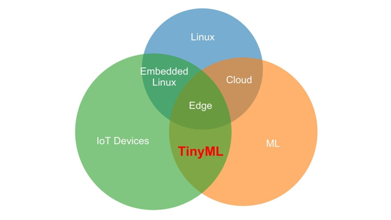
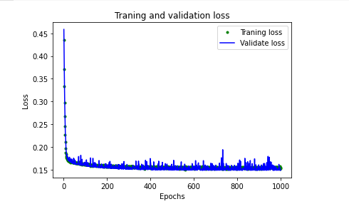

--

tinyml是一本书的名字，讲的是在stm32 F4这种soc运行TensorFlow。


Machine Learning (ML) 这一个学科，在学术界有 40 年左右的历史，

但是前面的 30 多年研究，只是在学术上有一些突破。

 

真正让 ML 从学界走入产业界的划时代改革的里程碑，

源于 2010 年 ImageNet 挑战赛 (ILSVRC)。

2012 年，Hiton (ML 业界元老级人物) 课题组首次参加 ImageNet 图像识别比赛，

AlexNet 夺得冠军，并碾压了第二名 (SVM) 的分类性能。

ML 在工业应用的热情在这一年被彻底点燃。


ML 最近几年已经在工业、消费领域获得了大量的应用，

随着云资源的不断完善，研发了更多的激动人心的 AI 模型。

云端 AI 的应用，已经获得长足的进步。

 

在 ML 的工业应用发展的这几年，物联网也处于快速处在发展期。

从最早的智能家居，到现在遍地的物联网智能设备。

AI 应用逐步从云端走向了设备端，现在设备端的 AI 应用已经占了很大的比例，

手机上 AI 的应用已经非常普遍。

 

但是，在物联网世界里，有数以亿计的体积小、功耗低、资源受限的设备支撑着物联网应用。

如何在超低功耗 (mV 功率范围) 的设备上运行人工智能应用，

同时又要满足设备长时间低功耗的运行 AI 应用的需求，已经形成了一个新的课题。


TinyML 指的是在 mW 功率的微处理器上，实现机器学习的方法、工具和技术。

它连接了物联网设备，边缘计算和机器学习。

 

TinyML 基金会在 2019 年组织了第一届峰会，这届峰会的成果如下：

1、TinyML 的技术硬件已经进入了实用性的阶段；

2、算法，网络以及低于 100KB 的 ML 模型，已经取得重大突破；

3、视觉，音频的低功耗需求快速增长。


两位作者中的一位侧重于物联网上的 AI 技术研发，

另一位则侧重于运用 AI 技术去实现工业化，

他们强强联合出版了这本书，

带我们进一步探索物联网端 AI 的所有技术环节工业化实现，

原汁原味的体现了利用 Google 的技术去促进发展的思考脉络。


作为开发环境，我们只需要在电脑上用 USB 接口实现外设接入就行了。

当然根据每一个读者的习惯，可以用自己所熟悉的编译工具来编译这个环境，

所有的这些代码都可以在 Windows，Linux 或者 macOS 上运行。

当然，已经训练出来许多模型在 Google Cloud 中可以下载。

**也可以用 Google Colab 来运行所有的代码。就不必要去担心需要拥有独特的硬件开发环境。**


这本书所有的项目是依赖于 TensorFlow Lite 在微控制器上的开发框架，所依赖的硬件环境，只有几十 kb 左右的存储空间。

项目
https://github.com/tensorflow/tensorflow/tree/master/tensorflow/lite/micro

# 项目流程

实现基于微控制器的 ML 项目开发流程如下所示：

1、获得简单数据集

2、训练深度学习模型

3、评估模型性能

4、转换成设备上运行的模型

5、将代码转换成二进制文件

6、部署二进制文件到微控制器


我们分享的 Hello World 示例，是用数学中的最基本的sine函数为原型，用 ML 的方式去预测数据。

我们的目标是，如果有一个 x 值，我们能够预测出 x 的 sin 值 y。

在真实的环境中，用数学计算的方法可以更快速的得到结果。

这个例子是用 ML 的方法去实现预测，从而了解 ML 的整个流程。


配置开发环境，所用的编程语言当然是当之无愧的 Python，

这是现在使用最广泛的，运用于科学、数学、以及 AI 领域的编程语言。

版本为 3.x Python 可以在命令行下运行，

但是还是推荐用 Jupyter Notebook 来开发，

它的好处是可以把代码、文档、还有图片放在一起，既能当教程，又能分步运行。


https://github.com/tensorflow/tflite-micro


分布最广的物联网设备往往体积很小、电量有限。

它们被作为终端硬件，通过嵌入式传感器采集各种数据；计算能力有限，对功耗极为敏感。

这类设备也能实现机器学习吗？

一个趋势是，人工智能AI正在加快速度从“云端”走向“边缘”，进入到越来越小的物联网设备中。

在终端和边缘侧的微处理器上，实现的机器学习过程，被称为微型机器学习，即TinyML。


TinyML是不同技术领域和推动因素的交集，它位于**物联网设备、机器学习和边缘计算之间的结合部**，并因为多种驱动力的综合作用，进展很快




TinyML 2019峰会共吸引了来自90多家企业的数百名工程师参与，而本届峰会的盛况更是空前，并且得出了很多重要结论：

　　• 对于很多应用场景，TinyML技术和硬件已经进化到实用性较强的阶段；

　　• 无论是算法、网络，还是低于100KB的ML模型，都取得了重大突破；

　　• 视觉和音频领域的低功耗需求快速增长。

无论何时何地，数据都需要即时可用，这一趋势越来越明显。

全球各行各业都在经历由这种需求推动的“数字化转型”。

根据IDC的分析，到2025年，全球创建的数据中，超过四分之一的数据在本质上都是实时数据，

而物联网实时数据将占这部分数据的95%以上。

目前存在的机器学习可以划分为3种形态，云端ML、边缘ML和TinyML。**TinyML正是针对占比超过95%以上的物联网实时数据处理场景。**


再看TinyML的发展现状，从算法、软件、硬件这三个维度分析，TinyML已经进化到“足够好”，可以实际应用的阶段。

　　**TinyML是一个新兴领域，是快速增长的机器学习技术和应用，是一片巨大的、未被充分开发的蓝海。**

对TinyML做个简单总结：

　　**• What：**TinyML是指超低功耗（毫瓦量级）的边缘侧机器学习应用。

　　**• Why：**TinyML可以提升大量物联网设备的数据分析和决策能力。

　　**• How：**TinyML的实现需要硬件、软件和算法的整体性协同设计。

　　**• When：**现在是着手布局TinyML的最好时机。


首先，我们需要明确的区分在物联网终端中应用机器学习的两种方式：

　　**• 为物联网终端设备提供机器学习服务**

　　**• 在物联网终端设备中内嵌TinyML即服务**

这两种表述看似相像，实则不同。

　　在第一种情况下，为物联网终端设备提供的机器学习服务，一般将所有ML任务都“外包”给边缘设备和云服务器，终端设备则以接收者的身份，“被动”执行由边缘和云端下发的各种任务。

　　在第二种情况下，物联网终端设备中内嵌TinyML即服务，“主动”参与智能决策与执行。虽然与云端和边缘相比，终端设备的资源非常有限，但TinyML即服务仍旧可以提升终端设备的分析能力，以便其能更好的处理实时物联网数据。

因此TinyML即服务，真正的实现了将机器学习带入到物联网终端。

看到这里，你或许有个疑问：机器学习生态系统非常庞大，而且对资源要求很高。物联网设备那么小，可以执行哪些机器学习任务？

　　为了更好的回答这个问题，我们先来说说TinyML和云端ML之间的差异，它们分别处于两个截然不同的世界。


当然，想要在终端物联网设备中，获得和云端ML同样的体验是不现实的。**TinyML主要实现的是推理（inference），也就是把从训练中学习到的能力，应用到实际操作中去。**


TinyML的出现，是为了更好的缓解边缘ML和云端ML中，无法突破的多种问题，包括数据隐私、网络带宽、时间延迟、可靠性和能源效率：


此类改进同样适用于规模较大的模型，

在不降低模型准确率（accuracy）的同时，

实现机器学习模型效率数个数量级的提高。

例如，Microsoft 开发的 Bonsai 算法可小到 2 KB，

但比通常 40MB 的 kNN 算法或是 4MB 的神经网络具有更好的性能。

这个结果听上去可能无感，

但如果换句话说——在规模缩小了一万倍的模型上取得同样的准确率，这就十分令人印象深刻了。

规模如此小的模型，可以运行在 2KB 内存的 Arduino Uno 上。

简而言之，现在可以在售价 5 美元的微控制器上构建此类机器学习模型。


机器学习正处于一个交叉路口，两种计算范式齐头并进，

即以计算为中心的计算，和以数据为中心的计算。

在以计算为中心的计算范式下，数据是在数据中心的实例上存储和分析的；

而在以数据为中心的计算范式下，处理是在数据的原始位置执行的。

尽管在目前，以计算为中心的计算范式似乎很快会达到上限，但是以数据为中心的计算范式才刚刚起步。


以前，设备执行的各种操作必需基于复杂的集成电路。

现在，机器学习的硬件“智能”正逐渐抽象为软件，使得嵌入式设备更加简单、轻量级和灵活。


使用嵌入式设备实现机器学习，需解决巨大的挑战，但在该领域也取得了长足的进步。

在微控制器上部署神经网络，关键挑战在于低内存占用、功率受限和计算受限。

智能手机是最典型的 TinyML 例子。

手机一直处于主动聆听“唤醒词”的状态，

例如 Android 智能手机的“你好，谷歌”，以及 iPhone 的“你好，Siri”。

如果通过智能手机的 CPU（主流 iPhone 的 CPU 已达 1.85 GHz）运行语音唤醒服务，那么电池电量会在短短几个小时内耗尽。

这样的电量消耗是不可接受的，而语音唤醒服务大多数人每天最多使用几次。


在一台智能手机中，唤醒词服务并非唯一无缝嵌入的 TinyML 应用。

加速度计数据可用于确定用户是否刚拿起手机，进而唤醒 CPU 并点亮屏幕。


显然，这些并非 TinyML 的唯一用武之地。

实际上，TinyML 为产品粉丝和企业提供了大量令人兴奋的应用，

用于实现更智能的 IoT 设备。

在当前数据变得越来越重要的情况下，

将机器学习资源分发到远端内存受限设备的能力，

为农业、天气预报或地震等数据密集行业提供了巨大机遇。

目前，TinyML 主要的两个重点应用领域是：

关键字发现。

大多数人已经非常熟悉此应用，例如“你好，Siri”和“你好，Google”等关键字，通常也称为“热词”或“唤醒词”。设备会连续监听来自麦克风的音频输入，训练实现仅响应与所学关键字匹配的特定声音序列。这些设备比自动语音识别（automatic speech recognition，ASR）更简单，使用更少的资源。Google 智能手机等设备还使用了级联架构实现扬声器的验证，以确保安全性。

视觉唤醒词。

视觉唤醒词使用图像类似替代唤醒词的功能，通过对图像做二分类表示存在与否。例如，设计一个智能照明系统，在检测到人的存在时启动，并在人离开时关闭。同样，野生动物摄影师可以使用视觉唤醒功能在特定的动物出现时启动拍摄，安防摄像机可以在检测到人活动时启动拍摄。


机器/深度学习已经如火如荼，各种炫目的效果呈现不穷，

笔者也复现一些如stackoverflow assistence、头像动漫化等，但大都需要强大算力，“终端（手机）+云服务器”是基本结构。

去年关注到Google TFLite Micro（TFLM）及技术，

可以将Tensorflow 模型部署到嵌入式的端末设备（比如arm cortex M4 64M）。

恰好手头有一个农业物联网项目，**利用嵌入式设备识别牲畜的活动状态**，应用了这一个技术。

这段时间项目间隙，记录下开发过程的一些心得体会。


推荐《TinyML: Machine Learning with TensorFlow Lite on  Arduino and Ultra-Low-Power Microcontrollers》这本书，有中文版。

该书从背景、理论阐述TinyML，并且”show me the code”，

从四个具体例子：Hello World、唤醒词检测、行人检测、魔杖进行讲述。


需要的软件

基于Tensorflow lite for microcontroller框架，位于tensorflow源码中；

ide推荐vs code；


对于Tensorflow最大需求是能够在桌面系统中训练并运行模型，

这种需求影响了很多设计决策，

例如为了更低的延迟和更多的功能而增加可执行文件的大小。

云端服务器上，RAM以GB为衡量单位，存储空间以TB为单位，几百兆字节的二进制文件通常不是问题。


不过，这些工程上的取舍不适用于其他平台（Android、IOS以及嵌入式平台），哪怕是将应用程序大小仅仅增加几兆字节也会大大减少下载次数并降低客户的满意度。

你可以为这些手机平台编译TensorFlow，但是默认情况下，会使应用程序至少增加20MB，即使一些优化也很难减少到2MB以下。   

  Google在2017年启动了TensorFlow Lite，

目标是在移动设备上高效且轻松的运行神经网络模型。

为了减少框架的大小和复杂性，TFLite 删除了不常用的功能。

**例如，它不支持训练模型，而是仅支持模型运行推断。**

它还不支持TF主线中可用的全部数据类型（例如double）。

**此外，TFLite也不支持一些使用次数比较少的算子。**

  作为这些折中的回报，TFLite可以只用几百字节，从而使其更适合大小受到限制的应用程序。

它还为Arm Cortex-A 系列CPU提供了高度优化的库。

另外一个关键有点是TFLite对网络的8位量化有很好支持。

一个模型有数百万个参数，仅仅是从32位浮点数转换为8位整数就能减少75%的大小。

  **简单的说，TFLite与TF最大的不同，它只关注推断。**


嵌入式环境运行前提对TFLM需求

1）没有操作系统依赖项

有些目标平台根本没有操作系统

2）链接时没有标准的C或C++库依赖项

为了节省空间，**比如sprintf()简单的函数要占用20KB空间**，唯一例外的是标准的c math库。

3）不需要浮点硬件

没话说，便宜的mcu说硬件浮点要贵2块钱，再买一个不香吗？

4）没有动态内存分配

运行需要连续运行需要连续几个月或者几年，如果主循环用malloc()/new 和free()/delete来分配和释放内存，难免堆最终不会以碎片状态结束。所以，tflm干脆要求传入一个固定大小的内存空间，让框架在初始化时进行临时分配(如果太小，tflite会马上报错，再调整较大空间），除此之外执行推断将不会有进一步的内存分配需求，因此可以调用而不会有堆碎片或内存错误。

5）C++ 11

为了模块化代码方便维护，另外和TFLite 移动设备方面更轻松的共享代码


# 一些github repo

https://github.com/search?q=tinyml


https://github.com/gigwegbe/tinyml-papers-and-projects


# 系列文章

## HelloWorld

就这一部分的关键代码详细解释一下：

```
TRAIN_SPLIT =  int(0.6 * SAMPLES)
TEST_SPLIT = int(0.2 * SAMPLES + TRAIN_SPLIT)
```

整个数据集包括三个部分，训练集，测试集，验证集。

示例中用了 60% 的数据当训练集，20% 的数据当测试集，20% 的数据当验证集。

这个比例不是恒定的，可以按需求调整。

```
from tensorflow.keras import layers
model_1 = tf.keras.Sequential()
model_1.add(layers.Dense(16, activation='relu', input_shape=(1,)))
model_1.add(layers.Dense(1))
model_1.compile(optimizer='rmsprop', loss='mse', metrics=['mae'])
model_1.summary()
```

把代码保存到github上。直接在colab里进行关联就可以了。

上面这个代码的表示的含义是：

第一层采用标量输入，并且基于 “relu” 激活，

用了 16 个神经元的密集层 (Dense Layer，也可叫做全连接层)。

当我们进行预测时，它是推理过程中的神经元之一。

每个神经元将然后被激活到一定程度。

每个神经元的激活量是基于在训练过程中获得的 weight 和 bias 值来定义激活功能。

神经元的激活将作为数字输出。

激活是通过一个简单的公式来计算的，如 Python 中所示。

我们将永远不需要自己编写此代码，因为它由 Keras 和 TensorFlow 处理， 

在深入学习时但会有所帮助，计算公式的伪代码如下所示：

```
activation = activation_function((input * weight) + bias)
```

要计算神经元的激活程度，需要将其输入乘以权重和偏差被添加到结果中。

计算出的值被传递到激活函数中。

结果就是神经元的激活。

激活函数是一种数学函数，用于塑造神经元的输出。

在我们的网络中，我们使用的是称为**整流线性单元** (Rectified Linear Unit) 的激活函数，或简称为 ReLU。

这在 Keras 中由参数 activation = relu 指定。ReLU 是一个简单的函数，如 Python 所示：

```
def relu(input):
	return max(0.0, input)
```


用 ReLU 做为激活函数意义在哪儿？

 

没有激活函数，神经元的输出将始终是线性函数.

这意味着网络只能建模线性关系，其中 x 和 y 之比在整个值范围内保持不变。

但是正弦波又是非线性的，这将阻止网络对我们的正弦波进行建模。

由于 ReLU 是非线性的，

因此它允许多层神经元联合作用并建立模型复杂的非线性关系，

每次x增量不会使y值以相同的方式增加。

还有其他激活函数，但是ReLU是最常用的函数。

作为ML算法，运用最优的激活函数是必要的。


我们再对输入、输出层做一些解读：

由于输出层是单个神经元，它将接收 16 个输入。

由于这是我们的输出层，因此我们不指定确定激活功能-我们只需要原始结果。

由于此神经元有多个输入，因此每个神经元都有一个对应的权重值。

神经元的输出通过以下公式计算得出，如 Python 中所示：其中 “inputs” 和 “weights” 都是 NumPy 数组，每个数组有 16 个元素

```
output = sum((inputs * weights)) + bias
```

通过将每个输入与其对应的乘积获得输出值 weights，对结果求和，

然后加上神经元的 bias。

该网络的 weights 和 bias 是在训练期间学习的。 


接下来，编译阶段的关键点，便是优化器的损失函数了。

```
model_1.compile(optimizer='rmsprop', loss='mse', metrics=['mae'])
```

最后我们再来看看模型概况：


 

其中输入层有 16 个神经元，共 2 层连接，所以全部的连接数为 16x2=32，

每一个神经元都有一个 bias，网络总共有 17 个 bias。

输入的 16，以及输出的 1。

所以总的参数为 32+17=49。

然后就是训练模型

```
history_1 = model_1.fit(x_train, y_train, epochs=1000, batch_size=16, validation_data=(x_validate, y_validate))
```

利用 keras 的 fit() 方法能够很好的训练。下面就一些参数做一下最基本的解释：

X_train, y_train 表示最基本的训练数据。

epochs 训练的周期，一般来说，周期越长，训练越精确，

但是，一般来说，训练的时间到一定阶段，训练精度不会有很大差别。

在这种清况下，一般要考虑去优化模型了。

batch_size 用于往网络中一次送入多少数据，如果值为 1，我们每一次会更新 weight 和 bias，并且会估计网络预测的损失，为下一次的运行做更精确的估计。越小的值，会带来很大的计算量，占用更多的计算资源。如果我们把值定要 600，一次性可以计算出更多的数据，但是会降低模型的精度。

**所以最好的方式是把值设置为 16 或者是 32**。这个值的选择，实际上精度与时间花费权衡的结果。

接下来，我们就要看一下训练的结果。

```
loss = history_1.history['loss']
val_loss = history_1.history['val_loss']

epochs = range(1, len(loss)+1)

plt.plot(epochs, loss, 'g.', label='Traning loss')
plt.plot(epochs, val_loss, 'b', label="Validate loss")
plt.title('Traning and validation loss')
plt.xlabel('Epochs')
plt.ylabel('Loss')
plt.legend()
plt.show()
```

下图显示了每个时期的损失，

有几种计算损失的方法，我们使用的方法是均方误差。对于训练和验证数据有明显的损失值。




我们可以看到，损失的数量在前 25 个时期迅速减少，然后趋于平稳。

这意味着该模型正在改进并产生更准确的预测！

我们的目标是在模型不再改善或训练损失小于验证损失 (Validation Loss) 时停止训练，

这意味着该模型已经学会了很好地预测训练数据，也不需要新的数据来提高精度。

为了使图表的平坦部分更具可读性，我们用代码 SKIP = 50 跳过前 50 个 epochs，这仅仅是便于我们看图方便。


从图中可以分析出，大概 epochs 到了 600 左右，训练开始趋于稳定。意味着我们的 epochs 应该不需要超过 600。

但是，我们还可以看到最低的损失值仍在 0.155 左右。

这意味着我们网络的预测平均降低了约 15％。

另外，验证损失值 (Validation loss) 产生的很大的跳跃，并不稳定。

我们需要改进方法。

这次，我们将绘制平均绝对误差 (Mean Absolute Error)图，

这是另一种衡量网络预测与实际数字的距离的方法

```
plt.clf() # clear current figure
mae = history_1.history['mae']
val_mae = history_1.history['val_mae']

plt.plot(epochs[SKIP:], mae[SKIP:], 'g.', label='Traning MAE')
plt.plot(epochs[SKIP:], val_mae[SKIP:], 'b.', label="Validate MAE")
plt.title('Traning and validation mean absolute error')
plt.xlabel('Epochs')
plt.ylabel('MAE')
plt.legend()
plt.show()
```


从平均绝对误差图可以看到，训练数据显示出的错误始终比验证数据低，

这意味着网络可能存在过拟合 (Overfit)，

或者过分地学习了训练数据，

从而无法对新数据做出有效的预测。


此外，平均绝对误差值非常高，最多约为 0.305，这意味着该模型的某些预测至少可降低 30％。

30％ 的误差意味着我们离精确建模正弦波函数还很遥远。

预测一下看看跟实际值的区别。

```
predictions = model_1.predict(x_train)
plt.clf()
plt.title('Training data predicted vs actual data')
plt.plot(x_test, y_test, 'b.', label='Actual')
plt.plot(x_train, predictions, 'r.', label='Predictions')
plt.legend()
plt.show()
```

可见预测差别非常大。


结果表明，该模型没有足够的能力来学习正弦波函数的全部复杂度，

因此只能以过于简单的方式对其进行近似。

通过优化模型，我们应该能够改善其性能。


优化的关键是增加一个全连接层，这一层包含了 16 个神经元。

```
model_2 = tf.keras.Sequential()
model_2.add(layers.Dense(16, activation='relu', input_shape=(1,)))
model_2.add(layers.Dense(16, activation='relu'))#加了这一行。
model_2.add(layers.Dense(1))
model_2.compile(optimizer='rmsprop', loss='mse', metrics=['mae'])
```

训练一下

```
history_2 = model_2.fit(x_train, y_train, epochs=600, batch_size=16, validation_data=(x_validate, y_validate))
```

然后预测一下

```
predictions = model_2.predict(x_test)
plt.clf()
plt.title('Comparision of predictions and actual values')
plt.plot(x_test, y_test, 'b.', label='Actual')
plt.plot(x_test, predictions, 'r.', label="Predicted")
plt.legend()
plt.show()
```

现在就准确多了。


### 模型转换

模型转换的要点，就是 TensorFlow 到 TensorFlow Lite 的转换。其中有两个主要的组成部分：

TensorFlow Lite 转换器 (TensorFlow Lite Converter)

这会将 TensorFlow 模型转换为一种节省空间的特殊格式，以用于内存受限的设备，并且可以应用进一步减少并优化模型尺寸，使其在小型设备上运行更快。

TensorFlow Lite 解释器 (Tensorflow Lite Interpreter)

这会使用最有效的方式运行经过适当转换的 TensorFlow Lite 模型到给定设备的有效操作。


```
# 第一个模型，不经过量化处理
converter = tf.lite.TFLiteConverter.from_keras_model(model_2)
tflite_model = converter.convert()
open('sine_model.tflite', 'wb').write(tflite_model)
# 第二个模型，经过量化处理
converter = tf.lite.TFLiteConverter.from_keras_model(model_2)
converter.optimizations = [tf.lite.Optimize.OPTIMIZE_FOR_SIZE]
tflite_model = converter.convert()
open('sine_model_quantized.tflite', 'wb').write(tflite_model)
```

对 TF Lite 模型进行预测，我们还需要完成如下的工作：

1. 申明解释器对象实体
2. 为模型分配内存
3. 加载模型
4. 从传感器中读取输出数据

把生成的模型，转成C语言数组，就可以在tflite-micro里使用了。


# 再学习

现在是可能有这个方向的应用。

所以要往实践的方向来看。

从这里开始发散。

https://github.com/mit-han-lab/tinyml

官网：

https://hanlab.mit.edu/

我们的 TinyML 项目旨在通过减少计算、减少工程师和减少从算法到硬件、从推理到训练的数据来提高深度学习的效率。我们拥抱边缘 AI 和 AIoT 时代。

Song Han 是麻省理工学院 EECS 的助理教授。

他在斯坦福大学获得博士学位。

他的研究重点是高效的深度学习计算。

他提出了“深度压缩”技术，可以在不损失精度的情况下将神经网络大小减少一个数量级，

以及首先利用深度学习加速器中的剪枝和权重稀疏性的硬件实现“高效推理引擎”。

他的团队在硬件感知神经架构搜索（ProxylessNAS、Once-for-All Network (OFA)、MCUNet）方面的工作被集成到 Facebook、亚马逊、微软，

在旗舰 AI 会议上获得了六项低功耗计算机视觉竞赛奖。

宋在 ICLR’16 和 FPGA’17 上获得了最佳论文奖，

以及来自亚马逊、索尼、Facebook、英伟达和三星的多项教师奖。

宋被麻省理工科技评论评为“35 位 35 岁以下创新者”，

因为他对“深度压缩”技术的贡献“让强大的人工智能 (AI) 程序在低功耗移动设备上更高效地运行”。

 Song 因“用于加速机器学习的高效算法和硬件”获得 NSF CAREER 奖和 IEEE“值得关注的 10 个人工智能：人工智能的未来”奖

所以这个实验室是以他的名字命名的？中文名是宋涵。


包括的项目有：mcunet、tinytl。

https://github.com/mit-han-lab/tinyml/tree/master/mcunet

mcunet说是还在开发中。

我们的 TinyEngine 推理引擎可以成为基于 MCU 的 AI 应用程序的有用基础设施。

与 TF-Lite Micro、CMSIS-NN、MicroTVM 等现有库相比，

它显着提高了推理速度并减少了内存使用

的确代码看起来还没有完整。


tinytl提出了理念，可以在设备上进行训练，而不仅仅是推理。

目前还没看到具体在设备端的代码示例。


# uTensor

https://utensor.github.io/website/

uTensor 是一个免费的开源嵌入式机器学习基础设施，

专为快速原型设计和部署而设计。

该项目包括一个推理引擎、一个高度可定制的图形处理工具和一个数据收集框架（正在进行中）。

设备代码针对只有几千字节内存的硬件进行了优化

嵌入式运行时

小至 2kb，C++ 图形实现既可以手工编码，也可以从经过训练的模型自动生成。

简单部署

从 Jupyter 笔记本到 MCU，uTensor 是数据科学家和嵌入式工程师的渠道。

图处理

嵌入式机器学习的创新需要快速迭代想法。 uTensor SDK 在 Python 中提供易于定制的图形转换器。

开放生态系统

uTensor 是一个嵌入式机器学习基础设施。带来您自己的操作、图形转换，或将其移植到新平台；它适合所有人。

## 端到端的demo

从训练到推理。

需要安装的Python工具：

mbed-cli

utensor-cgen

```
pip install mbed-cli ugensor-cgen
```

下载示例代码

```
git clone https://github.com/uTensor/utensor-helloworld.git
```

代码没有什么可看的。很简单。


自强产品

联邦学习的说明（来源）

设备在现场部署后可以不断改进。

 Google 的 Gboard 使用一种称为联邦学习的技术，

该技术涉及每台设备收集数据并进行单独改进。

这些单独的改进在中央服务上聚合，然后每个设备都使用组合结果进行更新


uTensor 将继续利用最新的软件和硬件进步，例如 CMSIS-NN、Arm 的 Cortex-M 机器学习 API。

这些将被集成到 uTensor 中，以确保 Arm 硬件的最佳性能。

开发人员和研究人员将能够使用 uTensor 轻松测试他们的最新想法，例如新算法、分布式计算或 RTL。

# 收集的相关项目

这里有一些收集的项目。

https://github.com/gigwegbe/tinyml-papers-and-projects


在数据无处不在的时代，TinyML 变得越来越流行。

但是，最需要的数据受到严格的隐私和安全保证。

此外，TinyML 硬件在现实世界中的部署具有传统 ML 无法解决的显着内存和通信限制。

鉴于这些挑战，我们采用了 TinyFedTL，这是在资源受限的微控制器上首次实现**联合迁移学习**。

## study-group

这里是一个课程的，ppt过了一下。好像没有什么收获。

https://github.com/scaledown-team/study-group

## 垃圾分类arduino

这个用arduino来实现垃圾分类的。

https://github.com/lightb0x/arduino_trash_classification

arduino nano 33 BLE Sense + ArduCAM OV2640

MobileNet v1 25% on 96x96 RGB input

6-way classification

- cardboard
- glass
- metal
- paper
- plastic
- trash

可以分辨上面这6种。

MobileNet v1 model was trained on custom ImageNet/96x96 dataset

speed : takes about `930ms` per inference (takes 260ms on Raspberry Pi Zero W)

基于tflite-micro实现。

就是很常规的流程。

获取图像靠

`GetImage(error_reporter, kNumCols, kNumRows, kNumChannels, image_data)`

结果的判断：

```
int8_t score[kCategoryCount];
  for (int i = 0; i < kCategoryCount; i++)
    score[i] = output->data.int8[i];
```

摄像头得到的是jpeg的图片。会解码并转成灰度图。然后再进行判断。

## 空气吉他

这个创意不错。

## esp32上的tinyml

https://blackwalnut.zucc.edu.cn/codelabs/TinyML

这个网站是vue+express搭建的。

做得不错。

文档写得很详细。

https://github.com/HollowMan6/TinyML-ESP32

## 电机异常检测

数据是靠给风扇加负重块来产生并收集。

基于esp32的。

https://github.com/ShawnHymel/tinyml-example-anomaly-detection

## 检测野生动物动向

https://www.hackster.io/dhruvsheth_/eletect-tinyml-and-iot-based-smart-wildlife-tracker-c03e5a

## 自动驾驶

https://www.edgeimpulse.com/blog/autonomous-driving-using-computer-vision

## 自动读取水表的值

https://github.com/jomjol/water-meter-system-complete

是完整的端到端的实现。

这是一个为家庭监控用水量的水表拍照的系统。它是房屋自动化系统的一部分，用于监控和检查用水量。

该系统由3个主要部分组成：

我的水表的圆形夹紧适配器 = 水表上的无螺丝固定系统，可以根据不同的几何形状进行调整

朝向相机的管子 - 此处由两部分完成以允许调整高度

带 OV2640 的 ESP32-CAM 相机支架。 

ESP32-CAM 模块具有内置闪光灯 LED，因此无需额外照明


在这里，这种边缘计算被引入了一个面向实际的示例，其中在 ESP32 设备上实现了 AI 网络，因此：AI 在边缘。

主要特点：

Tensorflow Lite (TFlite) 集成 - 包括易于使用的包装器

内联图像处理（特征检测、对齐、ROI 提取）

小而便宜的设备（3x4.5x2 cm³，< 10 EUR）

摄像头和照明集成

用于管理和控制的 Web 界面

OTA-Interface 直接通过网页界面更新

易于集成的 API


这是关于图像识别和数字化，完全在廉价的 ESP32 板上使用卷积神经网络 (CNN) 形式的人工智能完成。从图像捕获 (OV2640)、图像预处理（自动对齐、ROI 识别）一直到图像识别（CNN 结构）和结果可信度，一切都在 10 欧元的廉价设备上完成。

这一切都集成在一个易于设置和使用的环境中，负责所有后台处理和处理，包括常规作业调度程序。用户界面是一个集成的 Web 服务器，可以轻松调整并以不同选项的 API 提供数据。

这里要演示的任务是模拟水表的自动读数。用水量将在房屋自动化中记录，水表是完全模拟的，没有任何电子接口。因此，通过定期拍摄水表的图像并将读数数字化来解决该任务。

有两种类型的 CNN 实现，用于读取数字数字的分类网络和用于数字化子数字读数的模拟指针的单个输出网络。

这个项目是水表系统完整的演进，它使用 ESP32-CAM 来获取图像和一个 1GB-Docker 图像来运行神经网络主干。这里所有东西都集成在一个 ESP32-CAM 模块中，带有 8MB 的 RAM 和一个 SD 卡作为数据存储。


该系统实现了几个功能：

水表读数

图片提供者

文件服务器

OTA功能

图形配置管理器

网络服务器


## 手写识别

这些项目只是在板端的逻辑都差不多。都是tflite-micro的流程。

重点理解创意。

## 接收语音命令的小车

https://www.survivingwithandroid.com/arduino-machine-learning-tensorflow-lite/

```c++
void RespondToCommand(tflite::ErrorReporter* error_reporter,
                      int32_t current_time, const char* found_command,
                      uint8_t score, bool is_new_command) {
  static bool is_initialized = false;
  
  static int32_t last_command_time = 0;
  static int count = 0;
  static int certainty = 220;

  if (is_new_command) {
    TF_LITE_REPORT_ERROR(error_reporter, "Heard %s (%d) @%dms", found_command,
                         score, current_time);
    // If we hear a command, light up the appropriate LED
    if (found_command[0] == 'l') {
      last_command_time = current_time;
      TF_LITE_REPORT_ERROR(error_reporter, "---- Left -----");
      //left();
    }

    if (found_command[0] == 'r') {
      last_command_time = current_time;
      TF_LITE_REPORT_ERROR(error_reporter, "---- Right -----");
      // right();
    }

    if (found_command[0] == 'g') {
      last_command_time = current_time;
      TF_LITE_REPORT_ERROR(error_reporter, "---- Go -----");
      // go();
    }

     if (found_command[0] == 's') {
      last_command_time = current_time;
      TF_LITE_REPORT_ERROR(error_reporter, "---- Stop -----");
      // stop();
    }

    if (found_command[0] == 'u') {
      last_command_time = current_time;
    }
  }

 
}
```

## 实现语音助手

https://mjrobot.org/2021/01/27/building-an-intelligent-voice-assistant-from-scratch/

这篇文章还是非常详细具体的。可操作性非常好。


我们将尝试在这个项目中回答这个问题，使用 RaspberryPi 和 Arduino Nano 模拟 Google 助手。

介绍

首先，必须意识到市场上的语音助手，如 Google Home 或 Amazon Echo-Dot，只有在人类被特定关键字“唤醒”时才会做出反应，例如第一个“嘿谷歌”和“ Alexa”在第二个。

换句话说，识别语音命令的整个过程基于多阶段模型或级联检测。

第 1 阶段：Echo-Dot 或 Google Home 内的一个较小的微处理器会持续收听声音，等待发现关键字。对于此类检测，使用了边缘的 TinyML 模型。

第 2 阶段：只有在被触发时，数据才会被发送到云端，并在更大的模型上进行处理。


TinyML 是一个出色的概念，它使机器智能紧邻物理世界；此外，在微处理器级别运行机器学习模型 (ML) 可避免延迟、功耗和安全性等问题


对于本项目的第 1 阶段（KWS 或关键字定位），

我们将使用 Arduino Nano 33 BLE Sense 微控制器。

在几个集成的传感器中，它有一个数字麦克风，用于识别关键字。

对于第 2 阶段，一旦 Arduino 触发，RaspberryPi 将用于联系云上的 Google 服务以执行更复杂的任务


该项目将分为两部分：

第 1 部分：在 RPi 上模拟 Google Assistant

第 2 部分：在 Arduino Nano 上实现 KWS

在这里，您可以对最终项目有所了解


除了将开发允许 RPi 模拟 Google Assistant 的软件外，还需要一些额外的硬件。

为简单起见，您可以安装外部麦克风和扬声器或使用 HAT。

在这个项目中，我们将使用HAT，即 ReSpeaker 2-Mics Pi HAT。

ReSpeaker 2-Mics Pi HAT


对应的驱动代码：

```
git clone https://github.com/respeaker/seeed-voicecard.git
cd seeed-voicecard
sudo ./install.sh
reboot
```

所以，就我而言，声卡是：

卡 0：树莓派 HDMI

卡 1：RPi 耳机音频插孔

卡片 2：ReSpeaker 2-Mics Pi HAT

Card 2 应该是默认的，你可以在 Pi Preferences/Audio Device Settings 上验证它

就我而言，ReSpeaker 2-Mics Pi HAT（音频插孔）上的输出无法正常工作，因此我将卡 2 定义为输入（ReSpeaker 上的麦克风），将标准 Rpi 音频插孔（卡 1）作为输出。

下载谷歌服务

```
git clone -b voicekit https://github.com/google/aiyprojects-raspbian.git 
```

一套使用对接谷歌服务的python脚本。

## 用tinyml预测天气

https://github.com/BaptisteZloch/Weather_forcasting

现在代码功能齐全，您可以将文件上传到您的电路板并进行推理。

该模型将使用嵌入在 nano 33 BLE 传感器上的内置传感器捕获压力、湿度、温度。

推断是使用 EloquentTinyML 库进行的，

该库是使用模型轻松运行预测的绝佳工具。

它使用 tensorflow lite micro header c++ 文件。

该模型位于 /TinyML_weather/include。

该模型使用 python、google colab 和 tensorflow 构建，使用 kaggle 数据集。

然后模型在tensorflow lite模型中转换，后来在tensorflow lite micro模型中转换。 

（有两种方法可以转换模型，都显示在 .ipynb 中）

天气非常这么几类

```
String value(float out[5]) {
  Array<float> my_classes = Array<float>(out, NUMBER_OF_OUTPUTS);
  if (my_classes.getMaxIndex() == 0) {
    return "Sunny";
  } else if (my_classes.getMaxIndex() == 1) {
    return "Partly cloudy";
  } else if (my_classes.getMaxIndex() == 2) {
    return "Overcast";
  } else if (my_classes.getMaxIndex() == 3) {
    return "Cloudy";
  } else {
    return "Sunny";
  }
}
```

输入是温度、湿度、气压这3个。

## 定位你的猫

https://github.com/filipsPL/cat-localizer

1、在猫的身上放一个ble beacon。

2、在房子里放一些esp32或者树莓派做ble检测器。

3、把ble beacon的RSSI发送给服务器。

4、服务器上跑模型，根据收到的数据，给出推理的结果，例如猫在厨房里。

这里的挑战上，尽量使用更少的检测器。比房间数要少。

靠机器学习来完成剩下的事情。


BLE 发射器。 BLE 信标。什么都会好的。我使用了 NotiOne 按钮，它们运行良好并且具有附加功能（此处未使用）。但更便宜的东西也会起作用。 n x 10-20 $

BLE 检测器。我用了四个 ESP32。我想中等房屋/公寓的 4-6 应该足够了。也可以使用带有 BLE 的现代树莓派。 n x 4 $

数据处理。服务器/计算机。我使用 amd64 Debian，但任何 Raspberry Pi 都应该也不错。可以远程。可以在微控制器中完成（参见：进一步说明）

WiFi 连接（ESP 到服务器）

## 在树莓派pico上使用mnist

https://github.com/iwatake2222/pico-mnist

这个看起来不错。

具体操作是：在屏幕上手写一个数字，然后就输出对应的值。

体验比较完整。

## mlperf tiny

MLPerf Tiny 的目标是提供一组具有代表性的深度神经网络和基准代码，以比较嵌入式设备之间的性能。嵌入式设备包括微控制器、DSP 和微型神经网络加速器。这些设备通常在 10MHz 到 250MHz 之间运行，并且可以使用不到 50mW 的功率执行推理。

MLPerf Tiny 提交将使设备制造商和研究人员能够为其用例选择最佳硬件，并允许硬件和软件供应商展示他们的产品。

参考基准是使用 TensorFlow Lite for Microcontrollers (TFLM) 提供的。提交者可以直接使用 TFLM，但鼓励提交者使用最适合其硬件的软件堆栈

https://github.com/mlcommons/tiny

# nnom

https://github.com/majianjia/nnom

Neural Network on Microcontroller (NNoM)

NNoM是一个专门为了神经网络在 MCU 上运行的框架。 

NNoM 是一个定点神经网络库，

 现在支持 8-bit定点格式。

 当前 NNoM 支持数十种操作，

卷积，池化，激活，矩阵计算等等。

 此外还提供多种在线评估方法，包括时间统计，内存统计，Top-K 准确度，Confusion Matrix 等等。

它拥有以下优点：

- **快速开发**： 电脑上训练的 Keras 模型直接转换成 C 文件。
- **默认纯C后端**： 移植和使用畅通无阻，支持32/64bit，MCU/PC。
- **支持复杂结构**： 支持多种复杂的网络模型结构。
- **完善的文档**： 拥有 API 文档，入门指南，优化指南。
- **入门简单**： 多个从简单到复杂的例子，完全开源。

**MCU 上的神经网络能做什么？**

- 语音关键词识别 （KeyWord Spotting）
- 使用运动传感器识别活动状态 （Human Activity Recognition）
- 神经网络控制系统 （替代PID等传统控制方法）
- 图像处理 （带专用加速器的 MCU）

2014年后的网络，更高效，也更复杂。

CMSIS-NN 之类的库太底层，需要设置的参数众多，不够灵活，

只能应用在比较传统的单路径网络上。

 而新的网络倾向于从结构上做优化，不可避免地需要在结构上做设计和优化。 

复杂的网络结构导致非常难以使用传统的底层库进行部署。 

最初，NNoM 在 CMSIS-NN 上封装了一层结构层专门用于处理复杂的网络路径并且简化了参数计算。 后来 NNoM 有了自己的脚本可以一键生成相应的 C 文件，更进一步提升了使用性。

 新的纯 C 后端也使得使用 NNoM 后，网络的部署几乎没有平台的限制。

这个是在rt-thread上运行的。

NNoM 默认使用纯 C 后端， 同时支持 CMSIS-NN/DSP 后端。选择 CMSIS 后端后，会有5倍左右的性能提升.

这个是中国人写的项目。好像是个人项目。

但是文档都用英文写的。的确很有耐心了。


# 一些理解

看太多种的框架意义好像也不大。

还是以tflite-micro为主。


## 参考资料

官网文档

https://github.com/uTensor/website/blob/master/docs.md

# 参考资料

1、

https://blog.csdn.net/wfing/article/details/106995562

2、一文读懂即将引爆的TinyML：在边缘侧实现超低功耗机器学习

http://www.ziwuiot.com/jishu/26288.html

3、TinyML：下一轮人工智能革命

https://baijiahao.baidu.com/s?id=1682409135667826022&wfr=spider&for=pc

4、TinyML实践-1：What & Why TinyML？

flavorfan的系列文章

https://cloud.tencent.com/developer/article/1757386

5、

系列文章，不错

https://blog.csdn.net/wfing/article/details/106995562