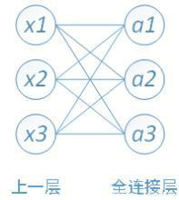
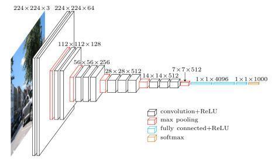

--

# 什么是卷积？

卷积过程是使用一个卷积核（如图中的Filter），

在每层像素矩阵上不断按步长扫描下去，

每次扫到的数值会和卷积核中对应位置的数进行**相乘，然后相加求和，**

得到的值将会生成一个新的矩阵。

卷积核相当于卷积操作中的一个过滤器，

用于提取我们图像的特征，

特征提取完后会得到一个特征图。

卷积核的大小一般选择3x3和5x5，

比较常用的是3x3，训练效果会更好。

**卷积核里面的每个值**就是我们需要训练模型过程中的神经元参数（**权重**），

开始会有随机的初始值，

当训练网络时，网络会通过后向传播不断更新这些参数值，

直到寻找到最佳的参数值。

**对于如何判断参数值的最佳，则是通过loss损失函数来评估。**

# **什么是padding？**

在进行卷积操作的过程中，

处于中间位置的数值容易被进行多次的提取，

但是边界数值的特征提取次数相对较少，

为了能更好的把边界数值也利用上，

**所以给原始数据矩阵的四周都补上一层0，**

这就是padding操作。

在进行卷积操作之后维度会变少，

得到的矩阵比原矩阵要小，不方便计算，

原矩阵加上一层0的padding操作可以很好的解决该问题，

卷积出来的矩阵和原矩阵尺寸一致。

# **什么是池化pooling?**

池化操作相当于降维操作，

有最大池化和平均池化，

其中最大池化(max pooling)最为常用。

经过卷积操作后我们提取到的特征信息，相邻区域会有相似特征信息，这是可以相互替代的，

如果全部保留这些特征信息会存在信息冗余，增加计算难度。

通过池化层会不断地减小数据的空间大小，参数的数量和计算量会有相应的下降，

**这在一定程度上控制了过拟合。**

就是要抓住主要矛盾，不要纠结细节，纠结细节过多，就看不到本质。

# **什么是Flatten？**

Flatten将池化后的数据拉开，变成一维向量来表示，**方便输入到全连接网络。**

Flatten用于将卷积池化后最后的输出变为一维向量，这样才可以和全连接层连接，用于计算。

# **什么是全连接层？**

对n-1层和n层而言，

n-1层的任意一个节点，

都和第n层所有节点有连接。

即第n层的每个节点在进行计算的时候，激活函数的输入是n-1层所有节点的加权。

# **什么是Dropout？**

在训练过程中，按照一定的比例将网络中的神经元进行丢弃，可以防止模型训练过拟合的情况。

224x224x3的彩色图表示3通道的长和宽都为224的图像数据，

也是网络的输入层白色部分为卷积层，

红色部分为池化层（使用最大池化），

蓝色部分为全连接层，

其中卷积层和全连接层的激活函数都使用relu

总的来说，

**VGG16网络为13层卷积层+3层全连接层而组成**

什么是卷积层？

下图是一个图像卷积的例子，

输入图像是`32*32*3`，3是它的深度（即R、G、B三色通道），

卷积层是一个`5*5*3`的filter，

这里注意：filter的深度必须和输入图像的深度相同。

通过一个filter与输入图像的卷积可以得到一个`28*28*1`的特征图，

下图是用了**两个filter得到了两个特征图。**

通常地，我们会使用更多的卷积filter，来获得更加深层次的特征信息。

这里可以看到不同的卷积核的效果。

https://setosa.io/ev/image-kernels/

VGG由5层卷积层、3层全连接层、softmax输出层构成，

**层与层之间使用max-pooling（最大化池）分开，**

所有隐层的激活单元都采用ReLU函数。

VGG使用多个较小卷积核（3x3）的卷积层代替一个卷积核较大的卷积层，

一方面可以减少参数，

另一方面相当于进行了更多的非线性映射，

可以增加网络的拟合/表达能力。

小卷积核是VGG的一个重要特点，

虽然VGG是在模仿AlexNet的网络结构，

但没有采用AlexNet中比较大的卷积核尺寸（如7x7），

而是通过降低卷积核的大小（3x3），

增加卷积子层数来达到同样的性能（VGG：从1到4卷积子层，AlexNet：1子层）。

VGG的作者认为两个3x3的卷积堆叠获得的感受野大小，相当一个5x5的卷积；而3个3x3卷积的堆叠获取到的感受野相当于一个7x7的卷积。

VGG是由Simonyan 和Zisserman在文献《Very Deep Convolutional Networks for Large Scale Image Recognition》中提出卷积神经网络模型，

其名称来源于作者所在的牛津大学视觉几何组(Visual Geometry Group)的缩写。

这是一个VGG被用到烂的图，但确实很好的反应了VGG的结构：
1、一张原始图片被resize到(224,224,3)。
2、conv1两次[3,3]卷积网络，输出的特征层为64，输出为(224,224,64)，再2X2最大池化，输出net为(112,112,64)。
3、conv2两次[3,3]卷积网络，输出的特征层为128，输出net为(112,112,128)，再2X2最大池化，输出net为(56,56,128)。
4、conv3三次[3,3]卷积网络，输出的特征层为256，输出net为(56,56,256)，再2X2最大池化，输出net为(28,28,256)。
5、conv3三次[3,3]卷积网络，输出的特征层为256，输出net为(28,28,512)，再2X2最大池化，输出net为(14,14,512)。
6、conv3三次[3,3]卷积网络，输出的特征层为256，输出net为(14,14,512)，再2X2最大池化，输出net为(7,7,512)。
7、利用卷积的方式模拟全连接层，效果等同，输出net为(1,1,4096)。共进行两次。
8、利用卷积的方式模拟全连接层，效果等同，输出net为(1,1,1000)。
最后输出的就是每个类的预测。

# 参考资料

1、卷积神经网络VGG16详解

https://baijiahao.baidu.com/s?id=1667221544796169037&wfr=spider&for=pc

2、

https://blog.csdn.net/weixin_44791964/article/details/102585038