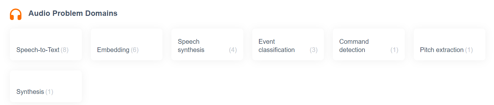
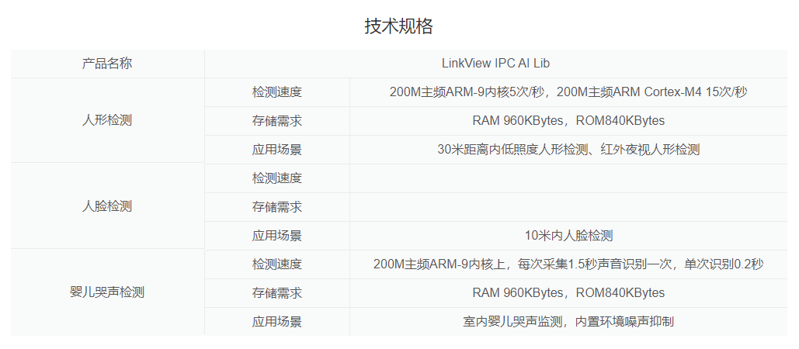
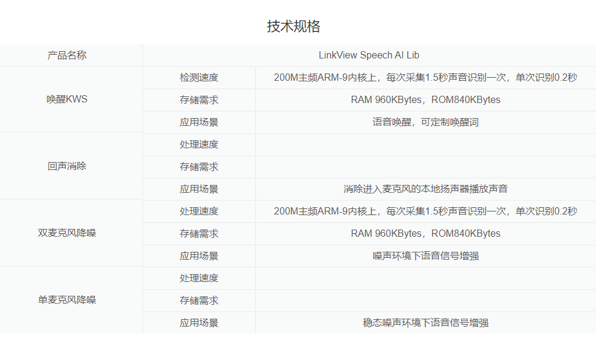
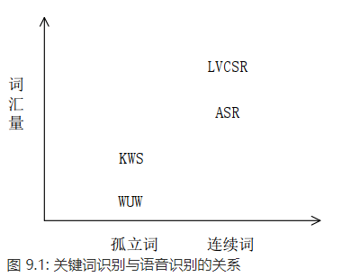
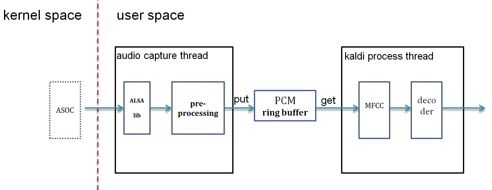
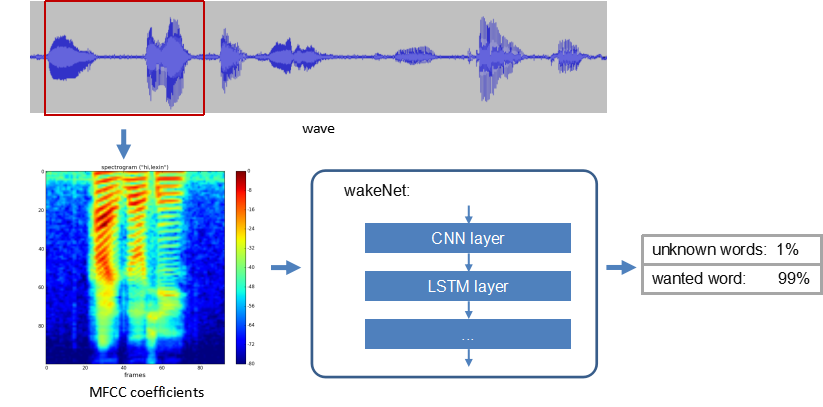
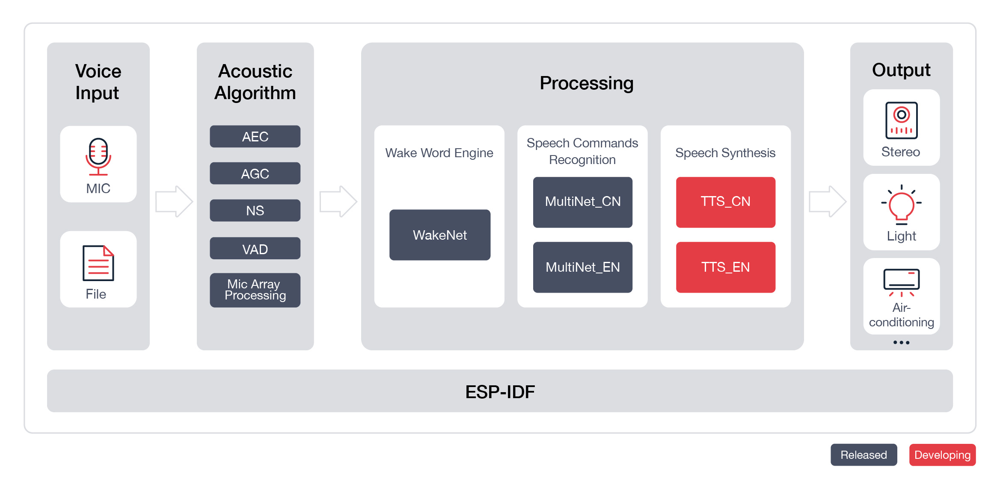

--

现在想想npu在音箱产品的各个环节上，可以起到哪些加速作用？

从交互的各个环节上进行思考

```
1、唤醒。
2、VAD。
3、ASR。
4、NLP。
5、TTS。
```

这5个代表了这样的流程：

唤醒音箱，检测到说话结束了，把语音转成文本，然后进行语义理解，然后把处理的结果通过tts播报出来。

tfhub.dev上音频相关的模型有这些。



# 唤醒

## 自己的结论

唤醒词总的来说，是一个二分类的问题。结果就是yes或no。

所以模型不是很关键。

直接用mfcc，转成二维的方式来识别就好了。

关键是训练的语料。

可以参考乐鑫的自定义唤醒词的流程。

有没有一些现成的模型？

## 探索

基于端到端深度学习方法的语音唤醒(Keyword Spotting)模型和论文

https://blog.csdn.net/YZhang0108/article/details/105771069

吴恩达《深度学习》L5W3作业2

https://www.heywhale.com/mw/project/5de9c638953ca8002c95c593










http://www.360doc.com/content/20/0821/10/7673502_931426388.shtml


## 理论

Speech Recognition: Keyword Spotting Through Image Recognition

基于图像识别的关键词识别

https://arxiv.org/abs/1803.03759

## 当前情况

**虽然智能音箱的所谓“主控”芯片制造商总在宣传自身的AI属性，绝大部分芯片内部还是鲜有AI专核，或者说神经网络专用计算单元。大概这类边缘设备的AI算力需求，靠CPU或可能包含的GPU就可以达成。**

R329的参数配置与特性：

\- 双核 Cortex-A531.5GHz 主频；

\- DSP：双核 HIFI 4，400MHz 频率；

\- NPU：周易 AIPU，800MHz， 0.256T；

\- 存储：片上SRAM；内置 128MB DDR3；

\- 扩展：集成多路音频ADC和DAC，3路I2S和8通道DMIC，同时集成LDOs。

NPU专门用于本地ASR（自动语音识别）、NLP（自然语言识别）和TTS（Textto Speech）——都是在本地执行的，也就是我们常说的边缘计算。

R329的DSP部分是两个HIFI 4核心——这是CadenceTensilica HiFi DSP系列IP中的一个，在家族定位中也属于偏向高性能的DSP，在手机、车载、数字电视之类的产品上就有相对广泛的应用生态。HIFI 4实则本身就支持多通道基于对象的音频、数字助手前端处理和基于神经网络的ASR，虽然我们知道全志选择了将其中的部分特性交给NPU去完成。

从全志发言人了解到这两个HIFI 4核的其中一个可用作“音频前处理，如降噪、回音消除、唤醒词识别”；一个则可用于“音频后处理，实现音频解码、音效增强、录音等”；配合片上的SRAM可实现“低功耗小模型双麦降噪算法与小模型深度学习唤醒词”。

Arm中国2018年11月发布的“周易”平台，主要包括两部分，一是AIPU，二是Tengine框架。AIPU最大的特点就是拥有一套AI和神经网络优化指令集，实现包括张量指令、实现定制硬件加速单元的特定AI指令，以及AI计算的标量指令等，另外也支持用户自定义硬件实现。

在更具体的应用上，全志表示：“ASR、NLP、TTS等技术对专用AI处理器提出了迫切需求；传统算法也逐渐被AI算法替代，国内外均有发布，用深度学习做端到端的算法，相对于传统降噪、回声消除和关键词识别算法，效果更优，具有更高的识别率。”

较小的SRAM本身是无法运行低功耗降噪算法+唤醒模型的，还是需要搭配更慢的DDR。在 SRAM的配置下，算法模型大部分算力可以放到SRAM中运行。所以全志表示，R329的待机功耗为（1）内置硬件VAD（语音活动检测），做声音检测亦能实现30mW以下的待机；（2）DSP+RAM，实现小模型双麦降噪算法、小模型深度学习唤醒词，则为50mW待机功耗；（3）DSP+NPU+ SRAM，让大模型双麦降噪算法跑在DSP上，大规模深度学习唤醒词跑在NPU上，实现60mW待机功耗。所以R329本身适用于做带电池的方案。


AT660x是一颗基于低功耗技术的深度学习语音识别芯片，内置神经网络硬件加速模块NPU，标准 ARM 处理器 Cortex-M0，集成多种控制和通信接口。

 

AT660x可以运行多种神经网络模型，在强噪声干扰的近场和远场情况下，支持离线语音唤醒词、命令词识别，并支持用户声纹在终端侧自助录制和离线快速训练。


国产原生芯片品牌探境科技推出的通用型 AI 语音识别芯片——音旋风 611（英文名称：Voitist611）采用 NPU架构，配合单麦克风即可实现 5-10m 远距离的语音识别，不需要依赖云和网络，即可在本地完成推理运算。

音旋风 611 采用音频阵列算法，支持 200 条唤醒词，命令词识别率近 97%，可远场识别 10 米识别范围，具有毫安级待机功耗，售价约 2 美金，已可量产。


KL720是耐能在去年发布KL520后的新一代芯片，其实早在2019年安博会时，耐能就预告在今年会发布一款智能安防专用的AISoC。

耐能KL720采用自主研发的KDP720系列NPUIP，内置ARMCortex－M4CPU、FPU与CadenceP6DSP，算力最高可达1．5TOPS，并支持CNN与RNN。

同时，凭借独特可重构技术，其可重新配置IP，能在相同的硬件架构中支持不同的CNN模型，提升使用率高达70％。


KL720收录了整个词典的单词，不仅可供翻译App使用，同时还可无需唤醒词即可执行相关指令，为用户带来更多的便利。


比如，老人不会说普通话，就可以通过按键的方式将普通话版命令词替换为方言；不喜欢家中的空调叫“小宝小宝”，便可以更换为自认为更顺口的“阿宝阿宝”、“小强小强”；想把“打开照明”换成“turn on”等等。可以看出，离线自学习技术的嵌入，让智能语音产品更人性化和智能化了，极大满足了用户个性化的需求，增强了用户体验感。


唤醒词检测采用两级策略，两级均采用DNN-隐马尔可夫模型框架，两个基于WFST的解码器进行在线检测。

一级声学模型通过帧级训练准则优化，二级声学模型通过序列级训练准则优化。

当在第一阶段模型中检测到唤醒词时，包含唤醒词的语音段将被发送到第二阶段进行二次确认。

当第二阶段也确认检测到唤醒词时，唤醒词片段将被发送到后续说话人确认模块。

说话人验证模块采用多模型融合策略。

第一种模型基于xvector框架，为了满足实时速率要求，减少了一些网络层的节点数量；

第二种模型基于resnet框架，通过减少每个块中的卷积核通道数实现Thin Resnet34，使用NetVLAD计算聚合向量，然后通过一个全连接层进行降维，从而得到说话人的向量表示。


在远场任务中，创新性地加入了相似损失函数。

利用MMD和CORAL损失函数来度量近场和远场数据在空间分布上的差异，

模型在训练过程中逐渐减小差异，使得模型提取的说话人向量具有跨域不变性。

在此基础上，小米-NPU（这里NPU是西北工业大学的缩写）的选手们也发现，以下方法有助于进一步提高系统性能。

**1）**使用开源数据进行模型预训练；

**2）**扩大了培训和测试数据，以丰富数据的多样性；

**3）**使用一级唤醒词检测模块统一说话人确认模块来注册和测试语音的开始和结束时间点；

**4）**使用自动标记方法获得“说话人伪标签”并微调模型。

最终小米-NPU的团队获得了所有双轨制的第一名。


porcupine跟pocketsphinx以及snowboy的比较

porcupine不开源，提供的都是动态库，还不支持中文。

也没有看到深度学习的应用。


## 用keras来训练唤醒词

1、录制不同的背景声。简单的可以取2个场景，咖啡馆、客厅。

2、录制唤醒词“activate”的声音。用10种不同的声调录制，每个1秒钟。

3、录制其他的单词，无关的，例如baby、coffee。一个1秒钟。

接下来产生训练数据

1、选一个随机的10秒的背景声。

2、把0到4个的“activate”唤醒词叠加到上面的10秒的背景声里。

3、把0到2个的其他单词叠加到10秒的背景声里。

## tflite-micro之micro_speech

这个可以看成一个唤醒词的例子。

20KB的模型，可以识别yes和no这2个单词。

如果不属于这2个，则打印unknown，如果是安静，则打印silence。

你还可以进一步训练这个模型识别更多的单词：

```
yes
no
up
down
left
right
on
off
stop
go
```

模型的设计和训练，见这篇教程

https://www.tensorflow.org/tutorials/audio/simple_audio

数据集在这里，有8G之多。

https://www.tensorflow.org/datasets/catalog/speech_commands

在训练和验证集中，标签“未知”比目标词或背景噪声的标签更普遍。

与发行版的不同之处在于静默段的处理。

在测试集中，静音段是常规的 1 秒文件，

在训练中，它们作为“background_noise”文件夹下的长段提供。

在这里，我们将这些背景噪声分成 1 秒的片段，并保留其中一个文件用于验证集

这里有相关的实现代码

https://paperswithcode.com/paper/speech-commands-a-dataset-for-limited

对应的现成的模型从改这里下载。

https://storage.googleapis.com/download.tensorflow.org/models/tflite/micro/micro_speech_2020_04_13.zip

解压后有3个文件

```
model.cc
model.pb
model.tflite
```

pb后缀的也是二进制的，这种格式在什么情况使用？

### pb和tflite的区别

谷歌推荐的保存模型的方式是保存模型为 PB 文件，它具有语言独立性，可独立运行，封闭的序列化格式，任何语言都可以解析它，它允许其他语言和深度学习框架读取、继续训练和迁移 TensorFlow 的模型。

它的主要使用场景是实现**创建模型与使用模型的解耦**， 使得前向推导 inference的代码统一。

另外的好处是保存为 PB 文件时候，模型的变量都会变成固定的，导致模型的大小会大大减小，适合在手机端运行。

这种 PB 文件是表示 MetaGraph 的 protocol buffer格式的文件，**MetaGraph 包括计算图，数据流，以及相关的变量和输入输出**signature以及 asserts 指创建计算图时额外的文件。


tflite是基于flatbuffer的。pb是基于protobuf的。

TensorFlow 保存模型为 PB 文件

https://zhuanlan.zhihu.com/p/32887066


tflite是量化后的，pb的是没有量化的。

### 原理

不是使用raw audio data，使用的是声谱图。

从一个时间窗口里取出来。

30ms的窗口数据，经过FFT变换。

### 代码分析

主循环取数据

```
loop
	PopulateFeatureData
		GetAudioSamples
```

取得数据，先进行预处理。

可以看osx和esp的例子。

osx的用了回调函数。

esp用了ringbuffer。

### speech command数据集

65,000 one-second long utterances of 30 short words

这个也只有30个单词的。素材是1秒的文件。

这个比赛并不是通常意义上说的 Speech Recognition 任务，

专业点的说法是一个 keyword spotting 的活。

从各 team 的解决方案，以及在该数据集上发表的学术论文来看，

绝大部分是将其当作机器学习领域的典型分类任务: 

***“给定固定长度数据（1 second 音频），判断类别 - 唤醒词 yes,no,up,down,left,right,on,off,stop,go + silence + unknown”\***


典型的分类 pipeline:

*audio -> Mfcc / Fbank -> [FeatureScale] -> **deep neural networks [dnn / convnets ]** -> class labels*


1. resnet / densenet 获得的 绝对 > 10 % Accuracy 提升，让我感受到了语音届的相对保守，尽管语音届在 2016 年就眼红 ConvNets 在计算机视觉的突飞猛进[6, 7, ...]，当然 ASR 也不是简单的分类任务；
2. TensoFlow 带来的生产力，实现 resnet / densenet / mibilenet 都没有花太多时间，读完文章 1 - 2 两小时就能写个初始版本（后续调优，仍需仔细读文章核对细节）；
3. ensemble 仍然是 Kaggle 比赛的银弹；
4. keyword spotting 的典型玩法 [8, 9, ...] 探索不足，最后一天的时间从零写了个 CTC - keyword spotting 系统，看了下统计的 score，基本不靠谱。。


https://zhuanlan.zhihu.com/p/33374611

https://zhuanlan.zhihu.com/p/387415524


## wav2letter++

语音识别系统是深度学习生态中发展最成熟的领域之一。

当前这一代的语音识别模型基本都是

**基于递归神经网络**（Recurrent Neural Network）对声学和语言模型进行建模，

以及**用于知识构建**的计算密集的特征提取流水线。

虽然基于RNN的技术已经在语音识别任务中得到验证，

**但训练RNN网络所需要的大量数据和计算能力已经超出了大多数机构的能力范围。**

最近，Facebook的AI研究中心（FAIR）发表的一个研究论文，

提出了一种新的单纯基于卷积神经网络（Convolutional Neural Network）的语音识别技术，

而且提供了开源的实现wav2letter++，一个**完全基于卷积模型**的高性能的语音识别工具箱。

在深度学习领域，在语音识别系统中使用CNN并不新鲜，

但是大部分应用都局限于特定的任务，

而且通常与RNN结合起来构成完整的系统。

但是当前CNN领域的研究表明只使用卷积神经网络也有潜力在语音识别的所有领域达到最高水平，

例如机器翻译、存在长程依赖的语言模型的语音合成等。

CNN模型与其他技术的最大优势在于

它不需要额外而且昂贵的特征提取计算

就可以天然地对诸如MFCC之类的标准特征计算进行建模。

因此长久以来，深度学习社区一直都期待着在语音识别工作流中完全使用CNN，

**因为这要比目前的基于RNN的模型更高效也更富有竞争力。**

经过很多次实验，FAIR团队决定依赖于一个整合多个不同CNN层的架构来实现端对端的语音识别流水线，**从音频波形处理到语言转录**。该架构基于下图所示的散射模型：


## 基于kaldi的语音识别

主要是因为工作的关注点正从传统语音（语音通信）转向智能语音（语音识别）。

部门起了个新项目，要用到语音识别（准备基于Kaldi来做）。

我们之前做的传统音频已基本成熟，就开始关注在语音识别上了。

对于我们来说，这是个全新的领域（虽然都是语音相关的，但是语音通信偏信号处理，传统语音识别方法偏概率统计），

需要学习的知识很多，所以这段时间主要是在学习新知识了，

主要学习了数学（高数/线性代数/概率统计，这应该算复习）、机器学习基础知识、深度学习、语音识别传统方法等。

由于刚开始学，还没实践，有的还是一知半解。

学的过程中也要有输出（把自己学的知识讲给组内其他同学听，并一起讨论，让大家都快速入门），

这也能促进把学的东西掌握的更好。

我花了两周的时间学习了语音识别的传统方法（主要学习方式是看文档和博客），

基本上掌握了其方法，也做了PPT给组内同学讲（做PPT时用了一些博客上的图，谢谢这些博主，这里就不一一列举了）。

今天就把这个PPT share出来，给也想入门语音识别的朋友做个参考。

由于还没实践，有什么不太准确或不准确的地方还请指出。


老板要求我们基于Kaldi搭一个语音识别系统，在设备上通过MIC讲话，连着设备的PC的console上就能基本实时显示出讲话的内容。


在我们公司自己的ARM芯片上基于kaldi搭建一个在线语音识别系统，

三个人花三个月左右的时间完成。

由于我们都是语音识别领域的小白，要求可以低些，就用传统的GMM-HMM来实现。

说实话接到这个任务我们心里是有点没底的，不知道能不能按时完成，毕竟我们对语音识别不熟，对kaldi不熟。

既然任务下达了，硬着头皮也要上，并尽最大努力完成。

我本能的先在网上用百度/google搜了搜，看有没有一些经验可供参考，好让我们少走弯路。

遗憾的是没搜到有价值的东西。

没办法，我们只能根据自己以前的经验摸索着前进。

最终我们按计划花了不到三个月的时间完成了嵌入式平台上在线语音识别系统的搭建。

虽然只是demo，但是为后面真正做商用的产品打下了良好的基础，累积了不少的经验。

今天我就把我们怎么做的分享出来，给也想做类似产品的朋友做个参考。


既然作为一个项目来做，就要有计划，分几个阶段完成这个项目。

我在学习语音识别基础知识时对kaldi有一个简单的了解（在做语音识别前就已知kaldi的大名，没办法这几年人工智能（AI）太热了。

智能语音作为人工智能的主要落地点之一，好多都是基于kaldi来实现的。

我是做语音的，自然会关注这个热门领域的动态）。

根据对kaldi的简单了解，我把项目分成了三个阶段，

第一阶段是学习kaldi，对kaldi有一个更深的认识，同时搞清楚基于kaldi做方案后面有哪些事情要做，计划花一个月左右的时间完成。

第二阶段是设计软件架构、写代码、训练模型等，也是花一个月左右的时间完成。

第三阶段是调试，提升识别率，还是花一个月左右的时间完成。

计划的时间会根据实际情况做微调。


Kaldi里有两种类型的解码器：offline 和 online。

yesno就是最简单的offline解码器的例子，通过运行这个例子基本搞清楚了相关脚本和函数的意思。

因为我们要搭的是在线实时系统，offline的参考性不大，也就没太关注，

转而去看kaldi里的online decoder了。

kaldi里的online decoder有两个版本：online（老版本） 和online2（新版本）。

官网推荐用online2（基于例子RM(resource management)），并且声称要逐渐把老版本online废弃掉。

但是现在RM的语料库无法从网络上下载到，所以例子RM就无法运行，只能去用老版本的online了。

还好好多使用者说还是老版本的online好用，总算给我吃了一颗定心丸。

看了相关的博客，都是基于kaldi里的唯一的中文识别的例子thchs30来做在线解码的。

根据博客的指导，先下语料库，做各种训练得到解码网络等。

再下载portaudio，使能从PC的MIC上采集到语音数据。

最后改写脚本运行，这样一个在线解码的例子就跑起来了，PC的console上实时显示出了说的文字。

在代码里加些log跟踪一下，也就搞清楚了在线解码时软件实现的机制和各种调用过程。


我们在Linux上开发，先制定系统搭建完成后的目标：

设备用数据线连在PC上，能在线实时识别英文数字0—9（选识别这些是因为网上有现成的英国人说的音频源，我们可以省去录音频源的工作，好节约时间），

即人对着设备说出英文数字0—9后PC屏幕上能实时打印出来，

识别率接近GMM-HMM模型下的较好值。

大家的任务还是沿袭第一阶段的。

学习数据准备和MFCC的同学先数据准备相关的工作，如标注等，好给模型训练的同学用，

然后移植kaldi中MFCC相关的代码。

学习模型训练的同学先开始模型训练的准备工作，等要准备的数据好了后就开始训练。

我负责整个软件架构的设计，同时还要把kaldi中的绝大部分（除了MFCC）移植进我们系统中。

通过对kaldi的学习，使我对怎么设计这个在线语音识别的软件架构有了更深的认识。

语音识别分两个阶段，即训练阶段和识别阶段。

训练阶段就是得到模型给识别阶段用。

它相对独立，我们就基于kaldi来训练模型，最终得到final.mdl等文件给识别阶段的软件用（在初始化时读取这些文件得到解码网络）。

识别阶段的软件主要分两部分，声音采集和识别（包括特征提取和解码）。

这样系统就有两个thread，

一个是声音采集thread（audio capture thread），它基于ALSA来做，负责声音的采集和前处理（如噪声抑制），

另一个是识别thread（kaldi process thread），负责MFCC和解码。

**两个thread通过ring buffer交互数据，同时要注意数据的保护。**这样系统的软件架构框图如下：



大家对软件架构讨论觉得没什么问题后我就开始写代码搭建软件框架了。

在 Linux中创建thread等都是一些套路活。

Audio capture thread里先做初始化，包括ALSA的配置以及前处理模块的初始化等。

然后就每隔一定时间通过ALSA_LIB的API完成一次音频数据的采集工作，

读完数据后就做前处理，处理好后把音频数据放进ring buffer中，同时激活kaldi process thread，让kaldi process thread开始干活。

Kaldi thread也是先做一些初始化的工作，然后睡下去等待激活。

激活后先从ring buffer里取语音数据，然后做MFCC和decoder。

完成后又睡下去等待下次再被激活。

搭建软件框架时kaldi相关的代码还没被移植进去，kaldi process thread里仅仅把从ring buffer里拿到的语音数据写进PCM文件，然后用CoolEdit听，声音正常就说明软件框架基本成型了。

刚开始时audio capture thread里也没加前处理模块，

调试时把从ALSA里获取的数据写进PCM文件听后发现有噪声，就加了噪声抑制（ANS）模块。

这个模块用的是webRTC里的。

webRTC里的三大前处理模块（AEC/ANS/AGC）几年前我就用过，这次拿过来简单处理一下就用好了，去噪效果也挺好的。

ANS一个loop是10ms，而前面说过kaldi里在线识别解码一次处理一组27帧是285ms，我就取两者的最小公倍数570ms作为audio capture thread的loop时间。

从ALSA取到语音数据后分57（570/10 = 57）次做噪声抑制，再把抑制后的语音数据写进ring buffer。Kaldi thread激活后还是每次取出285ms语音数据做处理，只不过要取两次（570/285 = 2）。


软件架构搭好后就开始移植kaldi代码了。

Kaldi代码量大，不可能也没必要全部移植到我们系统里，只需要移植我们需要的就可以了。

怎样才能移植我们需要的代码呢？

考虑后我用了如下的方法：

先把在线解码相关的代码移植进去，然后开始不停的编译，报什么错提示缺什么就加什么，直到编译通过。

这种方法保证了把需要的文件都移植进系统了，但有可能某些文件中的函数没用到，即到文件级还没到函数级。

由于时间紧，这个问题就暂时不管了。

移植过程更多的是一个体力活，需要小心细致。

在移植过程中遇到问题就去网上搜，最后都圆满解决了。

Kaldi主要用到了三个开源库：openfst、BLAS、LAPACK。

BLAS和LAPACK我用的常规方法，即到官网上下载编译后生成库，然后把库和头文件放到系统的”/usr/lib”和“/use/include”下，让其他代码用。

kaldi支持的有BALS库有 ATLAS / CLAPACK / openBLAS / MKL等。

在X86的Ubuntu PC上跑kaldi时就用的Intel的MKL，在ARM上就不能用了，需要用其他的几种之一。

我评估下来用了openBLAS，主要因为三点：

1）它是BSD的；

2）它支持多种架构(ARM/X86/MIPS/….)，是开源库里性能最好的（各种架构里都嵌了很多的汇编代码），被多家著名公司使用，如IBM/ARM/nvidia/huawei等；

3）它有多个编译选项可供选择，比如单线程/多线程选择、设定线程数等。

BLAS的早期代码都是用fortran写的，后来用C对其进行了封装，所以系统还要加上对fortran的支持。

对openFST，我发现用到的代码并不多，也就没用常规的方法，而是直接把用到的代码移植进系统。

我移植好编译没问题后另一个同学把剩下的MFCC以及和ALSA接口（用ALSA接口替代kaldi里的PortAudio接口）相关的也移植进去了。

这样移植工作就算结束了。

对比了下移植进系统的kaldi代码和kaldi里SRC下的代码，应该是只用了其中一小部分。

下图显示了移植进系统的kaldi文件（没列出相关的头文件）。

同时负责模型训练的同学也有了一个初步的模型生成的文件，把这些文件放进系统里就可以跑起来了，人说话后PC屏幕上就有词打印出来，不过不正确。

这也正常呀，因为还没调试呢！

第三阶段就是调试。

第二阶段结束后说话就有词出来，但都是错的，需要排查定位问题。

在线语音识别系统从大的角度可以分两块：模型和代码实现。

首先我们需要定位是模型的问题还是代码实现的问题，先从模型排查。

在第一阶段时利用thchs30大致搞清楚了在线解码的机制，是用模型tri1调的，当时识别率很差。

现在要关注识别率了，把模型换成了tri2b，识别率有所提高。

这说明kaldi里的在线解码的代码是没有问题的，识别率差问题出在模型。

况且全球这么多人在用kaldi，如果在线解码有问题应该早就fix了。

所以我们决定把我们生成的模型文件放进thchs30里来验证模型是否有问题。

为了排除从MIC输入的音频数据有噪声等的干扰，先用读文件的方式验证。

把我们的模型文件放进去后发现基本识别不正确，这说明模型是有问题的。

负责模型的同学去调查，发现用于训练的音源都是8K采样的，但是在线解码用的都是16K采样的，这是我们自己挖的坑，用重采样程序把8K的全部转成16K的，这个坑也就填好了，但是识别率依旧不好。

又发现训练集全是英国人的发音，而测试集是我们中国人的发音，有一定口音的，最好用我们中国人自己的发音作为训练集。

于是我们自己又录了用于训练的音源，为了加大训练的数据，又请好多其他人录了音源。

训练后得到了新的模型，再放到thchs30里面验证，识别率有六七成了，这说明模型的大方向对了，为了提高识别率，模型还需要继续调试。

接下来就要看代码部分是否有问题了。

把新生产的模型放进我们自己的系统，并且用从音频文件都数据的方式（我们的系统既可以从MIC采集数据也可以从音频文件读数据，从音频文件读数据是为了debug）来替代从MIC采集到的数据（这样做是为了排除噪声等因素的干扰）来看代码是否有问题。

运行下来发现识别率依旧很差，这说明我们的代码也是有问题的。

在第二阶段我已经调试过部分代码，确保了在kaldi process thread里从PCM ring buffer里拿到的音频数据是没有问题的。

还有两方面需要调试，

一是送进MFCC的PCM数据要是OK的，

二是我们的在线解码机制要跟kaldi里的在线解码机制完全一样。

一很快就调试好了。

二是先再深入研究吃透kaldi里的在线解码机制，改正我们与它不一样的地方，经过两三天调试后识别率跟thchs30里的差不多了，这说明我们的代码经过调试后也有一个好的base了，后面就要开始调性能了。


前面是通过从音频文件中读取数据来做在线识别的，数据相对干净些。

现在要从MIC读取音频数据做真正在线识别了，试下来后识别率明显偏低，

这说明我们的前处理还没完全做好（前面调试时只加了ANS模块）。

我把前处理后的音频数据dump出来用CoolEdit听，的确有时候音质不好，

于是我又把webRTC中的AGC模块加上去，

再次dump出前处理后的音频数据听，多次听后都感觉音质正常。

再来运行加了AGC后的从MIC采集音频数据的在线识别，识别率果然有了明显的提升。

前处理能做的都做了，要想再提高识别率，就要靠模型发力了。

做模型的同学一边请更多的人录音源来训练，一边尝试各种模型，最终用的是tri4b，有了一个相对不错的识别率。

由于我们用的是GMM-HMM，如今主流的语音识别中已不再使用，老板就觉得没有必要再调了，后面肯定会用主流的模型的，

但是整个嵌入式上的在线语音识别软件代码尤其软件架构和音频采集还是有用的，后面就要基于这些代码做真正的产品。


 对语音识别领域的资深人士来说，这个嵌入式在线语音识别系统还很稚嫩。

但通过搭这个系统，让我们对语音识别领域有了多一点的感性认识，也有了一个良好的开端，给老板以信心，并且可以继续做下去。

这次工程上的事情偏多，后面希望更深入的做下去，累积更多的语音识别领域的经验。

搭这个系统没有任何可供参考的资料，纯粹是根据我们以往的经验摸索着搭出来的。

做的产品可能不一样，但很多解决问题的思路都是一样的。

如果有朋友也搭过嵌入式上的在线语音识别系统，欢迎探讨，搭出一个更好的在线语音识别系统。


参考资料

三个小白是如何在三个月内搭一个基于kaldi的嵌入式在线语音识别系统的

https://www.cnblogs.com/talkaudiodev/p/11240033.html


## 基于kaldi开发的嵌入式语音识别系统升级成深度学习

语音识别可以分大词汇量连续语音识别（Large Vocabulary Continuous Speech Recognition， LVCSR）和关键词识别（Keyword Spotting， KWS）。

LVCSR 要求很强的计算能力，这类方案主要在服务器上实现。

KWS只要识别出关键词即可，对算力要求不是很高，可以在终端芯片上实现。

由于我们公司的芯片主要用于终端产品上，算力不是很强，因此我们就准备做关键词识别。

对于关键词识别又可分为几种应用场景。

一是音频文献中关键词检索，用于快速找到音频文献中需要的内容。

二是语音唤醒词识别，用于唤醒终端设备，让其工作（不唤醒时设备处于睡眠状态）。

三是命令词识别，用于语音命令控制的场景，终端设备收到某个命令词后就执行相应的操作。

比如智能家居场景中，当用户说出“打开空调”被识别到后就把空调打开了。

经过讨论后我们决定做中文命令词识别，暂时把应用场景定在智能家居上，并定义了几个命令词，例如“打开空调”、“关闭空调”等。

后面如果要做其他场景，只要改变命令词重新训练模型即可，代码部分是不需要改动的。


先前的系统是基于GMM-HMM的，已out，

我们想用深度神经网络（Deep Neural Networks，DNN）来做。

kaldi中的DNN分为nnet1、nnet2、nnet3三种。

nnet1是由Karel写的，使用的是DNN-HMM架构，这里DNN说白了就是MLP(MultiLayer Perceptron，多层感知机)。

nnet2和nnet3是由Daniel写的，

nnet2同样使用的是DNN-HMM架构，

nnet3还包含了其他网络架构，有CNN/RNN/LSTM等。

nnet1没有online decoder，nnet2和nnet3则有online decoder，

**比较下来我们决定用nnet2。**

DNN-HMM是基于GMM-HMM的，是用DNN替代GMM，因而我们前面的工作还可以用得上，

所以这次的工作主要分两部分，

一是模型训练，二是nnet2 online decoder相关代码的移植。

上次负责模型训练的同学由于忙其他工作，这次模型训练就由我来做。

nnet2 online decoder代码移植由另外一个同学负责。

**同时我们在前处理中把VAD（Voice Activity Detection，语音活动检测）加上，**

只把检测到语音的部分送到后面模块处理，这样降低了功耗。


这次我来弄模型训练。

由于是新手，先得学习怎么训练模型，然后根据新的需求训练出新的模型。

经过半个多月的学习，大体上搞清楚了模型训练的步骤。

首先是数据准备，包括准备语料、字典和语言模型等。

对于语料，可以花钱买，也可以自己录，要将其分成训练集、测试集和交叉验证集。

**字典表示一个词是由哪些音素组成的。**

语言模型通过专业的工具（如srilm的ngram-count）生成。

然后处理语料得到scp/spk2utt/utt2spk等文件，处理字典、语言模型等得到FST等文件。

再就是做MFCC得到每一帧的特征向量，最后进行各个阶段的训练得到相应的模型文件（final.mdl）。

主要的阶段有单音素训练（mono）、三音素训练（tri1）、LDA_MLLT训练(tri2b)、SAT训练（tri3b）、quick训练（tri4b）,

每一步训练都是基于上一步训练解码后对齐的结果。

上面这几步是GMM-HMM的训练，

如果要做深度神经网络(DNN)的训练，则还要把DNN训练这步加上去。

我们这次做的是中文命令词的识别，先定好命令词，

然后从thchs30里找到这些词的声韵母的写法，

需要注意的是thchs30里声韵母的写法跟通常拼音的写法有些不一样，再根据这些命令词用工具把语言模型生成。

我们的语料是自己录的，发动了周围的同学帮忙录，有男声和女声。

这些都准备好后先处理语料得到scp等文件，

再根据字典、语言模型等生成fst等文件，

最后就开始各个阶段的训练了。

先训练传统的GMM-HMM，不断的调整参数，直至WER有一个不错的值。

GMM-HMM模型训练好后我把模型load进我们先前搭好的demo，实测下来效果还不错。

这说明GMM-HMM的模型训练是OK的，接下来就要开始训练DNN(nnet2)的模型了。

我没有立刻去训练nnet2的模型，

而是再去学习了下DNN的基础知识（以前简单学习过，一直没用到，理解的不深，有些已经忘记了），

重点关注了梯度下降法和网络参数怎么更新，

并写成了两篇博客：《[机器学习中梯度下降法原理及用其解决线性回归问题的C语言实现 》](https://www.cnblogs.com/talkaudiodev/p/11673028.html)& 《[kaldi中CD-DNN-HMM网络参数更新公式手写推导》](https://www.cnblogs.com/talkaudiodev/p/11692611.html)。

接下来就去看怎么训练nnet2的模型了。

先到kaldi的官方网站上看训练nnet2的相关内容，

大致明白就开始基于我们自己录制的语料库调试了。

nnet2的训练脚本较乱，

一个脚本下有多个版本(nnet4a / nnet4b / nnet4c / nnet4d / nnet5c / nnet5d)。

我刚开始不清楚孰优孰劣，把每个都调通。

在网上搜索调查了一下，kaldi的作者Daniel Povey在一个论坛里说隐藏层用p-norm做激活函数的性能更好一些。

于是决定用推荐的nnet4d（激活函数就是用的p-norm）来继续训练。

经过多次参数tuning后得到了一个WER相对不错的模型。

在我训练DNN模型的同时，

负责代码移植的同学也在把nnet2 online decoder的相关代码往我们平台上移植，套路跟我先前的一样。

同时kaldi也提供了一个应用程序（代码见online2-wav-nnet2-latgen-faster.cc），

对WAV文件做nnet2的online decoder。

我们先要把模型在这个应用程序上调通（通常kaldi代码是没有问题的，我们在这个应用程序里调通就说明模型训练是没有问题的，后面在我们自己的平台上去调试就有基准可参考了）。

当我们把模型放进应用程序里运行，

报了“Feature dimension is 113 but network expects 40”的错。

调查下来发现kaldi应用程序要求MFCC是13维的，且有i-vector的功能（100维的），

这样加起来就是113维的。

而我训练的nnet2模型是基于tri3b的（DNN-HMM要利用GMM-HMM的训练解码对齐结果，对齐的越好DNN模型的识别率就越高），13维MFCC+26维delta+1维pitch，共40维，所以模型输入是40维的。

讨论后为了降低复杂度，我们决定先把应用程序中的i-vector功能给去掉，同时我基于单音素的模型（13维MFCC）重新训练nnet2模型。

基于新的模型运行应用程序不报错了，但是识别率很低。

我们一时没有了方向，做了几次尝试还是识别率很低。

后来我们开始比较我的训练处理流程和应用程序里的处理流程，发现我训练时用了CMVN（以前做GMM-HMM训练时就有），而应用程序代码处理流程里没有。

于是在代码里把CMVN的处理加上，再去运行应用程序，识别率显著提升了。

我们长舒了一口气，因为我们知道这个问题被解决了，从而心里有底了。

再把应用程序的机制移植到我们平台上，同时另外一个同学也帮忙把webRTC的VAD也移植进来，有语音才会把那段语音往后面模块送，这跟应用程序中读WAV文件很类似，所以处理起来机制就很类似。

用了两三天就把包含VAD、前处理(ANS、AGC)和nnet2 online decoder的系统联调好了。测试了一下，被训练过的人说命令词识别率大于90%，而未被训练过的识别率大于80%。

但是有个严重的问题，就是集外词（out-of-vocabulary，OOV，就是命令词以外的词）都会被识别成一个集内词（命令词），即集外词没有被拒识。

 

针对这个问题，我查了些资料并静下心来想了想，在当前架构下说出一个词，只会以WFST中路径最短的一个作为识别结果输出，所以才会有集外词被识别成了集内词。

我们的系统目前只能识别那些指定的关键词，但是还不具备关键词识别系统的任何特点。

我在前面的文章《[语音识别中唤醒技术调研》 ](https://www.cnblogs.com/talkaudiodev/p/10919725.html)中曾总结过实现关键词识别的三种方法，

一是基于LVCSR来做，在终端芯片上不太可行。

二是keyword/filler方法，说白了就是把一些垃圾词也放进模型里去训练（大意如下图），识别时说集外词很大可能是垃圾词作为识别结果而不输出从而实现集外词拒识，在终端芯片上可行。

三是纯深度学习方法（相对于3，1和2是传统方法）。

我们的架构是DNN-HMM，虽然也用了深度神经网络，但DNN是用来替代GMM的，本质上还是一种传统方法，所以我决定把keyword/filler方法用到我们的系统上。

先从thchs30里找到几百个集外词（垃圾词），然后根据这些词录制语料并放进模型里训练。用新生成的模型去测试，集外词拒识率大幅提高，但是一些情况下集外词还是被识别为集内词。

例如关键词是“深度科技”，如说成“深度科学”就有可能被识别成“深度科技”。

针对这种情况，我把相关的词（常用的）都放进垃圾词里，如“深度科学”、“深度科普”、“深度科研”等，再去测试这些词就不会被识别成集内词了。

再例如一些词发音跟集内词发音很相似，比如说“深度科器”会被识别成“深度科技”，我试了试百度的小度音箱，把唤醒词“小度小度”说成“角度角度”或者“巧度巧度”，小度音箱依旧会被唤醒。

市面上已大规模商用的产品都有这个现象，我也就没管它。

与此同时，我还在看一些集外词拒识的相关论文，发现好多都结合用置信度（conference measure）来解决这个问题，

其中中科院自动化所的一篇博士论文《语音识别中的置信度研究与应用》讲的比较好。

看后我明白了要想在传统架构下把集外词拒识问题解决好，

一是要用上keyword/filler方法，二是要用上置信度。

目前我是没有能力根据论文去实现置信度的，也没有找到开源的关于置信度的实现，于是在kaldi WFST lattice代码里想办法。

通过大量的集内词和集外词的测试我发现可以用一些变量去做判断，但是有可能集外词拒识率提高了，集内词识别率也下降了（用置信度也会有同样的问题，这个度很难掌控。这块内容也是挺难的，尤其对我一个做工程的且做语音识别没多久的来说） 。

经过一段时间的努力后集内词的识别率和集外词的拒识率都有了一个相当的水准，但离商用还有一段距离，后面还有很多事情要做，比如加大语料（我们目前只有一个几十人的语料库，没有好几百人并且覆盖男女以及不同年龄段的语料库是不能商用的），后面会越来越难！


参考资料

https://www.cnblogs.com/talkaudiodev/p/12085248.html

## TensorFlow语音关键字识别

基于以前低效的识别，使用tensorflow的神经网络模型，可以提高对语音的识别率，通过训练数据来增加模型的准确率

使用rnn对录音数据进行识别，关键识别字“小丽”，训练的数据越多，准确度会相应的提升

基本步骤使用录音软件，freq = 16000hz,取6400点，使用librosa做mfcc分析,生成13X20个特征


参考资料

https://blog.csdn.net/qq_39239990/article/details/80876112


## armnn tflite


参考资料

https://developer.arm.com/documentation/102603/2108/Code-deep-dive/Automatic-speech-recognition-pipeline

Perform Automatic Speech Recognition (ASR) with Wav2Letter using PyArmNN and Debian Packages Tutorial

https://developer.arm.com/documentation/102603/latest

## 乐鑫的wakenet

WakeNet是一个基于神经网络，为低功耗嵌入式MCU设计的的唤醒词模型，目前支持5个以内的唤醒词识别。

使用make menuconfig，选择Component config >> ESP Speech Recognition >> Wake Word Engine,



speech features：
我们使用[MFCC](https://en.wikipedia.org/wiki/Mel-frequency_cepstrum)方法提取语音频谱特征。输入的音频文件采样率为16KHz，单声道，编码方式为signed 16-bit。每帧窗宽和步长均为30ms。

neural network：
神经网络结构已经更新到第6版，其中：

- wakeNet1和wakeNet2已经停止使用。
- wakeNet3和wakeNet4基于[CRNN](https://arxiv.org/abs/1703.05390)结构。
- WakeNet5(WakeNet5X2,WakeNetX3) 和 WakeNet6 基于 the [Dilated Convolution](https://arxiv.org/pdf/1609.03499.pdf) 结构。

keyword trigger method：
对连续的音频流，为准确判断关键词的触发，

我们通过计算若干帧内识别结果的平均值M，

来判断触发。**当M大于大于指定阈值，发出触发的命令。**

唤醒的阈值设置，有90%和95%这2个选择。

```
typedef enum {
    DET_MODE_90 = 0,  //Normal, response accuracy rate about 90%
    DET_MODE_95       //Aggressive, response accuracy rate about 95%
} det_mode_t;
```


https://github.com/espressif/esp-sr/blob/master/wake_word_engine/README_cn.md

## 乐鑫的multinet

这个是命令词识别模型，跟wakenet的唤醒词模型相对应。

致力于提供一个灵活的离线语音命词识别框架。用户可方便根据需求自定义语音命令，无需重新训练模型。

目前模型支持类似“打开空调”，“打开卧室灯”等中文命令词识别和"Turn on/off the light" 等英文命令词识别，自定义语音命令词最大个数为 100。

目前 ESP-Skainet 集成了回声消除 AEC(Acoustic Echo Cancellation)，自动增益调节 AGC(automatic_gain_control)，噪声抑制 NS(Noise Suppression)，语音活动检测 VAD(Voice Activity Detection) 和麦克风阵列算法(Mic Array Speech Enhancement)。

### 命令词识别流程

1. 添自定义命令词
2. 输入一帧时间长度为 30ms 的音频（16KHz, 16bit, 单声道）
3. 获得输入音频的 **MFCC** 特征值
4. 将特征值输入 MultiNet，输出该帧对应的识别**音素**
5. 将识别出的音素送至语言模型输出最终识别结果
6. 将识别结果和已存储的命令词队列比对，输出对应的命令词 ID

目前，用户可以使用 `make menuconfig` 命令来添加自定义命令词。可以通过 `menuconfig -> ESP Speech Recognition->Add speech commands` 添加命令词，目前已经添加有 20 个中文命令词和 7 个英文命令词，分别如下表所示：

这个是需要在唤醒之后才能识别？

那就相当于一种简单的ASR了。

那应用场景是怎么样的？是完全不联网的设备？

这个图片画得很清楚了。MultiNet在WakeNet之后。



这样可能是针对空调这样的产品。的确不用联网，而且需要的交互命令非常有限的情况。

但是相比于当前智能音箱为中心节点的方式，好像没有什么特别的优势，而且导致更加割裂。

只是给厂家提供了更多选择空间而已。


扩展命令

在填充命令词时应该使用拼音，并且每个字的拼音拼写间要间隔一个空格。比如“打开空调”，应该填入 "da kai kong tiao".

怎么做到的？可以这么简单？


除了以上优势，RTOS也有生态劣势。智能音箱的操作系统更需要涉及到网络、音频相关的内容。Linux系统有成熟稳定的网络框架、音频子系统以及ffmpeg、Curl等开源软件。RTOS调度器则更多的使用了轻量级网络协议栈，在音频方面比较空缺，公司各有私有的方案，成本比较高。

https://zhuanlan.zhihu.com/p/114435338


## 在树莓派上运行的例子

模型就这么设计的。

```
# Build model
# Based on: https://www.geeksforgeeks.org/python-image-classification-using-keras/
model = models.Sequential()
model.add(layers.Conv2D(32, 
                        (2, 2), 
                        activation='relu',
                        input_shape=sample_shape))
model.add(layers.MaxPooling2D(pool_size=(2, 2)))

model.add(layers.Conv2D(32, (2, 2), activation='relu'))
model.add(layers.MaxPooling2D(pool_size=(2, 2)))

model.add(layers.Conv2D(64, (2, 2), activation='relu'))
model.add(layers.MaxPooling2D(pool_size=(2, 2)))

# Classifier
model.add(layers.Flatten())
model.add(layers.Dense(64, activation='relu'))
model.add(layers.Dropout(0.5))
model.add(layers.Dense(1, activation='sigmoid'))
```

训练的数据集是speech_commands_dataset

只训练stop这个词的。

https://github.com/ShawnHymel/tflite-speech-recognition


## 参考资料

https://www.eet-china.com/news/202003231153.html

http://www.guikeyun.com/cms/news/116197.html

小米唤醒词研究

http://www.ipxk.com/post/6282.html

How to do Real Time Trigger Word Detection with Keras

https://www.dlology.com/blog/how-to-do-real-time-trigger-word-detection-with-keras/

https://www.coursera.org/lecture/nlp-sequence-models/trigger-word-detection-Li4ts

系列视频

https://www.dideo.tv/v/yt/fRSVQ4Fkwjc/how-to-do-speech-recognition-with-arduino-%7C-digi


http://www.woshipm.com/pd/4098761.html

http://blog.itpub.net/29829936/viewspace-2652896/

# vad

本来我以为vad这个简单环节，犯不着用上NN这么高级的东西。

但是搜索了一下，还是有不少的研究。

Voice Active Detection(VAD) 是很多语音处理系统的标配，

如移动通信服务、网络实时音频传输、助听设备降噪等。

VAD 可应用于低码率编码静音段数据减少网络数据传输，要知道在语音通话中超过 60% 的数据是 silence。

**传统 VAD 方法**有基于能量[3]、音高[4]、过零率[5]，以及多种特征组合。

VAD 的核心问题是**判断一段数据为** silence 或 speech, 噪声环境下传统方法将变得极为困难


使用 DNN（统称DNN CNN RNN）作为分类器来计算当前帧数据属于silence speech的概率，**可以看做一个二分类问题。**

通常 ASR Acoustic Model 对上万个 senone 建模，帧级别分类准确率大致在50%~70%，

据此推断二分类准确率可以轻松90%+，足以完胜多数传统方法。

语音识别研究认为 DNN 相比 GMM 有更好的抗噪能力，

**可以在训练数据中添加噪声以达到更好的抗噪能力。**


一年前在看到 有关 APP 内的 *自动停止功能（完成朗读之后一段时间内自动停止录音控件）* 不够灵敏、偶有误判的抱怨之后，

脑补了以上 DNN 在 VAD 中的使用方式，快速完成了 DNN based VAD 算法。

因为 APP 内的[离线语音评测](https://zhuanlan.zhihu.com/p/22323068?refer=codingmath)已使用 DNN Acoustic Model，而 VAD 本身不应该占用太多计算资源，所以就再次利用了这个 model 来计算 silence 概率。

升级之后的自动停止功能误判率几乎为0，自动生成的测试集上几个错误case是因为中途停顿太久故而判断结束。


DNN 模型参数通常在千万量级，模型训练需要借助 GPU、CPU 集群才能完成，在计算能力远小于 PC 的移动端更是难以利用，业界做法是把数据（语音、图像等）通过网络传送到服务端计算，再将结果传回移动端。

DNN 相比传统建模方法，大幅提升了声学模型的准确率、抗噪能力。语音评测的一个重点就是发音维度评测，与声学模型练习紧密，DNN 声学模型的应用，全面提升了语音评测 benchmark。基于DNN的语音评测系统上线一年有余。

通过**模型压缩、计算等价性变换、矩阵计算优化**等方法完成 DNN 模型在移动端的运行时编码、计算优化，全面提升了语音评测性能。相比网络传输服务端计算的方式，离线计算对用户网络环境要求低，可以给予用户实时反馈。由于单核 CPU 已做到实时计算，“多核 CPU、Mobile GPU 加速”没有继续探索。

据所知，『英语流利说』仍是为数不多可以离线计算深度神经网络模型的手机应用。

VAD 并不是 ASR 的标配，在不考虑计算量的前提下， 良好的 noise robust ASR 系统设计 比 noise-robust-VAD + ASR 更值得期待。


vad是在唤醒之前？应该说之前之后都有。

但是远场识别时，需要在VAD检测到人声之后，进行语音唤醒


## vadnet

https://github.com/hcmlab/vadnet


## 深度学习vad人声检测系列

深度学习几乎渗透到了各行各业，最火热的莫过于视觉算法。

然而，音频相关的很多处理算法也逐渐被深度学习所浸润，

vad作为音频前处理的一个操作得到了很广泛的应用，

比较典型的vad检测算法是通过提取特征，构造高斯模型得到每段音频的概率来确认是人声还是噪声(包含了静默)；

尽管传统vad通过合理的设置参数也能取得可观的效果，

但是在当下数据驱动时代，深度学习的效果要比传统vad算法胜任的多，

当然这个前提是模型训练数据要足够的丰富。

下面从深度学习的角度解析vad算法的实现，

基于深度学习的vad实现并不困难，

关键的部分就是准备数据阶段，

网络搭建和损失函数的设计相对容易，

因为vad实质上就是一个分类问题，

和语音唤醒类似，只是vad只需要做二分类，而语音唤醒需要多分类。

具体步骤如下：
(1)数据标签的制作
(2)加噪数据的合成
(3)特征提取
(4)搭建网络模型
(5)模型训练

### (1) 数据标签的制作

由于真实的音频数据直接打标签的人工成本太大，

这里我们采用录制干净的数据(即没有噪声只有人声和静默的音频)进行标签制作，

对于干净的数据可以直接采用能量进行人声检测。

标签制作代码如下：

## MarbleNet

用于语音活动检测的深度一维时间通道可分离卷积神经网络


## 1D-ResNet

```
https://github.com/filippogiruzzi/voice_activity_detection.git
```

这个项目的目的是设计和实现一个实时的VAD算法，基于深度学习。

方案是基于MFCC特征提取和1D-ResNet模型。进行分类一个声音是说话还是噪音。

准确率在97%左右。


（1）利用YAMNet框架（google），该框架将语音分为了521个类；

（2）或者利用PANN框架（youtube）进行识别，该框架将语音分为了527个类；

（3）识别后再将其分为鼾声、梦话、翻身、咳嗽、打喷嚏、其他几个大类。


https://pythonawesome.com/voice-activity-detection-based-on-deep-learning-tensorflow/


这篇论文有90页。

https://dspace.mit.edu/bitstream/handle/1721.1/119733/1078688644-MIT.pdf?sequence=1&isAllowed=y


## 参考资料

https://zhuanlan.zhihu.com/p/24432663

深度学习vad人声检测之标签制作

https://blog.csdn.net/pikaqiu_n95/article/details/113922931

vad系列

https://blog.csdn.net/pikaqiu_n95/category_10598378.html


通过海量的训练数据(5000+小时 vs 传统的几百小时的录音)和End-to-End的模型，DeepSpeech得到了解决甚至超过传统的Pipeline的识别结果。


DeepSpeech的实现，我们这里使用Mozilla的实现，它是基于Tensorflow的实现，并且使用了warpctc。


Warp-CTC是一个可以应用在CPU和GPU上的高效并行的CTC代码库，由百度硅谷实验室开发。

Deep Speech是吴恩达领导的百度硅谷AI Lab 2014年的作品。

论文：

《Deep Speech: Scaling up end-to-end speech recognition》

代码：

https://github.com/mozilla/DeepSpeech

Deep speech 2是Deep speech原班人马2015年的作品。

论文：

《Deep speech 2: End-to-end speech recognition in english and mandarin》

代码：

https://github.com/PaddlePaddle/DeepSpeech

这个官方代码是PaddlePaddle实现的，由于比较小众，所以还有非官方的代码：

https://github.com/ShankHarinath/DeepSpeech2-Keras


# ASR

## 探索

这个作者打算实现各个环节。

https://github.com/Z-yq/TensorflowASR

https://github.com/Z-yq/TensorflowTTS

语音识别概述

https://www.cnblogs.com/Towerb/p/14009846.html

修改过方便测试使用的deepspeech。

https://github.com/yeyupiaoling/PaddlePaddle-DeepSpeech

对应的csdn博客。

https://yeyupiaoling.blog.csdn.net/article/details/102904306

通过参数`--is_long_audio`可以指定使用长语音识别方式，这种方式通过VAD分割音频，再对短音频进行识别，拼接结果，最终得到长语音识别结果。

从这些例子看，deepspeech还是多面手，vad、语音识别都能做。

https://github.com/mozilla/DeepSpeech-examples

hotword adjusting，这个是什么应用？


各大公司的语音技术调研

https://www.jianshu.com/p/5060916df21a

谷歌的las

LAS模型：5层lstm + 4个attention + 2层lstm
等效----> encoder（am） + ctc + decoder（lm）

脸书的wav2letter

谷歌发布全新端到端语音识别系统：词错率降低至5.6%

https://zhuanlan.zhihu.com/p/32053520

科大讯飞（CNN+CTC+Attention）

声学模型DFCNN（CNN+CTC：2016年）：

NVIDIA ： wav2letter变种->jasper

百度（DS2：CNN+GRU+CTC）

Deep Speach 2

Comparing 4 Popular Open Source Speech To Text Neural Network Models

https://medium.com/@nick.nagari/comparing-4-popular-open-source-speech-to-text-neural-network-models-92676a9f9265


该领域的一些前沿研究是 MatchboxNet（通常用于唤醒词或命令识别）和 NVIDIA Jarvis - Nemo ASR 库。 

Mozilla 的 DeepSpeech 发布了一个英文模型，它的大小不到 50MB，并且在 Raspberry Pi 等设备上运行时返回的 WER 相当低。

真正的挑战是如何在特定领域的词汇和非英语语言中训练这些。

https://www.linkedin.com/pulse/automatic-speech-recognition-edge-chimera-reality-renga-bashyam

Mozilla 的 DeepSpeech 引擎。它已经存在一段时间了，但直到最近（2019 年 12 月），他们才发布了 0.6.0 版本的 ASR 引擎，其中包含 .tflite 模型以及其他重大改进。它已将英文模型的大小从 188 MB 减少到 47 MB。 “使用 TensorFlow Lite 的 DeepSpeech v0.6 在 Raspberry Pi 4 的单核上运行速度快于实时。

https://www.seeedstudio.com/blog/2020/01/23/offline-speech-recognition-on-raspberry-pi-4-with-respeaker/


https://review.mlplatform.org/plugins/gitiles/ml/ethos-u/ml-embedded-evaluation-kit/+/HEAD/docs/use_cases/asr.md

## deep speech

```
deepspeech --model models/output_graph.pbmm --alphabet models/alphabet.txt --lm models/lm.binary --trie models/trie --audio my_audio_file.wav
```

看了下 deepspeech 的一些实现，预训练的包效果都不怎么样，自己训练的难度不小。


当前版本是0.9.3的。

https://deepspeech.readthedocs.io/en/r0.9/

```
# Install DeepSpeech
pip3 install deepspeech

# Download pre-trained English model files
curl -LO https://github.com/mozilla/DeepSpeech/releases/download/v0.9.3/deepspeech-0.9.3-models.pbmm
curl -LO https://github.com/mozilla/DeepSpeech/releases/download/v0.9.3/deepspeech-0.9.3-models.scorer
```

models.pbmm有180M。

models.scorer 这个文件有900M。

```
# Download example audio files
curl -LO https://github.com/mozilla/DeepSpeech/releases/download/v0.9.3/audio-0.9.3.tar.gz
tar xvf audio-0.9.3.tar.gz

# Transcribe an audio file
deepspeech --model deepspeech-0.9.3-models.pbmm --scorer deepspeech-0.9.3-models.scorer --audio audio/2830-3980-0043.wav
```

安装后得到deepspeech命令。

运行上面的命令

```
$ deepspeech --model deepspeech-0.9.3-models.pbmm --scorer deepspeech-0.9.3-models.scorer --audio audio/2830-3980-0043.wav
Loading model from file deepspeech-0.9.3-models.pbmm
TensorFlow: v2.3.0-6-g23ad988
DeepSpeech: v0.9.3-0-gf2e9c85
2021-09-15 17:39:40.602552: I tensorflow/core/platform/cpu_feature_guard.cc:142] This TensorFlow binary is optimized with oneAPI Deep Neural Network Library (oneDNN)to use the following CPU instructions in performance-critical operations:  AVX2 FMA
To enable them in other operations, rebuild TensorFlow with the appropriate compiler flags.
Loaded model in 0.131s.
Loading scorer from files deepspeech-0.9.3-models.scorer
Loaded scorer in 0.0114s.
Running inference.
experience proves this
Inference took 7.475s for 1.975s audio file.
```


看看mic vad的例子

```

python mic_vad_streaming.py \
        --model ../deepspeech-0.9.3-models.pbmm \
        --scorer ..//deepspeech-0.9.3-models.scorer \
        --file ..//audio/2830-3980-0043.wav
```


默认下载的是比较大的pbmm模型。

运行对内存的要求比较大。

在Jetson运行的时候，推测一个1.9秒的文件，需要耗时18秒。

这样来下载tflite的模型。

```
pip3 install deepspeech-tflite
```


这个是keras实现的deepspeech。

https://github.com/ShankHarinath/DeepSpeech2-Keras

模型就这样？

```

def get_speech_model():
    model = Sequential()
    
    # Batch normalize the input
    model.add(BatchNormalization(axis=-1, input_shape=(None, 161), name='BN_1'))
    
    # 1D Convs
    model.add(Conv1D(512, 5, strides=1, activation=clipped_relu, name='Conv1D_1'))
    model.add(Conv1D(512, 5, strides=1, activation=clipped_relu, name='Conv1D_2'))
    model.add(Conv1D(512, 5, strides=2, activation=clipped_relu, name='Conv1D_3'))
    
    # Batch Normalization
    model.add(BatchNormalization(axis=-1, name='BN_2'))
    
    # BiRNNs
    model.add(Bidirectional(SimpleRNN(1280, return_sequences=True, name='BiRNN_1'), merge_mode='sum'))
    model.add(Bidirectional(SimpleRNN(1280, return_sequences=True, name='BiRNN_2'), merge_mode='sum'))
    model.add(Bidirectional(SimpleRNN(1280, return_sequences=True, name='BiRNN_3'), merge_mode='sum'))
    model.add(Bidirectional(SimpleRNN(1280, return_sequences=True, name='BiRNN_4'), merge_mode='sum'))
    model.add(Bidirectional(SimpleRNN(1280, return_sequences=True, name='BiRNN_5'), merge_mode='sum'))
    model.add(Bidirectional(SimpleRNN(1280, return_sequences=True, name='BiRNN_6'), merge_mode='sum'))
    model.add(Bidirectional(SimpleRNN(1280, return_sequences=True, name='BiRNN_7'), merge_mode='sum'))
    
    # Batch Normalization
    model.add(BatchNormalization(axis=-1, name='BN_3'))
    
    # FC
    model.add(TimeDistributed(Dense(1024, activation=clipped_relu, name='FC1')))
    model.add(TimeDistributed(Dense(29, activation='softmax', name='y_pred')))
    return model
```


参考资料

语音识别开源软件--DeepSpeech（1） 安装和使用_VickyG9的博客-程序员宅基地

https://www.cxyzjd.com/article/weixin_36071429/86554065


## silero-stt

企业级的stt模型。

不同于普通的asr模型，这个模型很健壮。可以应对各种复杂的情况。

input只是普通的音频数据，不需要预处理。

Open-STT

Alexander Veysov 是 Silero（一家开发 NLP/语音/CV 支持产品的小公司）的数据科学家，

也是 OpenSTT（可能是俄罗斯最大的公共口语语料库）的作者（我们计划添加更多语言）。

Silero 最近已经交付了他们自己的 STT 俄语引擎。

在此之前，他曾在一家位于莫斯科的 VC 公司和 Ponominalu.ru（一家由俄罗斯电信巨头 MTS 收购的票务初创公司）工作。

他在莫斯科国立国际关系大学（MGIMO）获得经济学学士和硕士学位。

一个出色的 STT 模型需要具备以下特征：


- 快速推断；
- 参数高效；
- 易于维护和改进；
- 训练时不需要大量计算资源，一台 2x1080 Ti 的机器就足够了；


我们已经证明，在几乎零人工注释和有限的硬件预算（2-4x1080 Ti）条件下，也可以训练出鲁棒且可扩展的声学模型。但一个显而易见的问题是：要部署这个模型还需要多少数据、计算量和工作？模型的实际表现如何？


人们往往会依靠框架或工具箱，而不是从头开始编写所有内容。

如果有专门的 STT 框架和工具包，那么大家都愿意在那些框架提供的模型上构建模型。

不幸的是在语音领域这是行不通的。

使用这些解决方案来启动你的 STT 项目会有很多麻烦，原因有很多：


## Wav2Letter ++

wav2letter ++的设计受三方面的驱动。

首先，对于成千上万小时的数据集，能够尽可能高效的训练模型。

第二，表示和整合新的网络架构，损失函数和其他核心操作应该很简单。

第三，从模型研究到部署的流程应该是简便的，需要尽可能少的新代码，同时保持研究所需的灵活性。


一般来说，在声音和语言建模任务上，循环网络架构才是更常用的。不过，CNN构成的wav2letter++在性能上也不输那些RNN模型。

其实，wav2letter++还有个不带加号的前身，叫做wav2letter，用Lua语言写成。

现在，新版占用了原版的GitHub仓库地址，而原来的wav2letter被放到了wav2letter-lua分支下。

想要复现wav2letter++也不难。

因为它使用的机器学习库flashlight也同时开源了。

这个机器学习库用现代的C++即时编译，CPU、GPU都可用，以求效率和规模的最大化。


可以使用已经被训练好的模型，也可以用模型进行进一步的训练。

相比于nemo和vosk，安装依赖是个比较麻烦的事情。


参考资料

https://blog.csdn.net/bbbeoy/article/details/108317020

## ASR_TFLite

https://github.com/neso613/ASR_TFLite

1、这个是基于LibriSpeech数据集进行训练的。

2、只能进行英文的识别。

3、提供预训练模型。

tfhub的位置在这里。

https://tfhub.dev/neso613/lite-model/ASR_TFLite/pre_trained_models/English/1


## nemo

对话式AI工具库—Nemo

既可以做语音识别，也可以做语音合成。简单易用。

给大家介绍如何使用NeMo、结合端到端深度学习模型，快速完成自然语音生成任务。

nemo是基于pytorch的。

2014年左右，随着深度学习的兴起，神经网络相继使用在语音合成当中，语音合成技术更加成熟。

2016年，Google团队提出的WaveNet横空出世，大大推动了深度学习模型在语音合成领域中的应用。WaveNet是一种自回归模型，它通过上一个时刻序列的信息来预测当前时刻的输出，同时又大量的使用了卷积神经网络进行特征提取。

受到WaveNet模型的启发，随后相继出现了更多更先进的端到端深度学习模型，比如Tacotron、Fastspeech2、MelGan等，这些优秀的模型推动了语音合成技术的产业化，现在我们随处都能见到语音合成技术的应用。


这个的NVIDIA推出的。应该是依赖他们的硬件的。

李奕澎将为大家带来公开课第五期——快速实现 ASR 在边缘计算设备上的应用。

ppt在这里，值得一看。

https://images.nvidia.cn/cn/webinars/2020/dec09/%E8%87%AA%E5%8A%A8%E8%AF%AD%E9%9F%B3%E8%AF%86%E5%88%AB%E5%BF%AB%E9%80%9F%E5%85%A5%E9%97%A8.pdf


我们将每20毫秒的音频块输入到神经网络中。对于每个小音频片段，它将找出与当前正在说出的声音相对应的字母


平安利用NVIDIA jarvis构建会话式AI应用模块。

nemo代码：

https://github.com/NVIDIA/NeMo

一个带有PyTorch后端的开源套件，

在此ASR示例中，用户将使用到一个名为Jasper的网络。Jasper是一个端到端的ASR模型，它无需任何附加对齐信息就能转录语音样本。


传统自动语音识别系统（ASR）一直被谷歌的多种语音搜索应用所使用，

它由声学模型（AM）、发音模型（PM）和语言模型（LM）组成，

所有这些都会经过独立训练，

同时通常是由手动设计的，

各个组件会在不同的数据集上进行训练。

AM 提取声学特征并预测一系列子字单元（subword unit），通常是语境依赖或**语境独立的音素**。

然后，手动设计的词典（PM）将声学模型生成的**音素序列映射到单词上**。

最后，**LM 为单词序列分配概率。**

独立地训练各个组件会产生额外的复杂性，最终得到的性能低于联合训练所有的组件。

过去几年来出现了越来越多开发中的端到端系统

尝试以单个系统的方式联合学习这些分离的组件。

虽然相关文献表明这些端到端模型具有潜在价值 [2,3]，

但对于这样的方法是否能提升当前最佳的传统系统的性能，尚无定论。

谷歌的新系统建立在 Listen-Attend-Spell（LAS，在文献 [2] 中首次提出）端到端架构之上。


NeMo 有单独的自动语音识别 (ASR)、自然语言处理 (NLP) 和文本到语音 (TTS) 模型集合。

每个集合都包含预构建的模块，其中包括训练数据所需的一切。


依赖条件：

1、Python3.6以上版本。

2、pytorch 1.8.1


例子都可以在colab上运行。

nemo模型文件，实际上是个压缩包，解压后是这样的：

```
./model_config.yaml
./model_weights.ckpt
./tokenizer.model
./vocab.txt
```


https://github.com/NVIDIA/NeMo/tree/main/examples

AN4 数据集，也称为字母数字数据集，由卡内基梅隆大学收集并发布。

它包括人们拼写地址、姓名、电话号码等的录音，

一次一个字母或一个数字，以及他们相应的成绩单。

我们在本教程中选择使用 AN4，因为它相对较小，有 948 个训练和 130 个测试语句，因此训练速度很快。

我们将从头开始训练一个小型 Jasper（Just Another Speech Recognizer）模型（例如随机初始化）。简而言之，Jasper 架构由利用一维卷积的重复块结构组成。

在 Jasper_KxR 模型中，R 个子块（由一维卷积、批范数、ReLU 和 dropout 组成）被分组为一个块，然后重复 K 次。我们在开头还有一个额外的块，在结尾还有几个是 K 和 R 不变的，我们使用 CTC 损失

QuartzNet 是 Jasper 的更好变体，主要区别在于它使用时间通道可分离的一维卷积。这允许它在保持相似精度的同时显着减少权重数量


NVIDIA NeMo 是一个基于 PyTorch 的开源工具包，

它允许开发者快速构建、训练和微调会话式人工智能模型。

NeMo 由 NeMo Core 和 NeMo Collection 组成，

NeMo Core 为所有模型和模块提供了一个通用的“外观”，

NeMo Collection 是特定领域模块和模型的组合。

在 NeMo 的 Speech Collection（nemo_asr）中，你可以找到用于语音识别、命令识别、说话人识别、说话人验证和语音活动检测的模型和各种构建模块。

NeMo 的 NLP Collection（nemo_nlp）包含了诸如问题回答、标点符号、命名实体识别等任务的模型。

最后，在 NeMo 的 Speech Synthesis（nemo_tts）中，你会发现一些谱图生成器和声码器，它们将让你能够生成合成语音。


官方文档

https://docs.nvidia.com/deeplearning/nemo/user-guide/docs/en/main/starthere/intro.html#quick-start-guide

NVIDIA开源NeMo：基于PyTorch，允许快速创建会话式人工智能模型

https://aijishu.com/a/1060000000144270

## OpenSeq2Seq

https://github.com/NVIDIA/OpenSeq2Seq

已经停止维护了。

主要目的是允许研究者最有效地研究seq2seq模型。

基于TensorFlow的。需要cuda支持。


OpenSeq2Seq is a TensorFlow-based toolkit for sequence-to-sequence models:

是一个工具套件，针对序列到序列的模型。

序列到序列的模型包括：

机器翻译。GNMT

语音识别。DeepSpeech2、Wave2Letter、Jasper

语音命令。RN-50、Jasper。

语音合成。WaveNet、Tacotron2

语言模型。LSTM

情感分析。imdb

图像分类。Resnet-50


迄今为止，神经网络的成功建立在更大的数据集、更好的理论模型和缩短的训练时间上。

特别是顺序模型，可以从中受益更多。

为此，我们创建了OpenSeq2Seq——一个开源的、基于TensorFlow的工具包。

**OpenSeq2Seq支持一系列现成的模型，**

其特点是多GPU和混合精度训练，与其他开源框架相比，大大缩短了训练时间。

机器翻译和语音识别任务的基准测试表明，根据模型和训练超参数，使用OpenSeq2Seq构建的模型在1.5-3倍更快的训练时间下提供最新的性能。

### Speech Recognition

OpenSeq2Seq有两个用于语音识别任务的模型：

- Wave2Letter+ (fully convolutional model based on Facebook [Wav2Letter](https://arxiv.org/abs/1609.03193))
- DeepSpeech2 (recurrent model originally proposed by [Baidu](https://arxiv.org/abs/1512.02595))

这些模型仅在LibriSpeech数据集上训练（约1k小时）：


### 参考资料

基于OpenSeq2Seq的NLP与语音识别混合精度训练

https://blog.csdn.net/wujianing_110117/article/details/106882316

## Vosk

一个ASR软件。

支持中文。

可以工作在边缘设备上。例如手机和IOT设备。

模型文件从36M到3.2G的都有。

Vosk can be easily implemented with a simple python script and KaldiRecognizer, a preprocessor for audio files. In this analysis, I used the ‘danzuu’ model.


参考资料

https://medium.com/@nick.nagari/comparing-4-popular-open-source-speech-to-text-neural-network-models-92676a9f9265

## kospeech

这个是韩语的端到端的ASR。我不去用，但是了解一下思路。

整合了deepspeech这些框架。

基于deepspeech的训练

```
python ./bin/main.py model=ds2 train=ds2_train train.dataset_path=$DATASET_PATH
```

但是只是基于pytorch。难道是自己用pytorch实现了deepspeech的逻辑？


https://github.com/sooftware/kospeech

## wenet

这个是出门问问和西北工业大学一起开发的语音识别系统。

https://github.com/wenet-e2e/wenet/blob/main/README_CN.md

WeNet 是一款面向工业落地应用的语音识别工具包，提供了从语音识别模型的训练到部署的一条龙服务，其主要特点如下：

- 使用 conformer 网络结构和 CTC/attention loss 联合优化方法，统一的流式/非流式语音识别方案，具有业界一流的识别效果。
- 提供云上和端上直接部署的方案，最小化模型训练和产品落地之间的工程工作。
- 框架简洁，模型训练部分完全基于 pytorch 生态，不依赖于 kaldi 等复杂的工具。
- 详细的注释和文档，非常适合用于学习端到端语音识别的基础知识和实现细节。
- 支持时间戳，对齐，端点检测，语言模型等相关功能。

WeNet 借鉴了一些优秀的开源项目，包括

1. Transformer 建模 [ESPnet](https://github.com/espnet/espnet)
2. WFST 解码 [Kaldi](http://kaldi-asr.org/)
3. TLG 构图 [EESEN](https://github.com/srvk/eesen)
4. Python Batch 推理 [OpenTransformer](https://github.com/ZhengkunTian/OpenTransformer/)


## 参考资料

这篇文章罗列了很多的ASR方案。

https://www.cnblogs.com/Towerb/articles/14611167.html


# TTS

## 探索

语音合成（Speech synthesis），有时也叫做text-to-speech (TTS)。

早在12世纪，人们就尝试建造机器来合成人类语言。在18世纪下半叶，匈牙利科学家Wolfgang von Kempelen用一系列的风箱、弹簧、风笛和共振箱制造出一些简单的单词和句子，制造出了一个会说话的机器。

1930年，Bell实验室发明了声码器（Vocoder），将人的声音分解成声带振动和口唇调制两部分，改变口唇部分的调制函数后，就可以合成出不同的声音。这种合成方式物理学基础明确，系统简单，在80年代很受欢迎。著名物理学家霍金的轮椅就是采用这种方式发声的。这种合成方式的缺点在于发音的机器味道很浓，流畅度也不够。

90年代，人们采用更粗暴的方式来合成声音。研究者让播音员录制一个大规模声音库，然后从声音库中选出声音片段来，拼接成所要的句子。比如要合成“我想回家”，就在声音库里找到“我”、“想”、“回”、“家”这四个字对应的发音，再把他们拼成一句话。

这种拼接法里最重要的事是选择合适的发音片段，因为同一个音节在不同环境下的真正发音是不太一样的，要选出最合适的发音片段并不容易。同时，为了拼出的声音更自然，质量更高，声音库自然是越大越好，因此需要大量录制工作。

研究者提出统计模型方法来解决这个问题。和拼接法不同，统计模型方法对每个发音构造一个统计模型，这样只要调整模型参数就可以得到新的发音，而这种参数调整只需要很少的数据。

近年来，深度学习方法成为主流。和统计模型方法相比，深度神经网络对发音过程有更精细的刻画，因此可以合成非常自然逼真的声音。

## Tacotron

Tacotron是DeepMind提出的TTS模型。

https://github.com/keithito/tacotron

Tacotron模型使用的是经典的Seq2Seq架构，通过注意力机制来解决编码器和解码器长度不一致的问题。


https://mp.weixin.qq.com/s/1A0oOMa2qKqbDNBCpaoZmA

## Tacotron-2

Tacotron2是Tacotron的升级版，也是DeepMind提出的。

https://github.com/Rayhane-mamah/Tacotron-2

## wavenet

代码：

https://github.com/ibab/tensorflow-wavenet

一个Tensorflow实现

https://github.com/buriburisuri/speech-to-text-wavenet

这个Tensorflow实现，利用WaveNet实现了语音识别。

https://github.com/usernaamee/keras-wavenet


注意，有时WaveNet也会生成一些非语音类型的声音，如呼吸或口腔运动；这反映出一种原始音频模型具有高度灵活性

由于WaveNet能够用来模拟任何一种音频信号，

我们认为,尝试用WaveNet生成音乐也将很好玩。

与TTS实验不同，我们的网络不是基于一个输入序列，告诉它怎么演奏音乐（如一篇乐谱）；

相反，我们只是简单地允许WaveNet任意生成一种音乐。

当我们采用一个古典钢琴曲数据集来训练WaveNet时，它将生成一曲美妙乐章。


参考资料

DeepMind发布最新原始音频波形深度生成模型WaveNet，将为TTS带来无数可能

https://www.leiphone.com/category/ai/ErWGa8fs7yR1zn2L.html


说起来还是要感谢DL，不然按照传统的行业划分，几乎不会有人同时研究CV和ASR。

DL的出现，实际上大大降低了算法的领域迁移成本，领域知识的重要性相对下降了。

早在电子计算机出现之前，人们就有了让机器识别语音的梦想。

1920年生产的“Radio Rex”玩具狗可能是世界上最早的语音识别器，当有人喊“Rex”的时候，这只狗能够从底座上弹出来。

但实际上它所用到的技术并不是真正的语音识别，而是通过一个弹簧，这个弹簧在接收到500赫兹的声音时会自动释放，而500赫兹恰好是人们喊出“Rex”中元音的第一个共振峰。


语音相关的任务主要有：

- Automatic speech recognition(ASR)：将一个**speech**序列映射为一个**character**序列。
- Speech to text translation (ST)：将**source**语言上的一个**speech**序列映射为**target**语言上的一个**character**序列。
- Text to speech (TTS)：将一个**character**序列映射为一个**speech**序列。
- Speech enhancement (SE)：将一个**noisy**的speech序列映射为一个**clean**的speech序列。
- Speech separation (SS)：分离不同说话人的speech，或者分离人声和背景声音。
- Speech-to-speech translation (S2ST)

《解析深度学习:语音识别实践》，俞栋、邓力著。

这本书算是中文写的比较好的教程了，而且DL的篇幅很大，内容非常新。(2016年)


# model收集

https://github.com/ARM-software/ML-KWS-for-MCU


https://github.com/openvinotoolkit/open_model_zoo

这里的模型，靠这个脚本来下载。

https://github.com/openvinotoolkit/open_model_zoo/blob/master/tools/downloader/README.md

# 疑问解答

## ckpt文件是什么？

.ckpt即checkpoint文件。

一个标准的.ckpt模型文件以下文件：

```
model.ckpt文件组成：
model.ckpt.meta
model.ckpt.data-00000-of-00001
model.ckpt.index
```


Tensorflow训练后的模型可以保存checkpoint文件或pb文件。

checkpoint文件是结构与权重分离的四个文件，便于训练；

pb文件则是graph_def的序列化文件，类似于caffemodel，便于发布和离线预测。

**官方提供freeze_grpah.py脚本来将ckpt文件转为pb文件。**


Checkpoint保存断点文件列表，可以用来迅速查找最近一次的断点文件；

meta文件是MetaGraphDef序列化的二进制文件，保存了网络结构相关的数据，包括graph_def和saver_def等；

index文件为数据文件提供索引，存储的核心内容是以tensor name为键以BundleEntry为值的表格entries，BundleEntry主要内容是权值的类型、形状、偏移、校验和等信息。Index文件由data block/index block/Footer等组成，构建时主要涉及BundleWriter、TableBuilder、BlockBuilder几个类，除了BundleEntry的序列化，还涉及了tensor name的编码及优化（比如丢弃重复的前缀）和data block的snappy压缩。

数据（data）文件保存所有变量的值，即网络权值。


参考资料


# 参考资料

