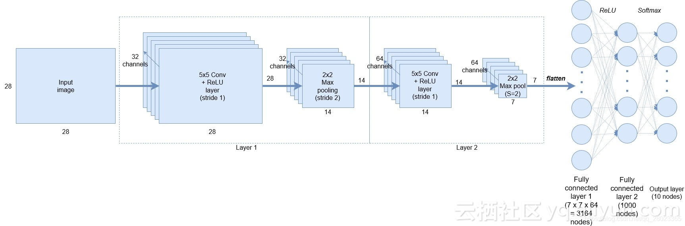

--

以“基于keras实现”为关键词进行搜索，看看有哪些应用。

# Keras构建CNN讲解及代码

keras能够极其简单的构造出CNN网络

使用TensorFlow创建卷积神经网络（CNN）来对MNIST手写数字数据集进行分类的方法很经典。

TensorFlow是一款精湛的工具，具有强大的功能和灵活性。

然而，对于快速原型制作工作，可能显得有些麻烦。

**Keras**是一个运行在TensorFlow或者Theano的更高级别的库，旨在**流线化构建深度学习网络的过程**。

事实上，在TensorFlow教程中 ，TensorFlow大约需要42行完成的内容，在Keras中只需11行就可以完成类似的功能。接下来我将向你展示如何通过Keras做到这一点。

该Keras教程将向你展示如何使用MNIST数据集构建CNN并实现> 99％的准确性。

它与我之前的卷积神经网络教程中构建的结构完全相同 ，

下图显示了网络的架构：



```
model = Sequential()
model.add(Conv2D(32, kernel_size=(5, 5), strides=(1, 1),
                 activation='relu',
                 input_shape=input_shape))
model.add(MaxPooling2D(pool_size=(2, 2), strides=(2, 2)))
model.add(Conv2D(64, (5, 5), activation='relu'))
model.add(MaxPooling2D(pool_size=(2, 2)))
model.add(Flatten())
model.add(Dense(1000, activation='relu'))
model.add(Dense(num_classes, activation='softmax'))
```

还要注意，我们**不必声明任何权重或偏差变量，Keras会帮助我们进行完成。**

现在我们已经在Keras中构建了卷积层，我们希望将这些输出平坦化，以完全进入我们的连接层。

在TensorFlow中，我们为了平坦化必须弄清楚卷积层的输出张量的大小，还要明确我们的权重和偏差变量的大小。

接下来的两行声明了我们的完全连接层，使用Keras中的Dense（）层。

首先我们指定大小，根据我们的架构，我们指定了1000个节点，每个节点都是由ReLU功能激活。

第二个是我们softmax分类或输出层，这是我们类数量的大小。

就这样 - 我们已经成功地开发了CNN的架构，只有8行代码。现在让我们来训练模型并执行预测。


参考资料

https://blog.csdn.net/qq_28023365/article/details/86212075


# 用 Keras 实现图书推荐系统

是kaggle上的一个数据集来做。


参考资料

https://www.jianshu.com/p/5638b56022d0

https://towardsdatascience.com/building-a-book-recommendation-system-using-keras-1fba34180699

这里有不少的基于keras实现的东西。

https://www.imooc.com/article/315507


# 使用Keras实现简单线性回归模型操作


https://www.jb51.net/article/188599.htm


# 使用keras实现Precise, Recall, F1-socre方式

http://www.zzvips.com/article/75778.html


# keras实现多种分类网络的实现

https://blog.csdn.net/hjxu2016/article/details/83504756


# 如何使用 Keras 实现无监督聚类 

由于深度学习算法在**表达非线性表征**上的卓越能力，

它非常适合完成输入到有标签的数据集输出的映射。

这种任务叫做分类。

它需要有人对数据进行标注。

无论是对 X 光图像还是对新闻报道的主题进行标注，在数据集增大的时候，依靠人类进行干预的做法都是费时费力的。

聚类分析，或者称作聚类是一种无监督的机器学习技术。

它不需要有标签的数据集。

它可以根据数据成员的相似性对它们进行分组。

**聚类的应用**

- 推荐系统，通过学习用户的购买历史，聚类模型可以根据相似性对用户进行区分。它可以帮助你找到志趣相投的用户，以及相关商品。
- 在生物学上，序列聚类算法试图将相关的生物序列进行分组。它根据氨基酸含量对蛋白进行聚类。
- 图像和视频聚类分析根据相似性对它们进行分组。
- 在医疗数据库中，对每个病人来说，真正有价值的测试（比如葡萄糖，胆固醇）都是不同的。首先对病人进行聚类分析可以帮助我们对真正有价值的特征进行分类，从而减少特征分散。它可以增加分类任务的准确性，比如在癌症病人生存预测上。
- 在一般用途上，它可以生成一个数据的汇总信息用于分类，模式发现，假设生成，以及测试。

**如何才是好的聚类**

一个好的聚类方法应该生成高质量的分类，它有如下特点：

1. 群组内部的高相似性：群组内的紧密聚合
2. 群组之间的低相似性：群组之间各不相同

# 实现多输入多输出的模型

keras提供了Sequential线性的模型，但是有些网络需要多个输入，有些网络有多个输出，更甚之层与层之间有内部分支，这使得网络看起来像是层构成的图，而不是线性的堆叠。有些场景需要多模态的输入，这些的输入来源于不同的数据，例如下面的例子
　　
　　而有些场景是多个输出，例如给定一部小说，希望将其自动分类（比如爱情、惊悚），同时还希望预测其写作的日期。当然可以训练两个独立的模型，但由于这些属性并非是统计无关的，你可以构造一个更好的模型，进行联合训练输出想要的结果。
　　
　　那么如何该用keras实现这类模型呢？
　　
　　函数式API可是用于构建具有多个输入输出的模型，通常情况下，这种模型会在某一时刻用一个可以组合多个张量层将不同的输入分支合并、相加和连接等。

https://blog.csdn.net/li123128/article/details/89713059


# Keras实现英文到中文机器翻译 seq2seq+LSTM

代码

https://github.com/guodalongplus/Machine-Learning/

参考资料

https://blog.csdn.net/qq_44635691/article/details/106919244


# Keras实现ResNet


https://www.bilibili.com/read/cv2812612/


# 使用Keras构建CNN网络识别森林卫星图

https://segmentfault.com/a/1190000017237819

# 用Keras实现RNN+LSTM的模型自动编写古诗