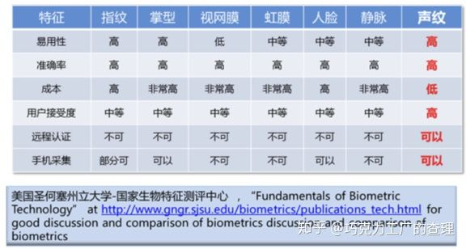
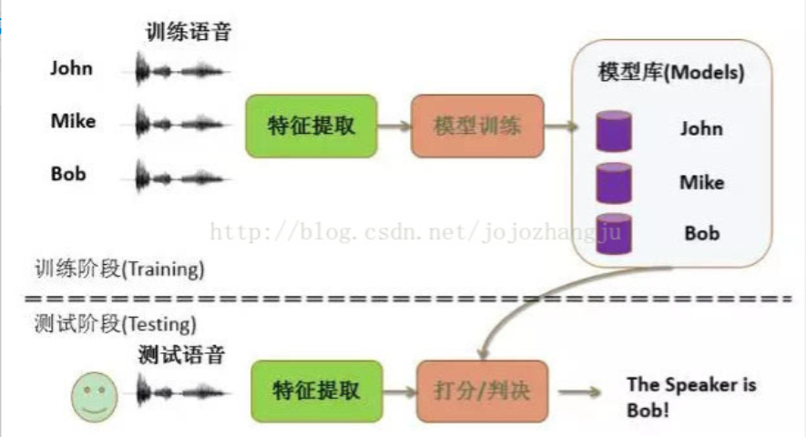

--

声纹，voiceprint。

声纹识别(Voiceprint Recognition, VPR)是通过分析每个说话人声纹特征之间的差异来达到对未知语音进行识别的目的，因此声纹识别又称为说话人识别。

携带信息的声波频谱。

声纹特点：

1、特定性。

2、稳定性。成年后，人的声音可以长期保持稳定不变。

因此，声纹跟指纹一样，是读特的生物学特征，可用于身份识别。

声纹识别在产品上的本质主要就是以下两种工作方式： 1比1 和 1比N

最早的声纹识别，是靠人肉眼来分析声谱图。

传统的声纹识别，主要是基于统计思想和概率论，综合声学、信号学、机器学习等算法。

在深度学习用于声纹识别之前，GMM-UBM是声纹识别广泛应用的技术之一，

深度学习技术既可以作为一个深度声学特征提取器，同时也可以作为分类器

声纹之所以能被识别，是因为每个人的口腔、鼻腔与声道结构都存在唯一的差异性，

但这种差异性既看不到又摸不着，

更要命的是，它是一个时刻都在运动着的器官构造。

我们只能通过录音设备采集到的离散语音信号，间接去分析发声器官的差异性。

既然语音一直在变，那我们该如何去对语音进行分析呢？

答案是：语音具备了一个良好的性质，称为短时平稳，

在一个20-50毫秒的范围内，语音近似可以看作是良好的周期信号。

这种良好的平稳性为我们针对语音进行信号处理层面的分析提供了极大的便利。

读者都应该还记得，在音调，响度和音色这三个声音（注意，这里我用了声音，而不是语音）的基本属性中，

音色是最能反映一个人身份信息的属性（讲道理，老婆对你吼的时候，响度和音调都可以极速飙升，但老婆的音色是不大会发生剧烈变化的）。

而音色上的差异在信号处理的层面可以表示为在频域不同频段能量的差异，

因此我们通过抽取不同频段上的能量值，即可以表示在这个短时语音范围内频谱的性质。

通常我们会综合考虑人耳的听觉属性（人耳的一个听觉属性是在可听到的频段内，对于低频的变化更加敏感，而对于高频相对弱一些）、均衡不同频段的能量差异（对于一段8KHz采样的音频，尽管语音会分布于0-4KHz的范围内，但能量更多的集中在相对比较低频的区域）、噪声鲁棒性（我们希望特征只对语音的变化敏感，而对其他噪声等无关信息不变）以及后续的计算便利（系数之间尽可能要去除相关性）设计合适的短时声学特征，通过一系列复杂的信号处理层面的变换，

一段20-50毫秒长度的语音（以8KHz采样为例，这个长度的语音对应着160-400个采样点）可以映射为一段39-60维的向量。

为了充分保留语音中的原始信息，同时不增加计算的负担，通常会以15-20毫秒为间隔依次取短时段语音，然后提取特征。

综上，一段语音就被映射为时间轴上一系列的向量集合，

这些集合再通过一些规整的操作后，即可成为反映语音特性的特征集合。

但仅靠这些特征集合还难以实现声纹识别的目标，

**声学特征可以理解为时间轴上为声道拍摄的一系列快照**，

它直接映射的仍然是语意的内容，如何从一堆变化的特征中提取出不变的身份特性呢？

接下来，就是统计建模发挥威力的时候了。

声纹识别系统是一个典型的**模式识别**的框架，

为了让计算机认识一个用户的身份，

需要目标用户首先提供一段训练语音，

这段语音经过特征提取和模型训练等一系列操作，

会被映射为用户的声纹模型。

在验证阶段，一个身份未知的语音也会经过一系列的操作被映射为测试特征，

测试特征会与目标模型进行某种相似度的计算后得到一个置信度的得分，

这个得分通常会与我们人工设定的期望值进行比较，

高于这个期望值，我们认为测试语音对应的身份与目标用户身份匹配，通过验证；

反之则拒绝掉测试身份。

因此，识别性能好坏的关键在于对语音中身份信息的建模能力与区分能力，

同时对于身份无关的其余信息具有充分的抗干扰能力和鲁棒性。

尽管每个人的语音看起来千变万化，但也不是完全没有规律可循。

尽管我们每天会说很多话，但常用的字词至多只有数千个左右的级别；

另外我们也做不到和家里的旺财发出一模一样的叫声。

这也引出了声纹识别，同时也是传统的语音识别框架下的一个很合理的假设：

将语音拆分到音素（phone）的级别，**狭义的现代汉语只需要32个音素就已经足够用了。**

如果考虑到每个音素的形态还会受到前后音素的影响，构建三音素模型（tri-phone）的话，那至多也只有几千个备选的三音素集合（不是简单的32的三次方，我们也会去掉一些稀有的和根本不会出现的搭配），

而不同说话人的三音素样本尽管有明显的差异，

但都能在空间中的某个区域内聚类。

由语音和对应的声学特征的这些性质启发，

1995年DA Reynolds首次将混合高斯模型（Gaussian Mixture Model，GMM）成功地应用于文本无关的声纹识别任务，

至此之后的20多年，奠定了GMM在声纹识别中地基的地位，

后续声纹的发展演进都是以GMM作为基础进行改进和拓展的。

在继续深入了解建模之前，我们有必要明确声纹识别，或者把范围再缩小一些，明确文本无关声纹识别任务，它的难点在哪里？

在前文也提到过，声纹识别是一个兼具理论研究价值与工程应用背景的领域，声纹的难点主要在以下几个方面：

如何在语音多变性的背后，挖掘不变的身份信息。

实际应用中，从用户体验和成本的角度上考虑，针对目标用户可采集到的语料是极其有限的（按照学术上的定义，实际可用的语音是稀疏（sparse）的），如何在有限的数据中完成稳定的建模与识别。

对于同一个用户，即便采集到的两段语音内容都是相同的，

但由于情绪、语速、疲劳程度等原因，语音都会有一些差异性。

如何补偿这种说话人自身语音的差异性。

声音是通过录音设备进行采集的，

不同的型号的录音设备对语音都会造成一定程度上的畸变，

同时由于背景环境和传输信道等的差异，

对语音信息也会造成不同程度的损伤，

一般在研究中将这些外界影响语音的效应称为信道易变性（Channel Variability）。

我们难以做到针对每一种信道效应都开发对应专属的声纹识别系统，

那么如何补偿这种由于信道易变性带来的干扰。

明确了需要解决的问题之后，再回过来看GMM，它的优势在哪里？

首先GMM是什么，它是一大堆形状不定的高斯分量的加权组合。

有研究表明，当GMM中高斯分量的数量足够多的时候，GMM可以模拟任意的概率分布。

参考资料

1、声纹识别发展综述

https://zhuanlan.zhihu.com/p/67563275

2、

https://m.hanspub.org/journal/paper/33778

3、

这篇非常详细。

https://cloud.tencent.com/developer/article/1451427