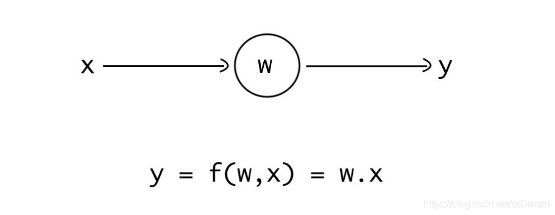

--

此篇博客不会涉及到复杂的数学和算法。

相反，我将建立您对神经网络如何工作初步的认识，

并通过创建最小的神经网络并进行训练以完成一个简单的任务来做到这一点。


**神经网络是权重的集合。**

我们可以在一组输入和输出（目标或标签）上训练神经网络。

神经网络内部的**权重与输入**交互并**产生输出**。

在训练网络时，**权重会更新**，以使其尝试将输出与目标值进行匹配。

简而言之，**神经网络学习输入和输出之间的映射**。

现在，让我们看看所有这些是什么意思。


以下是**只有一个权重（w）**的最小神经网络。我们给它输入一个输入（x），再乘以权重，结果就是网络的输出。



由于此神经网络非常小，

我们将在一个非常简单的任务上对其进行训练。

我们的任务是向其提供任何数字，网络应更改该数字的符号（即求相反数）。

例如，如果我们输入3，则网络应输出-3。

在keras里实现这个神经网络是这样：

```
import keras
from keras.layers import Dense
model = keras.models.Sequential()
model.add(Dense(units=1, use_bias=False, input_shape=(1,)))
model.compile(loss='mse', optimizer='adam')
```

用numpy创建一些数据，给模型进行学习。

```
import numpy as np
data_input = np.random.normal(size=1000)
data_label = -(data_input)
```

进行训练并预测：

```
print('模型随机分配权重是：{}'.format(model.layers[0].get_weights()))
model.fit(data_input, data_label, epochs=1, batch_size=1, verbose=1)
print('模型预测：{}'.format(model.predict(np.array([2.5]))))
print('训练完成后权重分配为：{}'.format(model.layers[0].get_weights()))
```

输出是：

```
模型随机分配权重是：[array([[-1.]], dtype=float32)]
1000/1000 [==============================] - 1s 931us/step - loss: 0.0000e+00
模型预测：[[-2.5]]
训练完成后权重分配为：[array([[-1.]], dtype=float32)]
```


我把代码保存在这里。

https://github.com/teddyxiong53/tensorflow_test/blob/main/min_nn.ipynb

参考资料

1、

https://blog.csdn.net/orDream/article/details/106343076