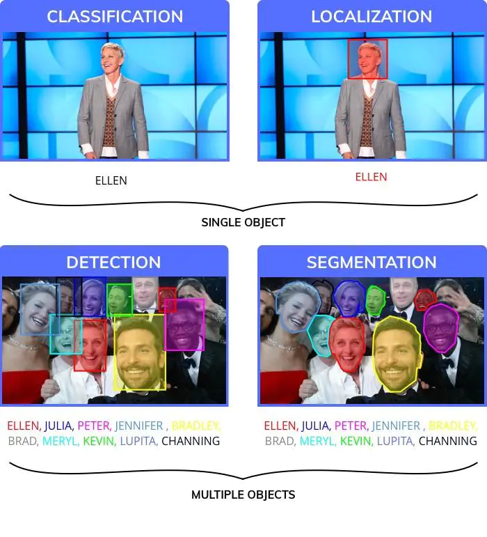

--

为了模仿人类水平的表现，科学家将视觉感知任务分解为四个不同的类别。

1.**分类**，为图像指定一个标签。

2.**定位**，对特定的标签指定一个边框。

3.**物体检测**，在图像中绘制多个边框。

4.**图像分割**，得到物体在图像中的精确位置区域。

物体检测对于很多应用已经足够好（图像分割是更精确的结果，它受到了创建训练数据复杂性的影响。相比于画边框它通常花费人类标注者12倍的时间去分割图像。）此外，在检测物体之后，可以将物体在边框中单独分割出来。

有多种用于物体检测的模型或结构。

每一个都在速度、尺寸和精确度之间权衡。

我们选择了最流行的一个：YOLO（You only look once），

并且展示它如何以20行代码进行工作。

为了减少训练所需的数据量，你需要一个预训练好的模型。

如果没有它，你可能多需要10万张图像来训练模型。

**NanoNets怎样使过程更简单？**

**1. 不需要注释**

我们已经删除了注释图像的需要，我们有专业的注释员可以为你注释图像。

**2. 自动进行最优模型和超参数的选择**

我们为你自动的训练最好的模型，通过运行一连串具有不同参数的模型然后为你的数据挑选最好的那个。

**3. 不需要昂贵的硬件和GPUs**

NanoNets完全在云端运行，不需要占用你的任何硬件。这样就会更容易去使用。

**4. 对于像树莓派这样的移动设备非常棒**

因为像树莓派和手机这样的设备不适用于运行复杂的计算任务，所以可以将你的工作负载外包给我们的云，然后为你完成所有的计算。

现在建立人工智能应用最大的挑战在于几个方面：

- 数据采集与标注需要花大量的时间和人力；
- 模型的训练时间很长，算力成本也高；
- 模型泛化能力很弱，换一个场景就需要更换模型；
- 基础算法艰涩难懂，科研和学校仍是主力军；
- 很多领域还没有成熟的商业化解决方案。

语音命令

https://github.com/tensorflow/tensorflow/tree/master/tensorflow/examples/speech_commands

参考资料

1、怎样在树莓派上轻松实现深度学习目标检测？

https://www.jianshu.com/p/986cf2c90281

2、使用 TensorFlow Lite 在树莓派上构建笑脸检测和语音识别应用

https://zhuanlan.zhihu.com/p/335198197

3、用树莓派4b构建深度学习应用（十三）人脸修复篇

https://segmentfault.com/a/1190000038143831

4、

https://www.rs-online.com/designspark/raspberry-pi-hand-detector-switch-cn

5、可在树莓派实时运行的人脸检测

https://oldpan.me/ai-funny-news/face-detect-run-on-raspberry