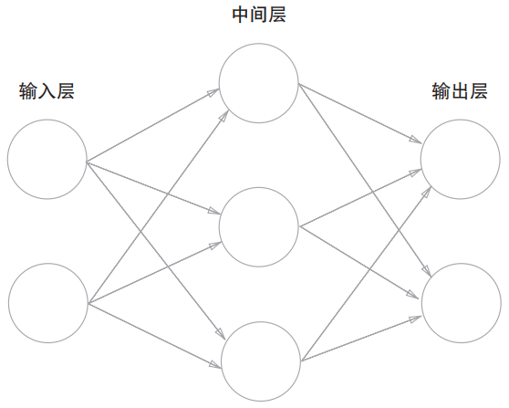
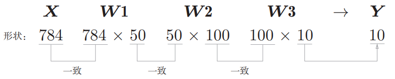

--

神经网络大体上和上述详解的感知器差不多，

只不过激活函数有所不同，

上述感知器用到的激活函数是**阶跃函数**，

而在神经网络中使用到的激活函数则需要根据实际问题来进行不同的定义。

此外，在神经网络中还做了一些其他的拓展，以发挥更加强大的功能。

本文主要介绍的内容是神经网络的基本结构、设计和实现，让读者从整体上对其有一个比较全面的认识，主要分为以下几个部分来讲解：

- 从感知器顺利过渡到神经网络
- 激活函数的闪亮登场
- 神经网络的设计与基本实现（正向传播）
- 基于手写数字数据集实现正向传播过程

我们可以用下图表示一个简单的神经网络：

我们把最左边的一层称为**输入层**，主要是用于我们数据的输入，

最右边的一层称之为**输出层**，用于神经网络的结果输出，

而除了输入层和输出层，中间的所有层我们都称之为**中间层，也叫作隐藏层**。

注意：中间层/隐藏层有的时候可能因为实际而有多层结构，只不过在上图中只有一层。

上图神经网络中总共有三层神经元，

而实际上只有两组**权重参数**进行处理，

分别是输入层 -> 中间层、中间层 -> 输出层各有一组权重参数处理。

这就好比我们想要乘坐火车从上海前往深圳，有个南昌中转站，所以途径路线为：

上海->南昌->深圳

虽然说我们的地点有3个，但实际上火车的行驶过程只有两个，上面的神经网络的结构层数可同理理解。

使用线性函数作为激活函数的话，多层神经网络的定义也就没有意义了。

在神经网络的发展过程中，早期使用最多的激活函数就是Sigmoid了，而在ReLU激活函数出现之后，ReLU更受需求者的青睐，下面我们来看看ReLU。

我们可以发现，对于ReLU激活函数来讲，其同样也是一个分段函数。并且相较于Sigmoid来讲，ReLU有两个比较明显的优势：

- 因为ReLU的表达式比较简单，所以相较于Sigmoid来讲在某种程度上效率更高
- ReLU激活函数在一定程度上能解决梯度消失的问题，而Sigmoid激活函数在实际进行反向传播的时候，很容易出现梯度消失的问题，从而导致参数几乎不再更新，所以Sigmoid不适合实现深层次神经网络的训练

前面我们也有提到，在神经网络中，为了提高模型的表达能力，我们在进行一次隐藏层的计算之后，往往会通过激活函数对计算结果进行处理。

整体过程是挺简单的，最重要的还是要弄清楚输入、输出以及w权重参数和b偏执参数的shape值，

这一点还是挺重要的。

权重参数w的shape主要取决于输入和输出，

因为它们进行的是笛卡尔积形式的运算，是彼此紧密连接的，

假如输入是m，输出是n，则w的shape值为(m,n)，

这一点可以通过矩阵的运算去理解**（不要去死记硬背，最重要的是能够理解）**。

另外b权值参数个数则主要取决于输出，

因为每一个输出都对应一个偏执，所以偏执个数与输出保持一致**（重在理解）**

**一般地，对于回归问题，我们可以借用恒等函数，二元分类问题可以使用Sigmoid函数，而多元分类问题则可以采用softmax函数进行处理。**

参考资料

1、

https://www.zybuluo.com/tianxingjian/note/1286468