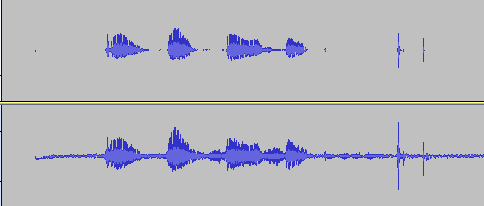

--

# AliDenoise 

传统降噪算法面临的挑战如下：

1. 非平稳**突发性噪声**抑制能力差，比如户外直播场景中突然出现的汽车鸣笛声，传统降噪算法就难以消除干净
2. 传统算法增强后会有很多**残留噪声**，这些噪声会导致主观听感差，甚至影响语音信息传达的可懂度；
3. 目前传统算法中**求得解析解的过程中存在很多假设**，难以适应复杂多变的实际场景，特别是瞬态噪声；
4. 在**低信噪比情况下**，传统方法的降噪效果几乎是失效的，其中 VAD 模块误判的可能性大大增加，尤其在**噪声的能量大于语音的能量**时，几乎无法将语音谱恢复出来，而这对天然能量就比较低的辅音结构来说是毁灭性的


针对传统算法存在的弊端，业界在 2014 年开始探索数据驱动类算法，也就是深度学习相关的算法，比较典型的是 RNN Noise 和 CRNN 方法。


RNN Noise 是一种基于传统算法改进的混合方法。

整个算法为了**保证实时性**，**训练特征主要以传统信号的特征为主**，

（涉及 bark 域的能量和 pitch 域的相关能量系数、pitch_index 的值、带噪语音 bark 域的能量和带噪语音 bark 域倒谱相关的信息），一共 42 个，

**并没有采用深度学习算法中主流的自动提取特征机制，**

网络结构以 GRU 为主，同时有一个副产物 VAD 保证有效收敛，

最终的输出为 bark 域的 22 个增益，经过插值平滑处理后与带噪信号的频域信号相乘，反变换后得到降噪后的时域语音信号。


这个算法的核心优势是可实时，性能消耗低，降噪能力也有所增强，**但语音损伤比较严重**，经过分析，认为原因主要有三个：

1. 数据集问题，rnnoise 的训练数据集中噪声质量是不高的，噪声中含有较多人声部分，这在一定程度上会导致语音损伤大的问题
2. vad label 制作的不准确性，简单的采用一些能量判断法当做 vad 模块的 groundtruth，也会影响最终效果
3. feature 只有 42 个，网络输出只有 22 个，这样的设计在降低运算量的同时会损失部分详细信息，是会影响最终的效果；


CRNN 方法一个典型的 end2end 的解决方案，

输入是 noisy 的频域幅度谱，

输出直接是降噪后的频域幅度谱，

然后结合 noisy 的相位谱，进行时域数据的合成。

网络模型采用了 encoder+lstm+decoder 的架构，

无论是语音分离还是增强，这都是比较主流的一种网络结构，

同时为了做到原理上可实时，卷积全部使用了因果卷积，

CRNN 在整段增强时效果是非常好的，增强后的主观听感也很好。


但存在的问题也比较大的问题：

1. 整段处理的输入无法满足流式处理的要求，在模型分帧后效果下降比较明显；
2. 即使采用 cache buffer 的策略保证分帧后的效果，由于模型的感受野较大，性能开销也无法达到移动端实时的要求，同时，模型整段增强时本身消耗就比较大
3. 中间存在 lstm 层，模型的轻量化比较困难；


AliDenoise 是综合 RNNNoise 和 CRNN 的一种自研算法

# rnnoise

虽然AliDeNoise吹得那么厉害，但是没有代码。

所以还是看看rnnoise的。

下载到本地，编译出example。运行。出错了。

```
 ./examples/rnnoise_demo  1.wav 2.wav
Segmentation fault (core dumped)
```

看了一下代码，文件应该是用raw数据的。但是什么的音频格式呢？采样率这些参数是多少呢？

没有提。

这里是在线demo的。

https://jmvalin.ca/demo/rnnoise/

这个老兄是音频方面的专家。opus等编码的发明者。还是speex的项目负责人。

值得看看他的研究成果。


使用的音频数据是16bit的单声道pcm文件，采样率48K。

我自己录制朗读”1234“的音频，然后用ffmpeg转成对应的格式。进行测试。

```
ffmpeg -i 1.m4a -f s16le -ar 48000 -acodec pcm_s16le output.raw
```


上面的是过滤后的，下面的是过滤前的。可以看到的确有降噪的效果。




看看代码api是怎么用的。

头文件就一个。rnnoise.h

```
typedef struct DenoiseState DenoiseState;
typedef struct RNNModel RNNModel;
```

核心接口

```
float rnnoise_process_frame(DenoiseState *st, float *out, const float *in);
```

example是这么写的

```
DenoiseState *st;
st = rnnoise_create(NULL);
打开音频文件，一次读取480字节。相当于10ms的数据。
in和out都是同一个指针。这样是可以的。
rnnoise_process_frame(st, x, x);

rnnoise_destroy(st);
```

就这么3个函数就可以了。


它的降噪原理是什么？

 作者提出了一种用于噪声抑制的快速算法，在降噪时需要精细调整的部分使用深度学习方法，而其他部分使用传统的DSP方法。

使用的窗长为20ms，窗之间的overlap为10ms


# 参考资料

1、打破传统降噪算法，AliDenoise 的背后技术

https://zhuanlan.zhihu.com/p/234429493

2、RNNoise超详细解读

https://zhuanlan.zhihu.com/p/397288851