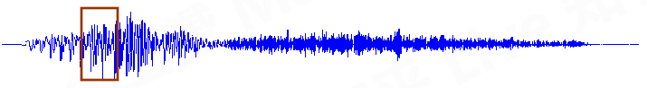
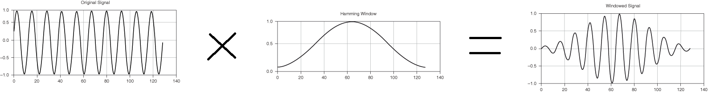
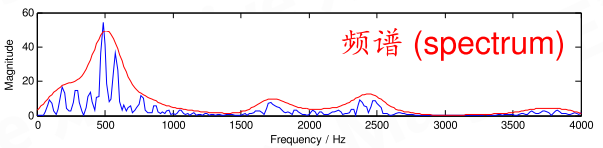

--

当前最新版本是0.8.1 。

librosa的模块组成

```
beat：检测节拍相关
core
	核心功能，包括：
	从磁盘读取文件
	计算各种特征值
	这些内容都直接在librosa.xx这样来用就可以了。
decompose
	基于scikit-learn来分解。
display
	基于matplotlib来进行图形化。
effects
	基于时域的音频处理。
	
feature
	特征计算
	梅尔倒谱那些也是在这里。
filters
	过滤器。
onset
segment
sequence
util
```

```
filename = librosa.example('nutcracker')
# 这个是下载胡桃夹子这个音乐的。
y, sr = librosa.load(filename)
```

example下载的音乐文件是从这里下载过去的。

https://github.com/librosa/data

有一个json文件，对应名字和歌曲文件全名。

官网：https://librosa.org/

| Key        | Full name                                   | Description                                                  |
| ---------- | ------------------------------------------- | ------------------------------------------------------------ |
| brahms     | Brahms - Hungarian Dance #5                 | A short performance of this piece, with soft note onsets and variable tempo. |
| choice     | Admiral Bob - Choice                        | A short drum and bass loop, good for demonstrating decomposition methods. |
| fishin     | Karissa Hobbs - Let’s Go Fishin’            | A folk/pop song with verse/chorus/verse structure and vocals. |
| nutcracker | Tchaikovsky - Dance of the Sugar Plum Fairy | Orchestral piece included to demonstrate tempo and harmony features. |
| trumpet    | Mihai Sorohan - Trumpet loop                | Monophonic trumpet recording, good for demonstrating pitch features. |
| vibeace    | Kevin Macleod - Vibe Ace                    | A vibraphone, piano, and bass combo. Previously the only included **example**. |


先总结一下本文中常用的专业名词：

sr：采样率、

hop_length：帧移、

overlapping：连续帧之间的重叠部分、

n_fft：窗口大小、

spectrum：频谱、

spectrogram：频谱图或叫做语谱图、

amplitude：振幅、

mono：单声道、

stereo：立体声

语音分帧是怎么回事？


语音信号处理常常要达到的一个目标，

就是弄清楚语音中**各个频率成分的分布**。

做这件事情的数学工具是**傅里叶变换**。

傅里叶变换要求输入信号是**平稳**的，

当然不平稳的信号你想硬做也可以，但得到的结果就没有什么意义了。

而语音在宏观上来看是不平稳的——你的嘴巴一动，信号的特征就变了。

但是从微观上来看，在比较短的时间内，嘴巴动得是没有那么快的，语音信号就可以看成平稳的，就可以截取出来做傅里叶变换了。

**这就是为什么语音信号要分帧处理，截取出来的一小段信号就叫一「帧」。**

如下图：这段语音的前三分之一和后三分之二明显不一样，所以整体来看语音信号不平稳。红框框出来的部分是一帧，在这一帧内部的信号可以看成平稳的。



那么一帧有多长呢？帧长要满足两个条件：

- 从宏观上看，它必须足够短来保证帧内信号是平稳的。前面说过，口型的变化是导致信号不平稳的原因，所以在一帧的期间内口型不能有明显变化，**即一帧的长度应当小于一个音素的长度。正常语速下，音素的持续时间大约是 50~200 毫秒，所以帧长一般取为小于 50 毫秒。**
- 从微观上来看，它又必须包括足够多的振动周期，因为傅里叶变换是要分析频率的，只有重复足够多次才能分析频率。**语音的基频，男声在 100 赫兹左右，女声在 200 赫兹左右，换算成周期就是 10 毫秒和 5 毫秒。既然一帧要包含多个周期，所以一般取至少 20 毫秒。**

这样，我们就知道了帧长一般取为 20 ~ 50 毫秒，20、25、30、40、50 都是比较常用的数值，甚至还有人用 32（在程序猿眼里，这是一个比较「整」的数字）。

取出来的一帧信号，在做傅里叶变换之前，要先进行「**加窗**」的操作，即与一个「窗函数」相乘，如下图所示：



加窗的目的是让一帧信号的幅度在两端**渐变**到 0。

**渐变对傅里叶变换有好处，**

可以让频谱上的各个峰更细，不容易糊在一起（术语叫做**减轻频谱泄漏**），具体的数学就不讲了。

加窗的代价是一帧信号两端的部分被削弱了，没有像中央的部分那样得到重视。

**弥补的办法是，帧不要背靠背地截取，而是相互重叠一部分。**

相邻两帧的起始位置的时间差叫做**帧移**，常见的取法是取为**帧长的一半**，或者固定取为 **10 毫秒**。

对一帧信号做傅里叶变换，得到的结果叫**频谱**，它就是下图中的蓝线：




图中的横轴是频率，纵轴是幅度。

频谱上就能看出这帧语音在 480 和 580 赫兹附近的能量比较强。

语音的频谱，常常呈现出「精细结构」和「包络」两种模式。

「精细结构」就是蓝线上的一个个小峰，它们在横轴上的间距就是**基频**，它体现了语音的**音高**——峰越稀疏，基频越高，音高也越高。

「包络」则是连接这些小峰峰顶的平滑曲线（红线），它代表了口型，即发的是哪个音。

包络上的峰叫**共振峰**，图中能看出四个，分别在 500、1700、2450、3800 赫兹附近。

有经验的人，根据共振峰的位置，就能看出发的是什么音。

对每一帧信号都做这样的傅里叶变换，就可以知道音高和口型随时间的变化情况，也就能识别出一句话说的是什么了。


参考资料

https://blog.csdn.net/zzc15806/article/details/79603994/

librosa语音信号处理

https://blog.csdn.net/qq_34218078/article/details/101255636

https://www.cnblogs.com/LXP-Never/p/11561355.html

语音信号处理中怎么理解分帧？

https://www.zhihu.com/question/52093104