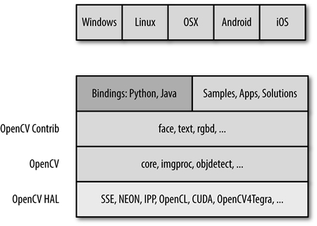

--

它轻量级而且高效——由一系列 C 函数和少量 C++ 类构成

OpenCV 拥有包括 500 多个C函数的跨平台的中、高层 API。

2017年8月3日，发布OpenCV 3.3版（最重要的更新是把DNN模块从contrib里面提到主仓库）

OpenCV用C++语言编写，它的主要接口也是C++语言，但是依然保留了大量的C语言接口。

[OpenCV](http://c.biancheng.net/opencv/) 缘起于英特尔想要增强 CPU 集群性能的研究。该项目的结果是英特尔启动了许多项目，包括实时光线追踪算法以及三维墙体的显示。

OpenCV 怀着为计算机视觉提供通用性接口这一思想开始了策划。在英特尔性能实验室（Performance Library）团队的帮助下，OpenCV 最初的核心代码和算法规范是英特尔俄罗斯实验室团队完成的，这就是 OpenCV 的缘起，从英特尔软件性能组的实验研究开始，俄罗斯的专家负责实现和优化。

> Shinn Horng Lee (李信弘）是主要推动者，时任 IPP（集成性能基元）首席架构师。

俄罗斯专家团队的负责人是 Vadim Pisarevsky（瓦迪姆·彼萨里夫斯基），他负责规划、编程以及大部分 OpenCV 的优化工作，并且到现在他仍是很多 OpenCV 项目的核心人物。

与他一同工作的 Victor Eruhimov（维克托·伊拉西莫夫）帮助构建了早期框架，Valery Kuriakin（瓦勒利·库里阿基恩）负责管理俄罗斯实验室并且为项目提供了非常大的助力。

由很多模块组成的，这些模块可以分成很多层：

- 最底层是基于硬件加速层（HAL）的各种硬件优化。
- 再上一层是 opencv_contrib 模块所包含的 OpenCV 由其他开发人员所贡献的代码，其包含大多数高层级的函数功能。这就是OpenCV的核心。
- 接下来是语言绑定和示例应用程序。
- 处于最上层的是 OpenCV 和操作系统的交互。

| 模块       | 说明                                                         |
| ---------- | ------------------------------------------------------------ |
| Core       | 该模块包含 OpenCV 库的基础结构以及基本操作。                 |
| Improc     | 图像处理模块包含基本的图像转换，包括滤波以及类似的卷积操作。 |
| Highgui    | 在 OpenCV 3.0中，分割为 imcodecs、videoio 以及 highgui 三部分。  这个模块包含可以用来显示图像或者简单的输入的用户交互函数。这可以看作是一个非常轻量级的 Windows UI 工具包。 |
| Video      | 该模块包含读取和写视频流的函数。                             |
| Calib3d    | 这个模块包括校准单个、双目以及多个相机的算法实现。           |
| Feature2d  | 这个模块包含用于检测、描述以及匹配特征点的算法。             |
| Objdectect | 这个模块包含检测特定目标，比如人脸或者行人的算法。也可以训练检测器并用来检测其他物体。 |
| Ml         | 机器学习模块本身是一个非常完备的模块，包含大量的机器学习算法实现并且这些算法都能和 OpenCV 的数据类型自然交互。 |
| Flann      | Flann 的意思是“快速最邻近库”。这个库包含一些你也许不会直接使用的方法，但是其他模块中的函数会调用它在数据集中进行最邻近搜索。 |
| GPU        | 在 OpenCV 中被分割为多个 cuda* 模块。  GPU 模块主要是函数在 CUDA GPU 上的优化实现，此外，还有一些仅用于 GPU 的功 能。其中一些函数能够返回很好的结果，但是需要足够好的计算资源，如果硬件没有GPU，则不会有什么提升。 |
| Photo      | 这是一个相当新的模块，包含计算摄影学的一些函数工具。         |
| Stitching  | 本模块是一个精巧的图像拼接流程实现。这是库中的新功能，但是，就像 Photo 模块一样，这个领域未来预计有很大的增长。 |
| Nonfree    | 在 OpenCV 3.0 中，被移到 opencv_contrib/xfeatures2d。  OpenCV 包含一些受到专利保护的或者受到使用限制的（比如 SIFT 算法）算法。这些算法被隔离到它们自己的模块中，以表明你需要做一些特殊的工作，才可以在商业产品中使用它们。 |
| Contrib    | 在 OpenCV 3.0 中，融合进了 opencv_contrib。  这个模块包含一些新的、还没有被集成进 OpenCV 库的东西。 |
| Legacy     | 在 OpenCV 3.0 中，被取消。  这个模块包含一些老的尚未被完全取消的东西。 |
| ocl        | 在OpenCV 3.0 中，被取消，取而代之的是 T-API。  这是一个较新的模块，可以认为它和 GPU 模块相似，它实现了开放并行编程的 Khronos OpenCL 标准。虽然现在模块的特性比 GPU 模块少很多，但 ocl 模块的目标是提供可以运行在任何 GPU 或者是其他可以搭载 Khronos 的并行设备。这与 GPU 模 块形成了鲜明的对比，后者使用 Nividia CUDA 工具包进行开发，因此只能在 Nividia GPU 设备上工作。 |

参考资料

1、

http://c.biancheng.net/view/1101.html