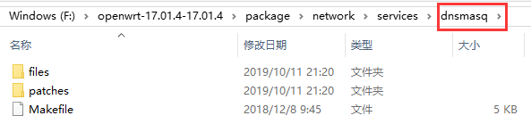

--

自己编译烧录树莓派3b的。

这个用tar来解压会报错。只有11M左右。

```
bin/targets/brcm2708/bcm2710/openwrt-brcm2708-bcm2710-rpi-3-ext4-factory.img.gz
```

不用解压，直接用rufus进行烧录到sd卡就好了。

默认打开了串口。所以不用调整任何参数。

默认有hdmi输出和支持usb的键盘。所以如果有键盘，可以不用串口。


# 简介

好的，我们先从 OpenWrt 的基本情况开始了解。以下是一个简明的 OpenWrt 介绍和与 Buildroot 的比较。

**OpenWrt 简介**

| 特性       | 说明                                             |
| ---------- | ------------------------------------------------ |
| 目的       | 为嵌入式设备（主要是路由器）提供高度可定制的固件 |
| 基于       | Linux 内核                                       |
| 包管理     | 使用 opkg 作为包管理系统                         |
| 开发模式   | 开源社区驱动                                     |
| 配置方式   | 可通过命令行、Web 界面（LuCI）进行配置           |
| 自定义能力 | 支持广泛的包库，可以轻松添加或移除功能           |

**与 Buildroot 的比较**

| 特性         | Buildroot                                   | OpenWrt                                            |
| ------------ | ------------------------------------------- | -------------------------------------------------- |
| 主要用途     | 生成嵌入式 Linux 系统镜像                   | 为嵌入式设备提供路由和网络相关功能的固件           |
| 包管理       | 无包管理系统，所有软件在构建时决定          | 使用 opkg 进行包管理，支持在线安装和更新           |
| 目标设备     | 广泛的嵌入式设备                            | 主要针对路由器和网络设备，但支持的设备范围不断扩大 |
| 自定义灵活性 | 通过配置文件和 make menuconfig 进行灵活定制 | 提供大量预构建包，并支持用户自定义包               |

**开始使用 OpenWrt 开发**

1. **获取源码**
   - 从 OpenWrt 官方仓库获取最新的源码：
     ```sh
     git clone https://git.openwrt.org/openwrt/openwrt.git
     cd openwrt
     ```

2. **安装依赖**
   - 根据你的开发环境，安装必要的依赖包。以下是一个在 Ubuntu 上的例子：
     ```sh
     sudo apt-get update
     sudo apt-get install build-essential libncurses5-dev gawk git subversion \
                         libssl-dev gettext unzip zlib1g-dev file \
                         libelf-dev ecj cvs asciidoc binutils-dev bzip2
     ```

3. **配置构建环境**
   - 使用 `make menuconfig` 配置你的构建环境。这个工具与 Buildroot 类似：
     ```sh
     make menuconfig
     ```

4. **选择目标设备**
   
   - 在 `Target System` 中选择你的目标设备架构。
   - 在 `Target Profile` 中选择具体的设备型号。
   
5. **选择和定制包**
   
   - 在 `Base system`, `Kernel modules`, `Network`, `LuCI`, `Utilities` 等菜单中选择需要的包。
   
6. **编译固件**
   - 配置完成后，开始编译固件：
     ```sh
     make
     ```

7. **生成的固件**
   - 编译完成后，固件会生成在 `bin/targets/` 目录下。

这是 OpenWrt 开发的基本流程，接下来我们可以根据你的需求深入了解如何编写和定制 OpenWrt 包，或者进行更高级的系统配置。你可以告诉我你想进一步了解的具体内容。

# 发展历史

OpenWrt 作为一个开源项目，有着丰富的发展历史。以下是它的主要发展历程：

**OpenWrt 发展历程**

| 时间   | 事件                                                         |
| ------ | ------------------------------------------------------------ |
| 2003年 | OpenWrt 项目启动，最初是为了支持 Linksys WRT54G 路由器的固件 |
| 2004年 | 发布第一个公开版本，增加了对更多设备的支持                   |
| 2005年 | 引入了包管理系统（opkg），增加了灵活性                       |
| 2006年 | 进行大规模重构，开始支持更多的硬件平台和更多的包             |
| 2007年 | 引入 LuCI（基于 Lua 的 Web 配置界面），使用户配置更方便      |
| 2010年 | 发布 Backfire 10.03 版本，显著提升性能和稳定性               |
| 2013年 | Barrier Breaker 14.07 发布，带来了更多新特性和设备支持       |
| 2016年 | OpenWrt 项目分裂，部分开发者创建了 LEDE 项目（Linux Embedded Development Environment） |
| 2018年 | OpenWrt 和 LEDE 项目合并，继续以 OpenWrt 名称发展            |
| 2020年 | OpenWrt 19.07 版本发布，改进了安全性和稳定性                 |
| 2021年 | OpenWrt 21.02 发布，引入 DSA（Distributed Switch Architecture），改进网络功能 |
| 2022年 | 持续更新，加入更多现代路由器和设备的支持                     |

**主要版本**

| 版本                      | 发布日期 | 主要特性                               |
| ------------------------- | -------- | -------------------------------------- |
| White Russian 0.9         | 2005年   | 首个稳定版本，引入包管理系统           |
| Kamikaze 7.09             | 2007年   | 大量重构，支持更多设备                 |
| Backfire 10.03            | 2010年   | 性能和稳定性显著提升                   |
| Attitude Adjustment 12.09 | 2013年   | 更好的硬件支持和新特性                 |
| Barrier Breaker 14.07     | 2014年   | 改进的网络功能和更好的设备支持         |
| Chaos Calmer 15.05        | 2015年   | 引入更多现代功能，如 IPv6 支持         |
| LEDE 17.01                | 2017年   | LEDE 项目独立发布版本                  |
| OpenWrt 18.06             | 2018年   | OpenWrt 和 LEDE 项目合并后的首个版本   |
| OpenWrt 19.07             | 2020年   | 安全性和稳定性的改进                   |
| OpenWrt 21.02             | 2021年   | 引入 DSA，改进网络功能，支持更多新设备 |

OpenWrt 在过去的二十年中不断发展，已成为一个功能丰富、灵活且高度可定制的嵌入式 Linux 发行版。通过不断引入新特性和支持更多硬件设备，OpenWrt 已经在全球范围内得到了广泛应用。如果你对具体的版本或特性有更多兴趣，可以继续深入探讨。

# 添加一个package

给 OpenWrt 添加一个新的 package 是一个常见的开发任务。以下是详细步骤：

**步骤概述**

1. **设置开发环境**
2. **创建 package 目录结构**
3. **编写 Makefile**
4. **测试和编译 package**
5. **安装和验证 package**

**详细步骤**

1. **设置开发环境**

   确保你已经克隆了 OpenWrt 源码仓库并安装了必要的依赖。
   ```sh
   git clone https://git.openwrt.org/openwrt/openwrt.git
   cd openwrt
   ./scripts/feeds update -a
   ./scripts/feeds install -a
   ```

2. **创建 package 目录结构**

   在 `package/` 目录下创建你的 package 目录。例如，我们创建一个名为 `helloworld` 的 package。
   ```sh
   mkdir -p package/helloworld
   ```

3. **编写 Makefile**

   在 `package/helloworld` 目录下创建一个名为 `Makefile` 的文件，内容如下：

   ```makefile
   include $(TOPDIR)/rules.mk

   PKG_NAME:=helloworld
   PKG_VERSION:=1.0
   PKG_RELEASE:=1

   PKG_SOURCE:= $(PKG_NAME)-$(PKG_VERSION).tar.gz
   PKG_SOURCE_URL:=http://example.com/downloads
   PKG_HASH:=<source_tarball_hash>

   include $(INCLUDE_DIR)/package.mk

   define Package/helloworld
     SECTION:=utils
     CATEGORY:=Utilities
     TITLE:=Hello World
     DEPENDS:=+libc
   endef

   define Package/helloworld/description
     A simple Hello World package.
   endef

   define Build/Prepare
     mkdir -p $(PKG_BUILD_DIR)
     $(CP) ./src/* $(PKG_BUILD_DIR)/
   endef

   define Build/Compile
     $(MAKE) -C $(PKG_BUILD_DIR)
   endef

   define Package/helloworld/install
     $(INSTALL_DIR) $(1)/usr/bin
     $(INSTALL_BIN) $(PKG_BUILD_DIR)/helloworld $(1)/usr/bin/
   endef

   $(eval $(call BuildPackage,helloworld))
   ```

   你可以根据需要修改 `PKG_SOURCE_URL` 和 `PKG_HASH` 以适应实际的源码包。

4. **编写源码**

   创建 `src` 目录并在其中编写你的源码文件。例如，创建一个简单的 `helloworld.c`：
   ```c
   #include <stdio.h>

   int main() {
       printf("Hello, World!\n");
       return 0;
   }
   ```

   创建一个简单的 `Makefile` 用于编译：
   ```makefile
   CC=gcc
   CFLAGS=-Wall -Werror

   all:
       $(CC) $(CFLAGS) -o helloworld helloworld.c

   clean:
       rm -f helloworld
   ```

5. **测试和编译 package**

   进入 OpenWrt 根目录，使用 `make menuconfig` 选择你的 package。
   ```sh
   make menuconfig
   ```

   在 `Utilities` 目录下找到 `helloworld` 并选中它。

   然后编译你的 package：
   ```sh
   make package/helloworld/compile V=s
   ```

6. **安装和验证 package**

   编译完成后，你可以在 `bin/packages` 目录下找到生成的 `.ipk` 文件。使用 `opkg` 安装该 package 到你的 OpenWrt 设备：
   ```sh
   opkg install /path/to/helloworld.ipk
   ```

   安装完成后，运行 `helloworld` 以验证是否正确安装：
   ```sh
   helloworld
   ```

这就是创建和添加一个新的 OpenWrt package 的基本步骤。如果你需要进一步的细节或遇到问题，请随时告知。

## Build/Prepare 这些命令还有哪些？单词的大小写规律是怎样的？

在 OpenWrt 的 `Makefile` 中，`Build/Prepare` 等命令是 OpenWrt 的构建系统定义的钩子，用于在构建过程中执行特定的任务。这些命令遵循 OpenWrt 构建系统的约定，以确保构建过程的正确性和可维护性。以下是常见的命令及其用途：

| 命令              | 用途                                            |
| ----------------- | ----------------------------------------------- |
| `Build/Prepare`   | 在构建之前准备源代码，如解压源码包、应用补丁等  |
| `Build/Configure` | 配置源码的构建选项，例如运行 `./configure` 脚本 |
| `Build/Compile`   | 编译源码                                        |
| `Build/Install`   | 安装编译后的文件到一个临时目录                  |
| `Package/install` | 安装编译后的文件到最终的安装目录                |

**大小写规律**

在 OpenWrt `Makefile` 中，这些命令的命名遵循特定的大小写规则：
- `Build/` 前缀表示构建过程中的步骤，后跟的部分使用大写字母开头的单词。
- `Package/` 前缀表示与软件包相关的操作，后跟的部分使用小写字母开头的单词。

**常见命令详解**

1. **Build/Prepare**

   用于准备源代码，常用于解压源码包、复制文件、应用补丁等。
   ```makefile
   define Build/Prepare
       mkdir -p $(PKG_BUILD_DIR)
       $(CP) ./src/* $(PKG_BUILD_DIR)/
   endef
   ```

2. **Build/Configure**

   用于配置源码的构建选项，常用于运行 `./configure` 脚本。
   ```makefile
   define Build/Configure
       $(call Build/Configure/Default)
   endef
   ```

3. **Build/Compile**

   用于编译源码。
   ```makefile
   define Build/Compile
       $(MAKE) -C $(PKG_BUILD_DIR)
   endef
   ```

4. **Build/Install**

   用于将编译后的文件安装到一个临时目录，通常是 `$(PKG_INSTALL_DIR)`。
   ```makefile
   define Build/Install
       $(MAKE) -C $(PKG_BUILD_DIR) install DESTDIR=$(PKG_INSTALL_DIR)
   endef
   ```

5. **Package/install**

   用于将编译后的文件从临时目录安装到最终的安装目录，通常是 `$(1)`。
   ```makefile
   define Package/helloworld/install
       $(INSTALL_DIR) $(1)/usr/bin
       $(INSTALL_BIN) $(PKG_BUILD_DIR)/helloworld $(1)/usr/bin/
   endef
   ```

**完整示例**

一个包含这些命令的完整 `Makefile` 示例：
```makefile
include $(TOPDIR)/rules.mk

PKG_NAME:=helloworld
PKG_VERSION:=1.0
PKG_RELEASE:=1

PKG_SOURCE:= $(PKG_NAME)-$(PKG_VERSION).tar.gz
PKG_SOURCE_URL:=http://example.com/downloads
PKG_HASH:=<source_tarball_hash>

include $(INCLUDE_DIR)/package.mk

define Package/helloworld
  SECTION:=utils
  CATEGORY:=Utilities
  TITLE:=Hello World
  DEPENDS:=+libc
endef

define Package/helloworld/description
  A simple Hello World package.
endef

define Build/Prepare
  mkdir -p $(PKG_BUILD_DIR)
  $(CP) ./src/* $(PKG_BUILD_DIR)/
endef

define Build/Configure
  $(call Build/Configure/Default)
endef

define Build/Compile
  $(MAKE) -C $(PKG_BUILD_DIR)
endef

define Build/Install
  $(MAKE) -C $(PKG_BUILD_DIR) install DESTDIR=$(PKG_INSTALL_DIR)
endef

define Package/helloworld/install
  $(INSTALL_DIR) $(1)/usr/bin
  $(INSTALL_BIN) $(PKG_BUILD_DIR)/helloworld $(1)/usr/bin/
endef

$(eval $(call BuildPackage,helloworld))
```

这些命令和规则使得 OpenWrt 的包管理系统高度模块化和可定制。如果你有特定需求或需要更详细的解释，可以进一步讨论。

# scripts/feeds脚本的用途

`scripts/feeds` 脚本在 OpenWrt 开发中扮演着重要的角色，用于管理 OpenWrt 的包源(feed)。这些包源包含了大量的软件包定义，可以通过这些脚本来更新、安装和管理它们。以下是 `scripts/feeds` 脚本的主要用途：

**主要命令和用途**

| 命令                      | 用途                         |
| ------------------------- | ---------------------------- |
| `scripts/feeds update`    | 更新所有已配置的包源的包索引 |
| `scripts/feeds install`   | 安装或更新包源中的软件包定义 |
| `scripts/feeds list`      | 列出所有可用的软件包         |
| `scripts/feeds search`    | 在包源中搜索指定的软件包     |
| `scripts/feeds uninstall` | 卸载已安装的包定义           |
| `scripts/feeds clean`     | 清除包源的下载缓存           |

**详细说明**

1. **更新包源**

   `scripts/feeds update` 命令用于更新所有已配置的包源。这将从配置的远程仓库中下载最新的包索引。

   ```sh
   ./scripts/feeds update -a
   ```
   使用 `-a` 选项更新所有包源，也可以指定单个包源更新：
   ```sh
   ./scripts/feeds update packages
   ```

2. **安装或更新软件包定义**

   `scripts/feeds install` 命令用于安装或更新包源中的软件包定义。这将使这些软件包在 `make menuconfig` 中可用。

   ```sh
   ./scripts/feeds install -a
   ```
   使用 `-a` 选项安装所有软件包定义，也可以指定单个软件包安装：
   ```sh
   ./scripts/feeds install <package_name>
   ```

3. **列出所有可用的软件包**

   `scripts/feeds list` 命令用于列出所有包源中可用的软件包。

   ```sh
   ./scripts/feeds list
   ```

4. **搜索指定的软件包**

   `scripts/feeds search` 命令用于在包源中搜索指定的软件包。
   ```sh
   ./scripts/feeds search <keyword>
   ```

5. **卸载已安装的包定义**

   `scripts/feeds uninstall` 命令用于卸载已安装的包定义。
   ```sh
   ./scripts/feeds uninstall <package_name>
   ```

6. **清除包源的下载缓存**

   `scripts/feeds clean` 命令用于清除包源的下载缓存。
   ```sh
   ./scripts/feeds clean
   ```

**示例用法**

1. **更新所有包源并安装所有包定义**
   ```sh
   ./scripts/feeds update -a
   ./scripts/feeds install -a
   ```

2. **仅更新 `packages` 包源并安装 `luci` 软件包定义**
   ```sh
   ./scripts/feeds update packages
   ./scripts/feeds install luci
   ```

3. **搜索包含关键字 `vpn` 的软件包**
   ```sh
   ./scripts/feeds search vpn
   ```

通过 `scripts/feeds` 脚本，你可以方便地管理 OpenWrt 的包源和软件包，从而提高开发和维护的效率。如果你有其他特定需求或遇到问题，请随时告知。

# 官方的包源

这些是官方包源：

https://github.com/openwrt/luci
https://github.com/openwrt/telephony
https://github.com/openwrt-routing/packages
https://github.com/openwrt/packages

# 下载代码和编译

1、首先从github下载代码：

```
git clone https://github.com/openwrt/openwrt
```

2、运行 `./scripts/feeds update -a` 获取 feeds.conf / feeds.conf.default 中定义的所有最新包定义。这一步就是通过git clone对应的package仓库下来。

3、运行 `./scripts/feeds install -a` 将所有获得的包的符号链接安装到 package/feeds/ 中

4、执行make menuconfig进行配置。

5、执行make。

# 编译的config文件怎么生成

menuconfig可以生成。

但是没有提供类似buildroot的defconfig的机制。

但是我们可以加一个source setenv.sh的机制。人为拷贝一个预设的config文件到.config。

# qemu运行openwrt

就选择x86 generic的编译出来就好了。

# 顶层Makefile分析

OpenWrt 的顶层 Makefile 是整个构建系统的核心，它定义了构建过程的主要逻辑和规则。理解这个 Makefile 有助于掌握 OpenWrt 的编译过程和自定义构建过程。以下是对 OpenWrt 顶层 Makefile 的详细说明。

### 顶层 Makefile 的主要功能

- **初始化环境**：设置编译所需的环境变量和路径。
- **下载源代码**：获取所有需要的源代码，包括工具链和软件包。
- **构建工具链**：编译和安装交叉编译工具链。
- **构建固件和软件包**：编译内核、引导加载程序、用户空间工具和应用程序。
- **生成最终的固件镜像**：将所有编译好的组件打包成最终的固件镜像。

### 主要目标和规则

以下是顶层 Makefile 中的一些主要目标和规则：

#### 1. `all`

默认目标，通常是编译整个系统，包括工具链、内核、软件包等。它依赖于其他目标，如 `world`。

```makefile
all: world
```

#### 2. `world`

构建整个 OpenWrt 系统，包括工具链、内核和所有选定的软件包。

```makefile
world: prepare $(tools) $(toolchain) $(target) $(package_prepare) $(package_compile) $(package_install)
```

#### 3. `prepare`

准备构建环境，主要是创建所需的目录结构和初始化一些全局变量。

```makefile
prepare: scripts/config/mconf
	@mkdir -p $(BUILD_DIR) $(BUILD_DIR_TOOLCHAIN) $(STAGING_DIR) $(STAGING_DIR_HOST) $(BIN_DIR) $(PACKAGE_DIR) $(BUILD_DIR_HOST)
	@touch $(TOPDIR)/.config.$(ARCH).in
```

#### 4. `$(tools)`

构建工具链的目标，包括编译和安装编译器、链接器和其他工具。

```makefile
tools: prepare
	$(MAKE) -C tools clean
	$(MAKE) -C tools compile
	$(MAKE) -C tools install
```

#### 5. `$(toolchain)`

构建交叉编译工具链，包括编译和安装 binutils、gcc 和 C 库等。

```makefile
toolchain: tools prepare
	$(MAKE) -C toolchain clean
	$(MAKE) -C toolchain compile
	$(MAKE) -C toolchain install
```

#### 6. `$(target)`

构建目标系统，包括内核和设备树等。

```makefile
target: toolchain prepare
	$(MAKE) -C target clean
	$(MAKE) -C target compile
	$(MAKE) -C target install
```

#### 7. `$(package_prepare)`

准备软件包的构建环境，主要是提取和准备软件包的源代码。

```makefile
package_prepare: prepare
	$(MAKE) -C package clean
	$(MAKE) -C package prepare
```

#### 8. `$(package_compile)`

编译软件包，包括所有选定的软件包。

```makefile
package_compile: package_prepare
	$(MAKE) -C package compile
```

#### 9. `$(package_install)`

安装编译好的软件包到构建目录。

```makefile
package_install: package_compile
	$(MAKE) -C package install
```

### Makefile 示例

以下是一个简化的顶层 Makefile 示例，展示了主要的目标和规则：

```makefile
TOPDIR := $(shell pwd)
BUILD_DIR := $(TOPDIR)/build_dir
STAGING_DIR := $(TOPDIR)/staging_dir
BIN_DIR := $(TOPDIR)/bin

all: world

world: prepare toolchain target package

prepare:
	@mkdir -p $(BUILD_DIR) $(STAGING_DIR) $(BIN_DIR)

toolchain: prepare
	$(MAKE) -C toolchain compile
	$(MAKE) -C toolchain install

target: toolchain
	$(MAKE) -C target compile
	$(MAKE) -C target install

package: target
	$(MAKE) -C package compile
	$(MAKE) -C package install

clean:
	$(MAKE) -C toolchain clean
	$(MAKE) -C target clean
	$(MAKE) -C package clean
	rm -rf $(BUILD_DIR) $(STAGING_DIR) $(BIN_DIR)
```

### 总结

OpenWrt 的顶层 Makefile 通过定义一系列目标和规则，协调整个系统的构建过程。从初始化环境、构建工具链，到编译目标系统和软件包，再到生成最终的固件镜像，每一步都按照 Makefile 中的规则进行。这种模块化的构建系统，使得 OpenWrt 的编译过程既灵活又强大。

# debug.mk里的标志的用法

在 OpenWrt 的构建系统中，这些调试标志（debug flags）可以帮助开发者更好地理解和调试构建过程。它们控制构建过程中输出的信息量和细节。以下是每个调试标志的具体使用方法和作用说明：


通过设置环境变量 `V`，你可以控制 OpenWrt 构建过程中的调试输出。这些调试标志可以帮助你更好地理解构建过程，诊断和解决问题。以下是一个总结表：

| 标志 | 说明                                    | 示例命令   |
| ---- | --------------------------------------- | ---------- |
| `d`  | 显示子目录树                            | `make V=d` |
| `t`  | 显示添加的目标                          | `make V=t` |
| `l`  | 显示旧的（legacy）目标                  | `make V=l` |
| `r`  | 显示自动重建消息                        | `make V=r` |
| `v`  | 详细输出（对常见目标不使用 `.SILENCE`） | `make V=v` |

使用这些调试标志，可以获得构建过程中更多的信息，帮助你更有效地调试和优化 OpenWrt 的构建过程。

#  $(target/stamp-compile)


# 编译打印

```
 make[1] world
 make[2] tools/compile
 make[2] package/cleanup
 make[3] -C tools/libdeflate compile
 make[3] -C tools/flock compile
 make[3] -C tools/zstd compile
 make[3] -C tools/sed compile
 make[3] -C tools/tar compile
 make[3] -C tools/patch compile
 make[3] -C tools/m4 compile
```

# openwrt常用变量

在 OpenWrt 的 `Makefile` 中，有一些常用的内建变量用于控制编译过程和配置选项。这些变量可以在 `Makefile` 中直接使用，或者通过命令行选项来设置。以下是一些常见的变量及其作用：

### 常用变量

1. **`TOPDIR`**

   `TOPDIR` 变量指向 OpenWrt 源码的根目录路径。通常在 Makefile 的开头会使用这个变量来引用其他文件或目录。

   ```makefile
   include $(TOPDIR)/rules.mk
   ```

2. **`TARGET`**

   `TARGET` 变量指定了目标平台的架构和型号。例如，`TARGET_ARCH` 是目标平台的处理器架构，如 `mips`, `arm`, `x86_64` 等。

   ```makefile
   TARGET_ARCH := mips
   ```

3. **`BOARD`**

   `BOARD` 变量指定了目标设备的具体型号或板级支持。它通常用于选择正确的配置文件和补丁。

   ```makefile
   BOARD := generic
   ```

4. **`KERNEL_DIR`**

   `KERNEL_DIR` 变量指定了 Linux 内核源码的路径，用于内核模块的编译和集成。

   ```makefile
   KERNEL_DIR := $(TOPDIR)/build_dir/target-$(TARGET)/linux-$(LINUX_VERSION)
   ```

5. **`PKG_BUILD_DIR`**

   `PKG_BUILD_DIR` 变量指定了当前软件包的编译目录。在 `Build/Prepare` 阶段通常会将源代码复制到这个目录进行编译。

   ```makefile
   PKG_BUILD_DIR := $(BUILD_DIR)/$(PKG_NAME)-$(PKG_VERSION)
   ```

6. **`PKG_INSTALL_DIR`**

   `PKG_INSTALL_DIR` 变量指定了软件包安装时的临时目录。在 `Build/Install` 阶段会将编译后的文件复制到这个目录。

   ```makefile
   PKG_INSTALL_DIR := $(PKG_BUILD_DIR)/ipkg-install
   ```

7. **`STAGING_DIR`**

   `STAGING_DIR` 变量指定了 OpenWrt 编译过程中的暂存目录，包含了交叉编译工具链和临时系统根目录。

   ```makefile
   STAGING_DIR := $(TOPDIR)/staging_dir
   ```

8. **`BUILD_DIR`**

   `BUILD_DIR` 变量指定了编译过程中的主要构建目录，用于存放编译生成的临时文件和中间结果。

   ```makefile
   BUILD_DIR := $(TOPDIR)/build_dir
   ```

9. **`BIN_DIR`**

   `BIN_DIR` 变量指定了编译生成二进制文件的目录，包括最终生成的固件文件和软件包。

   ```makefile
   BIN_DIR := $(TOPDIR)/bin
   ```

### 示例

以下是一个简单的示例，展示了如何在 OpenWrt 的 `Makefile` 中使用这些常用变量：

```makefile
include $(TOPDIR)/rules.mk

PKG_NAME := myapp
PKG_VERSION := 1.0

PKG_BUILD_DIR := $(BUILD_DIR)/$(PKG_NAME)-$(PKG_VERSION)
PKG_INSTALL_DIR := $(PKG_BUILD_DIR)/ipkg-install

define Package/myapp
  SECTION := utils
  CATEGORY := Utilities
  TITLE := My Application
  DEPENDS := +libc
endef

define Package/myapp/install
  $(INSTALL_DIR) $(1)/usr/bin
  $(INSTALL_BIN) $(PKG_BUILD_DIR)/myapp $(1)/usr/bin/
endef

$(eval $(call BuildPackage,myapp))
```

在这个示例中，我们使用了 `TOPDIR`、`BUILD_DIR`、`PKG_NAME`、`PKG_VERSION`、`PKG_BUILD_DIR`、`PKG_INSTALL_DIR` 等变量来定义软件包的构建和安装路径。这些变量能够帮助简化 Makefile 的编写，并使其更具可维护性。

通过这些常用变量，你可以更好地理解和控制 OpenWrt 的构建过程，定制符合需求的固件和软件包。

# BUILD_VARIANT

make package/example/compile V=99 BUILD_VARIANT=minimal
make package/example/compile V=99 BUILD_VARIANT=full

# MAKE_JOBSERVER

`MAKE_JOBSERVER` 是一个与 GNU Make 的并行编译功能相关的机制，但它在 OpenWrt 的构建系统中并不直接使用。为了更好地理解并行编译以及如何在 OpenWrt 中有效地利用编译资源，下面将介绍一些关键概念和 OpenWrt 中相关的变量和实践。

### GNU Make 并行编译

GNU Make 提供了 `-j` 选项，用于指定要同时运行的任务数（即并行编译）。这对于加快编译过程尤其重要。GNU Make 的 jobserver 是一个内部机制，管理并发的 make 任务以确保不会超出指定的并发限制。

### OpenWrt 中的并行编译

在 OpenWrt 中，并行编译通过以下几种方式实现：

1. **全局并行编译设置**

   你可以在构建 OpenWrt 时通过 `MAKEFLAGS` 环境变量或者命令行参数来控制并行编译。

   ```sh
   # 使用 4 个并行任务编译
   make -j4
   ```

2. **在 `Makefile` 中配置并行编译**

   OpenWrt 的 `Makefile` 可以通过变量来控制特定包的并行编译。例如，使用 `PKG_BUILD_PARALLEL` 变量：

   ```makefile
   PKG_BUILD_PARALLEL := 1
   ```

   设置 `PKG_BUILD_PARALLEL` 为 1 表示允许包的构建过程并行化。

3. **通过环境变量配置**

   OpenWrt 的构建系统允许通过环境变量配置并行编译参数：

   ```sh
   # 设置 MAKEFLAGS 环境变量以使用 4 个并行任务
   export MAKEFLAGS="-j4"
   ```

### MAKE_JOBSERVER 的作用

`MAKE_JOBSERVER` 是 GNU Make 内部用于管理并行任务的文件描述符和管道机制。在 OpenWrt 构建系统中，你无需直接操控 `MAKE_JOBSERVER`，因为这是由 GNU Make 自动管理的。重点是通过正确设置并行编译参数来高效利用系统资源。

### 示例：配置 OpenWrt 并行编译

以下是一个示例，展示如何在 OpenWrt 的 `Makefile` 中配置并行编译：

```makefile
include $(TOPDIR)/rules.mk

PKG_NAME := myapp
PKG_VERSION := 1.0

PKG_BUILD_DIR := $(BUILD_DIR)/$(PKG_NAME)-$(PKG_VERSION)

# 允许并行编译
PKG_BUILD_PARALLEL := 1

define Package/myapp
  SECTION := utils
  CATEGORY := Utilities
  TITLE := My Application
  DEPENDS := +libc
endef

define Package/myapp/description
  A simple application demonstrating parallel build.
endef

define Build/Prepare
  mkdir -p $(PKG_BUILD_DIR)
  $(CP) ./src/* $(PKG_BUILD_DIR)/
endef

define Build/Compile
  $(MAKE) -C $(PKG_BUILD_DIR)
endef

define Package/myapp/install
  $(INSTALL_DIR) $(1)/usr/bin
  $(INSTALL_BIN) $(PKG_BUILD_DIR)/myapp $(1)/usr/bin/
endef

$(eval $(call BuildPackage,myapp))
```

### 总结

虽然 `MAKE_JOBSERVER` 机制在 GNU Make 中用于管理并行任务，但在 OpenWrt 的构建系统中，你不需要直接操作它。只需通过设置 `MAKEFLAGS` 环境变量或使用 Makefile 中的并行编译选项来高效利用编译资源。

通过正确配置这些选项，你可以显著加快 OpenWrt 的编译过程，提高开发和构建效率。


# Buildroot、OpenWrt 和 Yocto 这三种构建系统的对比

以下是 Buildroot、OpenWrt 和 Yocto 这三种构建系统的对比：

| 特性           | Buildroot                 | OpenWrt                          | Yocto                                    |
| -------------- | ------------------------- | -------------------------------- | ---------------------------------------- |
| **目标用途**   | 生成嵌入式 Linux 系统镜像 | 生成路由器和网络设备的固件       | 生成高度定制化的嵌入式 Linux 系统        |
| **初始发布**   | 2001 年                   | 2004 年                          | 2010 年（继承自 OpenEmbedded 项目）      |
| **配置方式**   | 配置文件和 Kconfig 菜单   | 配置文件和 Kconfig 菜单          | Bitbake 配方文件和配置文件               |
| **包管理**     | 无                        | 内建包管理系统，支持 opkg 包管理 | 复杂的包管理系统，支持多种包管理格式     |
| **核心语言**   | Makefile                  | Makefile 和 Shell 脚本           | Bitbake (类似于 Shell 脚本的 DSL)        |
| **灵活性**     | 高                        | 高                               | 非常高                                   |
| **社区和支持** | 活跃社区，广泛支持的包    | 专注于网络设备和路由器           | 大型活跃社区，广泛的硬件和软件支持       |
| **文档**       | 良好，易于上手            | 良好，特别针对网络设备           | 非常详尽，但学习曲线陡峭                 |
| **构建时间**   | 较短                      | 较短                             | 较长                                     |
| **开发复杂度** | 中等                      | 中等                             | 高                                       |
| **适用场景**   | 嵌入式系统，IoT 设备      | 路由器，Wi-Fi 设备，家庭网关     | 高度定制化的嵌入式系统，如工业设备和汽车 |
| **示例设备**   | Raspberry Pi, BeagleBone  | Linksys 路由器, TP-Link 路由器   | Intel Edison, Raspberry Pi, BeagleBone   |

### 详细解释

1. **目标用途**：这三种构建系统都有不同的初衷，Buildroot 更适合一般嵌入式系统，OpenWrt 专注于网络设备和路由器，而 Yocto 则用于高度定制化的嵌入式 Linux 系统。
2. **配置方式**：Buildroot 和 OpenWrt 都使用 Kconfig 菜单进行配置，而 Yocto 使用更加复杂和灵活的 Bitbake 配方文件。
3. **包管理**：Buildroot 和 OpenWrt 都有内建的包管理系统，但 OpenWrt 支持 opkg 包管理。Yocto 的包管理系统最为复杂，支持多种格式。
4. **核心语言**：Buildroot 和 OpenWrt 使用 Makefile，而 Yocto 使用 Bitbake，这是一种类似于 Shell 脚本的 DSL。
5. **灵活性**：Yocto 的灵活性最高，可以高度定制任何嵌入式系统，适应各种复杂需求。
6. **社区和支持**：三者都有活跃的社区，但 Yocto 的社区最大，支持最广泛的硬件和软件。
7. **文档**：Yocto 的文档最详尽，但也更难以学习。Buildroot 和 OpenWrt 的文档比较友好，易于上手。
8. **构建时间**：由于 Yocto 的高度定制化，其构建时间相对较长。
9. **开发复杂度**：Yocto 的开发复杂度最高，需要更高的学习成本。
10. **适用场景**：Buildroot 适用于一般嵌入式设备，OpenWrt 适用于网络设备，Yocto 适用于任何需要高度定制的复杂嵌入式系统。
11. **示例设备**：各自的示例设备展示了它们的典型应用场景。

# openwrt顶层目录make -jN支持的实现

OpenWrt 顶层目录下支持并行编译，通过使用 GNU Make 的 `-j` 选项来启用并行编译。OpenWrt 使用 Makefile 和依赖关系管理来确保各个软件包之间的依赖关系得到正确处理。下面是关于 OpenWrt 并行编译和依赖关系管理的详细说明：

### 并行编译

在 OpenWrt 中，可以通过设置 `MAKEFLAGS` 环境变量或者在命令行中使用 `-j` 选项来启用并行编译。例如：

```sh
# 使用 4 个并行任务进行编译
make -j4
```

`MAKEFLAGS` 环境变量也可以在构建脚本或 Makefile 中设置，以控制并行任务数：

```sh
export MAKEFLAGS="-j4"
```

### 依赖关系管理

OpenWrt 通过 Makefile 的依赖关系管理来解决包之间的编译先后顺序问题。以下是 OpenWrt 处理依赖关系的主要方法：

1. **Package Makefile 中的依赖定义**

   每个包的 Makefile 可以通过 `DEPENDS` 字段定义依赖关系。例如：

   ```makefile
   define Package/myapp
     SECTION := utils
     CATEGORY := Utilities
     TITLE := My Application
     DEPENDS := +libc +libopenssl
   endef
   ```

   这表示 `myapp` 包依赖于 `libc` 和 `libopenssl` 包。

2. **构建顺序**

   OpenWrt 构建系统会根据 `DEPENDS` 字段自动确定包的构建顺序。它会首先编译依赖包，然后再编译目标包。

3. **自动生成依赖文件**

   在顶层目录下运行 `make` 命令时，OpenWrt 的构建系统会自动生成依赖文件，以确保按照正确的顺序进行编译。

### 并行编译示例

下面是一个简化的示例，展示如何在 OpenWrt 中处理并行编译和依赖关系：

假设我们有两个包 `libfoo` 和 `myapp`，`myapp` 依赖于 `libfoo`。

#### libfoo 的 Makefile

```makefile
include $(TOPDIR)/rules.mk

PKG_NAME := libfoo
PKG_VERSION := 1.0
PKG_RELEASE := 1

PKG_BUILD_DIR := $(BUILD_DIR)/$(PKG_NAME)-$(PKG_VERSION)

define Package/libfoo
  SECTION := libs
  CATEGORY := Libraries
  TITLE := libfoo library
endef

define Build/Compile
  # 编译 libfoo 的命令
endef

define Package/libfoo/install
  # 安装 libfoo 的命令
endef

$(eval $(call BuildPackage,libfoo))
```

#### myapp 的 Makefile

```makefile
include $(TOPDIR)/rules.mk

PKG_NAME := myapp
PKG_VERSION := 1.0
PKG_RELEASE := 1

PKG_BUILD_DIR := $(BUILD_DIR)/$(PKG_NAME)-$(PKG_VERSION)

define Package/myapp
  SECTION := utils
  CATEGORY := Utilities
  TITLE := My Application
  DEPENDS := +libfoo
endef

define Build/Compile
  # 编译 myapp 的命令
endef

define Package/myapp/install
  # 安装 myapp 的命令
endef

$(eval $(call BuildPackage,myapp))
```

#### 顶层目录下的并行编译

在顶层目录下运行并行编译命令：

```sh
make -j4
```

OpenWrt 构建系统会自动解析依赖关系，确保 `libfoo` 包在 `myapp` 包之前被编译。这样，即使启用了并行编译，依赖关系也能得到正确处理，确保构建过程的正确性。

### 总结

OpenWrt 通过 GNU Make 的并行编译功能和 Makefile 的依赖关系管理，在顶层目录下支持并行编译。通过定义 `DEPENDS` 字段和自动生成依赖文件，OpenWrt 确保包之间的依赖关系得到正确处理，从而实现高效的并行编译。

# PKG_SOURCE_DATE_EPOCH

`PKG_SOURCE_DATE_EPOCH` 是 OpenWrt 构建系统中的一个变量，用于确保包的编译和生成具有可重复性（reproducibility）。它通常用于设置源代码的时间戳，从而使得生成的二进制文件在不同时间、不同环境下编译时能够保持一致。

### 作用

在软件包的构建过程中，时间戳会影响一些文件的生成，例如编译器嵌入的构建时间、生成的文件的元数据等。为了确保生成的二进制文件是可重复的，OpenWrt 使用 `PKG_SOURCE_DATE_EPOCH` 来设置源代码的统一时间戳。

### 定义与使用

在 OpenWrt 的包 Makefile 中，可以通过设置 `PKG_SOURCE_DATE_EPOCH` 变量来指定源代码的时间戳。这个时间戳通常是源代码最后一次修改的时间，以 Unix 时间戳（自1970年1月1日以来的秒数）表示。例如：

```makefile
PKG_SOURCE_DATE_EPOCH := 1633024800
```

### 示例

以下是一个使用 `PKG_SOURCE_DATE_EPOCH` 的示例 Makefile：

```makefile
include $(TOPDIR)/rules.mk

PKG_NAME := example
PKG_VERSION := 1.0
PKG_RELEASE := 1

# 设置源代码的时间戳
PKG_SOURCE_DATE_EPOCH := 1633024800

PKG_SOURCE_PROTO := git
PKG_SOURCE_URL := https://github.com/example/example.git
PKG_SOURCE_VERSION := $(PKG_VERSION)
PKG_MIRROR_HASH := skip

PKG_BUILD_DIR := $(BUILD_DIR)/$(PKG_NAME)-$(PKG_VERSION)

include $(INCLUDE_DIR)/package.mk

define Package/example
  SECTION := utils
  CATEGORY := Utilities
  TITLE := Example Package
  DEPENDS := +libc
endef

define Package/example/description
  This is an example package.
endef

define Build/Prepare
  mkdir -p $(PKG_BUILD_DIR)
  $(CP) ./src/* $(PKG_BUILD_DIR)/
endef

define Build/Compile
  $(MAKE) -C $(PKG_BUILD_DIR)
endef

define Package/example/install
  $(INSTALL_DIR) $(1)/usr/bin
  $(INSTALL_BIN) $(PKG_BUILD_DIR)/example $(1)/usr/bin/
endef

$(eval $(call BuildPackage,example))
```

### 详细说明

- **`PKG_SOURCE_DATE_EPOCH`**：设置源代码的时间戳为 1633024800（这个时间戳可以根据实际情况设置）。
- **`PKG_SOURCE_PROTO`**：指定源代码的获取方式，这里使用 `git`。
- **`PKG_SOURCE_URL`**：指定源代码的 URL。
- **`PKG_SOURCE_VERSION`**：指定源代码的版本。
- **`PKG_MIRROR_HASH`**：设置为 `skip`，跳过哈希校验（示例中为了简化，实际使用时建议配置正确的哈希值）。

通过设置 `PKG_SOURCE_DATE_EPOCH`，可以确保在不同时间和不同环境下构建该包时，生成的二进制文件具有一致的时间戳，从而实现可重复的构建过程。

# openwrt的/etc/init.d内容分析

下面的文件的，不是像sysvinit那样在名字里写S10这样的序号，而是在文件里加上

```
START=xx
STOP=yy
```

xx、yy表示顺序的数字。

说实话，这种方式，我觉得不如S10xx这样的方式直观。

START和STOP不给值的话，默认都是50 。

## /etc/rc.d

这个目录下的文件，都是软链接到/etc/init.d的。

这个下面就是S10这样风格的。

## boot

这个的START是10，应该是很靠前的一个。


# /sbin/mount_root

`/sbin/mount_root` 是 OpenWrt 系统中用于挂载根文件系统的脚本。在嵌入式系统中，根文件系统的挂载是系统启动过程中的一个关键步骤。`mount_root` 脚本负责挂载根文件系统，同时处理与存储设备、分区和文件系统相关的配置。

### `/sbin/mount_root` 的主要功能

1. **检测和挂载根文件系统**：脚本会检测可用的存储设备和分区，并挂载根文件系统。
2. **处理覆盖文件系统（overlayfs）**：OpenWrt 通常使用 overlay 文件系统来实现可写层，覆盖只读的固件部分。`mount_root` 脚本负责正确配置和挂载 overlay 文件系统。
3. **修复文件系统**：在某些情况下，脚本可能需要修复损坏的文件系统。
4. **处理首次启动的初始化任务**：在系统首次启动时，可能需要执行一些初始化任务，例如生成 SSH 密钥等。

### 典型的 `mount_root` 脚本分析

以下是一个简化版的 `mount_root` 脚本示例，并附有解析说明：

```sh
#!/bin/sh

# Mount overlay file system
mount_overlay() {
    echo "Mounting overlay file system..."
    # 尝试挂载 overlay 文件系统
    mount -t overlay -o lowerdir=/rom,upperdir=/overlay/upper,workdir=/overlay/work overlay /mnt
}

# Fix file system if needed
fix_filesystem() {
    echo "Fixing file system..."
    # 如果文件系统损坏，尝试修复
    fsck -y /dev/mtdblock3
}

# Mount root file system
mount_rootfs() {
    echo "Mounting root file system..."
    # 挂载根文件系统
    mount /dev/root /mnt
}

# Main function
main() {
    echo "Starting mount_root..."
    
    # 挂载根文件系统
    mount_rootfs
    
    # 挂载 overlay 文件系统
    mount_overlay
    
    # 检查和修复文件系统
    fix_filesystem
}

# 执行主函数
main
```

### 脚本解析

- **mount_overlay**：这个函数尝试挂载 overlay 文件系统，将 `/rom` 作为只读的 lower 层，将 `/overlay/upper` 作为可写的 upper 层，并使用 `/overlay/work` 作为工作目录。overlay 文件系统允许用户在只读文件系统上进行写操作，修改内容存储在可写层。
  
  ```sh
  mount -t overlay -o lowerdir=/rom,upperdir=/overlay/upper,workdir=/overlay/work overlay /mnt
  ```

- **fix_filesystem**：这个函数使用 `fsck` 命令检查并修复文件系统的错误。这里假设文件系统位于 `/dev/mtdblock3`。
  
  ```sh
  fsck -y /dev/mtdblock3
  ```

- **mount_rootfs**：这个函数尝试挂载根文件系统。假设根文件系统位于 `/dev/root`，它会被挂载到 `/mnt`。
  
  ```sh
  mount /dev/root /mnt
  ```

- **main**：主函数依次调用 `mount_rootfs`、`mount_overlay` 和 `fix_filesystem` 函数，完成根文件系统和 overlay 文件系统的挂载以及文件系统修复工作。
  
  ```sh
  main
  ```

### 实际 `mount_root` 脚本

在实际的 OpenWrt 系统中，`/sbin/mount_root` 脚本会更加复杂，包含更多的错误处理、设备检测和条件分支，以适应不同的存储设备和文件系统类型。为了查看具体的 `mount_root` 脚本内容，可以在运行 OpenWrt 的设备上直接查看 `/sbin/mount_root` 文件。

### 总结

`/sbin/mount_root` 脚本在 OpenWrt 中扮演着关键角色，负责挂载根文件系统和 overlay 文件系统，并处理文件系统的修复工作。通过解析该脚本，可以更好地理解 OpenWrt 系统启动过程中根文件系统的挂载过程，以及 overlay 文件系统的工作原理。这对开发和调试 OpenWrt 系统非常有帮助。

# 怎么决定一个启动脚本是否使用USE_PROD

决定一个启动脚本是否使用 `USE_PROCD` 主要取决于以下几个因素和考虑点：

1. **OpenWrt 的建议**：
   OpenWrt 官方文档和社区通常会建议在可能的情况下使用 `procd` 进行服务管理，因为 `procd` 提供了更强大和可靠的服务管理功能，包括进程监控、自动重启、事件处理等。它是 OpenWrt 中推荐的标准做法。

2. **功能需求**：
   如果你的服务需要自动重启、事件驱动的操作或者需要在系统初始化阶段进行特定的处理，那么使用 `procd` 可能更为适合。例如，当服务需要在发生特定事件时触发某些操作，或者需要定期执行某些任务时，`procd` 提供的事件驱动机制能够更好地支持这些需求。

3. **服务复杂性**：
   如果你的服务相对复杂，需要管理多个进程或者依赖于其他服务的运行状态，使用 `procd` 可以简化管理和维护。`procd` 提供了实例化、依赖管理和状态监控等功能，能够更好地管理复杂的服务结构。

4. **性能和资源消耗**：
   考虑到 `procd` 的实现方式和功能，它可能会带来一定的额外开销和资源消耗。对于资源有限或者性能要求较高的环境，需要权衡是否使用 `procd` 带来的额外负担。

5. **遵循标准**：
   遵循 OpenWrt 社区的标准和最佳实践是一个重要的考虑因素。使用 `USE_PROCD` 可以使你的服务脚本与其他 OpenWrt 组件和社区插件保持一致性，有助于提高代码的可维护性和可移植性。

综上所述，如果你的服务需要高级的管理功能、事件驱动的操作或者需要在系统初始化时进行特定的处理，推荐使用 `USE_PROCD` 来管理服务。这样可以利用 `procd` 提供的强大功能，简化服务脚本的编写和维护，同时符合 OpenWrt 的最佳实践和推荐用法。


# PKG_RELEASE

在 OpenWrt 的软件包（Package）中，`PKG_RELEASE` 是一个变量，用于指定软件包的版本发布号或者构建号。它通常被用于确定软件包的构建版本，以区分不同版本的软件包。

### 用途和设置方式：

1. **版本号管理**：
   - `PKG_RELEASE` 变量通常与 `PKG_VERSION` 变量一起使用，用于构建完整的软件包版本。例如，如果软件包的版本是 `1.0`，而 `PKG_RELEASE` 是 `1`，那么最终构建出的软件包版本号就是 `1.0-1`。
   - 这种==版本号的格式符合常见的软件包管理规范==，包括主版本号和修订号。

2. **区分不同构建**：
   - 在连续构建和发布过程中，通过递增 `PKG_RELEASE` 的值可以区分不同的构建版本。每次构建或发布新版本时，递增 `PKG_RELEASE` 可以确保新版本的软件包能够正确替换旧版本。

### 示例：

以下是一个示例，展示了如何在 OpenWrt 的软件包 Makefile 中使用 `PKG_RELEASE`：

```makefile
PKG_NAME := myapp
PKG_VERSION := 1.0
PKG_RELEASE := 1

include $(TOPDIR)/rules.mk

# Package definition
define Package/myapp
  SECTION := utils
  CATEGORY := Utilities
  TITLE := My Application
  DEPENDS := +libc
endef

# Package installation instructions
define Package/myapp/install
  $(INSTALL_DIR) $(1)/usr/bin
  $(INSTALL_BIN) $(PKG_BUILD_DIR)/myapp $(1)/usr/bin/
endef

$(eval $(call BuildPackage,myapp))
```

在这个例子中：
- `PKG_VERSION` 定义了软件包的主版本号为 `1.0`。
- `PKG_RELEASE` 定义了构建号为 `1`。
- 最终构建的软件包版本号将是 `1.0-1`。

通过适当设置 `PKG_RELEASE`，可以确保在更新和发布软件包时能够正确管理版本号，使得软件包的管理和更新过程更加清晰和有序。

# PKG_CPE_ID

在 OpenWrt 中，`PKG_CPE_ID` 是一个变量，用于指定软件包的 CPE（Common Platform Enumeration）标识符。CPE 是一种标准化的命名格式，用于描述软件应用程序、硬件、操作系统等信息，以帮助标识和分类不同的实体。

### 用途和设置方式：

1. **CPE 标识符**：
   - `PKG_CPE_ID` 变量用于指定软件包的 CPE 标识符，该标识符描述了软件包的厂商、产品和版本等信息。
   - 格式通常遵循 CPE 的标准格式，例如 `cpe:/a:vendor:product:version`。

2. **标准化和分类**：
   - 通过设置 `PKG_CPE_ID`，可以使得软件包符合 CPE 标准，使得系统管理工具和安全工具能够更好地识别和管理软件包。
   - 这对于安全漏洞管理、软件库存管理和配置管理等方面非常有用，能够提高系统的安全性和管理效率。

### 示例：

以下是一个示例，展示了如何在 OpenWrt 的软件包 Makefile 中使用 `PKG_CPE_ID`：

```makefile
PKG_NAME := myapp
PKG_VERSION := 1.0
PKG_RELEASE := 1
PKG_CPE_ID := cpe:/a:myvendor:myapp:1.0

include $(TOPDIR)/rules.mk

# Package definition
define Package/myapp
  SECTION := utils
  CATEGORY := Utilities
  TITLE := My Application
  DEPENDS := +libc
endef

# Package installation instructions
define Package/myapp/install
  $(INSTALL_DIR) $(1)/usr/bin
  $(INSTALL_BIN) $(PKG_BUILD_DIR)/myapp $(1)/usr/bin/
endef

$(eval $(call BuildPackage,myapp))
```

在这个例子中：
- `PKG_CPE_ID` 指定了软件包的 CPE 标识符为 `cpe:/a:myvendor:myapp:1.0`。
- 这个标识符描述了厂商为 `myvendor`，产品名称为 `myapp`，版本为 `1.0` 的软件包。

通过适当设置 `PKG_CPE_ID`，可以确保软件包能够按照标准化的方式进行标识和分类，从而增强系统的安全性和管理能力。

# cpe:/a的/a是什么

在 CPE（Common Platform Enumeration，通用平台标识）中，`/a` 是一个固定的部分，用于表示一个应用程序或者操作系统的标识符。CPE 的结构和命名规则是由 NIST（National Institute of Standards and Technology，美国国家标准与技术研究院）制定和管理的，用于描述各种软件和硬件实体的唯一标识。

具体来说，CPE 的标准格式为：

```
cpe:/{part}:{vendor}:{product}:{version}:{update}:{edition}:{language}:{sw_edition}:{target_sw}:{target_hw}:{other}
```

其中各部分的含义如下：

- **`/{part}`**：指定实体的类型，例如应用程序（`/a`）、操作系统（`/o`）、硬件设备（`/h`）等。
- **`{vendor}`**：厂商或开发者的名称。
- **`{product}`**：产品的名称或标识符。
- **`{version}`**：产品的版本号。
- 其他字段如 `{update}`、`{edition}` 等为可选字段，用于更详细地描述实体的特定版本或配置。

因此，`cpe:/a` 中的 `/a` 表示这是一个应用程序（Application）的标识符部分，用于唯一标识某个特定的应用程序。

# openwrt里类似buildroot的make xx-dirclean make xx-rebuild的命令规律是什么

在 OpenWrt 中，类似于 Buildroot 的 `make xx-dirclean` 和 `make xx-rebuild` 的命令规律并不完全一致，但可以通过 `make` 的目标规则和部分通用的命令来实现类似的功能。

### 通用的 Make 命令规律

在 OpenWrt 中，可以通过以下通用的 Make 命令来清理和重新构建软件包或目标：

1. **清理命令 (`clean`)**：
   - 用于清理编译产生的临时文件和对象文件，通常格式为 `make package-name-clean` 或者 `make package/name/clean`。
   - 例如，清理名为 `myapp` 的软件包可以使用：
     ```bash
     make package/myapp/clean
     ```

2. **清理所有命令 (`dirclean`)**：
   - 用于清理更彻底，包括清理编译生成的临时文件、对象文件以及配置文件，通常格式为 `make package-name-dirclean` 或者 `make package/name/dirclean`。
   - 例如，清理名为 `myapp` 的软件包可以使用：
     ```bash
     make package/myapp/dirclean
     ```

3. **重新构建命令 (`compile`)**：
   - 用于重新编译指定的软件包或目标，通常格式为 `make package-name-compile` 或者 `make package/name/compile`。
   - 例如，重新构建名为 `myapp` 的软件包可以使用：
     ```bash
     make package/myapp/compile
     ```

### 示例和用法

以下是一些示例命令，展示了如何在 OpenWrt 中使用这些通用的 Make 命令：

- **清理和重新构建软件包**：
  ```bash
  # 清理软件包 myapp
  make package/myapp/clean
  
  # 更彻底的清理软件包 myapp
  make package/myapp/dirclean
  
  # 重新构建软件包 myapp
  make package/myapp/compile
  ```

通过这些命令，可以在 OpenWrt 中进行精确的清理和重新构建操作，类似于 Buildroot 中的 `make xx-dirclean` 和 `make xx-rebuild` 功能。这些命令通常用于开发过程中，帮助管理和调试软件包的构建和清理过程。

# openwrt的文件系统支持

https://openwrt.org/zh/docs/techref/filesystems

https://doc.embedfire.com/openwrt/nxp/imx6ull/zh/latest/doc/build_image/openwrt_rootfs/openwrt_rootfs.html

主要看include/image.mk和image-commands.mk文件。

还有rootfs.mk文件。


# 保存config文件

如果要保存当前的配置文件,可以运行以下脚本。配置文件的保存名称和保存路径可以任意修改。 下面的脚本将配置文件保存在OpenWrt根目录下，名称为defconfig

```
./scripts/diffconfig.sh > defconfig
```


# package-y

在 OpenWrt 的 Makefile 中，`package-y` 是一个目标，用于表示安装到固件中的软件包列表。具体来说，`package-y` 是一个特殊的变量，在 OpenWrt 的构建系统中用于列出将要包含在生成固件中的软件包。

### 作用和用法

1. **定义软件包列表**：
   - `package-y` 用于列出需要构建并包含在最终固件中的软件包。这些软件包通常是被选中的、启用的或默认安装的软件包。

2. **示例用法**：
   ```makefile
   # 定义需要安装到固件中的软件包列表
   package-y += package1
   package-y += package2
   ```

3. **特性和注意事项**：
   - **默认值**：如果没有明确指定 `package-y`，OpenWrt 构建系统会使用默认的软件包列表。
   - **可选软件包**：除了 `package-y` 外，还可以使用 `package-$(CONFIG_PACKAGE_XXX)` 格式来根据配置选项动态决定是否包含软件包。

4. **动态配置**：
   - `package-y` 可以根据不同的配置选项来动态调整，从而决定包含哪些软件包到生成的固件中。

5. **与其他变量的关系**：
   - `package-y` 可以与其他关键变量（如 `CONFIG_PACKAGE_XXX`）结合使用，以便精确控制最终固件中包含的软件包。

总之，`package-y` 在 OpenWrt 的构建过程中是一个重要的变量，用于确定哪些软件包最终被构建并集成到生成的固件中。

# package-m

在 OpenWrt 的 Makefile 中，`package-m` 是一个特殊的变量，用于列出作为模块（M）形式安装到固件中的软件包列表。具体来说，这些软件包不会静态链接到固件中，而是以模块的形式动态加载使用。

### 作用和用法

1. **定义模块化软件包列表**：
   - `package-m` 变量用于列出那些希望以模块形式加载到固件中的软件包。

2. **示例用法**：
   ```makefile
   # 定义作为模块加载到固件中的软件包列表
   package-m += package1
   package-m += package2
   ```

3. **特性和注意事项**：
   - **动态加载**：与 `package-y` 不同，`package-m` 列出的软件包将作为内核模块编译和加载，而不是静态链接到固件的可执行文件中。
   - **适用场景**：适合那些不需要始终存在于固件中，但在需要时可以加载和使用的软件包。

4. **与其他变量的关系**：
   - `package-m` 可以与其他构建系统变量（如 `CONFIG_PACKAGE_XXX`）结合使用，以便根据需要动态加载特定的软件包。

5. **动态配置**：
   - 类似于 `package-y`，`package-m` 也可以根据不同的配置选项来动态调整，从而决定加载哪些软件包作为模块。

总结来说，`package-m` 在 OpenWrt 构建系统中用于指定那些作为内核模块加载到固件中的软件包列表，提供了一种灵活管理软件包加载方式的机制。

# DEFAULT_SUBDIR_TARGETS

```
DEFAULT_SUBDIR_TARGETS:=clean download prepare compile update refresh prereq dist distcheck configure check check-depends
```

# BUILDONLY

在 OpenWrt 的构建系统中，`BUILDONLY` 是一个标志，用于指定某些软件包仅用于构建过程，而不会包含在最终的固件中。这个标志通常在软件包的 Makefile 中设置。

### 用途

`BUILDONLY` 标志主要用于那些仅在构建过程中需要，但最终用户并不需要的工具或库。例如，==交叉编译工具链和一些构建辅助工具。==

### 如何使用

在 OpenWrt 的软件包 Makefile 中，可以通过设置 `BUILDONLY` 标志来指定该软件包仅用于构建。例如：

```makefile
define Package/mypackage
  SECTION:=utils
  CATEGORY:=Utilities
  TITLE:=My Package
  BUILDONLY:=1
endef
```

在这个示例中，`mypackage` 软件包被标记为 `BUILDONLY`，这意味着它将在构建过程中被使用，但不会被包含在最终的固件中。

### 具体示例

以下是一个更完整的示例，展示了如何在 OpenWrt 的软件包 Makefile 中使用 `BUILDONLY` 标志：

```makefile
include $(TOPDIR)/rules.mk

PKG_NAME:=mypackage
PKG_VERSION:=1.0
PKG_RELEASE:=1

PKG_SOURCE:=mypackage-$(PKG_VERSION).tar.gz
PKG_SOURCE_URL:=http://example.com/downloads
PKG_HASH:=1234567890abcdef1234567890abcdef1234567890abcdef1234567890abcdef

BUILDONLY:=1

include $(INCLUDE_DIR)/package.mk

define Package/mypackage
  SECTION:=utils
  CATEGORY:=Utilities
  TITLE:=My Package
  BUILDONLY:=1
endef

define Build/Prepare
  $(call Build/Prepare/Default)
  # 其他准备工作
endef

define Build/Compile
  $(call Build/Compile/Default)
  # 其他编译工作
endef

define Build/Install
  # 安装步骤
endef

$(eval $(call BuildPackage,mypackage))
```

在这个示例中：

- `mypackage` 软件包被定义，并且设置了 `BUILDONLY:=1`。
- 构建系统会在构建过程中使用 `mypackage`，但不会将其包含在生成的固件中。

### 总结

使用 `BUILDONLY` 标志可以有效地控制哪些软件包只用于构建过程，而不会被包含在最终的固件中。这有助于减少固件的大小，并确保仅包含必要的运行时组件。通过在 Makefile 中设置 `BUILDONLY`，可以轻松管理这些构建辅助工具和库。

# PKG_DEFAULT_DEPENDS 

```
PKG_DEFAULT_DEPENDS = +libc +USE_GLIBC:librt +USE_GLIBC:libpthread
```

- 默认依赖于 `libc` 库。
- 如果使用了 `GLIBC`，则这个包还依赖于 `librt` 和 `libpthread` 库。


# AUTORELEASE

在 OpenWrt 的构建系统中，`AUTORELEASE` 是一个标志，用于自动递增软件包的版本号。这对于持续集成（CI）系统或频繁更新的软件包非常有用，因为每次构建时都会自动增加版本号，从而避免手动更新版本号的麻烦。

用途

- **自动版本号递增**：每次构建时，软件包的版本号会自动增加，通常用于 nightly builds 或持续集成系统中。
- **简化版本管理**：避免手动管理版本号，确保每个构建都有唯一的版本号。

```
rules.mk:466:AUTORELEASE = $(if $(DUMP),0,$(call commitcount,1))
```

这个 `commitcount` 宏定义在 OpenWrt 构建系统中用于生成基于 Git 提交数量的版本号。

如果 Git 仓库存在，它将基于提交历史生成版本号；

否则，它会基于 `SOURCE_DATE_EPOCH` 生成一个时间戳版本号。

这在自动化构建系统中很有用，确保每次构建都有一个唯一的版本号。

# Build/InstallDev

这里的dev是表示development。而不是device。

`Build/InstallDev` 是 OpenWrt 包构建系统中的一个阶段，用于安装开发文件。开发文件通常包括头文件和静态库，这些文件对于开发使用该库的应用程序是必需的。

### `Build/InstallDev` 过程概述

`Build/InstallDev` 阶段在 `Makefile` 中定义，通常在 `Build/Install` 之后执行。它的主要作用是将开发文件安装到 OpenWrt 的构建系统中，使其他包在编译时能够找到并使用这些开发文件。

### 示例

以下是一个 OpenWrt 包 `Makefile` 的示例，展示了如何定义 `Build/InstallDev`：

```makefile
include $(TOPDIR)/rules.mk

PKG_NAME:=example
PKG_VERSION:=1.0
PKG_RELEASE:=1

PKG_SOURCE:=$(PKG_NAME)-$(PKG_VERSION).tar.gz
PKG_SOURCE_URL:=http://example.com/downloads
PKG_HASH:=1234567890abcdef1234567890abcdef1234567890abcdef1234567890abcdef

include $(INCLUDE_DIR)/package.mk

define Package/example
  SECTION:=utils
  CATEGORY:=Utilities
  TITLE:=Example Package
endef

define Package/example/description
  This is an example package.
endef

define Build/InstallDev
  $(INSTALL_DIR) $(1)/usr/include
  $(CP) $(PKG_BUILD_DIR)/include/example.h $(1)/usr/include/
  $(INSTALL_DIR) $(1)/usr/lib
  $(CP) $(PKG_BUILD_DIR)/lib/libexample.a $(1)/usr/lib/
endef

define Package/example/install
  $(INSTALL_DIR) $(1)/usr/bin
  $(INSTALL_BIN) $(PKG_BUILD_DIR)/example $(1)/usr/bin/
endef

$(eval $(call BuildPackage,example))
```

### 详细说明

- **安装目录**：
  - `$(INSTALL_DIR) $(1)/usr/include`：创建目标目录用于存放头文件。
  - `$(CP) $(PKG_BUILD_DIR)/include/example.h $(1)/usr/include/`：将头文件复制到目标目录。
  - `$(INSTALL_DIR) $(1)/usr/lib`：创建目标目录用于存放静态库。
  - `$(CP) $(PKG_BUILD_DIR)/lib/libexample.a $(1)/usr/lib/`：将静态库复制到目标目录。

- **变量解释**：
  - `$(1)`：代表安装的目标根目录，通常由 OpenWrt 构建系统设置。
  - `$(PKG_BUILD_DIR)`：代表软件包的构建目录，包含所有构建产物。

### `Build/InstallDev` 作用

1. **头文件**：安装到 `$(STAGING_DIR)/usr/include`，提供给其他包在编译时使用。
2. **静态库和动态库**：安装到 `$(STAGING_DIR)/usr/lib`，用于链接阶段。
3. **开发工具**：如需要，可以安装到相应的开发目录。

### 使用 `Build/InstallDev` 的注意事项

- **路径正确性**：确保路径正确，避免文件遗漏。
- **权限管理**：确保安装的文件具有正确的权限。
- **依赖管理**：确保所有依赖的库和头文件都正确安装。

通过定义 `Build/InstallDev`，可以确保开发文件正确安装到构建环境中，支持其他包的开发和编译。

# PKG_FILE_DEPENDS

```
PKG_FILE_DEPENDS:=$(PLATFORM_DIR)/ $(GENERIC_PLATFORM_DIR)/base-files/

ifneq ($(DUMP),1)
  -include $(PLATFORM_DIR)/base-files.mk
  -include $(PLATFORM_SUBDIR)/base-files.mk
endif

```

这个就是openwrt类似buildroot的rootfs覆盖机制。

PLATFORM_DIR

```
include/target.mk:62:  PLATFORM_DIR:=$(TOPDIR)/target/linux/$(BOARD)
```

GENERIC_PLATFORM_DIR

```
include/target.mk:140:GENERIC_PLATFORM_DIR := $(TOPDIR)/target/linux/generic
```

# PROJECT_GIT

```
include/download.mk:6:PROJECT_GIT = https://git.openwrt.org
include/download.mk:8:OPENWRT_GIT = $(PROJECT_GIT)
include/download.mk:9:LEDE_GIT = $(PROJECT_GIT)
```

# PKG_CHECK_FORMAT_SECURITY

在 OpenWrt 的软件包 `Makefile` 中，`PKG_CHECK_FORMAT_SECURITY` 是一个变量，用于指示是否启用格式安全检查。

### `PKG_CHECK_FORMAT_SECURITY` 变量解释

当设置为 `1` 时，`PKG_CHECK_FORMAT_SECURITY` 表示启用格式安全检查。这种检查通常用于防止格式化字符串漏洞（如 `printf` 格式字符串漏洞），这类漏洞可能导致程序受到攻击。


### 注意事项

- **启用方式**：将 `PKG_CHECK_FORMAT_SECURITY` 设置为 `1` 即可启用格式安全检查。
- **编译时效果**：在 `CFLAGS` 中通常会加入 `-Wformat-security` 等编译选项来启用相应的编译器警告和检查。
- **安全性提升**：启用格式安全检查可以增加程序的安全性，减少因格式化字符串漏洞导致的潜在安全风险。

通过设置 `PKG_CHECK_FORMAT_SECURITY`，可以在 OpenWrt 的软件包中有效地提升程序的安全性，特别是对于涉及输入格式控制的函数使用，如 `printf` 等。

# package.mk

这个包含语句导入了 `package.mk` 文件，它是 OpenWrt 构建系统中定义软件包的核心文件之一。

`package.mk` 定义了一些重要的宏和函数，用于描述软件包的元数据，如名称、版本、依赖关系等，以及构建和安装过程中的一般规则。

具体来说，它提供了 `define Package/` 和 `define BuildPackage` 等宏，用于定义软件包的元信息和构建规则。

# CONFIG_FEED_xx

```
CONFIG_FEED_packages=y
CONFIG_FEED_luci=y
CONFIG_FEED_routing=y
CONFIG_FEED_telephony=y
```

在 OpenWrt 中，配置选项 `CONFIG_FEED_` 相关的选项通常用于配置软件包管理和软件包的发布源（Feed）的选项。这些选项决定了哪些软件包源（如 Luci、路由、通信等）将参与到构建过程中。

### 配置选项解释

1. **`CONFIG_FEED_packages=y`**:
   - 这个配置选项用于启用软件包的发布源。它指示系统需要处理和集成软件包的发布源配置信息。
   - 当启用时，OpenWrt 会扫描和处理 `/etc/opkg` 目录下的 `conf.d` 文件，自动配置软件包来源。

2. **`CONFIG_FEED_luci=y`**:
   - 这个配置选项启用 Luci 的发布源。如果启用，OpenWrt 构建系统将从 Luci 发布源中获取和构建 Luci（OpenWrt 的Web管理界面）相关的软件包。
   - Luci 是 OpenWrt 提供的一个Web界面，用于配置和管理路由器和设备。

3. **`CONFIG_FEED_routing=y`**:
   - 这个配置选项启用路由相关的软件包发布源。它指示系统从路由相关的软件包发布源中获取和构建这些软件包。
   - 这些软件包通常涉及到路由器的网络协议、路由算法和配置等功能。

4. **`CONFIG_FEED_telephony=y`**:
   - 这个配置选项启用通讯相关的软件包发布源。它指示系统从通讯相关的软件包发布源中获取和构建这些软件包。
   - 通讯软件包可能涉及到语音传输、消息传递等功能的实现和配置。

### 使用方法

1. **启用选项**：通过在 OpenWrt 构建配置中将这些选项设置为 `y` 来启用它们。例如，通过在 `.config` 文件中添加这些配置选项的设置。

2. **查看效果**：当这些选项启用后，OpenWrt 构建系统会自动处理相应的发布源配置，并从这些源中获取和构建相关的软件包。

3. **定制化配置**：根据具体需求，可以调整这些配置选项，以便获得符合特定需求的固件和功能。

### 示例

在 `.config` 文件中，可以使用以下语法来启用这些选项：

```makefile
CONFIG_FEED_packages=y
CONFIG_FEED_luci=y
CONFIG_FEED_routing=y
CONFIG_FEED_telephony=y
```

通过配置这些选项，可以有效地控制和扩展 OpenWrt 的功能，使其能够满足特定的网络和通信需求。

# CONFIG_LINUX_KERNEL_TOOLCHAIN_PATH

```
rules.mk:62:TARGET_KERNEL_CROSS:=$(subst ",,$(CONFIG_LINUX_KERNEL_TOOLCHAIN_PATH))/$(subst ",,$(CONFIG_LINUX_KERNEL_TOOLCHAIN_PREFIX))
include/kernel.mk:42:  ifneq ($(CONFIG_LINUX_KERNEL_TOOLCHAIN_PATH),)
include/kernel.mk:43:    KERNEL_CROSS:=$(subst ",,$(CONFIG_LINUX_KERNEL_TOOLCHAIN_PATH))/$(subst ",,$(CONFIG_LINUX_KERNEL_TOOLCHAIN_PREFIX))
```

# 一个package里编译多个内容

package\devel\binutils\Makefile

以这个的为例。

```
define Package/objdump
  SECTION:=devel
  CATEGORY:=Development
  TITLE:=objdump
  DEPENDS:=+libopcodes +libctf
endef

define Package/ar
  SECTION:=devel
  CATEGORY:=Development
  TITLE:=ar
  DEPENDS:=+zlib +libbfd
endef

$(eval $(call BuildPackage,libbfd))
$(eval $(call BuildPackage,libctf))
$(eval $(call BuildPackage,libopcodes))
$(eval $(call BuildPackage,binutils))
$(eval $(call BuildPackage,objdump))
$(eval $(call BuildPackage,ar))
```

# ipk文件会打包哪些内容

在 OpenWrt 中，IPK 文件（ipkg 包）是一种用于打包和安装软件包的格式，它类似于 Debian 系统中的 DEB 包或者 Red Hat 系统中的 RPM 包。IPK 文件通常包含以下内容：

1. **软件包文件**：
   - IPK 文件会包含软件包的实际可执行文件、库文件、配置文件等，这些文件通常被安装到目标设备的对应位置（如 `/usr/bin`、`/etc` 等）。

2. **安装脚本**：
   - IPK 文件可以包含用于安装、升级和删除软件包时执行的脚本文件。这些脚本通常用于执行预安装检查、配置文件处理、服务启动等操作。

3. **控制文件**：
   - IPK 文件中包含一个 `control` 文件，这个文件描述了软件包的基本信息和依赖关系，如软件包的名称、版本、描述、作者、依赖关系等。

4. **签名文件**（可选）：
   - 对于一些安全要求较高的情况，IPK 文件可能会包含数字签名，用于验证软件包的真实性和完整性。

5. **其他元数据**：
   - IPK 文件可能包含其他与软件包相关的元数据，如许可证信息、发行说明等。

### 示例

以下是一个简化的 IPK 文件结构示例：

```
example-package_1.0-1_mips_24kc.ipk
├── control.tar.gz
│   ├── control
│   └── postinst
├── data.tar.gz
│   ├── ./usr/bin/example-program
│   └── ./etc/example-config.conf
└── debian-binary
```

- **control.tar.gz**：包含软件包的 `control` 文件和安装脚本（如 `postinst`）。
- **data.tar.gz**：包含软件包的实际文件内容，按照相对路径布局。
- **debian-binary**：标识 IPK 格式版本的文件。

通过这种结构，IPK 文件能够完整地捕获和描述一个软件包，使得在 OpenWrt 系统中方便地进行安装、升级和管理。

# postinst

在 OpenWrt 或者类似的 Linux 发行版中，软件包安装脚本 `postinst` 是在软件包安装完成后执行的脚本，它通常用于执行一些与软件包安装相关的操作和配置。以下是一般情况下 `postinst` 脚本可能执行的一些操作：

1. **创建或修改配置文件**：
   - `postinst` 脚本通常会检查和创建配置文件，确保软件包安装后的配置是正确的。它可以复制预置的配置文件，或者根据需要修改现有的配置文件。

2. **启动或重启服务**：
   - 如果软件包提供了服务（如网络服务、守护进程等），`postinst` 脚本可能会启动或者重新启动这些服务，确保它们在安装后处于运行状态。

3. **执行数据库或索引更新**：
   - 某些软件包可能需要在安装后更新系统数据库或者索引，以便其他程序能够正确地访问和使用它们。

4. **设置权限和所有权**：
   - `postinst` 脚本可能会设置软件包安装的文件和目录的权限和所有权，确保它们符合安全和访问控制要求。

5. **创建符号链接**：
   - 在一些情况下，`postinst` 脚本可能会创建符号链接，将软件包提供的可执行文件或者库链接到系统的标准位置，以便系统能够找到并使用它们。

6. **执行必要的初始化或配置脚本**：
   - 一些软件包安装后可能需要执行额外的初始化步骤或者配置脚本，`postinst` 可以负责执行这些脚本以完成安装后的最后配置。

7. **更新系统缓存或索引**：
   - 在某些情况下，安装新软件包后可能需要更新系统缓存或者索引，确保新软件包能够被系统正常识别和使用。

8. **输出日志和错误处理**：
   - `postinst` 脚本通常会记录执行过程中的日志和输出，以及处理任何可能出现的错误或者异常情况，确保安装过程顺利完成或者给出必要的反馈信息。

总体来说，`postinst` 脚本的作用是确保软件包在安装后能够正确地集成到系统中，提供良好的用户体验和功能性。

## 举例

```
#!/bin/sh

# 脚本开始执行时输出一条信息
echo "Configuring myproxy service..."

# 检查配置文件是否存在，如果不存在则创建一个默认配置
if [ ! -f "/etc/myproxy.conf" ]; then
    echo "Creating default configuration file..."
    cp /usr/share/myproxy/default.conf /etc/myproxy.conf
fi

# 启动 myproxy 服务，如果已经运行则先停止再启动
echo "Starting myproxy service..."
/etc/init.d/myproxy stop >/dev/null 2>&1
/etc/init.d/myproxy start

# 输出安装完成的信息
echo "myproxy service installation completed."

exit 0

```

# 查看变量的值

```
make printdb |grep AML
```


# 实现类似buildroot的make -O指定输出目录的效果

在 OpenWrt 的编译过程中，并非所有的生成文件都会存放在 `BUILD_DIR` 下面。编译系统使用多个目录来存放不同类型的文件，具体来说，以下是一些重要目录及其用途：

### 主要目录

- **BUILD_DIR**：
  - 用于存放编译过程中生成的临时文件和中间结果。
  - 默认路径：`build_dir`

- **STAGING_DIR**：
  - 用于存放交叉编译工具链、库和头文件，这些文件会被其他软件包编译时使用。
  - 默认路径：`staging_dir`

- **TMP_DIR**：
  - 用于存放临时文件和缓存文件。
  - 默认路径：`tmp`

- **BIN_DIR**：
  - 用于存放最终生成的二进制文件，包括固件和软件包。
  - 默认路径：`bin`

### 自定义 BUILD_DIR

当你自定义 `BUILD_DIR` 时，只有 `build_dir` 下的内容会被重新定位到指定的目录，其他目录（如 `staging_dir`、`tmp`、`bin`）仍会使用默认路径，除非你也对它们进行重新配置。

### 自定义多个目录

如果你希望自定义所有生成目录的位置，可以通过设置环境变量或修改配置文件。例如，可以在编译脚本中设置多个环境变量：

```sh
export BUILD_DIR=/path/to/custom/build_dir
export STAGING_DIR=/path/to/custom/staging_dir
export TMP_DIR=/path/to/custom/tmp
export BIN_DIR=/path/to/custom/bin

make
```

你还可以在 `config` 文件中指定这些路径：

```sh
CONFIG_BUILD_DIR="/path/to/custom/build_dir"
CONFIG_STAGING_DIR="/path/to/custom/staging_dir"
CONFIG_TMP_DIR="/path/to/custom/tmp"
CONFIG_BIN_DIR="/path/to/custom/bin"
```

### 实例脚本

以下是一个示例脚本，展示了如何自定义多个生成目录并编译 OpenWrt：

```sh
#!/bin/bash

# 自定义路径
BUILD_DIR="/path/to/custom/build_dir"
STAGING_DIR="/path/to/custom/staging_dir"
TMP_DIR="/path/to/custom/tmp"
BIN_DIR="/path/to/custom/bin"

# 创建自定义目录
mkdir -p $BUILD_DIR $STAGING_DIR $TMP_DIR $BIN_DIR

# 设置环境变量
export BUILD_DIR=$BUILD_DIR
export STAGING_DIR=$STAGING_DIR
export TMP_DIR=$TMP_DIR
export BIN_DIR=$BIN_DIR

# 编译 OpenWrt
make defconfig
make -j$(nproc)
```

### 总结

- **BUILD_DIR** 主要用于存放编译过程中的中间文件和临时文件。
- **STAGING_DIR**、**TMP_DIR** 和 **BIN_DIR** 等目录默认路径不会随 `BUILD_DIR` 而改变，需要单独配置。
- 自定义多个生成目录可以通过设置环境变量或配置文件来实现。

# 开发调试

## luci的调试

LUCI调试方法
将宿主机的/home/nfs/lua挂载到/usr/lib/lua上，以便于在线调试。
mount -t nfs -o nolock 192.168.200.65:/home/nfs/lua /usr/lib/lua
或  mount -t nfs -o nolock 192.168.200.65:/home/nfs/luci /usr/lib/lua/luci

删除LUCI缓冲
rm -rf /tmp/luci*


## 下载我们的优化后的源码

- GitHub中下载的官方源码，安装软件包时会从国外的网址进行下载，导致编译速度很慢，我们对官方源码进行优化，添加了两个文件（feeds.conf.default、feeds.conf），在其中添加了我们国内的镜像源，这样在编译时速度会快些
- 百度云链接：https://pan.baidu.com/s/1JY8men7tJOxM_HBl1iP7Tg（提取码：9hj7 ）
- CSDN下载链接：https://download.csdn.net/download/qq_41453285/11870828

## 单独编译模块

单独编译模块
下面我们以TcpDump为例：

“make package/tcpdump/clean”清除编译生成的文件，包含安装包及编译过程生成的 临时文件
“make package/tcpdump/prepare”进行编译准备，包含下载软件代码包、并解压缩和 打补丁
“make package/tcpdump/configure”根据设置选项进行配置并生成 Makefile
“make package/tcpdump/compile”根据生成的 Makefile 进行编译
“make package/tcpdump/install”生成安装包
以上编译命令都可以添加“V=s”来查看详细编译过程


“make download”下载所有已选择的软件代码压缩包
“make clean”删除编译目录
“make dirclean”除了删除编译目录之外还删除编译工具目录
“make printdb”输出所有的编译变量定义


现在把lean的openwrt跟openwrt原版的进行比较，看看他改了什么。

config目录：这个就4个配置文件，都改了。看来就是运行更大的空间使用这个方向改的。例如把glibc加进来了。

include目录：这个就是各种mk文件。都是一些补充性的修改。target.mk里，DEFAULT_PACKAGES加了不少。

package目录：一些针对国内优化的修改。

最大的改动就在这里。下面增加了一个lean的目录。下面就是所有新增包的内容。

feed.conf.default：这个是fee的时候，从哪里取数据，原版是从openwrt.org，lean版本是从github。


开发调试，在virtualbox上会比较方便。

编译：

```
./scripts/feeds update -a 
./scripts/feeds install -a
make menuconfig 
```

默认就是x86的的配置。我就要这个。

把配置过了一下，把ext4的勾选上。

编译。现在翻着墙的，编译应该没有什么问题。

| **目 录**       | **含 义**                                                    |
| --------------- | ------------------------------------------------------------ |
| **dl**          | 下载软件代码包临时目录。编译前，将原始的软件代码包下载到该目录 |
| **feeds**       | 扩展软件包目录。将一些不常用的软件包放在其他代码库中，通过feed机制可以自定义下载及配置 |
| **bin**         | 编译完成后的最终成果目录。例如安装映像文件及 ipk 安装包      |
| **build_dir**   | 编译中间文件目录。例如生成的.o 文件                          |
| **staging_dir** | 编译安装目录。文件安装到这里，并由这里的文件生成最终的编译成果 |
| **log**         | 如果打开了针对开发人员 log 选项，则将编译 log 保存在这个目录下，否则该目录并不会创建 |
| **tmp**         | 编译过程的大量临时文件都会在此                               |


OpenWrt固件中，几乎所有东西都是**软件包（package）**，

可以编译为以“.ipk”结尾的安装包，

这样就可以很方便地安装、升级和卸载了。

注意，**扩展软件包不是在主分支中维护的，**

但是可以使用**软件包编译扩展机制（feeds）来进行扩展安装**。

这些包能够扩展基本系统的功能，只需要将它们链接进入主干。

之后，这些软件包将会显示在编译配置菜单中

./sripts/feeds install -a时，feeds目录就产生了，安装的软件就存放在这个目录下了


因此，当**开始执行一 个UCI兼容的守护进程初始化脚本**时，

你应该意识到**程序的原始配置文件被覆盖**了。

例如，在DNS代理服务器 dnsmasq进程启动的情况下，

文件/var/etc/dnsmasq.conf 是从 UCI 配置文件/etc/config/dhcp生成并覆盖的，

是运行/etc/init.d/dnsmasq脚本进行配置文件转换的

配置文件的存储：

因为应用程序的配置文件是启动时通过UCI转换生成的，

因此它不需要存储在非易失性存储器中，

通常存储在内存中而不是在闪存中，

而var目录为其内容在正常运行时不断变化的目录，因此将var目录创建为/tmp目录的一个链接


如果只是直接启动可执行文件，没有通过 init.d 调用，将不会将一个 UCI 配置文件更新到特定程序相应的配置文件位置，在/etc/config/的 修改将不会对现有进程有任何影响


- 当使用UCI工具写入配置文件时，配置文件都是整个重写并且不需要确认命令。这意味着在文件中任何**多余的注释行和空行均会被删除**
- 如果你有 UCI 类型的配置文件，**想保存自己的注释和空行**，那就**不应该使用UCI命令**行工具来编辑文件


- OpenWrt 还有一些配置并不是通过UCI配置来实现的，这部分是大多数 Linux 系统都有的配置，并且用户很少修改，因此并不提供接口给用户修改


OpenWrt 有一个非常好的构建系统，

这样我们就可以非常方便地管理数千个软件包和几十个硬件平台。

我们也可以非常方便地移植已有的软件到OpenWrt系统中。

在前面我们介绍的OpenWrt源码中，你会发现各个软件包目录下一般会有**两个文件夹和一个Makefile 文件**



- **补丁（patches）目录：**是可选的，典型包含缺陷修改或者用于优化可执行程序大小的补丁文件
- **files目录：**也是可选的，它一般用于保存默认配置文件和初始化启动脚本
- **src目录：**如果为OpenWrt本身项目所包含的软件模块，因为代码将完全受到自己控制，这时将不会patches 目录存在，而是会有一个 src 目录，代码直接放在src目录下（在下一篇文章中我们自己定义的软件包就有这个目录）
- Makefile：提供下载、编译、安装以及生成 OPKG 安装包的功能，这个文件是必须有的


从Makefile的内容可以看出，此Makefile与普通的Makefile不同，OpenWrt没有遵守传统的Makefile格式风格，而是将Makefile写成面向对 象格式，这样就简化了多平台移植过程


## 软件包构建步骤

| ***\*Build 步骤\**** | ***\*是否必需\**** | ***\*含 义\****                                              |
| -------------------- | ------------------ | ------------------------------------------------------------ |
| **Build/Prepare**    | 可选               | 一组用于解包及打补丁的命令，也可以不使用                     |
| **Build/Configure**  | 可选               | 如果源代码不需要configure来生成Makefile或者是通用的configure脚本， 就不需要这部分。否则就需要你自己的命令脚本或者使用"$(call Build/Configure/Default, FOO=bar)"增加额外的参数传递给 configure 脚本 |
| **Build/Compile**    | 可选               | 编译源代码，在大多数情况下应该不用定义而使用默认值。如果你想传递给 make 特定的参数，可以使用“$(call Build/Compile/Default, FOO=bar)” |
| **Build/Install**    | 可选               | 安装编译后的文件，默认是调用 make install，如果需要传递指定的参 数，使用$(call Build/Install/Default,install install-foo)。注意你需要传递所 有的参数，要增加在“install”参数后面，不要忘了“install”参数 |
| **Build/InstallDev** | 可选               | 例如静态库和头文件等，但是不需要在目标设备上使用             |


docker，它非常适合快速部署各种应用。

比如nextcloud网盘，transmission，hoemassistant，博客等

虽然说路由器就应该踏踏实实做个路由，但是不排除有人路由器性能确实过剩了。所以跑个docker是有必要的。

进入到dockerman管理界面，选择拉取这个。这个是一个图形化的docker管理界面。

```
portainer/portainer
```

## 在virtualbox里运行

当前编译出来的，x86版本，默认就生成了vmdk文件。

openwrt-snapshot-r2952-bcbce88-x86-64-generic-ext4-combined.vmdk

新建虚拟几件，选择其他Linux，64位。

然后设置硬盘为vmdk文件。

选择2个网卡。网卡1为host only的。网卡2为nat的。

然后开机。

查看网络配置：

```
uci show network
```

可以看到lan的ip是192.168.1.1。

我们修改一下：

```
uci set network.lan.ipaddr='192.168.56.2'
uci commit
reboot
```

重启后，默认root用户没有密码。

我们先修改密码：

```
passwd
```

改好密码后，然后电脑这边用ssh客户端进行连接。

连接正常。

然后再进行下面的设置。

```
uci batch <<EOF
set network.mng=interface
set network.mng.type='bridge'
set network.mng.proto='static'
set network.mng.netmask='255.255.255.0'
set network.mng.ifname='eth0'
set network.mng.ipaddr='192.168.56.2'
delete network.lan
delete network.wan6
set network.wan=interface
set network.wan.ifname='eth1'
set network.wan.proto='dhcp'
EOF
```

然后保存，重启。

```
uci commit && reboot
```

但是上面的改动会导致dropbear这个ssh服务端无法启动。因为删掉了lan设备。

luci还是可以访问的。

我在网络-接口里把lan添加回来。效果是这样：

```
config interface 'lan'
        option proto 'static'
        option ifname 'eth0'
        option ipaddr '192.168.56.2'
        option netmask '255.255.255.0'
        option gateway '192.168.56.1'
        option broadcast '192.168.56.255'
        option dns '192.168.56.1'
```

现在可以ssh连接了。

# feeds

Feeds是OpenWRT环境所需要的软件包套件，比较重要的feeds有：

‘pacakges’：一些额外的基础路由器特性软件

‘LuCI’：OpenWRT默认的GUI

‘Xwrt’：另一种可选的GUI界面

下载之前可以通过查看更改feeds.conf.default这个文件来查看和选择相应的软件包。

这个文件包含了feeds的列表，每一行由三个部分组成，feeds的方法，feeds的名字和feeds的源。

下面是一个feeds.conf.default的例子：


下面是feeds支持的方法类型：

src-bzr通过使用bzr从数据源的pxiaath/URL下载数据

src-cpy通过从数据源path拷贝数据

src-darcs通过使用darcs从数据源path/URL下载数据

src-hg通过使用hg从数据源path/URL下载数据

src-link创建一个数据源path的symlink

src-svn通过使用svn从数据源path/URL下载数据


其实还有一种就是可以添加本地源，如这种写法：

```text
src-link custom /home/openwrt/Desktop/odin/custom
```


# 扩大分区容量

32G的SD卡没有使用所有空间。

我之前是把后面的分区挂载在/root下面。

这样系统的空间还是没有扩大。使用上总感觉空间会不够。

所以最好还是把空间都给根分区。

但是当前的数据不能丢。

这个是ext格式的镜像的扩展方式。我当前的不是这个，我是squashfs的。

https://www.icxbk.com/article/detail/1331.html

这个讲的是overlay扩容。

https://www.vediotalk.com/archives/13889

其实很简单，只需要在网页上，挂载点那里修改，按照上面问题修改。然后重启就可以了。

最后的效果：

```
/dev/mmcblk0p3           28.4G    350.1M     26.6G   1% /overlay
overlayfs:/overlay       28.4G    350.1M     26.6G   1% /
```


# 官方版本的发布节奏

OpenWrt 19.07 稳定版。它是之前的 18.06 稳定版的继任者。

OpenWrt 19.07 系列：让所有已支持设备更新到Linux4.14内核

增加对基于[ath79](https://openwrt.org/docs/techref/targets/ath79)框架设备系统的支持。

当前稳定的 OpenWrt 版本是 19.07，2020年9月10日发布的 **v19.07.4** 是此系列的最新版本。

这个版本的镜像

https://downloads.openwrt.org/releases/19.07.4/targets/

树莓派3b

https://downloads.openwrt.org/releases/19.07.4/targets/brcm2708/bcm2710/

这个官方文档首页

https://openwrt.org/start?id=zh/start


**闪存小于4M或内存小于32M的设备在可用性、扩展性及操作的稳定性上将有所局限。** 在您选择购买设备或因设备被受支持决定在设备上刷入OpenWrt时，请务必关注这点。

当前支持的设备类型有1700多种。

https://openwrt.org/start?id=zh/toh/views/toh_fwdownload

这个表里可以看到所有。

有的老旧设备，能用的版本就比较老。

# 新增一个package


https://blog.csdn.net/jf_xu/article/details/53486177

增加一个内核驱动。

https://blog.csdn.net/qq_41453285/article/details/102760270


“Build/Prepare”定义了如何准备编译本软件包，


这篇非常详细了。

https://blog.csdn.net/iampisfan/article/details/78128688

一些主要的变量：

```
BUILD_DIR
build_dir/target-arm_cortex-a9+vfpv3_musl-1.1.16_eabi

STAGING_DIR
staging_dir/target-arm_cortex-a9+vfpv3_musl-1.1.16_eabi

BIN_DIR
bin/mvebu

BUILD_LOG_DIR
logs

STAGING_DIR_HOST
staging_dir/host

TOOLCHAIN_DIR
staging_dir/toolchain-arm_cortex-a9+vfpv3_gcc-5.3.0_musl-1.1.16_eabi

BUILD_DIR_HOST
build_dir/host

BUILD_DIR_TOOLCHAIN
build_dir/toolchain-arm_cortex-a9+vfpv3_gcc-5.3.0_musl-1.1.16_eabi

PACKAGE_DIR
bin/mvebu/packages

TARGET_ROOTFS_DIR
build_dir/target-arm_cortex-a9+vfpv3_musl-1.1.16_eabi

TARGET_DIR
build_dir/target-arm_cortex-a9+vfpv3_musl-1.1.16_eabi/root-mvebu

STAGING_DIR_ROOT
staging_dir/target-arm_cortex-a9+vfpv3_musl-1.1.16_eabi/root-mvebu
```


```
$(INCLUDE_DIR)/subdir.mk定义了两个非常重要的函数：subdir和stampfile，
subdir会生成一些规则，
例如package/Makefile调用了(eval $(call subdir,$(curdir)))，则会递归到各个子目录下，生成package/$(bd)/$(target)和package/$(lastdir)/$(target)，$(target)取值为clean download prepare compile install update refresh prereq dist distcheck configure。
以iperf为例，subdir会为其生成下面规则：
```


```
Makefile中首先定义了一些变量，包括：
- PKG_NAME
package的名字，用于显示在menuconfig和生成ipkg，例中该值等于iperf
- PKG_VERSION
package的版本号，例中该值等于2.0.5
- PKG_RELEASE
package的Makefile的版本，例中该值等于1
- PKG_SOURCE
package的sourcecode包的名称，例中该值等于iperf-2.0.5.tar.gz
- PKG_SOURCE_URL
package sourcecode包的下载链接，可以添加多个链接，以分号隔开，例中该值等于@SF/iperf，其中@SF表示从sourceforge
- PKG_MD5SUM
tar包的MD5校验码，由于核对tar包下载是否正确
- PKG_CAT
tar包的解压方式，包括zcat, bzcat, unzip等
- PKG_BUILD_DIR
tar包解压以及编译的路径，如果Makefile中不指定，则默认为$(BUILD_DIR)/$(PKG_NAME)$(PKG_VERSION)，例子中将PKG_BUILD_DIR指定成了$(BUILD)/iperf-single/iperf-2.0.5

PKG_*这些变量主要描述了package的从什么连接下载，下载什么版本的tar包，以及如何解压tar包。
```

**Build/Prepare (可选):**
定义一些列解压缩tar包，打patch，拷贝sourcecode到build dir等操作的命令

**Build/Compile (可选):**
定义编译的命令


## package里的相关变量

把这些`/`理解成`-`，看起来就就好理解多了。不然就看出目录层次。

```
make package/rokid/property/compile
就相当于
make package-rokid-property-compile
```

另外一个不爽的点是有大写字母，目前没有发现什么规律。

**下面的变量分为两个大类：**

**1、Package开头的。表示ipk打包相关的。**

**2、Build开头的。编译代码目录编译相关的。**


```
define Package/property
	SECTION:=libs
	CATEGORY:=custom
	TITLE:=property
	DEPENDS:=+libstdcpp
endef
```

```
# 表示这个package对所有架构都适用。
PKGARCH:=all
```

```
# 本package需要安装的config文件。一行一个文件。
define Package/base-files/conffiles
/etc/config/network
endef
```

```
# 描述
define Package/property/description
	property
endef
```

```
# 一般是下面这样，把代码拷贝到build目录。
define Build/Prepare
	$(CP) $(PKG_SOURCE_DIR)/* $(PKG_BUILD_DIR)
	$(call Build/Prepare/Default,)
endef
```

```
# configure 定义
define Build/Configure/Default
(cd $(PKG_BUILD_DIR); \
        CFLAGS="$(TARGET_CFLAGS) $(EXTRA_CFLAGS)" \
        CXXFLAGS="$(TARGET_CFLAGS) $(EXTRA_CFLAGS)" \
        LDFLAGS="$(TARGET_LDFLAGS) $(EXTRA_LDFLAGS)" \
        cmake $(CMAKE_SOURCE_DIR) 
endef
```

```
# compile编译
define Build/Compile/Default

endef
Build/Compile = $(Build/Compile/Default)

define Build/RunMake
        CFLAGS="$(TARGET_CPPFLAGS) $(TARGET_CFLAGS)" \
        $(MAKE) $(PKG_JOBS) -C $(PKG_BUILD_DIR)/$(1) \
                $(TARGET_CONFIGURE_OPTS) \
                $(DRIVER_MAKEOPTS) \
                LIBS="$(TARGET_LDFLAGS)" \
                LIBS_c="$(TARGET_LDFLAGS_C)" \
                BCHECK= \
                $(2)
endef

define Build/Compile/hostapd
        $(call Build/RunMake,hostapd, \
                hostapd hostapd_cli \
        )
endef
```

```
# Build/Install
# 这个默认是执行make install
“$(call Build/Install/Default,install install-foo)”

```

```
# Build/InstallDev
# 这个是安装到staging目录
```

```
# Build/Clean

```


```
Package/install

A set of commands to copy files into the ipkg which is represented by the $(1) directory. 
```

```
Package/preinst
Package/postinst
Package/prerm
Package/postrm

```


这个Makefile比较全面，值得分析一下。

openwrt/package/network/services/hostapd/Makefile

在menuconfig里可以看到4个hostapd。

```
< > hostapd................................. IEEE 802.1x Authenticator (full)
-*- hostapd-common............... hostapd/wpa_supplicant common support files
< > hostapd-common-old                                                       
< > hostapd-mini.................... IEEE 802.1x Authenticator (WPA-PSK only)
```

是因为在一个Makefile里定义了多个Package。

```
define Package/hostapd-common-old
  TITLE:=hostapd/wpa_supplicant common support files (legacy drivers)
  SECTION:=net
  CATEGORY:=Network
endef
```

构建了多个package。

```
$(eval $(call BuildPackage,hostapd))
$(eval $(call BuildPackage,hostapd-mini))
$(eval $(call BuildPackage,wpad))
$(eval $(call BuildPackage,wpad-mesh))
$(eval $(call BuildPackage,wpad-mini))
$(eval $(call BuildPackage,wpa-supplicant))
$(eval $(call BuildPackage,wpa-supplicant-mesh))
$(eval $(call BuildPackage,wpa-supplicant-mini))
$(eval $(call BuildPackage,wpa-supplicant-p2p))
$(eval $(call BuildPackage,wpa-cli))
$(eval $(call BuildPackage,hostapd-utils))
$(eval $(call BuildPackage,hostapd-common))
$(eval $(call BuildPackage,hostapd-common-old))
$(eval $(call BuildPackage,eapol-test))
```

## 依赖类型

```
+xx
	依赖于xx，当自己被select的时候，xx也会被select。
xx
	只有在xx被选中的时候，自己才能被看到。
@XX
	依赖于CONFIG_XX配置项。
+XX:yy 
	如果CONFIG_XX配置项打开，那么依赖yy。

```

## 单独编译

```
四，单独编译

1，包清理编译方式：

清理包：make package/xxx/clean V=s -j1
准备包：make package/xxx/prepare V=s -j1
编译包：make package/xxx/compile V=s -j1
安装包：make package/xxx/install V=s -j1


2，单独清理编译kernel，kernel在target内
make target/linux/clean V=s -j1
make target/linux/prepare V=s -j1
make target/linux/compile V=s -j1
make target/linux/install V=s -j1


3，单独清理编译uboot
make package/boot/uboot-meson/clean V=s -j1
make package/boot/uboot-meson/prepare V=s -j1
make package/boot/uboot-meson/compile V=s -j1
make package/boot/uboot-meson/install V=s -j1
```


```
WARNING: your configuration is out of sync. Please run make menuconfig, oldconfig or defconfig!
```


# Build/InstallDev

处理一些OpenWrt编译包时可以依赖的文件（如静态库，头文件等），

但是这些在目标设备上用不到。

举例来说，假设你的OpenWrt项目上有一个基本的包，

这个包中的一些头文件在编译其他包时会用到，

但是最终生成的固件镜像烧入目标设备后却用不到这些头文件，

就可以在这个section中定义要将这些头文件拷贝到哪里去（一般是toolchain使用的头文件路径）。

当然如果其他包编译时需要用到这个包的头文件，那么其他包也应该定义为依赖这个包，这样在其他包编译之前会先编译这个包，并执行这些install动作以免其他包编译时找不到头文件。

# Build/InstallDev 表示什么

在OpenWRT的Makefile中，`Build/InstallDev` 是一个构建规则，用于定义软件包的开发文件（development files）安装。这通常包括头文件、库文件以及其他与开发有关的文件，使得其他软件能够与这个软件包进行交互或构建。

在Makefile中，`Build/InstallDev` 的定义类似于下面的形式：

```make
define Build/InstallDev
    $(INSTALL_DIR) $(1)/usr/include
    $(CP) $(PKG_INSTALL_DIR)/usr/include/* $(1)/usr/include/
    $(INSTALL_DIR) $(1)/usr/lib
    $(CP) $(PKG_INSTALL_DIR)/usr/lib/* $(1)/usr/lib/
    # Add more installation commands if needed
endef
```

这个规则指定了如何将开发文件从软件包的构建目录（`$(PKG_INSTALL_DIR)`）复制到目标安装目录。在这个例子中，头文件被复制到 `$(1)/usr/include/`，库文件被复制到 `$(1)/usr/lib/`。`$(1)` 是Makefile系统传递的目标安装目录变量。

在软件包的Makefile中，你可以使用这个规则来定义软件包的开发文件的安装方式。例如：

```make
include $(TOPDIR)/rules.mk

# ...

define Package/my-package
    SECTION:=utils
    CATEGORY:=Utilities
    TITLE:=My Package
    DEPENDS:=+libopenssl
endef

# ...

define Build/InstallDev
    $(INSTALL_DIR) $(1)/usr/include
    $(CP) $(PKG_INSTALL_DIR)/usr/include/* $(1)/usr/include/
    $(INSTALL_DIR) $(1)/usr/lib
    $(CP) $(PKG_INSTALL_DIR)/usr/lib/* $(1)/usr/lib/
endef

# ...

$(eval $(call BuildPackage,my-package))
```

在这个例子中，`Build/InstallDev` 规则被用于定义 `my-package` 软件包的开发文件的安装方式。

## 这个名字可以随意改吗

在OpenWRT的Makefile中，`Build/InstallDev` 是一个约定的规则名，但你可以根据需要自定义规则名。规则名通常是为了方便识别和组织代码，以及与其他软件包的规则进行区分。

当你定义一个新的规则名时，最好保持一致性和可读性，以便其他开发者能够理解你的意图。通常，规则名的格式是 `Build/Install*`，其中 `*` 是一个描述性的标识符，指示这个规则的目的。例如，`Build/InstallDev` 表示安装开发文件。

如果你希望使用一个不同的名字，确保它与其他规则名不冲突，并且最好反映出该规则的用途。然后，在软件包的定义中，你可以使用你自定义的规则名来指定相应的构建和安装步骤。

总的来说，灵活性是存在的，但保持一致性和清晰性有助于提高代码的可读性和可维护性。

## 除了Build/InstallDev，还有哪些预定义的名字？

在OpenWRT的Makefile中，有一些预定义的构建规则名称，它们用于定义软件包的不同构建阶段的操作。以下是一些常见的构建规则名称：

1. **Build/Configure：** 用于配置软件包，通常包括运行 `./configure` 脚本。
   
2. **Build/Compile：** 用于定义软件包的编译过程。

3. **Build/Install：** 定义软件包的安装步骤。

4. **Build/InstallDev：** 用于定义安装软件包的开发文件（头文件、库文件等）的步骤。

5. **Build/Clean：** 定义清理构建目录的步骤。

6. **Build/Prepare：** 用于定义构建准备步骤，通常用于创建构建目录等。

7. **Build/ConfigureDev：** 用于配置软件包的开发文件。

8. **Build/Patch：** 用于定义软件包的打补丁步骤。

这些规则名称对应于不同的构建阶段，它们的作用是为软件包的构建过程提供灵活性和可定制性。你可以在软件包的Makefile中使用这些规则名称，按照需要定义相应的构建步骤。例如：

```make
define Build/Configure
    # 配置步骤
endef

define Build/Compile
    # 编译步骤
endef

define Build/Install
    # 安装步骤
endef

define Build/Clean
    # 清理步骤
endef
```

通过合理使用这些规则名称，你可以有效地定制软件包的构建过程，以满足特定的需求和要求。

## Build/Compile 默认行为在哪里定义的

在OpenWRT的Makefile中，`Build/Compile` 的默认行为是在`include/package.mk`文件中定义的。这个文件包含了OpenWRT构建系统的一些通用规则和配置。

在 `package.mk` 文件中，有以下相关的内容，定义了 `Build/Compile` 的默认行为：

```make
# Default build behavior
# Invoked as $(call Build/Compile/Default)
define Build/Compile/Default
        $(call Build/Compile/Makefile)
        $(call Build/Compile/Default/$(PKG_BUILD_TYPE))
endef

# Default build behavior for "makefile" build type
define Build/Compile/Default/makefile
        $(MAKE) -C $(PKG_BUILD_DIR) \
                $(TARGET_CONFIGURE_OPTS) \
                $(PKG_JOBS) \
                $(if $(PKG_MAKE_PARALLEL), V=s) \
                $(PKG_EXTRA_MAKE_ARGS) \
                all
endef
```

这里，`Build/Compile/Default` 宏定义了默认的构建行为，而 `Build/Compile/Default/makefile` 宏定义了在 "makefile" 构建类型下的默认行为。在这个默认行为中，使用了 `$(MAKE)` 命令来执行构建，调用了构建目录下的Makefile，并传递了相应的配置选项和参数。

当你的软件包的Makefile没有定义自己的 `Build/Compile` 行为时，系统将使用这个默认的构建行为。如果你需要对构建过程进行更具体的定制，可以在软件包的Makefile中重新定义 `Build/Compile` 宏，覆盖默认的行为。

# make编译单个openwrt包的时候，后面跟的字符串是包的路径吗

对于OpenWRT，`Build/Compile` 的默认行为通常由 OpenWRT 的宏、规则以及软件包自身的 Makefile 定义。这个默认行为通常包括了编译整个软件包的步骤。具体的定义会依赖于 OpenWRT 版本以及软件包的类型和结构。

关于 `make` 编译单个 OpenWRT 包时，后面跟的字符串通常是包的名称，而不是路径。这是因为 OpenWRT 使用包的名称来标识和组织软件包。例如，你可以使用以下命令编译单个软件包：

```bash
make package/PACKAGE_NAME/compile
```

其中 `PACKAGE_NAME` 是你想要编译的软件包的名称，而不是包的路径。OpenWRT 的构建系统会自动查找该软件包的 Makefile，执行相关的构建和编译操作。

确保你的软件包名称是正确的，并且在 OpenWRT 源代码目录中可用，以便构建系统正确地定位和处理。

## make package/PACKAGE_NAME/compile 为什么不直接写成make PACKAGE_NAME

在OpenWRT中，`make package/PACKAGE_NAME/compile` 之所以需要这样的语法，是因为OpenWRT采用了一种模块化的软件包管理结构。软件包被组织在`feeds`中，而`package/`前缀告诉构建系统你正在操作的是软件包。

具体来说：

- `package/` 前缀表示你正在处理的是OpenWRT软件包。
- `PACKAGE_NAME` 是实际软件包的名称。

这种结构允许OpenWRT构建系统更灵活地处理软件包，使得构建系统能够自动从`feeds`中选择和集成软件包，而不是手动指定文件路径。通过使用这种模块化的结构，OpenWRT能够轻松地添加、移除或切换软件包，而不会导致构建系统的大幅修改。

总体而言，这种模块化结构提高了OpenWRT的可维护性和可扩展性。虽然 `make package/PACKAGE_NAME/compile` 的语法看起来较长，但它为构建系统提供了足够的信息，以便动态选择和编译所需的软件包。

## 除了package前缀，还有哪些前缀？

在OpenWRT的构建系统中，除了 `package/` 前缀，还有其他几个常用的前缀，用于指定不同的构建目标或操作。以下是一些常见的前缀：

1. **`target/` 前缀：** 用于指定目标系统的构建。例如，`make target/compile` 用于构建目标系统。

2. **`package/` 前缀：** 用于指定软件包的构建和操作。例如，`make package/PACKAGE_NAME/compile` 用于构建特定的软件包。

3. **`feeds/` 前缀：** 用于指定软件包源的操作。例如，`make feeds/update` 用于更新软件包源。

4. **`tmp/` 前缀：** 用于指定临时构建目录的操作。例如，`make tmp/clean` 用于清理临时构建目录。

5. **`kernel/` 前缀：** 用于指定内核相关的操作。例如，`make kernel/compile` 用于编译内核。

这些前缀提供了一种清晰的结构，使得用户能够针对不同的构建目标执行相应的操作。例如，`make package/PACKAGE_NAME/compile` 中的 `package/` 前缀明确表示这是与软件包构建相关的操作。这种结构有助于模块化构建系统，提高可维护性和可扩展性。

## 后缀除了compile，还有哪些？

在OpenWRT的构建系统中，除了 `compile` 后缀，还有其他一些常用的后缀，用于指定不同的构建和操作目标。以下是一些常见的后缀：

1. **`install` 后缀：** 用于指定安装相关的目标。例如，`make package/PACKAGE_NAME/install` 用于安装软件包。

2. **`clean` 后缀：** 用于指定清理构建相关文件的目标。例如，`make package/PACKAGE_NAME/clean` 用于清理软件包的构建目录。

3. **`menuconfig` 后缀：** 用于指定配置系统的目标。例如，`make menuconfig` 用于打开命令行菜单配置工具。

4. **`config` 后缀：** 用于指定配置软件包的目标。例如，`make package/PACKAGE_NAME/config` 用于配置特定的软件包。

5. **`update` 后缀：** 用于指定更新软件包源的目标。例如，`make feeds/update` 用于更新软件包源。

这些后缀提供了一种清晰的方式，使用户能够执行特定的构建和操作目标。通过使用这些后缀，OpenWRT的构建系统能够提供更灵活的构建和配置选项，同时保持清晰的命令结构。

## `make target/compile` 具体做了什么

`make target/compile` 是OpenWRT构建系统中的一个目标，用于编译整个目标系统。具体而言，这个目标会执行以下主要步骤：

1. **配置目标系统：** 执行与目标系统配置相关的操作。这包括根据设备和体系结构选择合适的配置选项。

2. **下载和安装依赖项：** 检查目标系统所需的依赖项，并下载、编译、安装这些依赖项。这可能包括交叉编译工具链、内核源代码等。

3. **构建目标系统：** 使用所选的配置选项和编译工具链，构建整个目标系统的所有组件，包括内核、基础系统工具和库等。

4. **安装目标系统：** 将构建好的目标系统安装到指定的输出目录，以供后续的固件生成或烧录。

执行 `make target/compile` 会触发OpenWRT构建系统对目标系统的全面构建过程。在这个过程中，会根据你的配置选择交叉编译工具链、构建和编译内核，以及生成目标系统的所有必要文件。这个目标通常是构建整个OpenWRT固件所需的第一步。

# openwrt的package/feeds目录下面有什么内容

`package/feeds` 目录是OpenWRT软件包管理中的一个重要目录，

它包含了软件包源（feeds）的定义和配置。

软件包源是包含软件包定义的目录，

可以是官方的OpenWRT软件包源，

也可以是用户自定义的第三方软件包源。

每个软件包源都包含一系列软件包的 Makefile 文件以及相关的元信息。

在 `package/feeds` 目录下，一般会看到一些默认的软件包源子目录，如：

1. **`packages` 目录：** 这是OpenWRT官方软件包源的默认目录，包含了许多常见的软件包，例如网络工具、应用程序、驱动等。

2. **`luci` 目录：** 包含LuCI（OpenWRT Web界面）相关的软件包。LuCI是一个用于配置和管理OpenWRT路由器的Web界面。

3. **其他自定义软件包源：** 用户可以在 `package/feeds` 目录下添加自己的软件包源，以扩展或定制OpenWRT的软件包集合。

每个子目录都包含了一个或多个软件包的 Makefile 文件，这些文件定义了如何构建和安装相应的软件包。软件包源的配置和定义可以在 `package/feeds.conf` 文件中找到，这个文件描述了使用哪些软件包源以及它们的配置信息。

总体而言，`package/feeds` 目录是OpenWRT软件包管理的核心之一，提供了组织和管理软件包的框架。

## 在feeds目录外面的package有什么不一样

在OpenWRT中，`feeds` 目录之外的 `package` 目录包含了一些与 OpenWRT 主线（feeds/packages）不同的软件包。这些软件包通常是由社区维护的，而不是OpenWRT官方团队维护的。以下是 `package` 目录与 `feeds` 目录之外的主要区别：

1. **来源与维护：**
   - `feeds` 目录中的软件包通常由OpenWRT官方团队维护，包含了官方支持的软件包。
   - `package` 目录之外的软件包通常是由社区成员或第三方维护的，它们可能是一些官方未收录的软件包或是社区维护的变种。

2. **软件包的组织：**
   - `feeds` 目录下的软件包是按照一定的分类和结构组织的，例如 `feeds/packages/net/` 子目录下包含了网络相关的软件包。
   - `package` 目录之外的软件包组织方式可能因维护者而异，可能是按照不同的分类或结构组织，也可能直接放在 `package` 目录下。

3. **更新频率：**
   - `feeds` 目录中的软件包通常会定期从源仓库同步，保持更新。
   - `package` 目录之外的软件包更新频率可能较低，取决于维护者的更新策略。

综上所述，`package` 目录之外的软件包通常是一些社区维护的或者不符合官方团队标准的软件包。用户在选择使用这些软件包时，需要注意它们的维护状况、更新频率以及与OpenWRT主线的兼容性。

## PACKAGE_librokid-bt:librokid-bt这个名字怎么理解

在OpenWRT的Makefile中，`DEPENDS` 变量用于指定软件包的构建依赖关系。在你提供的示例中，`PACKAGE_librokid-bt:librokid-bt` 是一个构建依赖项的指定，它的格式为：

```plaintext
PACKAGE_NAME:TARGET_NAME
```

这里的 `PACKAGE_librokid-bt` 是一个软件包的名称，而 `librokid-bt` 是该软件包在构建过程中的目标名称或库名称。

解释一下这个依赖项的含义：

- `PACKAGE_librokid-bt` 是一个软件包的名称，表示这是一个名为 `librokid-bt` 的软件包。
  
- `librokid-bt` 是该软件包在构建过程中的目标名称或库名称。这通常表示在构建过程中，该软件包会生成一个名为 `librokid-bt` 的库文件。

整个依赖项的含义是，当前软件包在构建过程中依赖于 `librokid-bt` 软件包，并且在链接时会链接到 `librokid-bt` 库。这通常表示软件包依赖于其他软件包提供的库或功能。

在实际构建过程中，构建系统会自动解析这些依赖关系，并确保在构建当前软件包时，需要的依赖项也会被正确构建和链接。

# Build/InstallDev 和Package/activation/install的关系

`Build/InstallDev` 和 `Package/activation/install` 是两个不同的构建规则，用于不同的目的。让我解释它们之间的关系：

1. **`Build/InstallDev`：** 这是一个构建规则，通常用于定义软件包的开发文件（development files）的安装。开发文件包括头文件、库文件等，它们允许其他软件包在构建时使用当前软件包的功能。这个规则通常在软件包的 Makefile 中定义，用于安装开发文件到目标安装目录。

    例如：
    ```make
    define Build/InstallDev
        $(INSTALL_DIR) $(1)/usr/include
        $(CP) $(PKG_INSTALL_DIR)/usr/include/* $(1)/usr/include/
        $(INSTALL_DIR) $(1)/usr/lib
        $(CP) $(PKG_INSTALL_DIR)/usr/lib/* $(1)/usr/lib/
    endef
    ```

2. **`Package/activation/install`：** 这是一个软件包的安装规则，用于定义软件包的运行时文件（runtime files）的安装。运行时文件包括执行文件、配置文件等，它们用于实际运行软件包。这个规则通常在软件包的 Makefile 中定义，用于安装运行时文件到目标安装目录。

    例如：
    ```make
    define Package/activation/install
        $(INSTALL_DIR) $(1)/usr/bin
        $(INSTALL_BIN) $(PKG_INSTALL_DIR)/usr/bin/* $(1)/usr/bin/
        $(INSTALL_DIR) $(1)/etc
        $(CP) $(PKG_INSTALL_DIR)/etc/* $(1)/etc/
    endef
    ```

关系：
- 在构建软件包时，`Build/InstallDev` 用于安装开发文件，以便其他软件包可以使用当前软件包的头文件和库文件进行编译。
  
- 在软件包的安装阶段，`Package/activation/install` 用于安装运行时文件，将可执行文件和配置文件等安装到目标系统中，以便软件包可以在运行时使用。

这两个规则在构建和安装过程中分别负责不同类型的文件。 `Build/InstallDev` 主要用于开发环境，而 `Package/activation/install` 主要用于目标系统上的运行环境。

# rules.mk

大部分重要变量，都是在这里定义的。


# rc.common用法

由于openwrt使用自己的初始script系统，所有的initscript必须使用/etc/rc.common作为wrapper安装

如/etc/init.d/httpd：

```

#!/bin/sh/etc/rc.common
# Copyright (C)2006 OpenWrt.org
START=50
start() {
    [ -d /www ] && httpd -p 80 -h /www-r OpenWrt
}
stop() {
    killall httpd
}

```

从上可以看出 ，script本身并不解析命令行参数，而是由/etc/rc.common来完成。

Start和stop是最基本的功能，几乎所有init script都要提供。Start是在运行/etc/init.d/httpd start时来调用，可以是系统启动时，或用户手动运行此脚本时。

通过/etc/init.d/<name> enable/disable

可以启用或禁止模块的初始化脚本，

他是通过创建或删除/etc/rc.d中的符号连接来完成，

**而这些符号连接是/etc/init.d/rcS在启动阶段处理。**

脚本运行的顺序是在初始脚本中通过变量START来定义，改变后需要再次运行/etc/init.d/<name>enable。


# USE_PROCD

在openwrt系统内init进程被procd取代，

procd作为父进程可以监控子进程的状态。

一旦子进程退出后即可在某一个时刻尝试进行重启进程。

在op系统内使用procd监控的有uhttpd,netifd等。

在/etc/init.d/文件夹内带有USE_PROCD=1标志，

下面就介绍如何让procd启动某一个应用程序 

我的应用程序名是binloader, 直接上脚本代码

```
#!/bin/sh /etc/rc.common
# Copyright (C) 2008 OpenWrt.org    

START=98
#执行的顺序，按照字符串顺序排序并不是数字排序

USE_PROCD=1
#使用procd启动

BINLOADER_BIN="/usr/bin/binloader"

start_service() {
	procd_open_instance
	#创建一个实例， 在procd看来一个应用程序可以多个实例
	#ubus call service list 可以查看实例
	procd_set_param respawn
	#定义respawn参数，告知procd当binloader程序退出后尝试进行重启
	procd_set_param command "$BINLOADER_BIN"
	# binloader执行的命令是"/usr/bin/binloader"， 若后面有参数可以直接在后面加上

	procd_close_instance
	#关闭实例
}
#start_service 函数必须要重新定义

stop_service() {
	rm -f /var/run/binloader.pid
}
#stop_service重新定义，退出服务器后需要做的操作

restart() {
	stop
	start
}
```

必须指出来的是，被procd执行的程序不能是daemon后台程序，因为后台程序的主进程退出后在procd看来就是程序退出了，然后会进入respawn流程，之后重复启动和退出。

最后失效了


procd 的进程管理功能主要包含 3 个部分。

- reload_config，检查配置文件是否发生变化，如果有变化则通知 procd 进程。

- procd，守护进程，接收使用者的请求，增加或删除所管理的进程，并监控进程的状态，如果发现进程退出，则再次启动进程。

- procd.sh，提供函数封装procd提供系统总线方法，调用者可以非常便利的使用procd 提供的方法。

  

参考资料

  1、

  https://blog.csdn.net/liangdsing/article/details/53906445/2。

  2、10-Openwrt procd守护进程

  https://www.jianshu.com/p/acd2ccb5ea8d

# openwrt启动流程

总结一下OpenWrt的启动流程：

1.CFE->2.linux->3./etc/preinit->4./sbin/init ->5./etc/inittab ->6./etc/init.d/rcS->7./etc/rc.d/S* ->8.

CFE是一个bootloader。


参考资料

1、

https://developer.aliyun.com/article/375992


# 参考资料

1、openwrt luci开发方便调试的方法

https://blog.csdn.net/qq_19004627/article/details/86699217

2、OpenWrt开发

这个是系列文章，挺好的。

https://blog.csdn.net/qq_41453285/category_9376523.html

3、在Virtualbox虚拟机中运行OpenWrt

https://openwrt.org/zh/docs/guide-user/virtualization/virtualbox-vm

4、OPENWRT启动流程分析（史上最全）

https://blog.csdn.net/fengfeng0328/article/details/83352459

5、openwrt下 docker使用

https://koolshare.cn/thread-180474-1-1.html

6、OpenWRT的Feeds分析学习

https://www.cnblogs.com/rohens-hbg/articles/4969222.html

7、OpenWRT实践5：Feeds安装本地源

https://zhuanlan.zhihu.com/p/114424172

8、

http://iceway.github.io/2017/03/24/openwrt-study-notes-04-packages-upper-section.html