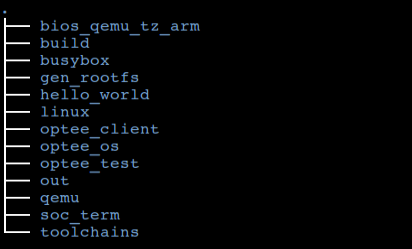
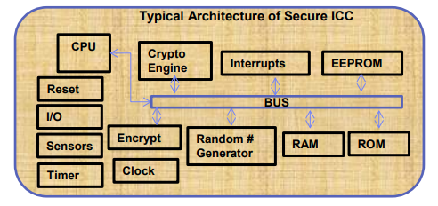
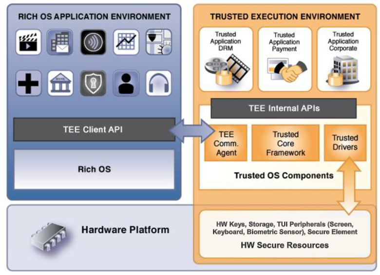

以这个作为芯片加密安全相关的知识的主文档。

就像我之前把npu作为机器学习的主文档一样。

所以虽然文档名字是optee，但是内容很多不局限于optee。而是芯片加密安全相关的话题。


# 代码

获取代码

```
repo init -u https://github.com/OP-TEE/manifest.git -m default.xml --repo-url=git://codeaurora.org/tools/repo.git
```



下载后的代码目录如图所示

该工程中各目录的作用介绍如下：

bios_qemu_tz_arm: 在qemu平台中运行tz arm的bios代码，启动最初阶段会被使用到，用来加载kernel, OP-TEE os image, rootfs并启动linux kernel和OP-TEE OS

build:这个工程的编译目录，里面包含了各种makefile文件和相关配置文件

busybox:busybox的源代码，用于制作rootfs的使用被使用到

gen_rootfs:存放制作rootfs时使用的相关脚本和配置文件

hello_work:一个示例代码，目录下包含了TA和CA部分的代码，在Linux shell端运行hello_world指令，就能调用CA接口，最终会穿到TEE中执行对应的TA部分的代码

linux:linux内核代码，在driver/tee目录下存放的是tee对应的驱动程序

optee_client:包含了CA程序调用的userspace层面的接口库的源代码。其中tee_supplicant目录中的代码会被编译成一个Binary，该binary主要的作用是，当调用CA接口，需要加载TA image时，TEE OS通过该binary从文件系统中来获取TA image，并传递給TEE OS，然后再讲TA image运行到TEE OS中。

optee_os:存放OP-TEE OS的源代码和相关文档

optee_test:opentee的测试程序xtest的源代码，主要用来测试TEE中提供的各种算法逻辑和提供的其他功能

out:编译完成之后输出目录（该目录编译完成之后才会生成）

qemu:qemu源代码

soc_term:在启动时与gnome-terminal命令一起启动终端,用于建立启动的两个terminal的端口监听，方便OP-TEE OS的log和linux kernel log分别输出到两个terminal中

toolchains:编译时需要使用的toolchain


# 安全机制有哪些

## 安全机制

### SE（Secure Element）

按照Global Platform的定义：

安全单元提供私密信息的安全存储、重要程序的安全执行等功能。

其内部组件包含有：

CPU、RAM、ROM、加密引擎、传感器等，

大致如下图所示：



外在表现上SE是一块物理上独立的芯片卡。从外在表现上可以分为三种：

- UICC 通用集成电路卡，由电信运营商发布和使用。就是大家购买手机号时的手机SIM卡；
- Embedded SE 虽然也是独立的芯片，但普通用户看不到，由手机制造厂商在手机出厂前集成在手机内部；
- Micro SD 以SD存储卡的形式存在，通过插入SD卡槽集成到手机上。由独立的SE制造商制造和销售；

**SE物理上独立，采用安全协议与外部通讯。**

具有自己独立的执行环境和安全存储，

软件和硬件上防篡改。

软件通过签名等方式防篡改很多人都了解，

**说下硬件防篡改，**

**简单说就是物理拆改SE，它会自毁。**

最简单的硬件防篡改的例子，大家可以参考大家给自己车安装车牌时所使用的单向螺丝和防盗帽。

**SE固若金汤，但保存在其中的数据和程序需要有更新机制**，这通过TSM（Trusted Service Manager）来实现，以保证安全。

SE不年轻了

从19世纪70年代就开始发展，但它十分安全，是目前手机上最安全的技术措施。

### TEE（Trusted Execution Environment）

SE千般好，除了慢。

硬件隔离，独立的计算和存储资源，意味着SE的计算性能差、跟主机的数据传输速度也慢，

这限制了SE的应用场景。

与此同时，移动互联网发展迅速，迫切需要一个更好的安全生态。

因此TEE应运而生。

TEE是一个硬件安全执行环境，

通常跟平时使用的Rich OS（Android等）共用同一个主处理器（CPU），

提供了代码和数据的安全防护、外置设备的安全访问等功能。

TEE具有自己的TEE OS，

可以安装和卸载执行其中的安全应用TA（TEE Application）。

**跟SE相比，是一个相对不那么安全，但运行速度更快、功能更丰富的安全环境。**

为所有支持TEE的手机，提供了操作系统之外的安全方案。

SE、TEE以及REE的对比：

| 对比项             | SE                 | TEE                          | REE    |
| :----------------- | :----------------- | :--------------------------- | :----- |
| 安全级别           | 最高（硬件防篡改） | 高（硬件安全方案）           | 普通   |
| 性能               | 差                 | 高                           | 高     |
| 是否在主处理器执行 | 否                 | 是（极个别情况有独立处理器） | 是     |
| 安全的外设访问     | 不支持             | 支持                         | 不支持 |
| 提供硬件证明       | 一定程度上提供     | 提供                         | 不提供 |
| 软件生态           | 较差               | 较好                         | 极好   |


TEE的内部[API](https://so.csdn.net/so/search?q=API&spm=1001.2101.3001.7020)和外部API都由Global Platform定义和发布。

TEE得到了业界广泛的支持，

比如ARM在2006年就发布了ARM处理器下的TEE方案TrustZone，

AMD、Intel、华为海思等，也有自己的TEE方案。




TEE广泛应用在支付、身份认证、内容保护等领域。

举例来讲，视频厂商往往需要DRM（Digital rights management）系统来保护版权内容能够顺利得在用户设备上播放，而不被泄露。

TEE天然适合用来完成这种需求，

其安全存储的能力可以用来保存解密版权内容所需密钥，

这样，TEE Application访问可信的服务端获取已加密的版权视频后，使用安全密钥解密，然后利用安全访问外置设备的能力，锁住显卡和声卡，将解密后的视频送往显卡和声卡播放。

整个过程中，不管是加密密钥还是视频内容都没有离开过TEE，保护了版权视频的安全。

**尤其值得一提的，因其锁定外置设备的能力，想通过录屏来窃取内容，也是不可能的。**


参考资料

1、从 Secure Element 到 Android KeyStore

https://blog.csdn.net/diaoxi4950/article/details/101977486

# amlogic optee培训

Provision出现背景

- UnifyKey是在REE环境下对Secure Keys做存储/查询/删除的各种操作，安全性达不到客户要求；
- Provision是把操作Secure Keys的关键流程（Secure Keys的解密、烧写、存储）放到了TEE环境中进行，使整个流程更加安全，符合客户的安全要求；


https://confluence.amlogic.com/display/SW/2022+TEE+Special+Training


# 参考资料

1、

https://blog.csdn.net/shuaifengyun/article/details/71499945

2、

这个作者的系列文章，非常专业。

https://blog.csdn.net/shuaifengyun/category_6909494.html

3、optee文档

https://optee.readthedocs.io/en/latest/