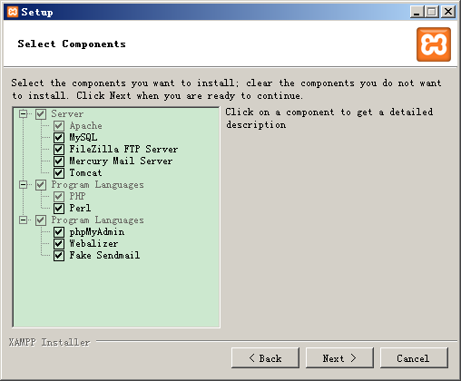

1

为了快速在windows上搭建php环境，使用xampp。

把这些都勾选上。

# 用phpmyadmin来修改mysql密码

参考这篇就好了。

https://jingyan.baidu.com/article/e4511cf332b9832b845eaf27.html

# xampp和wamp对比

wamp只能在windows上用。

xampp功能更加强大一些。

操作界面也更加人性化。

# 参考资料

1、Xampp + Zend Studio 开启Xdebug调试功能

https://blog.csdn.net/buyaore_wo/article/details/69787358

2、windows下mysql初始密码设置

https://www.cnblogs.com/dongzhuangdian/p/5620771.html

