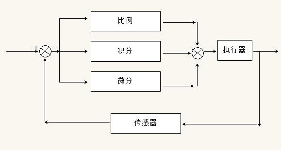
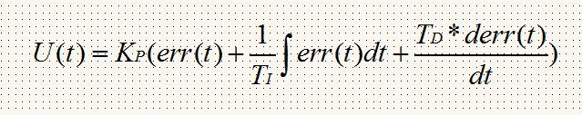

pid是控制系统里的经典算法，掌握了pid算法，对于大多数的控制场景，都可以搞定了。经典的东西，往往是简单的，比如牛顿的力学三定律。简单就是美。简单需要最大的智慧。
下面以直流电机的调速为例，来描述这个控制过程中的相关概念。

假定在t时刻，输入量为rint(t)设定转速，输出量为rout(t)实际转速，偏差值为err(t)=rin(t)-rout(t)。

在直流电机转速控制这个系统里，执行器为直流电机，传感器为广电码盘。

pid控制实质是对偏差的控制。
当偏差为0时，比例控制不起作用。积分环节主要是用来消除静差的，静差是指系统稳定后，设定值和实际值之间的差值。微分信号则是反应了偏差信号的变化趋势。
总的来说，积分调节滞后，微分调节超前。

下面我们要把上面的连续的pid公式离散化。
假设采样间隔为T，则在第K时刻：
偏差err(K) = rin(K) - rout(K)
积分环节用加和的方式来表示：err(K)+err(K+1)+...
微分环节用斜率的方式来表示：[err(K)+err(K-1)]/T
于是我们可以得到公式如下：

这个是位置型离散pid公式。
由位置型pid公式可以推算出增量式pid公式。
增量式pid的表达式可以看出，结果只与最近3次的偏差有关系。这就大大提高了系统的稳定性。

相关实现代码在我的github目录下。

在普通的pid控制中，引入积分环节的目的，主要是为了消除静差，提高控制精度。但是在启动、结束或者大幅度增加设定值的时候，短时间内系统输出有很大的偏差，会造成pid运算的误差积累，可能导致超调，甚至振荡。这种情况是不允许的。
解决的方式是，引入积分分离的概念。基本思路是这样：当偏差过大时，取消积分作用，当偏差接近给定值的时候，开始引入积分控制。

我们修改一下代码，可以发现速度到199，比之前的快很多。

