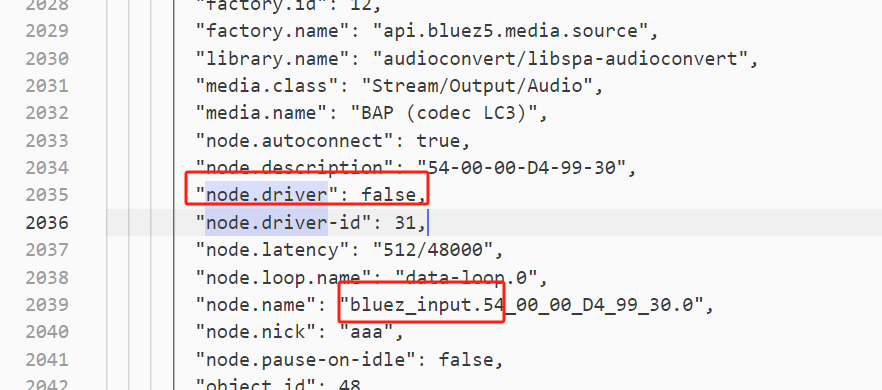

--

# 驱动节点

#### 图的驱动节点

- PipeWire 的图是基于“驱动节点”（driver node）运行的。一个驱动节点（通常是硬件相关的节点，如 ALSA 输出或蓝牙输入）会定期触发整个图的处理。
- 驱动节点的 process 函数被调用后，会通过端口连接依次触发下游节点的处理。
- 驱动节点的触发由数据循环中的时间事件（timer）或硬件中断（例如 ALSA 的周期中断）驱动。


# bluez_input为什么不是驱动节点

从pw-dump信息里看到：



bluez_input为什么不是驱动节点？


在 PipeWire 中，node.driver 属性表示该节点是否是图（graph）的“驱动节点”（driver node）。驱动节点负责：

- 定期触发图中所有节点的处理（通过调用 impl_node_process）。
- 设定图的 quantum（处理周期）和采样率。
- 通常与硬件直接关联（如 ALSA PCM 设备或蓝牙设备的输入/输出流）。

如果 node.driver = false，则该节点不是驱动节点，而是被动节点（follower node），它的处理由另一个驱动节点触发。


关键点：

- node.driver: false 表示它不是驱动节点。
- ==node.driver-id: 31 表示它依赖另一个节点（ID 为 31）作为驱动节点。==


#### bluez_input 的角色是被动源

- media.class: "Stream/Output/Audio" 表示这是一个音频流输出节点（source），它的数据流向图的下游（如 sink 或混音器）。在 PipeWire 中，source 节点通常不是驱动节点，而是由 sink 节点驱动。
- 例如：
  - bluez_input（蓝牙麦克风或源）提供音频数据。
  - 一个 ALSA sink（扬声器）消费数据并驱动图。
- 在这种情况下，sink 节点（ID 31）负责拉取数据，bluez_input 只是被动响应。

# alsa-sink作为driver是怎么启动graph的

ALSA sink 如何驱动图并拉取数据，

主要体现在 spa_alsa_start 和 alsa_write_sync / alsa_write_frames 函数中。

#### spa_alsa_start

- 功能

  ：启动 ALSA 设备，支持两种调度模式：

  - **定时器调度**（!state->disable_tsched）：使用 timerfd。（默认是用的这个）
  - **IRQ 调度**（state->disable_tsched）：依赖 ALSA 的 poll 文件描述符。

**定时器模式**：PipeWire 主动控制节奏，适合灵活性高的场景。

**IRQ 模式**：硬件中断驱动，更贴近 ALSA 原生行为，低延迟。


#### alsa_do_wakeup_work

- **功能**：处理唤醒事件，同步和写入数据。

- alsa_write_sync 计算缓冲区状态并更新时钟。

  playback_ready 设置 io->status = SPA_STATUS_NEED_DATA，通知图需要上游数据。


### 4. 数据拉取的完整流程

结合代码和之前的讨论，ALSA sink（ID 31）拉取数据的流程如下：

1. 硬件触发

   ：

   - IRQ 模式：硬件周期中断触发 alsa_irq_wakeup_event。
   - 定时器模式：timerfd 到期触发 alsa_timer_wakeup_event。
   - snd_pcm_avail 检测缓冲区空闲帧数（avail）。

2. 状态同步

   ：

   - alsa_write_sync 计算当前延迟（delay）和目标帧数（target）。
   - 如果 avail > threshold，需要填充数据。

3. 通知图

   ：

   - playback_ready 设置 io->status = SPA_STATUS_NEED_DATA。
   - PipeWire 调度器调用上游节点（bluez_input）的 impl_node_process。

4. 数据写入

   ：

   - bluez_input 将数据写入 state->ready 队列。
   - alsa_write_frames 从 state->ready 取出缓冲区，写入 ALSA 硬件（snd_pcm_mmap_commit 或 snd_pcm_writei）。

5. 循环执行

   ：

   - 硬件消耗数据后再次触发中断，重复上述步骤。


# pw_node_target 

struct pw_node_target 是 PipeWire 中

用于表示驱动节点（driver node）目标（target）的数据结构，

它是 PipeWire 调度机制的重要组成部分，

主要用于管理驱动节点与其依赖的从节点（follower nodes）之间的关系。

结合你的背景（蓝牙 bluez_input 到 ALSA sink，丢帧问题），我将详细解释这个结构体的作用、字段含义以及与你的场景的关联。


struct pw_node_target 表示驱动节点的“目标节点”，即驱动节点需要调度或触发的从节点。它在以下场景中使用：

- 驱动节点调度

  ：

  - 驱动节点（如 ALSA sink）通过 node_ready 函数调度其目标节点（如 bluez_input）。
  - pw_node_target 存储目标节点的元数据和触发机制。

- 图（Graph）管理

  ：

  - PipeWire 的图由驱动节点和从节点组成，pw_node_target 是驱动节点跟踪从节点的桥梁。

- 实时处理

  ：

  - 目标节点通过 trigger 函数被唤醒，确保数据流实时性。

# pw_node_activation 

struct pw_node_activation 是 PipeWire 中

用于管理节点激活状态和调度信息的核心数据结构，

它在 PipeWire 的实时调度和图（graph）管理中起关键作用，

记录节点的处理状态、时序信息、XRun（丢帧）统计以及时钟同步数据。

结合你的背景（蓝牙 bluez_input 到 ALSA sink，CIS sink 丢帧问题），我将详细分析这个结构体的字段、状态机、作用，以及与你的问题的关联。


### 结构体作用

struct pw_node_activation 用于：

- 节点状态管理

  ：

  - 跟踪节点在调度过程中的状态（如触发、处理中、完成）。

- 时序记录

  ：

  - 记录节点的触发、开始和完成时间，用于性能分析和调试。

- XRun 统计

  ：

  - 记录丢帧（XRun）次数和延迟，帮助诊断实时性问题。

- 时钟和同步

  ：

  - 管理驱动节点的时钟位置（spa_io_position）和同步状态。

- 命令和重新定位

  ：

  - 支持节点控制命令（如 START、STOP）和重新定位。


**状态定义**：

- PW_NODE_ACTIVATION_NOT_TRIGGERED（0）：节点未触发，准备阶段。
- PW_NODE_ACTIVATION_TRIGGERED（1）：节点已触发（写入 eventfd）。
- PW_NODE_ACTIVATION_AWAKE（2）：节点唤醒，开始处理。
- PW_NODE_ACTIVATION_FINISHED（3）：节点完成处理，触发下游。
- PW_NODE_ACTIVATION_INACTIVE（4）：节点未激活，无法调度。

**状态转换**：

- INACTIVE -> FINISHED：节点初始化，加入调度循环。
- NOT_TRIGGERED -> TRIGGERED -> AWAKE -> FINISHED：正常调度流程。
- \* -> INACTIVE：节点关闭。

**机制**：

- 使用 compare-and-swap（SPA_ATOMIC_CAS）确保状态变更的原子性。


# graph.h

我将基于你提供的 `spa_graph.h` 文件内容，详细说明 PipeWire 中的 `spa_graph`（图）模块的设计、核心组件、功能以及使用方式。PipeWire 的 `spa_graph` 模块是一个通用的节点图（Node Graph）框架，用于表示和处理数据流，例如音频或视频处理管道中的节点连接和调度。

---

### 什么是 `spa_graph`？
`spa_graph` 是 PipeWire 中用于构建和管理节点图的核心组件。节点图是一个有向图结构，其中：
- **节点（Nodes）** 表示处理单元（如音频源、滤波器、输出设备）。
- **端口（Ports）** 表示节点的输入和输出接口。
- **链接（Links）** 表示节点之间的数据流或信号传递。

这个模块的目标是提供一个轻量级、灵活的框架，用于组织和调度数据处理流程。它广泛用于 PipeWire 的音频和视频处理管道。

---

### 主要结构体
以下是 `spa_graph.h` 中定义的核心结构体及其作用：

#### 1. `struct spa_graph`
表示整个图的顶层结构。
```c
struct spa_graph {
    uint32_t flags;             /* 图的标志 */
    struct spa_graph_node *parent; /* 父节点（如果为驱动图，则为 NULL） */
    struct spa_graph_state *state; /* 图的状态 */
    struct spa_list nodes;      /* 图中节点列表 */
};
```
- **`flags`**: 图的属性标志（当前未具体定义具体值）。
- **`parent`**: 如果该图是子图，则指向包含它的父节点；如果是顶层图，则为 `NULL`。
- **`state`**: 图的运行状态（见 `spa_graph_state`）。
- **`nodes`**: 包含所有节点的双向链表。

#### 2. `struct spa_graph_state`
表示图或节点的状态。
```c
struct spa_graph_state {
    int status;         /* 当前状态 */
    int32_t required;   /* 需要的信号数量 */
    int32_t pending;    /* 未处理的信号数量 */
};
```
- **`status`**: 当前状态，通常是 `SPA_STATUS_OK`（0）或错误码。
- **`required`**: 需要触发的信号总数（例如，依赖的输入数量）。
- **`pending`**: 仍未处理的信号数，用于调度。

#### 3. `struct spa_graph_node`
表示图中的一个节点。
```c
struct spa_graph_node {
    struct spa_list link;       /* 在图的节点列表中的链接 */
    struct spa_graph *graph;    /* 所属图 */
    struct spa_list ports[2];   /* 输入和输出端口列表 */
    struct spa_list links;      /* 到下一节点的链接列表 */
    uint32_t flags;             /* 节点标志 */
    struct spa_graph_state *state; /* 节点状态 */
    struct spa_graph_link graph_link; /* 图的链接 */
    struct spa_graph *subgraph; /* 子图（可选） */
    struct spa_callbacks callbacks; /* 回调函数 */
    struct spa_list sched_link; /* 调度链表 */
};
```
- **`ports[2]`**: 分别存储输入端口（`SPA_DIRECTION_INPUT`）和输出端口（`SPA_DIRECTION_OUTPUT`）。
- **`links`**: 到下游节点的连接。
- **`subgraph`**: 如果节点包含子图，则指向子图。
- **`callbacks`**: 定义节点的处理逻辑（见 `spa_graph_node_callbacks`）。

#### 4. `struct spa_graph_port`
表示节点的输入或输出端口。
```c
struct spa_graph_port {
    struct spa_list link;       /* 在节点端口列表中的链接 */
    struct spa_graph_node *node; /* 所属节点 */
    enum spa_direction direction; /* 端口方向（输入或输出） */
    uint32_t port_id;           /* 端口 ID */
    uint32_t flags;             /* 端口标志 */
    struct spa_graph_port *peer; /* 对端端口 */
};
```
- **`direction`**: `SPA_DIRECTION_INPUT` 或 `SPA_DIRECTION_OUTPUT`。
- **`peer`**: 连接到的对端端口（例如输出连接到输入）。

#### 5. `struct spa_graph_link`
表示节点之间的链接。
```c
struct spa_graph_link {
    struct spa_list link;       /* 在链接列表中的链接 */
    struct spa_graph_state *state; /* 关联的状态 */
    int (*signal) (void *data); /* 信号回调函数 */
    void *signal_data;          /* 信号回调数据 */
};
```
- **`signal`**: 当链接被触发时调用的函数。
- **`signal_data`**: 传递给信号函数的数据。

---

### 核心功能与工作原理
`spa_graph` 的设计围绕调度和数据流管理，以下是其关键功能：

#### 1. 图的初始化与管理
- **`spa_graph_init`**:
  ```c
  void spa_graph_init(struct spa_graph *graph, struct spa_graph_state *state);
  ```
  - 初始化图，设置状态并清空节点列表。
- **`spa_graph_node_add`** / **`spa_graph_node_remove`**:
  - 将节点添加到图中或从中移除，并更新状态依赖。

#### 2. 节点的初始化与回调
- **`spa_graph_node_init`**:
  - 初始化节点，包括端口、链接和状态。
- **`spa_graph_node_set_callbacks`**:
  - 设置节点的回调函数，例如 `process`（处理数据）和 `reuse_buffer`（重用缓冲区）。
- 默认实现：
  - `spa_graph_node_impl_default`: 调用 `spa_node_process` 处理节点。
  - `spa_graph_node_sub_impl_default`: 运行子图。

#### 3. 端口与链接
- **`spa_graph_port_init`** / **`spa_graph_port_add`**:
  - 初始化并添加端口到节点。
- **`spa_graph_port_link`**:
  - 连接输出端口和输入端口，形成数据流路径。
- **`spa_graph_link_add`**:
  - 添加节点之间的链接，关联状态和信号。

#### 4. 图的运行与调度
- **`spa_graph_run`**:
  ```c
  int spa_graph_run(struct spa_graph *graph);
  ```
  - 重置图状态，遍历所有节点，调度初始就绪的节点（`pending == 0`）。
  - 调用每个节点的 `process` 回调。
- **`spa_graph_link_trigger`**:
  - 减少 `pending` 计数，当达到 0 时触发信号（`signal` 函数）。
- **`spa_graph_finish`**:
  - 如果图有父节点，则触发父节点继续处理。

#### 5. 状态管理
- **`spa_graph_state_reset`**:
  - 重置状态，将 `pending` 设为 `required`。
- **`spa_graph_state_dec`**:
  - 减少 `pending`，返回是否达到 0。

---

### 使用示例
以下是一个简单的图构建和运行示例：

```c
#include <spa/graph.h>
#include <stdio.h>

int main() {
    struct spa_graph graph;
    struct spa_graph_state graph_state = { .status = SPA_STATUS_OK, .required = 0, .pending = 0 };
    struct spa_graph_node node1, node2;
    struct spa_graph_state node1_state = { .status = SPA_STATUS_OK, .required = 0, .pending = 0 };
    struct spa_graph_state node2_state = { .status = SPA_STATUS_OK, .required = 1, .pending = 1 };
    struct spa_graph_port out_port, in_port;
    struct spa_graph_link link;

    // 初始化图
    spa_graph_init(&graph, &graph_state);

    // 初始化节点
    spa_graph_node_init(&node1, &node1_state);
    spa_graph_node_init(&node2, &node2_state);

    // 添加节点到图
    spa_graph_node_add(&graph, &node1);
    spa_graph_node_add(&graph, &node2);

    // 设置默认回调
    spa_graph_node_set_callbacks(&node1, &spa_graph_node_impl_default, &node1);
    spa_graph_node_set_callbacks(&node2, &spa_graph_node_impl_default, &node2);

    // 初始化端口
    spa_graph_port_init(&out_port, SPA_DIRECTION_OUTPUT, 0, 0);
    spa_graph_port_init(&in_port, SPA_DIRECTION_INPUT, 0, 0);

    // 添加端口到节点
    spa_graph_port_add(&node1, &out_port);
    spa_graph_port_add(&node2, &in_port);

    // 连接端口
    spa_graph_port_link(&out_port, &in_port);

    // 添加链接
    link.signal = spa_graph_link_signal_node;
    link.signal_data = &node2;
    spa_graph_link_add(&node1, &node2_state, &link);

    // 运行图
    spa_graph_run(&graph);

    return 0;
}
```

#### 运行流程
1. 图初始化，节点加入图。
2. 端口连接形成数据流。
3. 链接建立，`node2` 依赖 `node1` 的输出。
4. `spa_graph_run` 调度 `node1`（无依赖），完成后触发 `node2`。

---

### 设计亮点
1. **灵活性**：
   - 支持子图嵌套（`subgraph`），适合复杂管道。
   - 通过回调机制自定义节点行为。
2. **调度机制**：
   - 使用 `required` 和 `pending` 实现依赖驱动的调度。
3. **轻量级**：
   - 结构体简单，依赖链表管理，内存开销低。

---

### 总结
`spa_graph` 是 PipeWire 中用于表示和调度数据处理流程的核心模块。它通过节点、端口和链接构建有向图，并利用状态和回调机制实现高效的数据流管理。无论是简单的音频处理链还是复杂的多媒体管道，`spa_graph` 都提供了坚实的基础。如果需要更深入的代码分析或特定场景的实现，请告诉我！

# 官方文档总结

以下是对提供的 PipeWire 文档“Graph Scheduling”（版本 1.2.7）的详细分析，该文档来源于 `https://docs.pipewire.org/page_scheduling.html`。本文档描述了 PipeWire 图（Graph）的调度机制，重点关注数据处理线程中的调度逻辑、节点依赖关系、驱动节点的作用以及延迟调度（Lazy Scheduling）的设计。以下将从结构、内容、实现细节和意义四个方面进行分析。

---

### 一、文档结构与概述

#### 1. **目的**
- **主题**: 解释 PipeWire 图的调度机制。
- **范围**: 聚焦数据处理线程的调度逻辑，假设主线程已完成配置。

#### 2. **主要部分**
- **处理线程**: 主线程与数据处理线程的职责划分。
- **节点（Nodes）**: 节点的结构、激活记录和依赖管理。
- **链接（Links）**: 节点间的依赖关系。
- **驱动（Drivers）**: 图的驱动节点及其调度流程。
- **远程节点（Remote Nodes）**: 客户端节点的调度。
- **延迟调度（Lazy Scheduling）**: 灵活调度机制及其用例。

#### 3. **版本**
- **版本**: PipeWire 1.2.7。
- **日期**: 当前为 2025 年 3 月 10 日，可能落后于最新版本（如 1.4.x）。

---

### 二、核心内容分析

#### 1. **处理线程**
- **主线程**: 处理 IPC（客户端与服务器通信）和节点配置。
- **数据处理线程**: 
  - 负责实时数据处理，具有实时优先级（RT）。
  - 使用共享内存（`memfd`）预配置缓冲区、IO 区域和元数据，减少开销。
- **意义**: 分离配置与处理，确保数据线程高效运行。

#### 2. **节点（Nodes）**
- **结构**:
  - 包含输入/输出端口。
  - 配备 `eventfd`（事件文件描述符）触发处理。
  - 激活记录（`activation`）存储于共享内存，包含：
    - `status`: 状态（`NEED_DATA`, `HAVE_DATA`, `OK`）。
    - `pending`: 未满足的依赖数。
    - `required`: 依赖总数。
    - 其他：时间信息、状态转换时间戳等。
- **图示**:
  ```
  eventfd
  +-^---------+
  |           |
  in         out
  |           |
  +-v---------+
  activation {
    status: OK,
    pending: 0,
    required: 0
  }
  ```
- **作用**: 通过 `pending` 和 `required` 管理调度依赖。

#### 3. **链接（Links）**
- **依赖关系**:
  - 输出节点是输入节点的依赖。
  - 输入节点的 `required` 增1，`pending` 在图启动时设为 `required`。
  - 输出节点记录其目标节点（如 B 依赖 A）。
- **图示**:
  ```
  eventfd           eventfd
  +-^---------+     +-^---------+
  |           |     |           |
  in A   out -----> in B   out
  |           |     |           |
  +-v---------+     +-v---------+
  activation {      activation {
    status: OK,       status: OK,
    pending: 0,       pending: 1,
    required: 0       required: 1
  }                 }
  ```
- **实现**: 仅在链接和节点就绪时更新依赖。

#### 4. **驱动（Drivers）**
- **定义**:
  - 图需至少一个驱动节点启动调度。
  - 通过定时器或硬件中断触发周期。
  - 优先级最高（`priority.driver`）的节点成为驱动。
- **依赖**:
  
  - 驱动节点记录所有从节点（`targets`），并被从节点引用。
  - 从节点的 `required` 包含驱动依赖。
- **图示**:
  ```
  A --> B --> Driver
  ```
- **调度流程**:
  1. 检查上一周期是否完成，未完成标记 `xrun`。
  2. 处理重定位请求（如 seek）。
  3. 重置从节点的 `pending` 为 `required`。
  4. 遍历目标节点，原子减少 `pending`，若为 0 则触发 `eventfd`。
- **示例**:
  - A（`pending: 0`）先触发，处理后减少 B 和 Driver 的 `pending`。
  - B（`pending: 0`）触发，减少 Driver 的 `pending`。
  - Driver（`pending: 0`）触发，完成周期。

#### 5. **远程节点（Remote Nodes）**
- **机制**:
  - `eventfd` 和 `activation` 传输至客户端。
  - 客户端直接触发对等节点或驱动，无需通过服务器。
- **远程驱动**:
  - 直接启动图周期。
  - 完成后（若启用分析器）通知服务器。
- **意义**: 减少服务器负担，提高分布式效率。

#### 6. **延迟调度（Lazy Scheduling）**
- **问题**:
  - 从节点未就绪、驱动速率不理想或频繁唤醒。
- **解决方案**:
  - 反转驱动与从节点角色。
  - 从节点发出 `RequestProcess` 事件，驱动决定是否运行。
- **属性**:
  - `node.supports-lazy`: 驱动支持延迟调度（>0 表示支持）。
  - `node.supports-request`: 从节点支持请求（>0 表示支持）。
- **条件**: 至少一个驱动和一个从节点支持延迟调度。
- **角色**:
  - **驱动生产者**: `is_driving() && !is_lazy()`，主动触发。
  - **延迟生产者**: `is_driving() && is_lazy()`，监听 `RequestProcess`。
  - **请求生产者**: `!is_driving() && is_lazy()`，发出请求。
  - **从生产者**: `!is_driving() && !is_lazy()`。
- **用例**:
  1. **屏幕共享**: 生产者驱动，消费者跟随。
  2. **无头服务器**: 请求生产者，半延迟驱动消费者。
  3. **帧编码器**: 延迟生产者，请求消费者。

---

### 三、实现细节与代码关联

#### 1. **调度逻辑**
- **文件**: `pipewire/impl-node.c`。
- **函数**:
  - `pw_node_trigger`: 触发节点（写入 `eventfd`）。
  - `pw_node_process`: 处理数据并更新目标节点的 `pending`。

#### 2. **驱动管理**
- **文件**: `pipewire/driver.c`。
- **逻辑**: `driver_start_cycle` 检查状态并触发目标节点。

#### 3. **延迟调度**
- **属性检查**: 在节点初始化（如 `pw_stream_connect`）时设置。
- **事件**: `RequestProcess` 通过协议（`protocol-pw.c`）传递。

#### 4. **与 `pw_stream` 的关系**
- `pw_stream` 的 `trigger_process` 调用底层驱动逻辑。
- 示例 `audio-capture.c` 中，`PW_STREAM_FLAG_RT_PROCESS` 启用实时调度。

---

### 四、设计特点与意义

#### 1. **实时性**
- 数据线程使用 RT 优先级和共享内存，优化延迟。
- **意义**: 适合音频/视频等实时应用。

#### 2. **依赖管理**
- 通过 `pending` 和 `required` 确保正确顺序。
- **意义**: 避免死锁，支持复杂图。

#### 3. **灵活性**
- 支持远程节点和延迟调度，适应分布式和动态场景。
- **意义**: 增强 PipeWire 的通用性。

#### 4. **健壮性**
- 检查周期完成状态，标记 `xrun`。
- **意义**: 提高稳定性。

---

### 五、文档来源与现状

- **URL**: `https://docs.pipewire.org/page_scheduling.html`。
- **可靠性**: 官方文档，反映 1.2.7 设计。
- **更新性**: 可能未涵盖最新特性（如 1.4.x 的改进），建议查阅最新版本。

---

### 六、总结

“Graph Scheduling”文档详细描述了 PipeWire 图的调度机制，从节点依赖、驱动触发到延迟调度的设计，体现了实时性、灵活性和健壮性。它为开发者理解 PipeWire 的数据处理核心提供了关键洞察，与 `pw_stream` 等 API 紧密相关。延迟调度为动态用例（如屏幕共享）提供了创新解决方案。如需更深入分析（如具体用例实现），请进一步指示！
