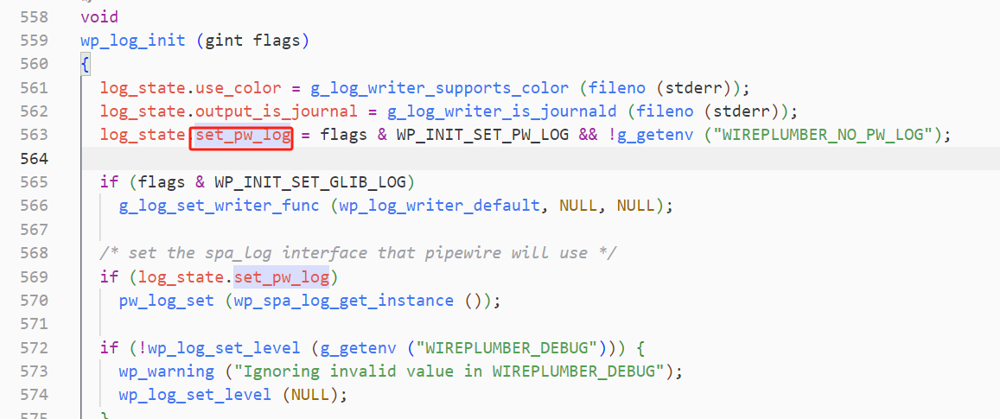

--

# 设置方法

```
export PIPEWIRE_DEBUG="E,spa.alsa:T,spa.bluez5.*:T"
export PIPEWIRE_LOG="/pw.log"
```

# wireplumber设置log 的方法

```
wp_log_set_level (g_getenv ("WIREPLUMBER_DEBUG"))
```

这里控制了是否设置到pipewire的log。



是这么设置过去的。

```
g_setenv ("PIPEWIRE_DEBUG", lvl_str, TRUE)
```

那就很明显会覆盖默认的PIPEWIRE_DEBUG变量。

# 可以统一从wireplumber来设置pipewire和wireplumber这2个程序的log


# pipewire的log topic

用`rg SPA_LOG_TOPIC_DEFINE`命令搜索：

```
spa.aec.null
spa.eac.webrtc
spa.audiotestsrc
spa.control-mixer
spa.libcamera
spa.videotestsrc
spa.system
spa.evl-system
spa.null-audio-sink
spa.loop
spa.avb
spa.logger
spa.journal
spa.dbus
spa.cpu
spa.driver
spa.mixer-dsp
spa.audiomixer
spa.v4l2
spa.v4l2-device
spa.volume
spa.videoconvert.dummy
spa.videoadapter
spa.videoconvert.ffmpeg
spa.test-source
spa.audioadapter
spa.audioconvert
spa.jack-device
spa.jack-source
spa.jack-sink
spa.fakesrc
spa.fakesink
spa.vulkan.compute-source
spa.vulkan.blit-dsp-filter
spa.vulkan.compute-filter
spa.vulkan.blit-filter
spa.alsa
spa.ffmpeg.enc
spa.ffmpeg.dec
spa.filter-graph
spa.bluez5.sink.sco
spa.bluez5.codecs.
spa.bluez5.codecs
spa.bluez5.source.sco
spa.bluez5.hsphfpd
spa.bluez5.native
spa.bluez5.ofono
spa.bluez5.midi.node
spa.bluez5.midi.server
spa.bluez5.midi
spa.bluez5.device
spa.bluez5
spa.bluez5.source.media
spa.bluez5.iso
spa.bluez5.quirks
spa.bluez5.sco-io
spa.bluez5.sink.media
spa.bluez5.player
```


# wireplumber的log topic

`rg WP_DEFINE_LOCAL_LOG_TOPIC`搜索，可以看到有这些：

```
m-si-node
m-logind
m-log-settings
m-si-audio-adapter
m-si-standard-link
wp-si-interfaces
wp-event
wp-comp-loader
wp-object-manager
wp-spa-pod
wp-json-utils
m-portal-permissionstore
wireplumber
wp-port
wp-proxy
wp-spa-type
wp-log
wp-iterator
wp-factory
wp-spa-json
wp-object
wp-client
wp-proxy-ifaces
wp-node
wp-metadata
wp-base-dirs
wp-core
wp-device
wp-event-hook
wp-conf
wp-event-dispatcher
wp-si
wp-properties
wp-plugin
wp-link
wp-object-interest
wp-module
wp-transition
wp-settings
wpctl
wp-state
tests
wp-registry
wp-pw-obj-mixin
wp-internal-comp-loader
m-file-monitor-api
wp-global-proxy
m-standard-event-source
m-default-nodes-api
m-settings
m-mixer-api
m-dbus-connection
wp-si-factory
wp
wpexec
```

# 复杂的例子

```
PIPEWIRE_DEBUG=2,pw.core:D,mod.protocol-native:T,ms.*:I,conn.*:E,mod.foo:X
```

#### 分析

- **全局级别**: 2（警告级别），所有未指定分类的主题默认记录警告及以上。

- 特定分类

  :

  - pw.core:D: PipeWire 核心记录调试级别（4），覆盖全局级别。
  - mod.protocol-native:T: 原生协议模块记录跟踪级别（5），捕获实时线程细节。
  - ms.*:I: 所有会话管理主题记录信息级别（3）。
  - conn.*:E: 连接相关主题记录错误级别（1），需显式启用。
  - mod.foo:X: foo 模块禁用日志（0），覆盖 mod.* 的默认级别。

- 应用场景

  :

  - 调试协议通信（mod.protocol-native:T）。
  - 监控核心行为（pw.core:D）。
  - 获取会话管理概要（ms.*:I）。
  - 仅记录连接错误（conn.*:E）。
  - 排除 foo 模块噪音（mod.foo:X）。
