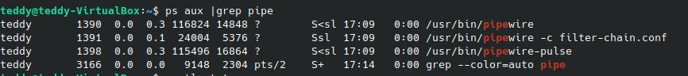
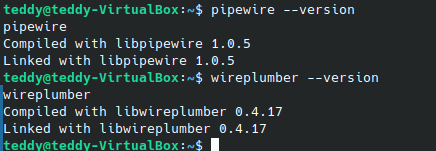

--

为了研究linux的音频应用，我在电脑上安装了ubuntu studio的虚拟机。版本是24.04。

# 先看pipewire

可以看到是有启动了2个pipewire进程。

一个是filter-chain的配置文件。

版本还比较老。

看这里的youtube视频。

https://github.com/mikeroyal/PipeWire-Guide

qjackctl：

qpwgraph：这个拖拽来
