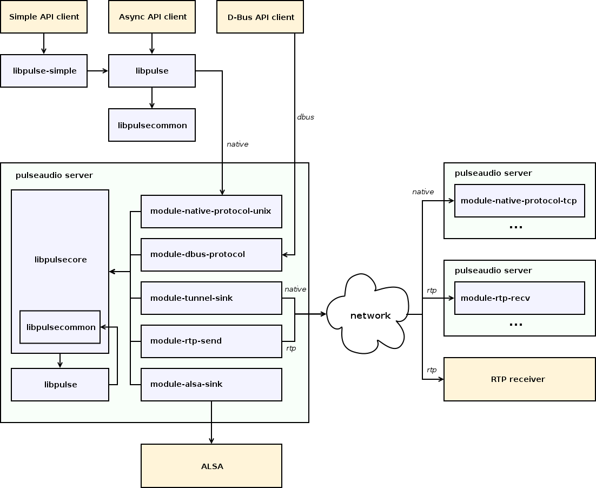
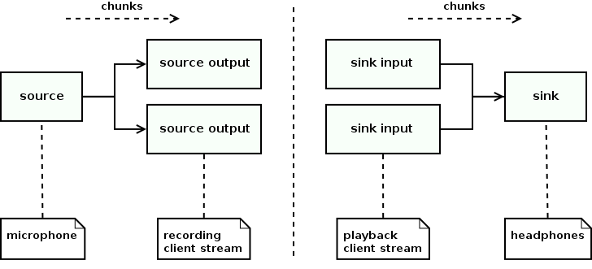
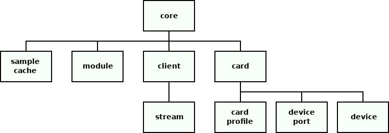

--

# 对pulseaudio的一篇全面论述文章

https://gavv.net/articles/pulseaudio-under-the-hood/

现有的文档没有提供鸟瞰图和对 PulseAudio 功能和设计的解释，也没有涵盖许多实现细节。

因此，总体情况仍然不明朗。高级配置看起来很神秘，因为首先需要了解引擎盖下发生的事情。模块编写器的学习曲线也很高。

本文档试图填补这一空白，并概述了 PulseAudio 的功能、架构和内部结构。更准确地说，它有三个目标：

- 描述可用功能
- 解释其底层设计和重要的实现细节
- 提供编写客户机和服务器模块的起点

它没有提供 PulseAudio 配置和 API 的详细参考或教程。

PulseAudio 是 POSIX 操作系统（主要针对 Linux）的声音服务器，

充当单个或多个主机上的硬件设备驱动程序和应用程序之间的代理和路由器。

## PulseAudio 旨在实现许多目标。

**桌面音频的抽象层**

PulseAudio 管理所有音频应用程序、本地和网络流、设备、滤波器和音频 I/O。它提供了一个抽象层，将所有这些东西组合在一个地方。

**可编程行为**

丰富的 API 提供了用于检查和控制所有可用对象及其持久性和运行时属性的方法。这样就可以用 GUI 工具替换配置文件。许多桌面环境都提供此类工具。

**自动设置**

PulseAudio 设计为开箱即用。它自动检测和配置本地网络中可用的本地设备和声音服务器。它还实现了许多用于自动音频管理和路由的策略。

**灵活性**

PulseAudio 为用户提供了高度的灵活性。可以将任何应用程序的任何流连接到任何本地或远程设备，配置每个流和每个设备的volume，构建声音处理链等。

**扩展**

PulseAudio 为服务器扩展提供了一个框架，许多内置功能都以模块的形式实现。非官方的第三方模块也存在，但是，上游并不能保证树外模块的稳定 API。


## 以下列表介绍了 PulseAudio 中实现的功能。

**协议和网络**

PulseAudio 支持多种网络协议，可与客户端、远程服务器和第三方软件进行通信。

**设备驱动程序**

PulseAudio 支持多个后端与硬件设备和控件进行交互。它支持热插拔并自动配置新设备。

**声音处理**

PulseAudio 实现了各种声音处理工具，如混音、采样率转换和回声消除，可以手动或自动使用。

**sample缓存**

PulseAudio 为命名的短批次样本实现了内存存储，这些样本可以上传到服务器一次，然后播放多次。

**流管理**

PulseAudio 管理所有桌面应用程序的所有输入和输出流，为它们提供时钟、缓冲和倒带等功能。

**时间管理**

PulseAudio 实现了基于每设备计时器的调度程序，可在声卡域中提供时钟，保持最佳延迟，并降低播放故障的可能性。

**省电**

PulseAudio 采用多种技术来减少 CPU 和电池使用量。

**自动设置和路由**

PulseAudio 自动设置卡、设备和流的参数，将流路由到设备，并执行其他内务操作。

**桌面集成**

PulseAudio 实现了将其集成到桌面环境中的多项功能。

**兼容层**

与其他音响系统有几个兼容层，因此现有应用程序无需修改即可自动在 PulseAudio 上运行。

## usecase

以下是如何在桌面上使用 PulseAudio 功能的一些实际示例：

- 智能热插拔处理。例如，在连接蓝牙或 USB 耳机时自动设置耳机，或者在耳机插入插孔时自动切换到耳机。
- 用于在立体声、环绕声或 S/PDIF 等各种模式之间轻松切换声卡的 GUI。
- 一个 GUI，用于轻松将音频流切换到任何可用的音频设备，如内置扬声器、有线耳机、蓝牙耳机或 HDMI 输出。
- 一个 GUI，用于使单个应用程序比其他应用程序更响亮，或将其静音，并在下次应用程序出现时记住此决定。
- 用于将音频路由到 LAN 中可用的远程设备的 GUI。例如，将笔记本电脑上播放音乐的浏览器连接到连接到 Raspberry Pi 的扬声器。
- 自动将音乐或语音从蓝牙播放器或移动电话路由到声卡或蓝牙扬声器或耳机。
- 透明地将各种声音处理工具添加到正在运行的应用程序中，例如向 VoIP 客户端添加回声消除。
- 通过自动动态调整延迟到当前正在运行的应用程序可接受的最大值，并禁用当前不必要的声音处理（如重新采样）来减少 CPU 和电池使用量。
- 智能 I/O 调度，可以结合播放的高延迟（以避免故障并降低 CPU 使用率）和用户操作（如音量更改）的低延迟（以提供更流畅的用户体验）。
- 自动将现有桌面应用程序集成到 PulseAudio 工作流程中，即使它们不知道 PulseAudio。


## 问题和缺点

使用 PulseAudio 有几个已知的缺点，包括基本问题和将来可能解决的实现问题：

- 额外的复杂性、开销和 bug（更多的代码总是意味着更多的 bug）
- 缺乏全面的文档
- 非直观的命令行工具和配置
- 奇怪的功能，如自动生成和内置看门狗
- 更高的最小延迟
- 在 802.11 （WiFi） 等不可靠的网络上服务质量差
- 没有硬件混合和重采样
- 使用 ALSA UCM 时没有硬件volume

## 高级组件

下图演示了示例 PulseAudio 设置的简化视图。

它显示了三个客户端（使用三个不同的 API）、一个本地 PulseAudio 服务器、两个远程 PulseAudio 服务器（通过“本机”和 RTP 协议连接）、一个远程 RTP 接收器、ALSA 后端以及为此设置提供服务所需的一组模块。




## 关键抽象

本节讨论关键的服务器端对象类型。

###  Devices and streams 

PulseAudio 是围绕连接到流（源输出和接收器输入）的设备（源和接收器）构建的。下图说明了这些连接。




### 对象层次结构

下图显示了服务器端对象的层次结构。




# 简介

ubuntu里，默认启动的pulseaudio是这样的：

```
/usr/bin/pulseaudio --start --log-target=syslog
```

PulseAudio是用于[Linux](https://so.csdn.net/so/search?from=pc_blog_highlight&q=Linux)，POSIX和Windows系统的网络低延迟声音服务器。

配置文件

```
~/.config/pulse/daemon.conf, 
/etc/pulse/daemon.conf
```


# 实时和高优先级计划

为了最大程度地降低播放过程中丢失的风险，

如果基础平台支持，建议使用实时调度运行PulseAudio。

这使PulseAudio守护程序的调度等待时间与系统负载分离，

因此是确保PulseAudio在需要其重新填充硬件播放缓冲区时始终获得CPU时间的最佳方法。

不幸的是，这在大多数系统上都是安全隐患，

因为PulseAudio是作为用户进程运行的，

并且为用户进程提供实时调度特权总是伴随着用户滥用其锁定系统的风险-这可能是由于创建进程而造成的。

实时有效地禁用了抢占。

为了最大程度地降低风险，PulseAudio默认情况下不会启用实时调度。

但是，建议在受信任的系统上启用它。

为此，请使用--realtime（请参见上文）启动PulseAudio或在daemon.conf中启用相应的选项。

由于获取实时调度是大多数系统上的特权操作，因此需要对系统配置进行一些特殊更改，以允许主叫用户使用它们。

有两个选项：

   在较新的Linux系统上，系统资源限制RLIMIT_RTPRIO（有关更多信息，请参见setrlimit（2））可用于允许特定用户获取实时调度。可以在/etc/security/limits.conf中进行配置，建议资源限制为9。

   或者，可以为PulseAudio二进制设置SUID根位。然后，守护程序将在启动时立即放弃root特权，但是保留CAP_NICE功能（在支持该功能的系统上），但前提是主叫用户是Pulse-rt组的成员（请参见上文）。对于所有其他用户，所有功能将立即删除。该解决方案的优势在于，实时特权仅授予PulseAudio守护程序，而不授予所有用户进程。

   或者，如果认为锁定机器的风险太大而无法启用实时调度，则可以启用高优先级调度（即，负好级别）。
   可以通过在启动PulseAudio时传递--high-priority（请参见上文）来启用它，也可以使用daemon.conf中的适当选项来启用它。只有设置了适当的资源限制RLIMIT_NICE（有关更多信息，请参见setrlimit（2））（可能在/etc/security/limits.conf中配置），才能启用负的尼斯级别。建议将资源限制为31（对应于不错的-11级）。


# 环境变量

```
   $ PULSE_SERVER：服务器字符串，指定客户端请求声音服务器连接且未明确要求特定服务器时要连接的服务器。服务器字符串是由空格分隔的服务器地址的列表，依次尝试。服务器地址由一个可选的地址类型说明符(unix:, tcp:, tcp4:, tcp6:)组成，后跟路径或主机地址。主机地址可以包括可选的端口号。服务器地址可以用{}中的字符串作为前缀。在这种情况下，以下服务器地址为ig-
   除非前缀字符串等于本地主机名或计算机ID（/ etc / machine-id），否则不进行操作。

   $ PULSE_SINK：当客户端创建回放流且未明确要求特定接收器时，要连接到的接收器的符号名称。

   $ PULSE_SOURCE：客户端创建记录流且未明确要求特定来源时要连接的来源的符号名称。

   $ PULSE_BINARY：使用服务器自动生成时运行的PulseAudio可执行文件的路径。

   $ PULSE_CLIENTCONFIG：用于客户端配置的应读取的文件路径，而不是client.conf（请参见上文）。

   $ PULSE_COOKIE：包含PulseAudio身份验证cookie的文件的路径。默认为~/.config/pulse/cookie。

   这些环境设置（如果已设置）优先于client.conf中的配置设置（请参见上文）。

```

# /etc/pulse/daemon.conf


```
   daemonize =
   启动后进行守护程序。布尔值，默认为no。--daemonize命令行选项优先。

   fail =
   如果配置脚本default.pa中的任何指令失败，则无法启动。采用布尔型参数，默认为yes。--fail命令行选项优先。

   allow-module-loading =
   启动后允许/禁止加载模块。这是一项安全功能，如果禁用此功能，请确保启动完成后，不能再将其他模块加载到PulseAudio服务器中。建议在启用系统实例时禁用此功能。请注意，如果启用此选项，某些功能（如自动热插拔支持）将无法使用。采用布尔型参数，默认为yes。--disallow-module-loading命令行选项优先。

   allow-exit =
   允许/禁止根据用户请求退出。默认为是。

   resample-method =
   要使用的重采样算法。使用src-sinc最佳质量，src-sinc-中等质量，src-sinc最快，src-零阶保持，src-linear，琐碎，speex-float-N，speex-fixed-N中的一种，ffmpeg，soxr-mq，soxr-hq，soxr-vhq。分别参见libsamplerate和speex的文档以获取有关不同src-和speex-方法的说明。琐碎的方法是最基本的算法。如果您的CPU紧张，请考虑使用此功能。另一方面，它们的质量最差。Speex重采样器采用整数质量设置，范围为0..10（不好...好）。它们以两种形式存在：固定和浮动。前者使用定点数，后者使用浮点数。在大多数台式机CPU上，浮点重采样器要快得多，而且它的质量也稍好一些。soxr系列方法基于libsoxr，libsoxr是SoX声音处理实用程序中的重采样器库。mq变体在这三个中表现最佳。Soq开发人员认为，hq较为昂贵，并且被认为是每个样本最多16位音频的最佳选择。vhq变量比hq精度更高，并且更适合于较大的样本。与其他重新采样器（例如speex）相比，Soxr重新采样器通常在更少的CPU上提供更好的质量。缺点是它们会给输出增加明显的延迟（通常最多20毫秒左右，在极少数情况下会更长）。有关所有可用重采样器的完整列表，请参见dump-resample-methods的输出。默认为speex-float-1。--resample-method命令行选项优先。

   prevent-resampling =
   如果设置，请尝试配置设备以避免重新采样。这仅在支持重新配置其速率的设备上以及没有其他流正在播放或捕获音频的设备上起作用。该设备的配置速率也不会低于默认采样率和备用采样率。

   enable-remixing =
   如果禁用，则永远不会将通道上混或下混到不同的通道映射。而是仅进行简单的基于名称的匹配。默认为是。

   remixing-use-all-sink-channels =
   如果启用，则在重新混合时使用所有接收器通道。否则，请重新混合到再现所有源通道所需的最小接收器通道集。（这对LFE混音没有影响。）默认为是。

   enable-lfe-remixing =
   如果在上混或下混时禁用，则忽略LFE通道。禁用此选项后，仅当输入LFE通道可用时，输出LFE通道也将获得信号。如果没有输入LFE通道可用，则输出LFE通道将始终为0。如果没有输出LFE通道可用，则将忽略输入LFE通道上的信号。默认为否。

   lfe-crossover-freq = 
   LFE滤波器的交叉频率（以Hz为单位）。将其设置为0以禁用LFE滤波器。预设为0。

   use-pid-file =
   在运行时目录中创建PID文件（$XDG_RUNTIME_DIR/pulse/pid）。如果启用此功能，则可以使用--kill或--check之类的命令。如果您计划每个用户启动一个以上的PulseAudio进程，则最好禁用此选项，因为它实际上会禁用多个实例。采用布尔型参数，默认为yes。--use-pid-file命令行选项优先。

   cpu-limit =
   如果禁用，则即使在受支持的平台上也不要安装CPU负载限制器。在调试/分析PulseAudio以禁用干扰的SIGXCPU信号时，此选项很有用。
   接受布尔参数，默认为no。--no-cpu-limit命令行参数优先。

   system-instance =
   作为系统级实例运行守护程序，需要root特权。接受布尔参数，默认为no。--system命令行参数优先。

   local-server-type =
   如果不需要，请不要使用此选项！当前仅当您希望D-Bus客户端使用远程服务器时，此选项才有用。在将来的版本中可能会删除此选项。如果只想在系统模式下运行PulseAudio，请使用system-instance选项。此选项将用户，系统之一或不作为参数。这本质上是system-instance选项的副本。不同之处在于none选项，当您要将远程服务器与D-Bus客户端一起使用时，该选项很有用。如果同时定义了this和system-instance，则此选项优先。默认为设置的系统实例。

   enable-shm =
   启用通过POSIX或memfd共享内存的数据传输。采用布尔型参数，默认为yes。--disable-shm命令行参数优先。

   enable-memfd =
   启用memfd共享内存。采用布尔型参数，默认为yes。

   shm-size-bytes =
   设置守护程序的共享内存段大小（以字节为单位）。如果未指定或设置为0，它将默认为某些系统特定的默认值，通常为64 MiB。请注意，通常不需要更改此值，除非您运行的OS内核不执行内存过量使用。

   lock-memory =
   将整个PulseAudio进程锁定到内存中。当与实时调度结合使用时，这可能会增加drop-out安全性，但这会占用其他进程大量的内存，因此可能会大大降低系统速度。默认为否。

   flat-volumes =
   启用“平坦”音量，即，在可能的情况下，使接收器音量等于与其连接的输入的最大音量。采用布尔型参数，默认为yes。

```

# client.conf

# 命令

## pactl

| 命令                     | 说明           |
| ------------------------ | -------------- |
| pactl list modules short | 列出安装的模块 |
|                          |                |
|                          |                |

以下是一些常用的 `pactl` 命令，帮助你管理和调试 PulseAudio。

**1. 列出所有加载的模块**

```bash
pactl list modules
```

**2. 加载一个模块**

```bash
pactl load-module <module-name> [arguments]
# 示例：加载 ALSA 输出模块
pactl load-module module-alsa-sink device=hw:1,0
```

**3. 卸载一个模块**

```bash
pactl unload-module <module-id>
# 示例：卸载模块 ID 为 12 的模块
pactl unload-module 12
```

**4. 列出所有设备**

```bash
pactl list sinks          # 列出所有输出设备
pactl list sources        # 列出所有输入设备
pactl list sink-inputs    # 列出所有输出设备的输入流
pactl list source-outputs # 列出所有输入设备的输出流
```

**5. 设置默认设备**

```bash
pactl set-default-sink <sink-name>
pactl set-default-source <source-name>
# 示例：设置默认输出设备
pactl set-default-sink alsa_output.pci-0000_00_1b.0.analog-stereo
```

**6. 调整音量**

```bash
pactl set-sink-volume <sink-name> <volume>
pactl set-source-volume <source-name> <volume>
# 示例：将输出设备的音量设置为 50%
pactl set-sink-volume 0 50%
```

**7. 静音/取消静音**

```bash
pactl set-sink-mute <sink-name> <mute>
pactl set-source-mute <source-name> <mute>
# 示例：静音输出设备
pactl set-sink-mute 0 1
# 取消静音
pactl set-sink-mute 0 0
```

**8. 移动音频流**

```bash
pactl move-sink-input <sink-input-id> <sink-name>
pactl move-source-output <source-output-id> <source-name>
# 示例：将 sink-input 3 移动到 alsa_output.pci-0000_00_1b.0.analog-stereo
pactl move-sink-input 3 alsa_output.pci-0000_00_1b.0.analog-stereo
```

**9. 列出客户端和服务器信息**

```bash
pactl list clients   # 列出所有客户端
pactl info           # 显示服务器信息
```

**10. 重新加载 PulseAudio 配置**

```bash
pactl unload-module module-cli-protocol-unix && pactl load-module module-cli-protocol-unix
```

这些命令应该能帮助你更好地管理 PulseAudio。如果你有特定需求或问题，请告诉我！

## pacmd

`pacmd` 是 PulseAudio 的另一个命令行工具，用于与 PulseAudio 服务器交互。以下是一些常用的 `pacmd` 命令：

**1. 获取 PulseAudio 信息**

```bash
pacmd stat
```

**2. 列出所有加载的模块**

```bash
pacmd list-modules
```

**3. 加载和卸载模块**

```bash
# 加载模块
pacmd load-module <module-name> [arguments]
# 示例：加载 ALSA 输出模块
pacmd load-module module-alsa-sink device=hw:1,0

# 卸载模块
pacmd unload-module <module-id>
# 示例：卸载模块 ID 为 12 的模块
pacmd unload-module 12
```

**4. 列出所有设备**

```bash
pacmd list-sinks          # 列出所有输出设备
pacmd list-sources        # 列出所有输入设备
pacmd list-sink-inputs    # 列出所有输出设备的输入流
pacmd list-source-outputs # 列出所有输入设备的输出流
```

**5. 设置默认设备**

```bash
pacmd set-default-sink <sink-name>
pacmd set-default-source <source-name>
# 示例：设置默认输出设备
pacmd set-default-sink alsa_output.pci-0000_00_1b.0.analog-stereo
```

**6. 调整音量**

```bash
pacmd set-sink-volume <sink-name> <volume>
pacmd set-source-volume <source-name> <volume>
# 示例：将输出设备的音量设置为 50%
pacmd set-sink-volume 0 32768  # 32768 = 50% (65536 is 100%)
```

**7. 静音/取消静音**

```bash
pacmd set-sink-mute <sink-name> <mute>
pacmd set-source-mute <source-name> <mute>
# 示例：静音输出设备
pacmd set-sink-mute 0 1
# 取消静音
pacmd set-sink-mute 0 0
```

**8. 移动音频流**

```bash
pacmd move-sink-input <sink-input-id> <sink-name>
pacmd move-source-output <source-output-id> <source-name>
# 示例：将 sink-input 3 移动到 alsa_output.pci-0000_00_1b.0.analog-stereo
pacmd move-sink-input 3 alsa_output.pci-0000_00_1b.0.analog-stereo
```

**9. 列出客户端和服务器信息**

```bash
pacmd list-clients  # 列出所有客户端
pacmd info          # 显示服务器信息
```

**10. 重新加载 PulseAudio 配置**

```bash
pacmd unload-module module-cli-protocol-unix && pacmd load-module module-cli-protocol-unix
```

以下是一个简单的表格，列出了一些常用命令：

| **命令**                                 | **说明**                   |
| ---------------------------------------- | -------------------------- |
| `pacmd stat`                             | 获取 PulseAudio 服务器状态 |
| `pacmd list-modules`                     | 列出所有加载的模块         |
| `pacmd load-module <module-name>`        | 加载指定模块               |
| `pacmd unload-module <module-id>`        | 卸载指定模块               |
| `pacmd list-sinks`                       | 列出所有输出设备           |
| `pacmd list-sources`                     | 列出所有输入设备           |
| `pacmd list-sink-inputs`                 | 列出所有输出设备的输入流   |
| `pacmd list-source-outputs`              | 列出所有输入设备的输出流   |
| `pacmd set-default-sink <sink-name>`     | 设置默认输出设备           |
| `pacmd set-default-source <source-name>` | 设置默认输入设备           |
| `pacmd set-sink-volume <sink-name>`      | 设置输出设备音量           |
| `pacmd set-source-volume <source-name>`  | 设置输入设备音量           |
| `pacmd set-sink-mute <sink-name>`        | 静音/取消静音输出设备      |
| `pacmd set-source-mute <source-name>`    | 静音/取消静音输入设备      |
| `pacmd move-sink-input <id> <sink>`      | 移动音频流到指定输出设备   |
| `pacmd move-source-output <id> <source>` | 移动音频流到指定输入设备   |
| `pacmd list-clients`                     | 列出所有客户端             |
| `pacmd info`                             | 显示服务器信息             |

## pactl和pacmd关系

`pactl` 和 `pacmd` 是 PulseAudio 提供的两个命令行工具，用于管理和控制 PulseAudio 服务器。它们在功能上有一些重叠，但也有一些区别。

**1. pactl**

- **用途**：`pactl`（PulseAudio Control）==主要用于发送简单的控制命令==给 PulseAudio 服务器。
- **适用场景**：适合用于脚本中自动化管理和控制 PulseAudio，如调整音量、切换设备、加载/卸载模块等。
- **接口**：基于 PulseAudio 的命令协议，通过 UNIX 套接字与服务器通信。
- **常用命令**：`pactl list`、`pactl load-module`、`pactl set-sink-volume` 等。

**2. pacmd**

- **用途**：`pacmd`（PulseAudio Command Line Interface）==提供一个更高级的交互式命令行界面==，用于实时管理 PulseAudio 服务器。
- **适用场景**：适合调试和实时管理 PulseAudio，特别是需要详细信息和更复杂操作时。
- **接口**：直接与 PulseAudio 的内部命令接口通信，提供更强大的功能。
- **常用命令**：`pacmd list-sinks`、`pacmd set-default-sink`、`pacmd load-module` 等。

**关系和区别**

| **特性**     | **pactl**                                 | **pacmd**                      |
| ------------ | ----------------------------------------- | ------------------------------ |
| **适用场景** | 简单控制命令，适合脚本自动化              | 高级调试和管理，适合实时交互   |
| **接口**     | PulseAudio 命令协议，通过 UNIX 套接字通信 | PulseAudio 内部命令接口        |
| **交互方式** | 非交互式命令行工具，适合一次性命令        | 交互式命令行界面，适合实时操作 |
| **功能**     | 调整音量、切换设备、加载/卸载模块等       | 提供更多详细信息和高级操作     |
| **复杂度**   | 简单，适合常规操作                        | 复杂，适合调试和高级管理       |

**总结**

- **pactl**：适合需要简单控制和自动化操作的场景。
- **pacmd**：适合需要详细信息和高级管理的场景，尤其是在调试时非常有用。

如果你是开发者，并且已经有 ALSA 背景，可以根据具体需求选择使用 `pactl` 或 `pacmd`。对于简单的日常管理和脚本控制，`pactl` 可能更方便；而在需要深入调试和管理时，`pacmd` 会提供更强大的功能和更详细的信息。


# 启动和退出

少数情况下PulseAudio在启动X11时没有自动启动，可运行下面的命令启动：

```
$ pulseaudio --start
```

运行下面的命令可以终止PulseAudio：

```
$ pulseaudio --kill
```

正如之前所说, 如果用户安装了桌面环境，PulseAudio很可能通过 `/etc/X11/xinit/xinitrc.d/pulseaudio`文件或者 `/etc/xdg/autostart/`目录下的文件自动启动


Linux 下的音频框架实在让人吐槽无力，OSS、eSound、aRts、ALSA、PulseAudio……这回又冒出来一个 JACK，实在是把人折磨死了。

不过，Linux 发展到今天，PulseAudio 已经足够好用了，

作为普通用户，只要把 PulseAudio 安装上之后，使用默认配置就好，

基本不会再遇到过去常见的各种软件不出声的问题了。

JACK 是为专业音频处理设计的，对于普通日常使用而言，它并不好用。

如果你不打算在 Linux 下做音频相关处理的话，坚持用 PulseAudio 就好。


Linux的声音系统或许是最无序的子系统部分！

作为Server来说，声音无足轻重，无人问津，

而作为桌面来说太多的实现方案，各有各的长处和不足，

ALSA经过多年的发展，基本统一了Linux声卡硬件驱动层的借口，

OSS日渐退出，但是在ALSA之上的各个应用层面，方案和软件之多让人咋舌！

ESD，aRts, JACK,GStreamer, 这些系统组件各个为战，实现了不同的功能，

ESD是GNOME的声音服务器，

而aRts是KDE的，

JACK可以处理一些底层的应用，

GStreamer是GNOME平台比较新的Code和Decode的中间层，向声音服务器输送解码后的RAW Audio，

还有很多程序，比如Xine和Mplayer，他们的声音处理完全是独自完成的，从编解码到输出到ALSA驱动，应用程序全包办了，不需其他的中间层！

这就使整个声音系统显的极其复杂和杂乱无章！

PulseAudio（以前叫Polypaudio）是一个跨平台的，可通过网络工作的声音服务，其一般使用于Linux和FreeBSD操作系统。

它可以用来作为一种简易改进的开放声音后台（ESD）替换。

PulseAudio声音服务器试图以全新的架构来提供新的声音处理架构，希望能像ALSA统一底层那样一统声音应用领域！


简单地说，Android是用了一个Google自己开发的中间层API来让APP和声音驱动（ALSA或者HAL封闭驱动）通信的。在早期，它是个ALSA的插件；现在则命名为AudioFlinger。

无论是什么方式，实际上APP是以访问中间层API的方式让自己发出声音的，而这个API，却成了Android整个音频系统的噩梦。


虽然PulseAudio是开源软件，但开源不等于免费，PulseAudio很可能是针对企业收费的。

这里会导致一个两头难的问题：

大厂商不掏钱 就用，可能会吃官司；而用了，会导致一系列连锁反应，这个会在后面介绍。

小厂商可以完全不鸟什么商业授权，但是本身的孱弱的开发能力不足以对 Android做二次开发。


# 软件模块

以前都是在pulseaudio里。

后面也进行模块化。把比较独立的部分分离出来。

```
pulseaudio-alsa 提供alsa支持
pulseaudio-bluetooth 添加bluez支持
pulseaudio-equalizer 均衡器
pulseaudio-jack 
pulseaudio-lirc 红外支持
pulseaudio-zeroconf mdns零配置支持
```

pulseaudio的前端

```
gtk gui: paprefs/pavucontrol
音量控制器：pulseaudio-ctl / pavolume-git
命令行混音器：ponymix/pamixer
网页音量控制：PaWebControl
系统托盘图标：pasystray

```

增加 `load-module <module-name-from-list>` 到文件 `/etc/pulse/default.pa`就可以启用对应的模块。

支持的所有模块：

https://www.freedesktop.org/wiki/Software/PulseAudio/Documentation/User/Modules/

大多数X11环境会在启动X11会话时自动启动PulseAudio。

正如之前所说, 如果用户安装了桌面环境，PulseAudio很可能通过 `/etc/X11/xinit/xinitrc.d/pulseaudio`文件或者 `/etc/xdg/autostart/`目录下的文件自动启动


# 架构


参考资料

https://magodo.github.io/PulseAudio/

https://developer.rokid.com/docs/rokidos-linux-docs/porting/audio/overview.html

https://www.jianshu.com/p/f55e7634140b

# volume入手分析

volume功能简单直观。适合作为分析的切入点。

# 简介

PulseAudio是一种开源的音频服务器系统，旨在提供强大而灵活的音频管理功能。

它最初由Lennart Poettering和其他开发者开发，

作为Linux和其他类Unix系统上的默认音频架构。

PulseAudio的设计目标是处理多种音频任务，

包括音频播放、录制、混合和路由。

它提供了一个高级的音频系统，允许多个应用程序同时访问音频设备，并对音频进行实时处理。

以下是PulseAudio的一些主要特点：

1. **软件混音和路由**：PulseAudio允许多个应用程序同时播放和录制音频，它可以混合这些音频流并将它们路由到适当的输出设备。

2. **网络透明性**：PulseAudio支持音频通过网络进行传输，这意味着您可以在本地计算机上播放远程计算机的音频，或者将音频从一个设备传输到另一个设备。

3. **模块化架构**：PulseAudio的架构是模块化的，允许用户根据需要加载和卸载不同的模块，以扩展其功能。

4. **音频效果处理**：PulseAudio支持实时音频效果处理，例如均衡器、回声消除和压缩器等。

5. **支持插件和扩展**：PulseAudio提供了各种插件和扩展，可以与其他音频系统（如ALSA和OSS）以及各种音频设备进行集成。

总体而言，PulseAudio提供了一个强大的音频管理框架，使用户能够更好地控制和处理音频。它在许多Linux发行版和其他类Unix系统中得到广泛使用，并逐渐成为标准的音频解决方案。

# 发展历史

PulseAudio的发展历史可以追溯到2004年，

当时它作为一个名为"Polypaudio"的项目启动。

Polypaudio最初是为了解决Linux系统中音频管理的一些问题而创建的，

比如应用程序之间的音频冲突、音频设备的独占性以及音频延迟等。


随着时间的推移，Polypaudio逐渐发展成为PulseAudio，并在2007年正式更名为PulseAudio。

该项目得到了广泛的关注和采用，并成为许多Linux发行版的默认音频架构，如Ubuntu、Fedora和Debian等。


==PulseAudio的发展受益于其灵活的架构和功能扩展性，==

允许开发者和社区为其添加新的功能和模块。

==它逐渐成为许多桌面环境的首选音频解决方案==，如GNOME和KDE等。


然而，在早期版本中，PulseAudio也面临了一些挑战和争议。一些用户报告了与特定硬件和应用程序的兼容性问题，并指出了一些性能和稳定性方面的困扰。然而，随着时间的推移，PulseAudio团队通过更新和改进不断解决了这些问题，并逐渐提升了其可靠性和功能性。


目前，PulseAudio仍然是许多Linux发行版的默认音频系统，并且在Linux桌面和嵌入式系统上广泛使用。它继续发展和演进，为用户提供更好的音频管理和处理功能。

# arch wiki的内容

默认情况下，PulseAudio 配置为自动检测所有声卡并对其进行管理。

它控制所有检测到的ALSA设备，并将所有音频流重定向到自身，

使PulseAudio守护程序成为中央配置点。

守护程序应该基本上是开箱即用的，只需要一些小的调整。


虽然PulseAudio通常开箱即用，只需要最少的配置，

但高级用户可以通过更改默认配置文件以禁用模块或从头开始编写自己的模块来更改守护程序的几乎每个方面。


PulseAudio作为服务器守护程序运行，

可以使用客户端/服务器体系结构在系统范围内运行或基于每个用户运行。


守护程序本身除了提供 API 和主机动态加载的模块之外，没有模块，什么都不做。

音频路由和处理任务都由各种模块处理，

包括PulseAudio的原生协议本身（由[module-native-protocol-unix](https://www.freedesktop.org/wiki/Software/PulseAudio/Documentation/User/Modules/#index22h3)提供）。


客户端通过许多协议模块之一到达服务器，

这些模块将接受来自外部源的音频，通过PulseAudio路由它，并最终让它通过最后的其他模块出去。


输出模块不必是实际的声音输出：它可以将流转储到文件中，将其流式传输到[Icecast](https://wiki.archlinuxcn.org/wzh/index.php?title=Icecast&action=edit&redlink=1)等广播服务器，甚至只是丢弃它。


您可以在[Pulseaudio Loadable Modules](https://www.freedesktop.org/wiki/Software/PulseAudio/Documentation/User/Modules/)模块上找到所有可用模块的详细列表。


要启用它们，您只需向 `~/.config/pulse/default.pa` 中添加一行 `load-module *module-name-from-list*` 即可。


参考资料

1、

https://wiki.archlinuxcn.org/wiki/PulseAudio


# 竞争者PipeWire

PulseAudio与新出现的[PipeWire](https://zh.wikipedia.org/wiki/PipeWire)竞争，后者提供了一个兼容PulseAudio的服务组件（称为pipewire-pulse），PipeWire现在被许多Linux发行版默认采用以替换PulseAudio，包括[Fedora Linux](https://zh.wikipedia.org/wiki/Fedora_Linux)、[Ubuntu](https://zh.wikipedia.org/wiki/Ubuntu)和[Debian](https://zh.wikipedia.org/wiki/Debian)[[5\]](https://zh.wikipedia.org/wiki/PulseAudio#cite_note-5)[[6\]](https://zh.wikipedia.org/wiki/PulseAudio#cite_note-6)[[7\]](https://zh.wikipedia.org/wiki/PulseAudio#cite_note-7)。


开发版本的最新每日构建（代号为“Kinetic Kudu”）使用 Pipewire 代替了开箱即用的 Pulseaudio，

无需解决方法。 

Ubuntu 上次对其音频堆栈进行重大更改（恰如其分地）是在最后一个以“K”命名的版本 Ubuntu 9.10“Karmic Koala”中。


Ubuntu 在采用下一代声音服务器技术方面落后于其发行版竞争对手。 

PipeWire 的起源可以追溯到 2015 年。

该技术最初被构想为“用于视频的 PulseAudio”，但后来扩展到包括音频流。 

==Fedora 在 2021 年默认采用了该技术，其他桌面 Linux 发行版很快也纷纷效仿。==

从技术上讲，Ubuntu 已经包含了 PipeWire。 

Ubuntu 22.04 LTS 附带在默认映像上安装了 PipeWire 和 PulseAudio。

然而，前一个堆栈仅用于视频（主要是为了 Wayland 兼容性），而后者仍然负责音频职责。


除了“较新”且正在积极开发之外，PipeWire 还为 Ubuntu 桌面带来了许多好处。

据报道，这种实现的错误更少，硬件兼容性更好，CPU 使用率更低，代码库更现代。


许多 Linux 用户表示，与 PulseAudio 相比，现代蓝牙音频设备（例如 Apple Air Pods）在使用 PipeWire 时往往会“正常工作”。


目前尚不清楚 WirePlumber（PipeWire 的流行会话和策略管理器）是否也会进入 Ubuntu，但由于 PipeWire 独立运行并不是严格必要的，因此这只是一个小细节。更新：WirePlumber 现已上线！


https://www.omgubuntu.co.uk/2022/05/ubuntu-22-10-makes-pipewire-default

# 模块有哪些


https://www.freedesktop.org/wiki/Software/PulseAudio/Documentation/User/Modules/

# 模块编写

要编写一个模块，你必须得实现下面两个函数

```
int pa_init(pa_module* m);

void pa_done(pa_module* m);
```

看函数名称就可以知道

pa_init是在做初始化的工作，这个函数在load-module的时候被调用。

pa_done做一些资源释放的工作，在module被卸载的时候调用。


https://blog.csdn.net/cgipro/article/details/5703963

# 设计与实现

## 对象系统

| 对象      | 说明                                                         |
| --------- | ------------------------------------------------------------ |
| pa_object | 基础类。<br />refcnt。<br />free函数。<br />char *的类型<br />类型匹配函数。就这些东西。 |
|           | 配套的函数：<br />pa_object_new<br />pa_object_free<br />pa_object_ref<br />pa_object_unref<br />PA_DECLARE_PUBLIC_CLASS<br />PA_DEFINE_PUBLIC_CLASS<br />PA_DEFINE_PRIVATE_CLASS |
|           |                                                              |

https://www.jianshu.com/p/f55e7634140b

# 用户手册

https://www.freedesktop.org/wiki/Software/PulseAudio/Documentation/User/

# 开发手册


https://www.freedesktop.org/wiki/Software/PulseAudio/Documentation/Developer/

https://freedesktop.org/software/pulseaudio/doxygen/

# 嵌入式使用pulseaudio

https://blog.csdn.net/pengrui18/article/details/53747562

# 怎样支持蓝牙播放的

src\modules\bluetooth

这里是对应的代码。


# default.pa文件内容说明

`default.pa` 文件是 PulseAudio 的默认配置文件之一，主要用于设置音频服务器的行为和加载模块。以下是一些常见配置项的说明：

### 1. 文件路径
通常位于 `/etc/pulse/default.pa` 或 `~/.config/pulse/default.pa`。

### 2. 文件内容说明

- **加载模块**
  
  ```shell
  load-module module-device-restore
  load-module module-stream-restore
  load-module module-card-restore
  load-module module-restore
  ```
  这些指令用于加载不同的模块，负责恢复设备、流和卡的状态。
  
- **设置默认音频设备**
  ```shell
  set-default-sink <sink_name>
  set-default-source <source_name>
  ```
  指定默认的输出（sink）和输入（source）设备。

- **网络支持**
  ```shell
  load-module module-native-protocol-tcp
  ```
  允许通过 TCP 进行网络音频传输。

- **音量控制**
  ```shell
  load-module module-volume-restore
  ```
  自动恢复音量设置。

- **自动加载**
  ```shell
  .ifexists module-stream-restore.so
  load-module module-stream-restore
  .endif
  ```
  条件加载模块，如果模块存在则加载。

### 3. 注释和文档
文件中可以包含注释，使用 `#` 开头。例如：
```shell
# 这是一个注释
```
注释可以帮助记录配置的目的或功能。

### 4. 自定义配置
用户可以根据自己的需求修改或添加配置。例如，设置特定的音频效果或添加新的音频源。

### 5. 重新加载配置
修改 `default.pa` 后，可以使用以下命令重新加载配置：
```shell
pulseaudio --kill
pulseaudio --start
```

### 结论
`default.pa` 是 PulseAudio 的重要配置文件，灵活的配置选项使其能够适应多种音频需求。根据个人的使用场景，可以对其进行定制。若有具体配置方面的问题或需求，欢迎随时询问！

# dfeault.pa里的.fail 命令

在 `default.pa` 文件中，`.fail` 是一种用于条件控制的指令。它的作用是在加载模块时，如果某个条件不满足，则可以让 PulseAudio 处理失败。这通常用于确保系统在模块未能加载时不会继续执行后续的配置。

### 用法

```shell
.fail
```

### 常见用法示例

- **条件加载模块**
  
  ```shell
  .ifexists module-name.so
  load-module module-name
  .else
  .fail
  .endif
  ```

在这个示例中，如果 `module-name.so` 模块存在，则加载它；如果不存在，则执行 `.fail`，这会导致 PulseAudio 在启动时报告错误。

### 目的
使用 `.fail` 可以帮助管理配置的健壮性，使得系统在关键模块缺失时不会错误地继续运行，避免潜在的音频问题。

如果你有其他具体问题或需要更多信息，请告诉我！

# pci-0000_00_1f  pci设备为什么是这样的命名

在 PulseAudio 中，PCI 设备的命名遵循特定的规则，以便准确描述设备的地址和类型。`pci-0000_00_1f` 这样的命名格式有其特定的含义。以下是对这一命名的详细解释：

### 1. **命名结构**

- **`pci`**：前缀，表示这是一个通过 PCI 接口连接的设备。
  
- **`0000_00_1f`**：这是设备的地址，具体结构如下：
  - **`0000`**：表示设备的总线号（bus number）。在大多数系统中，PCI 总线号为四位十六进制数。
  - **`00`**：表示设备的槽号（slot number）。这是连接到总线上的一个物理插槽，通常为两位十六进制数。
  - **`1f`**：表示设备的功能号（function number）。PCI 设备可以有多个功能，每个功能都有一个编号，通常也是两位十六进制数。

### 2. **示例解释**
- **`pci-0000_00_1f`** 可以分解为：
  - **`pci`**：设备通过 PCI 接口连接。
  - **`0000`**：设备所在的 PCI 总线编号。
  - **`00`**：设备在该总线上的插槽编号。
  - **`1f`**：在该插槽中，设备的功能编号。

### 3. **为何使用这种格式**
- **唯一性**：这种格式确保每个 PCI 设备在系统中都是唯一的，避免了设备名称的冲突。
- **可识别性**：通过总线、插槽和功能的组合，系统和用户可以方便地识别和管理特定设备，尤其是在多设备的情况下。

### 4. **获取设备信息**
- 你可以使用 `lspci` 命令行工具查看系统中的 PCI 设备及其详细信息。例如：
  ```bash
  lspci -nn
  ```
  这将列出所有 PCI 设备及其地址、类型和驱动程序信息。

### 总结
`pci-0000_00_1f` 这样的命名规则使得用户和系统能够准确识别和管理 PCI 设备。它提供了设备在总线结构中的确切位置，从而有助于系统的配置和调试。

如果你有更多问题或需要更深入的信息，请随时问我！

# 定制修改配置的方法

~/.config/pulse/client.conf

包含标准文件，然后进行覆盖。

```
.include /etc/pulse/client.conf
# User's directives go here.
```

这种语法适用于 `default.pa` 、 `daemon.conf` 和 `system.pa` ，即使后者在用户配置文件中没有意义。

要设置全局默认值，请在 `default.pa` 文件中添加源名称：

```
set-default-source alsa_output.pci-0000_04_01.0.analog-stereo.monitor
```

临时修改，则这样：

```
 pacmd "set-default-source alsa_output.pci-0000_04_01.0.analog-stereo.monitor"
```

默认源可以作为 `@DEFAULT_SOURCE@` 在命令中引用，例如： `$ pactl set-source-mute @DEFAULT_SOURCE@ toggle` 。


完成之后，您可以进行登出/登录或手动重启 PulseAudio，以便这些更改生效。

设备的编号并不是固定的。

在文件里使用的时候，使用名字而不是编号。

不过，如果你是临时快速命令的方式修改一下，那可以使用编号，这样简单点。

```
$ pactl set-sink-volume 0 +3%
$ pactl set-sink-volume 0 -3%
$ pactl set-sink-mute 0 toggle
```

默认接收器可以在命令中引用为 `@DEFAULT_SINK@` ，例如： `$ pactl set-sink-volume @DEFAULT_SINK@ +5%` 。

声卡可能同时具有模拟和数字（iec958）输出。Pulseaudio 默认不生成组合配置文件，你可以选择模拟或数字配置文件。

在默认配置文件的末尾添加一个组合配置文件，这是使两个输出都可用的最简单方法：


虽然这可以工作，pulseaudio 有一个不好的习惯，会自动回退到自动生成的配置文件，所以你可能最终需要将你的卡恢复到组合配置文件。克服这个问题的最佳方法是编写一个自定义配置，其中禁用了 `auto-profiles` 。将 `default.conf` 复制到 `custom-profile.conf` ，然后根据你的需求进行编辑（这个示例是针对立体声输出/输入）：

/usr/share/pulseaudio/alsa-mixer/profile-sets/custom-profile.conf

```
[General]
auto-profiles = no # disable  profile auto-generation
```

创建udev rules文件。/usr/lib/udev/rules.d/91-pulseaudio-custom.rules

```

SUBSYSTEM!="sound", GOTO="pulseaudio_end"
ACTION!="change", GOTO="pulseaudio_end"
KERNEL!="card*", GOTO="pulseaudio_end"

SUBSYSTEMS=="pci", ATTRS{vendor}=="0x8086", ATTRS{device}=="0x1c20", ENV{PULSE_PROFILE_SET}="custom-profile.conf"

LABEL="pulseaudio_end"
```


PulseAudio 允许同时向多个输出源输出音频。在本示例中，一些应用程序配置为使用 HDMI，而其他应用程序配置为使用模拟音频。多个应用程序能够同时接收音频。


将模拟设备设置为次要源，请在加载任何其他模块之前，在 `/etc/pulse/default.pa` 配置的开头添加以下内容：

```
### Load analog device
load-module module-alsa-sink device=hw:0,0
load-module module-combine-sink sink_name=combined
set-default-sink combined
```


在这种情况下，使用 module-combine-sink 时，HDMI 音频比模拟音频滞后 65ms。

/etc/pulse/default.pa

```
[...]
load-module module-alsa-sink device=hw:0,0 sink_name=analog sink_properties=device.description=analog
load-module module-alsa-sink device=hw:0,1 sink_name=digital sink_properties=device.description=digital
load-module module-alsa-sink device=hw:0,3 sink_name=hdmi sink_properties=device.description=hdmi
load-module module-loopback sink=analog latency_msec=65
[...]
set-default-sink hdmi
```


创建一个脚本，如果插入了 HDMI 线，则切换到所需的音频配置文件：

/usr/local/bin/hdmi_sound_toggle.sh

```shell
#!/bin/bash

export PATH=/usr/bin

USER_NAME=$(who | awk -v vt=tty$(fgconsole) '$0 ~ vt {print $1}')
USER_ID=$(id -u "$USER_NAME")
CARD_PATH="/sys/class/drm/card0/"
AUDIO_OUTPUT="analog-surround-40"
PULSE_SERVER="unix:/run/user/"$USER_ID"/pulse/native"

for OUTPUT in $(cd "$CARD_PATH" && echo card*); do
  OUT_STATUS=$(<"$CARD_PATH"/"$OUTPUT"/status)
  if [[ $OUT_STATUS == connected ]]
  then
    echo $OUTPUT connected
    case "$OUTPUT" in
      "card0-HDMI-A-1")
        AUDIO_OUTPUT="hdmi-stereo" # Digital Stereo (HDMI 1)
     ;;
      "card0-HDMI-A-2")
        AUDIO_OUTPUT="hdmi-stereo-extra1" # Digital Stereo (HDMI 2)
     ;;
    esac
  fi
done
echo selecting output $AUDIO_OUTPUT
sudo -u "$USER_NAME" pactl --server "$PULSE_SERVER" set-card-profile 0 output:$AUDIO_OUTPUT+input:analog-stereo
```

创建一个 udev 规则，在 HDMI 状态改变时运行此脚本：

/etc/udev/rules.d/99-hdmi_sound.rules

```
KERNEL=="card0", SUBSYSTEM=="drm", ACTION=="change", RUN+="/usr/local/bin/hdmi_sound_toggle.sh"
```

重新加载udev。

```
udevadm control --reload-rules
```


很多人有环绕声卡，但只有两个声道的扬声器，

因此 PulseAudio 无法真正默认设置为环绕声。

要启用所有声道，请编辑 `/etc/pulse/daemon.conf` ：

取消注释 default-sample-channels 行（即删除行首的分号）并设置值为 6。

对于 5.1 设置，或 7.1 设置等，设置值为 8 等。

```
# Default
default-sample-channels=2
# For 5.1
default-sample-channels=6
# For 7.1
default-sample-channels=8
```


实际上发生的情况是，您已安装了 alsa-ucm-conf，

因此 PulseAudio 忽略了它自己的配置文件，

转而尝试使用 ALSA 用例管理器的配置文件。

不幸的是，如果 ALSA UCM 没有适合您卡的有用配置文件，

您将被默认的 2 声道“HiFi”所困。

幸运的是，通过切换回 PulseAudio 配置文件，您可以解决问题，

这些配置文件默认为环绕声配置，适用于具有环绕声功能的声卡/ HDMI 输出。

要最简单地完成这个操作，可以按照以下方式编辑 `/etc/pulse/default.pa` ：

```
load-module module-udev-detect use_ucm=0
```

您的 PulseAudio 安装将忽略 UCM 并使用 PulseAudio 配置文件，如果按照上述说明更改了默认采样通道，则将包含一个环绕声配置文件，您可以使用该配置文件输出环绕声。

您可以通过检查 pavucontrol 的配置选项卡来验证，在那里您应该不再看到“HiFi”。


### 将 7.1 分为 5.1+2.0


类似于上面的例子，你也可以将 7.1 配置拆分为 5.1 环绕和立体声输出设备。

将你的卡设置为 7.1 模式，

然后在 `/etc/pulse/default.pa` 中添加以下行

```
 load-module module-remap-sink sink_name=Surround sink_properties="device.description='Surround'" remix=no master=alsa_output.pci-0000_00_14.2.analog-surround-71 channels=6 master_channel_map=front-left,front-right,rear-left,rear-right,front-center,lfe channel_map=front-left,front-right,rear-left,rear-right,front-center,lfe
 load-module module-remap-sink sink_name=Stereo sink_properties="device.description='Stereo'" remix=no master=alsa_output.pci-0000_00_14.2.analog-surround-71 channels=2 master_channel_map=side-left,side-right channel_map=front-left,front-right
```

https://wiki.archlinux.org/title/PulseAudio/Examples


# /usr/share/pulseaudio/alsa-mixer/profile-sets

这个目录下有一些配置文件。


# iec958是指什么

`IEC958` 是一种数字音频接口标准，通常用于在数字音频设备之间传输音频信号。它也被称为 **S/PDIF**（Sony/Philips Digital Interface Format），是广泛用于专业和消费音频设备的标准。

### 主要特点

1. **数字音频传输**：
   - IEC958/S/PDIF 允许将数字音频信号从一个设备传输到另一个设备，避免了信号在模拟转换过程中可能出现的质量损失。

2. **支持多种音频格式**：
   - 它可以传输未压缩的 PCM（脉冲编码调制）音频以及压缩格式（如 Dolby Digital 和 DTS）。

3. **连接方式**：
   - 常见的连接接口包括同轴电缆（使用 RCA 接头）和光纤电缆（使用 TOSLINK 接头）。

4. **设备兼容性**：
   - 许多音频设备（如 CD 播放器、DVD 播放器、声卡、音响系统等）都支持 IEC958/S/PDIF 标准，使其成为连接不同设备的通用方案。

5. **音频质量**：
   - 由于其数字传输的特性，能够在高保真音频系统中提供优质的音频体验。

### 使用场景
- **家庭影院系统**：连接 DVD 播放器和接收器。
- **专业音频设备**：在录音室中连接数字混音台和音频接口。
- **计算机音频**：将计算机的声卡与外部数字音频设备连接。

### 总结
IEC958 是一种关键的数字音频传输标准，广泛应用于各种音频设备之间，确保高质量的音频信号传输。如果你有更多关于 IEC958/S/PDIF 或相关技术的问题，请随时询问！

# bluez5.50+pulseaudio实现蓝牙音响音频播放

修改 pulseaudio 的部分默认配置，
【/etc/pulse/default.pa】
【/etc/pulse/system.pa】
注释掉其中的以下模块：

load-module module-suspend-on-idle
load-module module-bluetooth-policy

蓝牙设备已经存在后，执行以下启动脚本：

```shell
#!/bin/sh
btmgmt -i hci0 name "wwtest"
btmgmt -i hci0 connectable on
btmgmt -i hci0 le on
btmgmt -i hci0 advertising on
btmgmt -i hci0 power on
sdptool add --channel=1 GATT SP A2SNK A2DP
btgatt-server &
/usr/libexec/bluetooth/bluetoothd -d -C -n &
pulseaudio -D  --exit-idle-time=-1 --start --log-target=file:/tmp/pulse.log
```

这里 /usr/libexec/bluetooth/bluetoothd 使用 -d 参数打开了 debug 选项，如果后续一切正常，可以去掉这个参数，就不会显示很多信息了。

从 终端最后的消息可以看到蓝牙音响设备成功连接了，这里也可以使用 hcitool -i hci0 con 来查看：

```bash
# hcitool -i hci0 con
```

但是通过 pulseaudio 的工具 pactl 可以查找到有蓝牙声卡设备，这时候除了 aplay 播放工具之外，paplayer 和 mpg123 等音频播放工具都可以正常播放音频文件

# alaw是什么格式

在PulseAudio中，`PA_SAMPLE_ALAW` 和 `PA_SAMPLE_ULAW` 是两种常见的音频采样格式，主要用于语音编码。以下是它们的详细说明：

### PA_SAMPLE_ALAW
- **描述**: 8位 a-Law 编码。
- **用途**: 主要用于欧洲和国际电话网络（ITU-T G.711标准），a-Law编码能够有效地压缩音频数据。
- **特点**:
  - 通过非线性量化减少了信号的动态范围。
  - 适合电话语音传输，能够在低比特率下保持相对较高的音质。

### PA_SAMPLE_ULAW
- **描述**: 8位 mu-Law 编码。
- **用途**: 主要用于北美和日本的电话网络（也符合ITU-T G.711标准），mu-Law编码同样用于音频压缩。
- **特点**:
  - 采用非线性量化技术，与a-Law类似，但在不同的范围内进行编码。
  - 通常在传输过程中能够更好地处理动态范围，适合高噪声环境的语音通信。

### 总结
这两种格式都是为了在有限的带宽下提供良好的语音质量，尽管它们的具体实现和适用地区有所不同。在选择使用哪种格式时，通常取决于具体的应用场景和地区标准。

# pa_frame_size 和pa_sample_size 计算方法

在 PulseAudio 中，`pa_frame_size` 和 `pa_sample_size` 是与音频格式和数据处理相关的重要概念。以下是它们的定义和计算方法：

### 1. `pa_sample_size`
`pa_sample_size` 表示单个样本的大小（以字节为单位）。计算方法如下：

```c
size_t pa_sample_size(pa_sample_spec *spec) {
    return spec->format == PA_SAMPLE_S16LE ? 2 :
           spec->format == PA_SAMPLE_FLOAT32LE ? 4 :
           spec->format == PA_SAMPLE_U8 ? 1 :
           spec->format == PA_SAMPLE_S32LE ? 4 :
           // 其他格式...
           0; // 不支持的格式
}
```

### 2. `pa_frame_size`
`pa_frame_size` 表示一个音频帧的大小，通常由样本大小和通道数决定。计算方法为：

```c
size_t pa_frame_size(pa_sample_spec *spec) {
    return pa_sample_size(spec) * spec->channels;
}
```

### 计算示例
假设您有以下音频格式：
- `format`: `PA_SAMPLE_S16LE`（16位 PCM，线性编码）
- `channels`: 2（立体声）

那么：
- `pa_sample_size` = 2 字节（因为16位 = 2字节）
- `pa_frame_size` = 2 字节 * 2 通道 = 4 字节

### 总结
- **`pa_sample_size`**: 计算单个样本的字节大小。
- **`pa_frame_size`**: 计算一帧的字节大小，等于样本大小乘以通道数。

这两个大小在音频处理、缓冲区分配和数据传输中非常重要。

# 主要结构体

下面是一个 Markdown 表格，详细说明了每个结构体所代表的对象及其作用：

| 结构体名称                | 说明                                                         |
| ------------------------- | ------------------------------------------------------------ |
| `pa_card`                 | 表示音频卡的结构体，包含有关音频设备的信息，如设备名称、状态和可用配置。 |
| `pa_card_profile`         | 表示音频卡的配置文件，包含设备支持的各种配置和功能（如输入/输出通道、采样率等）。 |
| `pa_client`               | 表示一个音频客户端，包含与 PulseAudio 服务器通信的相关信息，如客户端 ID 和权限。 |
| `pa_core`                 | 表示 PulseAudio 的核心结构体，管理音频流、设备和模块，负责调度和资源管理。 |
| `pa_device_port`          | 表示设备的端口，定义输入/输出端口的特征和功能，例如扬声器、耳机或麦克风。 |
| `pa_sink`                 | 表示音频输出设备（sink），负责接收并播放音频流，包含音量、状态等信息。 |
| `pa_sink_volume_change`   | 表示音量变化的结构体，用于处理音频输出设备的音量调整请求。   |
| `pa_sink_input`           | 表示音频输入流（sink input），与具体的音频源关联，允许多个客户端共享同一输出设备。 |
| `pa_source`               | 表示音频输入设备（source），用于捕获音频流，例如麦克风，包含状态和配置等信息。 |
| `pa_source_volume_change` | 表示音量变化的结构体，用于处理音频输入设备的音量调整请求。   |
| `pa_source_output`        | 表示音频输出流（source output），与具体的音频接收器关联，允许多个客户端共享同一输入设备。 |

### 总结
这些结构体在 PulseAudio 中扮演着关键角色，帮助管理音频设备、客户端和流。通过这些结构体，PulseAudio 能够实现灵活的音频处理和高效的资源管理。

# struct pa_operation

`struct pa_operation` 是 PulseAudio 中用于表示一个异步操作的结构体。它通常用于跟踪由 PulseAudio 执行的操作的状态和结果。这种结构体在处理音频流、设备管理或其他需要与服务器通信的操作时非常重要。

### 结构体说明

以下是 `struct pa_operation` 的一般用途和特点：

- **异步执行**: `pa_operation` 允许客户端在与 PulseAudio 服务器交互时执行异步操作，以避免阻塞主线程。
- **状态跟踪**: 该结构体用于跟踪操作的状态，例如操作是否完成、是否发生错误等。
- **结果获取**: 客户端可以使用该结构体来获取执行操作的结果，确保能够处理成功或失败的情况。

### 主要字段（一般情况下）

虽然具体的字段可能依赖于 PulseAudio 的实现，但通常包括以下内容：

- **引用计数**: 用于管理结构体的生命周期，确保在适当的时候释放资源。
- **操作状态**: 表示当前操作的状态（如进行中、完成、失败等）。
- **回调函数**: 在操作完成时调用的回调函数，以便通知客户端结果。
- **用户数据**: 可用于传递额外的上下文信息给回调函数。

### 用法示例

在实际应用中，当您启动一个音频操作（例如，播放音频、调整音量等）时，您可能会获得一个 `pa_operation` 实例。您可以在后台执行操作并在操作完成时处理结果。

### 总结

`struct pa_operation` 是 PulseAudio 中重要的结构体，专门用于管理异步操作和状态跟踪。通过该结构体，开发者可以实现非阻塞的音频处理，提高应用程序的响应性和性能。

# IEC61937

IEC 61937 是一个国际标准，主要用于音频信号的数字传输，特别是在多声道音频格式中。它定义了如何在数字音频传输中封装和处理多种音频编码格式，以确保不同设备之间的互操作性。

### 主要内容

1. **标准背景**:
   - IEC 61937 是由国际电工委员会（IEC）制定的，旨在提供一种方法来传输压缩音频数据（例如 Dolby Digital、DTS 等）通过数字接口（如 S/PDIF、HDMI）。

2. **封装格式**:
   - 标准定义了如何将音频流封装到数据包中，包括关键的同步信息和错误检测。

3. **多声道音频支持**:
   - IEC 61937 支持多声道音频格式，这使得它在家庭影院系统和专业音频设备中非常重要。

4. **兼容性**:
   - 它确保不同音频设备（如蓝光播放器、AV 接收器和电视）能够正确识别和解码音频流，增强了设备之间的兼容性。

### 应用领域

- **家庭影院系统**: 在高保真音响和家庭影院系统中，使用 IEC 61937 来传输多声道音频格式。
- **广播和流媒体**: 广播和流媒体服务使用该标准以确保音频信号的质量和一致性。
- **专业音频设备**: 在录音和播放设备中，IEC 61937 提供了一种可靠的音频传输方法。

### 总结

IEC 61937 是一个关键的标准，确保了各种数字音频设备之间的互操作性，特别是在处理多声道音频时。它在家庭娱乐、广播和专业音频领域中发挥着重要作用。

# 参考资料

1、

https://blog.csdn.net/qq_42138566/article/details/108626378

2、

https://wiki.archlinux.org/title/PulseAudio_(%E7%AE%80%E4%BD%93%E4%B8%AD%E6%96%87)

3、

http://edyfox.codecarver.org/html/jack_alsa_pulse_walkthrough.html

4、

https://www.liangzl.com/get-article-detail-184781.html

5、

https://www.linuxidc.com/Linux/2019-02/156865.htm

6、Android音频系统的改进设想和展望 PulseAudio介绍

https://blog.csdn.net/landishu/article/details/39481123

7、关于pulseaudio的一些总结

https://blog.csdn.net/cgipro/article/details/6089422