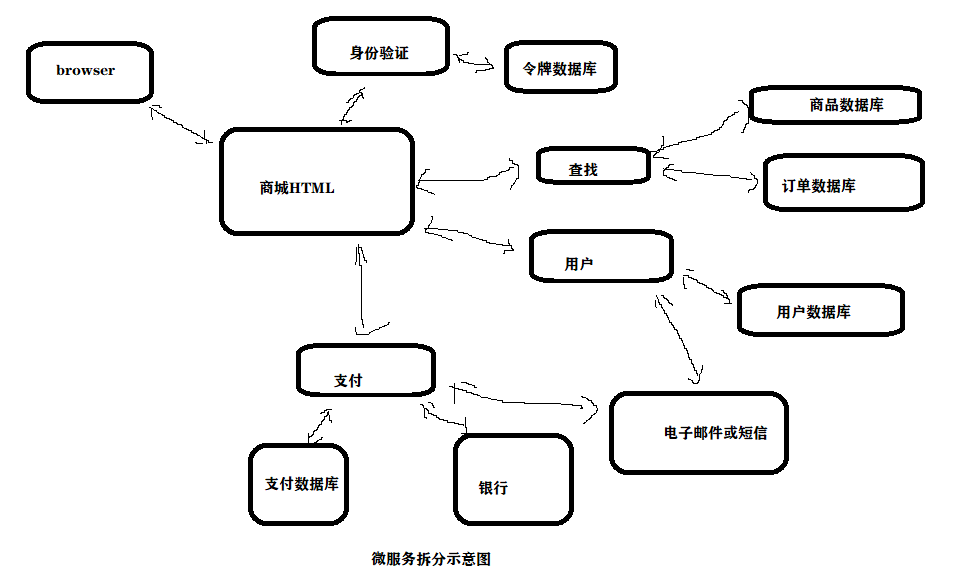
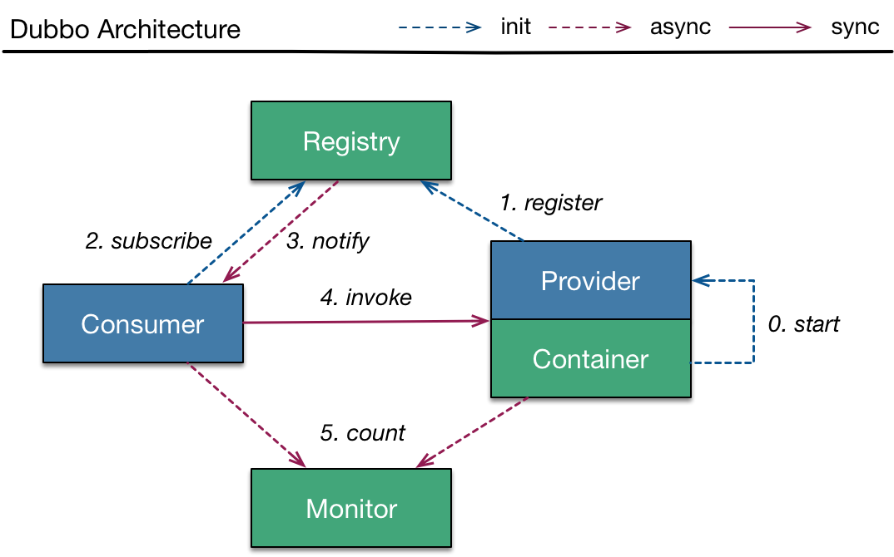

1

使用python做web开发面临的一个最大的问题就是性能，在解决C10K问题上显的有点吃力。

有些异步框架Tornado、Twisted、Gevent 等就是为了解决性能问题。

这些框架在性能上有些提升，但是也出现了各种古怪的问题难以解决。

在python3.6中，官方的异步协程库asyncio正式成为标准。

在保留便捷性的同时对性能有了很大的提升,已经出现许多的异步框架使用asyncio。

使用较早的异步框架是aiohttp，它提供了server端和client端，对asyncio做了很好的封装。

但是开发方式和最流行的微框架flask不同，

flask开发简单，轻量，高效。

正是结合这些优点, 以Sanic为基础，集成多个流行的库来搭建微服务。 

Sanic框架是和Flask相似的异步协程框架，简单轻量，并且性能很高。

本项目就是以Sanic为基础搭建的python微服务框架。(思想适用于其他语言)

微服务是**一种架构风格**，

一个大型复杂软件应用由一个或多个微服务组成。

 系统中的各个**微服务可被独立部署**，各个微服务之间是松耦合的。 

每个微服务仅关注于完成一件任务并很好地完成该任务。 

在所有情况下，每个任务代表着一个小的业务能力。

# 传统的单体架构

举例来说：

一个商城，除了要有静态的HTML内容外，

还必须要有相关的模块，

比如用户模块，订单模块，商品模块，优惠券模块等等，

当用户对应用进行操作的时候，会伴随着针对数据库的一些SQL操作，

然后再经过渲染返回给HTML的页面，

整过过程都**相当于在一个应用的整体内进行**，

较少的对外部服务进行网络请求（比如注册时需要请求第三方短信验证），

在经典的LAMP架构中，每个传入的请求都会在数据库生成关联的SQL查询，然后服务器再使用模板引擎生成相应的HTML进行响应。

这种架构有很明显的优缺点，优点就是：

1.我们可以很容易的开始一个项目；

2.简化了数据的设计和组织；

3.部署应用也会相对简单

但他也有很明显的缺点：

1.我们如果想增加一些功能的时候，修改代码可能会影响到原来不相关的功能，对某部分代码的错误修改可能导致整个应用的崩溃

2.扩展应用的解决方案存在的限制：可部署多个实例，但若期中一个特定的功能占用了所有资源，则会影响整个应用

3.随着应用的迭代，代码库的增长，很难保证代码的干净和可控性。

如上图所示，这些微服务，诸如电子邮件的外部服务，将提供和单体应用相同的功能集，

这个架构中的**每个 组件都使用HTTP协议进行通信**，

**通过REST风格的web接口提供服务，**

每个微服务都在内部处理自己的数据结构，不需要中心化数据库，

使用普遍的数据格式如JSON输入输出数据，

任何语言都可生成和使用，最后通过HTTP请求和响应进行传输。

总体来说，微服务是一个轻量级的应用，

它可以通过良好的契约提供一组有限的功能，它是具有单一责任的组件，可独立开发和部署。

# 微服务架构

## 优点

1.分离开发团队的注重点，每个微服务都可由一个团队独立开发，每一次版本迭代只会在服务的内部进行，不会影响其他的应用，低耦合的开发模式，加快项目的进程。

2.如果在现成的微服务应用中进行跨越式的迭代，比如说更换语言和框架，我们可以把它隔离在一个微服务中，使用独立的数据库，让一小部分用户去试验这个方案，从而不影响整个应用的运行

3.更加灵活的扩展与部署，根据微服务的定义，我们可以将服务部署在不同性能的服务器上面，需要消耗CPU的放在性能优良的服务器上面，**只消耗内存的（如Redis这种内存数据库）我们可以部署在CPU稍微较差，而内存较大的服务器上**，从而减少了部署的成本

## 缺点

1.微服务若出现不合理的拆分，当你重构一些业务逻辑时，你的代码就会让你搔首踟蹰了，嘻嘻，如果你要实现一些功能，总是要部署两个微服务，或者你改变了一个微服务总会影响另一个数据模型时，你就该考虑合并两个微服务了

2.在微服务的构建过程中，使用了很多的网络交互，这也带来了问题，如有由于网络隔离或服务延迟，“商城HTML”无法及时调用相关的服务，这会产生严重的后果

3.假如用户添加的系统中来，进行某些数据操作时，是不是需要同步每一个服务，这样做会不会产生冗余呢，保持微服务的隔离的同时又要尽量避免数据的重复

4.兼容性的问题，可能会出现版本的不一致

5.测试上的问题，众所周知，产品要部署上线时肯定要经过相应的测试，但是微服务架构是一个分离的架构，不同于单体架构，他需要相应的工具才能进行测试，这也是限制微服务开发的一个难题。

# 微服务架构的实现方式

微服务架构最重要的就是使用什么方式进行服务间通信（也称作服务调用），按照通信方式的不同，主要可以分为同步通信和异步通信两种方式：

## 同步通信

同步调用比较简单，一致性强，但是容易出调用问题，性能体验上也会差些。

同步通信最常用的两种协议是RESTful和RPC，

而目前使用最广泛，最有名的两种微服务框架Spring Cloud和Dubbo分别使用了RESTful和RPC协议。

RESTful和RPC两种协议各有优势，具体使用要看业务场景。

首先一个微服务应用程序需要有服务的生产者和服务的消费者，

另外还需要一个注册中心（常见的有zookeeper和rabbitmq等）来管理和调度服务。

微服务架构的程序运行的一般步骤为：

1. 服务提供方，即生产者启动服务，并将服务提交到注册中心注册服务
2. 服务需求方，即消费者连接到注册中心，向注册中心发出请求，申请需要的服务
3. 注册中心根据消费者发出的请求来调度服务，将对应的服务提供者（生产者）的信息发送给消费者
4. 消费者和生产者之间建立连接，消费者调用服务
5. 记录服务调用过程中的信息

## 异步通信

异步通信一般通过消息中间件来进行服务间通信，

消息中间件能为调用之间提供的缓冲，确保消息积压不会冲垮被调用方，

同时能保证调用方的服务体验，继续干自己该干的活，不至于被后台性能拖慢。

不过需要付出的代价是一致性的减弱。

nameko框架就是一个采用异步通信方式的微服务框架，

采用RabbitMQ消息队列作为消息中间件，原理非常简单，使用起来也很方便。

# nameko

参考资料

1、python 微服务方案

https://www.cnblogs.com/ExMan/p/11134966.html

2、关于Python构建微服务的思考（一）

https://www.cnblogs.com/yushenglin/p/10838253.html

3、Python微服务框架nameko的简单使用

https://blog.csdn.net/eagleuniversityeye/article/details/102722741