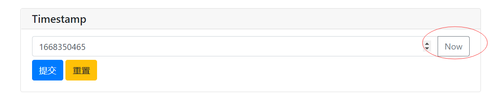
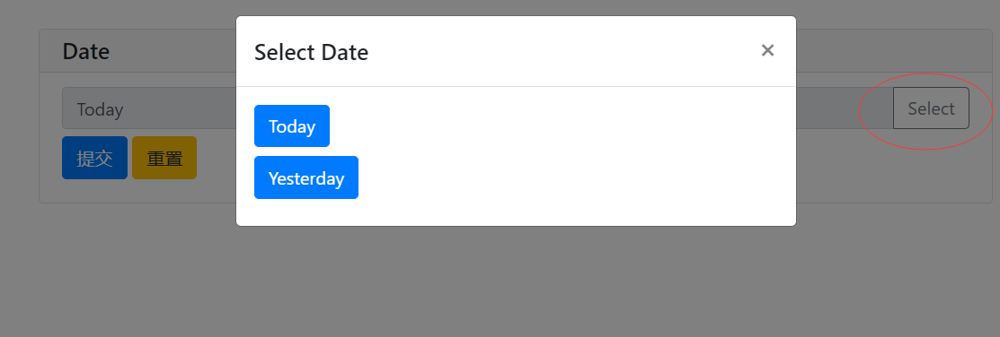
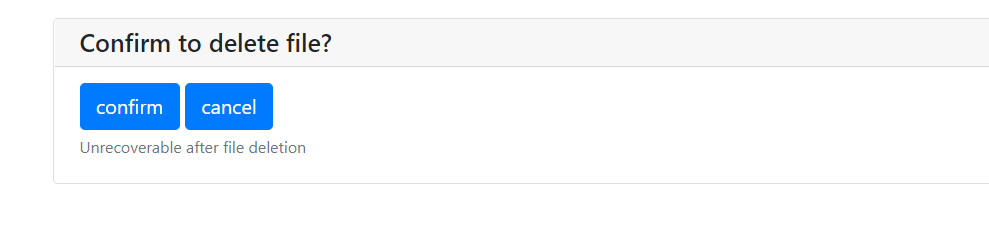
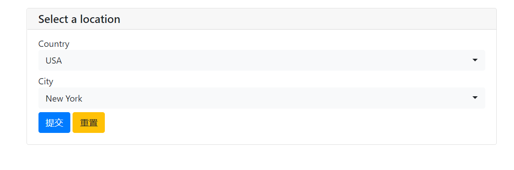
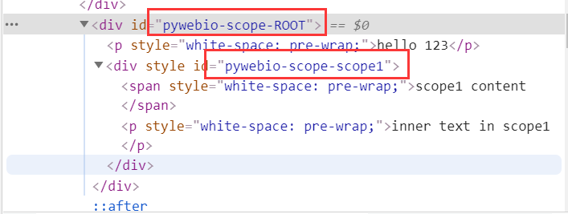
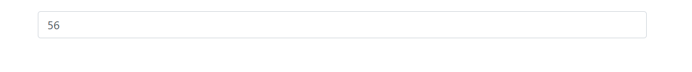
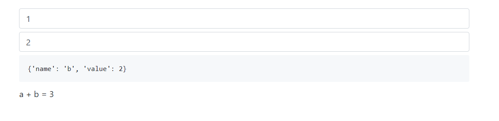

--

最近打算用python来做前端。发现了pywebio这个东西，觉得不错。

现在研究一下。


https://github.com/pywebio/pyweb.io-collateral

从这个里面看，有个pyweb.io的网站，可以帮助快速创建应用。

但是访问基本访问不了。可能是作者搭建的服务，但是服务很不可靠。

不管这个了。

# 资源收集

PywebIO 轻松制作一个数据大屏，代码只需100行

https://blog.csdn.net/weixin_38037405/article/details/122807489

这里有几个app，可以研究一下。

https://github.com/h1yung/pywebio_apps

这个狼人杀系统。算是比较完善的了。

https://github.com/StoneMoe/wolf

youtube channel

https://www.youtube.com/channel/UCgn68sp8z1HK6fgU2FxZG7g

搜索“powered by pywebio”，可以找一些网站基于pywebio的。

https://mc.dfrobot.com.cn/thread-313149-1-1.html

dashboard

https://github.com/wang0618/pywebio-dashboard

一篇文章

https://blog.csdn.net/qq_42766267/article/details/121178510

这个todolist不错。

https://github.com/ngshiheng/pywebio-todolist/blob/master/src/todolist.py

作者自己的一个小应用。

https://github.com/wang0618/mtag_tool

github topic

https://github.com/topics/pywebio

这个人也对pywebio提交了不少代码。

https://github.com/FHU-yezi/JianshuMicroFeatures

这个是对pywebio的扩展，虽然看起来没有使用价值，但是可以关注一下。

https://github.com/luxuncang/TypeWebIo

这个代码写到比较多。还进行了数据库操作。

是一个简单的搜索引擎。可以看看。

https://github.com/ngshiheng/burplist-frontend/

可以通过这个页面查看哪些项目用到了pywebio。

https://github.com/pywebio/PyWebIO/network/dependents

# 竞品

https://zhuanlan.zhihu.com/p/486698242

| 名字      | 基本信息                                                     | 优点                        | 缺点                                                   |
| --------- | ------------------------------------------------------------ | --------------------------- | ------------------------------------------------------ |
| dash      | 基于React的Python封装。可以用来编写全功能的web页面。需要先声明式布局。对于个人应用，优点太大了。 | 强大                        | 对于个人应用没有必要                                   |
| streamlit | api简单规范，上手很快。                                      | 上手快                      | 运行机制有些缺陷。会导致页面整个刷新。layout过于简单。 |
| pywebio   |                                                              | api功能定义、文档不够专业。 | 易学易用                                               |
| wave      |                                                              | widget丰富                  |                                                        |
|           |                                                              |                             |                                                        |


# 基本信息

pywebio提供了一系列的命令式的交互函数，在浏览器上获取用户输入和进行输出。

相当于把浏览器变成了一个富文本的终端。

可以用来构建简单的web应用，或者是基于浏览器的gui应用。

使用pywebio，开发者可以像开发python脚本一样（使用input和print进行输入输出）来编译应用。

不需要开发者具有html和js相关的知识。

pywebio还可以方便地整合进现有的web服务，非常适用于快速构建对gui要求不高的应用。


特性：

* 使用同步的方式（而不是回调）来获取输入（也就是input会阻塞），代码编写逻辑更加符合人的直觉。
* 非声明式布局，布局方式简单有效。
* 代码侵入性小，已有的脚本代码，只需要修改输入输出逻辑就可以改造为web服务。
* 支持整合到现有的web服务，可以与flask等框架集成。
* 支持基于thread和coroutine的执行模型。
* 支持集合第三方库实现数据可视化。


对Python的默认input和print的对等替换是：

input和put_text这2个函数。

pywebio的input也会阻塞直到获取到用户输入。

## 作者在v2ex的文章

https://www.v2ex.com/t/746349

类似功能的工具还有 dash 和 streamlit，它们和 PyWebIO 都各有特点。

https://github.com/plotly/dash ：可以用来编写全功能的 Web 页面，虽然不需要编写 html，需要先声明布局，且布局声明后无法动态改变。dash 采用“响应式”的程序模型，非常依赖回调。如果只是简单写一个小应用，dash 显得太重，需要的代码量也比 PyWebIO 更多。

https://github.com/streamlit/streamlit ：可以称得上神器，功能上和 PyWebIO 很相似，streamlit 更专注于机器学习和数据科学领域。不过 streamlit 应用的编写逻辑还是没有终端程序那么自然，但熟悉之后，编写 Web 服务需要的代码量比 PyWebIO 更少，另外，streamlit 不支持整合到现有的 Web 服务。


## 什么要写这个库

在日常开发中，经常会遇到这样的一个问题：

一个功能可以快速通过控制台脚本来实现，但是又希望把这个脚本通过web的方式来对外提供服务。

在讲脚本转成web服务的过程中，会有这些问题：

1、需要编写额外的前端代码来实现界面。

只是要2个前端页面，一个输入表单，一个是提交表单后的结果页。

2、由于http的无状态性，需要在各个后端接口之间传递状态，不需要额外的代码来检查状态的合法性。

比如，当整个业务流程需要提交多个表单的时候，在传统的web开发里，需要通过后端的session机制或者前端的hidden input机制来保存用户之前输入的数据。并且在每个接口都需要对传递过来的状态进行额外的校验。

3、web框架的使用逻辑和脚本代码的不一致性，也加大了将脚本转成web代码的难度。

例如控制台程序如果要进行一些耗时的操作，可以直接阻塞在主线程中。

而web应用，很多web框架对一个http的保持时间有限制，耗时的操作需要异步完成，前端需要定期轮询来实现进度的实时展示。


下面以一个答题闯关的例子来做演示。

游戏的规则是：

每次随机出题，答对当前题目才能进行下一题。

答错则游戏结束。

题目的数据以这种形式提供：

```
questions = [
	{
		'question': 'what is your name?',
		'options': ['aa', 'bb', 'cc'],
		'answer': 1
	},
	# ...
]
```

下面看看控制台、web应用、pywebio应用分别如何实现这个逻辑。

### 控制台

```
from random import shuffle

questions = []
shuffle(questions)

for cnt, q in enumarate(questions)
	print(f'问题{cnt}: {q}')
	print('选项:')
	answer = input('输入你的答案')
	if answer != q['answer']:
		print(f'游戏结束，你答对了{cnt}道题目')
		break
else:
	print('你通关了')
```

### flask web应用

需要2个前端页面：

一个question.html，展示问题和选项。

一个游戏结束时的显示。

```python
from flask import Flask, session, request, render_template
from random import shuffle

app = Flask(__name__)
questions = []

@app.route('/')
def index():
    questions_idxs = list(range(len(questions)))
    shuffle(question_idxs)
    session['question_idxs'] = questions_idxs
    session['question_cnt'] = 0
    
    current = questions[question_idxs[0]]
    return render_template(
    	'question.html',
        question = current['question'],
        options = current['options'],
        cnt = 0
    )
@app.route('/submit_answer', methods=['POST'])
def submit_answer():
    cnt = session['question_cnt']
    question_idxs = session['question_idxs']
    current_question = questions[question_idxs[cnt]]
    answer = request.form['answer']
    
    if answer != current_question['answer']:
        return f'游戏结束'
    next_question = ..
    return render_template(..)

app.run()
```

question.html内容省略。

在上面的flask app里，我们小心地使用session来维护状态。

否则应用很容易出现漏洞。

经过这么些操作，终于有一个可以呈现给用户的界面了。

但是很丑。要美化，就得写不少的css代码。

### pywebio方式

整体逻辑跟控制台很类似。


https://github.com/pywebio/PyWebIO/wiki/Why-PyWebIO%3F

# input

## 加上action的用法

```
from pywebio import start_server
from pywebio.input import *
from pywebio.output import *

import time


def main():
    def set_now_ts(set_value):
        set_value(int(time.time()))

    ts = input('Timestamp', type=NUMBER, action=('Now', set_now_ts))
    put_text('Timestamp:', ts)  # ..demo-only
if __name__ == '__main__':
    start_server(main, debug=True, port=8080)
```

效果是这样的：




```
from pywebio import start_server
from pywebio.input import *
from pywebio.output import *

import time
from datetime import date,timedelta

def main():
    def select_date(set_value):
        with popup('Select Date'):
            put_buttons(['Today'], onclick=[lambda: set_value(date.today(), 'Today')])
            put_buttons(['Yesterday'], onclick=[lambda: set_value(date.today() - timedelta(days=1), 'Yesterday')])

    d = input('Date', action=('Select', select_date), readonly=True)
    put_text(type(d), d)
if __name__ == '__main__':
    start_server(main, debug=True, port=8080)
```

效果是这样：




直接是actions的输入组件是这个效果。

```
def main():
    confirm = actions('Confirm to delete file?', ['confirm', 'cancel'],
                            help_text='Unrecoverable after file deletion')
    if confirm=='confirm':  # ..doc-only
        ...  # ..doc-only
    put_markdown('You clicked the `%s` button' % confirm)  # ..demo-only
if __name__ == '__main__':
    start_server(main, debug=True, port=8080)
```




## input update

```

def main():
    country2city = {
        'China': ['Beijing', 'Shanghai', 'Hong Kong'],
        'USA': ['New York', 'Los Angeles', 'San Francisco'],
    }
    countries = list(country2city.keys())
    location = input_group("Select a location", [
        select('Country', options=countries, name='country',
                onchange=lambda c: input_update('city', options=country2city[c])),
        select('City', options=country2city[countries[0]], name='city'),
    ])
    put_text(location)  # ..demo-only
if __name__ == '__main__':
    start_server(main, debug=True, port=8080)
```

效果就是改动上面的国家，下面的城市会跟着变化。



# output

## scope的概念

pywebio使用scope模型来控制内容输出的位置。

scope是输出内容的容器。（应该等价于html里的div标签）

你可以创建一个scope，然后把内容输出到里面。

每个输出函数（名字为put_xx格式的）都会把内容输出到一个scope。

默认为当前scope。

scope就是对应一个div。默认的div是pywebio-scope-ROOT。前缀是自动加的，你只要用最后的ROOT这个部分的就可以。



当前scope由use_scope函数来设置。

你可以用use_scope来开启并进入到一个新的输出域。

```
with use_scope('scope1'):
	put_text('text1 in scope1')
put_text('text in parent scope of scope1')
with use_scope('scope1'):
	put_text('text2 in scope1')
```

上面代码的输出是：

```
text1 in scope1
text2 in scope1
text in parent scope of scope1
```

use_scope还可以作为装饰器来使用。

```
from datetime import datetime

@use_scope('time', clear=True)
def show_time():
    put_text(datetime.now())
def task():
    show_time()
```

## 布局

默认的scope布局是垂直排列的。

output提供了3个布局函数。

```
put_row：会让里面的元素水平排列。
put_column
put_grid
```

可以组合来实现复杂布局。

```
def task():
    put_row([
        put_column([
            put_code('A'),None,
            put_row([
                put_code('B1'),None,
                put_code('B2'),None,
                put_code('B3'), None,
            ]),None,
            put_code('C'),
        ]),None,
        put_code('D'),None,
        put_code('E')
    ])
```

None表示空白。

## css样式

可以在put_xx().style('css code')这样来自定义样式。

# pin


```
def main():
    put_input('counter', type='number', value=0)
    while True:
        pin.counter = pin.counter + 1  # Equivalent to: pin['counter'] = pin['counter'] + 1
        time.sleep(1)
```

运行效果是：这个输入框里的数字每秒加1 。



## wait change

这个很好用。

```
def main():
    put_input('a', type='number', value=0)
    put_input('b', type='number', value=0)

    while True:
        changed = pin_wait_change('a', 'b')
        with use_scope('res', clear=True):
            put_code(changed)
            put_text("a + b = %s" % (pin.a + pin.b))
```




# 调试

## debug

在start_server函数里加上debug参数。这样改动后，会自动重启App。改动效果就马上可以自动看到。

```
start_server(task, debug=True, auto_open_webbrowser=True)
```

# 并发

## 手动创建线程

我们使用server模式（就是start_serer的方式来启动）

这个情况下，如果要在手动创建的线程里调用pywebio的交互函数。

需要把线程注册给pywebio。使用函数register_thread。

如果你新创建的线程里，没有使用pywebio的交互函数，那么不注册也没有关系。

但是你如果用了pywebio的函数，又没有注册。那就会出现异常。

SessionNotFoundException这个异常。

看一个例子。

```
from pywebio.input import *
from pywebio.output import *
from pywebio import start_server
from pywebio.session import register_thread


from datetime import datetime
import time
import threading

def show_time():
    while True:
        with use_scope(name='time', clear=True):
            put_text(datetime.now())
            time.sleep(1)
def task():
    t = threading.Thread(target=show_time)
    register_thread(t)
    put_markdown('# clock')
    t.start()

start_server(task, debug=True, auto_open_webbrowser=True)
```

这里就可以看出scope的作用。

clock的标题一直存在，time这scope的clear，只清理自己的内容。

# 高级模块

## session模块

提供了更多对session的控制

```
session.download(name, content)
	向user推送文件，浏览器会启动下载。
	
```


### set_env

为当前session设置标题、页面外观、输入栏等内容。

### info

info对象提供了用户的ip地址、语言、浏览器信息等内容。

```
{'user_agent': <user_agents.parsers.UserAgent object at 0x7fc49719f670>, 'user_language': 'zh-CN', 'server_host': '127.0.0.1:50455', 'origin': 'http://127.0.0.1:50455', 'user_ip': '127.0.0.1', 'request': HTTPServerRequest(protocol='http', host='127.0.0.1:50455', method='GET', uri='/?app=index&session=NEW', version='HTTP/1.1', remote_ip='127.0.0.1'), 'backend': 'tornado', 'protocol': 'websocket'}

```

### local

一个是一个session-local的存储对象。

用于存储每个session独立的数据。

### run_js

执行js代码。并返回对应的结果。

## pin模块

前面我们已经知道，pywebio的input都是阻塞的。

并且表单输入后，表单会消失。

但是有些时候，你需要表单一直存在。

这个时候，就需要用到pin模块了。

它的作用就是持续接收输入，不会消失。

pin相当于把input和output结合起来了。

```
例如输入是input、select这些。
输出是put_xx
而pin里面的函数，是put_input、put_select这样的。
```


## platform模块

主要是提供对各种platform的部署的支持。

# 一个使用思路

当你使用pywebio上遇到设计上的问题时，可以问自己这个问题：

如果在终端上做这个时候，我会怎么做？

那么在pywebio里，也就这么做就好了。

如果觉得还是不够好，那么就可以考虑使用回调机制或者pin模块。


# 与flask的集成

新建一个in_flask.py文件。

```
from pywebio.platform.flask import webio_view
from flask import Flask
from pywebio.input import *
from pywebio.output import *

app = Flask(__name__)

def task_func():
    name = input('input your name:')
    put_text(f'your name is {name}')

app.add_url_rule('/tool', 'webio_view', webio_view(task_func), 
    methods=['GET', 'POST', 'OPTIONS']
)
app.run(host='0.0.0.0', port=9090)
```

然后执行：python in_flask.py

访问ip/tool链接就可以了。

# 应用部署的方式

## path deploy

把整个目录进行部署。

使用函数：

```
path_deploy
path_deploy_http
```

server端会根据用户访问的url来确定要加载哪个文件来进行处理。

每个py文件，都要定义一个名字为main的函数作为处理函数。

```
def main():
	pass
	
```

无法访问以下划线开头的文件和目录。

如果文件在运行path_deploy后有改动，可以加上reload url参数来强制重新载入。

```
http://localhost:8080/xxx?reload
```

还提供了一个pywebio-path-deploy的命令。

这样用：

```
 ~/.local/bin/pywebio-path-deploy -h 0.0.0.0 -p 1535 ./
```

默认会把index.py作为首页来解析。

这个方式很好用。对我来说，足够了。

# 全局config

可以配置全局的风格。

```
from pywebio import config

config(title='hanliang soft', description='this is hanliang website', theme='yeti')

```

还可以单独给每个app加说明。

```
@config(title='this app one')
def main():
	pass
```


# 生产环境部署

在生产环境中，你可能会使用wsgi捉asgi服务器里部署web应用。

因为pywebio会在进程中存储session状态，

当你使用基于http的session（就是说用flask和django作为后端的时候）时，

request可能被分发到错误的process里。

因此，你只能启动一个process来处理请求。


如果你还是想用多进程来提供并发能力，一种方式是使用uvicorn+faskapi。

这些后端使用的是websocket跟浏览器通信，不存在上面基于http的问题。

# 静态资源托管

默认是使用cdn的来获取前端的静态资源。

如果你的web应用是部署在没有连接外网的环境中时，就需要自己找地方存放这些静态资源。

PyWebIO的静态文件的路径保存在 `pywebio.STATIC_PATH` 中，可使用命令 `python3 -c "import pywebio; print(pywebio.STATIC_PATH)"` 将其打印出来。

# 基于协程的会话

也就是使用async和await。

大部分情况下，你不需要使用这个。

pywebio里所有只能在协程会话使用的函数都有特别说明。

pywebio的会话实现是基于线程的。

用户每打开一个跟服务端的连接，pywebio就会启动一个线程来运行任务函数。


pywebio还提供了基于协程的会话。

基于协程的会话，接受一个async 函数作为任务函数。

新建一个async_task.py

```
from pywebio.input import *
from pywebio.output import *
from pywebio import start_server

async def async_task():
    name = await input('input your name:')
    put_text(f'your name is {name}')

start_server(async_task, auto_open_webbrowser=True)

```

运行：python async_task.py

在async函数里，可以用await来进行等待。

这样：

```
import asyncio 

async def async_task():
    put_text('hello ...')
    await asyncio.sleep(3)
    put_text('world')
```


# 官方仓库下的demos学习

先把demos下面的应用逐个学习一遍。

为了更好地学习，我自己搭建一个目录来写一遍。

现在已经全局安装了pywebio。

新建一个目录：pywebio-demos。


# 元素和主题

这个网址虽然是演示更换主题的。但是里面罗列了所有的元素的用法。可以从这里参考。

https://pywebio-demos.pywebio.online/theme

代码在这里

https://github.com/pywebio/PyWebIO/blob/dev/demos/theme.py

## 代码阅读

### config

```
main = {
    theme: config(theme=theme, title=f"PyWebIO {theme} theme")(page)
    for theme in ALL_THEME if theme != 'default'
}
```

config是import自pywebio，来自于platform.page里的config函数 。

```
def config(*, title=None, description=None, theme=None, js_code=None, js_file=[], css_style=None, css_file=[]):

title的app的标题。

```


# session

在看入门例子的时候，经常看到的一句代码是：

```
from pywebio.session import info as session_info
```

这个session的内涵是什么呢？

# defer_call

这个一般是修饰on_close。在关闭时清理资源用的。

# run_script

run_js和eval_js都是调用了run_script。

eval_js好像可以写得比较复杂。

```
 ## ----
        function_res = eval_js('''(function(){
            var a = 1;
            a += b;
            return a;
        })()''', b=100)
        put_text(function_res)  # ..demo-only

        ## ----
        promise_res = eval_js('''new Promise(resolve => {
            setTimeout(() => {
                resolve('Returned inside callback.');
            }, 2000);
        });''')
        put_text(promise_res)  # ..demo-only
```

test\13.misc.py这个里面有测试的。看看怎么写的。

## 我自己 自己搞清楚了

我的edid_parse这个例子，就已经把调用js的用起来。 

就是普通写jquery的方式。

比较不方便的是没有id选择器可以用。因为里面的元素都没有name这些属性。


# markdown previewer

这个代码在这里。

https://github.com/pywebio/PyWebIO/blob/dev/demos/markdown_previewer.py

这个比较实用。

# 五子棋实现

这个也不错。

可以进行对战。

# 去掉默认的footer

https://blog.csdn.net/qq_42761569/article/details/123352838


# 原理探究

## 前后端通信的协议

server向client发送的叫做command。

client向server发送的叫event。

command的构成：

```
{
	"command": "",
	"task_id": "",
	"spec": {
	
	}
}
```

event的格式：

```
{
	"event": "",
	"task_id": "",
	"data": {
	
	}
}
```


https://zhuanlan.zhihu.com/p/383232382

# 代码分析

```
class Session:
	会话对象，由backend创建。
	Session是不同的后端Backend与协程交互的桥梁：
	
	
WebSocketConnection
	一个抽象类。继承了abc.ABC
	有这些方法：
		get_query_argument
		make_session_info
		write_message
		closed
		close
	那么谁对这个抽象类进行了实现呢？
	tornado.py、fastapi.py、aiohttp.py都进行了实现。
	
WebSocketHandler
	对应一个WebSocketConnection
	class属性有：
		session_id
		session 当前连接关联的session
		connection 一个WebSocketConnection
		reconnectable
	构造方法
		
	实例方法：
		_send_msg_to_client
		send_client_data
		notify_connection_lost
		
		
start_server
	这个重要入口函数分析。
	来自于tornado.py。
	第一个参数是一个函数。表示app。也可以是函数list。还可以是dict。
		还可以是async函数。这个时候，使用的是coroutine based 的session。否则是threaded based session。
		
	tornado默认是跟浏览器用websocket通信的。
	tornado_http.py这个才是http方式通信的。
	tornado的pywebio的默认后端。
	
webio_handler


浏览器这边，是这个作为通信的主体。
WebIO.startWebIOClient
网页的模板是这个。
pywebio\platform\tpl\index.html

前端的处理代码，都要到ts里去看。
才能看到清晰的处理逻辑。
例如download的处理，是在download.ts里处理的。
class DownloadHandler implements CommandHandler

前端的入口是main.ts文件。
startWebIOClient
```

# pywebio_battery


# 参考资料

1、中文文档

https://pywebio.readthedocs.io/zh_CN/latest/