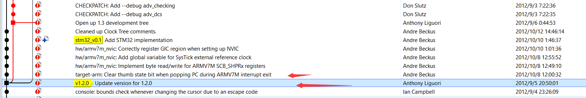

--

代码在这里：

https://github.com/beckus/qemu_stm32

因为stm32不是很复杂。所以适合作为切入口来分析qemu。

最近重新对qemu产生兴趣，是看到这个项目。

这个是从0开始写一个很小的rtos。

https://github.com/jserv/mini-arm-os

既有的就是qemu stm32的环境。

这样就很容易进行模仿。

先把qemu stm32的代码clone下来。这个是在一个老版本的qemu的基础上自己改的。

看看做的那300多次的修改提交改了些什么。

这个提交是第一次。

88a7608eba13ac882259341ca043c492f7be181c

是基于qemu 1.20版本开始做的。主要的修改者是Andre Beckus。




纯软件实现仿真器性能较低，往往需要 KVM （硬件虚拟化加速）帮助完成高频的 CPU 和内存虚拟化，QEMU 则负责 I/O 虚拟化。

模拟的是这个板子的。

https://github.com/beckus/stm32_p103_demos

这里关于这个板子的资料很齐全了。原理图什么的都有。

https://www.olimex.com/Products/ARM/ST/STM32-P103/

**STM32F103RBT6 CORTEX M3**

数据：

```
128K Bytes Program Flash, 
20K Bytes RAM, 
USB, CAN, x2 I2C, x2 ADC 12 bit, x3 UART, x2 SPI, x3 TIMERS, up to 72Mhz operation
```

主要的gpio是

PA：16个

PB：16个。

PC：16个。

PD：3个。接晶振。

可以接sd卡。

其余资料没有什么可看的。

编译：

```
./configure --disable-werror --enable-debug --target-list="arm-softmmu"
make
```

增加了这些文件的编译：

```
obj-y += stm32.o stm32_flash.o
obj-y += stm32_rcc.o stm32_gpio.o stm32_uart.o
obj-y += stm32_afio.o stm32_exti.o
obj-y += stm32_p103.o
```

hw\arm\stm32_adc.c 以这个为例，看看是怎么模拟这些外设的。

前面近600行都是宏定义。

然后是一个Stm32Adc的结构体。

寄存器都是一个int32，这样的。

```
    uint32_t
	 ADC_SR,
	 ADC_CR1,
```

这个函数，就是把寄存器的值都恢复默认值。

```
static void stm32_adc_reset(DeviceState *dev)
{
    Stm32Adc *s = STM32_ADC(dev);
    s->ADC_SR=0x00000000;
    s->ADC_CR1=0x00000000;
```

这样对外暴露模块

```
type_init(stm32_adc_register_types)
```

总共1000行左右。

hw\arm\stm32_f103c8.c 这个文件的对板级的模拟。

hw\arm\stm32_p103.c 这个也是。


```
    sudo apt-get install build-essential python zlib1g-dev libglib2.0-dev libpixman-1-dev libtool libfdt-dev

```

```
    ./configure --enable-debug --disable-xen  --disable-werror --target-list="arm-softmmu"
    make
```

xen support       yes 

这个可以去掉吧。

去掉才能编译通过。

编译出来的可执行文件是在./arm-softmmu/qemu-system-arm


现在就看arm os的编译。

这个还需要qemu的编译不一样。

```
./configure --disable-werror --disable-xen --enable-debug \
    --target-list="arm-softmmu" \
    --extra-cflags=-DSTM32_UART_NO_BAUD_DELAY \
    --extra-cflags=-DSTM32_UART_ENABLE_OVERRUN \
    --disable-gtk
```

把arm os的代码下载下来。

到00-HelloWorld目录下，先执行make，然后执行make qmeu，就可以运行。如下：

```
teddy@teddy-VirtualBox:~/work/test/qemu_stm32/mini-arm-os-master/00-HelloWorld$ make qemu 
Press Ctrl-A and then X to exit QEMU

qemu-system-arm -M stm32-p103 -nographic -kernel hello.bin
LED Off
Hello World!
main-loop: WARNING: I/O thread spun for 1000 iterations
```

