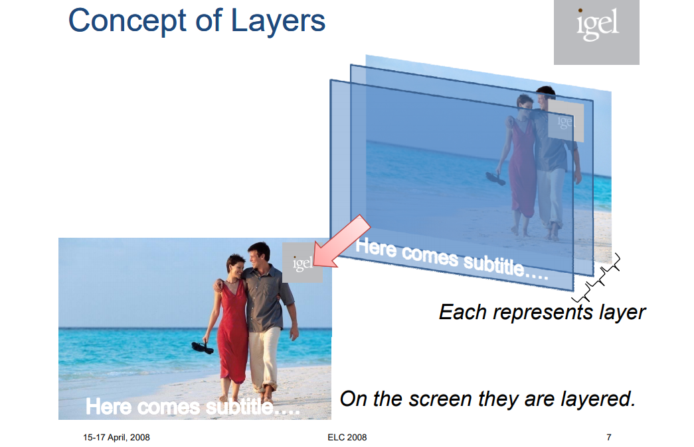

--

# 概念

directfb里的重要概念

layers

代表了独立的graphic buffer。

大多数嵌入式设备有1个以上的layer。

surface

保留的内存区域，用来存放pixel data。

directfb里的绘制和填充是在surface里进行。

surface使用的内存，可以是显存的，也可以是主存的。

primary surface

如果primary surface是single buffered，那么对primary surface的修改，直接就反应到显示屏上。

screen

这个就是对应显示屏。

参考资料

1、qt调用directfb接口

https://blog.csdn.net/yinjiabin/article/details/7815519

2、

这个pdf不错。

https://elinux.org/images/d/d4/Elc2008_directfb_gfx.pdf