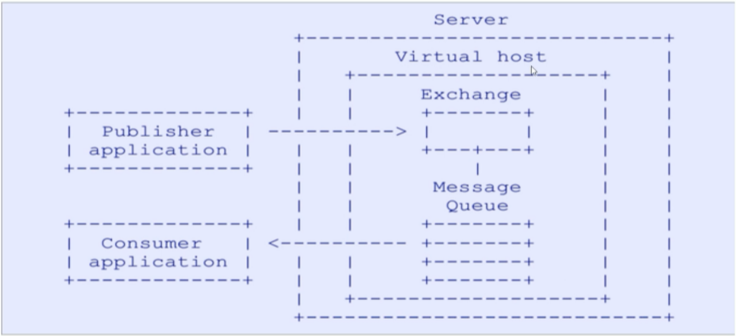

1

# 什么是rabbitmq

RabbitMQ是实现了**高级消息队列协议**（AMQP）的开源消息代理软件

RabbitMQ服务器是用Erlang语言编写的


以熟悉的电商场景为例，

如果**商品服务**和**订单服务**是两个不同的**微服务**，

在下单的过程中订单服务需要调用商品服务**进行扣库存操作**。

按照传统的方式，下单过程要等到调用完毕之后才能返回下单成功，

如果网络产生波动等原因使得商品服务扣库存延迟或者失败，会带来较差的用户体验，

如果在高并发的场景下，这样的处理显然是不合适的，那怎么进行优化呢？

这就需要消息队列登场了。


消息队列提供一个**异步通信机制**，

消息的发送者不必一直等待到消息被成功处理才返回，而是立即返回。

消息中间件负责处理网络通信，

如果网络连接不可用，消息被暂存于队列当中，

当网络畅通的时候在将消息转发给相应的应用程序或者服务，

当然前提是这些**服务订阅了该队列**。

如果在商品服务和订单服务之间使用消息中间件，**既可以提高并发量，又降低服务之间的耦合度**。


RabbitMQ就是这样一款我们苦苦追寻的消息队列。

RabbitMQ是一个开源的消息代理的队列服务器，用来通过普通协议在**完全不同的应用之间共享数据**。


**Erlang语言在数据交互方面性能优秀，有着和原生Socket一样的延迟**，

这也是RabbitMQ高性能的原因所在。可谓“人如其名”，RabbitMQ像兔子一样迅速。


MQ典型应用场景：

- 异步处理。把消息放入消息中间件中，等到需要的时候再去处理。
- 流量削峰。例如秒杀活动，在短时间内访问量急剧增加，使用消息队列，当消息队列满了就拒绝响应，跳转到错误页面，这样就可以使得系统不会因为超负载而崩溃。
- 日志处理
- 应用解耦。假设某个服务A需要给许多个服务（B、C、D）发送消息，当某个服务（例如B）不需要发送消息了，服务A需要改代码再次部署；当新加入一个服务（服务E）需要服务A的消息的时候，也需要改代码重新部署；另外服务A也要考虑其他服务挂掉，没有收到消息怎么办？要不要重新发送呢？是不是很麻烦，使用MQ发布订阅模式，服务A只生产消息发送到MQ，B、C、D从MQ中读取消息，需要A的消息就订阅，不需要了就取消订阅，服务A不再操心其他的事情，使用这种方式可以降低服务或者系统之间的耦合。


# AMQP协议

AMQP协议是具有现代特征的**二进制协议**。

是一个提供统一消息服务的应用层标准高级消息队列协议，

是应用层协议的一个开放标准，为面向消息的中间件设计。


先了解一下AMQP协议中间的几个重要概念：

- Server：接收客户端的连接，实现AMQP实体服务。
- Connection：连接，应用程序与Server的网络连接，TCP连接。
- Channel：信道，消息读写等操作在信道中进行。客户端可以建立多个信道，每个信道代表一个会话任务。
- Message：消息，应用程序和服务器之间传送的数据，消息可以非常简单，也可以很复杂。有Properties和Body组成。Properties为外包装，可以对消息进行修饰，比如消息的优先级、延迟等高级特性；Body就是消息体内容。
- Virtual Host：虚拟主机，用于逻辑隔离。一个虚拟主机里面可以有若干个Exchange和Queue，同一个虚拟主机里面不能有相同名称的Exchange或Queue。
- Exchange：交换器，接收消息，按照路由规则将消息路由到一个或者多个队列。如果路由不到，或者返回给生产者，或者直接丢弃。RabbitMQ常用的交换器常用类型有direct、topic、fanout、headers四种，后面详细介绍。
- Binding：绑定，交换器和消息队列之间的虚拟连接，绑定中可以包含一个或者多个RoutingKey。
- RoutingKey：路由键，生产者将消息发送给交换器的时候，会发送一个RoutingKey，用来指定路由规则，这样交换器就知道把消息发送到哪个队列。路由键通常为一个“.”分割的字符串，例如“com.rabbitmq”。
- Queue：消息队列，用来保存消息，供消费者消费。

> 我们完全可以直接使用 Connection 就能完成信道的工作，为什么还要引入信道呢?

> 试想这样一个场景， 一个应用程序中有很多个线程需要从 RabbitMQ 中消费消息，或者生产消息，那么必然需要建立很多个 Connection，也就是许多个 TCP 连接。然而对于操作系统而言，建立和销毁 TCP 连接是非常昂贵的开销，如果遇到使用高峰，性能瓶颈也随之显现。 RabbitMQ 采用 TCP 连接复用的方式，不仅可以减少性能开销，同时也便于管理 。




```
sudo apt-get install rabbitmq-server
```

```
启动、停止、重启、状态rabbitMq命令

sudo rabbitmq-server start
sudo rabbitmq-server stop
sudo rabbitmq-server restart
sudo rabbitmqctl status
```

添加admin用户，密码设置为admin。

sudo rabbitmqctl add_user admin admin  

赋予权限

sudo rabbitmqctl set_user_tags admin administrator

赋予virtual host中所有资源的配置、写、读权限以便管理其中的资源

```
sudo rabbitmqctl set_permissions -p / admin '.*' '.*' '.*'
```

启动web管理界面。

```
sudo  rabbitmq-plugins enable rabbitmq_management
```

http://localhost:15672/

但是我登陆显示login failed。

是因为我前面忘了把admin添加为管理员导致的。

```
teddy@thinkpad:/etc/rabbitmq$ sudo rabbitmqctl list_users
Listing users ...
admin   []
guest   [administrator]
```

设置之后：

```
teddy@thinkpad:/etc/rabbitmq$ sudo rabbitmqctl list_users
Listing users ...
admin   [administrator]
guest   [administrator]
```


# python收发

python使用rabbitmq服务，可以使用现成的类库pika、txAMQP或者py-amqplib，这里选择了pika。

在命令行中直接使用pip命令：

```
pip install pika
```

recv.py

```
import pika

hostname='localhost'
parameters= pika.ConnectionParameters(hostname)
connection = pika.BlockingConnection(parameters)

channel = connection.channel()
channel.queue_declare(queue='hello')

def callback(ch, method, properties, body):
    print("recv {}".format(body))

channel.basic_consume('hello',callback)
print("waiting for message, press Ctrl+C to exit")
channel.start_consuming()
```

send.py

```
import pika
import random

hostname='localhost'
parameters=pika.ConnectionParameters(hostname)
connection = pika.BlockingConnection(parameters)

channel = connection.channel()
channel.queue_declare(queue='hello')

number = random.randint(1,1000)
body = "hello {}".format(number)

channel.basic_publish(exchange='', routing_key='hello', body=body)
print("send :{}".format(body))
connection.close()
```


参考资料

1、RabbitMQ（一）：RabbitMQ快速入门

https://www.cnblogs.com/sgh1023/p/11217017.html

2、Ubuntu18.04安装RabbitMQ(正确安装)

https://my.oschina.net/u/2364788/blog/2875902

3、Rabbitmq关于guest用户登录失败解决方法

https://blog.csdn.net/doubleqinyan/article/details/81081673