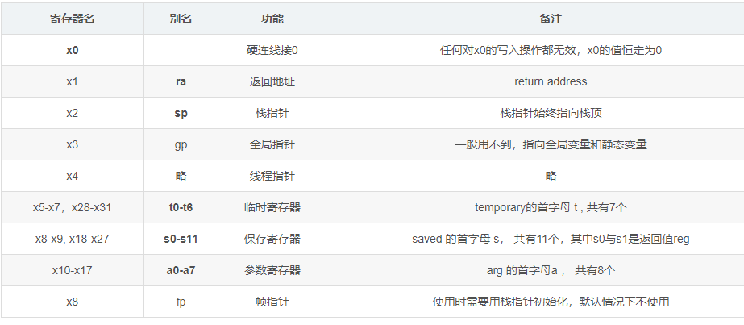

--

用riscv来加强对汇编和指令集的理解。

# 官方模拟器

https://github.com/riscv-software-src/riscv-isa-sim

先到这里下载工具链

https://github.com/riscv-collab/riscv-gnu-toolchain/releases/tag/2024.02.02

我当前下载的这个：

riscv64-glibc-ubuntu-20.04-gcc-nightly-2024.02.02-nightly.tar.gz

解压后的工具链如下图所示：


可以看到还带了qemu的。

我就全部用riscv64版本的吧。

先编译spike的。

```
export RISCV=/home/hanliang.xiong/work/tools/riscv
```

```
mkdir build
cd build

../configure --prefix=$RISCV
make
make install
```


```
riscv64-unknown-linux-gnu-gcc -o hello.o hello.c
```

这样可以运行：这个-L参数必须要的。不然是从/lib去找的。

```
qemu-riscv64 -L /mnt/fileroot/hanliang.xiong/work/tools/riscv/sysroot hello
```

但是spike运行不行：

```
spike pk hello
```

报错：

```
  what():  could not open pk; searched paths:
        . (current directory)
        /home/hanliang.xiong/work/tools/riscv/riscv64-unknown-elf/bin/ (based on configured --prefix and --with-target)
```

https://bbs.eetop.cn/thread-927857-1-1.html

看了这个，是因为pk是一个独立的工具。

https://blog.csdn.net/qq_45149657/article/details/134070279

工具地址是在这里：

https://github.com/riscv-software-src/riscv-pk/tree/2efabd3e6604b8a9e8f70baf52f57696680c7855

取代吗：

```
git clone https://github.com/riscv-software-src/riscv-pk
```

编译：

```
mkdir build
cd build
../configure --prefix=$RISCV --host=riscv64-unknown-linux-gnu
make 
make install
```

是安装到了这个目录

```
/home/hanliang.xiong/work/tools/riscv/riscv64-unknown-linux-gnu/bin
```

所以需要把这个目录添加到PATH里。

运行还是不行：

有路径配置错了，但是可以手动创建对应的目录，并把pk文件拷贝过去。

```
spike pk hello
terminate called after throwing an instance of 'std::runtime_error'
  what():  could not open pk; searched paths:
        . (current directory)
        /home/hanliang.xiong/work/tools/riscv/riscv64-unknown-elf/bin/ (based on configured --prefix and --with-target)
```

再运行，还是报错，需要静态连接的。

```
 spike pk hello.o
not a statically linked ELF program
```

再静态编译：

```
riscv64-unknown-linux-gnu-gcc -static -o hello hello.c
```

运行可以了：

```
hanliang.xiong@rd03-sz:~/work/test/riscv-isa-sim/test$ spike pk hello
hello riscv
```

## spike工具命令的作用

这里是关于这些程序的简要说明：

1. **spike:**
   - **作用：** `spike` 是一个 RISC-V ISA 模拟器。它允许您在模拟环境中运行 RISC-V 指令集架构的程序，提供对 RISC-V 指令的执行模拟。
   - **用法：** 通常通过在终端中运行 `spike` 命令，后跟要运行的 RISC-V 可执行文件的路径。

2. **spike-dasm:**
   - **作用：** `spike-dasm` 是一个 RISC-V 反汇编工具，用于将二进制指令转换回可读的汇编语言形式。
   - **用法：** 在终端中运行 `spike-dasm` 命令，后跟要反汇编的二进制文件的路径。

3. **spike-log-parser:**
   - **作用：** `spike-log-parser` 是一个工具，用于解析和分析 `spike` 模拟器的输出日志文件，提取关键信息。
   - **用法：** 在终端中运行 `spike-log-parser` 命令，后跟要解析的 `spike` 日志文件的路径。

4. **termios-xspike:**
   - **作用：** `termios-xspike` 是一个用于模拟 RISC-V Linux 系统上的串口终端设备的模块。它与 `spike` 结合使用，提供对串口终端的模拟支持。
   - **用法：** 与 `spike` 一起使用，通过在终端中运行 `spike --ext-tty` 命令来启用外部终端支持。

5. **xspike:**
   - **作用：** `xspike` 是 `spike` 模拟器的图形用户界面（GUI）版本。它提供了更直观的界面，方便用户进行交互和观察模拟的结果。
   - **用法：** 在终端中运行 `xspike` 命令来启动图形界面。

这些工具通常用于 RISC-V 开发、调试和分析中。`spike` 作为模拟器提供了在没有实际硬件的情况下运行 RISC-V 代码的能力，而其他工具则提供了一些额外的功能，如反汇编、日志解析和图形界面。

## 怎样给模拟器添加新的指令

1、在riscv/insns目录下，增加对应的头文件。

2、在riscv/opcodes.h里添加opcode和opcode mask。

3、添加指令到riscv/riscv.mk.in文件里。

4、rebuild 模拟器。

## 模拟器的交互模式

加上-d参数就行：

```
spike -d pk hello
```

然后h查看帮助信息。

## 查看hello的汇编代码

```
riscv64-unknown-linux-gnu-objdump -S hello > 1.asm
```

这个有8万行左右。

我看个简单的。

改一下hello.c的，里面就2个数相加。

```
int a,b,c;
a = 1;
b = 2;
c = a+b;
```

这样的还是不行。因为C语言的基本环境也被打包进来了。

## 汇编方式的helloworld

```
# hello-asm.s
.section .data
    hello_string:   .string "Hello, World!\n"

.section .text
    .globl _start

_start:
    # write system call
    li a7, 64          # system call number for write
    li a0, 1           # file descriptor 1 (stdout)
    la a1, hello_string  # pointer to the string
    li a2, 13          # length of the string
    ecall              # make system call

    # exit system call
    li a7, 93          # system call number for exit
    li a0, 0           # exit code 0
    ecall              # make system call
```

这个的等价C语言代码是：

```
write(stdout, "hello_string", 13);
exit(0);
```

编译步骤：

```
riscv64-unknown-linux-gnu-as  -o hello-asm hello-asm.s
riscv64-unknown-linux-gnu-ld -o hello-asm-exe hello-asm
```

运行：

```
qemu-riscv64 hello-asm-exe 
```

spike是运行不了的。


# riscv64-unknown-linux-gnu-gcc和riscv64-unknown-elf的区别

`riscv64-unknown-linux-gnu-gcc` 和 `riscv64-unknown-elf-gcc` 是两个不同的编译器，它们主要用于不同的应用场景：

1. **riscv64-unknown-linux-gnu-gcc:**
   - **用途：** 该编译器用于生成在运行在基于 Linux 操作系统的 RISC-V 体系结构上的用户空间应用程序的可执行文件。
   - **目标平台：** 生成的可执行文件是为运行在基于 Linux 的系统上的，因此包含了与 Linux 系统相关的系统调用和库。
   - **目标文件格式：** 生成的可执行文件通常采用 ELF 文件格式。

2. **riscv64-unknown-elf-gcc:**
   - **用途：** 该编译器用于==生成在嵌入式系统等不依赖于操作系统的环境==中运行的 RISC-V 体系结构上的应用程序的可执行文件。
   - **目标平台：** 生成的可执行文件是为运行在裸机或嵌入式系统上的，而不涉及类似 Linux 等操作系统的系统调用。
   - **目标文件格式：** ==生成的可执行文件通常采用一种裸机或嵌入式系统所需的格式，例如可执行和可链接格式（Executable and Linkable Format，ELF）。==

总的来说，两者的主要区别在于目标平台和用途。

`riscv64-unknown-linux-gnu-gcc` 主要用于 Linux 上的用户空间应用程序，

而 `riscv64-unknown-elf-gcc` 主要用于嵌入式系统和裸机环境。

在选择编译器时，要根据目标平台和运行环境来确定使用哪个版本的编译器。


# 各种在线环境

在线riscv汇编环境

https://riscvasm.lucasteske.dev/

康奈尔大学的在线解释器

https://www.cs.cornell.edu/courses/cs3410/2019sp/riscv/interpreter/


https://riscv.vercel.app/


https://rizwan3d.github.io/SharpRISCV


https://www.riscvassembler.org/

该软件包包含可以将 RISC-V 汇编代码转换为机器代码的工具和函数。

整个过程使用Python实现纯粹是为了易于理解和简单，而不是为了计算效率。

这些工具可用于将给定的代码行或整个文件转换为机器代码。

对于转换，输出文件类型为二进制、文本文件和打印到控制台。

支持的指令类型为 R、I、S、SB、U 和 UJ。

几乎支持所有标准指令，也支持大多数伪指令（请参阅有关添加伪/缺失指令的辅助函数）。

```
python3 -m pip install riscv-assembler
```

# RISC-V汇编快速入门

当今，强大的编译器将C或者更高级的语言编译成机器码后，其效能损失已经很小了，

再加上芯片的性能越来越强，让汇编语言显得可有可无。

但对于嵌入式来说至少在下面两种情况还需要汇编：

1是启动代码，2是OS的上下文切换。

另外在极端情况下使用汇编提高效率也是有必要的，

例如芯片内核非常新编译器优化不够好可以在非常清楚CPU的微结构下进行指令集编码提高性能。

==因此学习一种新的体系结构，了解其汇编语言是非常有必要的。==


参考资料

RISC-V汇编快速入门

https://lgl88911.github.io/2021/02/28/RISC-V%E6%B1%87%E7%BC%96%E5%BF%AB%E9%80%9F%E5%85%A5%E9%97%A8/

# 一文学懂risc-v汇编操作

risc-v 有32个通用寄存器（简写 reg），标号为x0 - x31



**对于有别名的寄存器，优先使用别名，更达意，更好记**

先认识即可，后续会逐渐认识它们的作用。

为啥寄存器只有32个？

寄存器的运算和读取速度是最快的，太少了显然不好，

但事实证明，寄存器数目如果太多了会导致访问寄存器的速度下降，也会造成速度下降。

==32个寄存器是risc-v设计者、实践者的选择。==

==上述寄存器都是64位的，也就是说上述寄存器可以存放64bits的数据==

在risc-v 中绝大多数指令的目的寄存器是第一个寄存器，第二第三个寄存器是源寄存器


https://blog.csdn.net/m0_62730135/article/details/126799687

# 参考资料

1、RISC-V学习基础（三）

https://blog.csdn.net/Caramel_biscuit/article/details/127363944

