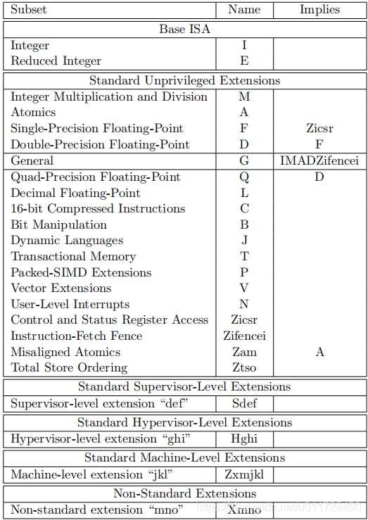

--

# 简介

RISC-V（Reduced Instruction Set Computing - V）是一种基于开放标准的指令集架构（ISA），旨在促进计算机系统硬件的创新和开发。RISC-V的设计是开放的，任何人都可以免费使用，并且可以基于此架构设计、实现和销售处理器芯片，而不受专利或许可的限制。

以下是一些RISC-V的关键特点和信息：

1. **开放标准：** RISC-V ISA 是一个完全开放的标准，由RISC-V国际组织维护。这使得任何人都可以自由地使用、设计和实现RISC-V处理器，而不必支付专利费用。

2. **模块化设计：** RISC-V的设计是模块化的，支持不同的标准扩展，允许处理器设计者选择他们需要的特性，从而使RISC-V可适用于各种应用和性能要求。

3. **简化指令集：** RISC-V采用精简指令集计算（RISC）的设计哲学，通过保持指令集的简单性来提高性能。这有助于简化处理器设计和提高执行效率。

4. **多级特权指令集：** RISC-V提供了多个特权级别，包括用户态、监管态和超级用户态。这支持操作系统和应用程序的有效管理和隔离。

5. **广泛的应用领域：** RISC-V被广泛应用于各种领域，包括嵌入式系统、物联网设备、服务器、网络设备等。它的灵活性和可定制性使得它适用于不同的应用场景。

6. **社区驱动发展：** RISC-V的发展是由一个全球性的社区推动的，各种组织和公司都参与其中。这有助于确保RISC-V的开放性和广泛的支持。

总的来说，RISC-V作为一种开放、灵活、模块化的指令集架构，为处理器设计和创新提供了更大的自由度。由于其开放性和适用性，RISC-V在业界逐渐受到关注，并在不同的应用领域取得了一定的成功。

# 发展历史

RISC-V的发展历史可以追溯到2010年，以下是其主要发展阶段：

1. **起源：**
   - **2006年：** RISC-V的起源可以追溯到加州大学伯克利分校（UC Berkeley）。当时，一些计算机体系结构的研究人员开始着手开发一种新的开放指令集架构，旨在促进研究和创新。
   - **2010年：** RISC-V项目正式开始，由Andrew Waterman、Krste Asanović等人领导。起初，项目的目标是设计一种教育用途的简单指令集架构，但后来演变为一种通用用途的、全面开放的指令集。

2. **RISC-V国际组织的成立：**
   - **2015年：** 为了推动RISC-V的标准化和推广，RISC-V国际组织成立。该组织由学术界和工业界的成员组成，致力于管理和推动RISC-V ISA的发展。

3. **标准版本的发布：**
   - **2011年至今：** RISC-V经历了多个版本的演进。最初的版本是32位架构，后来添加了64位扩展。随着时间的推移，RISC-V的标准版本得到了扩展和改进，支持了更多的特性和扩展，如浮点数、向量处理等。

4. **生态系统的成长：**
   - **2010年至今：** RISC-V生态系统逐渐发展，包括了各种开源实现、工具链、操作系统支持等。越来越多的公司和组织参与到RISC-V的开发和推广中，促进了该架构在不同领域的采用。

5. **商业应用和采用：**
   - **2015年至今：** RISC-V开始在商业领域得到广泛关注和采用。一些公司开始推出基于RISC-V的商用处理器，用于各种应用场景，包括嵌入式系统、物联网、服务器等。

6. **未来展望：**
   - **2024年：** 到了2024年，RISC-V有望继续在各个领域推广和发展。其开放性、灵活性以及可定制性使得它成为处理器设计领域的一个重要选择，未来可能会在更多的领域取得成功。

总体而言，RISC-V在短短的时间内取得了显著的进展，成为一种备受瞩目的指令集架构。其开放性和灵活性为学术界和产业界提供了独特的机会，推动了计算机体系结构的发展。

# 怎样快速入门riscv

快速入门RISC-V需要掌握以下基本步骤，包括了解RISC-V的基本概念、获取工具链和模拟器、编写简单的程序以及实践应用。以下是一个简单的入门指南：

1. **了解基本概念：**
   - 阅读RISC-V ISA手册：RISC-V ISA（指令集架构）手册是入门的基石。它包含了所有RISC-V指令的详细信息，可以从RISC-V国际组织的官方网站上获取。

2. **设置开发环境：**
   - 安装RISC-V工具链：获取并安装适用于您的操作系统的RISC-V交叉编译工具链，以便编写、编译和链接RISC-V汇编或C语言程序。
   - 安装模拟器：选择一个RISC-V模拟器，如Spike模拟器，以在没有硬件的情况下运行和调试RISC-V程序。

3. **编写简单程序：**
   - 编写RISC-V汇编程序：编写简单的RISC-V汇编程序，例如输出“Hello, RISC-V!”的程序。了解基本的指令格式和汇编语法。
   - 或者，使用C语言：如果您更熟悉C语言，编写一个简单的C程序并使用RISC-V交叉编译工具链进行编译。

4. **编译和链接：**
   - 使用RISC-V交叉编译工具链将程序源代码编译成RISC-V可执行文件。
   - 链接：使用工具链的链接器将生成的目标文件链接成可执行文件。

5. **运行和调试：**
   - 在RISC-V模拟器上运行程序，观察输出结果。如果有错误，使用模拟器提供的调试功能进行调试。
   - 如果您有硬件平台，您还可以在实际硬件上运行程序。

6. **深入学习和实践：**
   - 学习更多高级的RISC-V特性，例如多核支持、浮点数运算等。
   - 尝试编写更复杂的程序，深入了解RISC-V的各种指令和功能。
   - 探索RISC-V生态系统，了解相关工具、库和操作系统的支持。

7. **参与社区：**
   - 参与RISC-V社区，加入邮件列表、论坛或社交媒体，与其他RISC-V开发者交流经验、提问问题，获取更多帮助和资源。

通过以上步骤，您将能够迅速入门RISC-V，并开始编写、编译和运行简单的程序。不断深入学习和实践将使您更加熟练地使用RISC-V进行开发。

# 性能瓶颈

RISC-V架构的性能瓶颈可能涉及多个方面，具体取决于实现和应用场景。以下是一些可能影响RISC-V性能的因素：

1. **指令级并行性限制：** RISC-V是一种精简指令集计算（RISC）架构，其指令集相对较小，这在某些情况下可能会限制指令级并行性。某些复杂任务可能需要更多的指令来完成，从而限制了执行的效率。

2. **缓存和内存访问延迟：** 内存访问延迟是许多计算机系统的性能瓶颈之一，RISC-V处理器也不例外。如果程序无法充分利用缓存，或者存在访问内存的延迟，那么性能可能会受到影响。

3. **架构特定实现的问题：** 不同的RISC-V处理器实现可能有不同的性能特征。例如，一些处理器可能支持特定的扩展，如浮点数、向量处理等，而另一些可能没有。性能瓶颈可能与特定实现的架构选择和设计决策有关。

4. **流水线效率：** 处理器的流水线是指令执行的关键组成部分，其效率直接影响性能。流水线的深度、分支预测的准确性以及其他设计决策都可能对性能产生影响。

5. **硬件资源约束：** 在嵌入式系统等资源受限环境中，硬件资源可能成为性能瓶颈。处理器的核心数量、缓存大小、内存带宽等硬件资源限制都可能对性能产生影响。

6. **编译器优化：** 编译器在将高级语言转换为RISC-V指令的过程中发挥着关键作用。编译器的优化水平可能会影响生成的指令序列的效率。

7. **多核同步和通信开销：** 在多核系统中，同步和通信的开销可能成为性能瓶颈。合理设计并行算法和减小同步开销对于充分利用多核体系结构至关重要。

要解决这些性能瓶颈，通常需要综合考虑硬件设计、编译器优化、算法设计等多个方面。性能分析工具和调试器也是解决问题的关键工具，可以帮助定位和优化性能瓶颈。

# 发展规划

截至我的知识截断日期（2022年1月），RISC-V的发展规划主要涉及以下几个方面：

1. **标准的演进：** RISC-V国际组织会持续推动RISC-V ISA标准的演进，以满足不断变化的需求。这可能包括添加新的指令集扩展、优化现有指令集、支持更多的应用场景等。标准的演进通常会经过广泛的社区参与和讨论。

2. **生态系统的建设：** 为了推动RISC-V的广泛采用，生态系统的建设至关重要。这包括完善的工具链、编译器、模拟器、调试器等，以及丰富的操作系统和应用软件支持。RISC-V国际组织会与社区一起促进这些工具和软件的发展。

3. **支持多个应用领域：** RISC-V的灵活性和可定制性使其适用于多个应用领域，包括嵌入式系统、物联网设备、服务器、超级计算机等。RISC-V的发展规划可能包括更好地支持这些不同的应用场景，以及提供相应的硬件和软件解决方案。

4. **性能提升：** 随着技术的发展，RISC-V处理器的性能也会不断提升。这可能涉及到更高的时钟频率、更大的缓存、更高级的流水线设计等硬件层面的创新。同时，编译器和优化工具的发展也将为提升性能发挥关键作用。

5. **安全性和可信度：** 随着对计算机系统安全性的不断关注，RISC-V的发展规划可能还会强调在硬件和软件层面提供更强的安全性和可信度。这可能包括硬件安全功能、安全指令扩展、以及相关的编程模型和工具。

6. **教育和培训：** 为了促进更多人理解和使用RISC-V，教育和培训计划也是发展规划的一部分。这可能包括提供在线教育资源、举办研讨会和培训班，以及支持学术界和工业界的合作项目。

请注意，RISC-V的发展是由一个全球性的社区推动的，因此规划和发展方向可能会根据社区的需求和反馈进行调整。随着时间的推移，可以期待RISC-V的发展规划继续适应不断变化的技术和市场要求。

# riscv的上限

RISC-V并没有固定的硬性上限。其设计理念的一部分是提供灵活性和可扩展性，以适应各种不同的需求和应用场景。因此，RISC-V的潜在性能上限取决于多个因素，包括硬件设计、指令集扩展、制程技术、编译器优化等。

以下是一些因素，可能影响RISC-V系统的性能上限：

1. **硬件设计：** RISC-V处理器的设计可能采用不同的架构配置、流水线深度、缓存层次结构等。更先进的硬件设计通常可以提供更高的性能。

2. **指令集扩展：** RISC-V的指令集可以根据需求进行扩展，例如添加浮点数、向量处理等扩展。这些扩展可以显著提高处理器的性能，尤其是在科学计算和图形处理等方面。

3. **制程技术：** 使用更先进的半导体制程技术（例如，7nm、5nm等）可以提高芯片的性能和效能，降低功耗。这将直接影响RISC-V系统的性能。

4. **多核设计：** 利用多核处理器可以提高整体系统性能，尤其是在并行处理任务时。RISC-V的设计支持多核处理器，因此可以通过增加核心数量来提高性能。

5. **编译器优化：** 编译器的质量和能力对性能有着直接的影响。高效的编译器优化可以使源代码更好地映射到底层硬件，从而提高执行效率。

6. **应用程序并行性：** 充分利用处理器的并行性可以提高系统性能。如果应用程序能够有效地并行执行任务，那么系统性能的上限将更高。

总体而言，RISC-V具有不断扩展性能上限的潜力。然而，要达到最高性能，需要在多个层面进行综合考虑和优化，包括硬件设计、指令集架构、制程技术、编译器优化以及应用程序的并行性。

# 商用产品

截至我的知识截断日期（2022年1月），RISC-V已经在一些商业产品中得到应用，尤其是在嵌入式系统、物联网设备、网络设备、存储控制器等领域。以下是一些已知的RISC-V实际商用产品和应用案例：

1. **SiFive处理器：** SiFive是一家领先的RISC-V IP（知识产权）提供商，他们的RISC-V处理器核心被广泛用于各种应用。SiFive的处理器被用于嵌入式系统、物联网设备和自定义芯片设计中。

2. **NVIDIA Deep Learning Accelerator（NVDLA）：** NVIDIA的深度学习加速器NVDLA中使用了RISC-V处理器作为其控制处理单元。NVDLA是一个用于嵌入式设备的深度学习加速器。

3. **Western Digital的RISC-V处理器：** Western Digital在其存储控制器芯片中采用了RISC-V处理器，用于执行存储系统的控制和管理任务。

4. **Andes Technology的RISC-V处理器：** Andes Technology是一家提供RISC-V处理器IP的公司，他们的处理器被广泛应用于嵌入式、网络和存储应用。

5. **GreenWaves Technologies的Gap8处理器：** GreenWaves Technologies开发的Gap8处理器采用RISC-V架构，专门设计用于低功耗边缘计算和物联网设备。

6. **Microchip的PolarFire SoC：** Microchip推出的PolarFire SoC集成了RISC-V处理器和FPGA，用于工业、通信和汽车等领域的应用。

请注意，RISC-V的商业应用正在不断增加，而且我的信息截断日期是2022年1月，可能会有新的商业产品和应用案例在此之后推出。要获取最新的商业应用信息，建议查阅RISC-V国际组织的官方网站以及相关行业新闻。

# 指令手册

http://riscvbook.com/chinese/RISC-V-Reader-Chinese-v2p1.pdf

# riscv的指令分类记忆

RISC-V指令集可以分为不同的基本类型，这些类型反映了指令的功能和操作。了解这些指令类型和规律有助于记忆和理解RISC-V指令集。以下是RISC-V指令的一些基本分类：

1. **R指令（Register）：**
   - R指令主要执行在寄存器之间的操作。
   - 例如，`add`（加法）、`sub`（减法）、`and`（按位与）等。
   - 格式：`opcode rd, rs1, rs2`。

2. **I指令（Immediate）：**
   - I指令执行寄存器和立即数之间的操作。
   - 例如，`addi`（加法立即数）、`lw`（加载字）、`sw`（存储字）等。
   - 格式：`opcode rd, rs1, imm`。

3. **S指令（Store）：**
   - S指令用于存储数据到内存中。
   - 例如，`sb`（存储字节）、`sh`（存储半字）、`sw`（存储字）等。
   - 格式：`opcode rs1, imm(rs2)`。

4. **B指令（Branch）：**
   - B指令用于分支操作，根据条件来决定是否进行跳转。
   - 例如，`beq`（等于时分支）、`bne`（不等时分支）、`blt`（小于时分支）等。
   - 格式：`opcode rs1, rs2, label`。

5. **U指令（Upper immediate）：**
   - U指令用于加载一个立即数到高位寄存器。
   - 例如，`lui`（加载立即数到高位寄存器）。
   - 格式：`opcode rd, imm`。

6. **J指令（Jump）：**
   - J指令用于无条件跳转。
   - 例如，`jal`（跳转并链接）。
   - 格式：`opcode rd, label`。

7. **Fence指令：**
   - `fence`指令用于同步内存访问，确保顺序性。
   - 格式：`fence`。

8. **系统指令（System）：**
   - 系统指令用于执行特权级别的操作，例如访问控制寄存器。
   - 例如，`ecall`（调用异常处理例程）。
   - 格式：`opcode`。

理解这些基本指令的分类和格式有助于记忆RISC-V指令集。此外，RISC-V的指令集设计相对简洁，因此通过实践和编程经验，您将能够更轻松地记忆和理解各种指令。可以通过参考RISC-V ISA手册获取详细的指令集信息。

# 小公司设计并制作一款基于riscv单片机芯片的流程是怎样的？

设计并制作一款基于RISC-V单片机芯片的流程涉及多个阶段，包括芯片设计、验证、制造、测试等。以下是一个概括的流程，不同公司和项目可能会根据具体情况有所调整：

1. **定义规格和需求：**
   - 确定单片机的应用领域、性能要求、功耗需求等，制定芯片的基本规格和需求。

2. **选择RISC-V核心：**
   - 选择适合项目需求的RISC-V核心，可以选择现有的开源核心或考虑定制设计。

3. **芯片架构设计：**
   - 基于规格和选择的核心设计芯片的整体架构，包括处理器核心、存储系统、外设接口等。

4. **RTL设计：**
   - 使用硬件描述语言（如Verilog或VHDL）进行寄存器传输级（RTL）设计，描述芯片的逻辑功能。

5. **功能验证：**
   - 进行功能验证，使用模拟器或验证平台验证RTL设计是否符合规格和需求。

6. **逻辑综合和布局布线：**
   - 进行逻辑综合将RTL代码转换为网表，然后进行布局布线设计，确定芯片内部各个功能模块的物理布局和连线。

7. **验证：**
   - 进行电路级仿真验证，确保电路级别的正确性和性能。

8. **生成掩模：**
   - 生成芯片的版图和掩模，这是用于制造的重要步骤。

9. **芯片制造：**
   - 将芯片的版图交给集成电路制造厂商进行生产。这个过程可能包括光刻、沉积、蚀刻等工艺步骤。

10. **封装和测试：**
    - 将制造好的芯片封装成芯片封装，然后进行测试。测试可能包括功能测试、电性能测试等。

11. **系统集成：**
    - 在目标系统中集成芯片，设计电路板和外围电路以满足应用需求。

12. **软件开发：**
    - 开发适用于RISC-V单片机的嵌入式软件，包括启动代码、驱动程序和应用程序。

13. **调试和验证：**
    - 在硬件上进行系统级调试和验证，确保硬件和软件的协同工作。

14. **量产和发布：**
    - 进行量产并发布到市场。

这是一个一般性的流程概述。每个阶段都可能需要详细的设计、验证和优化工作。此外，有关封装、测试和量产的步骤可能需要与制造商和供应商合作。整个流程需要团队中的硬件设计工程师、验证工程师、软件工程师等的紧密协作。

## 有哪些开源的riscv核心？

有许多开源的RISC-V核心可供选择，这些核心适用于各种应用场景。以下是一些常见的开源RISC-V核心：

1. **Rocket Core：**
   - **项目地址：** https://github.com/freechipsproject/rocket-chip
   - Rocket Core是由Berkeley开发的一个RISC-V处理器核心，属于Chisel硬件构建语言的一部分。它支持RV64GC（64位、带压缩指令集、带浮点数和整数乘法除法）。

2. **BOOM Core：**
   - **项目地址：** https://github.com/riscv-boom/riscv-boom
   - Berkeley Out-of-Order Machine (BOOM) 是另一个由Berkeley开发的RISC-V处理器核心，具有乱序执行的特性。

3. **PicoRV32：**
   - **项目地址：** https://github.com/cliffordwolf/picorv32
   - PicoRV32是一个小型的、开源的、可配置的32位RISC-V处理器核心，适用于FPGA等资源受限的环境。

4. **Spike：**
   - **项目地址：** https://github.com/riscv/riscv-isa-sim
   - Spike是RISC-V国际组织官方提供的模拟器，可以模拟RV32I和RV64I指令集。

5. **Zephyr RISC-V SoC模拟器：**
   - **项目地址：** https://github.com/zephyrproject-rtos/sim-sof
   - Zephyr是一个适用于嵌入式系统的实时操作系统，该项目提供了一个基于QEMU的RISC-V SoC模拟器。

6. **SweRV Core EH1：**
   - **项目地址：** https://github.com/chipsalliance/Cores-SweRV
   - SweRV是由CHIPS Alliance推动的一个开源RISC-V处理器项目，EH1是其中的一个64位处理器核心，支持RV64GC。

7. **Nemora：**
   - **项目地址：** https://github.com/legupcomputing/nemora
   - Nemora是一个支持RISC-V RV32I基本指令集的开源处理器核心。

8. **SerV：**
   - **项目地址：** https://github.com/olofk/serv
   - SerV是一个用于FPGA的简单、开源的RISC-V处理器核心，支持RV32I指令集。

这只是一小部分可用的开源RISC-V核心，许多其他项目也在不断涌现。选择核心时，要根据项目需求、性能要求和硬件资源等因素进行综合考虑。

## riscv怎么确保这些开源核心之间的兼容性

确保开源RISC-V核心之间的兼容性是一个重要的问题，尤其是在构建一个广泛可采用的生态系统时。以下是一些方法来确保这种兼容性：

1. **遵循RISC-V ISA标准：** 所有RISC-V核心都应该遵循RISC-V ISA（指令集架构）标准，这是确保指令级兼容性的基础。ISA标准定义了指令集的规范，==确保所有RISC-V核心都具有相同的基本指令集。==

2. **进行ISA测试套件验证：** RISC-V国际组织提供了一个ISA测试套件，用于验证处理器核心是否符合RISC-V ISA标准。通过运行这些测试，可以确保核心在指令级上是兼容的。

3. **采用相同的编译器和工具链：** 使用相同的编译器和工具链有助于确保生成的机器码是相同的，从而保证软件级的兼容性。一致的工具链还有助于确保相同的优化和代码生成策略。

4. **使用共同的标准接口和规范：** 如果核心需要与其他硬件模块（如外设、加速器）或软件组件进行交互，使用共同的标准接口和规范是确保互操作性的关键。例如，AMBA（Advanced Microcontroller Bus Architecture）是一种常见的总线协议，用于连接处理器核心和其他系统组件。

5. **参与RISC-V社区：** 参与RISC-V社区和开源项目可以确保核心开发者能够共享经验、讨论问题，并确保他们了解最新的开发标准和最佳实践。这也有助于提高开发者对整个生态系统的认识。

6. **开源的测试和验证工具：** 使用开源的测试和验证工具，例如模拟器、仿真工具、验证套件等，有助于开发者检测和纠正潜在的兼容性问题。

通过遵循标准、使用相同的工具链、测试套件以及参与社区，开源RISC-V核心的开发者可以最大限度地确保它们在硬件和软件层面上是兼容的。这种开放的标准化和协作的方式有助于构建一个更具有互操作性和可扩展性的RISC-V生态系统。

# RISC-V ISA标准

RISC-V ISA（指令集架构）标准是一种开放的、基于精简指令集（RISC）的指令集架构。RISC-V的ISA标准由RISC-V国际组织负责制定和维护。以下是RISC-V ISA标准的主要特点和组成部分：

1. **开放和免费：** RISC-V ISA是一种开放标准，允许任何人使用、实现和修改。它是免费提供的，任何公司或个人都可以在遵循开源许可协议的前提下使用RISC-V。

2. **模块化设计：** RISC-V ISA被设计为模块化的，允许根据特定需求选择性地添加标准的扩展，而不是采用单一的固定指令集。这种设计灵活性使得RISC-V能够适应不同的应用领域。

3. **支持不同位宽：** RISC-V ISA支持不同的位宽，包括32位（RV32）、64位（RV64）和128位（RV128）。这使得RISC-V可在各种设备上应用，从嵌入式系统到高性能服务器。

4. **多级特权级别：** RISC-V ISA定义了多级特权级别，包括用户级别、监管级别（Supervisor Level）和机器级别（Machine Level）。这样的层次结构使得RISC-V能够支持操作系统和应用程序的多层次运行。

5. **基本整数指令集（RV32I/RV64I）：** RISC-V的基本整数指令集包括RV32I和RV64I，分别适用于32位和64位系统。这些指令集包括一组常见的整数运算指令，如加法、减法、逻辑运算等。

6. **标准扩展：** 除了基本整数指令集，RISC-V还定义了一系列标准扩展，如乘法与除法扩展、原子操作扩展、浮点数扩展等。这些扩展可以根据需要进行选择性地添加到基本整数指令集中。

7. **压缩指令集（C扩展）：** RISC-V定义了一种压缩指令集，用于减小指令存储空间，特别适用于嵌入式系统和存储受限的环境。

8. **向量指令集（V扩展）：** RISC-V正在推进向量指令集的发展，以支持高性能计算和数据并行处理。

RISC-V ISA标准的开放性和灵活性使其适用于各种应用领域，并促使了全球范围内的RISC-V生态系统的发展。有关RISC-V ISA的详细信息和最新更新，建议查阅RISC-V国际组织的官方网站和相关文档。

## isa命名规律

https://blog.csdn.net/u011728490/article/details/118873567

# riscv规范列表

https://riscv.org/technical/specifications/

规范手册是在github上托管，用adoc格式。

https://github.com/riscv/riscv-isa-manual

关于adoc格式，看这里：是跟markdown类似的标记语言。

https://blog.csdn.net/networkhunter/article/details/103522769

## 规范的状态查询

这个wiki也是基于confluence的。

https://wiki.riscv.org/display/HOME/Specification+Status

https://wiki.riscv.org/display/HOME/Home

## 软件生态

https://wiki.riscv.org/display/HOME/RISC-V+Software+Ecosystem

工具链项目：

- binutils
- gcc
- gdb
- glibc
- llvm
- newlib

操作系统

- linux

模拟器和仿真器

- qemu
- spike

语言运行时

- go
- php
- rust
- v8
- java

# rv32 和rv64对比

RISC-V的架构有两个主要的变体：RV32和RV64。这两者的区别在于寄存器的位数，即32位和64位。以下是它们之间的一些对比：

1. **寄存器位数：**
   - **RV32：** 32位寄存器架构，所有通用寄存器都是32位宽。
   - **RV64：** 64位寄存器架构，所有通用寄存器都是64位宽。

2. **地址空间：**
   - **RV32：** 32位地址空间，即寻址范围为2^32字节（4 GB）。
   - **RV64：** 64位地址空间，即寻址范围为2^64字节，这是一个非常巨大的地址空间。

3. **指令宽度：**
   - **RV32：** 指令长度为32位。
   - **RV64：** 指令长度为32位，仍然是32位宽，没有增加指令宽度。

4. **运算性能：**
   - **RV32：** 在某些情况下可能比RV64更高效，因为32位数据需要的内存空间较小，有时可以更好地利用缓存。
   - **RV64：** 对于需要更大寄存器和地址空间的计算密集型任务，提供更高的性能。

5. **内存访问：**
   - **RV32：** 32位宽的内存访问。
   - **RV64：** 64位宽的内存访问。

6. **通用寄存器数量：**
   - **RV32：** 32位寄存器架构通常有32个通用寄存器（x0 到 x31）。
   - **RV64：** 64位寄存器架构通常有32个通用寄存器（x0 到 x31），以及额外的32位寄存器（x32 到 x63）。

选择RV32还是RV64通常取决于特定应用的需求。对于一些嵌入式系统和轻量级应用，RV32可能足够，而对于一些需要更大内存和高性能计算的应用，则可能选择RV64。在选择时，还需要考虑开发工具链、库和操作系统的可用性。

# buildroot里的riscv

这是 Buildroot 配置文件（通常是`config`文件）中定义的一组配置项，用于选择 RISC-V 指令集的不同扩展（ISA - Instruction Set Architecture）。每个配置项对应于 RISC-V 指令集中的一个扩展。让我简要解释每个配置项：

1. **BR2_RISCV_ISA_RVI:**
   - 对应于 RISC-V 的基本整数指令集（RISC-V Integer ISA）。

2. **BR2_RISCV_ISA_RVM:**
   - 对应于 RISC-V 的整数乘法和除法扩展（RISC-V Integer Multiplication and Division ISA）。

3. **BR2_RISCV_ISA_RVA:**
   - 对应于 RISC-V 的原子指令扩展（RISC-V Atomic ISA）。

4. **BR2_RISCV_ISA_RVF:**
   - 对应于 RISC-V 的浮点指令扩展（RISC-V Floating Point ISA）。

5. **BR2_RISCV_ISA_RVD:**
   - 对应于 RISC-V 的双精度浮点指令扩展（RISC-V Double Precision Floating Point ISA）。

6. **BR2_RISCV_ISA_RVC:**
   - 对应于 RISC-V 的紧凑指令集扩展（RISC-V Compressed ISA）。

这些配置项允许用户选择在构建系统时启用或禁用特定的 RISC-V 指令集扩展，以满足特定硬件平台或应用程序的需求。在构建过程中，根据这些配置项的选择，Buildroot 将会调整编译器选项和生成的目标代码，以匹配所选择的 RISC-V 指令集特性。

# 《手把手教你设计CPU——RISC-V处理器》

https://zhuanlan.zhihu.com/p/90104625