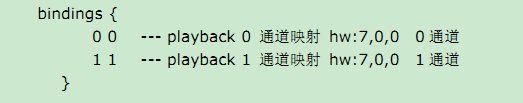
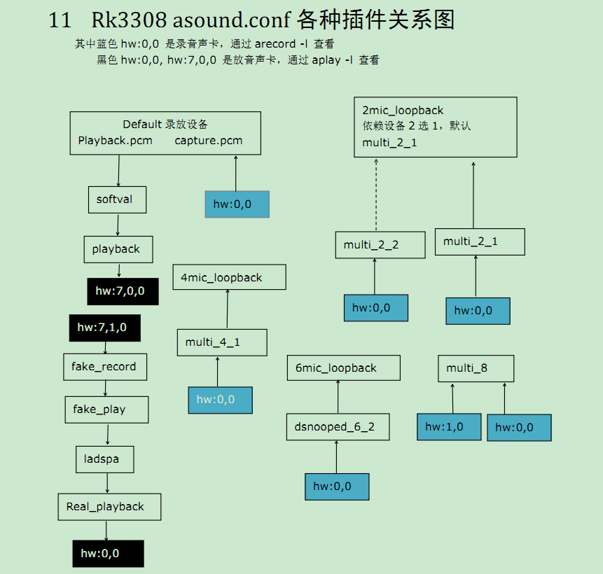
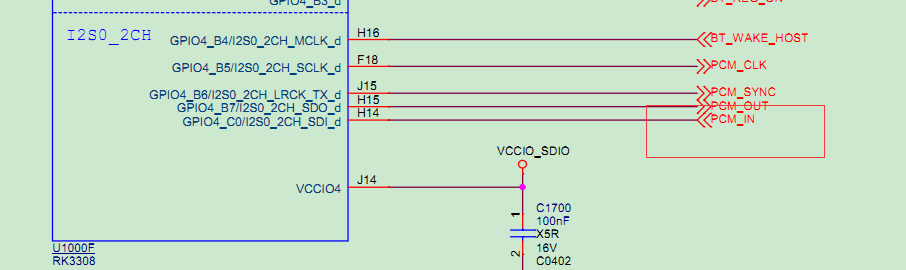
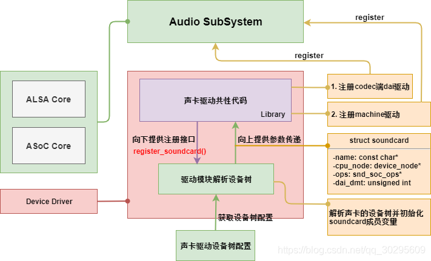
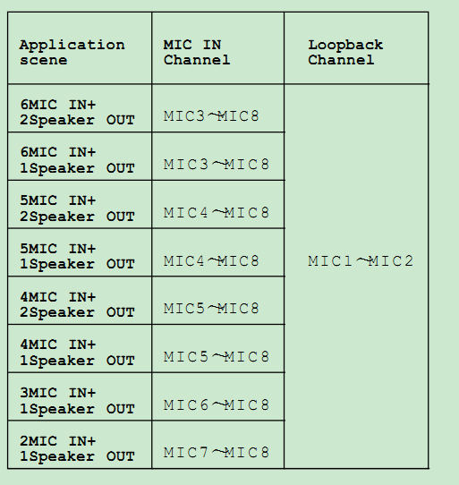

1

# 内部接口

IIS0 8CH SDI分配为IIS MIC或者模拟ADC的IIS接口，SDO 8CH预留接外设。

**•IIS0 2CH 分配为蓝牙PCM的接口。**

•IIS1 8CH 分配为数字功放的IIS的接口

•IIS1 8CH 可以通过IO MUX M0&M1分配到不同IO口。

举例： IIS1_8CH_LRCK_RX M0 对应 GPIO1_A6

​      IIS1_8CH_LRCK_RX M1 对应 GPIO1_C0

不管他们从哪个GPIO跟外设接口，功能都是一样的。

•IIS0 8CH+IIS1 8CH可以拼接成16通道 IIS IN+OUT。

•PDM 8CH分配为PDM MIC的接口，PDM接口也具有IO MUX功能。

•3308包含一组SPDIF IN及一组SPDIF OUT。

**•3308集成CODEC，CODEC通过内部IIS跟总线连接。**


RK3308 CODEC说明

•CODEC 包含8路MIC IN，一组LINE IN,一组LINE OUT及一组HPOUT。

8路MIC IN接模拟 MIC及回采 ,LINE OUT接模拟功放，HPOUT接 耳机 。


这个是一个复杂的题目，从驱动到应用层，把相关流程理清楚。

以arecord和aplay命令的执行为分析入口。

先看aplay。播放通路相对来说还简单点。

```
aplay 1.wav
```

涉及的代码：alsa-utils、alsa-lib、Linux驱动。

先看aplay.c的代码，在alsa-utils里。

实际是，arecord和aplay都是在aplay.c里，二者共用了参数，不同在于，看argv[0]是什么，就运行对应的分支。

这种技巧比较少见。

涉及的第一个数据结构是：snd_pcm_info_t。

这个结构体在alsa-lib下面的include/sound/asound.h里。

这个结构体表示的是：一个pcm流的信息，这个pcm来自于那个设备，方向是输入还是输出。

默认格式是U8的，采样率是8K。通道数是1 。

-l：这个参数表示列出device list。

-L：这个表示列出pcm list。

看看怎样列出device list的。

```
static void device_list(void)
	snd_card_next//这个就是去看/dev/snd/下面的pcm设置来查询的。
	while (card >= 0) {
		snd_ctl_open
		snd_ctl_card_info
		while (1) {
			snd_pcm_info_get_subdevices_count
		}
	}
```

SNDRV_CTL_IOCTL_CARD_INFO

这个就是ioctl的操作命令，在内核头文件里也有。

看看这个是在哪里进行实现。

在kernel/sound目录下，是这里：

```
./core/control_compat.c:462:    case SNDRV_CTL_IOCTL_CARD_INFO:
./core/control.c:1478:  case SNDRV_CTL_IOCTL_CARD_INFO:
```

当前内核里，音频修改配置这样。

oss相关的都是关闭的。

```
CONFIG_SOUND=y
# CONFIG_SOUND_OSS_CORE is not set
CONFIG_SND=y
CONFIG_SND_TIMER=y
CONFIG_SND_PCM=y
CONFIG_SND_DMAENGINE_PCM=y
CONFIG_SND_JACK=y
# CONFIG_SND_SEQUENCER is not set
# CONFIG_SND_MIXER_OSS is not set
# CONFIG_SND_PCM_OSS is not set
CONFIG_SND_PCM_TIMER=y
CONFIG_SND_HRTIMER=y

CONFIG_SND_PROC_FS=y
CONFIG_SND_VERBOSE_PROCFS=y

CONFIG_SND_DRIVERS=y
# CONFIG_SND_DUMMY is not set
CONFIG_SND_ALOOP=y
```

CONFIG_SND_ALOOP 这个就是loopback。这个值得分析一下。

对应的platform节点在这里：

```
/sys/devices/platform/snd_aloop.0
```

```
/dev/snd/by-path # ls -lh                                                                     
lrwxrwxrwx    1 root     root          12 Jan  1 08:00 platform-acodec-sound -> ../controlC0  
lrwxrwxrwx    1 root     root          12 Jan  1 08:00 platform-snd_aloop.0 -> ../controlC7   
```

播放也没有什么特别的，就是open之后，进行write操作就好了。

需要看看amixer的那些配置项是怎样出来的。

分别起什么租用。

看看amixer scontrols怎样执行的。

```
} else if (!strcmp(argv[optind], "scontrols") || !strcmp(argv[optind], "simple")) {
		return selems(level) ? 1 : 0;
```

是通过`snd_mixer_open`来操作的。

这个是打开哪个设备节点？

没有设备，就是一个软件上的东西。

open之后，得到一个handle。

然后用attach函数把handle和硬件声卡关联起来。card是一个字符串，默认是”default“。

```
snd_mixer_attach(handle, card)
```

当前列出有这些字符串：

```
/ # amixer scontrols                            
Simple mixer control 'Master',0                 
Simple mixer control 'Speaker hard mute',0      
Simple mixer control 'ADC ALC Group 0 Left',0   
Simple mixer control 'ADC ALC Group 0 Right',0  
Simple mixer control 'ADC ALC Group 1 Left',0   
Simple mixer control 'ADC ALC Group 1 Right',0  
```

Speaker hard mute 这种字符串是在哪里写的？内核驱动里吗？

是的，在这里：

```
./sound/soc/codecs/rk3308_codec.c:830:  SOC_ENUM_EXT("Speaker hard mute", rk3308_hpf_enum_array[0],
```


# asound.conf里的配置对通路的影响


# 音量控制

## 耳机音量调节

我试了这个，有作用。

```
amixer sset 'DAC HPOUT Left' 100%
amixer sset 'DAC HPOUT Right' 100%
```

用cget和cset。跟上面的实际上是同一个东西。

```
amixer cget name='DAC HPOUT Left Volume'
amixer cset name='DAC HPOUT Left Volume' 15
```

## 调节mic增益

内置的codec

```
Group0
	对应mic1和mic2
Group1:
	对应mic3和mic4
Group2
	对应mic5和mic6
Group3
	对应mic7和mic8
```

ADC MIC前缀，表示调节前级MIC PGA线性放大增益。

ADC ALC前缀，表示调节后级ALC线性放大增益。

```
amixer cset name='ADC ALC Group 2 Left Volume' 31
amixer cset name='ADC ALC Group 2 Right Volume' 31
amixer cset name='ADC ALC Group 3 Left Volume' 31
amixer cset name='ADC ALC Group 3 Right Volume' 31
```





# ladspa

这个是一个插件的名字。

表示：Linux Audio Developer's Simple Plugin API (LADSPA)

一般是用来调节eq的。


http://www.ladspa.org/


# eq_drc_process



这个进程在系统里扮演了什么角色？


pdm_i2s_dais: 这个是适配麦克风阵列板的或者数字mic的


1. 数字音频总线跟内置codec mic是不一样的通道
2. 数字音频接口数据拼接： capture,channel-mapping = <6, 2>;表示pdm占据前6ch，i2s占据后2ch，构成录音8ch
3. 如果要用内置的codec mic录音就要配置内置codec并检查原理图上的耳机座子是否有接入mic


# 音频信号如何传递给喇叭的

首先，蓝牙收到的是编码的音频数据。

这个数据是到8723ds芯片上。

8723跟rk3308的有个I2S接口连接起来。有PCM_OUT和PCM_IN引脚。



这个为什么是disable的？

```
&bluetooth_sound {
	status = "disabled";
};
```

```
	bluetooth_sound: bluetooth-sound {
		status = "disabled";
		compatible = "rockchip,multicodecs-card";
		rockchip,card-name = "rockchip,rk3308-pcm";
		rockchip,mclk-fs = <128>;
		rockchip,cpu = <&i2s_2ch_0>;
		rockchip,codec = <&dummy_codec>;
		rockchip,format = "dsp_b";
		rockchip,bitclock-inversion = <0>;
		rockchip,wait-card-locked = <0>;
	};
```

而这个又是使能的。

```
&i2s_2ch_0 {
	status = "okay";
	#sound-dai-cells = <0>;
	rockchip,clk-trcm = <1>;
};
```

这个是在./sound/soc/codecs/bt-sco.c文件里，可以看出是蓝牙音频的一部分。

```
	pcm_codec: pcm-codec {
		compatible = "delta,dfbmcs320";
		#sound-dai-cells = <0>;
	};
```

acodec和acodec-sound的关系是什么？

acodec-sound算是声卡的意思。设备树写着：

```
compatible = "rockchip,multicodecs-card";
```

这张声卡的名字叫：

```
rockchip,card-name = "rockchip,rk3308-acodec";
```

这张声卡的资源，它的codec就是acodec。

```
rockchip,cpu = <&i2s_8ch_2>;
rockchip,codec = <&acodec>;
```

所以，acodec和acodec-sound的关系就是：acodec-sound可以看做实体声卡。acodec是这个声卡里来编解码器。

最后在板端sys下面看到的也只有这2个东西。

```
/sys/firmware/devicetree/base # ls acodec
acodec-sound/     acodec@ff560000/
```


**同理，bluetooth-sound也可以看做一张实体声卡。**

它对应的编解码器是dummy_codec

蓝牙声卡的compatible也是`rockchip,multicodecs-card`。


找到一台之前的机器，可以看到sys下面设备树，的确有pcm-codec这个节点。

```
/sys/firmware/devicetree/base/pcm-codec # ls
#sound-dai-cells  compatible        name              phandle
```

这个是不是必须有？如果没有，会怎么样？

看设备里，i2s的，只有2和5的是okay，其余的都是disabled状态。

pdm是disabled状态。


蓝牙音频这一块，是对应simple-audio-card的。

```
	sound_pcm {
		compatible = "simple-audio-card";
		simple-audio-card,format = "dsp_b";
		simple-audio-card,name = "rockchip,rk3308-pcm";
		simple-audio-card,mclk-fs = <256>;
		simple-audio-card,cpu {
			sound-dai = <&i2s_2ch_0>;
		};
		simple-audio-card,codec {
			sound-dai = <&pcm_codec>;
		};
	};
```

pcm_codec对应的就是蓝牙的。

```
	pcm_codec: pcm-codec {
		compatible = "delta,dfbmcs320";
		#sound-dai-cells = <0>;
	};
```


# dummy_codec

这个可以叫做虚拟声卡。

虚拟声卡的注册主要**应用于硬解码芯片的使用**，

硬件设计上**主控I2S直接接到该类芯片**，

**硬解码芯片能够将数字信号直接转换成模拟信号输出。**

同时，这类芯片**需要主控提供mclk、bclk**，那么就需要**注册个虚拟声卡来控制I2S的输出**，才能保证正常工作。


虚拟Codec设计思路就是**只提供SoC到Codec端的PCM接口**，

Codec端的内部路由不做控制。

统一化代码时需要将平台端与Codec端代码分析，设计思路如下所示：



#  asoc

这个是对于带内置codec的soc的芯片设计的代码框架。

一个soc自带的声卡，在内核里用snd_soc_card来描述。

```
struct soc_snd_card {
	struct snd_card *snd_card;
	struct snd_soc_dai_link *dai_link;
}
```

snd_soc_dai_link代表了cpu跟内置codec的连接。

# 把4mic当2mic用

那就需要屏蔽2个mic的数据。怎么操作？

下面这个提问就符合我的需求。

```
现在3308-plus我想试一下录音，我知道这个DTS 里面    
rockchip,en-always-grps = <0 1 2 3>;
rockchip,adc-grps-route = <3 1 0 2>;
这两句话里面的 0  1 2 3 分别代表什么意思？谢谢。
比如我要用mic2 录音我该怎写，8通道全部录音怎么改。
```

```
1. rockchip,adc-grps-route = <3 1 0 2>;
------表示MIC7,MIC8属于通道1，2; MIC3,MIC4属于通道3，4；MIC1,MIC2属于通道5，6；MIC5,MIC6属于通道7，8
```


原理图里的说明，

如果是2个mic的场景，那么是接mic7和mic8的引脚作为输入。mic1和mic2，都选一个做回采，一般我们只接mic1做回采就够了。

4mic的场景，就是mic5/6/7/8作为mic输入。统一mic1作为回采就好了。



```
282的
rockchip,adc-grps-route = <3 0 1 2>;
220b的
rockchip,adc-grps-route = <2 3 0 1>;
```

282的是双mic的。这个配置表示mic7和mic8，mic1做回采。

220b的是4mic的。这个配置表示mic5/6/7/8做mic输入，mic1做回采。


参考资料

1、

http://wiki.t-firefly.com/zh_CN/Core-3308Y/faq.html

2、RK3308 2通道模拟MIC无法录音

http://dev.t-firefly.com/thread-101585-1-1.html

3、[RK3399][Android7.1] 移植笔记 --- 音频Codec RT5640添加

https://blog.csdn.net/kris_fei/article/details/80985042

4、RK系列SDK -- dummy codec虚拟声卡注册

https://blog.csdn.net/hb9312z/article/details/103315401

5、虚拟Codec设计思路

https://blog.csdn.net/qq_30295609/article/details/106767735

6、

https://winddoing.github.io/downloads/driver/alsa/belloni-alsa-asoc_0.pdf

7、3308-plus 录音

http://dev.t-firefly.com/thread-102119-1-1.html

8、

http://wiki.t-firefly.com/zh_CN/Core-3308Y/faq.html#nei-zhi-codec-de-mic-lu-yin-mei-sheng-yin