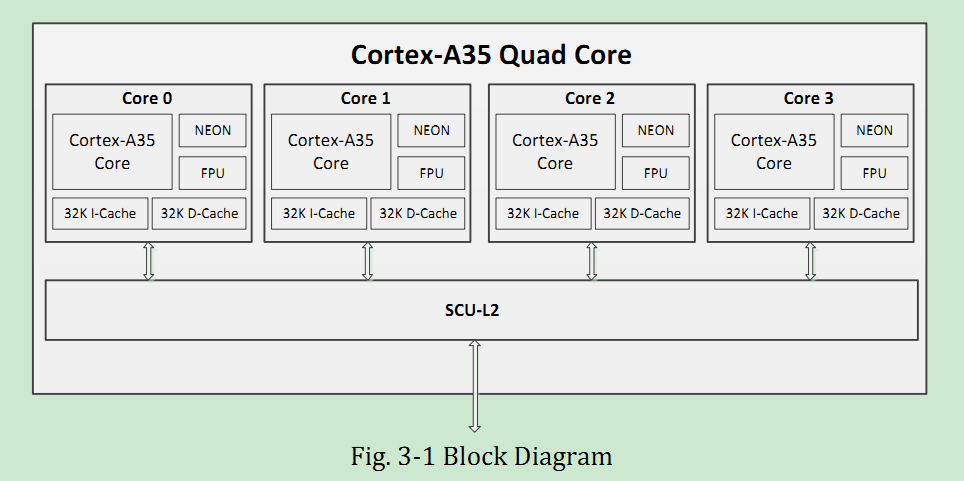

1

# 1 系统概览

## 1.2 系统启动

系统启动检测过程：

```
1、先检测nand。再检测emmc。再检测spi nor flash。
	再检测spi nand flash。
	再检测SD卡。
2、如果都没有检测到，初始化usb端口。
	进入烧录模式。
```

## 1.3 系统中断连接

提供了一个GIC，支持89个SPI和4个PPI。

每一个core，都产生一个irq和fiq。

SPI的，都是高电平触发。

PPI的，都是低电平触发。

都是不能修改的。

PPI从16号到31号，坑都有，但是只有4个用了。

SPI从32号开始。

## 1.4 dma硬件请求连接

3308提供了2个dma控制器。

可以给spi、uart、i2s、等接口用。

# 2 时钟和复位

简称为CRU。

CRU是一个APB从模块。

作用是产生内部时钟和复位。

CRU从PLL或者外部时钟源产生时钟信号。

在上电的时候，产生系统复位。看门狗复位。软件复位。

内嵌了4个PLL。


4个PLL分别是：

1、ARM PLL

2、DDR PLL

3、voice PLL0

4、voice PLL1

# 3 A35核心

3308的arm核心是A35的，4个核心。

L2 cache是256K。

A35是armv8架构的。

有如下的特征：

1、armv8的A64、A32、T32指令集的完整实现。

2、aarch32和aarch64都支持。

3、有trustzone。

L1的data cache和指令cache都是32K。



# 4 AXI perf

axi perf是一个模块。

axi是arm设计的一种soc芯片内部总线。


# 5 cpu boost

cpu boost加速cpu频率，当多核系统里只有一个核心在工作的时候。

支持这样的特性：

1、当只有一个core处于alive状态（其余3个处于WFI状态）时，alive的这个core会切换到更高频率的工作模式。


# 6 audio subsystem

音频子系统支持丰富的接口：i2s、pcm、pdm、tdm、spdif。

还有一个vad。

特性如下：

1、2通道的i2s。

2、8通道的i2s。

3、16通道的i2s。

4、8通道的pdm。

5、8通道的tdm。

6、内置acodec。

# 7 audio 串口控制器

这个是跟pdm配合的。不管。

# 8 audio codec

特征：

1、24bit的dac，93db的信噪比。

2、支持16到32欧姆的耳机输出和10K欧姆的lineout。

3、24bit的adc，92db的信噪比。

4、支持单端或者差分的mic输入。

5、自动电平调节ALC。这样可以让录音更加smooth。

6、纯逻辑处理。

7、低功耗。dac是3mA per channel。adc是2.5mA per channel。待机时小于0.05mA。

8、支持mono、stereo、5.1、7.1声道。

9、可编程的输入和输出模拟增益。

10、模拟信号1.8V。数字信号1.0V。

# 9 dma控制器

# 10 gic

是一个通用的GIC400。

产生中断信号给A35核心。

特征：

1、支持128个硬件中断输入。

2、可以支持哪个核心来处理中断。

# 13 内部sram


参考资料

1、

https://blog.csdn.net/tristan_tian/article/details/89393045