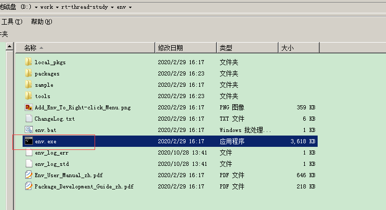
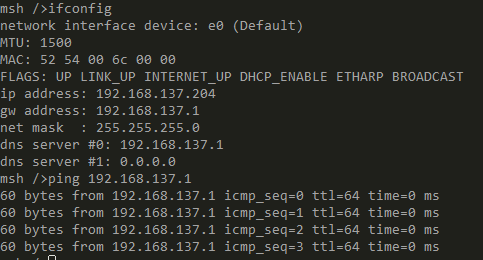
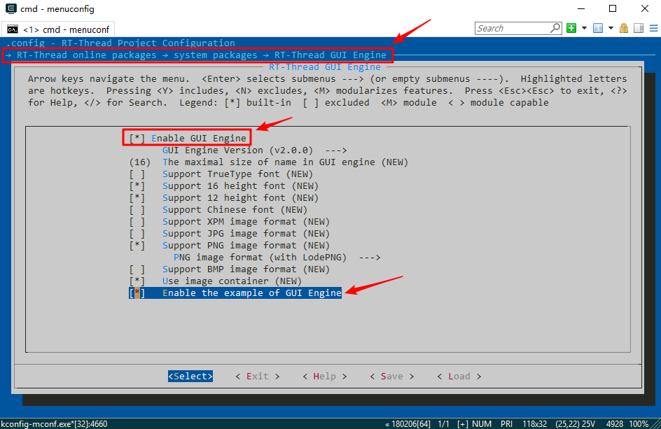
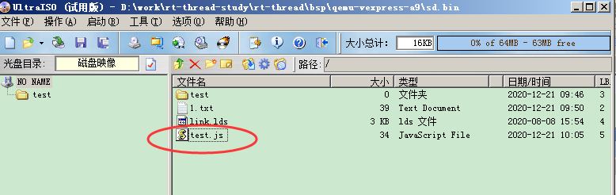
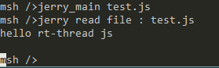

1

下载rt-thread源代码。

下载env工具。解压放好。

下载tap网卡。tap安装后，会产生这样一个网卡。


选中，按F2，选择给这个网卡重命名为qemu。

然后把有线网卡，右键选择共享，选中共享给qemu网卡。

把下面这个目录添加到PATH环境变量。

D:\work\rt-thread-study\env\tools\qemu\qemu32

双击打开env.exe文件。



会弹出命令行界面。

在命令行界面，切换到bsp/qemu-vexpress-a9目录下，执行scons进行编译。

在命令行解码，执行qemu。就可以运行。

默认sd.bin没有被格式化的。

在rt-thread里，执行格式化：

```
mkfs sd0
```

然后关闭当前命令行窗口。

然后再启动。SD卡就可以正常使用了。

现在网卡还没有正常工作。

打开qemu.bat文件。

在qemu命令的最后面加上：

```
-net nic -net tap,ifname=qemu
```

重新启动qemu。在bsp/qemu-vexpress-a9目录下，执行qemu.bat（从env命令行窗口里执行）。


板端得到的ip地址如下。电脑上的qemu网卡是192.168.137.1 



现在板端可以ping通www.baidu.com

网络正常。

然后我们添加新的package。

改了online package配置后，需要执行：`pkgs --update`。才会执行下载代码到本地的操作。

scons --menuconfig没有。

scons --pyconfig。这个有。这个是图形界面的。不过内容差不多。

可以直接有个命令，menuconfig来进行配置。


我比较好奇，他们这套工具是怎样搭建起来的？

 

# 使用vscode来调试

在上面的基础上继续。

生成一些配置信息。这样会生成vscode的json配置文件。把rt-thread的头文件路径配置好。

```
scons --target=vsc -s
```

启动vscdoe。必须在env的命令行界面里执行`code .`这样才能在启动后在vscode的终端里使用scons命令。

在vscode里启动rt-thread。

```
.\qemu.bat
```

单步调试。

打开qemu-dbg.bat文件。

在qemu-system-arm前面加上start。

但是我设置断点不能调试。

# 抓包

现在有qemu网卡。抓包就很容易了。

# telnet

可以打开Telnet服务端。远程过去操作。

# GUI



配置后要记得pkgs --update。

不然编译会报错。

然后正常编译运行。可以看到示例的界面。

gui的代码：

https://github.com/RT-Thread-packages/gui_engine


# 把模拟SD卡的bin文件挂载到windows下

试了mingw的mount，做不到。

官网文档里提到了可以修改sd.bin里面文件的方法。

https://www.rt-thread.org/document/site/tutorial/qemu-network/filesystems/filesystems/

sd.bin本质上是一个fat文件系统的镜像文件。

7-zip这个工具就可以打开这种镜像文件。

ultraiso这一类的工具也可以打开。我当前安装了ultraiso，就用这个工具来做。

可以打开编辑里面的文件。但是编辑之后保存并没有写入进去。

需要在ultraiso里点击文件 - 保存，才能把改动到sd.bin里面去。

而且需要保存的时候，qemu.bat不是运行状态，否则会报错，说其他程序占用了。

直接在ultraiso里双击打开文件，修改后保存，还是没有用。

但是可以在外面修改文件，然后拖进去，再保存。这样是可以。

那就用这样的方式来做脚本测试。


# js脚本

现在在rt-thread里跑一下js脚本。

先选中jerryscript，在online package下面的language下面。

然后pkgs --update

然后scons编译。

写一个test.js，内容：

```
console.log("hello rt-thread js");
```

然后把文件拖放到ultraiso里。按ctrl+s保存到sd.bin里。



然后启动qemu.bat。

执行jerry_main test.js，就可以看到效果了。




参考资料

1、使用 QEMU 运行 RT-Thread

https://www.rt-thread.org/document/site/tutorial/qemu-network/qemu_setup/qemu_setup/

2、教程ppt

https://www.rt-thread.org/document/site/tutorial/qemu-network/qemu_setup/qemu_setup.pdf

3、使用vscode调试

https://www.rt-thread.org/document/site/tutorial/qemu-network/qemu_vscode/qemu_vscode.pdf

4、运行gui

https://www.cnblogs.com/shirleyxu/p/9342071.html

