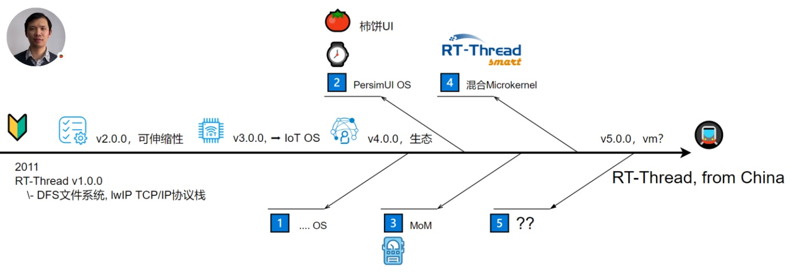
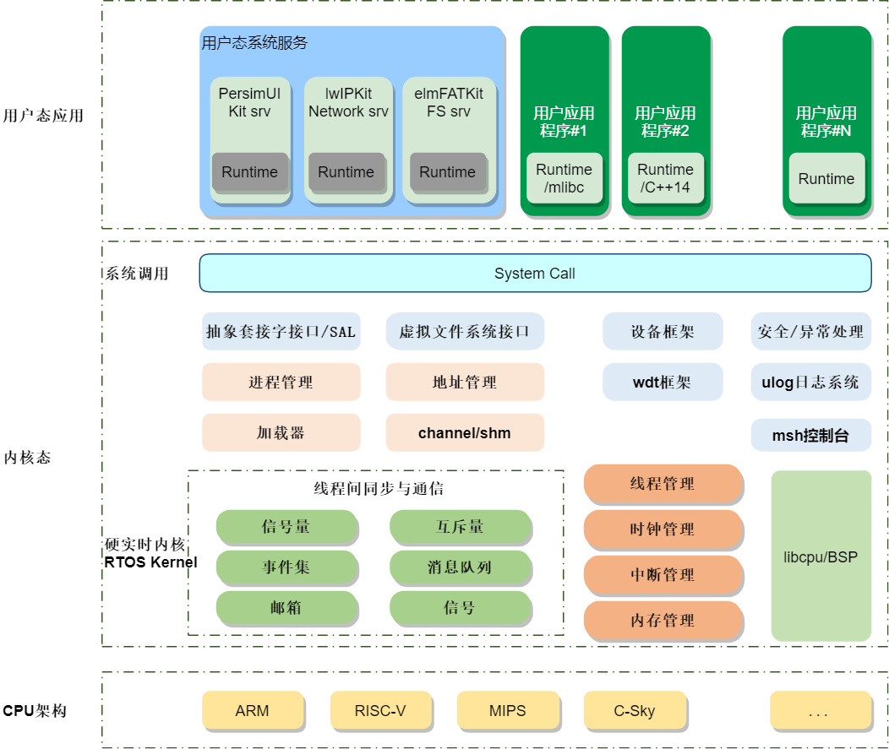

--

# 基本情况了解

RT-Thread Smart（简称rt-smart）是基于RT-Thread操作系统衍生的新分支，

面向带MMU，中高端应用的芯片，

例如ARM Cortex-A系列芯片，MIPS芯片，带MMU的RISC-V芯片等。

rt-smart在RT-Thread操作系统的基础上启用独立、完整的进程方式，

同时以混合微内核模式执行。

rt-smart.zip软件包是RT-Thread Smart的用户体验软件包，

可在QEMU模拟的VExpress-A9机器中或树莓派4B开发板上执行。

本文档是针对QEMU、树莓派4B开发板上快速上手rt-smart入门指南文档。




RT-Thread Smart 是基于 RT-Thread 操作系统上的混合微内核操作系统，简称为 rt-smart。

其定位在于填补传统 RTOS 和大型操作系统 Linux 之间的空白，

在实时性、成本、安全性、启动速度等方面取得最佳的平衡。

自 V5.0.0 起，rt-smart 分支已合并至 master 分支上，用户下载 rt-thread 源码后，无需再切换至 rt-smart 分支，但需要为 BSP 配置 Smart 内核。

RT-Thread Smart 适用于带 MMU 的中高端应用的芯片，例如 ARM Cortex-A 系列芯片、MIPS 芯片、带 MMU 的 RISC-V 芯片等。

能够把应用从内核中独立出来，形成独立的用户态应用程序，并具备独立的地址空间（32 位系统上是 4G 的独立地址空间）。

可应用于安防、车载、军工、消费电子等领域。

下图是 RT-Thread Smart 的整体结构框图，在硬件平台的基础上通过 MMU、系统调用的方式把整个系统分成了内核态及用户态。



# 环境跑起来

就在ubuntu下来跑一下看看。

下载代码：

```
git clone https://gitee.com/rtthread/rt-thread
```

配置：

编译：

下载用户态的程序：

```
git clone https://github.com/RT-Thread/userapps.git
```

由于 smart 采用 xmake 编译用户态环境，因此 smart 的编译方式非常简单。

首先运行 env.sh 添加一下环境变量

source env.sh

env.sh脚本里就3行：

```
script_dir="$(cd "$(dirname "${BASH_SOURCE[0]}")" && pwd)"

export XMAKE_RCFILES=${script_dir}/tools/scripts/xmake.lua
export RT_XMAKE_LINK_TYPE="static"

```

XMAKE_RCFILES这个很重要，就是指定xmake执行时要导入的自定义的一些脚本。

这些脚本放在tools/scripts/xmake.lua，内容还不少。


进入 apps 目录进行编译

```
cd apps
xmake f -a aarch64 # 配置为 aarch64平台
xmake -j8
```

这个会下载busybox、micropython等包的代码。

```
 xmake f -a aarch64
updating repositook
note: install or modify (m) these packages (pass -y to skip confirm)?
in repo:
  -> aarch64-smart-musleabi 188177 
  -> busybox 1.35.0 [toolchains:"@aarch64-smart-musleabi"]
  -> zlib v1.2.13 [toolchains:"@aarch64-smart-musleabi"]
  -> micropython 1.20.0 [toolchains:"@aarch64-smart-musleabi"]
please input: y (y/n/m)

  => download http://117.143.63.254:9012/www/rt-smart/aarch64-linux-musleabi_for_x86_64-pc-linux-gnu_188177.tar.bz2 .. ok
  => install aarch64-smart-musleabi 188177 .. ok
  => download https://github.com/madler/zlib/archive/v1.2.13.tar.gz .. ok
  => install zlib v1.2.13 .. ok
  => download https://www.busybox.net/downloads/busybox-1.35.0.tar.bz2 .. ok
  => install busybox 1.35.0 .. ok
  => downloading micropython .. (1/curl) ⠴
```


运行 xmake smart-rootfs 制作 rootfs ，运行 xmake smart-image 制作镜像

```
xmake smart-rootfs
xmake smart-image -o ../prebuilt/qemu-virt64-aarch64-ext4/ext4.img 
```

进入 userapp/prebuilt/qemu-virt64-aarch64-ext4，运行 qemu.sh 脚本启动 qemu

可以正常运行，没有什么问题。

对应kernel是这个目录：

bsp\qemu-virt64-aarch64


对应的宏是RT_USING_SMART

# busybox

busybox可以用。

busybox ls 这样来使用就可以。

# posix支持

实现的posix接口有这些：

components\libc\posix-info.txt

代码实现在这里：

components\libc\posix


# arm-smart-musleabi

这个就是从musl.cc这个网站下载的二进制。


# 参考资料

1、

https://www.rt-thread.com/products/Smart-30.html

2、

https://blog.51cto.com/u_15288275/2959978

3、

https://getiot.tech/zh/rtt/rt-thread-versions

4、

http://download.100ask.org/videos_tutorial/RTOS/RT-Thread_Smart/index.html

5、RT-Thread Smart 用户态开发教程（基于xmake）

https://club.rt-thread.org/ask/article/1c95a3e1c58c0c25.html