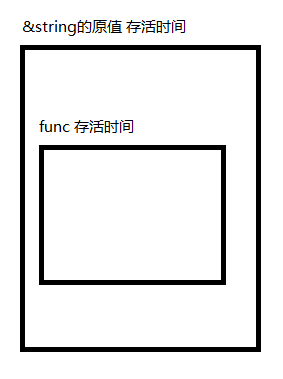

虽然目前工作上没有用到rust，但是有必要快速了解一下rust的基本语法。

方便阅读碰到的rust代码。

# 资料收集

https://course.rs/basic/lifetime.html

ffmpeg rust binding学习

https://github.com/zmwangx/rust-ffmpeg/blob/master/examples/transcode-audio.rs

tauri应用，这个复杂度适中。各个特性都有。

https://github.com/zzzgydi/clash-verge

# rust环境搭建

https://www.rust-lang.org/zh-CN/tools

用rustup来安装rust。

https://github.com/rust-lang/rustup

```
curl --proto '=https' --tlsv1.2 -sSf https://sh.rustup.rs | sh -s -- --default-toolchain none -y
```

可以看到安装了这些东西:

```
info: profile set to 'default'
info: default host triple is x86_64-unknown-linux-gnu
warning: Updating existing toolchain, profile choice will be ignored
info: syncing channel updates for 'stable-x86_64-unknown-linux-gnu'
info: latest update on 2024-04-09, rust version 1.77.2 (25ef9e3d8 2024-04-09)
info: downloading component 'cargo'
  8.0 MiB /   8.0 MiB (100 %)   3.1 MiB/s in  3s ETA:  0s
info: downloading component 'clippy'
  2.2 MiB /   2.2 MiB (100 %)   1.7 MiB/s in  1s ETA:  0s
info: downloading component 'rust-docs'
 14.9 MiB /  14.9 MiB (100 %)   2.5 MiB/s in  6s ETA:  0s
info: downloading component 'rust-std'
 24.3 MiB /  24.3 MiB (100 %)   2.8 MiB/s in  8s ETA:  0s
info: downloading component 'rustc'
 60.3 MiB /  60.3 MiB (100 %)   2.3 MiB/s in 17s ETA:  0s
info: downloading component 'rustfmt'
info: removing previous version of component 'cargo'
info: removing previous version of component 'clippy'
info: removing previous version of component 'rust-docs'
info: removing previous version of component 'rust-std'
info: removing previous version of component 'rustc'
info: removing previous version of component 'rustfmt'
info: installing component 'cargo'
info: installing component 'clippy'
info: installing component 'rust-docs'
 14.9 MiB /  14.9 MiB (100 %)   2.7 MiB/s in  5s ETA:  0s
info: installing component 'rust-std'
 24.3 MiB /  24.3 MiB (100 %)  11.5 MiB/s in  2s ETA:  0s
info: installing component 'rustc'
 60.3 MiB /  60.3 MiB (100 %)  12.6 MiB/s in  5s ETA:  0s
info: installing component 'rustfmt'
```


然后

```
source "$HOME/.cargo/env"
```

创建一个HelloWorld的工程

```
cargo new greeting 
```

报了这个错误

```
error: rustup could not choose a version of cargo to run,
```

用这个命令查看：

```
$ rustup toolchain list
no installed toolchains
```

需要安装工具链：

```
rustup install stable
rustup default stable
```


# 快速入门

cargo new greeting 

这个命令生成的项目目录如下：

```
.
├── Cargo.toml
└── src
    └── main.rs
```

编译并运行：

```
cd ./greeting 
cargo build 
cargo run 
```

输出是：

```
 cargo run
    Finished dev [unoptimized + debuginfo] target(s) in 0.00s
     Running `target/debug/greeting`
Hello, world!
```

在之前的 Hello, World 程序中大概已经告诉了大家输出字符串的方式，

但并不全面，

大家可能很疑惑为什么 println!( "Hello World") 中的 println 后面还有一个 **!** 符号，

难道 Rust 函数之后都要加一个感叹号？

显然并不是这样。

**println 不是一个函数，而是一个宏规则。**

这里不需要更深刻的挖掘宏规则是什么，后面的章节中会专门介绍，并不影响接下来的一段学习。


Rust 输出文字的方式主要有两种：**println!()** 和 **print!()**。

这两个"函数"都是向命令行输出字符串的方法，

区别仅在于前者会在输出的最后附加输出一个换行符。

当用这两个"函数"输出信息的时候，

第一个参数是格式字符串，后面是一串可变参数，对应着格式字符串中的"占位符"，

这一点与 C 语言中的 printf 函数很相似。

但是，Rust 中格式字符串中的占位符不是 **"% + 字母"** 的形式，而是一对 **{}**。

```
fn main() {
    let a = 12;
    println!("a is {}", a);
}
```

其实有更好的写法：

```
println!("a is {0}, a again is {0}", a); 
```

在 **{}** 之间可以放一个数字，它将把之后的可变参数当作一个数组来访问，下标从 0 开始。

如果要输出 **{** 或 **}** 怎么办呢？格式字符串中通过 **{{** 和 **}}** 分别转义代表 { 和 }。但是其他常用转义字符与 C 语言里的转义字符一样，都是反斜杠开头的形式。

```
fn main() { 
    println!("{{}}"); 
} 
```

# cargo

Cargo 是 Rust 的构建系统和包管理器。

Rust 开发者常用 Cargo 来管理 Rust 工程和获取工程所依赖的库。

在上个教程中我们曾使用 cargo new greeting 命令创建了一个名为 greeting 的工程，Cargo 新建了一个名为 greeting 的文件夹并在里面部署了一个 Rust 工程最典型的文件结构。这个 greeting 文件夹就是工程本身。

Cargo 还具有获取包、打包、高级构建等功能，

## 配置代理

但是，上面的设置只对直接使用 git 命令有效，当使用 cargo 命令时，依然会卡住。

需要为 cargo 单独设置代理，新建或打开文件 `~/.cargo/config` ，使用 http 代理:

```bash
[http]
proxy = "192.168.0.1:3333"
[https]
proxy = "192.168.0.1:3333"
```

## cargo常用命令

Cargo 是 Rust 的包管理器和构建工具，它提供了一系列的命令来帮助 Rust 开发者管理项目依赖、构建项目、运行测试等。以下是一些 Cargo 的常用命令：
1. `cargo new <project-name>`: 创建一个新的 Rust 项目。
2. `cargo build`: 编译项目，生成可执行文件或库。
3. `cargo run`: 编译并运行项目。
4. `cargo check`: 快速检查代码是否可以编译，但不生成可执行文件。
5. `cargo test`: 运行项目的测试。
6. `cargo doc`: 为项目生成文档。
7. `cargo fmt`: 格式化项目的代码。
8. `cargo clean`: 清除生成的可执行文件和库。
9. `cargo update`: 更新项目依赖到最新版本。
10. `cargo install <crate>`: 从 Crates.io 安装一个 Rust 包。
11. `cargo publish`: 将你的包发布到 Crates.io。
12. `cargo bench`: 运行项目的基准测试。
13. `cargo build --release`: 以发布模式编译项目，生成优化后的可执行文件或库。
14. `cargo tree`: 显示项目的依赖树。
15. `cargo add <crate>`: 添加一个新的依赖到 `Cargo.toml` 文件中。
16. `cargo remove <crate>`: 从 `Cargo.toml` 文件中移除一个依赖。
这些命令是 Cargo 的核心功能，覆盖了从项目创建到发布的整个生命周期。通过组合这些命令，开发者可以有效地管理 Rust 项目。


# 下面逐步给我演示rust的基本语法

当然，让我们一步步来演示 Rust 的基本语法。我们将从最基本的语法元素开始，逐步介绍 Rust 的各种特性。

### 1. 变量和数据类型

在 Rust 中，变量的类型通常是静态类型，意味着编译器在编译时会知道每个变量的类型。以下是一些基本的数据类型和变量声明示例：

```rust
fn main() {
    // 变量绑定，不可变
    let x: i32 = 5;
    
    // 可变变量
    let mut y: f64 = 3.14;

    // 隐式类型推断
    let z = "Hello, World!";
}
```

### 2. 控制流

Rust 提供了类似于其他语言的控制流语句，如 `if`、`while`、`for` 等：

```rust
fn main() {
    let number = 7;

    // if-else
    if number < 5 {
        println!("Number is less than 5");
    } else {
        println!("Number is greater than or equal to 5");
    }

    // while 循环
    let mut count = 0;
    while count < 5 {
        println!("Count: {}", count);
        count += 1;
    }

    // for 循环
    for i in 0..5 {
        println!("Value: {}", i);
    }
}
```

### 3. 函数

函数是 Rust 中的基本构建块之一，你可以定义自己的函数并调用它们：

```rust
fn main() {
    // 定义函数
    fn add(a: i32, b: i32) -> i32 {
        return a + b;
    }

    // 调用函数
    let result = add(3, 5);
    println!("Result: {}", result);
}
```

### 4. 结构体和枚举

Rust 提供了结构体和枚举来定义自定义的数据类型：

```rust
// 定义结构体
struct Point {
    x: f64,
    y: f64,
}

// 定义枚举
enum Direction {
    Up,
    Down,
    Left,
    Right,
}

fn main() {
    // 使用结构体
    let origin = Point { x: 0.0, y: 0.0 };
    println!("Origin: ({}, {})", origin.x, origin.y);

    // 使用枚举
    let dir = Direction::Up;
    match dir {
        Direction::Up => println!("Moving Up"),
        Direction::Down => println!("Moving Down"),
        Direction::Left => println!("Moving Left"),
        Direction::Right => println!("Moving Right"),
    }
}
```

### 5. Trait 和 impl

Trait 是 Rust 中用于实现共享行为的一种机制，而 `impl` 则用于为类型实现 Trait：

```rust
// 定义 Trait
trait Printable {
    fn print(&self);
}

// 为结构体实现 Trait
impl Printable for Point {
    fn print(&self) {
        println!("Point: ({}, {})", self.x, self.y);
    }
}

fn main() {
    let p = Point { x: 3.0, y: 4.0 };
    p.print();
}
```

这些是 Rust 中的一些基本语法元素，可以帮助你开始编写 Rust 程序。如果你有任何疑问或需要更深入的解释，请随时问我！

# 分号

当然，让我们一步步来演示 Rust 的基本语法。我们将从最基本的语法元素开始，逐步介绍 Rust 的各种特性。

### 1. 变量和数据类型

在 Rust 中，变量的类型通常是静态类型，意味着编译器在编译时会知道每个变量的类型。以下是一些基本的数据类型和变量声明示例：

```rust
fn main() {
    // 变量绑定，不可变
    let x: i32 = 5;
    
    // 可变变量
    let mut y: f64 = 3.14;

    // 隐式类型推断
    let z = "Hello, World!";
}
```

### 2. 控制流

Rust 提供了类似于其他语言的控制流语句，如 `if`、`while`、`for` 等：

```rust
fn main() {
    let number = 7;

    // if-else
    if number < 5 {
        println!("Number is less than 5");
    } else {
        println!("Number is greater than or equal to 5");
    }

    // while 循环
    let mut count = 0;
    while count < 5 {
        println!("Count: {}", count);
        count += 1;
    }

    // for 循环
    for i in 0..5 {
        println!("Value: {}", i);
    }
}
```

### 3. 函数

函数是 Rust 中的基本构建块之一，你可以定义自己的函数并调用它们：

```rust
fn main() {
    // 定义函数
    fn add(a: i32, b: i32) -> i32 {
        return a + b;
    }

    // 调用函数
    let result = add(3, 5);
    println!("Result: {}", result);
}
```

### 4. 结构体和枚举

Rust 提供了结构体和枚举来定义自定义的数据类型：

```rust
// 定义结构体
struct Point {
    x: f64,
    y: f64,
}

// 定义枚举
enum Direction {
    Up,
    Down,
    Left,
    Right,
}

fn main() {
    // 使用结构体
    let origin = Point { x: 0.0, y: 0.0 };
    println!("Origin: ({}, {})", origin.x, origin.y);

    // 使用枚举
    let dir = Direction::Up;
    match dir {
        Direction::Up => println!("Moving Up"),
        Direction::Down => println!("Moving Down"),
        Direction::Left => println!("Moving Left"),
        Direction::Right => println!("Moving Right"),
    }
}
```

### 5. Trait 和 impl

Trait 是 Rust 中用于实现共享行为的一种机制，而 `impl` 则用于为类型实现 Trait：

```rust
// 定义 Trait
trait Printable {
    fn print(&self);
}

// 为结构体实现 Trait
impl Printable for Point {
    fn print(&self) {
        println!("Point: ({}, {})", self.x, self.y);
    }
}

fn main() {
    let p = Point { x: 3.0, y: 4.0 };
    p.print();
}
```

这些是 Rust 中的一些基本语法元素，可以帮助你开始编写 Rust 程序。如果你有任何疑问或需要更深入的解释，请随时问我！

# 还有其他语法吗

除了之前提到的基本语法元素外，Rust 还有一些其他重要的语法特性。下面列举了其中一些：

### 1. 所有权系统

Rust 的所有权系统是其最重要的特性之一，它确保内存安全和避免数据竞争。所有权系统规定了在编译时如何管理内存的所有权，包括所有权转移、借用和生命周期等概念。

```rust
fn main() {
    let s1 = String::from("hello");
    let s2 = s1; // s1 的所有权被移动到 s2
    // println!("{}", s1); // 这里编译会出错，因为 s1 的所有权已经转移到了 s2
}
```

### 2. 生命周期

Rust 的生命周期（lifetimes）用于确保引用在其引用的数据有效时仍然存在。生命周期通过引用的作用域来管理，它们在函数签名和数据结构中使用，以指明引用的有效范围。

```rust
fn longest<'a>(s1: &'a str, s2: &'a str) -> &'a str {
    if s1.len() > s2.len() {
        s1
    } else {
        s2
    }
}
```

### 3. 模式匹配

模式匹配是 Rust 中强大的特性之一，它允许你根据数据的结构和值进行匹配和解构。模式匹配在 `match` 表达式、`if let` 和 `while let` 中使用。

```rust
enum Coin {
    Penny,
    Nickel,
    Dime,
    Quarter(UsState),
}

fn value_in_cents(coin: Coin) -> u8 {
    match coin {
        Coin::Penny => 1,
        Coin::Nickel => 5,
        Coin::Dime => 10,
        Coin::Quarter(state) => {
            println!("State quarter from {:?}", state);
            25
        }
    }
}
```

### 4. Trait 和 Trait 实现

Trait 是 Rust 中的一种特性，用于定义共享行为。通过 Trait，你可以为类型定义一组方法，并实现这些方法，从而为多个类型提供相同的接口。

```rust
trait Animal {
    fn sound(&self);
}

struct Dog;
struct Cat;

impl Animal for Dog {
    fn sound(&self) {
        println!("Dog barks");
    }
}

impl Animal for Cat {
    fn sound(&self) {
        println!("Cat meows");
    }
}
```

以上是 Rust 的一些重要语法特性，它们使得 Rust 在编写安全、高效和可维护的代码方面具有显著优势。如果你对其中的任何一个特性有疑问，欢迎继续提问！

# 用更多例子说明所有权

当谈到 Rust 的所有权时，理解以下三个概念是非常重要的：所有权、借用和引用。让我们用更多的例子来说明它们之间的关系和如何在 Rust 中管理内存。

### 1. 所有权转移

在 Rust 中，当你将一个值赋给另一个变量时，所有权会从一个变量转移到另一个变量，这被称为所有权的转移。

```rust
fn main() {
    let s1 = String::from("hello");
    let s2 = s1; // s1 的所有权被转移到 s2
    // println!("{}", s1); // 这里编译会出错，因为 s1 的所有权已经转移到了 s2
}
```

在这个例子中，`s1` 拥有对字符串 `"hello"` 的所有权。当 `s1` 被赋值给 `s2` 时，`s1` 的所有权被转移给了 `s2`。因此，在之后尝试使用 `s1` 时会导致编译错误。

### 2. 借用

借用是 Rust 中的另一个重要概念，它允许你在不转移所有权的情况下访问数据。借用通过引用实现，可以是不可变引用（`&T`）或可变引用（`&mut T`）。

```rust
fn main() {
    let s = String::from("hello");
    let len = calculate_length(&s); // 将对 s 的引用传递给函数
    println!("The length of '{}' is {}.", s, len);
}

fn calculate_length(s: &String) -> usize {
    s.len()
}
```

在这个例子中，`calculate_length` 函数接受一个 `String` 的引用作为参数，而不是获取 `String` 的所有权。这意味着在调用函数后，`s` 的所有权仍然在 `main` 函数中保持不变。

### 3. 可变引用

在借用的基础上，可变引用（`&mut T`）允许对数据进行修改。但是，在任何给定时间，只能有一个可变引用，这是 Rust 所谓的“借用规则”。

```rust
fn main() {
    let mut s = String::from("hello");
    change_string(&mut s);
    println!("{}", s); // 输出 "hello world"
}

fn change_string(s: &mut String) {
    s.push_str(" world");
}
```

在这个例子中，`change_string` 函数接受一个 `String` 的可变引用，并向其添加字符串 " world"。通过可变引用，我们可以在函数中修改 `s` 所引用的 `String`。

这些例子展示了 Rust 的所有权系统是如何工作的，以及如何通过借用和可变引用来避免所有权转移而实现安全且高效的内存管理。

# 详细说明生命周期

生命周期是 Rust 中非常重要的概念，

==它用于管理引用的有效范围，==

确保在引用的数据有效时引用仍然有效。

生命周期在函数签名和数据结构中使用，以指明引用的有效期。

==理解生命周期有助于避免悬垂引用和数据竞争等内存安全问题。==

### 生命周期标注

在 Rust 中，生命周期以单引号 `'` 开头，例如 `'a`，`'b` 等。也可以是一个单词'abc这样。只要是单引号开头的就行。

生命周期标注==通常出现在引用类型的定义中==，用于指明引用的有效期。

在函数签名和数据结构中，生命周期标注用于确保引用在有效期内仍然有效。

```rust
// 函数签名中的生命周期标注
fn longest<'a>(s1: &'a str, s2: &'a str) -> &'a str {
    if s1.len() > s2.len() {
        s1
    } else {
        s2
    }
}

// 数据结构中的生命周期标注
struct Important<'a> {
    part: &'a str,
}
```

在这两个例子中，`'a` 是一个生命周期参数，用于指明引用的有效期。在函数 `longest` 的签名中，`&'a str` 表示函数接受两个引用参数，它们的生命周期必须与返回的引用参数一样长。在结构体 `Important` 中，`&'a str` 表示 `part` 字段是一个对字符串的引用，它的生命周期与结构体的生命周期一样长。

### 生命周期省略规则

为了减少代码中生命周期标注的复杂度，Rust 引入了生命周期省略规则。根据这些规则，在某些情况下，编译器可以推断出引用的生命周期而不需要显式标注。

```rust
fn longest(s1: &str, s2: &str) -> &str {
    if s1.len() > s2.len() {
        s1
    } else {
        s2
    }
}
```

在这个例子中，虽然没有显式标注生命周期，但是根据生命周期省略规则，编译器可以推断出返回的引用的生命周期与输入参数的生命周期一样长，因此不需要显式标注。

### 生命周期 elision

从 Rust 2018 Edition 开始，引入了生命周期 elision（生命周期省略），这使得在许多常见的场景下，不再需要显式地指定生命周期。生命周期 elision 简化了生命周期标注的语法，使得代码更加清晰和简洁。

总的来说，生命周期在 Rust 中扮演着关键的角色，它确保了引用的有效性和内存安全。虽然刚开始时可能会感到复杂，但随着对 Rust 编程语言的熟悉程度增加，生命周期会变得更加自然和容易理解。


## 理解生命周期

https://www.cnblogs.com/lilpig/p/17014977.html

**引用的生命周期，必须小于等于其值的生命周期**。

我很喜欢张汉东老师对《Rust for Rustaceans》的翻译样章中把生命周期（lifetime）翻译成生存期，

==生存期确实比生命周期更加生动，==

但为了和已有的术语对应，这里我还是使用生命周期。

正如我们看到的，Rust的引用代表对值的一次借用，它们有着种种限制，所以，**在函数中、在结构体中、在方法等等位置上使用引用时，你都要给Rust编译器一些关于引用的提示，这种提示，就是生命周期标记**。

我不是要故意把例子写的复杂，因为对于简单的情况，Rust编译器已经足够聪明到让你能够省略生命周期标识符，稍后我们会谈到。

这个函数接收两个`String`引用，返回其中较长的那个引用。

首先先说结论，它无法通过编译。

为什么呢？考虑下面的调用：


上面的代码会发生什么？

- `let a = String::from("ABCDEFG");`将后面的`String`值给到变量`a`，现在，可以说这个`a`就是字符串值的所有者
- `b = a;`，将`a`中的字符串值的所有权转移给`b`，现在，`b`是字符串值的所有者，`a`失效了。

所有者负责该变量的销毁，在Rust中，当所有者所在的作用域结束，其值就会被自动销毁，所以：

```rust
fn noname() {
	let a = String::from("ABCDEFG");
	b = a;
} // b的值在这里被销毁，a由于已经不拥有值，所以无需处理
```

但大多数时候，你都希望只是简单的访问或者修改下值，而不是拿到它的所有权，比如，你不想在方法调用时把一个变量传进去，然后它就不能用了：

```rust
fn func(string: String) { // 参数值的所有权被转移给变量string
    // do something
} // string脱离作用域，值被销毁

fn main() {
	let a = String::from("ABCDEFG");
    func(a); // a对其值的所有权转移到函数中，a不再拥有任何值
    println!("{}", a); // 访问没有值的变量，无法通过编译
}
```

这个时候，你需要用到引用。

## 引用

```rust
fn func(string: &String) { // string是一个String类型的引用，并不拥有其值
    // do something
} // string引用被销毁，不影响值

fn main() {
	let a = String::from("ABCDEFG");
    func(&a); // 产生a的一个引用
    println!("{}", a); // 正常编译！
}
```

我们在这篇文章里不涉及引用到底是什么样的一个东西，它和指针有什么区别，引用在堆上还是栈上等问题，这些问题，你可以去看《Rust In Action》，你可以暂时把它想成一个指向原值的指针，但这个指针不同于C的指针，**引用有额外的安全机制，即Rust会保证引用永远不会指向失效的值**。

# 引用的生命周期

**引用有额外的安全机制，即Rust会保证引用永远不会指向失效的值**。

问题就出在这句话上，有了这句话，才有了生命周期这个小碧7。还是刚刚的例子：

```rust
fn func(string: &String) {
    // Rust保证引用不会指向失效的值，所以在该方法中你可以放心大胆的访问string而不会出现任何内存错误
    // 也就是说，string的原值在方法调用期间必须一直是有效的
}
```

为了满足上面的保证，Rust必须确保，传入`func`的引用，其原值的存活时间大于等于`func`的作用域，只有这样，引用才不会指向失效的值（实际上作为参考的并不是`func`的作用域，不过在这个例子上先这样理解）：

[](https://img2023.cnblogs.com/blog/1942408/202212/1942408-20221230113157322-332152663.png)

我们可以把这个存活时间理解为生命周期。

当引用被创建，一个引用的生命周期开始，当引用结束最后一次使用，该引用的生命周期结束。更复杂一点的话，引用的生命周期可以是分离开的多个区域，这通常在有流程控制结构时发生，在这篇文章里我们不会触碰这些复杂的结构，可以在《Rust for Rustaceans》一书的第一章中找到。

**引用的生命周期，必须小于等于其值的生命周期**。

我来举一个反例：

```rust
fn invaild_ret_ref() -> &String {
	&String::from("Hello")
}
```

这个函数返回一个`String`的引用，它在函数中使用`String::from`创建了一个`String`值，然后试图将它的引用返回，可是在`invaild_ret_ref`函数结束后，这个`String`值就已经被销毁了，该引用不可能能够指向有效的数据，Rust编译器会拒绝这个代码。


# 生命周期标记[#](https://www.cnblogs.com/lilpig/p/17014977.html#生命周期标记)

正如我们看到的，Rust的引用代表对值的一次借用，它们有着种种限制，所以，**在函数中、在结构体中、在方法等等位置上使用引用时，你都要给Rust编译器一些关于引用的提示，这种提示，就是生命周期标记**。

考虑下面的例子：

```rust
fn longer_one(a: &String, b: &String) -> &String {
	if a.len() > b.len() {
		a
	} else {
		b
	}
}
```

我不是要故意把例子写的复杂，因为对于简单的情况，Rust编译器已经足够聪明到让你能够省略生命周期标识符，稍后我们会谈到。

这个函数接收两个`String`引用，返回其中较长的那个引用。首先先说结论，它无法通过编译。

为什么呢？考虑下面的调用：

```rust
fn main() {
	let str_1 = String::from("Hello");
	let longer: &String;

	{
		let str_2 = String::from("A");
		longer = longer_one(&str_1, &str_2);
	} // str_2的值被销毁

	println!("{}", longer);
} // str_1的值被销毁
```

这个调用有什么问题呢？`str_1`的值`Hello`，它的生命周期是整个`main`函数，直到`main`结束，它才会被销毁，而`str_2`的值`A`，它在它所在的代码块结束后就被销毁。所以，它们的引用有效的生命周期范围也是不同的，`str_2`的引用的生命周期就是中间的那个只有两行代码的代码块。

引用类型变量`longer`接收`longer_one`函数的返回结果，该函数可能返回`str_1`的引用和`str_2`的引用其中之一，如果恰好`str_1`比较长，那么`longer`变量就是`str_1`的引用，我们可以在后面的`println`语句中访问它，因为它仍处在自己的生命周期中，而如果是`str_2`较长，我们稍后如果访问它就是在访问一个无效的内存值，这是很危险的。

也就是说，在这种情况下，Rust编译器无法确定哪个引用是被返回的，如果Rust放任这种情况，让这种模棱两可的代码通过编译，那么你的程序偶尔会正常运行，偶尔会出现内存错误。

> 如果你已经感到晕乎乎的了，不妨休息一下。

## 如果只返回`a`呢？[#](https://www.cnblogs.com/lilpig/p/17014977.html#如果只返回a呢)

上面的代码从本质上就有问题，无论你使用还是不用生命周期标记，都无法解决这个问题，生命周期标记也不是为了处理这个问题而存在的。不过，我们考虑下面的代码：

```rust
fn longer_one(a: &String, b: &String) -> &String {
	a
}
```

现在，该方法被修改了，它只会返回第一个引用，也就是`a`，这次，按理说上面的调用不会出现问题了，因为`str_2`的引用将永远不可能被赋值给`longer`，后面的访问也没有风险。

但是Rust编译器无法识别这种情况，该函数还是无法通过编译，而**生命周期标记，本质目的就是为了在你能够确保你的代码正常的情况下，提示下Rust编译器，我不会出错，放我过去吧**。

## 给编译器关于引用生命周期的提示[#](https://www.cnblogs.com/lilpig/p/17014977.html#给编译器关于引用生命周期的提示)

Rust的生命周期标识是通过类似泛型的语法来定义的，不得不说，看起来很丑，且没有道理：

```rust
fn longer_one<'a>(a: &'a String, b: &String) -> &'a String {
	a
}
```

在这里，我们定义了一个生命周期标记`'a`，生命周期必须以引号开头。

==我们告诉编译器，参数`a`这个引用的生命周期是`'a`，==

==并且我返回值的生命周期和它的生命周期相同，也是`'a`。==

## 常量字符串的生命周期

&'static str

`&'static str` 是 Rust 中的一种类型，表示一个静态字符串的引用。让我们来拆解一下这个类型的含义：

- `&`：表示这是一个引用类型。引用是一种轻量级的指针，用于借用数据而不拥有它。在这里，`&` 表示这是一个对字符串的引用，而不是实际的字符串数据本身。

- `'static`：是一个生命周期参数，用于指定引用的生命周期。`'static` 生命周期表示引用指向的数据在程序的整个运行周期内都是有效的，即静态生命周期。静态生命周期通常用于表示编译时确定的静态数据，例如字符串字面量。

- `str`：表示字符串类型。`str` 类型是 Rust 中的不可变字符串类型，通常用于存储文本数据。

因此，`&'static str` 表示一个对静态字符串的引用，其中静态字符串的生命周期为整个程序的运行周期，且字符串是不可变的。这种类型通常用于表示编译时确定的静态字符串数据，例如字符串字面量或全局静态变量中的字符串。

# 我还有什么需要了解的关于rust的知识

除了上述提到的基本知识外，还有一些其他方面的 Rust 知识可能会对你有所帮助，具体包括：

1. **错误处理（Error Handling）**：==Rust 通过 `Result` 和 `Option` 类型来处理错误。==了解如何使用 `Result` 和 `Option`，以及如何使用 `match`、`unwrap` 和 `expect` 方法来处理错误是很重要的。

2. **并发编程（Concurrency）**：Rust 提供了内置的并发支持，包括线程和消息传递。了解如何创建线程、使用消息传递进行通信以及如何安全地共享数据是很重要的。

3. **Trait 和泛型（Trait and Generics）**：Trait 是 Rust 中的一种特性，用于定义共享行为。泛型允许你编写通用代码，可以在不同类型上进行操作。了解如何使用 Trait 和泛型可以提高代码的重用性和灵活性。

4. **生命周期（Lifetimes）**：我们已经提到了生命周期，但是深入了解生命周期是非常重要的，特别是在编写涉及引用的复杂代码时。

5. **异步编程（Async Programming）**：Rust 通过 `async` 和 `await` 关键字提供了异步编程的支持。了解如何编写异步代码，以及如何使用 `tokio` 或 `async-std` 等异步运行时库是很有用的。

6. **内存安全（Memory Safety）**：Rust 通过所有权、借用和生命周期等特性来保证内存安全。了解这些特性如何确保在编写代码时不会发生内存错误是很重要的。

7. **宏（Macros）**：宏是 Rust 中的一种元编程工具，允许你编写自定义的代码生成器。了解如何编写和使用宏可以帮助你简化代码并提高生产力。

8. **标准库（Standard Library）**：Rust 的标准库提供了丰富的功能，包括数据结构、网络编程、文件 I/O 等。熟悉标准库中提供的功能可以帮助你更快地开发应用程序。

这些是 Rust 中一些重要的知识点，掌握它们可以让你更好地编写和理解 Rust 代码。如果你对其中任何一个方面有兴趣，我可以为你提供更多的信息和示例。

# rust的处理错误举例说明

当处理错误时，Rust 通常使用 `Result` 和 `Option` 类型。`Result` 类型用于表示可能会失败的操作的结果，而 `Option` 类型用于表示可能存在或可能不存在的值。让我们通过几个例子来说明如何在 Rust 中处理错误。

### 使用 Result 处理文件读取错误

```rust
use std::fs::File;
use std::io::Read;

fn read_file_content(file_path: &str) -> Result<String, std::io::Error> {
    let mut file = File::open(file_path)?;
    let mut content = String::new();
    file.read_to_string(&mut content)?;
    Ok(content)
}

fn main() {
    let file_path = "example.txt";
    match read_file_content(file_path) {
        Ok(content) => println!("File content: {}", content),
        Err(err) => println!("Error reading file: {}", err),
    }
}
```

在这个例子中，`read_file_content` 函数尝试打开文件并读取其内容。如果操作成功，则返回文件内容的 `Result::Ok`，否则返回错误的 `Result::Err`。在 `main` 函数中，我们使用 `match` 表达式来处理 `Result` 类型的返回值，打印文件内容或错误信息。

### 使用 Option 处理查找错误

```rust
fn find_element_in_list<T: PartialEq>(list: &[T], target: &T) -> Option<usize> {
    for (index, item) in list.iter().enumerate() {
        if item == target {
            return Some(index);
        }
    }
    None
}

fn main() {
    let numbers = vec![1, 2, 3, 4, 5];
    let target = 3;
    match find_element_in_list(&numbers, &target) {
        Some(index) => println!("Element found at index {}", index),
        None => println!("Element not found"),
    }
}
```

在这个例子中，`find_element_in_list` 函数在给定列表中查找指定元素。如果元素找到，则返回其索引的 `Option::Some`，否则返回 `Option::None`。在 `main` 函数中，我们使用 `match` 表达式处理 `Option` 类型的返回值，并打印元素的索引或“未找到”消息。

这些例子演示了如何使用 `Result` 和 `Option` 类型来处理错误，以及如何使用 `match` 表达式来解构和处理它们的返回值。

# ？运算符在错误处理中的使用

编写调用许多返回 `Result` 类型的函数的代码时，错误处理可能很繁琐。问号运算符 `?` ，隐藏了一些在调用堆栈中传播错误的样板。

如果不使用？运算符，那么错误处理看起来是这样，很繁琐：

```
use std::fs::File;
use std::io::prelude::*;
use std::io;

struct Info {
    name: String,
    age: i32,
    rating: i32,
}

fn write_info(info: &Info) -> io::Result<()> {
    // Early return on error
    let mut file = match File::create("my_best_friends.txt") {
           Err(e) => return Err(e),
           Ok(f) => f,
    };
    if let Err(e) = file.write_all(format!("name: {}\n", info.name).as_bytes()) {
        return Err(e)
    }
    if let Err(e) = file.write_all(format!("age: {}\n", info.age).as_bytes()) {
        return Err(e)
    }
    if let Err(e) = file.write_all(format!("rating: {}\n", info.rating).as_bytes()) {
        return Err(e)
    }
    Ok(())
}
```

而使用？运算符，则改写为这样：

```
use std::fs::File;
use std::io::prelude::*;
use std::io;

struct Info {
    name: String,
    age: i32,
    rating: i32,
}

fn write_info(info: &Info) -> io::Result<()> {
    let mut file = File::create("my_best_friends.txt")?;
    // Early return on error
    file.write_all(format!("name: {}\n", info.name).as_bytes())?;
    file.write_all(format!("age: {}\n", info.age).as_bytes())?;
    file.write_all(format!("rating: {}\n", info.rating).as_bytes())?;
    Ok(())
}
```

# array类型举例

在 Rust 中，数组是固定长度的集合，所有元素必须具有相同的类型。让我们通过几个例子来演示如何定义和使用数组。

### 定义和初始化数组

```rust
fn main() {
    // 定义包含5个整数的数组
    let numbers: [i32; 5] = [1, 2, 3, 4, 5];

    // 初始化数组为相同值
    let zeros = [0; 3]; // 创建包含3个0的数组

    // 部分初始化数组
    let mut fruits: [String; 4] = ["apple".to_string(), "banana".to_string(), String::new(), String::new()];
    fruits[2] = "orange".to_string(); // 修改数组元素
    fruits[3] = "grape".to_string(); // 修改数组元素
}
```

在这个例子中，我们定义了三个数组：`numbers` 包含了5个整数，`zeros` 包含了3个0，`fruits` 包含了4个字符串。注意，我们可以使用 `String::new()` 来初始化一个空的字符串。

### 访问数组元素

```rust
fn main() {
    let numbers: [i32; 5] = [1, 2, 3, 4, 5];

    // 使用索引访问数组元素
    println!("First element: {}", numbers[0]);
    println!("Third element: {}", numbers[2]);

    // 遍历数组
    for num in &numbers {
        println!("{}", num);
    }
}
```

在这个例子中，我们使用索引来访问数组元素，并使用循环遍历数组。

### 使用数组作为函数参数

```rust
fn process_array(arr: [i32; 5]) {
    for num in arr.iter() {
        println!("{}", num);
    }
}

fn main() {
    let numbers: [i32; 5] = [1, 2, 3, 4, 5];
    process_array(numbers);
}
```

在这个例子中，我们定义了一个接受数组作为参数的函数，并在 `main` 函数中调用它。

总的来说，数组是 Rust 中的一种基本数据结构，它们在大小和类型上都是固定的。了解如何定义、初始化、访问和操作数组是编写 Rust 代码的基础之一。

# fn类型举例

在 Rust 中，`fn` 类型表示函数类型，它是一种类型，可以被赋值给变量、作为参数传递给其他函数，甚至作为函数的返回类型。让我们通过几个例子来演示 `fn` 类型的用法。

### 将函数作为参数传递

```rust
fn apply_function(f: fn(i32) -> i32, x: i32) -> i32 {
    f(x)
}

fn double(x: i32) -> i32 {
    x * 2
}

fn triple(x: i32) -> i32 {
    x * 3
}

fn main() {
    let result1 = apply_function(double, 5);
    let result2 = apply_function(triple, 5);
    println!("Result1: {}", result1); // 输出 10
    println!("Result2: {}", result2); // 输出 15
}
```

在这个例子中，我们定义了一个接受 `fn(i32) -> i32` 类型函数和一个整数作为参数的函数 `apply_function`。然后我们定义了两个函数 `double` 和 `triple`，它们都接受一个整数并返回整数。在 `main` 函数中，我们将 `double` 和 `triple` 函数作为参数传递给 `apply_function` 函数，并输出结果。

### 将函数作为返回值

```rust
fn get_function(name: &str) -> fn(i32) -> i32 {
    match name {
        "double" => double,
        "triple" => triple,
        _ => panic!("Unknown function"),
    }
}

fn double(x: i32) -> i32 {
    x * 2
}

fn triple(x: i32) -> i32 {
    x * 3
}

fn main() {
    let f = get_function("double");
    let result = f(5);
    println!("Result: {}", result); // 输出 10
}
```

在这个例子中，我们定义了一个函数 `get_function`，它接受一个字符串参数并根据字符串返回对应的函数。然后我们在 `main` 函数中调用 `get_function` 获取 `double` 函数，并使用它计算结果。

总的来说，`fn` 类型使得在 Rust 中可以像其他数据类型一样对函数进行操作，使得函数式编程范式更加自然和灵活。

# never类型

在 Rust 中，`!`（叹号）代表 `never` 类型，也被称为 "发散" 类型。

这个类型表示一个永远不会返回的表达式或函数，通常用于标记永远不会结束的操作，

比如 panic、循环中的 `continue` 和 `break`，以及死循环等。

让我们通过一些例子来理解 `never` 类型的用法：

### `panic!` 宏

```rust
fn main() {
    panic!("This program will panic!");
}
```

在这个例子中，`panic!` 宏将导致程序立即终止并抛出一个 panic 错误。因为程序无法在 panic 后继续执行，所以 `panic!` 宏的返回值类型被标记为 `!`。

### 死循环

```rust
fn main() {
    loop {
        println!("This loop will never end!");
    }
}
```

在这个例子中，`loop` 表达式创建了一个永远运行的死循环。因为程序永远不会从这个循环中返回，所以循环的返回值类型被标记为 `!`。

### 循环中的 `continue` 和 `break`

```rust
fn main() {
    let mut i = 0;
    while i < 10 {
        i += 1;
        if i % 2 == 0 {
            continue;
        }
        println!("{}", i);
    }
}
```

在这个例子中，当 `i` 是偶数时，`continue` 语句会跳过本次循环的剩余部分，直接进行下一次循环。由于 `continue` 语句导致程序从循环的某个点继续执行，因此 `continue` 语句的返回值类型被标记为 `!`。

`never` 类型在 Rust 中的使用场景比较特殊，主要用于标记永远不会返回的操作，帮助编译器进行更精确的类型推断和错误检查。

# ||的用法

==在 Rust 中，`||` 符号通常用作闭包（closure）的语法。==

闭包是一种可以捕获周围作用域中变量的匿名函数。以下是一些常见的用法：

1. **闭包定义**：使用 `||` 来定义闭包的参数列表和函数体。例如：

```rust
let add_one = |x| x + 1;
```

这个闭包接受一个参数 `x`，并返回 `x + 1`。

2. **调用闭包**：可以像调用函数一样调用闭包，将参数传递给它即可。例如：

```rust
let result = add_one(5);
println!("{}", result); // 输出：6
```

3. **多个参数的闭包**：可以使用多个参数定义闭包，参数之间用逗号隔开。例如：

```rust
let add = |x, y| x + y;
let result = add(3, 5);
println!("{}", result); // 输出：8
```

4. **没有参数的闭包**：即使闭包没有参数，也需要使用 `||` 表示参数列表的占位符。例如：

```rust
let greet = || println!("Hello, world!");
greet(); // 输出：Hello, world!
```

5. **捕获外部变量**：闭包可以捕获周围作用域中的变量。例如：

```rust
let x = 5;
let add_x = |y| x + y;
let result = add_x(3);
println!("{}", result); // 输出：8
```

在这个例子中，闭包 `add_x` 捕获了外部变量 `x`。

这些是一些基本的用法，`||` 在 Rust 中还有其他用法，比如在模式匹配中表示“或”，但通常用于闭包。

# #的用法

在 Rust 中，`#` 是宏标记的一部分，用于注解语法。

这些注解（attributes）可以应用于各种程序元素，

如结构体、枚举、函数和模块。

`#[derive(Debug)]` 是一种常见的注解，

它告诉编译器为特定类型自动生成某些特性代码。

让我们详细了解这个标记的作用和常见用途。

**`#[derive(...)]` 注解**

`#[derive(...)]` 是一种宏，它允许为结构体或枚举自动生成某些特性的实现。常见的派生特性有：

- `Debug`: 生成调试格式化器，使得类型可以使用 `{:?}` 打印。
- `Clone`: 生成 `clone` 方法，使得类型可以被深拷贝。
- `Copy`: 生成按位复制的特性，使得类型可以按值传递而不需调用 `clone`。
- `PartialEq` 和 `Eq`: 生成比较操作符 `==` 和 `!=` 的实现。
- `PartialOrd` 和 `Ord`: 生成比较操作符 `<`, `<=`, `>`, `>=` 的实现。
- `Hash`: 生成哈希函数，使得类型可以用作哈希集合的键。

**示例**

```rust
#[derive(Debug, Clone, PartialEq)]
struct Point {
    x: i32,
    y: i32,
}

fn main() {
    let point1 = Point { x: 1, y: 2 };
    let point2 = point1.clone();

    println!("{:?}", point1); // 打印: Point { x: 1, y: 2 }
    println!("{}", point1 == point2); // 打印: true
}
```

在这个例子中：

- `#[derive(Debug)]` 使得 `Point` 可以用 `println!("{:?}", point1)` 格式化输出。
- `#[derive(Clone)]` 使得 `Point` 可以调用 `clone` 方法进行深拷贝。
- `#[derive(PartialEq)]` 使得 `Point` 可以使用 `==` 和 `!=` 进行比较。

**注解语法**

注解语法使用 `#` 和 `[]` 包围注解内容，通常位于结构体、枚举或函数的定义之前。例如：

```rust
#[derive(Debug)]
struct MyStruct {
    field1: i32,
    field2: String,
}
```

**其他注解**

除了 `#[derive(...)]`，Rust 还有许多其他注解，如：

- `#[test]`: 标记测试函数，在运行 `cargo test` 时执行。
- `#[allow(...)], #[warn(...)], #[deny(...)]`: 控制编译器警告和错误。
- `#[cfg(...)]`: 条件编译，根据配置选项选择性编译代码。

**总结**

| 注解             | 描述                                                       |
| ---------------- | ---------------------------------------------------------- |
| `#[derive(...)]` | 自动生成某些特性的实现（如 `Debug`, `Clone`, `PartialEq`） |
| `#[test]`        | 标记测试函数，在运行 `cargo test` 时执行                   |
| `#[allow(...)]`  | 允许某些警告，不显示警告信息                               |
| `#[warn(...)]`   | 显示警告信息                                               |
| `#[deny(...)]`   | 将警告作为错误，导致编译失败                               |
| `#[cfg(...)]`    | 条件编译，根据配置选项选择性编译代码                       |

`#[derive(Debug)]` 是一种方便的方式，用于自动生成 `Debug` 特性的实现，使得结构体或枚举可以方便地进行调试输出。这种注解机制在 Rust 中被广泛使用，极大地简化了代码的开发和维护。


# rust宏的用法

Rust 的宏（macros）是一个强大的元编程工具，它允许你编写可以生成代码的代码。Rust 提供了两种类型的宏：声明式宏（Declarative Macros）和过程宏（Procedural Macros）。以下是对这两种宏及其用法的详细介绍。

### 声明式宏（Declarative Macros）

声明式宏使用 `macro_rules!` 来定义，类似于其他编程语言中的宏。它们通过模式匹配来扩展代码。

#### 示例：简单的 `vec!` 宏

Rust 标准库中的 `vec!` 宏是一个很好的示例，它用于创建一个 `Vec`。

```rust
macro_rules! vec {
    ( $( $x:expr ),* ) => {
        {
            let mut temp_vec = Vec::new();
            $(
                temp_vec.push($x);
            )*
            temp_vec
        }
    };
}

fn main() {
    let v = vec![1, 2, 3];
    println!("{:?}", v); // 输出: [1, 2, 3]
}
```

这里的 `$( $x:expr ),*` 是模式匹配的一部分：
- `$( ... )*` 表示可以匹配零个或多个元素。
- `$x:expr` 表示每个元素是一个表达式。

### 过程宏（Procedural Macros）

过程宏更为强大和灵活，允许你在编译时生成代码。它们分为三种类型：
- `#[derive]` 宏
- 属性宏
- 函数宏

#### 示例：自定义 `#[derive]` 宏

首先，我们需要创建一个新的 Rust 库项目：

```sh
cargo new my_derive_macro --lib
cd my_derive_macro
```

在 `Cargo.toml` 中添加依赖：

```toml
[dependencies]
syn = "1.0"
quote = "1.0"
proc-macro2 = "1.0"

[lib]
proc-macro = true
```

创建一个自定义的 `derive` 宏：

```rust
// src/lib.rs
extern crate proc_macro;
use proc_macro::TokenStream;
use quote::quote;
use syn;

#[proc_macro_derive(HelloMacro)]
pub fn hello_macro_derive(input: TokenStream) -> TokenStream {
    // 解析输入的 Rust 代码
    let ast = syn::parse(input).unwrap();
    impl_hello_macro(&ast)
}

fn impl_hello_macro(ast: &syn::DeriveInput) -> TokenStream {
    let name = &ast.ident;
    let gen = quote! {
        impl HelloMacro for #name {
            fn hello_macro() {
                println!("Hello, Macro! My name is {}!", stringify!(#name));
            }
        }
    };
    gen.into()
}
```

在另一个项目中使用该宏：

```sh
cargo new my_project
cd my_project
```

在 `Cargo.toml` 中添加对自定义宏的依赖：

```toml
[dependencies]
my_derive_macro = { path = "../my_derive_macro" }
```

使用自定义宏：

```rust
// src/main.rs
use my_derive_macro::HelloMacro;

#[derive(HelloMacro)]
struct Pancakes;

fn main() {
    Pancakes::hello_macro();
}
```

运行程序将输出：

```
Hello, Macro! My name is Pancakes!
```

### 总结

Rust 的宏系统提供了强大的元编程功能。声明式宏通过模式匹配和替换来简化代码，而过程宏允许在编译时生成复杂的代码逻辑。这两种宏各有优劣，可以根据具体需求选择使用。

**声明式宏（Declarative Macros）**

| 特性         | 描述                     |
| ------------ | ------------------------ |
| 定义         | `macro_rules!`           |
| 模式匹配     | 通过模式匹配进行代码生成 |
| 简单常见用途 | 适用于简单的代码生成     |
| 例子         | `vec!` 宏                |

**过程宏（Procedural Macros）**

| 特性     | 描述                             |
| -------- | -------------------------------- |
| 定义     | 使用 `proc_macro` crate          |
| 三种类型 | `#[derive]` 宏，属性宏，函数宏   |
| 复杂用途 | 适用于复杂的代码生成和编译时处理 |
| 例子     | 自定义 `#[derive]` 宏            |

通过结合使用声明式宏和过程宏，你可以在 Rust 中实现强大的元编程，编写出更简洁、可维护的代码。


# cfg_attr

```
#![cfg_attr(
  all(not(debug_assertions), target_os = "windows"),
  windows_subsystem = "windows"
)]
```


这行代码是 Rust 中的一个属性宏调用，==用于配置编译过程中的条件编译（conditional compilation）选项。==

让我们逐步解释这行代码：

- `#![cfg_attr(...)]`：这是一个属性宏调用的语法，用于在编译时配置条件属性。

- `all(...)`：`all` 宏用于指定所有条件都必须满足。在这个例子中，它指定了多个条件都必须同时满足。

- `not(debug_assertions)`：`debug_assertions` 是一个 Rust 的编译器标志，当编译时包含调试断言时为真。`not(debug_assertions)` 表示如果不包含调试断言，则条件成立。

- `target_os = "windows"`：`target_os` 是 Rust 的一个内置目标操作系统属性，用于指定代码在特定操作系统上编译。在这个例子中，指定只有目标操作系统是 Windows 时条件才成立。

- `windows_subsystem = "windows"`：这是一个 Windows 特定的编译器指令，用于配置 Windows 子系统。它告诉编译器在 Windows 平台上，使用 Windows 子系统，而不是默认的控制台子系统。

因此，这行代码的含义是：如果在 Windows 平台上，并且不包含调试断言时，将编译选项设置为使用 Windows 子系统。

# unwrap

在 Rust 中，`unwrap` 是 `Option` 和 `Result` 类型的一个方法，用于从 `Option` 或 `Result` 实例中提取值。

但是，使用 `unwrap` 需要注意，因为它可能会导致程序在出现错误时崩溃。

### 1. `Option` 中的 `unwrap`

在 `Option` 类型中，`unwrap` 方法会尝试将 `Some` 包装的值提取出来。如果 `Option` 是 `None`，则调用 `unwrap` 会导致程序 panic（崩溃）。

```rust
let some_value: Option<i32> = Some(5);
let unwrapped_value = some_value.unwrap(); // 返回 5

let none_value: Option<i32> = None;
let unwrapped_none = none_value.unwrap(); // 这行代码会导致 panic
```

### 2. `Result` 中的 `unwrap`

在 `Result` 类型中，`unwrap` 方法会尝试将 `Ok` 包装的值提取出来。如果 `Result` 是 `Err`，则调用 `unwrap` 会导致程序 panic，并且会打印出 `Err` 中包含的错误信息。

```rust
fn divide(x: f64, y: f64) -> Result<f64, &'static str> {
    if y == 0.0 {
        return Err("division by zero");
    }
    Ok(x / y)
}

let result = divide(10.0, 2.0).unwrap(); // 返回 5.0

let error_result = divide(10.0, 0.0).unwrap(); // 这行代码会导致 panic，并打印 "division by zero"
```

### 3. 使用 `unwrap` 的注意事项

虽然 `unwrap` 在某些情况下很方便，但它不适合处理潜在的错误。

如果你确定某个 `Option` 或 `Result` 不可能为 `None` 或 `Err`，你可以使用 `unwrap`。

否则，最好使用更安全的方法来处理可能的错误情况，

例如 `match` 表达式、`if let` 表达式、`unwrap_or`、`expect` 等。

==总之，`unwrap` 是一种快速方便但不安全的方法，应谨慎使用。==

# Result类型

Result类型是哪里定义的？是rust语言的还是标准库的？

`Result` 类型是 Rust 标准库中定义的，

它是一个枚举类型，用于处理可能会失败的操作和错误情况。

`Result` 类型的定义如下所示：

```rust
enum Result<T, E> {
    Ok(T),
    Err(E),
}
```

其中，`T` 是成功时的返回值类型，`E` 是错误时的返回值类型。`Result` 的两个变体是 `Ok` 和 `Err`，分别用于表示操作成功和操作失败。

`Result` 类型允许 Rust 程序员使用丰富的错误处理机制，通过将函数的返回值定义为 `Result` 类型，可以明确地指示可能发生错误的地方，并且可以通过 `match` 表达式、`if let` 表达式等方式进行错误处理。

==因此，`Result` 类型是 Rust 语言提供的核心工具之一，用于有效地处理可能发生的错误。==

## 哪些函数应该返回Result类型

在 Rust 中，应该返回 `Result` 类型的函数通常是执行可能会失败的操作的函数。

这些操作可能包括文件 I/O、网络请求、数据库查询、解析数据等等。

总的来说，如果函数执行可能失败，并且失败时需要返回详细的错误信息，那么它应该返回 `Result` 类型。

以下是一些应该返回 `Result` 类型的常见场景：

1. **文件 I/O 操作**：打开、读取、写入文件等操作可能会失败，例如文件不存在、权限不足等。

```rust
use std::fs;

fn read_file(path: &str) -> Result<String, std::io::Error> {
    fs::read_to_string(path)
}
```

2. **网络请求**：发送 HTTP 请求、解析响应等操作可能会因为网络错误或服务器错误而失败。

```rust
use reqwest;

fn fetch_url(url: &str) -> Result<String, reqwest::Error> {
    reqwest::blocking::get(url)?.text()
}
```

3. **数据解析**：解析 JSON、XML 等数据格式可能会因为格式错误或数据损坏而失败。

```rust
use serde_json;

fn parse_json(json_str: &str) -> Result


​```rust
use serde_json;

fn parse_json(json_str: &str) -> Result

4. **数据库操作**：执行数据库查询、更新、插入等操作可能会由于数据库连接问题、SQL 语法错误等导致失败。

​```rust
use sqlx;

async fn fetch_user_by_id(id: i32) -> Result<User, sqlx::Error> {
    sqlx::query_as("SELECT * FROM users WHERE id = ?")
        .bind(id)
        .fetch_one(&pool)
        .await
}
```

5. **数学计算**：某些数学计算可能会因为参数错误或溢出而失败。

```rust
fn divide(x: f64, y: f64) -> Result<f64, &'static str> {
    if y == 0.0 {
        return Err("division by zero");
    }
    Ok(x / y)
}
```

总之，任何可能会失败并且需要提供详细错误信息的操作都应该返回 `Result` 类型。这样可以使得调用者能够清楚地知道操作是否成功，以及在失败时可以得到什么样的错误信息，从而更好地进行错误处理。

# 返回Result和返回Option区别

- **`Option`** 用于表示值的存在与否，不关心具体的错误原因。
- **`Result`** 用于处理可能的错误，提供了具体的错误信息。

# rust的async

在 Rust 中，`async` 关键字用于定义异步函数。异步函数是一种特殊的函数，可以在执行过程中暂停并在后续某个时间点恢复执行。这使得程序可以高效地处理并发任务，而无需阻塞线程等待 I/O 操作完成。

### 定义异步函数

要定义一个异步函数，只需在函数声明之前加上 `async` 关键字即可。例如：

```rust
async fn fetch_data() -> Result<String, reqwest::Error> {
    let response = reqwest::get("https://api.example.com/data").await?;
    response.text().await
}
```

在这个示例中，`fetch_data` 函数是一个异步函数，它通过 `reqwest` 库发送 HTTP 请求获取数据，并在异步执行完成后返回结果。

### 调用异步函数

异步函数可以通过 `.await` 关键字来等待其执行完成。在 Rust 中，`.await` 关键字只能在异步上下文中使用，通常是在另一个异步函数内部或者在 `async` 块中。例如：

```rust
async fn main() {
    let data = fetch_data().await;
    match data {
        Ok(response) => println!("Response: {}", response),
        Err(err) => eprintln!("Error: {}", err),
    }
}
```

在这个示例中，`main` 函数也是一个异步函数，它调用了 `fetch_data` 函数并等待其执行完成，然后根据执行结果打印输出。

### 异步生态系统

Rust 中的异步编程生态系统包括 `async-std`、`tokio`、`async-graphql` 等库，它们提供了丰富的异步功能和工具，使得在 Rust 中进行异步编程变得更加方便和高效。

总之，异步函数是 Rust 中用于实现异步编程的关键特性，它们可以提高程序的并发性能和响应能力，并且易于与其他 Rust 特性如安全性、并发性等结合使用。

# rust标准库

Rust 的标准库（std library）是一组提供基础功能的包（crates），它们与 Rust 语言一同分发，并且被广泛用于日常编程中。标准库为 Rust 程序提供了一系列的实用功能，包括但不限于：
1. **基本类型和宏**：标准库为 Rust 的基本类型（如 `i32`、`f64`、`String` 等）提供了一系列的实用方法，并且定义了许多有用的宏（如 `println!`、`vec!` 等）。
2. **集合类型**：提供了多种集合类型，如 `Vec`、`HashMap`、`BTreeMap`、`HashSet`、`BTreeSet` 等，用于存储和管理数据。
3. **字符串处理**：提供了丰富的字符串处理功能，包括字符串切片（`str`）和 `String` 类型的操作。
4. **I/O操作**：包括文件读写、网络通信、异步编程等 I/O 相关的功能。
5. **线程和同步**：提供了创建和管理线程的机制，以及同步原语（如 `Mutex`、`RwLock`、`Arc` 等）用于并发编程。
6. **错误处理**：提供了 `Result` 和 `Option` 类型以及相关的宏和方法，用于处理可能的错误和空值。
7. **时间处理**：包括日期和时间的表示、格式化、计算等功能。
8. **随机数生成**：提供了生成随机数的工具。
9. **外部函数接口（FFI）**：允许 Rust 代码调用其他语言编写的代码。
10. **操作系统交互**：提供了与操作系统交互的功能，如环境变量、文件系统操作、程序执行等。
11. **编解码和序列化**：提供了数据编解码和序列化的功能，如 JSON、XML、二进制序列化等。
12. **异步编程**：提供了异步编程的支持，包括 `Future`、`Stream` 等异步编程模型。
标准库是 Rust 生态系统的核心部分，它为开发者提供了构建应用程序所需的基础工具。由于 Rust 标准库是经过严格测试和优化的，开发者可以放心地使用它来构建稳定和高效的软件。
Rust 标准库的文档可以在 [Rust 官方文档网站](https://doc.rust-lang.org/std/) 上找到，其中详细介绍了标准库中的每个模块、类型、函数和宏。

## std::io 有哪些内容

`std::io` 模块是 Rust 标准库中用于处理输入输出（I/O）的核心模块，它提供了一系列类型和函数，用于处理文件、标准输入输出、网络操作等。下面是 `std::io` 模块中一些重要的内容：

### 类型

1. `Read`：表示可读取字节流的 trait，用于从数据源读取数据。
2. `Write`：表示可写入字节流的 trait，用于向数据目标写入数据。
3. `BufRead`：表示带有缓冲区的可读取字节流的 trait，提供了逐行读取等功能。
4. `Seek`：表示可随机访问的字节流的 trait，用于在数据源中定位并读写数据。
5. `Cursor`：在内存中提供了类似文件的读写接口，用于对内存缓冲区进行读写操作。

### 结构体

1. `File`：表示文件，提供了对文件的读写操作。
2. `Stdin`：表示标准输入流，用于从标准输入读取数据。
3. `Stdout` 和 `Stderr`：分别表示标准输出流和标准错误流，用于向标准输出和标准错误输出数据。

### 函数

1. `stdin`、`stdout` 和 `stderr`：用于获取标准输入、标准输出和标准错误的句柄。
2. `open`：用于打开文件并返回 `File` 结构体的实例。
3. `stdin.lock()`、`stdout.lock()` 和 `stderr.lock()`：用于获取标准输入、标准输出和标准错误的互斥锁，用于多线程场景下的同步输出。

### 其他

1. 文件系统相关函数：例如 `create_dir`、`remove_dir`、`metadata` 等，用于操作文件系统中的目录和文件。
2. 网络相关函数：例如 `TcpStream::connect`、`TcpListener::bind` 等，用于进行网络通信操作。
3. 其他辅助函数：例如 `copy`、`empty`、`repeat` 等，用于进行各种 I/O 操作的辅助功能。

`std::io` 模块提供了丰富的功能，涵盖了文件、标准输入输出、网络操作等多个领域。通过 `std::io` 模块，你可以方便地进行各种输入输出操作，并且提供了高度抽象的接口，使得 I/O 操作更加灵活和易于使用。

# Trait用法

在Rust中，trait是一个非常重要的概念，

==它类似于其他编程语言中的接口（interfaces），但功能更为强大。==

Trait用于定义一组可以被共享的方法，

这样就可以在不关心具体类型的情况下对不同的类型进行操作。

Rust的trait允许你定义行为，而不需要关心数据的具体实现。

### 基本用法
#### 定义一个Trait
```rust
trait Speak {
    fn speak(&self) -> &str;
}
```
这里定义了一个名为`Speak`的trait，它有一个方法`speak`，该方法返回一个字符串的引用。
#### 实现（Implementing）一个Trait
```rust
struct Dog;
impl Speak for Dog {
    fn speak(&self) -> &str {
        "Woof!"
    }
}
```
这里我们为`Dog`类型实现了`Speak` trait，提供了`speak`方法的实现。
#### 使用Trait作为函数参数
```rust
fn animal_speak<T: Speak>(animal: T) {
    println!("{}", animal.speak());
}
fn main() {
    let dog = Dog;
    animal_speak(dog); // 输出 "Woof!"
}
```
这里定义了一个函数`animal_speak`，它接受任何实现了`Speak` trait的类型作为参数。
### Trait bounds
当你想要对泛型类型进行约束时，可以使用trait bounds。
```rust
fn animal_speak<T: Speak>(animal: T) {
    println!("{}", animal.speak());
}
```
在这个例子中，`T`被约束为必须实现`Speak` trait。
### 默认实现
Trait可以提供默认的方法实现。
```rust
trait Speak {
    fn speak(&self) -> &str {
        "Hello!"
    }
}
struct Cat;
impl Speak for Cat {}
fn main() {
    let cat = Cat;
    println!("{}", cat.speak()); // 输出 "Hello!"
}
```
在这个例子中，`Cat`类型实现了`Speak` trait，但没有提供自己的`speak`方法实现。因此，它会使用trait中提供的默认实现。
### 运算符重载（Operator Overloading）
通过trait，Rust允许你对运算符进行重载。
```rust
use std::ops::Add;
struct Point {
    x: i32,
    y: i32,
}
impl Add for Point {
    type Output = Point;
    fn add(self, other: Point) -> Point {
        Point {
            x: self.x + other.x,
            y: self.y + other.y,
        }
    }
}
fn main() {
    let p1 = Point { x: 1, y: 2 };
    let p2 = Point { x: 3, y: 4 };
    let p3 = p1 + p2;
    println!("({}, {})", p3.x, p3.y); // 输出 "(4, 6)"
}
```
在这个例子中，我们为`Point`类型实现了`Add` trait，从而允许我们使用`+`运算符来对两个`Point`对象进行加法操作。
### 关联类型（Associated Types）
Trait可以定义关联类型，这样可以在trait中使用泛型类型而不需要明确指定。
```rust
trait Graph<N, E> {
    type Node;
    type Edge;
    fn nodes(&self) -> Vec<Self::Node>;
    fn edges(&self) -> Vec<Self::Edge>;
}
```
在这个例子中，`Graph` trait有两个关联类型`Node`和`Edge`，这样实现`Graph` trait的类型可以指定自己的节点和边类型。
### 范围限定（Supertraits）
Trait可以基于其他trait来定义，这被称为范围限定。
```rust
trait OutlinePrint: fmt::Display {
    fn outline_print(&self) {
        let output = self.to_string();
        println!("{}{}", output, output);
    }
}
```
在这个例子中，`OutlinePrint` trait有一个范围限定`fmt::Display`，这意味着任何实现`OutlinePrint`的类型也必须实现`fmt::Display`。
### Trait对象（Trait Objects）
Rust还支持trait对象，它允许你在运行时动态地选择实现某个trait的类型。
```rust
trait Animal {
    fn speak(&self) -> &str;
}
struct Dog;
impl Animal for Dog {
    fn speak(&self) -> &str {
        "Woof!"
    }
}
struct Cat;
impl Animal for Cat {
    fn speak(&self) -> &str {
        "Meow!"
    }
}
fn main() {
    let animals: Vec<Box<dyn Animal>> = vec![
        Box::new(Dog),
        Box::new(Cat),
    ];
    for animal in animals {
        println!("{}", animal.speak());
    }
}
```
在这个例子中，我们创建了一个`animals`向量，它包含两个不同类型的动物，但它们都实现了`Animal` trait。通过使用`Box<dyn Animal>`

# mod关键字

在 Rust 中，`mod` 关键字用于定义模块，允许将代码组织成逻辑上相关的单元。模块可以包含函数、结构体、枚举、trait 等，并且允许在不同模块之间进行嵌套和组合。以下是 `mod` 的几种常见用法：

### 定义模块

```rust
// 定义名为 `my_module` 的模块
mod my_module {
    // 在模块内定义函数
    pub fn hello() {
        println!("Hello from my_module!");
    }
}

fn main() {
    // 调用模块中的函数
    my_module::hello();
}
```

在这个例子中，`mod my_module { ... }` 定义了一个名为 `my_module` 的模块，并在模块内部定义了一个名为 `hello` 的函数。在 `main` 函数中，我们通过 `my_module::hello()` 调用了模块中的函数。

### 模块嵌套

```rust
mod outer {
    pub mod inner {
        pub fn hello() {
            println!("Hello from inner module!");
        }
    }
}

fn main() {
    // 调用嵌套模块中的函数
    outer::inner::hello();
}
```

在这个例子中，`outer` 模块中嵌套了一个名为 `inner` 的模块，我们可以通过 `outer::inner::hello()` 调用内部模块中的函数。

### 使用文件组织模块

在 Rust 中，通常将模块定义放在不同的文件中，然后使用 `mod` 关键字将它们组织起来。例如，如果我们有一个名为 `my_module.rs` 的文件，包含了 `my_module` 模块的定义：

```rust
// 在 my_module.rs 文件中
pub fn hello() {
    println!("Hello from my_module.rs!");
}
```

然后在 `main.rs` 或另一个文件中使用 `mod` 关键字引入该模块：

```rust
// 在 main.rs 或其他文件中
mod my_module;

fn main() {
    // 调用模块中的函数
    my_module::hello();
}
```

这样就可以将模块定义分布在不同的文件中，使得代码更加清晰和组织化。

总的来说，`mod` 关键字允许在 Rust 中定义模块，使得代码更具结构性和可维护性，同时允许在不同模块之间进行组合和嵌套。

# pub用法

在 Rust 中，`pub` 关键字用于指定项（函数、结构体、枚举、模块等）的公共可见性。公共可见性意味着该项可以被外部代码访问和使用。下面是 `pub` 关键字的几种常见用法：

### 1. 公共函数

```rust
pub fn add(a: i32, b: i32) -> i32 {
    a + b
}
```

在这个例子中，函数 `add` 被标记为 `pub`，表示它是一个公共函数，可以被其他模块或文件中的代码调用。

### 2. 公共结构体

```rust
pub struct Person {
    pub name: String,
    pub age: u32,
}
```

在这个例子中，结构体 `Person` 和它的字段 `name` 和 `age` 都被标记为 `pub`，表示它们是公共的，可以被其他模块或文件中的代码访问。

### 3. 公共枚举

```rust
pub enum Direction {
    Up,
    Down,
    Left,
    Right,
}
```

在这个例子中，枚举 `Direction` 和它的成员 `Up`、`Down`、`Left`、`Right` 都被标记为 `pub`，表示它们是公共的，可以被其他模块或文件中的代码访问。

### 4. 公共模块

```rust
pub mod my_module {
    pub fn greet() {
        println!("Hello from my_module!");
    }
}
```

在这个例子中，模块 `my_module` 和它的函数 `greet` 都被标记为 `pub`，表示它们是公共的，可以被其他模块或文件中的代码访问。

### 5. 模块中的公共项

```rust
mod my_module {
    pub fn greet() {
        println!("Hello from my_module!");
    }
    fn private_function() {
        println!("This is a private function");
    }
}
```

在这个例子中，模块 `my_module` 中的函数 `greet` 被标记为 `pub`，表示它是公共的，可以被其他模块或文件中的代码访问，而 `private_function` 没有被标记为 `pub`，因此只能在 `my_module` 内部访问。

总的来说，`pub` 关键字用于指定项的公共可见性，允许在 Rust 中控制代码的封装和可访问性。

# \#[derive(Debug)]

`#[derive(Debug)]` 是 Rust 中的一个属性（Attribute），用于自动实现 `Debug` trait。`Debug` trait 用于格式化输出数据结构的调试信息，通常用于调试和日志记录目的。

当一个结构体或枚举被标记为 `#[derive(Debug)]` 时，编译器会自动生成一个默认的 `Debug` 实现，其中包含了该类型的所有字段的格式化输出。这使得我们可以使用 `println!` 宏或 `dbg!` 宏打印该类型的实例，以便进行调试。

例如，如果我们有一个结构体：

```rust
#[derive(Debug)]
struct Person {
    name: String,
    age: u32,
}
```

通过添加 `#[derive(Debug)]` 属性，我们可以自动实现 `Debug` trait，从而可以这样使用：

```rust
fn main() {
    let person = Person {
        name: String::from("Alice"),
        age: 30,
    };

    println!("{:?}", person); // 输出: Person { name: "Alice", age: 30 }
}
```

在这个例子中，当我们使用 `println!` 宏打印 `person` 结构体的实例时，由于 `Person` 结构体上标记了 `#[derive(Debug)]` 属性，编译器会自动调用 `Debug` trait 的实现，输出该结构体的调试信息。

# rust实现构造函数

在 Rust 中，由于没有传统的构造函数的概念，通常使用关联函数（associated functions）或实现 trait 来模拟构造函数的行为。

### 1. 关联函数

关联函数是与结构体或枚举相关联的函数，它们使用 `impl` 块在类型的命名空间中定义。关联函数不以 `self` 参数开始，并且通常用于创建新的实例。可以通过实现一个特定的 `new` 方法来模拟构造函数的行为。

```rust
struct Person {
    name: String,
    age: u32,
}

impl Person {
    // 关联函数，用于创建新的 Person 实例
    fn new(name: String, age: u32) -> Person {
        Person { name, age }
    }
}

fn main() {
    // 使用关联函数创建新的 Person 实例
    let person = Person::new(String::from("Alice"), 30);
    println!("{:?}", person);
}
```

在这个例子中，`new` 方法是 `Person` 结构体的关联函数，它用于创建新的 `Person` 实例。

### 2. 实现 trait

另一种实现类似构造函数的方法是实现 trait。Rust 中的 `From` trait 通常用于将一个类型转换为另一个类型，可以利用它来创建新的实例。

```rust
struct Person {
    name: String,
    age: u32,
}

impl From<(String, u32)> for Person {
    // 实现 From trait，将元组 (String, u32) 转换为 Person 实例
    fn from(data: (String, u32)) -> Person {
        let (name, age) = data;
        Person { name, age }
    }
}

fn main() {
    // 使用 From trait 创建新的 Person 实例
    let person = Person::from((String::from("Alice"), 30));
    println!("{:?}", person);
}
```

在这个例子中，我们为 `Person` 结构体实现了 `From<(String, u32)>` trait，使得我们可以通过元组 `(String, u32)` 来创建新的 `Person` 实例。

这些是在 Rust 中模拟构造函数行为的两种常见方法。选择哪种方法取决于代码的需求和个人偏好。

# type定义

在 Rust 中，`type` 关键字用于创建类型别名（type alias），允许为现有的类型定义一个新的名称。类型别名可以提高代码的可读性、简化代码和减少冗余。

下面是一些 `type` 定义的示例：

### 简单类型别名

```rust
type Age = u32;
```

在这个例子中，我们创建了一个名为 `Age` 的类型别名，它代表了一个 `u32` 类型的年龄。

### 结构体类型别名

```rust
struct Point {
    x: i32,
    y: i32,
}

type Coordinates = Point;
```

在这个例子中，我们创建了一个名为 `Coordinates` 的类型别名，它代表了一个 `Point` 结构体类型。

### 函数类型别名

```rust
type Calculate = fn(i32, i32) -> i32;

fn add(a: i32, b: i32) -> i32 {
    a + b
}

fn subtract(a: i32, b: i32) -> i32 {
    a - b
}

fn main() {
    let calc: Calculate = add;
    println!("Addition result: {}", calc(10, 5));

    let calc: Calculate = subtract;
    println!("Subtraction result: {}", calc(10, 5));
}
```

在这个例子中，我们创建了一个名为 `Calculate` 的类型别名，它代表了一个函数类型，接受两个 `i32` 参数并返回一个 `i32` 值。

### 泛型类型别名

```rust
type Pair<T> = (T, T);

fn main() {
    let pair: Pair<i32> = (10, 20);
    println!("{:?}", pair);
}
```

在这个例子中，我们创建了一个名为 `Pair` 的泛型类型别名，它代表了一个包含两个相同类型值的元组。

通过使用 `type` 关键字，我们可以创建各种类型的别名，使得代码更加清晰和易读。

# 泛型

在 Rust 中，泛型（generic）是一种用于编写可重用代码的强大工具。

它允许你编写一次通用的代码，

然后可以在多种类型上使用，

从而避免了重复编写相似的代码。

Rust 的泛型功能非常灵活，可以应用于函数、结构体、枚举、方法等多种场景。

### 函数泛型

```rust
// 定义一个泛型函数，接受任意类型的参数并返回同样的类型
fn echo<T>(value: T) -> T {
    println!("Echo: {:?}", value);
    value
}

fn main() {
    // 在不同类型上调用泛型函数
    let result1 = echo(10);
    let result2 = echo("Hello");
    let result3 = echo(vec![1, 2, 3]);

    // 编译器会根据实际调用的类型推断泛型类型
    println!("Result1: {:?}", result1);
    println!("Result2: {:?}", result2);
    println!("Result3: {:?}", result3);
}
```

### 结构体泛型

```rust
// 定义一个泛型结构体，可以存储任意类型的数据
struct Container<T> {
    value: T,
}

fn main() {
    // 在不同类型上使用泛型结构体
    let container1 = Container { value: 10 };
    let container2 = Container { value: "Hello" };
    let container3 = Container { value: vec![1, 2, 3] };

    // 编译器会根据实际使用的类型推断泛型类型
    println!("Container1: {:?}", container1.value);
    println!("Container2: {:?}", container2.value);
    println!("Container3: {:?}", container3.value);
}
```

### 枚举泛型

```rust
// 定义一个泛型枚举，可以存储任意类型的值
enum MyEnum<T> {
    Value(T),
}

fn main() {
    // 在不同类型上使用泛型枚举
    let enum1 = MyEnum::Value(10);
    let enum2 = MyEnum::Value("Hello");
    let enum3 = MyEnum::Value(vec![1, 2, 3]);

    // 编译器会根据实际使用的类型推断泛型类型
    match enum1 {
        MyEnum::Value(val) => println!("Enum1: {:?}", val),
    }
    match enum2 {
        MyEnum::Value(val) => println!("Enum2: {:?}", val),
    }
    match enum3 {
        MyEnum::Value(val) => println!("Enum3: {:?}", val),
    }
}
```

通过使用泛型，我们可以编写更加通用、灵活和可重用的代码，同时提高代码的类型安全性和可维护性。在实际开发中，泛型是 Rust 中非常重要的一部分，经常用于编写库和框架等核心代码。

# \#[derive(Debug, Clone, PartialEq, Eq, Serialize, Deserialize, Hash)]

`#[derive(Debug, Clone, PartialEq, Eq, Serialize, Deserialize, Hash)]` 是 Rust 中结构体或枚举的属性（attribute）列表。这个属性列表用于自动为结构体或枚举实现一系列 trait 和功能，从而使得这些类型具有更多的行为和特性。

让我们一一解释这些属性：

- `Debug`: 实现 `Debug` trait，允许使用 `println!` 宏打印这个类型的调试信息。
- `Clone`: 实现 `Clone` trait，允许通过复制的方式创建该类型的新实例。
- `PartialEq` 和 `Eq`: 实现 `PartialEq` 和 `Eq` trait，允许比较该类型的实例是否相等。
- `Serialize` 和 `Deserialize`: 实现 `Serialize` 和 `Deserialize` trait，允许该类型被序列化和反序列化，通常用于与外部格式（如 JSON、Bincode 等）进行交互。
- `Hash`: 实现 `Hash` trait，允许该类型被用作哈希表的键。

这些派生（derive）属性可以简化代码编写，避免手动实现这些 trait，提高了代码的可读性和可维护性。在实际开发中，这些属性常常被用于定义结构体或枚举，以便能够方便地进行调试、克隆、比较、序列化和哈希等操作。

# \#[serde(tag = "kind")]

`#[serde(tag = "kind")]` 是 Rust 中结构体或枚举的属性（attribute），用于定义序列化和反序列化时的策略。在这个例子中，`tag = "kind"` 指定了一个字段名为 `"kind"` 的标签，该标签将用于标识序列化的类型。

具体来说，这个属性通常与 Serde 库一起使用，

==Serde 是 Rust 中用于序列化和反序列化数据的常用库。==

当我们将 Rust 的数据结构序列化为 JSON 或其他格式时，可以使用 `#[serde(tag = "kind")]` 来定义序列化的类型标签，从而使得生成的 JSON 数据包含一个名为 `"kind"` 的字段，用于标识序列化的类型。

让我们以一个简单的例子来说明：

```rust
use serde::{Serialize, Deserialize};

#[derive(Serialize, Deserialize)]
#[serde(tag = "kind")]
enum MyEnum {
    #[serde(rename = "int")]
    Integer(i32),
    #[serde(rename = "str")]
    String(String),
}

fn main() {
    let data = MyEnum::Integer(42);
    let serialized = serde_json::to_string(&data).unwrap();
    println!("Serialized: {}", serialized);
}
```

在这个例子中，我们定义了一个名为 `MyEnum` 的枚举，并使用 `#[serde(tag = "kind")]` 属性为它指定了一个类型标签 `"kind"`。当我们将 `MyEnum` 类型的实例序列化为 JSON 数据时，生成的 JSON 对象中会包含一个名为 `"kind"` 的字段，用于标识实际序列化的类型。

# std::ops::Deref

`std::ops::Deref` 是 Rust 标准库中定义的一个 trait，用于实现解引用操作符 `*` 的语义。

它允许类型在被解引用时表现得像它所包含的类型一样，

从而使得编写更加灵活的代码成为可能。

具体来说，`Deref` trait 定义了一个名为 `deref` 的方法，

该方法返回一个指向实际值的引用。

通过实现 `Deref` trait，我们可以在自定义类型上使用解引用操作符 `*`，并且在使用时会自动调用 `deref` 方法来获取实际值的引用。

下面是一个简单的示例：

```rust
use std::ops::Deref;

// 定义一个包含值的结构体
struct MyBox<T> {
    value: T,
}

// 实现 Deref trait
impl<T> Deref for MyBox<T> {
    type Target = T;

    fn deref(&self) -> &Self::Target {
        &self.value
    }
}

fn main() {
    let my_box = MyBox { value: 5 };
    
    // 使用解引用操作符 *，自动调用 deref 方法获取实际值的引用
    println!("Value inside my_box: {}", *my_box);
}
```

在这个例子中，我们定义了一个名为 `MyBox` 的结构体，它包含一个值。然后，我们为 `MyBox` 结构体实现了 `Deref` trait，使得它可以被解引用，并且在解引用时会返回实际值的引用。

通过实现 `Deref` trait，我们可以让自定义类型在使用解引用操作符时表现得像它所包含的类型一样，这样可以提供更加灵活的编程体验。`Deref` trait 在 Rust 中被广泛用于智能指针等场景，帮助提高代码的可读性和可维护性。

# rust技巧

https://huangjj27.gitlab.io/

# build.rs

## 什么时候需要写build.rs文件

`build.rs` 文件是一个 Rust 项目中的特殊文件，用于自定义构建过程。通常情况下，当项目的构建过程需要执行一些额外的操作，例如生成代码、编译外部 C 语言代码、配置环境变量等时，就需要编写 `build.rs` 文件。

以下是一些常见的情况，你可能需要编写 `build.rs` 文件：

1. **生成代码**: 如果你的项目需要在构建时生成一些代码，例如根据外部数据文件生成 Rust 代码、根据配置文件生成代码等，你可以使用 `build.rs` 文件来执行这些生成代码的操作。

2. **调用外部构建工具**: 如果你的项目依赖于外部的 C 语言库或其他语言的库，你可能需要在构建时调用外部构建工具来编译这些库。在 `build.rs` 文件中，你可以执行外部构建工具的命令，并将其编译后的结果链接到 Rust 项目中。

3. **配置环境变量**: 如果你的项目需要在构建时配置一些环境变量，例如设置特定的路径、调整编译器参数等，你可以在 `build.rs` 文件中执行这些配置操作。

4. **执行额外的构建步骤**: 如果你的项目的构建过程需要执行一些额外的步骤，例如压缩文件、复制文件、运行测试等，你可以在 `build.rs` 文件中执行这些额外的构建步骤。

总之，当你的项目的构建过程需要执行一些额外的操作时，你可以考虑编写 `build.rs` 文件来自定义构建过程，以满足项目的特定需求。

## build.rs举例

下面是一个简单的示例，展示了如何在 `build.rs` 文件中执行额外的构建步骤。在这个示例中，我们将在构建过程中打印一条消息。

首先，让我们创建一个名为 `build.rs` 的文件，并在其中编写代码：

```rust
// build.rs

fn main() {
    println!("Running custom build script...");
    println!("Hello from build.rs!");
}
```

然后，在项目的 `Cargo.toml` 文件中添加如下内容，告诉 Cargo 构建过程需要执行 `build.rs` 文件：

```toml
[package]
# 其他包配置...

# 告诉 Cargo 构建过程需要执行 build.rs 文件
build = "build.rs"
```

现在，当你运行 `cargo build` 或 `cargo build --release` 时，Cargo 将执行 `build.rs` 文件中的代码，并在构建过程中打印出 "Running custom build script..." 和 "Hello from build.rs!" 消息。

这只是一个简单的示例，实际项目中，你可以在 `build.rs` 文件中执行更复杂的构建步骤，例如生成代码、调用外部构建工具、配置环境变量等。`build.rs` 文件提供了一个非常灵活的方式来自定义 Rust 项目的构建过程，以满足项目的特定需求。

# mdbook项目

https://rust-lang.github.io/mdBook/

https://github.com/rust-lang/mdBook

# anyhow 库

`anyhow` 是一个 Rust 库，用于简化错误处理和错误传播。它提供了一种简洁而强大的方式来处理和传播错误，使得编写健壮的 Rust 代码变得更加容易。

以下是 `anyhow` 库的一些主要特性：

1. **简单的错误处理**: `anyhow` 提供了一个名为 `anyhow::Error` 的类型，用于表示任何类型的错误。你可以使用 `anyhow::Error` 类型来捕获、处理和传播错误，而无需编写冗长的错误类型定义或错误转换代码。

2. **链式错误**: `anyhow` 支持链式错误处理，允许将多个错误链接在一起形成错误链，以便更好地追踪和调试错误。你可以使用 `context()` 方法来为错误添加上下文信息，以帮助理解错误的发生原因。

3. **错误格式化**: `anyhow` 提供了丰富的错误格式化功能，允许将错误转换为人类可读的字符串格式，以便输出或记录错误信息。

4. **与其他错误类型的互操作性**: `anyhow` 与标准库中的 `std::error::Error` trait 和 `Result` 类型无缝集成，可以方便地与其他错误类型进行互操作。

5. **异步错误处理**: `anyhow` 支持在异步代码中处理错误，可以将异步错误传播到调用链的顶部，并在其中进行处理。

使用 `anyhow` 库可以大大简化 Rust 代码中的错误处理逻辑，减少冗长和重复的代码，提高代码的可读性和可维护性。它特别适用于编写命令行工具、服务端应用程序和其他需要大量错误处理的 Rust 项目。

## 使用举例

下面是一个简单的示例，展示了如何在 Rust 项目中使用 `anyhow` 库来处理错误：

首先，确保在你的 `Cargo.toml` 文件中添加了 `anyhow` 作为依赖项：

```toml
[dependencies]
anyhow = "1.0"
```

然后，在 Rust 代码中使用 `anyhow` 库来处理错误：

```rust
use anyhow::{Context, Result};

// 定义一个函数，可能会返回错误
fn read_file(path: &str) -> Result<String> {
    let content = std::fs::read_to_string(path)
        .with_context(|| format!("Failed to read file: {}", path))?;
    Ok(content)
}

// 定义一个函数，可能会返回错误
fn process_file(path: &str) -> Result<()> {
    let content = read_file(path)?;
    println!("File content: {}", content);
    Ok(())
}

fn main() {
    let file_path = "example.txt";
    match process_file(file_path) {
        Ok(_) => println!("File processed successfully!"),
        Err(err) => eprintln!("Error processing file: {}", err),
    }
}
```

在这个示例中，我们首先定义了两个函数 `read_file` 和 `process_file`，它们都可能会返回 `anyhow::Error` 类型的错误。在 `read_file` 函数中，我们尝试读取文件的内容，如果读取失败，则使用 `with_context` 方法添加上下文信息，并通过 `?` 操作符将错误传播给调用者。在 `process_file` 函数中，我们调用 `read_file` 函数并处理文件内容，如果处理过程中出现错误，则将错误传播给调用者。

在 `main` 函数中，我们调用 `process_file` 函数来处理文件，并根据返回结果打印成功或失败的消息。如果处理过程中出现错误，则通过 `eprintln!` 宏打印错误信息。

通过使用 `anyhow` 库，我们可以在 Rust 代码中轻松地处理和传播错误，使得错误处理变得更加简单和可读。`anyhow` 库提供了丰富的功能和便捷的 API，可以大大提高 Rust 项目的错误处理效率和可维护性。

# pub(crate) 怎么理解

`pub(crate)` 是 Rust 中的一种访问控制修饰符，用于指定项（如模块、函数、结构体、枚举等）的可见性范围。

在这个上下文中，`crate` 表示当前的 Rust 包（或称为 crate）。

具体来说，`pub(crate)` 表示该项在当前 crate 内部是公开的，但在 crate 外部是不可见的。

换句话说，它将该项限定为在当前 crate 内部可见，而对于 crate 外部的其他 crate，则不可见。

这种可见性修饰符在某些情况下非常有用，例如在一个 crate 内部的模块中定义的项需要在其他模块中使用，但不希望被 crate 外部的其他 crate 使用。这样可以确保项对于 crate 的内部实现是公开的，但对于 crate 外部的使用者则是私有的，从而提供了更好的封装性和安全性。

在 `pub(crate)` 中，`crate` 关键字指定了可见性的范围，表示该项对于当前 crate 内的所有模块和项都是公开的。

# \#[cfg(test)]

`#[cfg(test)]` 是 Rust 中的一个属性（attribute），用于条件编译。它用于标记一段代码，指定只在运行测试时才编译和执行这段代码，而在正常构建时则被忽略。

在 Rust 中，测试代码通常位于测试模块或测试文件中，通过使用 `#[cfg(test)]` 属性，可以使得测试代码只在运行测试时生效，而在发布版本中被排除在外，避免了测试代码对于正常运行的影响。

示例：

```rust
#[cfg(test)]
mod tests {
    #[test]
    fn test_addition() {
        assert_eq!(2 + 2, 4);
    }
}
```

在这个例子中，`mod tests` 表示一个测试模块，`#[cfg(test)]` 属性将这个模块标记为仅在测试时生效。因此，`test_addition` 函数只有在运行测试时才会被编译和执行，而在发布版本中不会包含这段测试代码。

`#[cfg(test)]` 可以用于测试模块、测试函数、测试文件等，以控制测试代码的编译和执行时机。

## 完整的测试例子

要使用 Cargo 运行测试，可以使用以下步骤：

1. 在 Rust 项目的根目录下创建一个测试模块或测试文件。测试文件通常以 `tests.rs` 或者 `test.rs` 命名。

2. 在测试模块或测试文件中编写测试代码，使用 `#[cfg(test)]` 属性标记测试代码，以确保它们只在运行测试时被编译和执行。

3. 在项目根目录下打开终端，运行 `cargo test` 命令，Cargo 将自动查找项目中的测试模块和测试文件，并执行其中的测试代码。

以下是一个简单的示例，演示了如何使用 Cargo 运行测试：

1. 创建一个名为 `lib.rs` 的文件，包含一个简单的函数：

```rust
// lib.rs

pub fn add(a: i32, b: i32) -> i32 {
    a + b
}
```

2. 创建一个名为 `tests.rs` 的测试文件，包含一些测试代码：

```rust
// tests.rs

#[cfg(test)]
mod tests {
    use super::add;

    #[test]
    fn test_addition() {
        assert_eq!(add(2, 2), 4);
    }
}
```

3. 在项目根目录下打开终端，运行 `cargo test` 命令：

```
$ cargo test
```

Cargo 将自动查找项目中的测试模块和测试文件，并执行其中的测试代码。在测试完成后，Cargo 将显示测试结果，包括测试通过的数量、失败的数量和跳过的数量。

# \#[cfg(cortex_m)]

## 这个cfg怎么起作用？类似于C语言的宏定义开关吗

是的，`#[cfg(cortex_m)]` 是 Rust 中的==条件编译指令，==

类似于 C 语言中的宏定义开关。

它用于根据编译环境的不同选择性地包含或排除代码。

具体来说，`#[cfg(cortex_m)]` 表示只有当编译环境满足条件 `cortex_m` 时才包含这段代码。

在 Rust 中，条件编译指令使用了一种名为 "cfg" 的宏（configuration macro），

它允许根据不同的条件来选择性地包含或排除代码。

==`cfg` 宏接受一系列的条件，并在满足条件时才包含其中的代码。==

对于 `#[cfg(cortex_m)]`，它表示只有当编译环境的目标平台是 Cortex-M 架构时才会包含 `use core::arch::asm;` 这段代码。

否则，在其他平台下编译时，这段代码会被忽略，不会包含到最终的编译结果中。

这种条件编译指令在 Rust 中非常常见，可以用于实现跨平台兼容性，

针对不同的平台提供特定的代码实现，或者在开发过程中根据需要选择性地包含或排除特定的功能。

## 我编译的时候，怎么指定这个配置项呢？

在 Rust 中，可以使用 `cargo` 命令的 `--target` 选项来指定目标平台，

从而间接地指定 `cfg` 条件编译指令的条件。

具体来说，`--target` 选项用于指定编译目标的三元组（target triple），

表示目标平台的体系结构、操作系统和 ABI（Application Binary Interface）等信息。

例如，要编译针对 Cortex-M 架构的目标平台，可以使用以下命令：

```bash
cargo build --target thumbv7em-none-eabi
```

在这个命令中，`thumbv7em-none-eabi` 是一个目标平台的三元组，表示 Cortex-M 架构、无操作系统（None）和 EABI（Embedded Application Binary Interface）。

通过指定 `--target` 选项，Cargo 将根据指定的目标平台编译代码，并根据条件编译指令 `#[cfg(cortex_m)]` 来包含或排除相应的代码。

如果目标平台与 `cfg` 中指定的条件匹配，则相应的代码将被包含到最终的编译结果中。否则，这段代码将被忽略。

需要注意的是，`--target` 选项的具体取值取决于你要编译的目标平台。对于不同的平台和架构，可以使用不同的目标三元组，以满足特定的编译需求。

## 还可以做条件判断

```
let my_directory = if cfg!(windows) {
    "windows-specific-directory"
} else {
    "unix-directory"
};
```

https://doc.rust-lang.org/core/macro.cfg.html

# \#[inline]

`#[inline]` 是 Rust 中的一个属性（attribute），用于提示编译器对函数进行内联优化。

内联优化是一种编译器优化技术，它将函数的调用点直接替换为函数体的代码，

从而消除了函数调用的开销，提高了程序的执行效率。


# 练手项目

## mini-redis

https://github.com/tokio-rs/mini-redis

## rust-embeded

## tauri源代码和app


# 那rust的不建议使用链表吗？那用什么来替代呢？

Rust 通常不建议使用链表，特别是对于性能关键的代码，原因如下：

1. **性能问题**：链表的节点通常分散在内存中，导致缓存性能较差。数组或向量（`Vec`）在内存中是连续存储的，能够更好地利用 CPU 缓存，从而提高访问速度。
2. **复杂性**：Rust 的所有权和借用规则使得实现安全的链表变得复杂。使用 `Rc` 和 `RefCell` 虽然可以解决问题，但会引入额外的开销和潜在的运行时错误（如借用检查失败）。
3. **常用场景**：链表的常用场景在现代编程中不如数组和向量广泛。很多情况下，`Vec` 可以满足大多数需求，且性能更好。

**替代方案**

Rust 提供了多个数据结构可以替代链表：

1. **`Vec`（动态数组）**
   - 最常用的数据结构，支持高效的随机访问和顺序访问。
   - 插入和删除操作在末尾是 O(1)，在中间或开头是 O(n)。
   
   ```rust
   let mut vec = Vec::new();
   vec.push(1);
   vec.push(2);
   vec.push(3);
   println!("{:?}", vec); // 输出: [1, 2, 3]
   ```

2. **`VecDeque`（双端队列）**
   - 支持在两端进行高效的插入和删除操作，适用于队列和双端队列。
   
   ```rust
   use std::collections::VecDeque;
   
   let mut vec_deque = VecDeque::new();
   vec_deque.push_back(1);
   vec_deque.push_back(2);
   vec_deque.push_front(0);
   println!("{:?}", vec_deque); // 输出: [0, 1, 2]
   ```

3. **`LinkedList`（双向链表）**
   - 如果确实需要链表，可以使用标准库中的 `LinkedList`。
   - 需要注意，`LinkedList` 的性能通常比 `Vec` 差，仅在特定场景下使用。
   
   ```rust
   use std::collections::LinkedList;
   
   let mut list = LinkedList::new();
   list.push_back(1);
   list.push_back(2);
   list.push_back(3);
   println!("{:?}", list); // 输出: [1, 2, 3]
   ```

4. **`HashMap` 和 `BTreeMap`（哈希映射和有序映射）**
   - 适用于键值对存储和查找。
   - `HashMap` 提供无序的键值对存储，查找速度快。
   - `BTreeMap` 提供有序的键值对存储，支持范围查询。
   
   ```rust
   use std::collections::HashMap;
   
   let mut map = HashMap::new();
   map.insert("key1", "value1");
   map.insert("key2", "value2");
   println!("{:?}", map); // 输出: {"key1": "value1", "key2": "value2"}
   ```

**总结**

| 替代数据结构 | 适用场景与优势                           |
| ------------ | ---------------------------------------- |
| `Vec`        | 动态数组，最常用，随机访问和顺序访问高效 |
| `VecDeque`   | 双端队列，两端插入和删除高效             |
| `LinkedList` | 双向链表，特定场景下使用，性能通常较差   |
| `HashMap`    | 无序键值对存储，查找速度快               |
| `BTreeMap`   | 有序键值对存储，支持范围查询             |

总的来说，`Vec` 和 `VecDeque` 在大多数情况下是链表的更好替代方案。Rust 的标准库提供了丰富的数据结构，能够满足各种需求。根据具体的使用场景选择合适的数据结构，可以获得更好的性能和简洁的代码。

# 当前有哪些较好的rust项目？rust的最佳实践是什么

Rust 作为一种现代系统编程语言，近年来受到了广泛关注，并被用于许多高质量的项目中。以下是一些较为知名和优秀的 Rust 项目，以及一些 Rust 编程的最佳实践。

**优秀的 Rust 项目**

1. **[ripgrep](https://github.com/BurntSushi/ripgrep)**
   - 一个非常快的文本搜索工具，类似于 grep，但在大多数情况下更快。它利用了 Rust 的性能和安全特性。
   
2. **[tokio](https://github.com/tokio-rs/tokio)**
   - 一个用于构建异步应用的事件驱动框架。广泛用于构建高性能的网络服务和应用。
   
3. **[actix-web](https://github.com/actix/actix-web)**
   - 一个功能强大且高性能的 web 框架，基于 Actix actor 系统。适用于构建 Web API 和微服务。
   
4. **[Rocket](https://github.com/SergioBenitez/Rocket)**
   - 一个用于 Rust 的 Web 框架，设计简洁，易于使用，非常适合快速开发 Web 应用和 API。
   
5. **[TiKV](https://github.com/tikv/tikv)**
   - 一个分布式键值存储系统，是 TiDB 的分布式存储引擎。它使用 Rust 来保证数据安全和性能。
   
6. **[Servo](https://github.com/servo/servo)**
   - 一个由 Mozilla 开发的实验性浏览器引擎，旨在利用现代硬件并行性来提高性能和安全性。
   
7. **[Parity Ethereum](https://github.com/openethereum/openethereum)**
   - 一个高性能的、以 Rust 实现的以太坊客户端，专注于安全性和性能。
   
8. **[bat](https://github.com/sharkdp/bat)**
   - 一个类似于 cat 的命令行工具，但具有语法高亮和 Git 集成功能。

**Rust 的最佳实践**

1. **安全性优先**
   - 利用 Rust 的所有权系统和借用检查器来确保内存安全，避免悬挂引用和数据竞争。

2. **使用 Cargo**
   - 使用 Cargo 作为构建和管理依赖的工具。它不仅简化了包管理，还提供了测试、文档生成等功能。

3. **编写测试**
   - Rust 有内置的测试框架。编写单元测试和集成测试，以确保代码的正确性和鲁棒性。

   ```rust
   #[cfg(test)]
   mod tests {
       use super::*;
   
       #[test]
       fn it_works() {
           assert_eq!(2 + 2, 4);
       }
   }
   ```

4. **代码文档化**
   - 使用 Rust 的文档注释（`///`）来编写文档，并使用 `cargo doc` 生成文档。良好的文档有助于维护和使用代码。

   ```rust
   /// Adds two numbers together.
   ///
   /// # Examples
   ///
   /// ```
   /// let result = add(2, 3);
   /// assert_eq!(result, 5);
   /// ```
   pub fn add(a: i32, b: i32) -> i32 {
       a + b
   }
   ```

5. **保持代码简洁**
   - 遵循 KISS（Keep It Simple, Stupid）和 DRY（Don't Repeat Yourself）原则，保持代码简洁、清晰、易于维护。

6. **合理使用 `Result` 和 `Option`**
   - Rust 没有异常处理机制，而是使用 `Result` 和 `Option` 类型进行错误处理。使用这些类型来处理可能失败的操作，并通过模式匹配来处理不同的情况。

   ```rust
   fn divide(a: f64, b: f64) -> Result<f64, &'static str> {
       if b == 0.0 {
           Err("Division by zero")
       } else {
           Ok(a / b)
       }
   }
   ```

7. **避免使用不安全代码**
   - 尽量避免使用 `unsafe` 代码块。只有在非常必要的情况下才使用，并确保安全性。

8. **社区与学习**
   - 加入 Rust 社区，通过阅读官方文档、参与开源项目和讨论，持续学习和提高。

**总结**

| 最佳实践                  | 描述                                             |
| ------------------------- | ------------------------------------------------ |
| 安全性优先                | 利用所有权系统和借用检查器确保内存安全           |
| 使用 Cargo                | 构建和管理依赖的工具                             |
| 编写测试                  | 使用内置的测试框架编写单元测试和集成测试         |
| 代码文档化                | 使用文档注释和 `cargo doc` 生成文档              |
| 保持代码简洁              | 遵循 KISS 和 DRY 原则                            |
| 使用 `Result` 和 `Option` | 进行错误处理和处理可能失败的操作                 |
| 避免不安全代码            | 只有在必要时才使用 `unsafe` 代码块，并确保安全性 |
| 社区与学习                | 加入社区，持续学习和提高                         |

通过遵循这些最佳实践，你可以编写出高质量、安全和高性能的 Rust 代码。

# rust-by-example

https://doc.rust-lang.org/rust-by-example/

# jupyter notebook for rust

懒得搭建环境，看看有没有这样的简易环境可以用来练习。

https://play.rust-lang.org

# rustlings

https://github.com/rust-lang/rustlings


# anyhow::Result 跟rust默认的Result比较

`anyhow::Result` 和 Rust 默认的 `Result` 类型有一些重要的区别，主要在于错误处理的简便性和灵活性。

### Rust 默认的 `Result`

- **定义**：

  ```rust
  enum Result<T, E> {
      Ok(T),    // 表示成功的结果
      Err(E),   // 表示错误的结果
  }
  ```

- **使用**：
  - 必须显式定义错误类型 `E`。
  - 常用于函数返回值，便于详细描述错误类型。

- **示例**：

  ```rust
  fn example() -> Result<i32, String> {
      // 具体错误类型
      if false {
          Ok(42)
      } else {
          Err("Error occurred".to_string())
      }
  }
  ```

### `anyhow::Result`

- **定义**：
  - `anyhow::Result<T>` 是一个别名，通常定义为 `Result<T, anyhow::Error>`。
  - `anyhow::Error` 是一个通用错误类型，可以包装任何错误。

- **优点**：
  - 简化错误处理：不需要指定具体的错误类型，方便快速开发。
  - 可以使用 `?` 运算符轻松传播错误。

- **示例**：

  ```rust
  use anyhow::Result;
  
  fn example() -> Result<i32> {
      // 任何错误都可以返回
      if false {
          Ok(42)
      } else {
          Err(anyhow::anyhow!("Error occurred"))
      }
  }
  ```

### 总结

- **`Result<T, E>`**：
  - 需要明确错误类型，适合需要详细错误处理的场景。
  
- **`anyhow::Result<T>`**：
  - 简化错误处理，适合快速原型开发或不需要详细错误信息的场景。

选择使用 `anyhow::Result` 还是 Rust 默认的 `Result` 取决于具体的应用场景和对错误处理的需求。

# 参考资料

1、搭建环境和基本入门看这篇就够了。

https://www.runoob.com/rust/rust-setup.html

2、

https://stackoverflow.com/questions/44303915/no-default-toolchain-configured-after-installing-rustup

3、代理配置

https://skyao.io/learning-rust/docs/build/cargo/settings.html