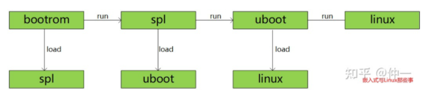
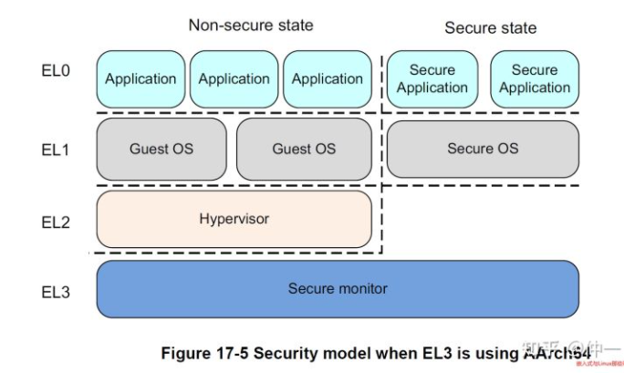
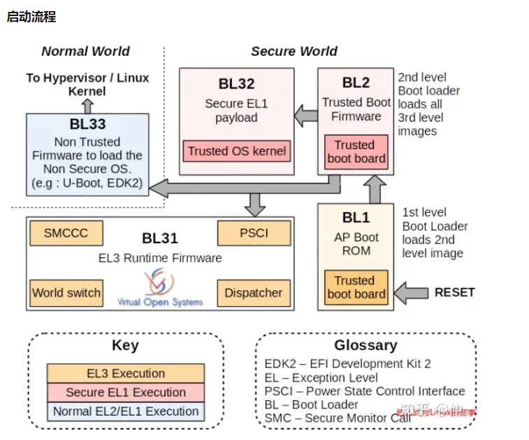
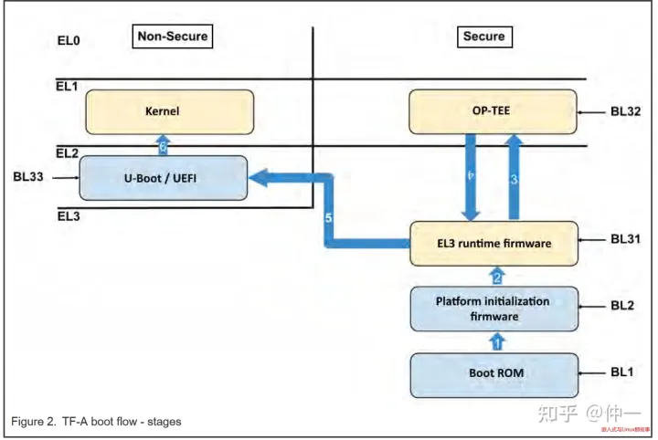
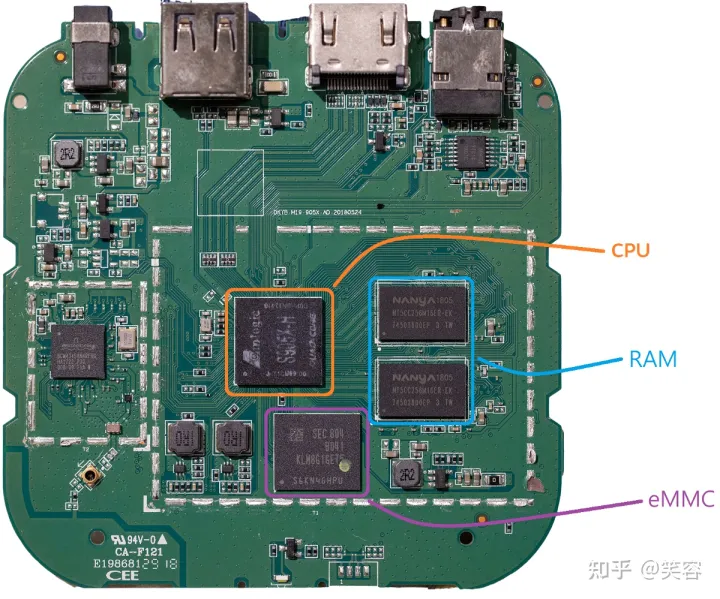
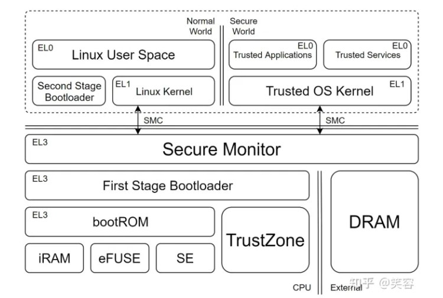

# **什么是secure boot**

secure boot是指确保在一个平台上运行的程序的完整性的过程或机制。

secure boot会在固件和应用程序之间建立一种信任关系。

在启用secure boot功能后，未经签名的固件或程序将不能运行在该设备上。


通过这种方式，可以保护操作系统免受恶意攻击。

secure boot一般**使用公钥/私钥来验证固件和应用程序的签名是否合法**。

# **为什么需要secure boot**

嵌入式设备启动一般从bootrom开始，逐级加载spl，uboot，linux，应用程序。

该流程中由bootrom开始，逐级通过spl、uboot以启动linux操作系统。

我们假设spl、uboot和linux镜像都被保存在flash上，

则在启动时，各级启动程序都需要从flash中加载下一级启动镜像，其流程示意图如下：




如果以上流程未执行secure boot，

则flash中的镜像一旦被恶意攻击者替换掉，

那么最终系统上将会运行被攻击者篡改过的固件。

假设linux和rootfs被替换掉以后，那么启动后整个系统都将掌握在攻击者的手里。

从而导致在操作系统之上构建的所有安全机制都形同虚设。

# **secure boot预备知识**

ARMv8分为Secure World和Non-Secure World（Normal World），

四种异常级别从高到低分别为EL3，EL2，EL1，EL0。

EL3具有最高管理权限，负责安全监测和Secure World和Normal World之间的切换。

**EL2主要提供了对虚拟化的支持。**

EL1是一个特权模式，能够执行一些特权指令，用于运行各类操作系统，在Secure World则是secure OS（如TEE）。

**EL0是无特权模式，所有APP应用都在EL0。**






## 启动流程

上图中的BL1，BL2，BL31，BL32，BL33分别对应如下功能：

### **BL1**

**BL1是信任链的根所在，一般是固化在芯片内部的一段代码，叫做bootrom**，具有最高的执行权限EL3，在 CPU 出厂时就被写死了。

**bootrom通常会被映射到它专属的一块内存地址中，但是如果你尝试向这块地址写入内容，一般都会出错。**

芯片上电或复位后，bootrom的代码会从固定位置加载BL2来初始化sram，在BL2 验签通过后会跳转到BL2 ，以保证可信任执行。

### **BL2**

BL2和BL1一样，也是运行在EL3特权级别的，

不同的是BL2在flash中的一段可信安全启动代码，

它的可信建立在BL1对它的验证，

主要完成一些平台相关的初始化，比如对ddr的初始化等。

在完成初始化后寻找BL31或者BL33进行执行；

**如果找到了BL31则不会继续调用BL33，如果没有BL31则BL33必须有。**

### **BL31**

BL31作为EL3最后的安全堡垒，

它不像BL1和BL2是一次性运行的。

如它的runtime名字暗示的那样，

它通过SMC指令为Non-Secure持续提供设计安全的服务，

在Secure World和Non-Secure World之间进行切换。

**它的主要任务是找到BL32，验签，并运行BL32。**

### **BL32**

BL32是所谓的secure os，在ARM平台下是 ARM 家的 Trusted Execution Environment（TEE）实现。

OP-TEE 是基于ARM TrustZone硬件架构所实现的软件Secure OS。

一般在BL32会运行OPTee OS + 安全app，

它是一个可信安全的OS运行在EL1并在EL0启动可信任APP（如指纹信息，移动支付的密码等），

并在Trust OS运行完成后通过SMC指令返回BL31，

BL31切换到Non-Seucre World继续执行BL33。

> BL32 在不同的平台有不同的实现，Intel 的叫做 Software Guard Extensions（SGX），AMD 的叫做 Platform Security Processor（PSP）

### **BL33**

到了BL33这里就是Normal Wrold了，运行的都是非安全固件，也就是我们常见的UEFI firmware或者u-boot，也可能是直接启动Linux kernel。

启动BL1，BL2，BL31，BL32则是一个完整的ATF信任链建立流程（ARM Trusted Firmware），像常见的PSCI（Power State Coordination Interface）功能则是在ATF的BL31上实现。

最后一张图完整展示整个调用流程：




可以说，**Secure Boot** 的安全模型建立在消费者是攻击者这一假设上。

消费者在物理上拥有产品硬件，

可以对产品进行物理连接、拆机、改装等等物理上的操作。

可以说跟传统的安全模型中的攻击者相比根本不在一个层面上。


消费者作为攻击者的目的，

一般常见的有刷机安装自定义的操作系统（Mod）、

绕过厂家封闭的支付平台（IAP）

和应用商城安装自定义的应用程序、

绕过版权保护系统（DRM）

达到复制厂家保护的数字产品内容等等。

**这些操作往往都会直接影响厂家的利益，**

因此需要一种能抵抗消费者攻击的安全机制。


上面提到了，消费者可以直接拆机干涉产品的硬件模块。

比如比较专业的消费者甚至可以使用数字示波器监听 CPU 和 RAM 、eMMC 之间的数据传输来读取非常底层的数据传输。

如下图所示，我拿某厂的电视盒子的 PCB 拍了张照方便大家理解，

如图中圈出来的，CPU 、RAM 、eMMC 都是分开的芯片，

中间的连接电路是有可能被监听的，

有些研究人员可以焊接极细的导线到电路上，

来监听、拦截、甚至篡改不同芯片之间数据的传输。




而且像 eMMC 这种芯片通常都是业界标准化的，

攻击者甚至可以把芯片拆下来，

然后用市面上现成的通用 eMMC 编程工具来读写上面的内容。


**不过业界还是给攻击者的能力设置了一个上限。**

**这个上限通常是认为攻击者不至于能够剥离芯片的封装，**

然后用电子显微镜等纳米级别精度的显像设备来逆向芯片的内部结构。

或者说能成功攻破芯片安全机制的一次性投资成本至少需要在十万美元以上才可以认为是安全的。

Secure Boot 安全机制的原理，

**就是将最为核心的安全机制整合到最关键的主 CPU 中。**

因此就算攻击者可以监听电路板上的线路，甚至拆装个别芯片单独调试，也无法破坏 Secure Boot 的安全机制。


# CPU 内部的安全机制




##  bootROM

所有支持 Secure Boot 的 CPU 都会有一个写死在 CPU 中的 **bootROM** 程序。CPU 在通电之后执行的第一条指令就在 bootROM 的入口。bootROM 拥有最高的执行权限，也就是 **EL3**。它将初始化 Secure Boot 安全机制；加载 Secure Boot Key 等密钥；从 eMMC 加载并验证 **First Stage Bootloader（FSBL）**；最后跳转进 FSBL 中。

bootROM 是完全只读的，这个在 CPU 出厂时就被写死了，连 OEM 都无法更改。bootROM 通常会被映射到它专属的一块内存地址中，但是如果你尝试向这块地址写入内容，一般都会出错或者没有任何效果。

有些芯片还会有一个专门的寄存器控制 bootROM 的可见性，bootROM 可以通过这个寄存器禁止别的程序读取它的代码，以阻止攻击者通过逆向 bootROM 寻找漏洞。

## iRAM

**为了避免使用外部 RAM 芯片**，支持 Secure Boot 的 CPU 上都会内置一块很小的 RAM，通常只有 16KB 到 64KB ，我们称之为 **iRAM**。这块 iRAM 上的空间非常宝贵，bootROM 一般会用 4KB 的 iRAM 作为它的堆栈。FSBL 也会被直接加载到 iRAM 上执行。

## eFUSE

所有支持 Secure Boot 的 CPU 都会有一块很小的一次性编程储存模块，

我们称之为 **FUSE** 或者 **eFUSE**，

因为它的工作原理跟现实中的保险丝类似：

CPU 在出厂后，这块 eFUSE 空间内所有的比特都是 1，

如果向一个比特烧写 0，就会彻底烧死这个比特，再也无法改变它的值，也就是再也回不去 1 了。


一般 eFUSE 的大小在 **1KB** 左右，

OEM 从 CPU 厂家购买了芯片，组装了产品后，**一般都要焼写 eFUSE 的内容，包括产品的运行模式：测试、开发、生产等**。

面向终端消费者的产品都会被焼写为**生产模式**。

这个模式下 bootROM 会禁用很多权限，更大面积地限制用户的能力。


另外一个很重要的焼写内容就是**根密钥**了。

一般有两种根密钥：

一个是加密解密用的**对称密钥 Secure Boot Key**，一般是 **AES 128** 的，每台设备都是随机生成不一样的；

另一个是一个 **Secure Boot Signing Key 公钥**，一般用的 **RSA** 或 **ECC**，这个是每个 OEM 自己生成的，每台设备用的都一样，有些芯片会存公钥的 Hash 来减少 eFUSE 的空间使用。

只有 Secure World（后面会介绍）才能访问 eFUSE 的寄存器。

除了读写 eFUSE 的基础寄存器之外，还有一些控制寄存器可以禁止别的程序访问 eFUSE，来保护其中的密钥。

因此 eFUSE 中的根密钥以及 bootROM 将作为 Secure Boot 的根信任。

## Security Engine

有些 CPU 中还会有一个专门负责加密解密的模块，我们称为 **Security Engine**。

这个模块也是只有在 Secure World 中才能访问。

这个模块通常会有若干个**密钥槽（Keyslots）**，

可以通过寄存器将密钥加载到任意一个 Keyslot 当中，

Keyslot 的加载操作将复盖之前加载过的密钥。

通过寄存器操作 DMA 读写，可以使用 Keyslot 中的密钥对数据进行加密、解密、签名、HMAC、随机数生成等操作，但是没有办法从一个 Keyslot 中读取已经加载的密钥值。

## First Stage Bootloader（FSBL）

FSBL 的作用是初始化 PCB 板上的其他硬件设备，给外部 RAM 映射内存空间，从 eMMC 的 GPT 分区上加载验证并执行接下来的启动程序。


## Keybox

因为 eFUSE 的大小有限，而且不可更改，

有些体积比较大的，或者有可能更新的密钥数据，

包括像各种 DRM 系统、HDCP、Attestation 等等的密钥，

都会用 Secure Boot Key 或者一个 Derived Key 进行加密后储存在 eMMC 的一个 GPT 分区上，

因此基本上没什么大小限制。

FSBL 一般会将这个分区加载到 RAM 中，

然后 TA 再通过 Security Engine 中已经载入的 Keyslot 对其进行解密获得相应的密钥。

## Second Stage Bootloader（SSBL）

SSBL 的作用是给 Normal World 做初始化，加载验证并执行 Linux/Android 内核。常见的 SSBL 是基于 U-Boot 项目改的，通常这里已经支持像 Fastboot、Recovery boot 等等的常见启动对象了。


## 搭建信任链

FSBL 的下一阶段一般包含三个程序：

Secure Monitor、Trusted OS、Second Stage Bootloader。

FSBL 会分别从 eMMC 加载验证这些程序，最后跳转到 Secure Monitor 执行。


Secure Monitor 会初始化 TrustZone 环境，设置 SMC 回调，然后开始执行 FSBL 已经加载好的 Normal World 中的 Second Stage Bootloader，和 Secure World 中的 Trusted OS。


Trusted OS 会初始化 Secure World 中的系统内核环境，

然后从 eMMC 加载各种 Trusted Applications（TA），

认证它们的数字签名，然后执行它们。

每个 TA 都会有自己独立的虚拟内存空间。

TA 如果要访问特定的硬件，比如 Security Engine，

会在一个描述 TA 的头信息中申请，TA 的签名也会涵盖这部分头信息。

Trusted OS 如果同意 TA 访问这些硬件，会把对应的寄存器地址 mmap 映射到 TA 的虚拟内存空间中。

Second Stage Bootloader 也就是我们一般说的 Android Bootloader，它会加载验证然后执行 Android Kernel。

# amlogic secureboot

首先要获取Aml_Linux_SCS_SignTool.zip工具包。

解压后，放在跟sdk代码并列的目录下。

然后是用于生成设备厂商SCS相关的密钥

```
进入uboot:cd bootloader/uboot-repo/
以a311d2为例
./fip/t7/generate-device-keys/gen_all_device_key.sh --key-dir ./dv_scs_keys --rsa-size4096 --project a311d2 --rootkey-index 0 --template-dir ./soc/templates/t7  --out-dir ./device-keys
```

然后是生成efuse文件

```
a311d2
./fip/t7/bin/efuse-gen.sh --input fip/t7/bin/device.license.bin --dvgk./dv_scs_keys/root/dvgk/a311d2/dvgk.bin --device-roothash./dv_scs_keys/root/rsa/a311d2/roothash/hash-device-rootcert.bin -o pattern.efuse
```

然后编译签名过的bootloader

要把前面生成的device-keys文件拷贝到uboot的board对应目录下。

```
cp-r ./device-keys ./bl33/v2019/board/amlogic/t7_an400_lpddr4x
```

把板子头文件里的CONFIG_AML_SIGNED_UBOOT宏定义为1

然后编译uboot

```
./mk t7_an400_lpddr4x --avb2
```

aml_upgrade_package.img 这个文件也要进行签名。

```
a311d2
bash amlogic_scs_sign_whole_pkg.bash 
--soc a311d2 
--aml_key ../openlinux_an11_20211130_fc/bootloader/uboot-repo/bl33/v2019/board/amlogic/t7_an400_lpddr4x/device-keys 
--fw_arb_cfg ../openlinux_an11_20211130_fc/bootloader/uboot-repo/bl33/v2019/board/amlogic/t7_an400_lpddr4x/fw_arb.cfg
--aml_img ../openlinux_an11_20211130_fc/out/target/product/t7_an400/aml_upgrade_package.img
--bootloader_zip 
../openlinux_an11_20211130_fc/bootloader/uboot-repo/build/t7_an400_lpddr4x-u-boot.aml.zip
--output
../openlinux_an11_20211130_fc/out/target/product/t7_an400/t7.scs_and_arb.signed.img
```


ota包也要进行签名


buildroot\package\amlogic\aml_img_packer_new\src\aml_upgrade_pkg_gen.sh

这个脚本里，有函数进签名的。

```
aml_secureboot_sign_bootloader
aml_secureboot_sign_kernel
	boot.img和recovery.img都是这个函数来签名。
aml_secureboot_sign_bin
	这个是对dtb.img进行签名的。
```


```
PRODUCT_AML_SECUREBOOT_USERKEY=${BINARIES_DIR}/aml-user-key.sig
```


参考资料

1、

https://doc.amlogic.com/file/detail?type=1&id=18716

# 参考资料

1、secure boot (二)基本概念和框架

https://zhuanlan.zhihu.com/p/566867415

2、浅析安全启动（Secure Boot）

https://zhuanlan.zhihu.com/p/540171344

