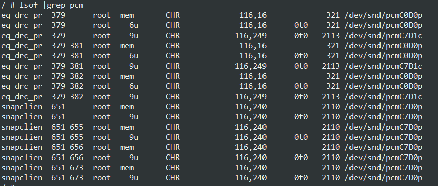

--

# snapcast发展历史

Snapcast 是一个用于同步音频流的开源项目，用于在多个设备之间实现音频同步播放。以下是 Snapcast 发展历史的概述：

1. **2015 年：** Snapcast 项目于 2015 年由一个开发者团队启动，旨在解决音频同步播放的问题。项目最初的目标是在 Linux 系统上实现多房间音频同步。

2. **2016 年：** Snapcast 在 2016 年发布了首个版本，允许用户在不同的设备上同步播放音频。这个版本的主要功能是实现基本的音频同步，以及在局域网内的多房间音频播放。

3. **2017 年：** 随着项目的发展，Snapcast 逐渐增加了更多的功能和特性，包括支持高质量音频传输、低延迟、音频格式支持等。这使得 Snapcast 在多房间音频领域变得更加有竞争力。

4. **2018 年及以后：** Snapcast 继续不断地更新和改进，添加了更多的功能和改进，以提供更好的用户体验。项目在社区的支持下得到了进一步发展，并得到了越来越多的关注。

5. **社区贡献：** Snapcast 是一个开源项目，因此它受到来自全球社区的贡献。开发者们不断提交代码、提出建议和改进，使得 Snapcast 的功能和稳定性得到不断提升。

总的来说，Snapcast 是一个持续发展的开源项目，旨在为用户提供在多个设备之间实现音频同步播放的解决方案。通过不断的更新和改进，Snapcast 在多房间音频同步领域取得了显著的进展，并为用户创造了更好的音频体验。你可以在 Snapcast 的官方代码仓库或相关社区中了解更多关于它的发展历史和最新动态。

# snapcast 原理说明

Snapcast 是一个开源的音频同步播放系统，可以在多个设备之间实现音频流的同步播放。以下是 Snapcast 的工作原理说明：

1. **Server-Client 模型：** Snapcast 采用了一种服务器-客户端模型。在这个模型中，有一个 Snapcast 服务器负责管理音频流的同步和分发，同时有多个 Snapcast 客户端设备用于接收和播放同步的音频流。

2. **音频编码和传输：** 音频源首先被编码成音频流，并由 Snapcast 服务器进行管理。服务器将编码后的音频流发送给各个客户端设备，以实现同步播放。音频流可以采用不同的编码格式，例如 FLAC、MP3 等。

3. **同步机制：** 服务器通过精确的同步机制来确保音频在各个客户端设备上同步播放。同步机制涉及到网络延迟的测量和补偿，以及确保各个客户端设备按照相同的时间轴播放音频。

4. **缓冲管理：** 客户端设备接收到音频流后，会进行适当的缓冲管理，以确保音频播放的平稳性和稳定性。缓冲管理也有助于处理网络抖动和延迟波动。

5. **音频渲染：** 客户端设备将接收到的音频流解码并渲染到音频输出设备（如扬声器）上。由于同步机制的存在，各个客户端设备在相同的时间点播放相同的音频。

6. **多房间支持：** Snapcast 支持在多个房间内实现音频同步，用户可以在不同的房间内播放相同的音频，创造出一致的音频体验。

总的来说，Snapcast 的原理在于使用服务器-客户端模型，通过精确的同步机制和缓冲管理，实现多个设备之间的音频同步播放。这使得用户可以在不同房间内实现一致的音频体验，适用于多房间音频播放的场景。

# 编译运行

要在板端运行snapcast。所以想要集成到buildroot里编译。

自己手动建立一个local的目录来编译。

依赖了avahi。buildroot里有这个，在network application下面，选择好，编译就可以了。
依赖了flac。buildroot里也有。
依赖了beast，这个是基于boost写的一个http和websocket库。

到这里有点走不下去了。

还是先在我的笔记本上编译看看。

需要先看snapcast的编译过程。

不clone submodule的东西。

手动安装相关依赖。

报错，先安装这2个。

```
sudo apt-get install libavahi-client-dev libsoxr-dev
```

再报错：

```
boost/asio.hpp: 没有那个文件或目录
```

我的笔记本上需要安装boost。上面这个错误是boost asio需要安装。

```
sudo apt-get install -y libasio-dev
```

提示会安装这些内容：

```
libboost-date-time-dev libboost-date-time1.58-dev libboost-dev libboost-regex-dev libboost-regex1.58-dev libboost-regex1.58.0 libboost-serialization1.58-dev libboost-serialization1.58.0
  libboost1.58-dev
```

再编译：

```
client_connection.hpp:76:10: error: ‘promise’ in namespace ‘std’ does not name a template type
     std::promise<std::unique_ptr<msg::BaseMessage>> promise_;
```

这个手动在hpp文件里加上：

```
#include <future>
```

再编译：

```
提示io_context.hpp找不到。
目前安装的boost里还真没有。
```


直接根据github上的说明，完全安装操作说明来做，看看buildroot里能不能正常编译。

专门有个snapos，基于buildroot做的。

对应的代码：https://github.com/badaix/snapos

1、下载buildroot。我当前有一份。树莓派3的。刚好可以用。

2、下载snapos。这个很少，就是一些配置信息。

3、定义snapos为external组件。

```
cd /home/hlxiong/work2/buildroot/buildroot-rpi3
make BR2_EXTERNAL=/home/hlxiong/work2/buildroot/buildroot-rpi3/../snapos/buildroot-external/ snapos_rpi3_defconfig
```

> make menuconfig

在最外层的external options里，可以看到配置：

```
     *** Snapcast OS (in /home/hlxiong/work2/buildroot/snapos/buildroot-external) ***   
 [*] Snapcast                                                                           
 [*]   Snapclient                                                                       
 [ ]   Snapserver                                                                       
 [ ] snap-mpd                                                                           
```

执行make。

编译需要时间。先看一下相关的配置。

```
hlxiong@hlxiong-VirtualBox:~/work2/buildroot/snapos/buildroot-external$ tree
.
├── board
│   └── raspberrypi
│       ├── common
│       │   ├── post-build.sh
│       │   └── post-image.sh
│       ├── raspberrypi1
│       │   ├── genimage.cfg
│       │   └── post-image.sh
│       └── raspberrypi2
│           ├── genimage.cfg
│           └── post-image.sh
├── Config.in
├── configs
│   ├── snapos_rpi2_defconfig
│   ├── snapos_rpi3_defconfig
│   ├── snapos_rpi4_defconfig
│   └── snapos_rpi_defconfig
├── external.desc
├── external.mk
├── package
│   ├── snapcast
│   │   ├── Config.in
│   │   ├── S99snapclient
│   │   ├── S99snapserver
│   │   └── snapcast.mk
│   └── snap-mpd
│       ├── Config.in
│       ├── mpd.conf
│       ├── playlists
│       │   └── einslive.m3u
│       ├── S95mpd
│       └── snap-mpd.mk
└── README.md
```

重点是看package目录下的snapcast.mk。

依赖是这么写的：

```
SNAPCAST_DEPENDENCIES = libogg alsa-lib avahi 
# libstdcpp libatomic libflac libvorbisidec
# 这几个都被注释掉了的。
```

就用了ogg的方式。

基于cmake方式来编译的。

```
$(eval $(cmake-package))
```

snapcast.mk里，没有定义编译的行为，只定义了install的相关行为。

Config.in是这么写的：

```
select BR2_PACKAGE_AVAHI
select BR2_PACKAGE_AVAHI_DAEMON
select BR2_PACKAGE_BOOST
select BR2_PACKAGE_DBUS
select BR2_PACKAGE_FLAC
select BR2_PACKAGE_LIBVORBIS
select BR2_PACKAGE_OPUS
```

当前我手动在自己的buildroot下配置snapcast的编译，是报了这个错误：

```
control_session_http.hpp:72:39: 错误：‘tcp_stream’不是‘beast’的成员
```

这个是需要安装boost asio的文件才行的。还要boost beast的文件。

但是当前buildroot里并没有搜索到这2个的配置项。

先编译看看能不能成功。

```
Incorrect selection of kernel headers: expected 4.15.x, got 4.19.x
```

support/scripts/check-kernel-headers.sh 这个脚本报的错误。

为什么会这样呢？

当前buildroot的版本是：2018.02.7, 2018年10月份发布的。

需要的是4.15版本的，但是得到了4.19版本的。

内核的版本是snapos里的defconfig。

它指定的内核是：

```
$(call github,raspberrypi,linux,raspberrypi-kernel_1.20190819-1)/linux-raspberrypi-kernel_1.20190819-1.tar.gz
```

需要的内核版本又是从哪里来的呢？

现在是在make linux-headers这一步。

当前是谁在调用check-kernel-headers.sh？

```
./toolchain/helpers.mk
```

这个脚本要2个参数，第一个是目录`/home/hlxiong/work2/buildroot/buildroot-rpi3/output/host/arm-buildroot-linux-gnueabihf/sysroot`。第二个参数是4.15，

它自己又是封装成了一个check_kernel_headers_version函数。

这2个地方调用了：

```
./package/linux-headers/linux-headers.mk:127:   $(call check_kernel_headers_version,\
./toolchain/toolchain-external/pkg-toolchain-external.mk:537:   $$(call check_kernel_headers_version,\
```

目标版本号从这个宏得到：BR2_TOOLCHAIN_HEADERS_AT_LEAST

```
./.config:373:BR2_TOOLCHAIN_HEADERS_AT_LEAST="4.15"
```

目前toolchain里可以配置的最新的header版本就是4.15的。

我下载最新的buildroot来做这个吧。

最新的版本是2020.02 

这个buildroot包倒是不大,因为就是一些配置文件。

最新版本的头文件就不会有问题了。

编译看看。

现在dl下的规则变化了：每个包都放到自己的单独的目录下了。

不过很多要求的软件的版本也都升级了。所以之前下载的包意义也不是很大。重新下吧。

只是内核的，因为是特定的版本，所以可以重复利用一下。看看它会生成什么目录，我手动停止编译，把之前的压缩包放进去再继续编译。

alsa的库是ftp下载的，好像ssr代理对ftp的没有起作用。

我直接手动下载放到对应的目录下。可以。

下载的boost是1.72版本的。


```
BR2_ROOTFS_POST_BUILD_SCRIPT="$(BR2_EXTERNAL_SNAPOS_PATH)/board/raspberrypi/common/post-build.sh board/raspberrypi3/post-build.sh"
BR2_ROOTFS_POST_IMAGE_SCRIPT="$(BR2_EXTERNAL_SNAPOS_PATH)/board/raspberrypi/common/post-image.sh board/raspberrypi3/post-image.sh"
BR2_ROOTFS_POST_SCRIPT_ARGS="--add-pi3-miniuart-bt-overlay --add-wlan0 --add-audio --speedup-boot --raise-volume --mount-boot"
```

重点看看这些。

```
--add-pi3-miniuart-bt-overlay
	这个是为了串口，因为蓝牙和串口是冲突的，所以要设置一下。
--add-wlan0
	如果/etc/network/interfaces里面没有wlan0，把wlan0加进去。
--add-audio
	这个是在post-image.sh里使用的。
	修改config.txt里来的内容。
--speedup-boot
	这个是为了加快启动速度，也是修改config.txt的内容的。
--raise-volume
	修改默认的alsa音量。
--mount-boot
	Adding mount point for /boot to /etc/fstab
	挂boot分区。
```

编译完了，没有报错。花了3个多小时。

搜索了一下，发现是有tcp_stream的库的。

```
boost/beast/core/tcp_stream.hpp
```

但是1.66版本里，就没有这个头文件。

所以问题的关键就是要升级boost的版本。

镜像288M。


镜像在树莓派上运行测试一下。

运行不起了。

1、首先是需要修改config.txt，在最后加上enable_uart=1，不然都不知道有没有启动成功。

2、现在是死机了。

```
[    2.319902] VFS: Cannot open root device "mmcblk0p2" or unknown-block(179,2): error -117
[    2.329571] mmc1: new high speed SDIO card at address 0001
[    2.333880] Please append a correct "root=" boot option; here are the available partitions:
[    2.333894] 0100            4096 ram0 
[    2.333901]  (driver?)
[    2.342349] usb 1-1: new high-speed USB device number 2 using dwc_otg
[    2.356700] 0101            4096 ram1 
[    2.363965] Indeed it is in host mode hprt0 = 00001101
```

这个是SD卡的分区没有识别出来。

我把这个卡放到Ubuntu笔记本上看一下，也是无法识别的。可能是卡的问题。

换一张SD卡看看。可以正常启动。

Login with user `root` and password `snapcast`

修改/etc/wpa_supplicant.conf。然后杀掉wpa_supplicant进程，重新启动这个进程。

就可以获取到ip地址。

然后怎么验证板端的snapclient是否已经正常工作呢？

目前我在树莓派里只配置了snapclient的。

这个client启动的参数，是从/etc/default/snapclient这个文件里读取的。

默认是空的。

我还是笔记本做snapserver，播放当前实时录音。

```
snapclient -h 172.16.4.205
```

这样可以通，实时的录音可以传递过来。


snapcast怎样跟mpd搭配起来的？


# 使用

snap server的audio input是一个命名管道，叫/tmp/snapfifo。

所有被送进这个管道的数据都会被分发给所有的client。

一个典型的使用snapcast的方法，就是用mpd。它可以配置一个命名管道来作为音频输出。


工作原理

snap-server从/tmp/snapfifo里读取数据包，这些数据包被打上了时间标记。

支持的数据编码格式有：

```
pcm
flac
vorbis
opus
```

通过tcp把数据发送给snap-client。

每个client都跟server持续进行时间同步。

每一个收到的数据包，先被解码，然后放到一个buffer里。

根据server的时间，数据包在合适的时候发送给alsa进行播放。

典型的时间偏差不超过0.2ms。


在Ubuntu下的安装

apt-get是安装不了的。

snapcast的release页面有amd64的deb包。下载，用dpkg进行安装。

snapserver的配置文件在/etc/snapserver.conf。

最关键的一个参数是：

```
stream = pipe:///tmp/snapfifo?name=default
#stream = tcp://127.0.0.1?name=mopidy_tcp
```

在同一台机器上测试。

启动server，不用带任何参数，

```
snapserver
```

启动client，也不用带任何参数。默认参数可以正常工作。

```
snapclient
```


我们现在在server上，执行：

```
sudo cat /dev/urandom > /tmp/snapfifo
```

这样是播放了杂音。

我们可以直接录音，录音参数要指定一下，不然就是杂音。

```
sudo arecord -f S16_LE -r 48000 -c 2 > /tmp/snapfifo 
```

播放实时录音，是可以通的。


# 自己编译的树莓派系统分析

目前树莓派上插着一个usb的摄像头和耳机。

arecord录音可以。

修改密码：passwd root。

aplay播放不行。

```
ALSA lib pcm_dmix.c:1089:(snd_pcm_dmix_open) unable to open slave
```

用speaker-test测试也是一样的。

```
speaker-test -w 1.wav 
```

但是前面通过snapclient可以播放的。

我把mpd进程杀掉，还是不能播。

可以了。因为播放的card1，录音的是card0的。

/root/.asoundrc这样写：

```
pcm.!default {
        type hw
        card 1
}

ctl.!default {
        type hw
        card 0
}
```

就可以了。

现在录音和播放都正常。


数据通路是这样：

```
播放软件 --> /tmp/snapfifo --> snapserver --> 网络 --> snapclient --> alsa
```


mpd怎样进行结合。

编辑mpd.conf文件。让mpd的数据流入到/tmp/snapfifo。

因为mpd默认是输出给alsa的。所以我们需要修改audio_output这个的属性。

改成下面这样：

```
audio_output {
    type            "fifo"
    name            "my pipe"
    path            "/tmp/snapfifo"  # 重点是这一行。
    format          "48000:16:2"
    mixer_type      "software"
}
```

为了测试mpd，我们可以这样来测试。这个是一个在线电台的地址。

```
echo "http://wdr-1live-live.icecast.wdr.de/wdr/1live/live/mp3/128/stream.mp3" > /var/lib/mpd/playlists/einslive.m3u
```

但是当前并没有播放。

不用mpd，有没有什么问题？

用了可以带来什么好处？

我的需求：

1、播放音乐。

2、播放实时语音。


现在笔记本做snapserver，用mpc播放音乐。

树莓派做snapclient。

运行碰到的问题：

1、树莓派的时间不对，连不上服务器。改了时间就好了。

2、播放没有声音。打印这些。

```
2020-03-13 13-44-52 [Info] My MAC: "b8:27:eb:00:4e:ca", socket: 6
2020-03-13 13-44-52 [Err] Exception in Controller::worker(): read_some: End of file
2020-03-13 13-44-52 [Err] Controller::onException: read_some: End of file
```

笔记本自己做client，也没有声音。

问题应该是mpd的问题。

我用arecord > /tmp/snapfifo 。这样可以有声音。

就是audio_output那几行配置，我输入的不行，感觉没有写错。

拷贝配置粘贴过来就正常了，有声音了。

现在树莓派这边也可以得到声音了。

但是效果很不好，一点都不连贯。

笔记本上自己连自己也是一样不连贯。

说明：

1、跟时间没有关系。

2、跟网络没有关系。


这是为什么呢？

是格式问题吗？

现在所有的设备都是卡的。

试一下其他的播放器。

也是一样的。

这就是不可用的状态。

我记得之前并没有这样。

版本问题？

当前笔记本上的版本，是dpkg安装的deb包。0.18.1版本的。

我buildroot里编译的版本是0.17.1的。

手机apk看到也是0.17.1的。

因为默认系统里就已经启动了snapserver和snapclient了。

我后面启动的就冲突了。

现在我自己的板子、手机、树莓派都可以勉强播放。

很多时候都是出错的时候。

经常报End of file的错误。手机和板子上都有碰到。

https://github.com/badaix/snapcast/issues/61

这里提到了同样的问题。看起来需要统一版本。

我把电脑上的版本，也降级到0.17.1的。

我自己编译这个版本。

基于cmake来编译。虽然也可以支持make编译。

```
libflac-dev 
```

运行报这个错。

```
2020-03-13 15-49-03 [Err] Exception: unknown codec: flac
2020-03-13 15-49-03 [Notice] daemon terminated.
```

snapserver.conf里改成ogg的先。

可以正常了。

播放效果还可以。

有时候会持续一段时间，所有的设备都没有数据播出。


# 代码阅读

server端开了3个socket，1780是http端口，1704是音频数据端口，1705是控制信息端口。

```
ServerSettings	
   	HttpSettings http;
   		port：默认1780 。
    TcpSettings tcp;
    	port：默认1705
    StreamSettings stream;
    	port：默认1704
    	codec：默认flac。
    	buffer：默认1000ms。
    	读取间隔：默认20ms。
    	格式：48000:16:2
    	是否发送数据给muted的client：默认为否。
    LoggingSettings logging;
```

main函数分析：

```
1、默认的pcmStream为：pipe:///tmp/snapfifo?name=default
	默认的配置文件是：/etc/snapserver.conf
2、解析命令行选项和config文件。

```


默认的snapserver.conf里内容是这样（去掉了所有注释）。相当于什么都没写。

```
[http]
[tcp]
[stream]
stream = pipe:///tmp/snapfifo?name=default
[logging]
```

# 参数解析库

参数解析是作者自己写的一个库。代码在这里：https://github.com/badaix/popl

popl是Program Option Parser Library的意思。

这个库，只有一个头文件。使用方便。

支持跟getopt一样的解析原则。

没有其他的依赖，只需要C++11支持。

平台无关。

自动创建帮助信息。

这个代码写得非常漂亮，可以作为一个c++11的学习资料。

OptionParser是主要的类。

```
Option
	Value
		Implicit
		Switch
```

```
OptionPrinter
	ConsoleOptionPrinter
	GroffOptionPrinter
	BashCompletionOptionPrinter
```


# mdns服务是怎样添加的

```
_snapcast._tcp
_snapcast-stream._tcp
	这2个共用1704端口。
	这个就是stream的。
如果tcp使能。
	_snapcast-jsonrpc._tcp
	_snapcast-tcp._tcp
	这2个都使用1705端口。
如果http使能
	_snapcast-http._tcp
	使用1780端口。
	
然后调用publishZeroConfg.publish(dns_services);这个进行发布。
那么就至少有5个服务。
```

当前机器里可以看到的：

```
/ # avahi-browse -a -r                                                                   
+  wlan0 IPv4 Snapcast                                      _snapcast-http._tcp  local   
+  wlan0 IPv4 Snapcast                                      _snapcast-tcp._tcp   local   
+  wlan0 IPv4 Snapcast                                      _snapcast-jsonrpc._tcp local 
+  wlan0 IPv4 Snapcast                                      _snapcast-stream._tcp local  
+  wlan0 IPv4 Snapcast                                      _snapcast._tcp       local   
+  wlan0 IPv4 snapserver                                    _ssh._tcp            local   
+  wlan0 IPv4 snapserver                                    _sftp-ssh._tcp       local   
```

有5个命名为snapcast，有2个命名为snapserver。

snapserver这个名字，是因为我修改了/etc/avahi/avahi-daemon.conf里。

```
[server]               
host-name=snapserver   
```

那2个名字为snapserver的服务，是因为在/etc/avahi/services有对应的服务配置文件。

```
/etc/avahi/services # ls      
sftp-ssh.service  ssh.service 
```

我们看一下ssh.service文件。实际上，机器并没有开启ssh服务。所以这个并不代表真正的服务。实际上这个目录下的内容，可以清空。

```
<service-group>                               
                                              
  <name replace-wildcards="yes">%h</name>     
                                              
  <service>                                   
    <type>_ssh._tcp</type>                    
    <port>22</port>                           
  </service>                                  
                                              
</service-group>                              
```

Snapcast，并没有使用avahi-daemon.conf里的统一的全局的snapserver这个名字呢？

是怎么做到修改的呢？

就是靠

```
PublishmDNS 的这个属性：构造函数传递进来就是Snapcast这个字符串。
	std::string serviceName_;
	
这个字符串，最后传递给下面的函数来创建服务。
	avahi_entry_group_add_service
```


```
class PublishAvahi : public PublishmDNS
```

PublishmDNS

```
PublishmDNS//基类。
	方法：
	void publish(const std::vector<mDNSService>& services)//虚函数。
	属性：
	std::string serviceName_;
```


```
struct mDNSService
	std::string name_;
    size_t port_;
```

PublishZeroConf

```
typedef PublishAvahi PublishZeroConf;
```

```
class PublishAvahi : public PublishmDNS
	AvahiClient* client_;
	std::vector<mDNSService> services_;
```


这个publish就是产生服务的直接原因。

```
void PublishAvahi::publish(const std::vector<mDNSService>& services)
```


自己来创建一个mdns服务看看。

# snapclient如何找到snapserver

看了一下snapclient的代码，snapclient后面可以不跟任何参数，就可以找到snapserver。

就是靠搜索`_snapcast._tcp`这个服务。

```
if (browser.browse("_snapcast._tcp", avahiResult, 5000))
```


# snapclient导致其他的程序播放没有声音

我的程序结构是：

同一台机器，同时运行snapclient和snapserver。

使用mpd把音频数据转发给/tmp/snapfifo。

这样可以正常播放音乐。

但是在这之后，我用aplay、speaker-test、mpg123，播放内容，都不报错。但是没有声音。

如果是在snapclient发出声音之前，使aplay等工具，是可以正常发出声音的。

那么很明显就是snapclient导致了这个问题，而且是在发出声音这一行为发生之后才导致问题。

而且即使我把snapclient杀掉也仍然无法解决问题。


对于这个问题，除了直接正面解决问题外，目前应该有这么几条可以尝试的解决方法：

1、所有声音都通过snapfifo来发声。这个就需要自己写一个播放器。


上面说的只是最后的没有办法的时候，才进行尝试。

先还是正面来看问题。

按道理，多个程序，同时进行播放，是可以正常发声的。


看一下snapclient的main函数流程。

```
默认参数
	string meta_script("");
    string soundcard("default");
    string host("");
    size_t port(1704);
    int latency(0);
    size_t instance(1);
```

snapclient -l，可以列出系统里可以用的声卡信息。

主要是在这个函数里工作：

````
controller->start(pcmDevice, host, port, latency);
````

鉴于aplay、mpg123、speaker-test这些没有声音的本质问题是一致的，后面我只用speaker-test工具来做测试和说明。

经过进一步分析，有这些现象和初步结论：

```
1、没有声音的时候，发现eq_drc_process进程退出了。
2、手动启动eq_drc_process，则speaker-test可以发出声音。
3、但是，这个导致了snapclient又无法发出声音了。
4、speaker-test -t sine -D plughw:0,0指定-D为plughw，则可以正常播放出声音。
5、在snapclient正在播放的时候，speaker-test运行会报错，因为alsa只能被一个独占。会提示busy。
```

现在有几个问题需要回答：

```
1、eq_drc_process对于当前场景，是否一定需要？
2、eq_drc_process为什么会退出？
3、eq_drc_process为什么会和snapclient相互影响？
```

要回答eq_drc_process对于当前场景存在的必要性，就需要知道eq_drc_process到底做了一些什么工作。

看eq_drc_process的代码。是操作了fake_play和fake_record这2个plugin。

主要是为了调节EQ和DRC。优化音质和限制音量。

那么对于当前场景还是需要的。

那么eq_drc_process为什么会退出呢？

而且有时候，可以看到eq_drc_process和snapclient都同时在运行，并没有因为打开alsa失败而无法启动。

现在执行eq_drc_process进程。失败而无法启动。打印如下：

```
# eq_drc_process 
v1.03 2019-03-05 by lxh 
eq build Sep 10 2019 16:30:11
output dev:dmixer_avs_lrtl 
init_eq_priv_data version=2 use_fifo=0 close_pa_need_delay=0
Starting eq_drc_process,EQ_USE_AWINIC:0,EQ_USE_RK:1,pid=22211,USE_RT_SHCED=1 use_fifo=0
para_name  = /data/cfg/eq_bin/Para_48000Hz_2ch.bin
EQ_DRC_ VERSION v1.2
Open PCM: dmixer_avs_lrtl
ALSA lib pcm_mmap.c:341:(snd_pcm_mmap) mmap failed: Invalid argument
ALSA lib pcm_direct.c:1581:(snd1_pcm_direct_initialize_secondary_slave) unable to mmap channels
ALSA lib pcm_dmix.c:1167:(snd_pcm_dmix_open) unable to initialize slave
Unable to open playback PCM device: 
alsa_fake_device_write_open error
exit eq_drc_process!
```

是尝试打开dmixer_avs_lrtl 这个设备。

代码里是这样：

```
#define REC_DEVICE_NAME "fake_record"
#define WRITE_DEVICE_NAME "dmixer_avs_lrtl"   //"fake_play"
#define WRITE_DEVICE_NAME_HEADPHONE "fake_play"//"fake_play"
```


目前最新的进展：

```
1、问题的根本是alsa的输出设备的配置。
2、按照当前rk给的/etc/asound.conf配置。
	播放是用loopback这个声卡设备的。通过aplay -vv可以确认这一点。
	为什么可以？我觉得应该硬件上把loopback跟音频输出引脚是连在一起的。所以二者信号是通的。
	录音用的是hw:0,0。录音和播放是分开的，所以最前面用了一个asym插件。
3、不明确指定设备。speaker-test和aplay同时工作，可以正常混音。
```

即使我把其他的mp3提示音播放，都输出到/tmp/snapfifo里，当前仍然有的问题：

1、snapclient的输出没有经过eq_drc_process进程。所以音量控制不太合理。

当前对pcm设备的使用情况是这样：

```
/ # lsof |grep pcm                                                                            
eq_drc_pr  376       root    9u      CHR            116,249      0t0  3127 /dev/snd/pcmC7D1c  
eq_drc_pr  376  378  root    9u      CHR            116,249      0t0  3127 /dev/snd/pcmC7D1c  
eq_drc_pr  376  379  root    9u      CHR            116,249      0t0  3127 /dev/snd/pcmC7D1c  
snapclien  672       root    9u      CHR             116,16      0t0  3129 /dev/snd/pcmC0D0p  
snapclien  672  674  root    9u      CHR             116,16      0t0  3129 /dev/snd/pcmC0D0p  
snapclien  672  703  root    9u      CHR             116,16      0t0  3129 /dev/snd/pcmC0D0p  
snapclien  672  712  root    9u      CHR             116,16      0t0  3129 /dev/snd/pcmC0D0p  
```

现在二者算是各占用一个声卡。

可以给snapclient -s 2（给2是因为loopback的index是2） 。这样来运行。就是通过loopback了。现在看到的情况是这样：



现在用amixer设置音量可以控制snapclient的音量了。

所以这个就这样解决了。

使用snapclient -s Loopback。这样更加灵活一点。

# 二进制协议

https://github.com/badaix/snapcast/blob/master/doc/binary_protocol.md

每一个消息，都可以分为2个部分：

1、基本信息（Base Message）。包括时间戳，消息类型，消息长度。

2、消息内容。


## client连接server过程

1、client打开一个socket，连接到server的1704端口。

2、client发送一个Hello消息。

3、server发送Server Settings消息。

4、server发送StreamTags消息。

5、server发送Codec Header消息。client只有收到这个，才能开始播放。

6、server发送Wire Chunk消息。这个就是音频数据块。

7、一直通信，直到client断开。

## 消息分类

一共7种消息。

```
id == 0
	Base消息。每次通信都要带上这个。
id == 1
	Codec Header消息。
id == 2
	Wire Chunk消息。
id == 3
	Server Settings消息。
id == 4
	Time消息。用来跟server同步时间。
id == 5
	Hello消息。client连接server时发送。
id == 6
	Stream Tags消息。关于流的信息。
```


Base消息

```
u16 type 0到6 。
u16 id   
u16 refersTo
	这个是在Response的时候使用，就是标记是回复那个id的消息。
s32 received.sec
s32 received.usec
	收到消息的时间。
s32 sent.sec
s32 sent.usec
	发送时的时间。
u32 size
	后面跟的消息的长度。
```

Time消息

```
latency.sec
latency.usec
	server跟client的时间差。
```


# json rpc

https://github.com/badaix/snapcast/blob/master/doc/json_rpc_api/v2_0_0.md

snapcast可以通过1705端口上的json-rpc  api来进行控制。

**消息的结束符是`\n`。**

Single JSON Messages are new line delimited ([ndjson](http://ndjson.org/)).

一个最简单的验证如下：

```
teddy@thinkpad:~$ telnet 192.168.0.105 1705
Trying 192.168.0.105...
Connected to 192.168.0.105.
Escape character is '^]'.
{"id":8,"jsonrpc":"2.0","method":"Server.GetRPCVersion"}
{"id":8,"jsonrpc":"2.0","result":{"major":2,"minor":0,"patch":0}}
```

假设有A、B、C这3个从机，连接到主机M。

**A对M进行了Set操作。A会收到Response。而B和C会收到Notification。**

Set可以批量进行发送，那么收到的Response也是一起的。Notification也是一起的。

这样就可以一次性控制所有的从机的的音量。

从机可以通过调用`Server.Status`来获取整个系统的信息。


消息分为2大类：

Request和Notification

## Request

```
Client
	Client.GetStatus
		
	Client.SetVolume
	Client.SetLatency
	Client.SetName
Group
	Group.GetStatus
	Group.SetMute
	Group.SetStream
	Group.SetClients
	Group.SetName
	
Server
	Server.GetRPCVersion
	Server.GetStatus
	Server.DeleteClient
Stream
	Stream.AddStream
	Stream.RemoveStream
```

## Notification

```
Client
	Client.OnConnect
	Client.OnDisconnect
	Client.OnVolumeChanged
	Client.OnLatencyChanged
	Client.OnNameChanged
	
Group
	Group.OnMute
	Group.OnStreamChanged
	Group.OnNameChanged
Stream
	Stream.OnUpdate
Server
	Server.OnUpdate
```


什么时候会产生Server.OnUpdate这个通知呢？


从机之间的控制信息，都是通过主机来进行转发的。

这一点可以从Client.GetStatus这个字符串，只正在snapcast/server/stream_server.cpp里出现得到验证。

在主机里，一个从机的信息，是用ClientInfo这个类来表示的。

转成json表示是这样：

```
json toJson()
    {
        json j;
        j["id"] = id;
        j["host"] = host.toJson();
        j["snapclient"] = snapclient.toJson();
        j["config"] = config.toJson();
        j["lastSeen"]["sec"] = lastSeen.tv_sec;
        j["lastSeen"]["usec"] = lastSeen.tv_usec;
        j["connected"] = connected;
        return j;
    }
```


# config层次关系

下面是在/var/log/snapserver/server.conf里的内容。这个文件是在运行中生成的。记录了服务端的信息。

当前只有本机通过127.0.0.1连接上来。

```
{
	"ConfigVersion": 2,
	"Groups": [{
		"clients": [{
			"config": {
				"instance": 1,
				"latency": 0,
				"name": "",
				"volume": {
					"muted": false,
					"percent": 100
				}
			},
			"connected": true,
			"host": {
				"arch": "aarch64",
				"ip": "127.0.0.1",
				"mac": "54:a4:93:a0:01:53",
				"name": "rockchip",
				"os": "Buildroot 2018.02-rc3"
			},
			"id": "54:a4:93:a0:01:53",
			"lastSeen": {
				"sec": 18,
				"usec": 768383
			},
			"snapclient": {
				"name": "Snapclient",
				"protocolVersion": 2,
				"version": "0.17.1"
			}
		}],
		"id": "524281fb-9790-f313-9598-f855f79b802c",
		"muted": false,
		"name": "",
		"stream_id": "default"
	}]
}
```

现在我用手机来进行连接。可以看到多一个client的信息。

```
{
	"ConfigVersion": 2,
	"Groups": [{
		"clients": [{
			"config": {
				"instance": 1,
				"latency": 0,
				"name": "",
				"volume": {
					"muted": false,
					"percent": 100
				}
			},
			"connected": true,
			"host": {
				"arch": "aarch64",
				"ip": "127.0.0.1",
				"mac": "54:a4:93:a0:01:53",
				"name": "rockchip",
				"os": "Buildroot 2018.02-rc3"
			},
			"id": "54:a4:93:a0:01:53",
			"lastSeen": {
				"sec": 1589773028,
				"usec": 448161
			},
			"snapclient": {
				"name": "Snapclient",
				"protocolVersion": 2,
				"version": "0.17.1"
			}
		}],
		"id": "524281fb-9790-f313-9598-f855f79b802c",
		"muted": false,
		"name": "",
		"stream_id": "default"
	}, {
		"clients": [{
			"config": {
				"instance": 1,
				"latency": 0,
				"name": "",
				"volume": {
					"muted": false,
					"percent": 100
				}
			},
			"connected": true,
			"host": {
				"arch": "arm64-v8a",
				"ip": "172.16.3.222",
				"mac": "b4:0b:44:ed:fc:0d",
				"name": "jianguo-Pro-2",
				"os": "Android 7.1.1"
			},
			"id": "ffffffff-9851-c6d8-ffff-ffff95cb096d",
			"lastSeen": {
				"sec": 1589773030,
				"usec": 553698
			},
			"snapclient": {
				"name": "Snapclient",
				"protocolVersion": 2,
				"version": "0.17.1"
			}
		}],
		"id": "467032bb-f8ad-aa92-18bc-5c8dc57d2204",
		"muted": false,
		"name": "",
		"stream_id": "default"
	}]
}
```

看代码里，是在收到hello消息后，新建了一个client的信息。

```
bool newGroup(false);
GroupPtr group = Config::instance().getGroupFromClient(streamSession->clientId);
if (group == nullptr)
{
group = Config::instance().addClientInfo(streamSession->clientId);
newGroup = true;
}
```

每个从机的id，是一个随机的uuid。


# 音量控制

当前就是音量感觉非常大。

音箱的系统音量此时并不大，但是snapclient播放的声音非常大。

这个就导致了不协调，怎么解决？


# snapdroid分析

这个是Android客户端的代码。

https://github.com/badaix/snapdroid

看看怎么调节某个client的音量的。

snapdroid也是作为一个client参与到系统中的。

有一个RemoteControl类，就是封装了jsonrpc的。

调节音量是：

```
    public void setVolume(Client client, int percent, boolean mute) {
        try {
            tcpClient.sendMessage(getVolumeRequest(client, percent, mute).toString());
        } catch (JSONException e) {
            e.printStackTrace();
        }
    }
```

是基于tcp，发送了一个jsonrpc调用。

参考文档里，调节音量是这样的。

```
{"id":8,"jsonrpc":"2.0","method":"Client.SetVolume","params":{"id":"00:21:6a:7d:74:fc","volume":{"muted":false,"percent":74}}}
```

音箱在收到这个这个消息后，是如何操作的。

本质上是修改了pcm数据，乘以了音量值。

```
template <typename T>
    void adjustVolume(char* buffer, size_t count, double volume)
    {
        T* bufferT = (T*)buffer;
        for (size_t n = 0; n < count; ++n)
            bufferT[n] = endian::swap<T>(endian::swap<T>(bufferT[n]) * volume);
    }
```

我当前音箱上，按键是修改系统音量，按道理应该影响不到这个。


# 把alsa数据重定向到snapfifo

这个是对于那些没有板端播放可以重定向到snapfifo的情况。

这个会导致运行snapserver的机器没有声音。

并不符合我的需求。


# 蓝牙音频输入到snapfifo

这个自己修改bluealsa-aplay里的代码把写入alsa的行为，修改为写入snapfifo即可。


# AirPlay输入到snapfifo

这个使用shairport-sync。

只需要在配置文件里，配置pipe为/tmp/snapfifo。

启动shairport-sync：

```
shairport-sync -o pipe
```

shairport-sync可以带这2个参数。

```
  printf("    -B, --on-start=PROGRAM  run PROGRAM when playback is about to begin.\n");
  printf("    -E, --on-stop=PROGRAM   run PROGRAM when playback has ended.\n");
```

这样可以用来停止其他的播放器。


# 同步原理


参考资料

1、代码下的文档

