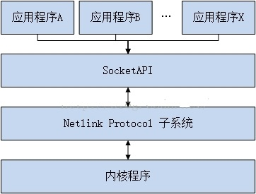

# netlink发展历史

1、linux1.3的时候，就已经有netlink了。

2、linux2.1的时候，进行了改写，更加灵活、且更易于扩展。

3、2001年，IETF委员会开始对netlink进行标准化工作。不过很多建议没有被采纳，现在的netlink被设计为一种协议域，AF_NETLINK和AF_INET并列的。

整个的理念跟linux的一样，不是设计出来的，而是在不断的修改中成型的。


# 什么是netlink

1、面向数据报的无连接消息子系统。

2、基于通用的bsd socket架构而实现。

这让我们很容易联想到udp协议。

# netlink的优势是什么？

1、可以进行内核用户态的双向通信。但是系统调用也可以啊。

netlink的优势在于，你要给内核增加自己特有的东西的时候，不用冒着污染内核代码的风险。

你只需要再netlink.h里加上你自己定义的一个宏。

netlink是异步的，就跟普通的socket类似，可以有缓冲区。

系统调用则是同步的。


# netlink通信类型

支持两种通信类型：

1、单播。通常是App向kernel发送消息。

2、多播。通常是kernel向多个App发送消息。

# 消息格式

跟udp包类似。包头加消息。

包头16字节，消息内容长度不限。

包头结构：

```
struct nlmsghdr {
  u32 len;//包括头部16字节在内的长度。
  u16 type;//4种，NONE/ERROR/DONE/OVERRUN
  u16 flags;//16种最多。
  u32 seq;//控制丢包。
  u32 pid;
};
```

消息体，是TLV结构（Type Length Value）。

```
u16 type
u16 len
value.....
```

# 注意问题

有两种问题可能丢包：

1、内存耗尽。

2、App的的缓冲区溢出。App运行太慢，或者接受队列太小了。


# 接口

接口包括2类：

1、内核态的。

2、用户态。

# 热插拔监听

新的linux内核使用udev代替hotplug来做热插拔管理。

但是我们还是有很多情况下需要在应用里自己检测热插拔，例如在读写SD卡的时候，拔掉SD卡，那么就需要马上检测出这种情况，停止读写，防止vfs崩溃。


netlink是面向数据包的服务。为内核和用户之间搭建了一个高速通道。是udev实现的基础。

这种方式是异步的，不需要轮询等待。

监听这种消息就好了。NETLINK_KOBJECT_UEVENT

1、Netlink实现热拔插监控

http://blog.chinaunix.net/uid-24943863-id-3223000.html

# netlink内核代码分析

Netlink 是一种IPC（Inter Process Commumicate）机制，

它是一种用于内核与用户空间通信的机制，

同时它也以用于进程间通信（Netlink 更多用于内核通信，进程之间通信更多使用Unix域套接字）。

在一般情况下，用户态和内核态通信会使用三种传统的通信方式：

```
1 ioctl;
2 sysfs属性文件;
3 proc fs属性文件;
```

但**这3种通信方式都是同步通信方式，由用户态主动发起向内核态的通信，内核无法主动发起通信**。

而Netlink是一种**异步全双工的通信方式**，它支持由内核态主动发起通信，

内核为Netlink通信提供了一组特殊的API接口，

用户态则基于socket  API，

内核发送的数据会保存在接收进程socket 的接收缓存中，由接收进程处理。

Netlink 有以下优点：

```
1 双向全双工异步传输，支持由内核主动发起传输通信，而不需要用户空间出发(例如使用ioctl这类的单工方式)。如此用户空间在等待内核某种触发条件满足时就无需不断轮询，而异步接收内核消息即可。
2 支持组播传输，即内核态可以将消息发送给多个接收进程，这样就不用每个进程单独来查询了。
```

目前已经有许多内核模块使用netlink 机制，

其中驱动模型中使用的uevent 就是基于netlink 实现。



目前 netlink 协议族支持32种协议类型，它们定义在 include/uapi/linux/netlink.h 中：

```
#define NETLINK_ROUTE        0    /* 用于设置和查询路由表等网络核心模块*/
#define NETLINK_UNUSED        1    /* Unused number                */
#define NETLINK_USERSOCK    2    /* Reserved for user mode socket protocols     */
#define NETLINK_FIREWALL    3    /* Unused number, formerly ip_queue        */
#define NETLINK_SOCK_DIAG    4    /* socket monitoring                */
#define NETLINK_NFLOG        5    /* netfilter/iptables ULOG */
#define NETLINK_XFRM        6    /* ipsec */
#define NETLINK_SELINUX        7    /* SELinux event notifications */
#define NETLINK_ISCSI        8    /* Open-iSCSI */
#define NETLINK_AUDIT        9    /* auditing */
#define NETLINK_FIB_LOOKUP    10
#define NETLINK_CONNECTOR    11
#define NETLINK_NETFILTER    12    /* netfilter subsystem */
#define NETLINK_IP6_FW        13
#define NETLINK_DNRTMSG        14    /* DECnet routing messages */
#define NETLINK_KOBJECT_UEVENT    15    /* Kernel messages to userspace 用于uevent消息通信*/
#define NETLINK_GENERIC        16  //generic netlink
/* leave room for NETLINK_DM (DM Events) */
#define NETLINK_SCSITRANSPORT    18    /* SCSI Transports */
#define NETLINK_ECRYPTFS    19
#define NETLINK_RDMA        20
#define NETLINK_CRYPTO        21    /* Crypto layer */
```

对于在实际应用中，可能会有一些定制化的需求，以上这几种专用的协议类型无法满足，

这时可以在不超过最大32种类型的基础之上自行添加。

但是一般情况下这样做有些不妥，

于是内核开发者就设计了一种通用netlink 协议类型（Generic Netlink）NETLINK_GENERIC，

它就是一个Netlink复用器，便于用户自行扩展子协议类型。


下面来分析Netlink的具体创建和通信流程。


https://www.cnblogs.com/xinghuo123/p/13782009.html

# 参考文章

1、用户空间和内核空间通讯。这篇文章是基于linux2.6的，我现在是在4.14上做实验，所以有些地方需要自己改。

http://blog.csdn.net/varistor/article/details/25311177


2、

http://bbs.chinaunix.net/thread-2029813-1-1.html

3、

https://gist.github.com/arunk-s/c897bb9d75a6c98733d6


