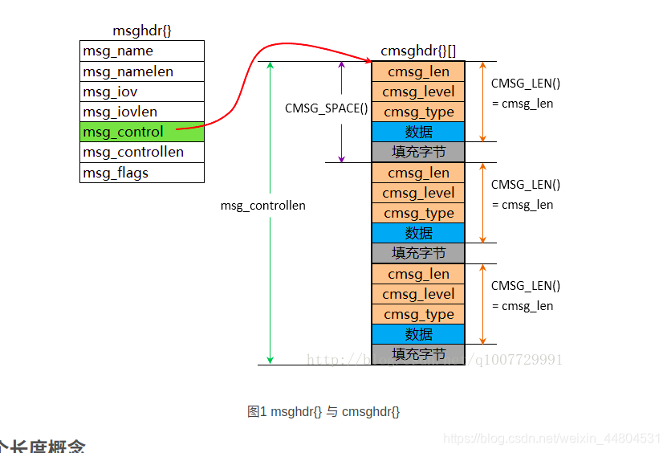

--

# 简介

`cmsghdr` 是 Linux 系统中用于控制消息的辅助数据结构。

在进行高级套接字编程时，特别是在使用 `sendmsg` 和 `recvmsg` 等函数时，`cmsghdr` 结构非常有用。

它通常与 `struct msghdr` 一起使用，用于传递与消息相关的控制信息。

msghdr这一重要的数据结构，其广泛应用于如文件描述符传递，数字证书传递等方面。



对应的结构体：arch\generic\bits\socket.h

```
struct msghdr {
	void *msg_name;
	socklen_t msg_namelen;
	struct iovec *msg_iov;
	int msg_iovlen;
	void *msg_control;
	socklen_t msg_controllen;
	int msg_flags;
};

struct cmsghdr {
	socklen_t cmsg_len;
	int cmsg_level;
	int cmsg_type;
};
```


以下是对 `cmsghdr` 结构的介绍：

### `cmsghdr` 结构

`cmsghdr` 结构定义如下：

```c
struct cmsghdr {
    size_t cmsg_len;  // 控制消息的总长度
    int    cmsg_level;  // 协议层级
    int    cmsg_type;  // 控制消息类型
    // 控制消息数据开始位置
};
```

- `cmsg_len`：用于指定控制消息的总长度，包括 `cmsghdr` 结构的大小。
- `cmsg_level`：指定控制消息的协议层级，例如 `SOL_SOCKET` 表示套接字层级。
- `cmsg_type`：指定控制消息的类型，具体含义取决于协议层级和应用程序的需求。
- 后续是可变长度的控制消息数据，根据具体情况而定。

### 使用 `cmsghdr` 的场景

- **文件描述符传递**：`cmsghdr` 结构在传递文件描述符时非常有用。通过 `cmsg_level` 和 `cmsg_type` 可以指示传递文件描述符的操作，而实际的文件描述符则在 `cmsghdr` 结构后面的数据中传递。

- **控制消息传递**：`cmsghdr` 也可以用于传递其他类型的控制消息，例如 socket 选项、辅助数据等。

- **与 `struct msghdr` 一起使用**：`cmsghdr` 结构通常与 `struct msghdr` 一起使用，`msghdr` 结构用于描述消息的整体信息，而 `cmsghdr` 用于描述控制消息的辅助数据。

### 注意事项

- 在使用 `cmsghdr` 结构时，需要谨慎处理控制消息的长度和数据，确保正确的解析和处理。
- 对于不同的协议层级和控制消息类型，需要了解其具体含义和使用方法。

总的来说，`cmsghdr` 结构是在 Linux 系统中进行高级套接字编程时非常有用的工具，可以用于传递各种类型的控制消息和辅助数据。

# 使用举例

以下是一个简单的示例，演示如何在 C 语言中使用 `cmsghdr` 结构来传递文件描述符：

```c
#include <stdio.h>
#include <stdlib.h>
#include <string.h>
#include <unistd.h>
#include <sys/socket.h>
#include <sys/types.h>
#include <sys/uio.h>
#include <sys/un.h>

#define CONTROLLEN CMSG_LEN(sizeof(int))

void send_fd(int socket, int fd) {
    struct iovec iov[1];
    struct msghdr msg;
    char buf[1];  // 实际消息内容可以为空

    iov[0].iov_base = buf;
    iov[0].iov_len = 1;

    union {
        struct cmsghdr cm;
        char control[CONTROLLEN];
    } control_un;

    struct cmsghdr *cmptr;

    msg.msg_name = NULL;
    msg.msg_namelen = 0;
    msg.msg_iov = iov;
    msg.msg_iovlen = 1;

    msg.msg_control = control_un.control;
    msg.msg_controllen = CONTROLLEN;

    cmptr = CMSG_FIRSTHDR(&msg);
    cmptr->cmsg_len = CONTROLLEN;
    cmptr->cmsg_level = SOL_SOCKET;
    cmptr->cmsg_type = SCM_RIGHTS;
    *((int *)CMSG_DATA(cmptr)) = fd;

    sendmsg(socket, &msg, 0);
}

int main() {
    int sockfd, fd;
    struct sockaddr_un serveraddr;

    sockfd = socket(AF_UNIX, SOCK_STREAM, 0);

    memset(&serveraddr, 0, sizeof(serveraddr));
    serveraddr.sun_family = AF_UNIX;
    strcpy(serveraddr.sun_path, "socket_path");

    // 连接到服务器
    if (connect(sockfd, (struct sockaddr *) &serveraddr, sizeof(serveraddr)) < 0) {
        perror("connect error");
        exit(1);
    }

    // 要传递的文件描述符
    fd = open("file_to_send.txt", O_RDONLY);

    // 向服务器发送文件描述符
    send_fd(sockfd, fd);

    close(fd);
    close(sockfd);

    return 0;
}
```

在这个示例中，`send_fd` 函数用于向指定的套接字发送文件描述符。

通过构建包含文件描述符的 `cmsghdr` 结构，并将其附加到 `msghdr` 结构中，然后使用 `sendmsg` 函数发送消息。

请注意，这只是一个简单的示例，实际应用中可能需要根据具体需求进行调整和扩展。

# 传递文件描述符的作用是什么

在 Unix 系统中，传递文件描述符是一种进程间通信的机制，它允许一个进程将打开的文件描述符传递给另一个进程。这种机制在各种情况下非常有用，以下是一些传递文件描述符的常见用途和优势：

### 1. 文件描述符的共享和重用

- **共享文件描述符**：允许多个进程同时访问同一个文件，管道或套接字，从而实现进程间的文件共享和通信。
- **重用文件描述符**：在进程间传递文件描述符可以避免重复打开同一个文件，提高效率和减少资源消耗。

### 2. 提高性能和降低开销

- **减少数据拷贝**：通过传递文件描述符而不是文件内容本身，可以避免不必要的数据拷贝，提高性能。
- **避免额外的文件打开操作**：避免了重复打开同一个文件或套接字所需的开销。

### 3. 进程间通信

- **父子进程间通信**：父子进程之间可以通过传递文件描述符来共享打开的文件或套接字。
- **进程间协作**：不同进程之间可以通过传递文件描述符来实现协作，共享资源或传递信息。

### 4. 文件描述符传递的典型场景

- **Socket 编程**：在高级套接字编程中，传递文件描述符可以用于共享套接字连接。
- **进程间管道通信**：在管道通信中，传递文件描述符可以实现进程间的管道通信。
- **进程间共享文件**：传递文件描述符可以实现进程间共享已经打开的文件。

### 注意事项

- **权限和安全性**：传递文件描述符可能导致进程访问权限问题，因此需要确保安全性和权限控制。
- **协议一致性**：传递文件描述符的双方需要遵循相同的协议和规范，以确保正确性和可靠性。

总的来说，传递文件描述符是一种高效的进程间通信机制，可以提高性能并简化进程间通信的实现。在合适的场景下，传递文件描述符可以极大地简化进程间通信的逻辑和提高系统的性能。

# cmsghdr有哪些宏定义，作用分别是什么

在 Linux 中，与 `cmsghdr` 结构相关的一些宏定义通常用于操作控制消息头部信息。以下是一些常用的宏定义及其作用：

### 常用的宏定义

1. **`CMSG_FIRSTHDR()`**
   - **作用**：用于获取与给定消息头相关联的第一个控制消息头部。
   - **参数**：`msghdr` 结构指针，指向包含控制消息的消息头。
   - **返回值**：指向第一个控制消息头部的指针，如果没有控制消息则返回 `NULL`。

2. **`CMSG_NXTHDR()`**
   - **作用**：用于获取下一个控制消息头部，以便遍历所有控制消息头部。
   - **参数**：当前控制消息头部的指针。
   - **返回值**：指向下一个控制消息头部的指针，如果没有下一个控制消息则返回 `NULL`。

3. **`CMSG_DATA()`**
   - **作用**：用于获取指向控制消息数据的指针。
   - **参数**：指向 `cmsghdr` 结构的指针。
   - **返回值**：指向控制消息数据的指针。

4. **`CMSG_LEN()`**
   - **作用**：用于计算给定数据长度的控制消息的总长度。
   - **参数**：控制消息数据的长度。
   - **返回值**：控制消息的总长度。

5. **`CMSG_SPACE()`**
   - **作用**：用于计算给定数据长度的控制消息所需的总空间大小，包括消息头部。
   - **参数**：控制消息数据的长度。
   - **返回值**：控制消息所需的总空间大小。

6. **`CMSG_ALIGN()`**
   - **作用**：用于将给定长度按照特定的对齐方式进行对齐。
   - **参数**：长度值。
   - **返回值**：按照对齐方式对齐后的值。

### 示例用法

```c
struct cmsghdr *cmsg;
// 使用 CMSG_FIRSTHDR 获取第一个控制消息头部
cmsg = CMSG_FIRSTHDR(&msg);
while (cmsg) {
    // 处理当前控制消息
    // 使用 CMSG_DATA 获取控制消息数据
    unsigned char *data = (unsigned char *)CMSG_DATA(cmsg);
    
    // 获取下一个控制消息头部
    cmsg = CMSG_NXTHDR(&msg, cmsg);
}
```

这些宏定义提供了方便的方式来处理套接字编程中的控制消息，使得操作 `cmsghdr` 结构和相关数据更加简单和直观。

# 发送fd给另外一个进程，为什么需要cmsghdr？fd不就是一个数字吗？

是的，文件描述符（fd）在应用程序中确实表示为一个整数。

然而，在进程间发送文件描述符时，涉及的不仅仅是简单的数字传递。

**文件描述符的背后有许多内核资源和状态信息，而这些信息需要特殊的方式传递。**

`cmsghdr` 结构体是用于描述控制信息的结构，它在发送文件描述符时扮演关键角色。

在 Unix 系统中，通过套接字传递文件描述符通常使用 `sendmsg` 和 `recvmsg` 函数。

这些函数允许在消息中包括额外的控制信息，`cmsghdr` 就是用来描述这些控制信息的结构体。

### 传递文件描述符的步骤

1. **创建控制消息缓冲区**：需要创建一个 `cmsghdr` 结构体的缓冲区，它会包含文件描述符和其他相关信息。
2. **设置控制消息头**：使用 `CMSG_LEN` 宏来设置 `cmsghdr` 的长度，并将 `cmsg_level` 设置为 `SOL_SOCKET`，`cmsg_type` 设置为 `SCM_RIGHTS`。
3. **将文件描述符写入控制消息**：将要传递的文件描述符放入控制消息的有效负载部分。
4. **发送消息**：使用 `sendmsg` 函数发送消息，包括数据部分和控制信息部分。

### 为什么需要 `cmsghdr`？

`cmsghdr` 结构体不仅传递了文件描述符的值，还确保了接收方能够正确地识别和使用这个文件描述符。它携带了关于文件描述符的元数据，比如消息的类型和长度，这对正确解读传递的信息至关重要。

简言之，`cmsghdr` 结构体使得进程间能够安全而可靠地传递文件描述符，而不仅仅是简单的数字。
