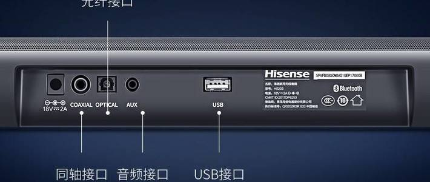
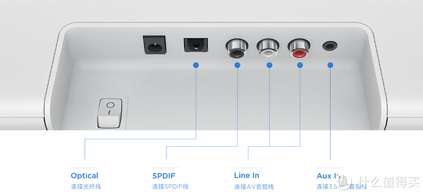
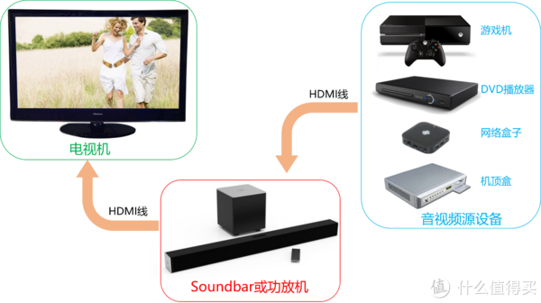
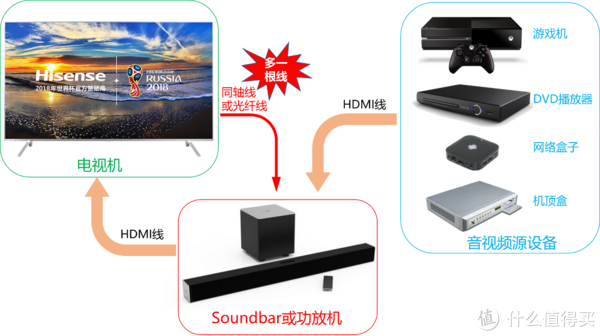
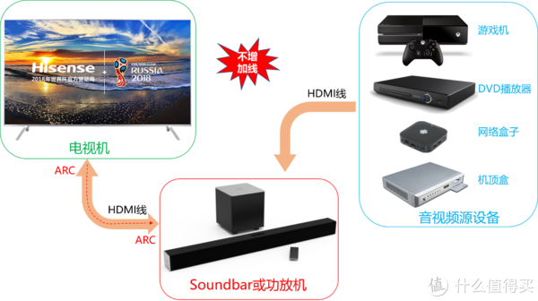

--

# 简介

什么是soundbar？

Soundbar，是指将多个声道的音箱功能整合在一个箱体内的长条状音箱。

作为一种新兴的音响产品，SOUNDBAR音箱除了保留传统音响的特性之外，

其数码味道也越来越浓重，

是音响家族中将传统AV音响和数码技术结合的最彻底的一个成员。

主要特点：

**每个通道都有独立的腔体**，保障良好的隔离和分离度；

使用时与传统音响不同,soundbar以横向摆放使用;

主要搭配平板电视,如液晶电视，等离子电视等使用;


带有DTS、DolbyDigital与Dolby Pro Logic II的SoundBar声吧产品开始出现，在环绕声表现与音质上相比一般soundbar的声音更出色。

消费者在听觉方面的享受无法得到满足，因而专为弥补平板电视音质不足的SOUNDBAR音箱也必将大行其道；


Soundbar导入运用的最新的数码技术有：

（1） 结合了具有**光纤，同轴及HDMI输入**的高档SOUNDBAR音箱，主要品牌有天龙、波士顿声学、雅马哈、飞利浦、索尼、国内的数码狐音响等；

（2）一体化家庭音响播放平台，带低音炮，AUX 音频输入，模拟音频输入，光纤输入等功能。

（3）5.1声道家庭影院soundbar ,**采用专业的DTS环绕声与杜比技术，用一只音箱，处理出5.1声道的家庭影院独立声场定位效果，媲美真实的杜比5.1声道环绕声。**

（4）[小米电视2](https://baike.baidu.com/item/小米电视2/13848432)加入了Soundbar音箱。


一套1-2千元的Soundbar就能够满足很多家庭的需要了。


严格一点来说，Soundbar是指将多个声道的音箱、功放整合在一个箱体内的长条状音箱。

对于Sounbar本身来说，不同于N个音箱的传统家庭影院，一般在外观上是横向条状的，一个音箱里面有几个独立的音响单元，**可以提供不错的分离度**，一般都是与家庭中的电视搭配使用。

**由于其集成度高，将功放以及音响都整合进去了，**对于普通家庭用户来说非常方便，无需自己去搭配，当然在价钱上也有优势。

同时在安装上非常方便，**理论上都是以一两根线就可以实现与电视的连接，**

即使有些自带了单独的低音音箱，也是通过无线的方式进行连接，能够避免传统家庭影院音箱数量多，空间摆放繁琐，以及占地方的问题。


比如说目前不少Soundbar会**附带一个独立的低音单元**，

能够极大提升整套系统的低音下潜力度，

也能给到用户更加震撼的影音体验。

其次，在Sounbar上，厂商们会喜欢将高、中、低三个声道分开，

通过不同的单独发声单元来发出不同的声部，

这就会使的音质相互间干扰减小，也会让系统声音更纯净。


当声道越多，能够播放的声音方向信息就越清晰，

我们能够通过多声道环绕声来实现更准确的声音定位信息，

这在游戏或者电影里有着非常重要的意义。

所以在我们看来，支持的声道越多肯定越好一些。

不过由于Soundbar大多数的形态都是一条单独音箱，

所以很多宣称支持多声道的Soundbar是**采用虚拟声道的形式实现的**。


**音响连接方式**

现在的Soundbar一般都有无线/蓝牙或是有线/蓝牙连接两种模式，

蓝牙最好选择4.0版本以上的产品（目前市面上以4.2或者5.0版本为主），

有线则可以选择AUX、同轴、RCA，

或者是有**ARC功能的HDMI接口**

（能将所有输入到电视机的音频信号通过SoundBar来输出，例如连接PS4游戏机或者盒子等设备），

至于WiFI、光纤和NFC等功能就看大家的实际需求了，毕竟功能越多，成本越高，当然可能会对音质有一定的影响。


对于电视来说，并不一定能够将所有媒体音频格式解码的，所以有的时候这个任务还得留给Soundbar来解决，毕竟Soundbar诞生的时候就是将以前单独的功放解码器给合成进来。


声道数是衡量一套音响设备的重要参数，那么声道应该怎么理解呢？比如7.1.4：

[7] 表示有7个传统环绕声音箱（3前置、2中置、2环绕）

[.1] 表示有1个低音炮

[.4] 表示有4个置顶音箱（顶部或向上发声扬声器）


常见的还有2.1、5.1、5.1.2、5.1.4、7.1.2、7.1.4。声道越多环绕效果越好，越能体会到身临其境的感觉。


**虚拟环绕技术：**

> 通过软件算法，将2.0声道的音源通过多个喇叭延时发声使耳朵产生环绕的“错觉”。 比如：雅马哈YAS-207，索尼HT-X9000F


**真实反射技术：**

> 控制多个扬声器，将声音投射在墙壁上，经过墙面反射，达到真实环绕的效果，在声音的保真与还原上优于虚拟环绕。 它对房间的结构和布局要求较高，工整且较接近于矩形的房间环绕效果会优于开放式的房间，并且房间里的障碍物不能太多。 比如：雅马哈YSP-2700 ，索尼HT-ST5000，三星HW-Q90R


杜比音效（杜比数字）、DTS音效（DTS Digital Surround）：

> 多使用于入门低端回音壁，已经足够日常看电视节目使用。

杜比全景声（Dolby Atmos）和DTS:X：

> 多用于中高端回音壁，不支持该格式的回音壁无法正常播放蓝光影片。


前面介绍，Soundbar（条形音响），是一种条形声音装置，

这一类产品的主要使命就是“改善提升平板电视的音质”。

[电视机](https://m.smzdm.com/fenlei/dianshi/)不断向越来越薄的方向发展着，

这样就不可避免地牺牲了音质，

Soundbar应运而生，

它是一种将多声道和功放集合在一个长条状的音箱当中，

拥有各种音频接口，具备解码能力，

将AV和数码技术结合的一个产物，

它是集成化的[家庭影院](https://m.smzdm.com/fenlei/jiatingyingyuan/)系统（Home theater-in-a-box），

它就是为了搭配超薄平板电视而生，是一种条形音响。

Soundbar内置功放电路，**属于有源音箱设备的范畴，**

**它的音频输入接口，基本是参考功放机的，**

但是针对平板电视做了优化。

功放机的接口我们不做介绍，这里我们重点介绍一下Soundbar产品都有哪些接口，应该怎样和电视连接使用。




电视机是播放内容的，它是音频信号源设备。

因此，**与Soundbar连接的是电视的音频输出接口；**

Soundbar是音频信号接收设备，**因此它的音频接口基本上都是输入接口。**

电视机音频输出（Out、Output）→Soundbar音频输入（In、Input），

中间使用对应的音频线连接即可。

**根据传输信号的不同，我们可以将音频接口分为两大类：**

**模拟音频接口和数字音频接口。**

模拟音频接口，在智能平板电视上面越来越少见。

一般有两种形式，

一种是RCA接口（俗称梅花头、莲花插座），RCA形式的模拟音频输出口，通常是包含在电视的AV音视频输出组合端子中，如下图所示，黄、白、红，一组三个端子，黄色是视频，红色是模拟音频输出的右声道，白色是左声道。

另外一种，是耳机插座，**耳机插座大多数时候是只包含左右声道**，字符标识为耳机标记或者“耳机”。有的时候是将AV信号全部集成在内，包含视频、左声道、右声道，这种情况下，通常会附带一根转换线，一头耳机插头类似的四级插头，另外一头是红、白、黄三个端子。


对应电视的模拟音频输出，Soundbar会设置有模拟音频输入接口，

标识为AUX IN、Line IN。

**两种叫法的含义是不同的，主要区别在于输出幅度、阻抗和驱动能力。**

Soundbar的模拟输入端子也分为耳机插座和RCA两种，都只含有左右声道，

颜色也是对应的，红是右声道，白是左声道，

很少有其它颜色。

随着技术的发展和为了减少端子，**大部分的Soundbar都只保留了耳机接口，**

并且在设计上做了兼容，可以接收不同灵敏度的信号输入。

连接电视和Soundbar的模拟音频口，按照接口类型和颜色，选择对应的线材连接即可，相对比较容易。

如果两边都是耳机插口，那么就要用两头都是耳机插头的线材，很多人直接叫3.5mm to 3.5mm音频线、3.5mm公对公音频线（耳机插头的直径是3.5mm的）。


模拟音频传递信号质量的高低，受限于两边ADC、DAC的性能，

并且传递过程中，模拟信号也容易受到干扰。

Soundbar、功放、家庭影院等外设音箱产品，**基本上都具备了抗干扰能力更强、品质更高的数字输入接口。**




数字音频接口，Soundbar和电视机上面，

常见的有光纤、同轴和HDMI ARC。

国内品牌，如海信、小米、TCL等，

在国内市场销售的电视，

**数字音频接口通常是同轴，它也是一种RCA座子，**

按照标准，座子的颜色应该为橙色，

但是有的厂家也不遵循标准，用黑色、红色等其它颜色。

端口的标识，五花八门：同轴、Coaxial、Digital Audio、数字音频输出、S/PDIF等，如下小米电视橙色端口，标识为S/PDIF,就是电视的数字音频接口。

连接TV和Soundbar的线材就是一根同轴线，公对公的同轴线，外面一圈是地线和屏蔽层，里面是信号线。


光纤和同轴，实际上**都采用的S/PDIF标准进行信号传输，**

只是前者以光的形式传递信号，后者以电的形式传递。

看上去，似乎用光传递更为可靠，不受干扰，很多高级的音响，功放，都是采用这种形式。

实际上，同轴信号线，外面做了屏蔽层，质量好的同轴线，一样不会受干扰。

光纤、同轴插座在电视的使用，有一点规律，**国外品牌**，如Sony、三星、LG，在全球市场区域的电视，如果有数字音频输出，**几乎全部都使用光纤座子**，而不是同轴。

国内品牌，如海信、TCL、小米，则区分地域，国内市场的机型，采用同轴，国外市场，采用光纤。

为了能够适配绝大多数的电视，很多Soundbar厂家在设计时，不得不把同轴和光纤接口都设计上。

但是，国外的品牌，如三星、Vizio、Sony、Bose、JBL等厂家的Soundbar，很少看到两个接口都有的，一般只有光纤输入接口。

所以，在选择Soundbar产品时，一定要先研究一下自[家电](https://m.smzdm.com/fenlei/jiayongdianqi/)视的接口，然后去购买能够适配的Soundbar。

**光纤、同轴都可以传输环绕声信号，最高可以支持到5.1声道。**

**如果电视要输出更多轨道的数字音频，那就得通过HDMI ARC接口了。**


HDMI作为一个数字化视频音频的接收标准，是可以同时传输视频和音频的，

随着HDMI版本的提升，它的功能也一直在增强。

ARC就是在HDMI版本升级到1.4出现的功能。

事实上当HDMI升级到1.3时，人们就发现了HDMI多了一个CEC功能。

这个功能的目的是简化操控，

当用户有很多HDMI设备通过切换器或者分配器连接在一起的时候，

如果每个HDMI设备都支持CEC功能，

那么使用其中一个设备的[遥控器](https://m.smzdm.com/fenlei/yaokongqi/)就能去控制其他设备，

当然HDMI线要是1.3版本才行。

因此，如果是使用ARC接口，那么既可以传输音频，又可以进行交互控制，是非常实用的一个接口，

**缺点就是需要购置1.4版本及以上的HDMI线，这种线材成本较高，**

电视机厂家或者Soundbar厂家一般不会标配的。

ARC的全称为Audio Return Channel，顾名思义也就是音频回传通道。

ARC出现的目的，是使整个数字化家电在线材安装上更为简便。

它的功能就是传输声音信号，

具体是指在支持ARC的HDMI接口上，

电视可以通过ARC将音频信号通过HDMI线回传到功放或者其他拥有HDMI ARC功能的音频设备上去，这样用以节省单独的数字输出线材。

下面用几张图，可以说明以上的观点。


在ARC出现以前，那个时候电视机还不太具备播放片源的能力（网络片源、本地存储等），还没那么智能，人们获取片源的方式，主要是机顶盒、DVD、网络盒子、[游戏机](https://m.smzdm.com/fenlei/youxiji/)，组建自己的家庭影音系统，

通常是下图所示，Soundbar或功放连接在音视频源设备和电视机中间，负责音频的解码、放大和音效处理，音频信号来自于音视频源设备。




随着电视机的发展，智能化程度的提高，电视可以联网播放片源了，也可以播放本地存储器的内容。

**电视机不仅是音视频信号的接收设备了，还变成了音视频源设备。**

如果电视机播放网络或者本地片源，同时又想使用Soundbar或者功放机进行音频处理，没有ARC端口，那么就需要在他们之间在连接一条音频线，如同轴线或者光纤线。




ARC出现之后，电视可以直接通过用来接收视频的HDMI线，将音频回传过去，原有的系统连接是不需要动的，也不需要增加多余的线材，非常方便。

并且，HDMI ARC可以传递更为复杂的音频数据，而同轴光纤只能到5.1通道，**像DD+、Dolby Atmos、DTS：X等编码的音频数据，就只能通过HDMI ARC进行传递了。**




并不是所有的HDMI口都支持ARC，

而支持ARC的口一般都会有“ARC”三个字母的标识，

只要将电视和Soundbar上面对应的ARC口用HDMI线连接起来即可。


不带ARC的HDMI口和HDMI ARC口连接，是无法进行音频回传的，

因此一定要看准确。

HDMI ARC可以回传音频，并且可以使用CEC功能，

**电视遥控器可以控制Soundbar，反过来同样也可以实现，使用一个遥控器，控制两个设备，确实便捷很多。**


以上，简单介绍了一下Soundbar和电视机连接的端口。

不管使用哪个接口，连接好设备之后，一定要看一下电视机的说明书，在设置菜单里面，对应的把电视机的声音输出端口设置为连接Soundbar的那个端口，这样才会有音频信号输出。

**设置为同轴、光纤、ARC输出后，通常电视机自身的扬声器不会再发声，如果还有声音，最好是想办法关掉，两套发声设备同时工作，会产生冲突，无法体验到Soundbar最佳的音质效果。**

# 产品形态

在众多品牌的参与下，为消费者用户提供了丰富的产品，

Soundbar 产品也出现了许多种类去迎合市场的需求。

纵观市场上的各大品牌的产品，

我们可以从外观形态、声道数量、连接方式、核心功能四个主要方面去概括和分类这些产品。

虽然我们定义了 Soundbar 是条形音响，

主流的形态是一个长条的音箱，配合低音炮，

有的甚至还搭配环绕音箱，

也有品牌将另外两种形态的电视音响，归为 Soundbar 的子类，它们就是 Sound base 和 Mini Bar 。

主流的 Soundbar 形态是一个长条的音箱，配合低音炮，有的甚至还搭配环绕音箱，形成环绕立体声效果，如下图所示，


Sound base 顾名思义，

一种可以作为 Base 使用的音响。

用户可以把它当作底座直接放到电视机底下，同时作为音响使用。

设计 Sound base 时，要充分考虑大多数电视的底座支架的尺寸，Sound base 的长度要合适，同时又不能太高太大，

否则就会影响电视机的摆放和家居环境的美观。

**所以 Sound base 在外观上就受到了较大的限制，很少有特别优秀的产品。**


Mini bar 与其他产品主要的区别，是尺寸短，

主要是为了配合小尺寸电视和小户型的家庭使用，

也适用于台式电脑，置于显示器下方。

因为受限于其使用群体，很少有高端产品，所以价格一般不会太高。

Mini Bar 最大的一个弱点，

**是左右声道的喇叭距离近，产生的声场不够宽广，**

受制于开发成本，设计者也很少考虑使用声场处理算法去改善。

先天缺陷加上后天营养不良，导致很多 Mini Bar 的效果，就像是电视机连接了一个小型的蓝牙音箱在使用。


市场上大多数的电视节目是两声道立体声，

但是随着杜比、DTS 等环绕立体声在广播电视台和影音内容中的渗透，

**作为电视音响， Soundbar 必须考虑再现环绕声的能力。** 

Soundbar 是从传统音响或者家庭影院音响中衍生出来的一个新门类，

**家庭影院音响的声道配置概念也被用到了 Soundbar 上面。**


从低到高 Soundbar 的声道数目涵盖范围非常大，

从入门级的 2.0 声道，

到中高端的 5.1 声道，

再到近期火热的全景声，

声道数可以达到 7.1.2。

7.1.2 声道：

第一个数字 7 ，是指前左、前右、中置、后左、后右、环绕左、环绕右；

第二个数字 1 ：如同 2.1、5.1 中的 .1，是指低音通道；

**最后一个数字 2，是指天花喇叭左和右，是头顶上的两个声道，这一部分是全景声独有的。**

声道的概念跟家庭影院音响相同，

不同的是，Soundbar 高度集成化，

尽最大可能将更多的声道集成到了一条音箱中，**通过声波反射、音效算法等实现环绕声效果。**


声道数量里面的 .1 指的是低音通道，

回放低音的工作一般是由低音炮（低音音箱）来完成的。

根据设计的不同，有的 Soundbar 直接内置了低音炮，

**好的低音效果需要充足的箱体空间和大尺寸的低音喇叭单元，**

内置低音炮的设计往往会导致 Soundbar 尺寸过于肥大。

无线低音炮和 Soundbar 主机之间的传输方案，

主流的是 2.4GHz 或者 5.8GHz ，

支持专有音频无线传输协议的方案，也有很多直接采用标准蓝牙协议的方案。

不管哪种方案，传输都会存在延迟，这个延迟通常会很低，一般方案宣称 10ms、5ms 或者更低，通常情况下，这个延迟时间是可以忽略不计的。

有线、无线，主要的区别就是信号的传输方式，

有些人追求无线，说无线的安装连接方便，

其实，这不是重点。

因为，不管是有线和无线，低音炮后面总是要有一根线，有线低音炮需要一根信号线（还有的再需要一根电源线），无线低音炮则必须要要有一根电源线。


Soundbar 从传统音响中衍生出来，

随着技术的进步，一些新的音响相关技术也被应用到Soundbar上面，

如 WiFi 相关的技术、Google Cast、智能语音控制等，

为了区别，也有品牌将这一类产品称之为智能条形音响（ Smart Soundbar ），

这只是一种归类方式和名称叫法而已，

 Soundbar 本质上就是一种音响，不管是增加或者减少功能，

其最主要的使命是不变的，那就是为人们还原、回放美好的声音。


# i.mx8的soundbar方案

1. MX 8 2 CPU Core 给 Linux， 2 CPU Core 给 Little kernel（ LK ）Linux 用于做管理使用，LK 为 I3D 主要 Audio 处理部分:包括输入 Dolby DTS、PCM 格式识别解码，以及后处理输出
2. 支持输入 SPDIF/HDMI/ADC/ALSA 输入，支持 ALSA，DAC 输出；其中 HDMI 输入/输出使用 SAI1，ADC 可以使用 SAI3 或 SAI5
3. MX 8 有 8 PDM 接口，可以直接连接 8 数字麦克风，然后采用第三方的语音引擎就可以实现语音交互功能
4. MX 8 支持最大 16 通道 I2S 输出，可以实现 5.1CH / 7.1CH
5. Immersive3D SDK 实现了 Dolby Atmos 的解码
6. MX 8 在芯片级有 Dolby Atmos 认证
7. HDMI 需要外扩芯片实现
8. 支持多通道 AEC + 波束成形
9. 支持多种语音 + 音频服务


# 典型接线

如果Sound bar 有重低音扬声器，因为重低音扬声器发生会有震动，所以不要在重低音扬声器上放置东西。

如果是连接到比较新的电视机即HDMI接口支持ARC功能，可以使用HDMI线连接电视机的HDMI （ARC）接口至Sound bar上的TV out ARC。

**注意:** 如果电视机的HDMI接口支持ARC，则会有ARC的标识，如果连接的HDMI 没有此标识，则就不支持ARC功能。


有些电视机型号有HDMI接口但不支持ARC功能，

可以先使用HDMI线连接电视机的HDMI接口至Sound bar的TV out ARC接口，

然后再使用光纤线连接电视机的光纤接口至Sound bar的Optical in接口

（为了听到电视机的声音，此为必要步骤）。

**如果电视机没有HDMI接口同时也没有光纤接口**

可以使用音频线连接电视机的音频输出至Soundbar的**ANALOG IN** 接口。

https://www.sony.com/zh-cn/electronics/support/articles/00014997


以创维酷开soundbar为例。分析一下。

```
音响主机*1、电源线*1、遥控器*1、光纤线*1、同轴线*1、1对2音频线*1、说明书/保修卡*1

机身输入接口
光纤；同轴；USB；HDMI
```

https://item.jd.com/4315971.html#product-detail

索尼G-700

https://item.jd.com/100014331646.html#product-detail


通常，Soundbar包含3个主要部件，即条形音箱、超低音和遥控器。


试着将条形音箱的前方垫高，角度以声波直射到聆听者耳朵的高度为宜。

电视机柜通常较矮，如果音箱水平方向进行声波投射，直达的，往往是对面沙发上聆听者的膝盖位置。想要获得正确的音场，调整Soundbar投射角度（向上倾斜），指向聆听者的人耳位置。


Soundbar与电视机的连接非常方便，通常由一条HDMI线来完成。

如果家里没有HDMI线，也可以在购买Soundbar时一同购入。

自己测量一下所需长度，一般来说，2m的HDMI线就足够了。对品牌不是很敏感，也不打算在此耗费太多心思的，记住两点：找款销量较高，评价也不错的；必须支持4K传输（HDMI 2.0规格）的，即可。


大多数家庭，是通过数字机顶盒与电视机相连的，前者提供有线电视信号（无论是有线网络还是电信运营商）给后者，来予以重播。这两者间最常见的连线，也是HDMI线。

**那么现在你要做的，就是把机顶盒输出的HDMI线，从电视机上拔下，连接到Soundbar的HDMI In，再用另一条HDMI线将它从HDMI Out传输给电视机（还是电视机原来连接的端口）。**

对了，我没有忘记Soundbar中条形音箱和超低音的连接。事实上，绝大多数支持无线超低音的Soundbar，两者都会在通电后自动连接。有线连接的Soundbar，只要通过附带的RCA线缆对应连接即可。


一、HDMI IN连接：播放设备接HDMI IN端口，再用TV端口输出给电视，这时候不涉及电视ARC/eARC回传，音频直接让音响解码播放，视频直通给电视显示；

二、ARC/eARC连接：电视只需要连接音响上的TV端口，这样就需要电视ARC/eARC音频回传功能，播放设备接电视，电视回传音频给音响播放；

三、光纤连接：播放设备直接光纤接音响，视频通过HDMI接电视；或是播放设备HDMI先接电视，电视光纤接音响。但光纤不能传输次时代音轨。

四、蓝牙连接：G700和X9000F支持SBC/AAC的蓝牙播放，很遗憾都不支持索尼自家的LDAC。


https://web.6parkbbs.com/index.php?app=forum&act=view&bbsid=2024&tid=748400

# 多声道分析

| 组成         | A方案**HDMI功放+音箱** | B方案**组合家庭影院** | C方案**[多媒体音箱](https://www.smzdm.com/fenlei/duomeitiyinxiang/)** |
| ------------ | ---------------------- | --------------------- | ------------------------------------------------------------ |
| 类比         | DIY台式机              | 笔记本                | [平板电脑](https://www.smzdm.com/fenlei/pingbandiannao/)     |
| 预算         | 中~非常特别极其高      | 低~高                 | 很低~中                                                      |
| 占地面积     | 中~大                  | 小~中                 | 很小~中                                                      |
| 适用房间面积 | 中~非常大              | 小~大                 | 小~中                                                        |
| 功能性       | 中~高                  | 低~中                 | 电脑                                                         |
| 扩展性       | 高                     | 无~中                 | 电脑                                                         |
| 片源         | 全面                   | 可能有限              | 电脑                                                         |
| 操作复杂性   | 中~高                  | 低~中                 | 低~中                                                        |
| 独门绝技     | 只要肯砸钱，效果最爆棚 | 无线后置，亮骚外观    | 穷人救星，屌丝之友                                           |
| 致命死穴     | 穷三代，毁一生         | 容易变“样子货”        | 难登“大雅之堂”                                               |

A方案：HDMI功放+音箱。

传统方案。

现在模拟功放、光纤功放基本死绝了，所以只讨论HDMI功放。

功放和音箱可以买套装，也可以分别单独购买，甚至每一只音箱也可以单独购买。

此方案发烧友通用，扩展性很好，可以通过HDMI连接众多外围设备，

包括电脑，机顶盒，影碟机，高清播放机，游戏机等等；

功能也很强大，支持解码格式众多，支持视频处理；

但连接和操作较为复杂。

类比于买电脑的话，大致相当于DIY组装台式机：自由性高，性能强大，丰俭由人，但如果遇到加钱党，预算在燃烧，钱包在流血……


我们要想在家里也获得被声音包围的效果，

那就需要多声道音响设备——家庭影院了。

一般情况下大家使用的音箱或耳机都是“**立体声**（Stereo）”的，即只有左右**两个声道**；

而家庭影院的“**环绕声**（Surround）”则一般**至少有四个声道**。

声道数通常用类似“X.Y”的数字表示，

常见的声道配置有4.0，5.1，7.1等。

一般家用可以简单地理解为：

小数点前的数字表示全音域声道数，也就是普通音箱的数量；

小数点后的数字表示低频声道数，也就是低音炮（Subwoofer）的数量。

Win7或Win8可以在系统自带的音频属性里看到几种常见的环绕声配置（大部分台式机的集成声卡都可以这样操作：

右键点击桌面右下角的音量图标，选择“播放设备”，单击“配置”按钮即可看到类似如图的界面）。

不过这里还有个音源的声道数量和设备的声道数量之间的区别，

有些情况下两者不同，下文会说明。

另外，通常所说的“2.1音箱”，只不过是经过音箱内部的分频，把低音部分分配给低音炮而已，

输入信号仍然是左右两个声道。

而5.1或7.1声道中的“.1”虽然通常也要经过分频，但也是有独立信号输入的声道。

7.1声道的产品已面世多年，目前一般家庭市场主流仍是5.1声道。

本帖主要以5.1声道为例进行介绍，7.1声道原理基本相同。

（阻碍7.1声道普及的主要原因大概不是价格，而是房屋空间和布局的限制，同时放下侧环绕和后环绕通常挺不容易的……）

5.1声道电影中，6个声道一般有着约定俗成的分工。

前置左右声道负责大部分配乐和动作音效；

人物对白主要由中置声道承担；

侧后的环绕声道提供环境音效和营造空间感（当然也同时负责侧后方人物的动作和对白）；

低音炮嘛，自然是加强低音效果了。

**低音炮并不是必须的**，有时5.0的音箱也可以获得不错的效果。


从哪些途径可以获取多声道音频源呢？不管是遵纪守法购买正版，还是喜闻乐见下载盗版，都可以获得海量的资源。常见的多声道音频源有：

- **电影。**DVD影碟或者BD蓝光影碟一般都带有5.1或以上的多声道音轨；下载的高清电影（至少好几个G一部的那种）也通常带有多声道，文件名或者种子名会带有5.1、7.1、Dolby、DTS之类的字眼，注意辨认。

- **游戏。**多数大型3D[电脑游戏](https://www.smzdm.com/fenlei/diannaoyouxi/)都带有多声道，比如FPS射击游戏里环绕声可以让你轻松辨别身后的敌人。PS3、XBOX360等主机游戏也有不少支持多声道环绕声。

- **高清电视节目。**有些电视节目会以环绕声播出，比如央视春晚、中国好声音。不过看直播的话需要机顶盒支持才行，网上下载高清录像的话就和上面说的电影一样了。另外，有些高清DV也有录制环绕声的功能，可以自拍……

- **音乐。**市场上出现过几种支持多声道环绕声的音乐格式，比如DTS-CD，DVD-Audio，SACD。不过这些玩意既不受HiFi音乐爱好者欢迎，也不受家庭影院爱好者欢迎，两头不讨好，现在基本死绝了，一般仅作为试音碟使用……

此外，还可以把普通两声道音频转为多声道，获得不错的效果。


参考资料

1、多声道音频指南：被声音包围的感觉

https://post.smzdm.com/p/14894/

2、多声道音频指南（二）：那些年，那些技术，那些名词

https://post.smzdm.com/p/15400/


# 参考资料

1、

https://baike.baidu.com/item/soundbar/7792027?fr=aladdin

2、

https://www.pconline.com.cn/000147508/1323/13232264.html3、

3、

https://www.zhihu.com/question/22862168

4、改善电视渣音质 篇三：不再束手无策，三分钟弄懂Soundbar接口！

https://post.m.smzdm.com/p/akmw99q4/

5、Soundbar 应用简介

这篇文章非常好。

https://www.wpgdadatong.com/cn/blog/detail?BID=B1708

6、i.MX8 Soundbar 方案介绍

https://www.wpgdadatong.com/cn/blog/detail?BID=B1711

7、

https://www.ti.com.cn/solution/cn/soundbar

8、

http://www.goowi-tech.com/newsmore.asp?id=6&pid=24&i=24

9、

https://new.qq.com/omn/20200214/20200214A0JK7800.html