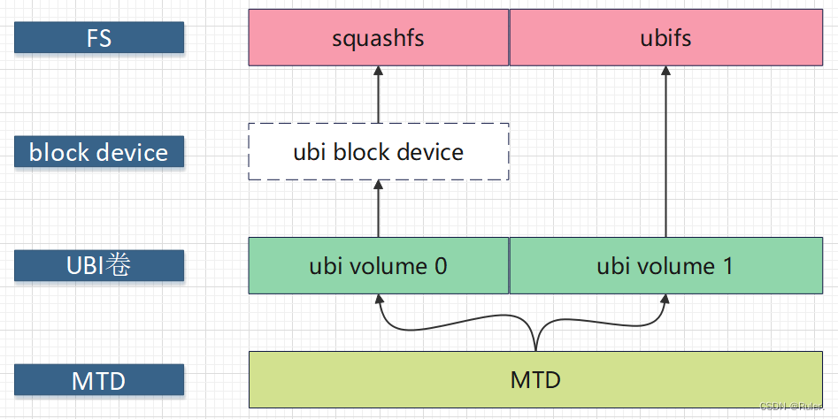

# squashfs简介

Squashfs是一套基于Linux内核使用的**压缩只读**文件系统。

该文件系统能够压缩系统内的文档,inode以及目录，

文件最大支持2^64字节

特点：

数据(data),节点(inode)和目录(directories)都被压缩

保存了全部的32位uid/gids和文件的创建时间

支持多达4G的文件系统

**节点和目录都是高度压缩**, 所有压缩的节点长度平均在8个字节左右
squashfs可以有更大的块大小， 这样可以达到比4K块大小更大的压缩率

squashfs引进了碎片块(fragment blocks)的概念: 一种将许多比块小的文件存储在一个块中, 以达到更大的压缩率

**重复的文件会被检测并删除掉**

同时支持big和little endian架构


编译使用SQ的基本步骤:

重新打包和编译linux内核, 使之支持SQ

编译mksquashfs工具

使用mksquashf创建压缩文件系统

挂载: mount suqash文件系统到一个临时目录

如果需要自动挂载，更改/etc/fstab 或者起始脚本, 以使linux操作系统自动加载新的 squashfs 文件系统


当前最新版本是4.5.1，发布时间17th March 2022。

支持的最大文件系统大小为2^64 Byte, 最大文件大小为2TiB，最大的块大小为1 MiB，支持软链接、硬链接等。


squashfs 是一个高度压缩的只读文件系统，它可以将高达 2-3GB 的数据压缩到一个只有 700M 的文件中。

如果你有使用到 Linux 的 Live CD ，那么你会看到 squashfs 的身影。

当一个 Live CD 启动时，它将加载整个 Linux 系统环境。Live CD 所使用的正是这种高度压缩的只读 squashfs 文件系统，其中的 root 文件系统就被压缩存放在这个文件系统之中。

squashfs 系统支持以回环(loopback)的方式挂载，然后便可以访问其上的文件了，在访问这些文件时，它们就会被解压缩并装载在 RAM 中，而不需要将整个文件解压缩后才去访问其中的文件，这样一来访问速度就快多了。


我们可以打开一个 [Ubuntu](https://so.csdn.net/so/search?q=Ubuntu&spm=1001.2101.3001.7020) 的 Live CD ISO 文件，在目录 ISO_ROOT/casper/ 目录下可以看到 filesystem.squashfs 这个文件。squashfs 在其内部使用了如gzip和lzma这些压缩算法。


# mksquashfs工具用法

基本用法：

```
mksquashfs source1 source2 ...  dest [options] [-e list of exclude
dirs/files]
```

选项有这些：

```
build的选项
-comp xx
	指定压缩方法，有gzip、lzma等。
-b  xx	
	指定block size。默认是128KB。
-reproducible 
	默认的。构建可以重新生成的镜像？具体内涵是啥？
-no-sparse
	不要检测sparse文件。
	
过滤选项
这部分不管。

append选项
-noappend  
	不要append到filesystem。
	
其他选项

```

# 对rootfs.squashfs的操作

提取里面的文件

```bash
unsquashfs xxx.squashfs
```

将镜像文件转换为一个块设备：

sudo losetup /dev/myloop xxx.squashfs

将块设备挂载到主文件系统的目录：

sudo mount /dev/myloop dirname

就可以进入dirname目录，对该虚拟磁盘进行操作了,就像使用真实磁盘一样

卸载该镜像：

sudo umount /dev/myloop
sudo losetup -d /dev/myloop

# 如何在ubi之上运行squashfs

在UBI之上运行squashfs文件是[openwrt](https://so.csdn.net/so/search?q=openwrt&spm=1001.2101.3001.7020)系统中常见的方式：

- rootfs运行squashfs （只读）
- roootfs_data运行ubifs （读写）


由于ubifs是运行在UBI卷之上的文件系统，

而squashfs是运行在block device之上的文件系统，

二者本来无任何交集，

但是UBI提供了能够在ubi卷之上创建只读块设备的特性(R/O block devices on top of UBI volumes)，

这使得squashfs也能够“运行”在ubi卷之上。





# 在NAND闪存上使用原始的 SquashFS 文件系统存在几个主要问题

在NAND闪存上使用原始的 SquashFS 文件系统存在几个主要问题，这些问题源于SquashFS设计和NAND闪存的特性之间的不匹配，具体如下：

1. **坏块管理**：
   - SquashFS 文件系统不支持坏块管理，它假设所有的块都是完好的且连续的。然而，NAND闪存有可能包含坏块，这些坏块在访问时会导致读取或写入失败。
   - NAND闪存通常使用坏块管理机制来跳过或重映射坏块，这与SquashFS的需求不符，因为SquashFS不能自行处理坏块。

2. **块排序要求**：
   - SquashFS 还要求块是有序的，这意味着在读取文件系统时，需要按顺序读取块。NAND闪存的块并不一定是按顺序排列的，因为坏块的存在可能会打乱块的顺序。
   - 如果块的顺序不是按照SquashFS期望的方式排列，可能会导致文件系统读取错误或性能下降。

3. **写入和耗损平衡**：
   - NAND闪存有限的写入寿命和耗损平衡问题也是考虑因素之一。SquashFS不支持写入操作，它是一种只读文件系统，适合用于静态环境和只读应用场景。
   - 将SquashFS用于NAND闪存可能会导致频繁的写入操作（例如更新文件系统或元数据），这会加速NAND闪存的耗损并可能导致较短的寿命。

综上所述，尽管SquashFS在一些环境中具有良好的压缩比和性能优势，但其设计特性与NAND闪存的特性不兼容。因此，在NAND闪存上使用原始的SquashFS是不可行的，需要考虑使用支持坏块管理和适应NAND闪存特性的文件系统，如UBIFS（基于UBI的文件系统）或者YAFFS（Yet Another Flash File System）。这些文件系统专门设计用于闪存设备，能够有效地管理坏块、提供更好的性能和可靠性。

# 参考资料

1、

https://blog.csdn.net/GCQ19961204/article/details/126679813

2、

https://blog.csdn.net/guoqx/article/details/127245531

3、

https://blog.csdn.net/weixin_39638309/article/details/116949704

4、【文件系统】如何在ubi之上运行squashfs

https://blog.csdn.net/qq_24835087/article/details/125407404

5、基于 SquashFS 构建 Linux 可读写文件系统

https://blog.csdn.net/wzq2009/article/details/109643346